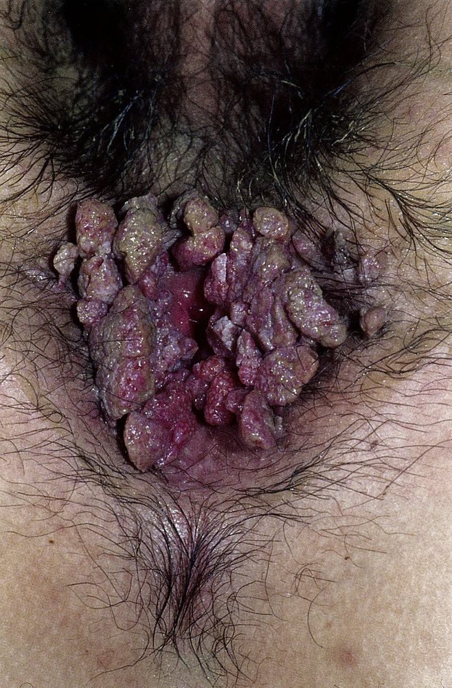
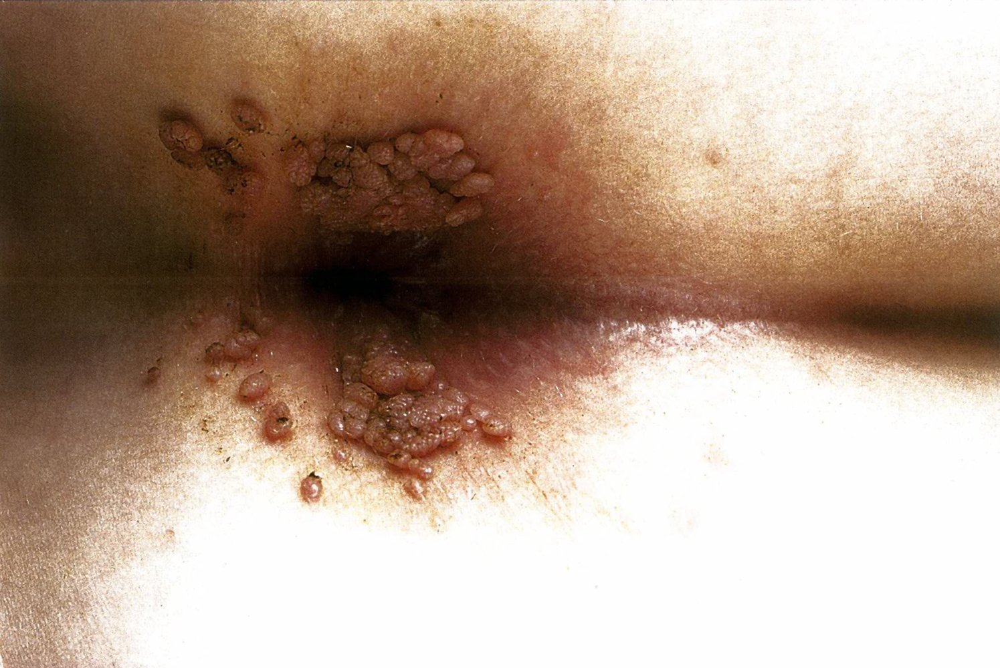
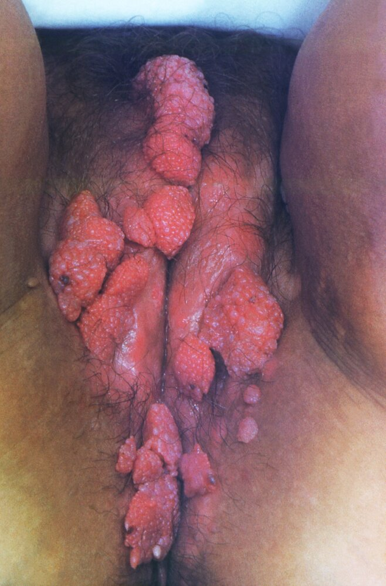
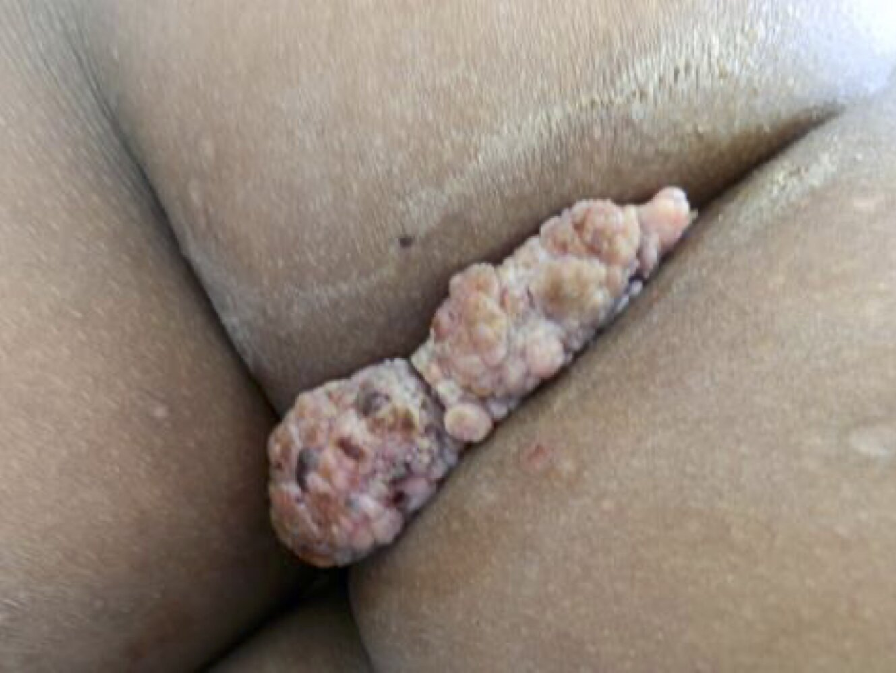

# Anogenital warts

*Categories: Clinical knowledge > Pediatrics > Pediatric dermatology > Anogenital warts*

[Original Article Link](https://coursology-qbank.com/amboss/article/GE0BC3)

---

## Summary

Anogenital <u>warts</u> are flat or <u>pedunculated</u> <u>exophytic</u> lesions on the anogenital <u>mucosa</u> or perineal <u>skin</u> caused by the <u>human papillomavirus</u> (<u>HPV</u>). Transmission is primarily sexual, but nonsexual transmission can occur. Lesions are often asymptomatic but can cause itching or <u>pain</u>. Diagnosis is clinical; <u>biopsy</u> may be considered in the case of diagnostic uncertainty. Treatment options include topical agents (e.g., <u>imiquimod</u>, podofilox), <u>cryotherapy</u>, surgical removal, and laser therapy, tailored to patient preference and the size and number of <u>warts</u>. <u>HPV infection</u> is difficult to eradicate; the risk of transmission and recurrence of <u>warts</u> persists even after treatment. <u>HPV</u> prevention with the <u>HPV vaccine</u> is the most effective preventive measure.

See also “<u>HPV infection</u>” and “<u>Cutaneous warts</u>.”

---

## Etiology

* <u>Pathogen</u>: <u>HPV types that infect the mucosal epithelium</u> (e.g., <u>HPV</u> types 6 and 11) [[2]](https://coursology-qbank.com/amboss/article/d3dohp0)[[3]](https://coursology-qbank.com/amboss/article/thdXfp0)[[4]](https://coursology-qbank.com/amboss/article/2NcT010)

* Routes of transmission [[2]](https://coursology-qbank.com/amboss/article/d3dohp0)

* Sexual [[3]](https://coursology-qbank.com/amboss/article/thdXfp0)

* Nonsexual (e.g., <u>skin</u>-to-<u>skin</u> contact)

* See also “<u>Risk factors for HPV infection</u>.”

> [!TIP]
> <u>HPV</u> types 6 and 11 cause ∼ 90% of anogenital <u>warts</u>. [[2]](https://coursology-qbank.com/amboss/article/d3dohp0)[[3]](https://coursology-qbank.com/amboss/article/thdXfp0)[[4]](https://coursology-qbank.com/amboss/article/2NcT010)

---

## Clinical features

* Flat, <u>papular</u>, or <u>pedunculated</u> <u>exophytic</u>, cauliflower-like lesions

* Located on any part of the anogenital <u>mucosa</u> (e.g., <u>glans penis</u>, <u>vagina</u>, <u>cervix</u>, <u>anal canal</u>) and/or perineal <u>skin</u>

* Typically asymptomatic; occasionally cause <u>pruritus</u> or <u>pain</u>

Anogenital warts (condylomata acuminata)

Anogenital warts (condylomata acuminata)

Condylomata acuminata

Anogenital warts (condylomata acuminata)

---

## Diagnosis

* Primarily clinical

* <u>Acetowhitening</u> may aid visualization (nonspecific; not routinely recommended). [[1]](https://coursology-qbank.com/amboss/article/V3dGhp0)[[4]](https://coursology-qbank.com/amboss/article/2NcT010)

* Perform <u>pelvic examination</u>, <u>digital rectal examination</u>, and/or <u>anoscopy</u> as needed.  [[4]](https://coursology-qbank.com/amboss/article/2NcT010)

* Indications for <u>biopsy</u> [[1]](https://coursology-qbank.com/amboss/article/V3dGhp0)[[4]](https://coursology-qbank.com/amboss/article/2NcT010)

* Diagnostic uncertainty

* <u>Immunocompromised state</u> (e.g., due to <u>HIV infection</u>)

* Atypical features

* Lesions that worsen or do not improve with treatment

* Exophyic cervical <u>warts</u>

* Refractory lesions: Consider <u>syphilis testing</u> to rule out <u>condyloma lata</u>. [[4]](https://coursology-qbank.com/amboss/article/2NcT010)

> [!TIP]
> <u>HPV testing</u> is not recommended for genital <u>warts</u>, as results are nonspecific and do not alter management. [[4]](https://coursology-qbank.com/amboss/article/2NcT010)

---

## Differential diagnoses

* Other sexually transmitted <u>genital lesions</u> (e.g., <u>condyloma lata</u>)

* <u>Skin tags</u>

* <u>Molluscum contagiosum</u>

* <u>Seborrheic keratosis</u>

* Intraepithelial <u>neoplasia</u> (e.g., <u>bowenoid papulosis</u>)

* <u>Malignancy</u>

### Bowenoid papulosis

<u>Bowenoid papulosis</u> is an <u>HSIL</u> that resembles <u>squamous cell carcinoma in situ</u> on <u>histology</u>. Compared to <u>Bowen disease</u>, it tends to occur in younger individuals and has a lower risk of malignant transformation. [[5]](https://coursology-qbank.com/amboss/article/8W1OMf0)[[6]](https://coursology-qbank.com/amboss/article/iDWJVn0)

* Etiology: : most commonly <u>HPV 16</u> [[5]](https://coursology-qbank.com/amboss/article/8W1OMf0)[[6]](https://coursology-qbank.com/amboss/article/iDWJVn0)[[7]](https://coursology-qbank.com/amboss/article/T4d6iJ0)

* <u>Epidemiology</u>: most common in men 20–40 years of age [[7]](https://coursology-qbank.com/amboss/article/T4d6iJ0)[[8]](https://coursology-qbank.com/amboss/article/NQd-wp0)

* Clinical features: multiple flat, red-brown <u>macules</u> and <u>papules</u> typically located in the anogenital region  [[6]](https://coursology-qbank.com/amboss/article/iDWJVn0)

* Diagnostics: : Diagnosis is based on clinical features and <u>biopsy</u> findings. [[8]](https://coursology-qbank.com/amboss/article/NQd-wp0)[[9]](https://coursology-qbank.com/amboss/article/f3dk3p0)

* <u>Dermoscopy</u> may aid visualization. [[10]](https://coursology-qbank.com/amboss/article/g4dFiJ0)

* <u>Biopsy</u> is recommended in all patients to rule out differential diagnosis (e.g., <u>squamous cell carcinoma in situ</u>).  [[8]](https://coursology-qbank.com/amboss/article/NQd-wp0)

* Treatment [[7]](https://coursology-qbank.com/amboss/article/T4d6iJ0)[[9]](https://coursology-qbank.com/amboss/article/f3dk3p0)

* Options are similar to those for treatment of anogenital <u>warts</u>, e.g.:

* Topical therapy

* <u>Ablation</u>

* Excision

* Reassess patients 3–6 months after treatment to evaluate for recurrence.

* Prognosis [[7]](https://coursology-qbank.com/amboss/article/T4d6iJ0)

* Spontaneous resolution is uncommon but can occur.

* Recurrence is common.

* Increased risk of penile <u>SCC</u> and <u>cervical intraepithelial neoplasia</u>  [[11]](https://coursology-qbank.com/amboss/article/nQd79p0)

> [!TIP]
> Correlate <u>biopsy</u> findings with clinical features, as <u>histopathology</u> findings of <u>Erythroplasia of Queyrat</u>, <u>Bowen disease</u>, and <u>Bowenoid papulosis</u> can be difficult to distinguish from one another. [[8]](https://coursology-qbank.com/amboss/article/NQd-wp0)

### Flat condylomata

<u>Flat condylomata</u> are also referred to as flat penile lesions in individuals with male genitalia, and <u>LSIL</u> of the <u>vulva</u> in individuals with female genitalia.

* Etiology: <u>mucosal HPV types</u>, including <u>high-risk HPV</u> [[12]](https://coursology-qbank.com/amboss/article/JQdsCp0)

* Clinical features [[11]](https://coursology-qbank.com/amboss/article/nQd79p0)

* Flat, white-brown, slightly elevated lesions in the anogenital region

* May be asymptomatic or manifest with itching, burning, and/or <u>dyspareunia</u>

* Diagnostics

* Diagnosis is clinical; <u>acetowhitening</u> may aid visualization of subclinical lesions. [[12]](https://coursology-qbank.com/amboss/article/JQdsCp0)

* Consider <u>biopsy</u> in the case of diagnostic uncertainty; findings include low-grade intraepithelial lesions. [[13]](https://coursology-qbank.com/amboss/article/1kd25J0)[[14]](https://coursology-qbank.com/amboss/article/rQdfxp0)

* Management

* Consider <u>watchful waiting</u>; most lesions regress within 1–2 years. [[13]](https://coursology-qbank.com/amboss/article/1kd25J0)[[15]](https://coursology-qbank.com/amboss/article/qQdCCp0)

* Treatment of symptomatic patients is the same as treatment of anogenital <u>warts</u>. [[11]](https://coursology-qbank.com/amboss/article/nQd79p0)

The differential diagnoses listed here are not exhaustive.

---

## Management

Determine management using <u>shared decision-making</u>, considering size and distribution <u>warts</u>, associated symptoms, and patient preferences. For management in children and in pregnant and <u>immunocompromised individuals</u>, see “Special patient groups.”

### General principles [[4]](https://coursology-qbank.com/amboss/article/2NcT010)

* Treatment options include topical and procedural therapies.

* Consider <u>watchful waiting</u> based on patient preference.

* Offer <u>STI testing</u> to detect concomitant infections.

* Advise patients to notify current sexual partners of diagnosis.

* Counsel patients that:

* Recurrence of anogenital <u>warts</u> is common.

* Female individuals with genital <u>warts</u> do not require more frequent <u>screening for cervical cancer</u>.  [[4]](https://coursology-qbank.com/amboss/article/2NcT010)

* <u>Condom</u> use may prevent transmission of genital <u>warts</u>.

* Follow up at 3 months to evaluate treatment response.

> [!WARNING]
> <u>HPV infection</u> is difficult to eradicate. After treatment for anogenital <u>warts</u>, there is still a risk of transmission to sexual partners and a risk of recurrence. [[4]](https://coursology-qbank.com/amboss/article/2NcT010)

> [!TIP]
> <u>HPV testing</u> of sexual partners is not recommended. Partners are likely to already have <u>HPV infection</u>, even if asymptomatic, and testing does not alter management. [[4]](https://coursology-qbank.com/amboss/article/2NcT010)

### Patient-administered topical therapy [[2]](https://coursology-qbank.com/amboss/article/d3dohp0)[[4]](https://coursology-qbank.com/amboss/article/2NcT010)

The following options are suitable for external anogenital <u>warts</u>. There is no evidence to support the benefit of one treatment option over another; use <u>shared decision-making</u>.

* <u>Imiquimod</u> cream DOSAGE [[2]](https://coursology-qbank.com/amboss/article/d3dohp0)[[4]](https://coursology-qbank.com/amboss/article/2NcT010)[[16]](https://coursology-qbank.com/amboss/article/l3dvip0)

* Podofilox solution or gel DOSAGE [[2]](https://coursology-qbank.com/amboss/article/d3dohp0)[[4]](https://coursology-qbank.com/amboss/article/2NcT010)[[16]](https://coursology-qbank.com/amboss/article/l3dvip0)

* <u>Sinecatechins</u> 15% ointment DOSAGE  [[2]](https://coursology-qbank.com/amboss/article/d3dohp0)[[4]](https://coursology-qbank.com/amboss/article/2NcT010)[[16]](https://coursology-qbank.com/amboss/article/l3dvip0)

> [!WARNING]
> Topical application of <u>imiquimod</u> and <u>sinecatechins</u> may reduce the <u>efficacy</u> of <u>barrier contraception</u>; inform patients of this risk and provide alternative <u>contraception</u> as needed. [[4]](https://coursology-qbank.com/amboss/article/2NcT010)

#### Provider-administered therapies [[2]](https://coursology-qbank.com/amboss/article/d3dohp0)[[4]](https://coursology-qbank.com/amboss/article/2NcT010)

Depending on the location of the <u>warts</u>, specialist referral (e.g., <u>gynecologist</u>, colorectal specialist, urologist) is recommended. Treatment may be combined with patient-administered topical therapy.

* For internal or external anogenital <u>warts</u>

* Topical <u>trichloroacetic acid</u> (<u>TCA</u>) OR bichloroacetic acid (BCA)  [[4]](https://coursology-qbank.com/amboss/article/2NcT010)

* <u>Cryotherapy</u>

* CO2laser <u>surgery</u>

* Electrocautery

* Tangential excision

* For urethral meatus <u>warts</u>  

* <u>Cryotherapy</u>

* Surgical excision

> [!WARNING]
> To prevent aerosolized transmission of <u>HPV</u> to the <u>upper respiratory tract</u>, perform electrocauterization of <u>warts</u> in an adequately ventiled area with appropriate <u>PPE</u> (e.g., N95 or above grade <u>respirator</u>). [[17]](https://coursology-qbank.com/amboss/article/KQdUCp0)

---

## Special patient groups

### Anogenital <u>warts</u> in <u>pregnancy</u> [[4]](https://coursology-qbank.com/amboss/article/2NcT010)[[16]](https://coursology-qbank.com/amboss/article/l3dvip0)

Anogenital <u>warts</u> may increase in number and become <u>friable</u> during <u>pregnancy</u>. [[4]](https://coursology-qbank.com/amboss/article/2NcT010)

* Diagnostics: similar to <u>diagnostics for anogenital warts</u> in nonpregnant individuals

* Treatment

* Consider delaying treatment until after delivery.  [[4]](https://coursology-qbank.com/amboss/article/2NcT010)

* The following options are considered safe during <u>pregnancy</u>: [[4]](https://coursology-qbank.com/amboss/article/2NcT010)[[16]](https://coursology-qbank.com/amboss/article/l3dvip0)

* Topical <u>TCA</u> or BCA   [[2]](https://coursology-qbank.com/amboss/article/d3dohp0)[[4]](https://coursology-qbank.com/amboss/article/2NcT010)[[16]](https://coursology-qbank.com/amboss/article/l3dvip0)

* <u>Cryotherapy</u>

* Surgical <u>ablation</u> or excision   [[16]](https://coursology-qbank.com/amboss/article/l3dvip0)

* Obstetric management [[4]](https://coursology-qbank.com/amboss/article/2NcT010)[[16]](https://coursology-qbank.com/amboss/article/l3dvip0)

* Genital <u>warts</u> are not a routine indication for <u>cesarean delivery</u>.  [[4]](https://coursology-qbank.com/amboss/article/2NcT010)

* Consider <u>cesarean delivery</u> if:

* <u>Warts</u> are large enough to potentially obstruct <u>normal vaginal delivery</u> (e.g., <u>giant condylomata</u>)

* There is a risk of significant bleeding

* Complications: risk of transmission of <u>HPV</u>, including to the <u>infant</u>'s respiratory tract (juvenile <u>recurrent respiratory papillomatosis</u>)  [[4]](https://coursology-qbank.com/amboss/article/2NcT010)

* Prevention considerations: <u>HPV vaccines</u> are not recommended during <u>pregnancy</u>.  [[4]](https://coursology-qbank.com/amboss/article/2NcT010)[[16]](https://coursology-qbank.com/amboss/article/l3dvip0)[[18]](https://coursology-qbank.com/amboss/article/N3d-ip0)

> [!WARNING]
> Topical <u>imiquimod</u>, <u>sinecatechins</u>, and podofilox should not be used in <u>pregnancy</u>. [[4]](https://coursology-qbank.com/amboss/article/2NcT010)[[16]](https://coursology-qbank.com/amboss/article/l3dvip0)

### Anogenital warts in children [[4]](https://coursology-qbank.com/amboss/article/2NcT010)[[19]](https://coursology-qbank.com/amboss/article/Bedza60)

* Routes of transmission

* Sexual

* Nonsexual (e.g., <u>perinatal</u> maternal-<u>infant</u> transmission, <u>autoinoculation</u>, <u>skin</u> contact, <u>fomites</u>) [[19]](https://coursology-qbank.com/amboss/article/Bedza60)[[20]](https://coursology-qbank.com/amboss/article/Q4duQJ0)

* Management [[19]](https://coursology-qbank.com/amboss/article/Bedza60)

* Assess all prepubertal children for possible <u>child sexual abuse</u> (see “<u>Approach to suspected child maltreatment</u>).  [[19]](https://coursology-qbank.com/amboss/article/Bedza60)

* Consider <u>watchful waiting</u>, as most lesions resolve spontaneously within a few years. [[20]](https://coursology-qbank.com/amboss/article/Q4duQJ0)

* Treatment options are similar to adults, e.g.: [[19]](https://coursology-qbank.com/amboss/article/Bedza60)[[21]](https://coursology-qbank.com/amboss/article/6QdjCp0)

* <u>Off-label use</u> of topical therapies (e.g., <u>imiquimod</u>, podofilox)

* <u>Cryotherapy</u>, laser, or surgical excision

### Anogenital <u>warts</u> in <u>immunocompromised individuals</u> [[4]](https://coursology-qbank.com/amboss/article/2NcT010)[[16]](https://coursology-qbank.com/amboss/article/l3dvip0)

<u>Immunocompromised individuals</u> are at an increased risk of multiple and/or large <u>condylomata</u> that may be refractory to treatment.

* Consider <u>biopsy</u> to confirm the diagnosis before treatment.  [[4]](https://coursology-qbank.com/amboss/article/2NcT010)

* Management mirrors that of immunocompetent individuals; however, <u>sinecatechins</u> are not recommended.  [[2]](https://coursology-qbank.com/amboss/article/d3dohp0)[[4]](https://coursology-qbank.com/amboss/article/2NcT010)[[16]](https://coursology-qbank.com/amboss/article/l3dvip0)

* See also “<u>Giant condylomata</u>.”

---

## Prevention

* See “<u>Prevention of HPV infection</u>” and “<u>Prevention of STIs</u>.”

* Advise patients on <u>smoking cessation</u>.  [[24]](https://coursology-qbank.com/amboss/article/pQdLCp0)

---