# Atopic dermatitis

*Categories: Clinical knowledge > Pediatrics > Pediatric dermatology > Atopic dermatitis*

[Original Article Link](https://coursology-qbank.com/amboss/article/A40RNT)

---

## Summary

<u>Atopic</u> dermatitis (AD), also known as <u>atopic</u> <u>eczema</u>, is a chronic inflammatory <u>skin</u> condition that most commonly manifests in early childhood and can persist into adulthood. <u>Risk factors</u> include a personal and/or <u>family history</u> of <u>atopy</u>, genetic mutations in the <u>filaggrin gene</u>, and environmental factors. Major clinical features include a chronic and/or relapsing course, intense <u>pruritus</u>, and typical <u>eczematous</u> <u>skin</u> lesions that follow age-specific distribution patterns (e.g., face and extensor surfaces in <u>infants</u> and flexural surfaces and creases in older individuals). Triggers (e.g., dust <u>mites</u>, heat, dry climate, <u>skin</u> irritation) can exacerbate and/or induce flares. The diagnosis is typically made clinically. Diagnostic studies are reserved for diagnostic uncertainty, a suspected allergic trigger, and/or a suspected alternative diagnosis. Management is based on <u>AD severity</u> and comprises supportive <u>skin care for AD</u>, trigger avoidance, topical pharmacological treatment (e.g., <u>corticosteroids</u>, <u>calcineurin inhibitors</u>), and advanced dermatology treatments (e.g., topical <u>Janus kinase inhibitors</u>, systemic pharmacological treatment). <u>Exclusive breastfeeding</u> for the first 3–4 months may decrease the risk of developing AD.

---

## Epidemiology

* <u>Prevalence</u>: Approx. 8–12% of children and 6–9% of adults are affected. [[1]](https://coursology-qbank.com/amboss/article/z1XrjC)[[2]](https://coursology-qbank.com/amboss/article/-1XDjC)[[3]](https://coursology-qbank.com/amboss/article/ZWXZPC)

* Age of onset: typically before 1 year of age [[4]](https://coursology-qbank.com/amboss/article/czda7s0)

Epidemiological data refers to the US, unless otherwise specified.

---

## Etiology

The etiology of AD is not completely understood.

### Risk factors for AD

* <u>Atopy</u> (personal and/or <u>family history</u>) ;  [[5]](https://coursology-qbank.com/amboss/article/vWXAMC)[[6]](https://coursology-qbank.com/amboss/article/UIdbXr0)

* Atopic triad: a triad of <u>asthma</u>, <u>allergic rhinitis</u>, and atopic dermatitis linked to <u>allergen</u>-triggered <u>IgE</u>-mast cell activation

* <u>Food allergies</u> [[5]](https://coursology-qbank.com/amboss/article/vWXAMC)

* <u>Urticaria</u>

* Genetic factors: <u>Loss-of-function mutations</u> in the <u>FLG</u> <u>gene</u> lead to a deficiency of filaggrin, an <u>epidermal</u> protein that plays a role in the <u>skin</u>'s barrier function. [[5]](https://coursology-qbank.com/amboss/article/vWXAMC)[[6]](https://coursology-qbank.com/amboss/article/UIdbXr0)

* Environmental factors

* Living in an urban setting  [[3]](https://coursology-qbank.com/amboss/article/ZWXZPC)[[5]](https://coursology-qbank.com/amboss/article/vWXAMC)

* Living in a region with low UV-light exposure [[6]](https://coursology-qbank.com/amboss/article/UIdbXr0)[[7]](https://coursology-qbank.com/amboss/article/q8dCn70)

* Small family size (may be related to low microbial exposure in childhood) [[3]](https://coursology-qbank.com/amboss/article/ZWXZPC)[[5]](https://coursology-qbank.com/amboss/article/vWXAMC)

> [!TIP]
> Genetic <u>risk factors</u> are strongly associated with AD. [[3]](https://coursology-qbank.com/amboss/article/ZWXZPC)[[5]](https://coursology-qbank.com/amboss/article/vWXAMC)

### Triggers for AD [[3]](https://coursology-qbank.com/amboss/article/ZWXZPC)

* Environmental <u>allergens</u>

* Dust <u>mites</u> [[5]](https://coursology-qbank.com/amboss/article/vWXAMC)

* Animal dander

* Pollen

* Environmental conditions

* Heat

* Dry or humid climate

* <u>Stress</u>

* <u>Skin</u> irritation

* Air pollutants (e.g., particulate matter, nitrogen oxide, <u>carbon monoxide</u>) [[8]](https://coursology-qbank.com/amboss/article/Srdygr0)

> [!TIP]
> Triggers can induce AD flares. [[3]](https://coursology-qbank.com/amboss/article/ZWXZPC)[[5]](https://coursology-qbank.com/amboss/article/vWXAMC)

---

## Pathophysiology

Multiple complex mechanisms are involved in the manifestation of AD, but the pathophysiology is not fully understood. [[9]](https://coursology-qbank.com/amboss/article/Gt1BUi0)[[10]](https://coursology-qbank.com/amboss/article/Ct1qfi0)

* <u>Epidermal</u> barrier dysfunction (due to <u>filaggrin</u> deficiency and decreased <u>ceramide</u> levels) → loss of moisture (i.e., transepidermal water loss) → dry <u>skin</u>

* Increased water loss

* Microbiome imbalance

* Increased risk of secondary infections

* Triggering of inflammatory processes

* Increased <u>skin</u> <u>pH</u>

* <u>Immune cell</u> infiltration

* Inflammation of the <u>skin</u> → severe <u>pruritus</u>

* Promotion of <u>IgE</u>-mediated hypersensitivity

* Triggering of <u>epidermal</u> barrier dysfunction

* Increased <u>T-cell</u> infiltration

* Imbalance of <u>Th2</u> to <u>Th1 cytokines</u>

* Increased <u>Th2-cell</u>-mediated response

* Increased <u>antigen</u> presentation

* Imbalance in genetic expression of regulatory and inflammatory protein

---

## Clinical features

### Essential features of AD [[4]](https://coursology-qbank.com/amboss/article/czda7s0)[[5]](https://coursology-qbank.com/amboss/article/vWXAMC)[[11]](https://coursology-qbank.com/amboss/article/oJd0EI0)[[12]](https://coursology-qbank.com/amboss/article/Cndqvq0)

* <u>Pruritus</u>

* Often the most bothersome symptom

* Frequently triggers an itch-scratch cycle

* <u>Eczematous</u> <u>skin</u> lesions

* AD in lightly pigmented <u>skin</u>: <u>erythematous</u> or <u>skin</u>-colored dry patches and/or <u>plaques</u>

* AD in skin of color   [[4]](https://coursology-qbank.com/amboss/article/czda7s0)[[13]](https://coursology-qbank.com/amboss/article/4Id31r0)[[14]](https://coursology-qbank.com/amboss/article/hrdcSr0)

* Less visible <u>erythema</u>; possibly <u>skin</u>-colored, violaceous, or brown <u>papules</u>, patches, or <u>plaques</u> [[6]](https://coursology-qbank.com/amboss/article/UIdbXr0)

* Commonly manifests as follicular eczema: rough, dry <u>papules</u>, often uniformly spaced around the <u>hair follicles</u> within the affected area

* Prominent postinflammatory pigmentation changes

* Increased severity [[4]](https://coursology-qbank.com/amboss/article/czda7s0)

* Cutaneous findings of chronic involvement: circumscribed lesions, <u>lichenification</u>, fissures

* Age-specific distribution patterns 

* Infantile AD (age < 1 year) [[5]](https://coursology-qbank.com/amboss/article/vWXAMC)[[6]](https://coursology-qbank.com/amboss/article/UIdbXr0)[[12]](https://coursology-qbank.com/amboss/article/Cndqvq0)

* Face (especially the cheeks), scalp, and neck

* Extensor surfaces of the extremities

* Trunk

* Typically spares the diaper area

* Adults and children [[15]](https://coursology-qbank.com/amboss/article/Wk1P5S0)

* Flexural surfaces of the extremities (e.g., ankles, wrists)

* Flexural creases (e.g., <u>antecubital fossa</u>, <u>popliteal fossa</u>)   [[12]](https://coursology-qbank.com/amboss/article/Cndqvq0)

* <u>Adolescents</u> and adults: hands and feet often involved  [[6]](https://coursology-qbank.com/amboss/article/UIdbXr0)

* Chronic and/or relapsing course

* Symptoms fluctuate over time (e.g., alternating periods of flares and remission).

* Typically begins in childhood and may persist for years

> [!TIP]
> <u>Atopic</u> dermatitis rarely affects the diaper area due to the diaper’s occlusive nature and the increased moisture in this region. [[16]](https://coursology-qbank.com/amboss/article/fIdkXr0)

### Important features of AD [[4]](https://coursology-qbank.com/amboss/article/czda7s0)[[5]](https://coursology-qbank.com/amboss/article/vWXAMC)[[11]](https://coursology-qbank.com/amboss/article/oJd0EI0)[[12]](https://coursology-qbank.com/amboss/article/Cndqvq0)

* Onset typically < 12 months of age [[17]](https://coursology-qbank.com/amboss/article/WqdPxI0)

* Personal and/or <u>family history</u> of <u>atopy</u>

* <u>Xerosis</u>

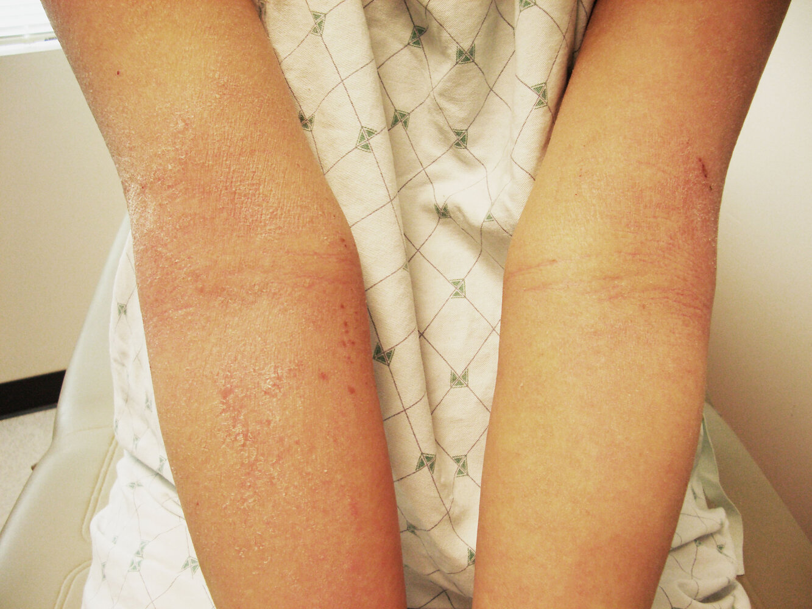

Atopic dermatitis

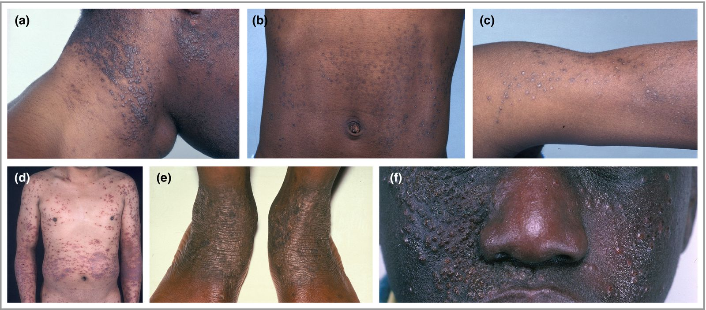

Eczema on various skin types

Atopic dermatitis 

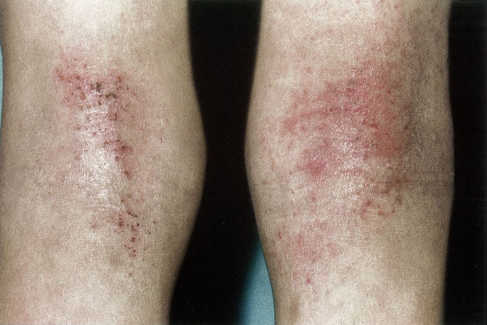

Atopic dermatitis

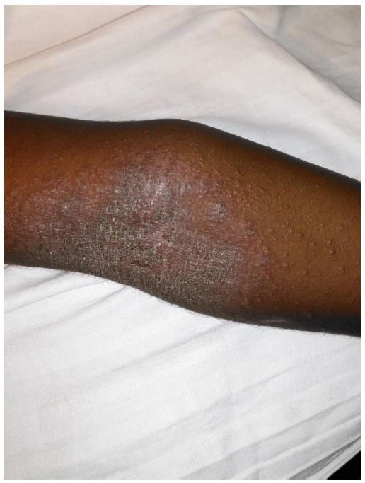

Atopic dermatitis

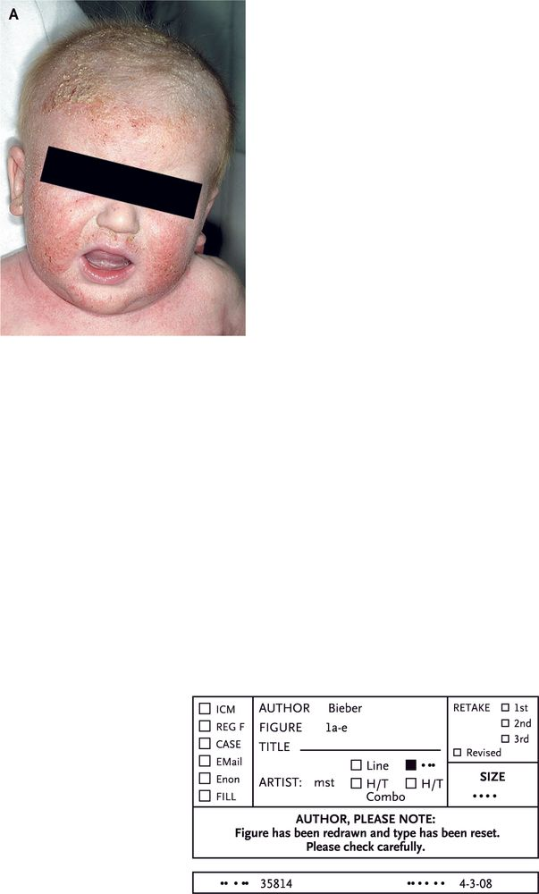

Infantile atopic dermatitis

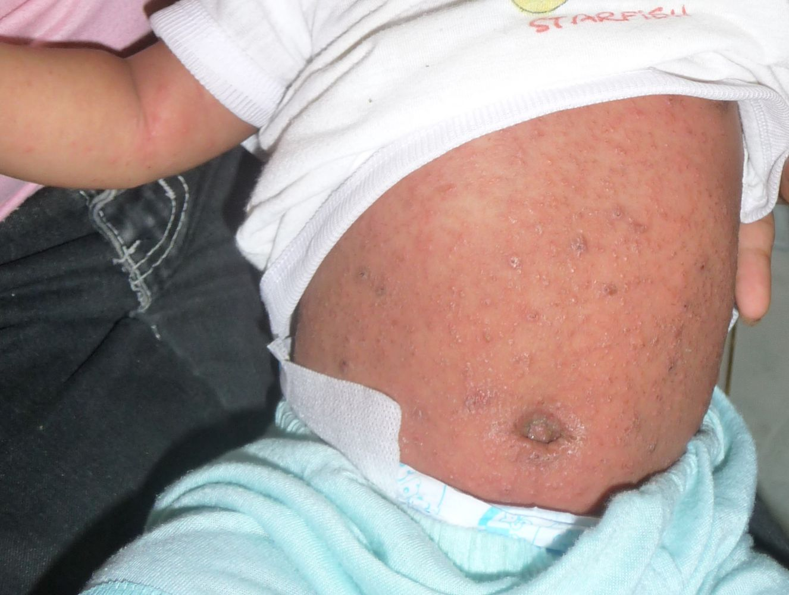

Atopic dermatitis

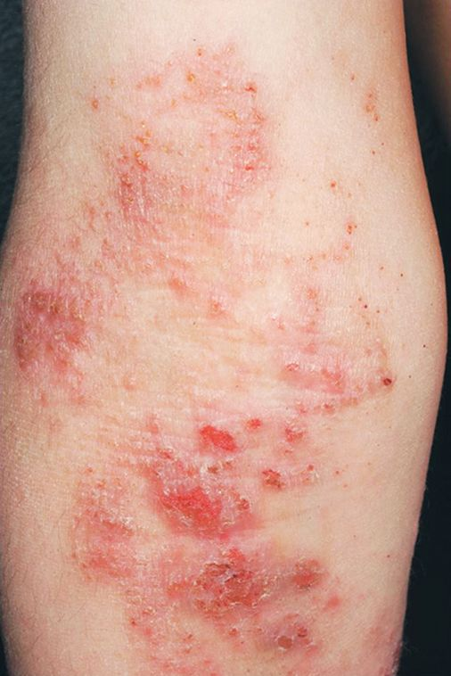

Atopic dermatitis

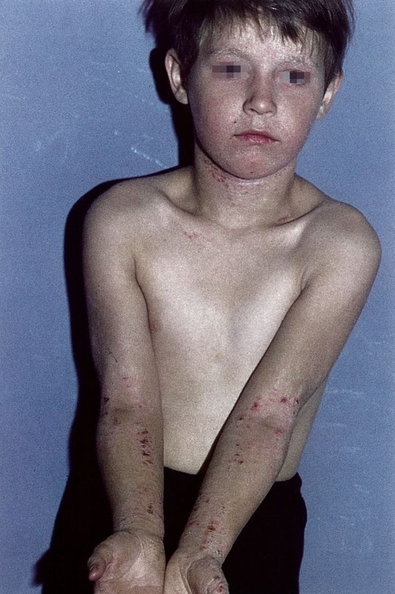

Atopic dermatitis

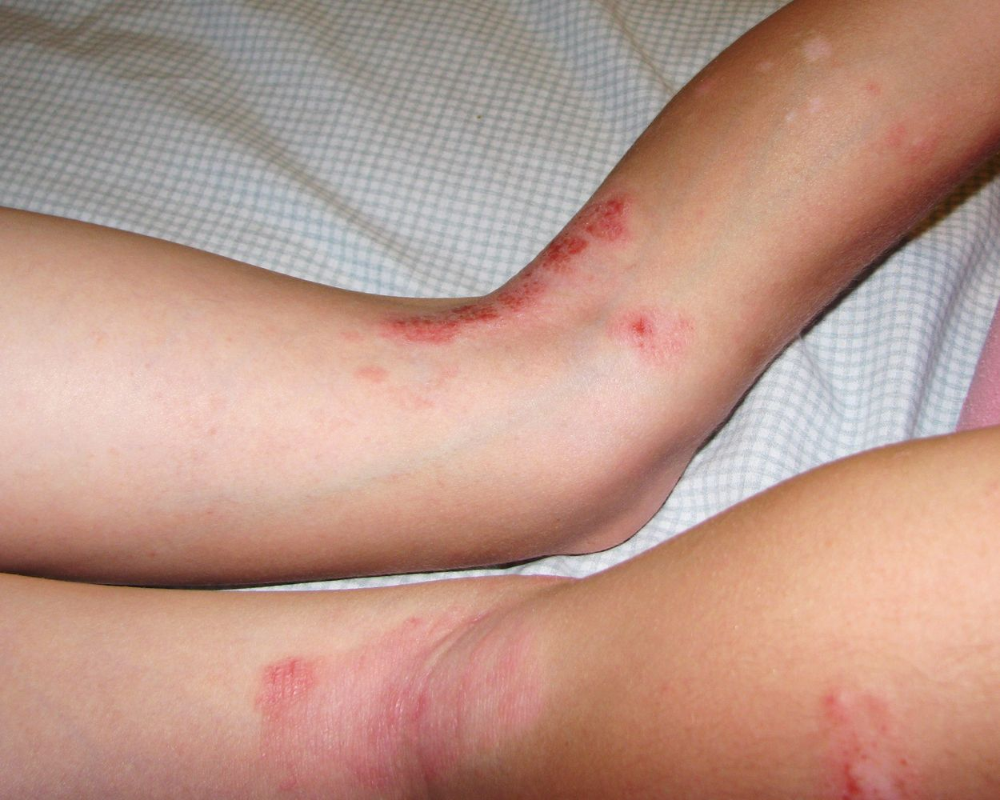

Atopic dermatitis

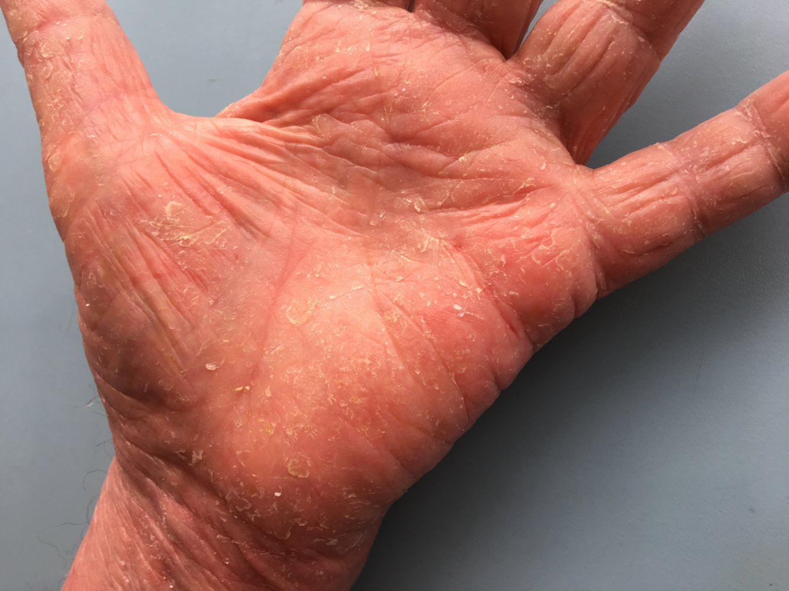

Atopic dermatitis

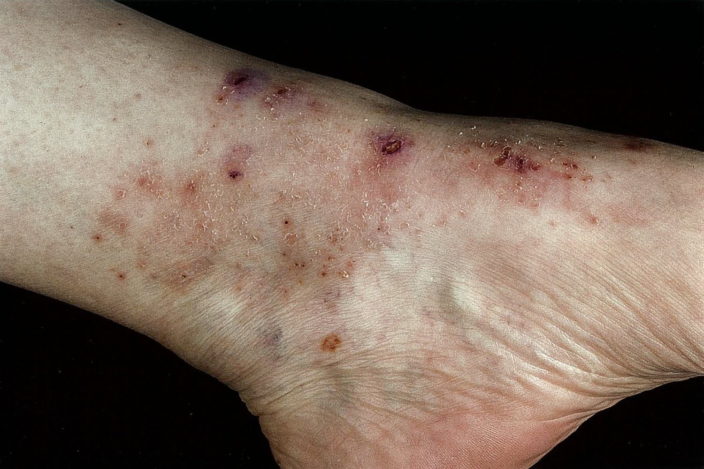

Atopic dermatitis

### Conditions associated with AD [[4]](https://coursology-qbank.com/amboss/article/czda7s0)[[11]](https://coursology-qbank.com/amboss/article/oJd0EI0)[[12]](https://coursology-qbank.com/amboss/article/Cndqvq0)

The following nonspecific features and/or comorbidities are more common in individuals with AD.

* Other <u>atopic</u> conditions (e.g., <u>allergic rhinitis</u>, <u>asthma</u>)

* Periorbital features of chronic <u>atopy</u> 

* <u>Hertoghe sign</u>

* Dennie-Morgan fold: pronounced <u>skin</u> folds below the <u>eye</u>

* <u>Allergic shiners</u>

* Immune-mediated conditions (e.g., <u>alopecia areata</u>)

* <u>Keratosis pilaris</u>

* <u>Ichthyosis vulgaris</u>

* <u>Hyperlinear palms</u>

* Lip dermatitis (e.g., <u>eczematous</u> <u>cheilitis</u>)

* <u>Pityriasis alba</u>

* <u>Dermatographism</u>

* White dermatographism: transient blanching of <u>skin</u> after <u>skin</u> stroking  

* Caused by cutaneous <u>vasoconstriction</u>

* Normal variant, but more common in patients with atopic dermatitis

* <u>Nummular dermatitis</u>

* ↑ Serum <u>IgE</u> (if discovered incidentally)

---

## Differential diagnoses

* <u>Seborrheic dermatitis</u>: Lesions are usually dry in <u>atopic</u> dermatitis and greasy in <u>seborrheic dermatitis</u>. [[18]](https://coursology-qbank.com/amboss/article/1WX24C)

* <u>Psoriasis</u> [[19]](https://coursology-qbank.com/amboss/article/S8XyN-)

* Onset is generally after <u>adolescence</u>.

* Lesions are typically covered with white or silvery scales and are commonly located on the extensor surface of extremities.

* Other <u>eczematous</u> diseases [[20]](https://coursology-qbank.com/amboss/article/pqXLz_)

* <u>Contact dermatitis</u> (e.g., allergic contact <u>eczema</u>)

* <u>Nummular dermatitis</u>

* Infections and <u>infestations</u> [[19]](https://coursology-qbank.com/amboss/article/S8XyN-)

* Mycoses

* <u>Scabies</u>

* Other

* <u>Photosensitivity</u>

* <u>Cutaneous T-cell lymphoma</u>

The differential diagnoses listed here are not exhaustive.

---

## Management

### Approach [[4]](https://coursology-qbank.com/amboss/article/czda7s0)[[11]](https://coursology-qbank.com/amboss/article/oJd0EI0)[[12]](https://coursology-qbank.com/amboss/article/Cndqvq0)[[21]](https://coursology-qbank.com/amboss/article/OzdIGs0)

* For active lesions, initiate appropriate <u>AD flare management</u>.

* For persistent <u>pruritus</u>, consider oral <u>antihistamines</u> (see "<u>Symptomatic management of pruritus in AD</u>").

* Assess for <u>indications for specialist referral for AD</u>.

* Educate patients and caregivers on the following:

* The chronic nature of AD

* The need for ongoing <u>maintenance management of AD</u>

* Provide a written <u>atopic</u> dermatitis action plan (see “Tips and links” for examples) to improve adherence. [[4]](https://coursology-qbank.com/amboss/article/czda7s0)[[11]](https://coursology-qbank.com/amboss/article/oJd0EI0)[[12]](https://coursology-qbank.com/amboss/article/Cndqvq0)

### Supportive care for AD

#### Skin care for AD [[4]](https://coursology-qbank.com/amboss/article/czda7s0)[[11]](https://coursology-qbank.com/amboss/article/oJd0EI0)[[12]](https://coursology-qbank.com/amboss/article/Cndqvq0)

Advise the patient and/or caregiver of the following:

* Bathe once daily for 5–10 minutes using hypoallergenic cleansers.  [[4]](https://coursology-qbank.com/amboss/article/czda7s0)[[12]](https://coursology-qbank.com/amboss/article/Cndqvq0)

* Pat the <u>skin</u> with a towel after bathing.

* Apply an over-the-counter fragrance-free <u>emollient</u>.  [[4]](https://coursology-qbank.com/amboss/article/czda7s0)[[11]](https://coursology-qbank.com/amboss/article/oJd0EI0)[[12]](https://coursology-qbank.com/amboss/article/Cndqvq0) 

* At least 1–2 times daily

* Ideally, within 3 minutes after bathing

* Avoid scratching the affected <u>skin</u> to avoid perpetuating an itch-scratch cycle.

> [!WARNING]
> <u>Elimination diets</u> are not recommended for <u>atopic</u> dermatitis of any severity. [[11]](https://coursology-qbank.com/amboss/article/oJd0EI0)

> [!WARNING]
> Topical <u>antihistamines</u> are not recommended for <u>pruritus</u> due to an increased risk for adverse effects (e.g., <u>contact dermatitis</u>). [[12]](https://coursology-qbank.com/amboss/article/Cndqvq0)

#### <u>Management of pruritus</u> [[4]](https://coursology-qbank.com/amboss/article/czda7s0)[[12]](https://coursology-qbank.com/amboss/article/Cndqvq0)

Consider symptomatic management of pruritus in AD if <u>pruritus</u> is not controlled with <u>supportive care</u> and flare management.

* Children (<u>off-label</u> for isolated <u>pruritus</u>) or individuals with comorbid allergic conditions : an oral <u>second-generation antihistamine</u>, e.g., <u>cetirizine</u> ; ; ; DOSAGE  [[4]](https://coursology-qbank.com/amboss/article/czda7s0)

* Adults with <u>pruritus</u> that causes <u>sleep loss</u>: Consider an oral sedating <u>first-generation antihistamine</u>, e.g., 

* <u>Diphenhydramine</u> (<u>off-label</u>) DOSAGE

* <u>Hydroxyzine</u>. DOSAGE  [[4]](https://coursology-qbank.com/amboss/article/czda7s0)[[12]](https://coursology-qbank.com/amboss/article/Cndqvq0)

#### Wet wrap therapy [[4]](https://coursology-qbank.com/amboss/article/czda7s0)[[11]](https://coursology-qbank.com/amboss/article/oJd0EI0)[[12]](https://coursology-qbank.com/amboss/article/Cndqvq0)[[21]](https://coursology-qbank.com/amboss/article/OzdIGs0)

* Indications: considered for acute flares of refractory moderate-to-severe AD

* Method

* Apply an <u>emollient</u>, possibly following application of a low or <u>mid-potency TCS</u>, to the affected area.

* Cover with a moistened bandage (e.g., cotton, gauze) and wrap with a dry bandage.

* Reapply a new bandage at least once daily.

> [!WARNING]
> Do not use <u>high-potency TCS</u> or <u>ultra-high potency TCS</u> under <u>occlusive dressings</u> (e.g., <u>wet wraps</u>). Check <u>FDA</u> labels for additional information. [[11]](https://coursology-qbank.com/amboss/article/oJd0EI0)

#### Dilute bleach baths [[4]](https://coursology-qbank.com/amboss/article/czda7s0)[[11]](https://coursology-qbank.com/amboss/article/oJd0EI0)[[12]](https://coursology-qbank.com/amboss/article/Cndqvq0)[[21]](https://coursology-qbank.com/amboss/article/OzdIGs0)

* Indications: considered for moderate-to-severe AD maintenance to improve severity and prevent flares

* Mechanism: anti-inflammatory effects

* Method 

* Add one-half cup of 6% liquid bleach to 40 gallons (a full standard-size bathtub) of lukewarm water. [[4]](https://coursology-qbank.com/amboss/article/czda7s0)[[12]](https://coursology-qbank.com/amboss/article/Cndqvq0)

* Soak in the 0.005% <u>sodium</u> <u>hypochlorite</u> solution for 10 minutes 2–3 times per week. [[4]](https://coursology-qbank.com/amboss/article/czda7s0)[[12]](https://coursology-qbank.com/amboss/article/Cndqvq0)

### Common topical pharmacological treatments

#### <u>Topical corticosteroids (TCS)</u> [[4]](https://coursology-qbank.com/amboss/article/czda7s0)[[11]](https://coursology-qbank.com/amboss/article/oJd0EI0)[[17]](https://coursology-qbank.com/amboss/article/WqdPxI0)[[22]](https://coursology-qbank.com/amboss/article/LnWwFN0)

* Indications 

* <u>AD flare management</u>

* Proactive therapy

* Drug options

* Follow the <u>general principles of TCS</u>, e.g.: 

* Choose a <u>TCS</u> based on <u>AD severity</u>, affected body areas, and thickness of <u>skin</u>/lesions.

* Use the lowest effective <u>potency</u> for the shortest amount of time.

* Mid-<u>potency</u> or <u>high-potency TCS</u>: Use less frequently (e.g., once daily) than <u>low-potency TCS</u>. [[11]](https://coursology-qbank.com/amboss/article/oJd0EI0)

* <u>TCS</u> for proactive therapy: Use a <u>mid-potency TCS</u> once daily for two consecutive days per week. [[11]](https://coursology-qbank.com/amboss/article/oJd0EI0)

* See “<u>Overview of TCS</u>” for examples by <u>potency</u> and indications.

#### Nonsteroidal topical pharmacological treatment [[4]](https://coursology-qbank.com/amboss/article/czda7s0)[[11]](https://coursology-qbank.com/amboss/article/oJd0EI0)[[17]](https://coursology-qbank.com/amboss/article/WqdPxI0)[[21]](https://coursology-qbank.com/amboss/article/OzdIGs0)

##### Topical calcineurin inhibitors (<u>TCIs</u>)

* Indications 

* AD flares (particularly in sensitive <u>skin</u> areas)

* Proactive therapy

* Drug options

* Moderate-to-severe AD in individuals ≥ 2 years: <u>tacrolimus</u> DOSAGE [[4]](https://coursology-qbank.com/amboss/article/czda7s0)[[11]](https://coursology-qbank.com/amboss/article/oJd0EI0)

* Mild-to-moderate AD in individuals ≥ 2 years: <u>pimecrolimus</u> DOSAGE [[4]](https://coursology-qbank.com/amboss/article/czda7s0)[[11]](https://coursology-qbank.com/amboss/article/oJd0EI0)[[12]](https://coursology-qbank.com/amboss/article/Cndqvq0)

##### Topical PDE4 inhibitors

* Indications: mild-to-moderate AD flares

* Drug options

* Individuals ≥ 3 months: crisaborole 2% ointment DOSAGE [[4]](https://coursology-qbank.com/amboss/article/czda7s0)[[21]](https://coursology-qbank.com/amboss/article/OzdIGs0)

* Individuals ≥ 6 years: <u>roflumilast</u> 0.15% cream DOSAGE [[11]](https://coursology-qbank.com/amboss/article/oJd0EI0)[[21]](https://coursology-qbank.com/amboss/article/OzdIGs0)

### Advanced treatments

* Advanced topical pharmacological treatments [[11]](https://coursology-qbank.com/amboss/article/oJd0EI0)[[21]](https://coursology-qbank.com/amboss/article/OzdIGs0)[[23]](https://coursology-qbank.com/amboss/article/0qdeCI0) [[4]](https://coursology-qbank.com/amboss/article/czda7s0)[[12]](https://coursology-qbank.com/amboss/article/Cndqvq0)

* Topical <u>JAK</u> (<u>JAK</u>) inhibitors (controversial), e.g., <u>ruxolitinib</u>, delgocitinib  [[11]](https://coursology-qbank.com/amboss/article/oJd0EI0)[[17]](https://coursology-qbank.com/amboss/article/WqdPxI0)

* Topical aryl hydrocarbon <u>receptor</u> <u>agonists</u>, e.g., tapinarof

* Systemic pharmacological treatments[[11]](https://coursology-qbank.com/amboss/article/oJd0EI0)[[21]](https://coursology-qbank.com/amboss/article/OzdIGs0)[[23]](https://coursology-qbank.com/amboss/article/0qdeCI0) [[4]](https://coursology-qbank.com/amboss/article/czda7s0)[[12]](https://coursology-qbank.com/amboss/article/Cndqvq0)

* <u>Biologics</u> (preferred systemic agent), e.g., <u>dupilumab</u>, tralokinumab, lebrikizumab, nemolizumab

* <u>JAK inhibitors</u>, e.g., <u>upadacitinib</u>, abrocitinib, <u>baricitinib</u>

* <u>Cyclosporine</u>  [[11]](https://coursology-qbank.com/amboss/article/oJd0EI0)

* Oral <u>corticosteroids</u> (controversial)  [[11]](https://coursology-qbank.com/amboss/article/oJd0EI0)[[12]](https://coursology-qbank.com/amboss/article/Cndqvq0)

* Other [[4]](https://coursology-qbank.com/amboss/article/czda7s0)[[11]](https://coursology-qbank.com/amboss/article/oJd0EI0)[[12]](https://coursology-qbank.com/amboss/article/Cndqvq0)[[21]](https://coursology-qbank.com/amboss/article/OzdIGs0)[[23]](https://coursology-qbank.com/amboss/article/0qdeCI0)

* <u>Phototherapy</u> (<u>UVB</u> light)

* <u>Allergen immunotherapy</u>

### Indications for specialist referral for AD [[4]](https://coursology-qbank.com/amboss/article/czda7s0)[[12]](https://coursology-qbank.com/amboss/article/Cndqvq0)[[17]](https://coursology-qbank.com/amboss/article/WqdPxI0)

Refer to a specialist (e.g., dermatology, <u>allergy</u> and <u>immunology</u>) for any of the following:

* Diagnostic uncertainty

* Consideration of advanced treatment options

* Poor response to <u>supportive care</u> and common topical pharmacological treatments

* Severe AD

* Significant cosmetic or functional concerns

* Limited treatment options (e.g., involvement of sensitive <u>skin</u> areas, <u>adverse effects of corticosteroid therapy</u>)

* <u>Complications of AD</u> (e.g., <u>eczema herpeticum</u>) that require specialist management

* Concern for a <u>congenital immunodeficiency</u> (e.g., <u>Hyper IgE syndrome</u>, <u>Wiskott-Aldrich syndrome</u>), e.g.: [[11]](https://coursology-qbank.com/amboss/article/oJd0EI0)

* <u>Infants</u> with severe AD, especially if refractory to treatment

* Systemic symptoms (e.g., <u>failure to thrive</u>, signs of <u>malabsorption</u>, severe and/or recurrent infections)

Wiskott-Aldrich syndrome

---

## AD flare management

### General principles[[4]](https://coursology-qbank.com/amboss/article/czda7s0)[[11]](https://coursology-qbank.com/amboss/article/oJd0EI0)[[12]](https://coursology-qbank.com/amboss/article/Cndqvq0)[[17]](https://coursology-qbank.com/amboss/article/WqdPxI0)[[21]](https://coursology-qbank.com/amboss/article/OzdIGs0)

* Choose a topical treatment based on <u>AD severity</u>, affected body areas, and lesion thickness.

* Reassess response frequently.

* Resolution not achieved with appropriate management (e.g., within 7 days) [[24]](https://coursology-qbank.com/amboss/article/jaV_4G0)

* Assess <u>treatment adherence</u>.

* Adjust topical pharmacological treatment, e.g.:

* Increase <u>potency</u> of <u>topical corticosteroids (TCS)</u>.

* Consider alternative topical agents (e.g., <u>topical calcineurin inhibitors</u>, <u>topical PDE4 inhibitors</u>).

* Consider secondary infection or alternative diagnoses.

* Consider referral.

|  Management of active AD flares [[4]](https://coursology-qbank.com/amboss/article/czda7s0)[[11]](https://coursology-qbank.com/amboss/article/oJd0EI0)[[12]](https://coursology-qbank.com/amboss/article/Cndqvq0)[[21]](https://coursology-qbank.com/amboss/article/OzdIGs0)  |  |  |
| --- | --- | --- |
| AD severity | Common presentation[[12]](https://coursology-qbank.com/amboss/article/Cndqvq0)[[25]](https://coursology-qbank.com/amboss/article/tbVXvG0)  |  Management [[11]](https://coursology-qbank.com/amboss/article/oJd0EI0)[[17]](https://coursology-qbank.com/amboss/article/WqdPxI0)[[23]](https://coursology-qbank.com/amboss/article/0qdeCI0)  |
| Mild AD |   * Minimal dryness, <u>erythema</u>, inflammation, excoriations  * Localized patches  * <u>Pruritus</u> has little to no impact on daily activities or <u>sleep</u>.    |   * Maximizing <u>skin care for AD</u> may be sufficient.  * If findings persist despite <u>skin</u> care, preferred options include:  * Body: <u>low-potency TCS</u>, <u>mid-potency TCS</u>, or <u>TCI</u>  * Sensitive <u>skin</u> areas: <u>low-potency TCS</u> or <u>TCI</u>  * Alternative option: topical <u>PDE4 inhibitor</u>    |
| Moderate AD |   * Easily visualized <u>erythema</u>, inflammation, <u>scaling</u>, or <u>lichenification</u>  * More widespread involvement  * Symptoms (e.g., scratching, <u>pruritus</u>) intermittently disrupt <u>sleep</u> and daily activities.    |   * Preferred  * Body: <u>mid-potency TCS</u>, <u>high-potency TCS</u>, or <u>TCI</u>  * Sensitive <u>skin</u> areas: <u>low-potency TCS</u> or <u>TCI</u>  * Possible adjunctives  * A topical <u>PDE4 inhibitor</u>  * <u>Wet wraps</u>  * <u>Dilute bleach baths</u>    |
| Severe AD |   * Intense <u>erythema</u>, inflammation, <u>edema</u>, oozing, or widespread <u>lichenification</u>  * Extensive involvement  * Symptoms (e.g., scratching, <u>pruritus</u>) constantly disrupt <u>sleep</u> and daily activities.  * Refractory to topical therapy    |   * Refer to a specialist.  * Preferred  * Body: <u>high-potency TCS</u>, <u>ultra-high potency TCS</u>, or <u>TCI</u>  * Sensitive <u>skin</u> areas: <u>low-potency TCS</u> or <u>TCI</u>  * Possible adjunctives  * <u>Wet wraps</u>  * <u>Dilute bleach baths</u>  * Advanced therapies may be needed to achieve remission.    |

> [!TIP]
> Consider using scoring tools (e.g., <u>SCORAD index</u>) to determine disease severity and guide management. [[4]](https://coursology-qbank.com/amboss/article/czda7s0)[[11]](https://coursology-qbank.com/amboss/article/oJd0EI0)[[12]](https://coursology-qbank.com/amboss/article/Cndqvq0)

---

## Complications

* Self-induced secondary lesions  

* Excoriations and/or hemorrhagic crusts

* <u>Lichenification</u>

* <u>Prurigo nodularis</u>

* Secondary infections

* Bacterial: <u>skin and soft tissue infections</u> (e.g., <u>impetigo</u>, <u>staphylococcal skin infections</u>)

* Viral: <u>eczema herpeticum</u> , molluscum contagiousum

* Fungal: <u>tinea</u> (especially <u>Trichophyton rubrum</u>)

* Post-inflammatory <u>skin</u> changes 

* <u>Hypopigmentation</u>

* <u>Hyperpigmentation</u>

* Ocular conditions 

* Recurrent <u>keratoconjunctivitis</u>

* <u>Cataracts</u>

* <u>Keratoconus</u>

* Psychosocial conditions 

* <u>Sleep</u> disturbances

* Decreased quality of life

* <u>Depression</u>

* <u>Anxiety</u>

* Treatment-associated conditions 

* <u>Osteoporosis</u>

* Bone <u>fracture</u>

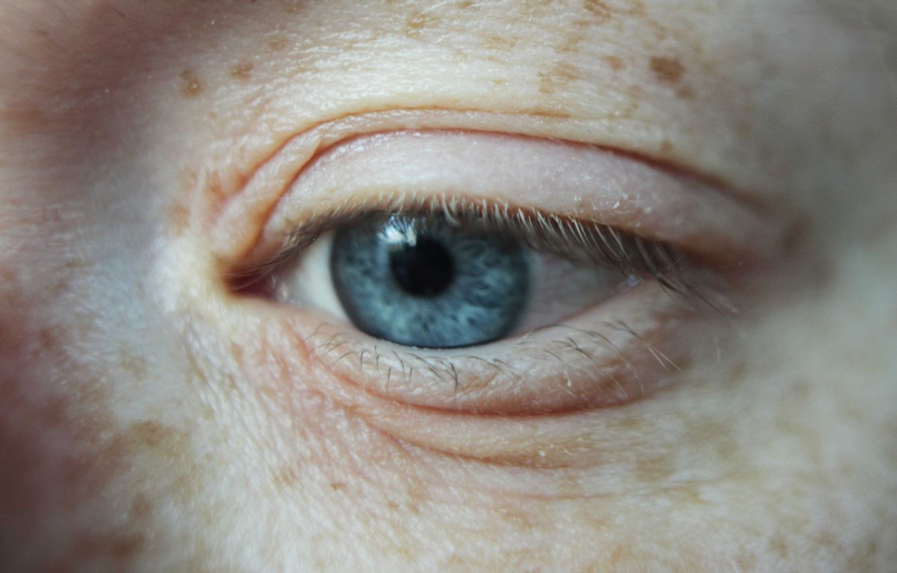

Dennie-Morgan folds

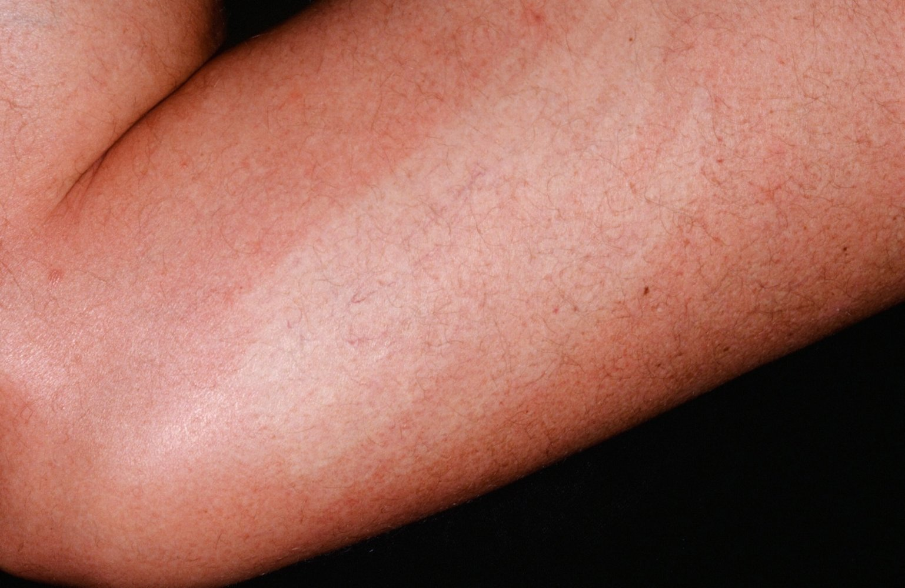

White dermatographism

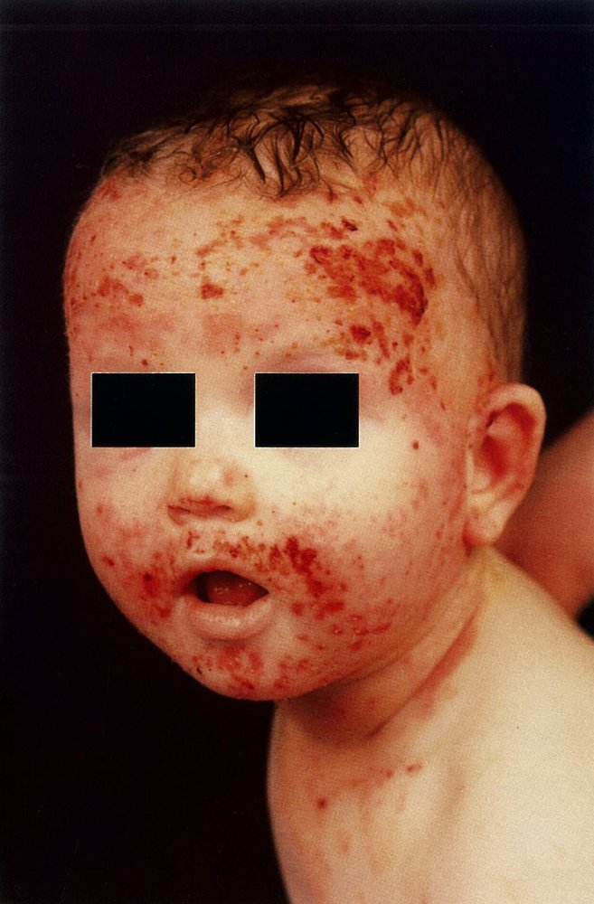

Atopic dermatitis

Eczema herpeticum

Eczema herpeticum

We list the most important complications. The selection is not exhaustive.

---

## Prognosis

The symptoms of <u>atopic</u> dermatitis usually improve with age and often resolve completely after <u>puberty</u>.

---

## Prevention

<u>Exclusive breastfeeding</u> for the first 3–4 months may decrease the risk of developing AD.  [[26]](https://coursology-qbank.com/amboss/article/6qXjz_)[[27]](https://coursology-qbank.com/amboss/article/CwXqOZ0)

---