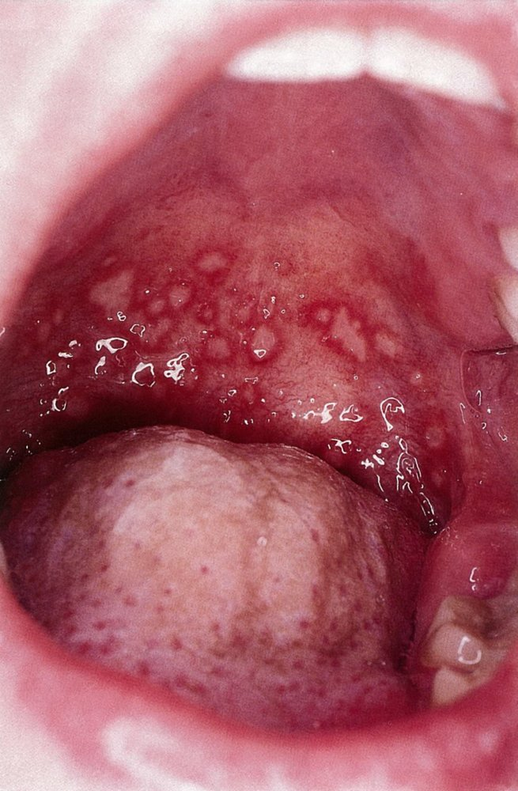
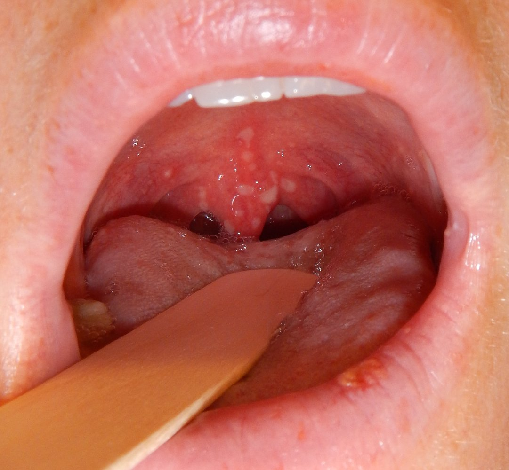
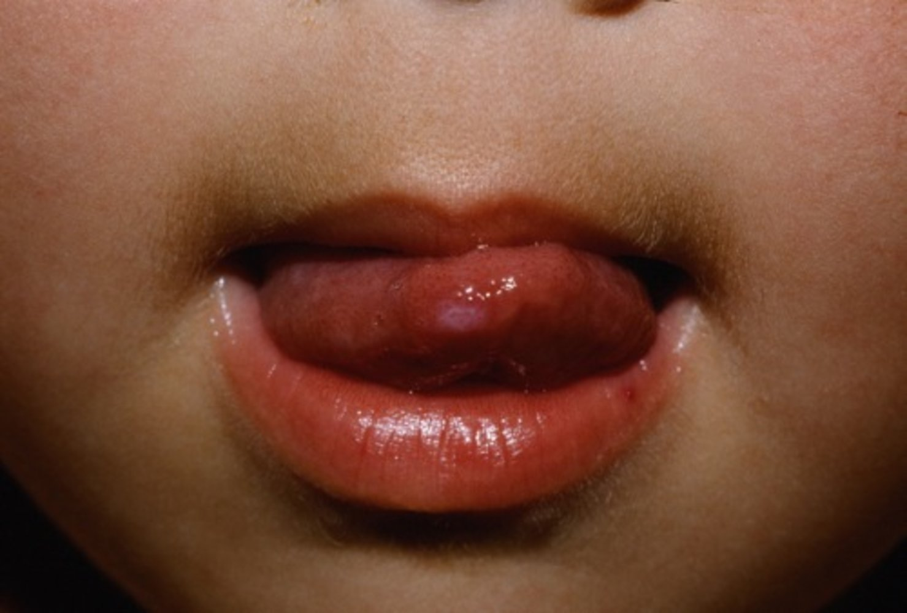
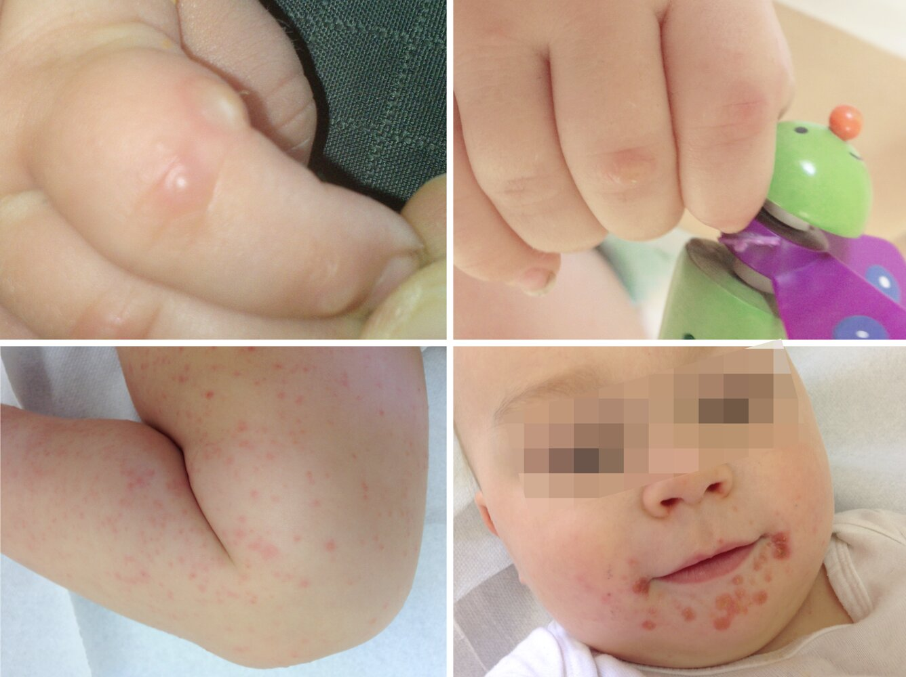
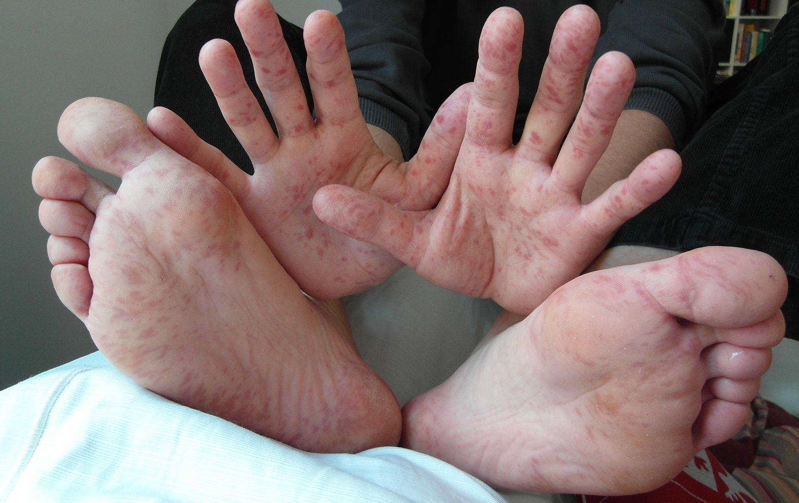
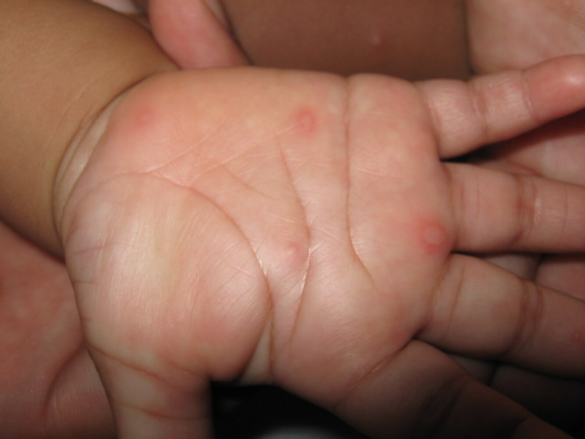
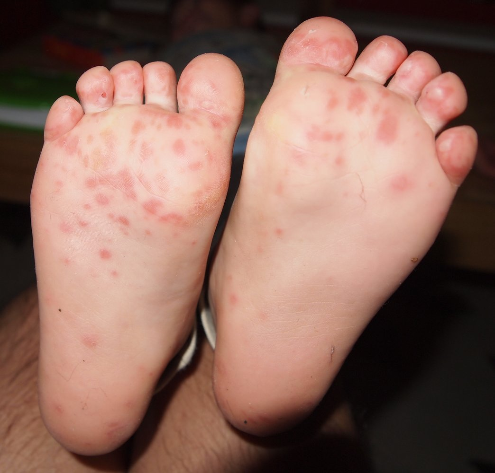
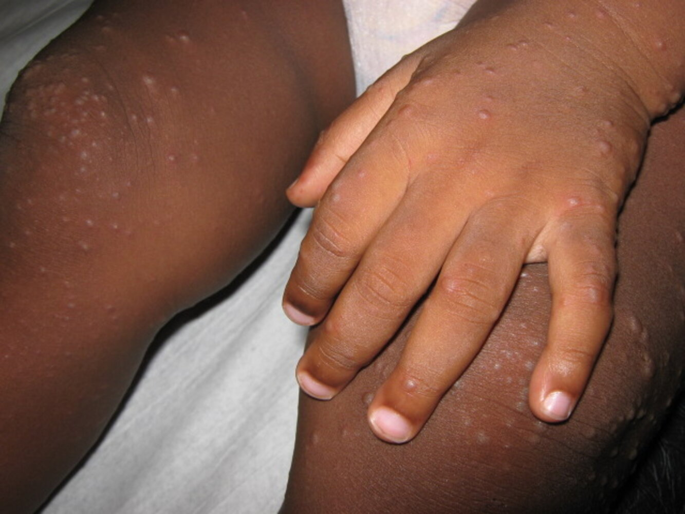

# Coxsackievirus infections

*Categories: Clinical knowledge > Pediatrics > Pediatric dermatology > Coxsackievirus infections*

[Original Article Link](https://coursology-qbank.com/amboss/article/E408OT)

---

## Summary

<u>Coxsackieviruses</u> are <u>RNA</u> nonpolio <u>enteroviruses</u> that are part of the <u>Picornaviridae</u> family. There are over 20 <u>serotypes</u> divided into groups A and B. Clinical manifestations due to <u>coxsackievirus</u> infection vary based on group and <u>serotype</u>. <u>Group A coxsackieviruses</u> more commonly cause <u>hand, foot, and mouth disease</u> (<u>HFMD</u>); <u>herpangina</u>; and <u>conjunctivitis</u>. <u>Group B coxsackieviruses</u> more commonly cause <u>pleurodynia</u>, <u>dilated cardiomyopathy</u>, <u>myocarditis</u>, and <u>pericarditis</u>. Both groups can manifest with <u>flu-like illness</u> and cause various conditions, including <u>meningitis</u>, <u>encephalitis</u>, and respiratory illness (e.g., <u>pneumonia</u>). Most patients with <u>coxsackievirus</u> infection are <u>diagnosed clinically</u>; <u>PCR</u> confirms the diagnosis if there is diagnostic uncertainty or in severe cases. Treatment is individualized according to symptoms; <u>antiviral agents</u> are not routinely recommended but may be considered by a specialist for severe infection (e.g., <u>encephalitis</u>). <u>Coxsackieviruses</u> are highly infectious and are mainly transmitted through airborne droplets and via fecal-oral spread; prevention includes <u>respiratory hygiene</u>, <u>hand hygiene</u>, and cleaning of contaminated surfaces and objects.

---

## Overview

### <u>Epidemiology</u>

* Worldwide distribution

* Occur in all age groups

* Highest <u>incidence</u> in <u>infants</u> and young children (< 10 years) [[1]](https://coursology-qbank.com/amboss/article/BXdzZK0)

### Etiology

* <u>Pathogen</u>: <u>coxsackievirus</u>

* Genus: <u>Enterovirus</u>

* Family: <u>Picornaviridae</u>

* Over 20 <u>serotypes</u>, divided into <u>group A coxsackieviruses</u> and <u>group B coxsackieviruses</u>

* Single‑stranded <u>RNA virus</u>

* Route of transmission

* Airborne droplets

* Fecal‑oral route

* <u>Vertical transmission</u>

### Clinical features

<u>Coxsackievirus</u> infections may be asymptomatic or may manifest as a wide range of diseases. [[2]](https://coursology-qbank.com/amboss/article/Bedza60)

* Group A coxsackieviruses more commonly cause : [[3]](https://coursology-qbank.com/amboss/article/RHdlJr0)

* <u>Hand, foot, and mouth disease</u>

* <u>Herpangina</u>

* <u>Viral conjunctivitis</u>

* Group B coxsackieviruses more commonly cause : [[4]](https://coursology-qbank.com/amboss/article/A7dRor0)[[5]](https://coursology-qbank.com/amboss/article/WHdP6r0)

* <u>Pleurodynia</u>

* Viral <u>myocarditis</u>

* Viral <u>pericarditis</u>

* <u>Dilated cardiomyopathy</u>

* Other manifestations include:

* <u>Flu-like illness</u>

* Respiratory illness (e.g., <u>pneumonia</u>)

* <u>Viral meningitis</u>

* <u>Enteroviral encephalitis</u>

* Infection during <u>pregnancy</u>

* Manifestations vary from mild to severe. [[6]](https://coursology-qbank.com/amboss/article/3HdSJr0)

* Group B <u>coxsackievirus</u> infection can cause <u>fetal growth restriction</u> and <u>preterm labor</u>. [[7]](https://coursology-qbank.com/amboss/article/hHdcJr0)

> [!TIP]
> <u>Group B coxsackieviruses</u> are one of the most common causes of viral <u>myocarditis</u>. [[8]](https://coursology-qbank.com/amboss/article/QHduJr0)

---

## Hand, foot, and mouth disease and herpangina

### Definition [[1]](https://coursology-qbank.com/amboss/article/BXdzZK0)

Hand, foot, and mouth disease (<u>HFMD</u>) and herpangina are highly contagious <u>febrile</u> infections most commonly caused by <u>group A coxsackieviruses</u>.

* <u>HFMD</u> manifests with a cutaneous <u>rash</u> and painful oral lesions.

* <u>Herpangina</u> manifests with painful lesions limited to the <u>oral cavity</u>.

### Etiology [[4]](https://coursology-qbank.com/amboss/article/A7dRor0)

* Causative <u>pathogen</u>: nonpolio <u>enteroviruses</u>

* US and Europe: most commonly <u>Coxsackievirus</u> A <u>serotypes</u>

* Asia-Pacific: most commonly <u>Enterovirus</u> A71

* <u>Incubation period</u>: 3–6 days

### <u>Epidemiology</u> [[2]](https://coursology-qbank.com/amboss/article/Bedza60)[[4]](https://coursology-qbank.com/amboss/article/A7dRor0)

* Most commonly affects children < 5 years of age

* Highest <u>incidence</u> in summer and fall in temperate climates

### Clinical features [[1]](https://coursology-qbank.com/amboss/article/BXdzZK0)[[4]](https://coursology-qbank.com/amboss/article/A7dRor0)[[9]](https://coursology-qbank.com/amboss/article/jHd_Jr0)

* <u>Fever</u>, <u>malaise</u>

* Painful oral lesions ;  [[1]](https://coursology-qbank.com/amboss/article/BXdzZK0)[[10]](https://coursology-qbank.com/amboss/article/nR07nf)

* Initially manifest as discrete small <u>papules</u> that develop into 1–2 mm <u>vesicles</u> with surrounding <u>erythema</u>   [[10]](https://coursology-qbank.com/amboss/article/nR07nf)

* Enlarge over several days to form 3–4 mm <u>ulcers</u> that do not coalesce [[10]](https://coursology-qbank.com/amboss/article/nR07nf)

* Typically affect the <u>posterior</u> <u>oral cavity</u> (e.g., <u>tonsils</u>, uvula, <u>soft palate</u>, <u>oropharynx</u>)

* Occasionally involve the perioral area and tip of the <u>tongue</u>

* Cutaneous lesions: macular, <u>papular</u>, and partially <u>vesicular</u> <u>rash</u>

* Predominantly on <u>palmar</u> surface of the hands and feet

* Typically 2–6 mm in diameter [[1]](https://coursology-qbank.com/amboss/article/BXdzZK0)

* May also affect:

* Buttocks

* Genitals

* Knees

* <u>Elbows</u>

* Atypical manifestations include: [[1]](https://coursology-qbank.com/amboss/article/BXdzZK0)[[4]](https://coursology-qbank.com/amboss/article/A7dRor0)

* Coalescing lesion or <u>rash</u> that forms <u>bullae</u>

* Eczema coxsakium: a manifestation of <u>HFMD</u> that is characterized by accentuated eruptions in areas of active or inactive <u>atopic dermatitis</u>

* Hemorrhagic or <u>purpuric</u> lesions

> [!TIP]
> <u>Onychomadesis</u> may occur 4–6 weeks after resolution of <u>HFMD</u>. [[2]](https://coursology-qbank.com/amboss/article/Bedza60)[[11]](https://coursology-qbank.com/amboss/article/t7dXnr0)

Herpangina

Herpangina

Hand, foot, and mouth disease

Hand, foot, and mouth disease

Hand, foot, and mouth disease

Hand, foot, and mouth disease

Hand, foot, and mouth disease

Hand, foot, and mouth disease

### Diagnosis [[1]](https://coursology-qbank.com/amboss/article/BXdzZK0)[[2]](https://coursology-qbank.com/amboss/article/Bedza60)[[4]](https://coursology-qbank.com/amboss/article/A7dRor0)

* Diagnosis is usually clinical.

* Perform <u>PCR</u> (e.g., on stool, <u>vesicle</u> fluid, buccal swabs):

* In severe cases (e.g., complicated by <u>meningitis</u> or <u>encephalitis</u>)

* If there is diagnostic uncertainty

### Treatment [[2]](https://coursology-qbank.com/amboss/article/Bedza60)[[4]](https://coursology-qbank.com/amboss/article/A7dRor0)

* Infection is <u>self-limited</u>; lesions begin to resolve after 7–10 days. [[1]](https://coursology-qbank.com/amboss/article/BXdzZK0)[[4]](https://coursology-qbank.com/amboss/article/A7dRor0)

* <u>Antiviral agents</u> are not routinely recommended.  [[1]](https://coursology-qbank.com/amboss/article/BXdzZK0)

* Treatment is supportive, e.g.:

* <u>Acetaminophen</u> or <u>ibuprofen</u> as needed for management of <u>fever</u> or <u>pain</u> [[1]](https://coursology-qbank.com/amboss/article/BXdzZK0)

* See “<u>Supportive care for pediatric fever</u>” for pediatric dosages; avoid <u>aspirin</u> in children.

* See “<u>Antipyretics</u>” for adult dosages.

* Ensure adequate hydration; manage <u>odynophagia</u> as needed. [[12]](https://coursology-qbank.com/amboss/article/VHdG6r0)

* Offer ice cream, milk, and soft foods.

* Consider saltwater gargles.

* Rarely, admission may be required for <u>management of dehydration</u>. [[1]](https://coursology-qbank.com/amboss/article/BXdzZK0)

* Provide education on <u>exposure control for coxsackievirus infection</u>.

> [!WARNING]
> Oral <u>lidocaine</u> is not recommended for <u>odynophagia</u> because of insufficient evidence supporting its use and the risk of <u>poisoning</u>. [[1]](https://coursology-qbank.com/amboss/article/BXdzZK0)[[13]](https://coursology-qbank.com/amboss/article/AN1Rdh0)

### Differential diagnoses [[1]](https://coursology-qbank.com/amboss/article/BXdzZK0)

* Oral and perioral <u>ulcerations</u>

* <u>Aphthous ulcers</u>

* <u>Herpetic gingivostomatitis</u>

* <u>Herpes labialis</u>

* <u>Behcet syndrome</u>

* <u>Pemphigus vulgaris</u>

* Cutaneous <u>rash</u>

* Other causes of:

* <u>Infectious rashes in childhood</u> (e.g., <u>varicella</u>)

* <u>Maculopapular rash</u> (e.g., <u>scabies</u>, <u>kawasaki disease</u>, <u>erythema multiforme</u>)

* <u>Diffuse erythematous rash</u> (e.g., <u>toxic shock syndrome</u>, <u>Stevens-Johnson syndrome</u>)

* <u>Vesiculobullous rash</u> (e.g., <u>bullous impetigo</u>, <u>shingles</u>)

* <u>Herpes simplex virus infections</u> (e.g., <u>herpes gladiatorum</u>, <u>eczema herpeticum</u>)

* Dermatitis (e.g., <u>dyshidrotic eczema</u>, <u>contact dermatitis</u>, <u>atopic dermatitis</u>)

* <u>Rocky Mountain spotted fever</u>

### Complications [[1]](https://coursology-qbank.com/amboss/article/BXdzZK0)[[4]](https://coursology-qbank.com/amboss/article/A7dRor0)

Complications (more common in <u>enterovirus</u> A71 infection) include:

* <u>Brainstem encephalitis</u>

* Acute <u>flaccid paralysis</u>

* <u>Meningitis</u>

* <u>Myocarditis</u>

* <u>Pulmonary edema</u>

---

## Pleurodynia

### Definition

<u>Pleurodynia</u> (<u>Bornholm disease</u>) is an acute viral illness characterized by <u>fever</u>, <u>flu-like symptoms</u>, and painful spasms of the muscles of the chest and/or upper abdomen.

### Etiology [[5]](https://coursology-qbank.com/amboss/article/WHdP6r0)[[14]](https://coursology-qbank.com/amboss/article/1Hd26r0)

* Most commonly, <u>group B coxsackieviruses</u>

* Rarely caused by <u>Echovirus</u> spp. or <u>group A coxsackieviruses</u>

### <u>Epidemiology</u> [[14]](https://coursology-qbank.com/amboss/article/1Hd26r0)

* Typically affects older children, <u>adolescents</u>, and young adults

* Rare in older adults

### Clinical features [[5]](https://coursology-qbank.com/amboss/article/WHdP6r0)[[14]](https://coursology-qbank.com/amboss/article/1Hd26r0)

* <u>Fever</u> and other <u>flu-like symptoms</u> (e.g., <u>cough</u>, <u>sore throat</u>, <u>nausea</u>, <u>headache</u>)

* Episodes of sudden-onset severe, cramping thoracic and/or upper abdominal <u>pain</u> 

* Typically last 15–30 minutes [[14]](https://coursology-qbank.com/amboss/article/1Hd26r0)[[15]](https://coursology-qbank.com/amboss/article/I3bYPt)

* Usually resolve within 4 days

* <u>Clinical examination</u> is usually normal; a pleural or <u>pericardial</u> rub may be noted. [[5]](https://coursology-qbank.com/amboss/article/WHdP6r0)[[15]](https://coursology-qbank.com/amboss/article/I3bYPt)

* Close contacts of the patient are often affected concurrently.  [[5]](https://coursology-qbank.com/amboss/article/WHdP6r0)

> [!TIP]
> Spasms are most common in the <u>febrile</u> phase of disease. [[14]](https://coursology-qbank.com/amboss/article/1Hd26r0)[[15]](https://coursology-qbank.com/amboss/article/I3bYPt)

### Diagnosis [[5]](https://coursology-qbank.com/amboss/article/WHdP6r0)[[14]](https://coursology-qbank.com/amboss/article/1Hd26r0)

* <u>Pleurodynia</u> is a diagnosis of exclusion.

* Routine studies are often normal but may reveal the following findings.

* <u>Laboratory studies</u>: mild elevations in <u>WBC count</u>, <u>ESR</u>, and <u>creatine kinase</u>

* <u>Diagnostic studies for chest pain</u>:

* <u>Chest x-ray</u>: pulmonary infiltrates with or without <u>pleural effusions</u>

* <u>ECG</u>: <u>T-wave inversions</u> if there is <u>pericardial</u> or <u>myocardial</u> involvement

* <u>Diagnostic studies for acute abdominal pain</u> are typically normal.

* In case of diagnostic uncertainty: Obtain <u>coxsackievirus</u> <u>serology</u> or <u>PCR</u>. [[2]](https://coursology-qbank.com/amboss/article/Bedza60)[[14]](https://coursology-qbank.com/amboss/article/1Hd26r0)

### Treatment [[14]](https://coursology-qbank.com/amboss/article/1Hd26r0)

Symptoms are typically <u>self-limited</u> and resolve within days.

* Recommend <u>supportive care</u> with: [[14]](https://coursology-qbank.com/amboss/article/1Hd26r0)[[15]](https://coursology-qbank.com/amboss/article/I3bYPt)

* <u>Oral analgesia</u>

* Application of heat to the affected area

* <u>Intercostal block</u> can be considered for <u>pain management</u>. [[14]](https://coursology-qbank.com/amboss/article/1Hd26r0)

* Provide information on <u>exposure control for coxsackievirus infection</u>.

### Differential diagnoses

* <u>Differential diagnosis of acute chest pain</u>

* <u>Differential diagnosis of acute abdomen</u>

### Complications [[2]](https://coursology-qbank.com/amboss/article/Bedza60)[[14]](https://coursology-qbank.com/amboss/article/1Hd26r0)

Complications are rare and include:

* <u>Pericarditis</u>

* <u>Myocarditis</u>

* <u>Meningitis</u> and/or <u>encephalitis</u>

* <u>Disseminated intravascular coagulation</u>

---