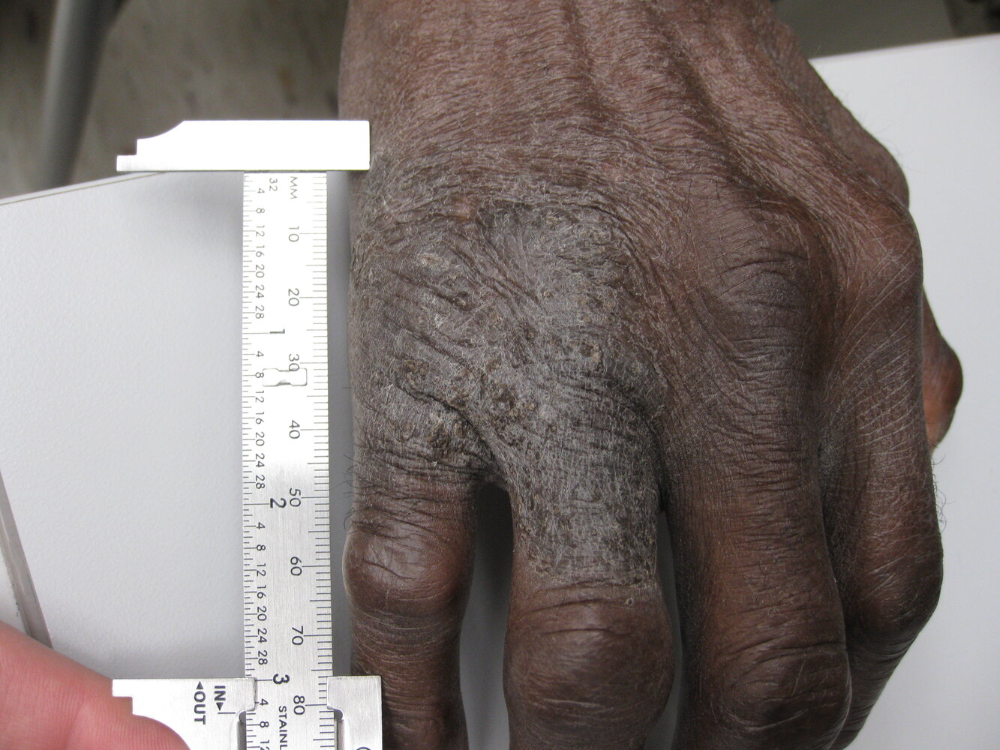

# Lichen simplex chronicus

*Categories: Clinical knowledge > Pediatrics > Pediatric dermatology > Lichen simplex chronicus*

[Original Article Link](https://coursology-qbank.com/amboss/article/AG0Rb3)

---

## Summary

Lichen simplex chronicus is a benign <u>skin</u> condition associated with chronic <u>pruritus</u> and continual rubbing and/or scratching of the <u>skin</u>. It is most commonly seen in adults. <u>Skin examination</u> findings include thickened <u>plaques</u> and excoriations. Diagnosis is usually clinical. Without intervention, lichen simplex chronicus can persist indefinitely. Treatment is focused on identifying and managing any underlying <u>causes of pruritus</u> and preventing the continual rubbing and scratching.

---

## Etiology

Lichen simplex chronicus results from a continual cycle of itching and scratching of the <u>skin</u> for relief. This may be caused by: [[3]](https://coursology-qbank.com/amboss/article/lPWvUl0)[[4]](https://coursology-qbank.com/amboss/article/onW08N0)

* Habitual behavior (e.g., associated with psychiatric conditions and <u>stress</u>) [[5]](https://coursology-qbank.com/amboss/article/Wk1P5S0)[[6]](https://coursology-qbank.com/amboss/article/eadxjo0)

* Chronic <u>skin</u> irritation and inflammation due to, e.g.: [[2]](https://coursology-qbank.com/amboss/article/cadajo0)

* <u>Atopic dermatitis</u>

* <u>Contact dermatitis</u>

* <u>Lichen sclerosus</u>

* <u>Candidiasis</u>

---

## Clinical features

* Intense <u>pruritus</u> [[2]](https://coursology-qbank.com/amboss/article/cadajo0)[[4]](https://coursology-qbank.com/amboss/article/onW08N0)

* Rubbing and/or scratching the <u>skin</u> provides a sense of relief.

* May impact <u>sleep</u>

* <u>Lichenified</u> <u>plaques</u> with excoriations   [[3]](https://coursology-qbank.com/amboss/article/lPWvUl0)[[4]](https://coursology-qbank.com/amboss/article/onW08N0)

* Lesions occur on any part of the body that can be scratched, including: [[3]](https://coursology-qbank.com/amboss/article/lPWvUl0)

* Anogenital areas (e.g., <u>vulva</u>, <u>scrotum</u>, <u>anus</u>); see also “<u>Vulvar dermatoses</u>.”

* Back of the neck (<u>lichen simplex nuchae</u>)

* Scalp

* Extremities

Lichen simplex chronicus

---

## Diagnosis

* Lichen simplex chronicus is primarily a <u>clinical diagnosis</u>. [[4]](https://coursology-qbank.com/amboss/article/onW08N0)

* Obtain further testing in cases of diagnostic uncertainty or to rule out alternative diagnoses, e.g.: [[4]](https://coursology-qbank.com/amboss/article/onW08N0)

* <u>Skin biopsy</u> if <u>malignancy</u> is suspected

* Fungal culture to exclude <u>candidiasis</u> as a cause of anogenital <u>pruritus</u>

* <u>Skin biopsy</u> findings include <u>hyperplasia</u> and <u>hyperkeratosis</u> of <u>squamous epithelium</u>. [[7]](https://coursology-qbank.com/amboss/article/UadbPo0)

---

## Prognosis

Benign condition (risk of <u>squamous cell carcinoma</u> not increased)

---