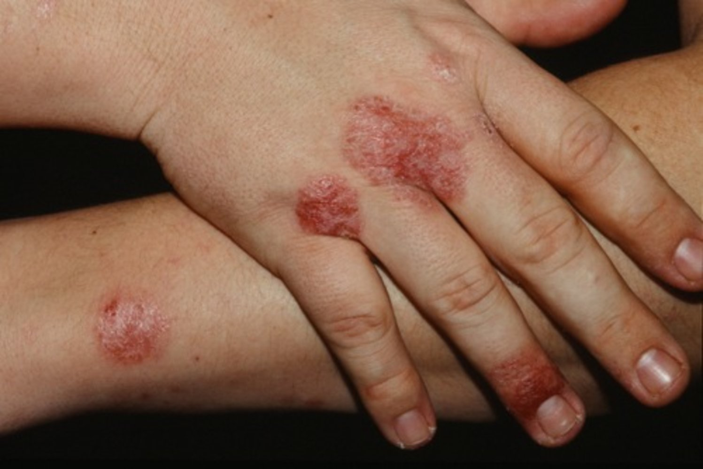
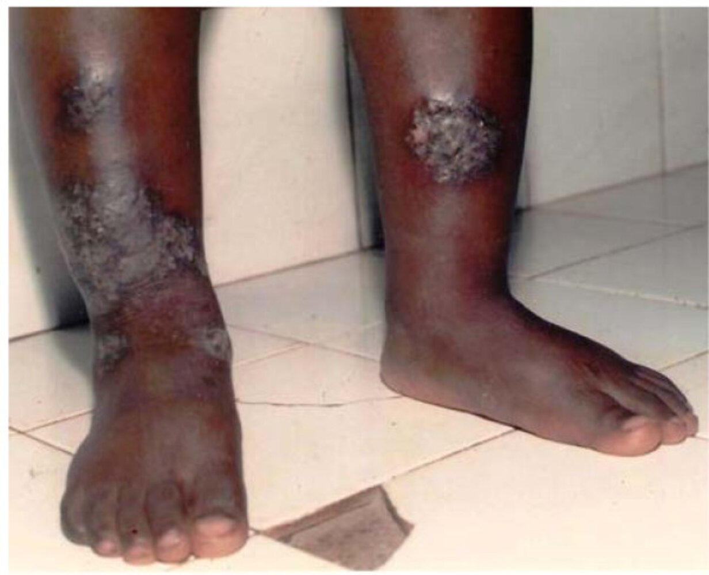
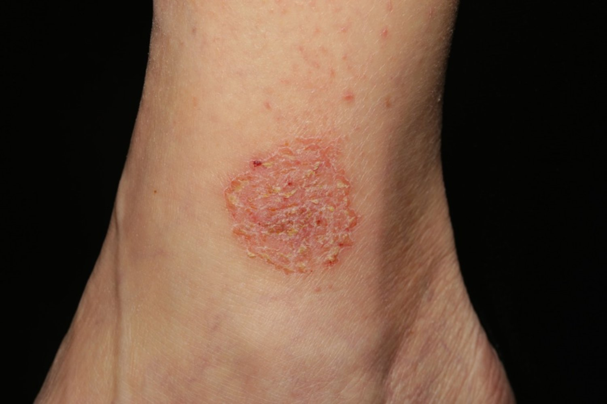
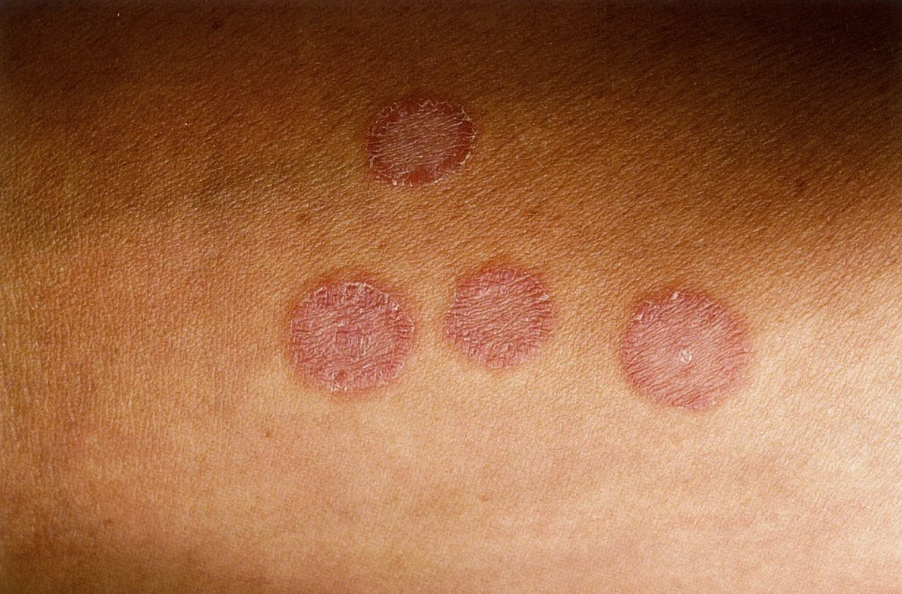

# Nummular dermatitis

*Categories: Clinical knowledge > Pediatrics > Pediatric dermatology > Nummular dermatitis*

[Original Article Link](https://coursology-qbank.com/amboss/article/xs0ECh)

---

## Summary

Nummular dermatitis is a chronic inflammatory <u>skin</u> condition characterized by well-demarcated, coin-shaped, pruritic lesions. It typically manifests on the extensor surfaces of the upper and lower extremities and worsens in cold, dry weather. Nummular dermatitis frequently occurs in patients with <u>atopy</u>. The diagnosis is usually clinical. Management is similar to that of <u>atopic dermatitis</u>. The main goal of management is to protect the <u>skin</u> barrier with hydrating <u>skin</u> <u>emollients</u> to prevent and/or treat <u>xerosis</u>. Topical pharmacotherapy is used for mild symptoms, while systemic pharmacotherapy and/or <u>phototherapy</u> may be required if symptoms are severe or persistent.

---

## Etiology

* Multifactorial

* Primarily an immunologic <u>hypersensitivity reaction</u> (dermatitis) due to <u>xerosis</u> and damage to the <u>epidermal</u> lipid barrier

---

## Clinical features

* 1–5 cm coin-shaped, well-demarcated <u>erythematous</u> <u>plaques</u>

* <u>Pruritus</u>

* Crusting and <u>scaling</u> [[3]](https://coursology-qbank.com/amboss/article/bSdHy60)

* <u>Papules</u> and <u>vesicles</u> may be present [[3]](https://coursology-qbank.com/amboss/article/bSdHy60)

* Primarily affects the extremities  [[3]](https://coursology-qbank.com/amboss/article/bSdHy60)[[4]](https://coursology-qbank.com/amboss/article/QcduXK0)

* Symptoms worsen during cold, dry weather. [[4]](https://coursology-qbank.com/amboss/article/QcduXK0)

> [!TIP]
> Nummular dermatitis often occurs in patients with <u>atopy</u>. [[4]](https://coursology-qbank.com/amboss/article/QcduXK0)

Nummular eczema (hands)

Nummular eczema

Nummular eczema

---

## Differential diagnoses

* <u>Tinea corporis</u>  [[4]](https://coursology-qbank.com/amboss/article/QcduXK0)

* <u>Psoriasis</u>

* <u>Contact dermatitis</u>

* <u>Atopic dermatitis</u>

* <u>Urticaria</u>

* <u>Erythema migrans</u>

* <u>Erythema multiforme</u>

* See also “<u>Overview of annular skin lesions</u>.”

Tinea corporis (ringworm)

The differential diagnoses listed here are not exhaustive.

---

## Management

The management of nummular dermatitis is similar to the <u>management of atopic dermatitis</u>. [[3]](https://coursology-qbank.com/amboss/article/bSdHy60)[[4]](https://coursology-qbank.com/amboss/article/QcduXK0)

* All patients: nonpharmacological management

* Maintain <u>skin</u> hydration with <u>emollients</u>.

* Avoid irritants.

* Mild symptoms

* Medium or <u>high potency topical corticosteroids</u> (e.g., <u>triamcinolone</u> acetonide 0.1%, <u>fluocinonide</u> 0.05%) [[7]](https://coursology-qbank.com/amboss/article/LnWwFN0)

* Topical immunomodulators (e.g., <u>tacrolimus</u>, <u>pimecrolimus</u>)

* Severe or refractory symptoms

* Refer to dermatology.

* Treatment options include:

* <u>Systemic glucocorticoids</u>

* <u>Systemic immunomodulators</u> [[8]](https://coursology-qbank.com/amboss/article/gSdF_60)[[9]](https://coursology-qbank.com/amboss/article/TSd6_60)

* <u>Phototherapy</u>

---