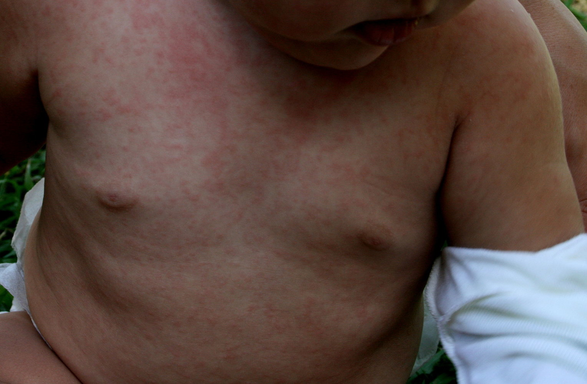

# Roseola infantum

*Categories: Clinical knowledge > Pediatrics > Pediatric dermatology > Roseola infantum*

[Original Article Link](https://coursology-qbank.com/amboss/article/s40tkT)

---

## Summary

Roseola infantum is an infectious disease most commonly caused by <u>human herpesvirus 6</u> (<u>HHV-6</u>). It occurs most frequently in children between 6 months and 2 years of age. Roseola infantum is characterized by abrupt onset and resolution of high <u>fever</u> lasting approx. three days, followed by the sudden manifestation of a patchy, nonpruritic <u>rash</u> with <u>macules</u> and <u>papules</u> that starts on the trunk and sometimes spreads to the face and extremities. Roseola infantum is <u>diagnosed clinically</u>; laboratory tests are not typically recommended. The course is <u>self-limited</u>, but symptomatic treatment may be considered. <u>Febrile seizures</u> are the most common complication of infection.

---

## Epidemiology

* Most frequent in <u>infants</u> and young children [[1]](https://coursology-qbank.com/amboss/article/Bedza60)

* Peak <u>incidence</u>: 6 months to 2 years [[1]](https://coursology-qbank.com/amboss/article/Bedza60)

Epidemiological data refers to the US, unless otherwise specified.

---

## Etiology

* <u>Pathogen</u>

* <u>HHV-6</u> (and in rare cases <u>HHV-7</u>)

* Humans are the sole hosts.

* Route of transmission: droplet infection (e.g., saliva)

* <u>Incubation period</u>: 5–15 days

References:[[2]](https://coursology-qbank.com/amboss/article/aVYQGL)[[3]](https://coursology-qbank.com/amboss/article/tpdXrI0)

---

## Clinical features

Children with roseola infantum usually appear well. Rarely, children present with <u>complications of roseola infantum</u> (e.g., <u>encephalitis</u>). [[1]](https://coursology-qbank.com/amboss/article/Bedza60)[[4]](https://coursology-qbank.com/amboss/article/AN1Rdh0)[[5]](https://coursology-qbank.com/amboss/article/rXdfzo0)

### <u>Prodrome</u> [[1]](https://coursology-qbank.com/amboss/article/Bedza60)[[5]](https://coursology-qbank.com/amboss/article/rXdfzo0)

* <u>Fever</u>

* Abrupt onset of high <u>fever</u>, in some patients > 39.5°C

* Lasts ∼ 3 days (up to 7 days)

* <u>Febrile seizures</u> are a potential complication of roseola infantum.

* Cervical and/or occipital <u>lymphadenopathy</u>

* Inflamed tympanic membranes

* Nagayama spots: <u>papular</u> <u>enanthem</u> on the uvula and <u>soft palate</u> [[6]](https://coursology-qbank.com/amboss/article/wpdh7I0)

* <u>Cough</u>

* <u>Rhinorrhea</u>

* Fussiness and irritability [[6]](https://coursology-qbank.com/amboss/article/wpdh7I0)

* Gastrointestinal symptoms (e.g., <u>diarrhea</u>)

* <u>Edematous</u> eyelids and <u>conjunctivitis</u> [[6]](https://coursology-qbank.com/amboss/article/wpdh7I0)[[7]](https://coursology-qbank.com/amboss/article/YVYnGL)

> [!TIP]
> More than 75% of <u>HHV-6</u> infections do not cause roseola infantum; the most common manifestations of <u>HHV-6</u> infection are <u>fever</u> and <u>rhinorrhea</u>. [[1]](https://coursology-qbank.com/amboss/article/Bedza60)

### <u>Exanthem</u> phase [[1]](https://coursology-qbank.com/amboss/article/Bedza60)[[5]](https://coursology-qbank.com/amboss/article/rXdfzo0)

* <u>Rash</u> typically manifests after sudden resolution of <u>fever</u>

* Lasts 1–2 days [[6]](https://coursology-qbank.com/amboss/article/wpdh7I0)

* Patchy macular and <u>papular</u> <u>exanthem</u> that:

* Is rose-pink in color

* Blanches upon pressure

* Is nonpruritic (in contrast to drug <u>rash</u>)

* Originates on the trunk and sometimes spreads to the face and extremities

Roseola infantum (exanthem subitum)

Roseola infantum (sixth disease) fact sheet

> [!NOTE]
> The alternative names for roseola infantum, “three-day <u>fever</u>” and “<u>exanthem</u> subitum” (from Latin: “subitus” = sudden), reflect the two phases of the disease: three days of high <u>fever</u> followed by a sudden <u>rash</u>. [[6]](https://coursology-qbank.com/amboss/article/wpdh7I0)

---

## Diagnosis

* Usually a <u>clinical diagnosis</u> [[1]](https://coursology-qbank.com/amboss/article/Bedza60)[[5]](https://coursology-qbank.com/amboss/article/rXdfzo0)

* Consult infectious diseases for consideration of confirmatory studies (e.g., <u>serology</u>, <u>NAAT</u>) in patients with:  [[1]](https://coursology-qbank.com/amboss/article/Bedza60)[[6]](https://coursology-qbank.com/amboss/article/wpdh7I0)

* Severe complications

* <u>Immunocompromise</u>

> [!TIP]
> <u>Laboratory studies</u> are not required but (if performed) may show <u>leukopenia</u>, <u>thrombocytopenia</u>, and <u>elevated transaminases</u>. [[6]](https://coursology-qbank.com/amboss/article/wpdh7I0)

---

## Differential diagnoses

* Other <u>infectious rashes in childhood</u>

* <u>Drug-induced skin reaction</u>

* <u>Bacterial meningitis</u>

Infectious rashes in children

Pediatric Rashes – Part 1: Diagnosis

The differential diagnoses listed here are not exhaustive.

---

## Treatment

Roseola infantum is typically a <u>self-limited</u> illness that can be managed with symptomatic treatment as needed. [[1]](https://coursology-qbank.com/amboss/article/Bedza60)[[5]](https://coursology-qbank.com/amboss/article/rXdfzo0)

* Consider <u>supportive care for pediatric fever</u> (e.g., <u>acetaminophen</u>)

* Manage associated <u>complications of roseola infantum</u> (e.g., <u>treatment of febrile seizures</u>).

* <u>Immunocompromised</u> patients: Consult infectious diseases for consideration of <u>antiviral therapy</u>.  [[1]](https://coursology-qbank.com/amboss/article/Bedza60)

* No <u>infection control</u> measures are required for the <u>exanthem</u> of roseola infantum. [[1]](https://coursology-qbank.com/amboss/article/Bedza60)

Pediatric Rashes – Part 2: Treatment

---

## Complications

* <u>Febrile seizures</u> (in up to 15% of cases), usually without sequelae [[8]](https://coursology-qbank.com/amboss/article/qpdCqI0)

* <u>Hepatitis</u>

* <u>Meningoencephalitis</u> (very rare)

We list the most important complications. The selection is not exhaustive.

---

## Prognosis

* Very good prognosis; <u>self-limiting</u> disease

* The <u>virus</u> persists lifelong in its host, and reactivation of latent <u>virus</u> or reinfection may occur later in life (especially if individuals become <u>immunocompromised</u>)

---