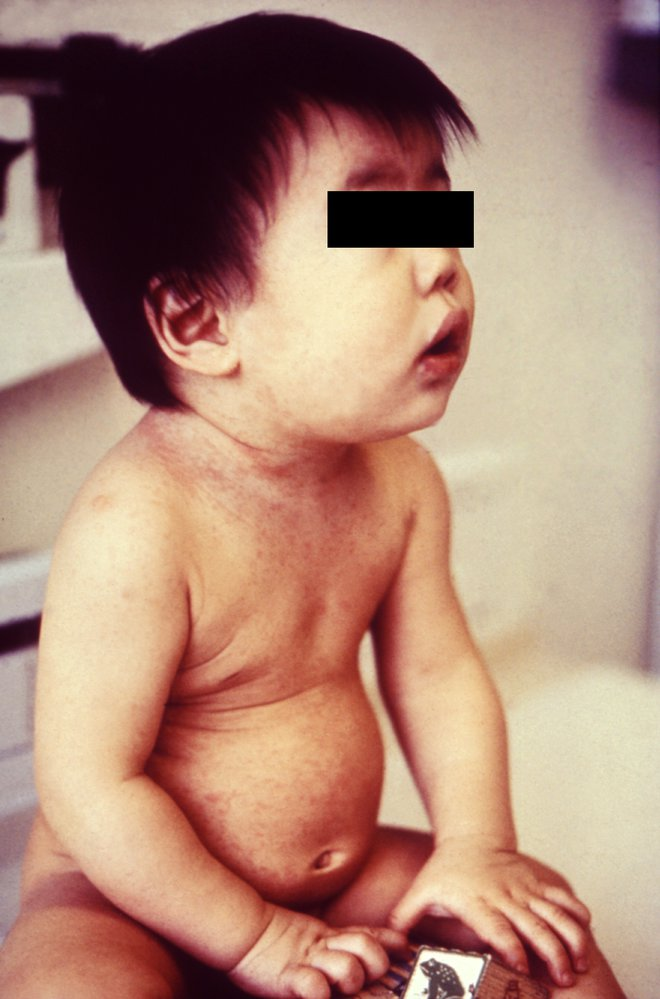
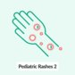

# Rubella

*Categories: Clinical knowledge > Pediatrics > Pediatric dermatology > Rubella*

[Original Article Link](https://coursology-qbank.com/amboss/article/7404kT)

---

## Summary

Rubella (German <u>measles</u>) is an infectious disease caused by the <u>rubella virus</u> and transmitted via airborne droplets or transplacentally (see “<u>Congenital rubella syndrome</u>”). Since the introduction of the <u>measles</u>, <u>mumps</u>, and rubella (<u>MMR</u>) <u>vaccine</u>, rubella is relatively rare. The clinical course is mild, characterized by an <u>erythematous</u> <u>maculopapular rash</u> that typically starts on the face and progresses distally. The <u>rash</u> may be preceded by nonspecific <u>flu-like symptoms</u> and postauricular and/or suboccipital <u>lymphadenopathy</u>. The combination of <u>RT-PCR</u> and <u>serology</u> for rubella-specific <u>IgM antibodies</u> is preferred to confirm active disease. Treatment is supportive and isolation is recommended. <u>Immunization</u> with the <u>MMR vaccine</u> or <u>MMRV vaccine</u> is recommended for all children and adults without evidence of <u>immunity</u>.

This article pertains to rubella acquired postnatally; <u>congenital rubella syndrome</u> is addressed separately.

---

## Etiology

* <u>Pathogen</u>

* <u>Rubella virus</u>, an <u>RNA virus</u> of the family <u>Matonaviridae</u>

* Prior to 2019, the <u>rubella virus</u> was classified as the sole member of the Rubivirus genus in the <u>Togaviridae</u> family. [[1]](https://coursology-qbank.com/amboss/article/b4XH3y)

* Humans are the only hosts.

* Route of transmission

* Respiratory droplets or transplacental

* <u>Infectivity</u>: 7 days prior to and 7 days following the appearance of an <u>exanthem</u>

* Low <u>infectivity</u> and <u>virulence</u>

* <u>Incubation period</u>: 2–3 weeks after infection

---

## Clinical features

Patients with rubella infection are asymptomatic in ∼ 50% of cases. Young children have a far milder course than older children and adults; the latter group often presents with <u>prodromal</u> symptoms, other systemic complaints (e.g., <u>arthritis</u>), and a longer duration of infection.

### <u>Prodromal</u> phase

* Duration: 1–5 days

* Findings

* Post-auricular and suboccipital <u>lymphadenopathy</u> and occasionally <u>splenomegaly</u>

* Mild and nonspecific symptoms such as low-grade <u>fever</u>; , mild <u>sore throat</u>, <u>cough</u>, <u>conjunctivitis</u>, <u>headache</u>, and aching <u>joints</u>

* Forchheimer sign: <u>enanthem</u> of the <u>soft palate</u>

### <u>Exanthem</u> phase

* Duration: lasts 2–3 days

* Findings

* Fine, nonconfluent, pink <u>maculopapular rash</u>   

* Begins on the face and extends to the trunk and extremities, sparing palms and soles

* <u>Rash</u> may be itchy in adults

* <u>Polyarthritis</u>

Rubella rash

Rubella fact sheet

Pediatric Rashes – Part 1: Diagnosis

---

## Management

<u>Clinical features of rubella</u> are typically nonspecific; ; consider acute infection in an unvaccinated patient with a <u>febrile</u> <u>rash</u>.

### <u>Infection control</u> [[2]](https://coursology-qbank.com/amboss/article/jcd_XK0)[[3]](https://coursology-qbank.com/amboss/article/Bedza60)[[4]](https://coursology-qbank.com/amboss/article/4cd3cK0)

* Isolate patient and institute <u>standard precautions</u> and <u>droplet precautions</u>.

* Ensure that only <u>health care professionals</u> with evidence of rubella <u>immunity</u> provide direct care to the patient.

* Notify the local health department immediately of a suspected case.

> [!WARNING]
> Rubella is a nationally <u>notifiable disease</u> in the US; immediately report all suspected and confirmed cases to the local health department.

### Diagnostics for rubella [[2]](https://coursology-qbank.com/amboss/article/jcd_XK0)[[3]](https://coursology-qbank.com/amboss/article/Bedza60)[[4]](https://coursology-qbank.com/amboss/article/4cd3cK0)

Obtain and interpret diagnostic studies in all patients in coordination with the health department.

#### Studies

* All patients: <u>serology</u> for rubella-specific <u>IgM</u> and <u>IgG antibodies</u>

* Patients presenting ≤ 7 days (ideally ≤ 3 days) after <u>rash</u> onset: [[4]](https://coursology-qbank.com/amboss/article/4cd3cK0)

* <u>RT-PCR</u> of a <u>nasopharyngeal</u> or throat swab

* If presenting close to day 7 after <u>rash</u> onset, also consider <u>RT-PCR</u> of a urine sample.  [[4]](https://coursology-qbank.com/amboss/article/4cd3cK0)

#### Interpretation of results

* Confirmatory results include any of the following:

* Positive <u>RT-PCR</u> or viral culture  [[4]](https://coursology-qbank.com/amboss/article/4cd3cK0)

* Positive <u>IgM</u> <u>antibodies</u>  [[4]](https://coursology-qbank.com/amboss/article/4cd3cK0)

* A 4-fold increase in <u>IgG antibodies</u> seen on two serum samples taken ∼ 2 weeks apart, starting from the onset of symptoms [[4]](https://coursology-qbank.com/amboss/article/4cd3cK0)

* Results that cannot rule out acute infection include:

* A single negative <u>IgM</u> test within the first 5 days of <u>rash</u> onset (in this case, repeat <u>IgM</u> test) [[5]](https://coursology-qbank.com/amboss/article/_fW5Kk0)

* A single negative <u>IgG</u> test

> [!TIP]
> <u>RT-PCR</u> with <u>serology</u> for rubella-specific <u>IgM antibodies</u> is preferred to confirm acute rubella infection. <u>RT-PCR</u> should be collected as soon as possible and within 7 days of <u>rash</u> onset. [[2]](https://coursology-qbank.com/amboss/article/jcd_XK0)[[3]](https://coursology-qbank.com/amboss/article/Bedza60)

### Further management [[6]](https://coursology-qbank.com/amboss/article/PcdWcK0)

* Supportive therapy, e.g.:

* <u>Fever</u>: <u>supportive care for pediatric fever</u>

* Severe <u>pruritus</u>: <u>antihistamines</u>

* Severe <u>polyarthritis</u>: rest and <u>NSAIDs</u>

* For treatment of <u>congenital rubella syndrome</u> and seronegative women following exposure to <u>rubella virus</u>, see “<u>Congenital rubella syndrome</u>.”

* Instruct patients and exposed contacts on <u>isolation precautions</u>; see “<u>Exposure control for rubella</u>.”

Pediatric Rashes – Part 2: Treatment

---

## Differential diagnoses

* Differential diagnoses of pediatric rashes

Infectious rashes in children

The differential diagnoses listed here are not exhaustive.

---

## Complications

* Chronic <u>arthritis</u> (especially women)

* <u>Thrombocytopenic purpura</u>

* Rubella during <u>pregnancy</u> (<u>TORCH infection</u>): <u>congenital rubella syndrome</u>

* Rare: rubella <u>encephalitis</u>, <u>bronchitis</u>, otitis, <u>myocarditis</u>, <u>pericarditis</u>

We list the most important complications. The selection is not exhaustive.

---

## Prevention

### <u>Vaccination</u> [[7]](https://coursology-qbank.com/amboss/article/pWWLm40)[[8]](https://coursology-qbank.com/amboss/article/Uj1b-g0)[[9]](https://coursology-qbank.com/amboss/article/LWWwN40)

Administer a live attenuated rubella <u>vaccine</u>;  (i.e., <u>MMR vaccine</u>, <u>MMRV vaccine</u>) according to the <u>ACIP immunization schedule</u>. See the following:

* Immunizations for <u>measles</u>, <u>mumps</u>, and rubella

* <u>ACIP immunization schedule</u>

* <u>Contraindications to live vaccines</u> (e.g., <u>pregnancy</u>, <u>immunocompromise</u>)

ACIP routine immunization schedule: children and adolescents ≤ 18 years of age

ACIP catch-up immunization schedule: children and adolescents ≤ 18 years of age

ACIP routine immunization schedule: adults ≥ 19 years of age

ACIP immunization schedule by medical or other indications: adults ≥ 19 years of age

### <u>Evidence of immunity to rubella</u> [[5]](https://coursology-qbank.com/amboss/article/_fW5Kk0)[[10]](https://coursology-qbank.com/amboss/article/RTWlqk0)

* See “<u>Indications to test for immunity to rubella</u>” and “<u>Evidence of immunity to measles, mumps, and/or rubella</u>.”

* If laboratory <u>evidence of immunity to rubella</u> is required, perform <u>serologic testing</u>. [[5]](https://coursology-qbank.com/amboss/article/_fW5Kk0)[[10]](https://coursology-qbank.com/amboss/article/RTWlqk0)

* <u>IgG</u> measurement by <u>enzyme immunoassay</u> is preferred.

* A rubella <u>IgG</u> <u>titer</u> > 10 IU/mL indicates <u>immunity</u> to rubella. [[5]](https://coursology-qbank.com/amboss/article/_fW5Kk0)

> [!TIP]
> Women of reproductive age without <u>evidence of immunity to rubella</u> should be vaccinated prior to <u>pregnancy</u> to prevent <u>congenital rubella syndrome</u>. [[11]](https://coursology-qbank.com/amboss/article/QTWuqk0)

### Exposure control for rubella [[12]](https://coursology-qbank.com/amboss/article/KTdU760)

* Suspected and confirmed rubella

* Hospitalized patients: Initiate <u>standard precautions</u> and <u>droplet precautions</u>.

* Isolate for 7 days from <u>rash</u> onset to prevent further transmission. [[12]](https://coursology-qbank.com/amboss/article/KTdU760)

* Exposed contacts without <u>evidence of immunity to rubella</u>

* Women of reproductive age: Obtain pregancy test.

* Pregnant individuals: Promptly obtain <u>serology</u> for rubella-specific <u>IgM</u> and <u>IgG antibodies</u>; follow up with health department.

* Individuals without <u>contraindications to live vaccines</u>: Offer <u>MMR vaccine</u> to protect from future exposures.  [[3]](https://coursology-qbank.com/amboss/article/Bedza60)[[13]](https://coursology-qbank.com/amboss/article/tWXXMC)

* Isolation

* Health care workers: Exclude from work from day 7 after first exposure until day 23 after last exposure. [[12]](https://coursology-qbank.com/amboss/article/KTdU760)

* Others: Refer to health department guidance.

---