# Scabies

*Categories: Clinical knowledge > Pediatrics > Pediatric dermatology > Scabies*

[Original Article Link](https://coursology-qbank.com/amboss/article/ck0a5T)

---

## Summary

Scabies is a parasitic <u>skin</u> <u>infestation</u> caused by the <u>Sarcoptes scabiei</u> var. hominis (<u>S. scabiei</u>) <u>mite</u>, which is primarily transmitted via direct human-to-human contact. The female scabies <u>mite</u> burrows into the <u>superficial</u> <u>skin</u> layer, causing severe <u>pruritus</u>, particularly at night. Primary lesions commonly include <u>erythematous</u> <u>papules</u>, <u>vesicles</u>, or burrows. Treatment involves use of <u>scabicidal agents</u> (e.g., <u>permethrin</u>) and prevention of transmission and reinfection (e.g., decontamination of clothing and bedding, treatment of close contacts).

---

## Etiology

* <u>Pathogen</u>: Sarcoptes scabiei var. hominis

* Transmission

* Highly contagious

* Typically via direct prolonged physical (<u>skin</u>-to-<u>skin</u> or sexual) contact

* Rarely indirect transmission (e.g., sharing textiles such as bedding, towels, or clothes)

* Commonly affects children ;   and individuals living closely with other people (e.g., in <u>nursing homes</u> or jails)

* <u>Risk factors</u>: : crowded living conditions (e.g., institutions such as <u>nursing homes</u>, hostels, child care facilities, and prisons)

> [!TIP]
> Scabies <u>mites</u> cannot survive more than 2–3 days away from human <u>skin</u>. [[1]](https://coursology-qbank.com/amboss/article/6pajql)

Scabies mite (Sarcoptes scabiei var. hominis)

---

## Pathophysiology

* The fertilized, female <u>mite</u> tunnels into the <u>superficial</u> <u>skin</u> layer (<u>stratum corneum</u>), forming burrows in which she lays her eggs and deposits feces (scybala).

* After 2 months, the female <u>parasite</u> dies on site.

* Following a period of 3 weeks, the larvae mature into adult <u>mites</u>, maintaining the <u>infestation</u> cycle.

* The excretions of the <u>mites</u> and their decomposing bodies contain <u>antigens</u> which cause an immunological response (see <u>type IV hypersensitivity reaction</u>), presenting as severe <u>pruritus</u> and excoriations.

References:[[3]](https://coursology-qbank.com/amboss/article/opa0ql)

---

## Clinical features

* <u>Incubation period</u>: approximately 3–6 weeks following <u>infestation</u>.

* Intense <u>pruritus</u> that increases at night

* Burning sensation

* <u>Skin</u> lesions

* Elongated, <u>erythematous</u> <u>papules</u>

* Burrows of 2–10 mm in length

* Scattered <u>vesicles</u> filled with clear or cloudy fluid

* Excoriations, <u>pustules</u>, and secondary infection

* <u>Bullous</u> or nodular formation (especially in children)

* Formation of crusts

* Post-inflammatory <u>hyperpigmentation</u>

* Predilection sites   

* Wrists (flexor surface)

* <u>Medial</u> aspect of fingers

* Interdigital folds (hands and feet)

* Male genitalia (e.g., <u>scrotum</u>, <u>penis</u>)

* All other <u>intertriginous areas</u> of the <u>skin</u> (<u>anterior</u> axillary fold, buttocks)

* Areas surrounding the <u>nipple</u> (mamillary region)

* Periumbilical area or waist

* Knees (flexor surface)

* <u>Elbows</u>

* Feet (<u>dorsal</u> and <u>lateral</u> aspect)

* Additionally in children, elderly persons, and <u>immunosuppressed</u> patients: scalp, face, neck, under the <u>nail</u>, palms of hands, and soles of feet

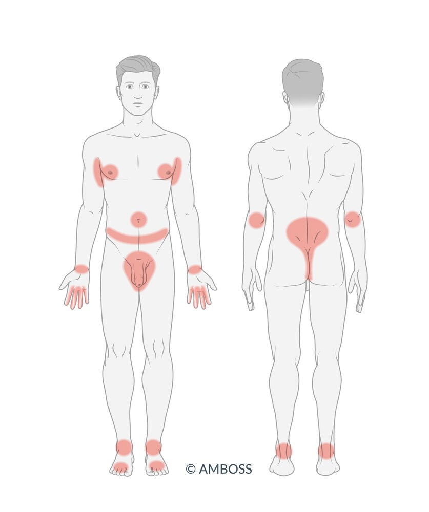

Typical distribution sites of scabies

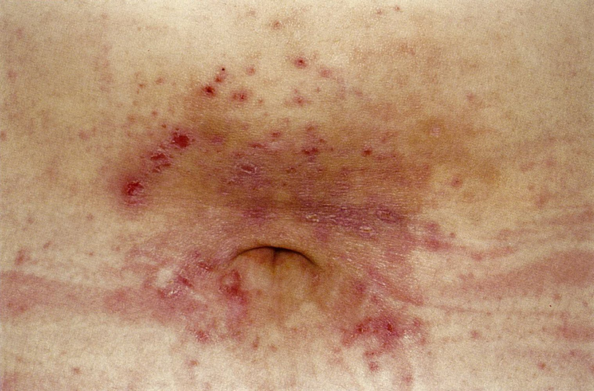

Skin lesion in scabies

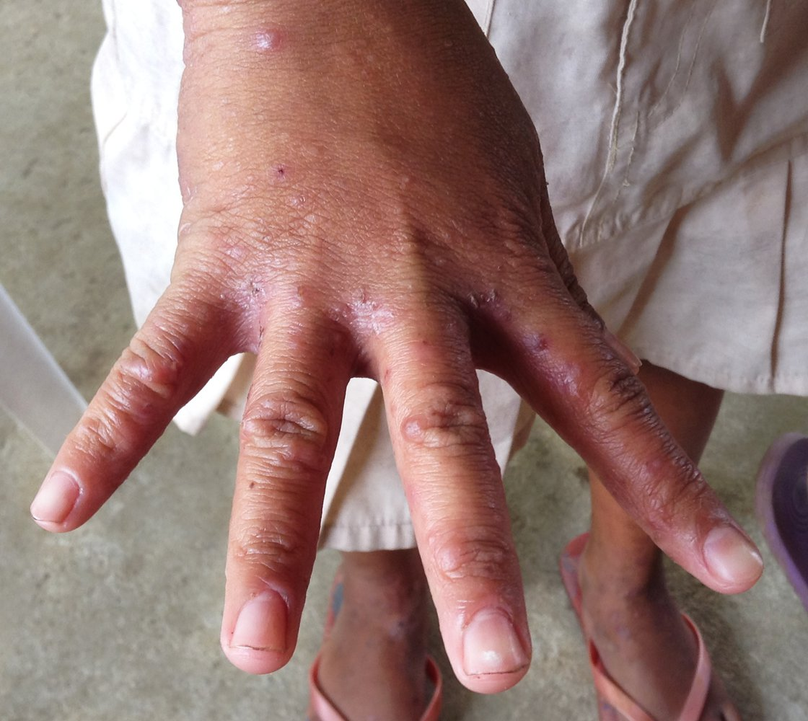

Scabies skin lesions

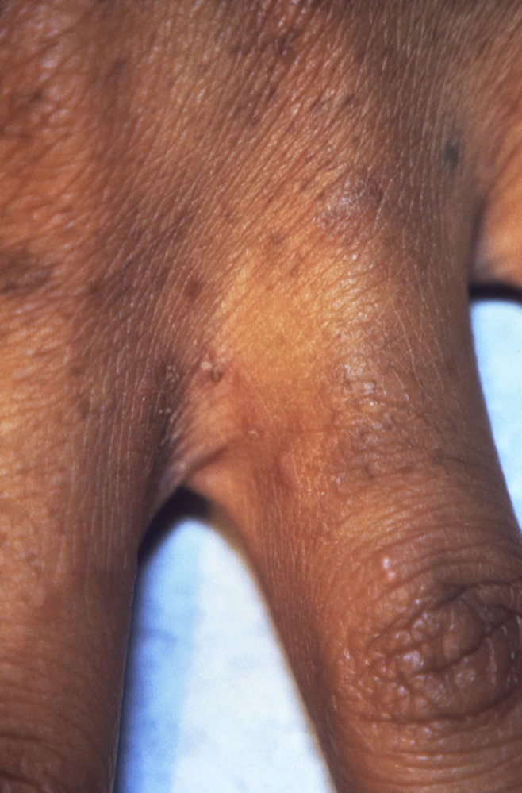

Interdigital skin lesions in scabies

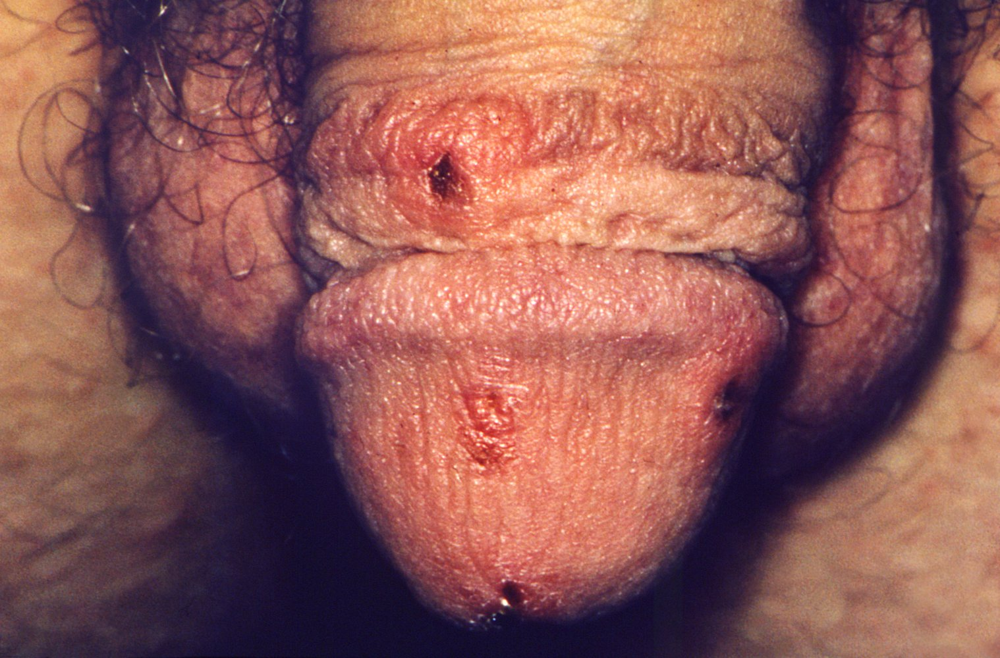

Penile skin lesion in scabies

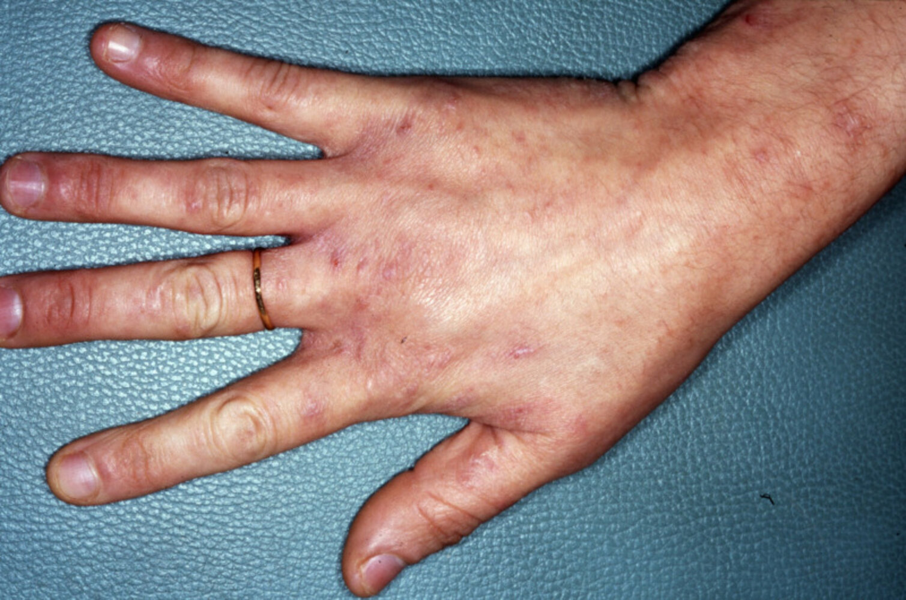

Scabies

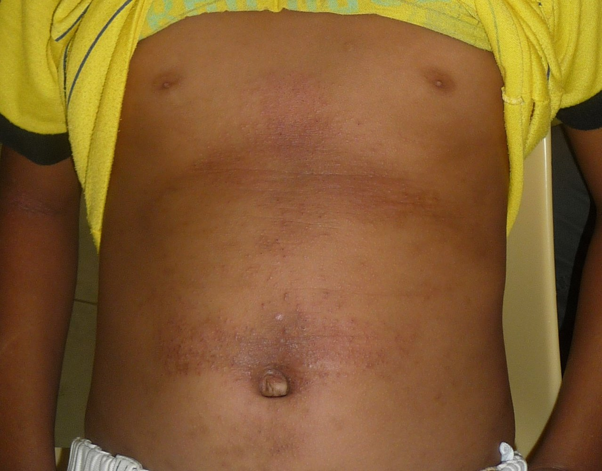

Scabies

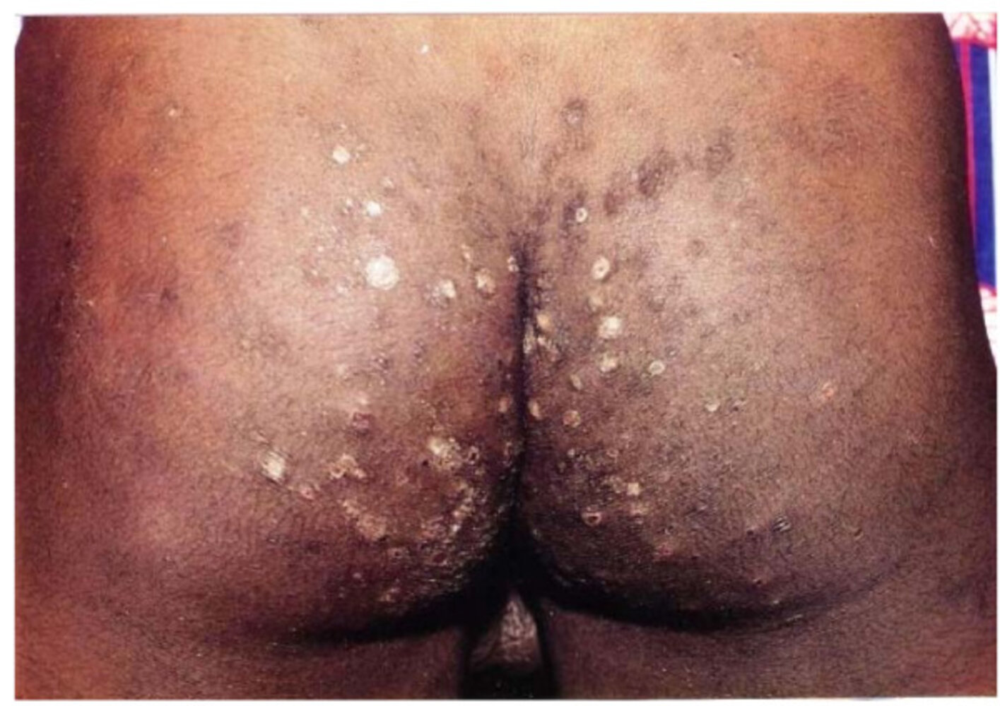

Scabies

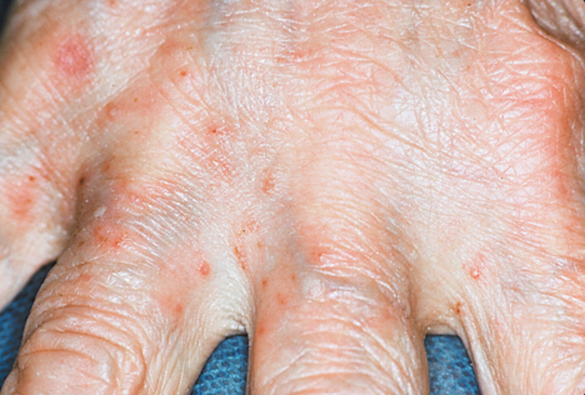

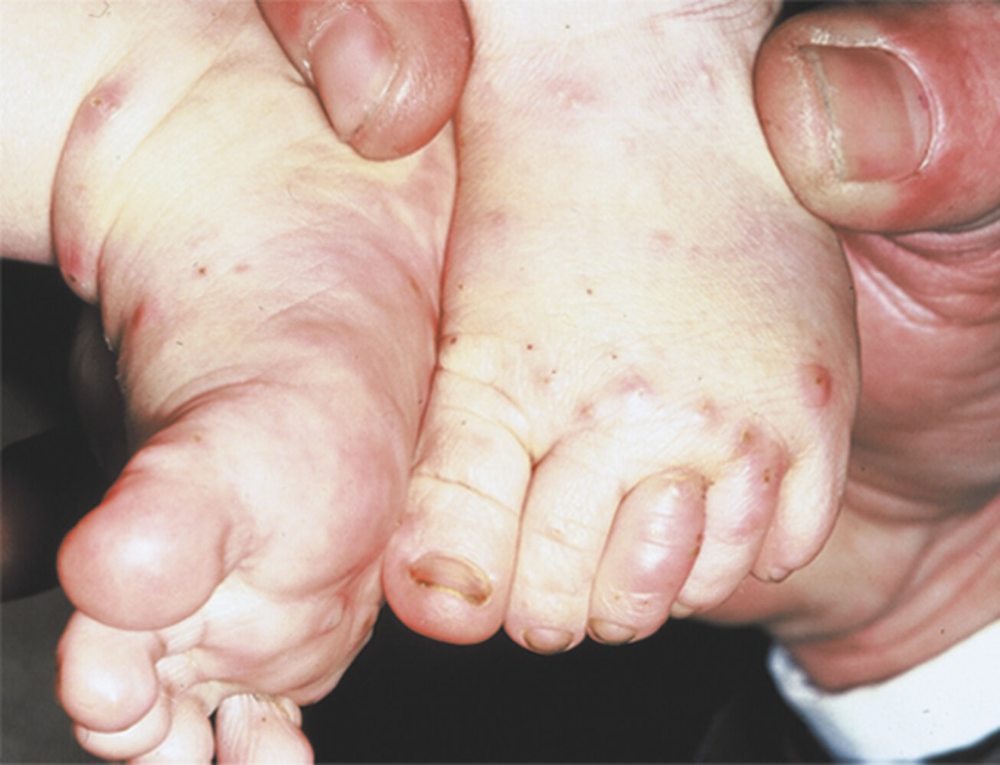

---

## Subtypes and variants

### Crusted scabies (<u>Norwegian scabies</u>)

* Definition: a rare, severe, and highly contagious form of scabies that presents with a large number of scabies <u>mites</u> and eggs on the <u>skin</u>

* <u>Epidemiology</u>: typically occurs in <u>immunosuppressed</u> (e.g., <u>HIV</u>), debilitated, or elderly patients

* Clinical features

* Slightly pronounced or absent <u>pruritus</u>

* Lesions

* Thick crusts or scales on an <u>erythematous</u> base with irregular borders

* May have a <u>wart</u>-like appearance and fissures

* <u>Nail</u> changes (i.e., <u>dystrophic</u>, thick)

* Location

* Typical areas include the scalp, hands, and feet

* May involve the whole integument (especially if left untreated)

* Treatment: rapid and aggressive medical therapy with a <u>scabicidal agent</u> to prevent an <u>outbreak</u>

> [!WARNING]
> <u>Crusted scabies</u> is highly contagious and should be treated aggressively in affected individuals and their close contacts. Appropriate <u>isolation precautions</u> should also be taken to prevent transmission. [[1]](https://coursology-qbank.com/amboss/article/6pajql)

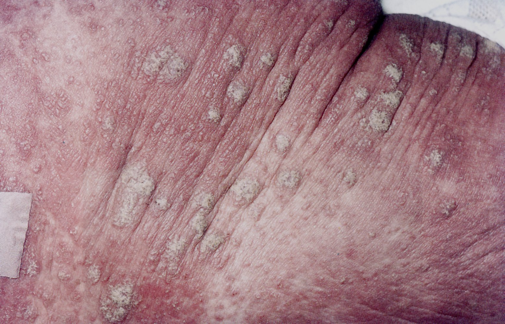

Crusted scabies (Norwegian scabies)

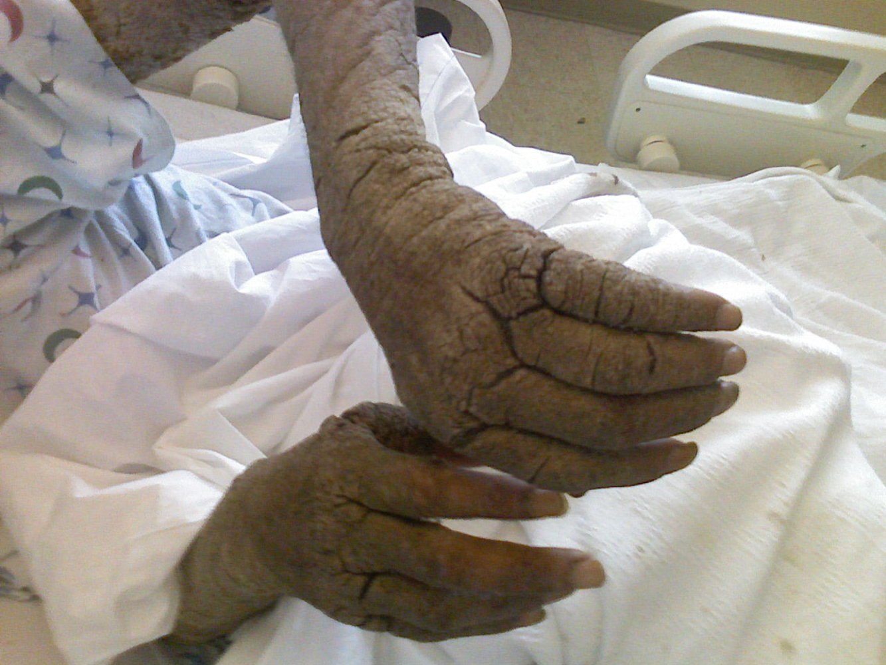

Crusted scabies (Norwegian scabies)

---

## Diagnosis

* Diagnosis is typically clinical.

* Detection of <u>mites</u>, larvae, <u>ova</u>, or <u>mite</u> feces on any of the following: [[2]](https://coursology-qbank.com/amboss/article/czca7U0)[[4]](https://coursology-qbank.com/amboss/article/2NcT010)

* <u>Dermoscopy</u>

* Microscopic <u>examination of the skin</u>

* <u>Skin</u> scraping and <u>histology</u> (low <u>sensitivity</u>)

> [!TIP]
> Scabies may be mistaken for <u>eczema</u>, especially as the topical use of <u>glucocorticoids</u> initially alleviates symptoms.

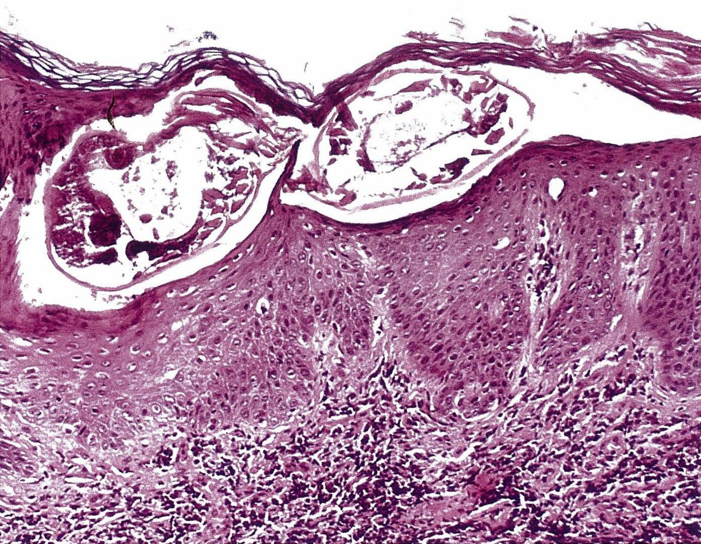

Crusted scabies (Norwegian scabies)

---

## Treatment

### General principles [[2]](https://coursology-qbank.com/amboss/article/czca7U0)[[4]](https://coursology-qbank.com/amboss/article/2NcT010)

* Start treatment with a <u>scabicidal agent</u>.

* Treat <u>pruritus</u> with oral <u>antihistamines</u> and/or <u>topical corticosteroids</u> as needed. [[5]](https://coursology-qbank.com/amboss/article/Ef18LT0)

* Treat secondary bacterial infection of the lesions with topical or systemic <u>antibiotics</u>; see “<u>Antibiotic therapy for skin and soft tissue infections</u>” for details. [[5]](https://coursology-qbank.com/amboss/article/Ef18LT0)

* Advise all patients

* On measures to prevent transmission and reinfection

* To trim fingernails to reduce the risk of <u>excoriation</u> and <u>superinfection</u>

* To stay home from school or work until treatment is completed [[1]](https://coursology-qbank.com/amboss/article/6pajql)

* For suspected treatment failure,  use of a different <u>scabicidal agent</u> is recommended. [[4]](https://coursology-qbank.com/amboss/article/2NcT010)

> [!TIP]
> Itching may persist for up to 2 weeks after treatment. If symptoms last longer, consider treatment failure, reinfection, or alternative diagnoses. [[2]](https://coursology-qbank.com/amboss/article/czca7U0)[[4]](https://coursology-qbank.com/amboss/article/2NcT010)

### Scabicidal agents [[2]](https://coursology-qbank.com/amboss/article/czca7U0)[[4]](https://coursology-qbank.com/amboss/article/2NcT010)[[6]](https://coursology-qbank.com/amboss/article/90dNRo0)

#### First-line (for adults and children)

* <u>Permethrin</u> 5% cream DOSAGE [[2]](https://coursology-qbank.com/amboss/article/czca7U0)[[4]](https://coursology-qbank.com/amboss/article/2NcT010)

* Dose may be repeated in one week. [[2]](https://coursology-qbank.com/amboss/article/czca7U0)

> [!TIP]
> A single application of <u>permethrin</u> 5% cream is usually curative, but symptoms of <u>pruritus</u> may persist for up to 2 weeks. [[2]](https://coursology-qbank.com/amboss/article/czca7U0)

> [!NOTE]
> Mechanism of action of <u>permethrin</u>: inhibition of <u>voltage-gated sodium channels</u> in the <u>mite</u> → delayed <u>repolarization</u> of <u>neurons</u> → <u>paralysis</u> and <u>death</u> of the <u>mite</u>

#### Alternatives

* For adults only

* Oral <u>ivermectin</u> (<u>off-label</u>) DOSAGE [[4]](https://coursology-qbank.com/amboss/article/2NcT010)

* Crotamiton 10% cream DOSAGE  [[5]](https://coursology-qbank.com/amboss/article/Ef18LT0)[[6]](https://coursology-qbank.com/amboss/article/90dNRo0)

* Lindane 1% lotion DOSAGE: Consider only in nonpregnant nonlactating adults who do not respond to or cannot tolerate other agents.  [[4]](https://coursology-qbank.com/amboss/article/2NcT010)

* For adults and children: sulfur 5–10% ointment DOSAGE  [[5]](https://coursology-qbank.com/amboss/article/Ef18LT0)[[6]](https://coursology-qbank.com/amboss/article/90dNRo0)

> [!TIP]
> Oral <u>ivermectin</u> has limited ovicidal action. If used to treat scabies, a second dose is required after 14 days. [[4]](https://coursology-qbank.com/amboss/article/2NcT010)

> [!NOTE]
> Mechanism of action of <u>lindane</u>: blocks <u>GABA</u> channels → <u>neurotoxicity</u> in the <u>mite</u>

### Prevention of transmission and reinfection [[1]](https://coursology-qbank.com/amboss/article/6pajql)

* Wash all clothing and bedding in hot water ≥ 50°C (≥ 122°F).  [[1]](https://coursology-qbank.com/amboss/article/6pajql)[[2]](https://coursology-qbank.com/amboss/article/czca7U0)

* Treat all of the following individuals simultaneously with the patient: 

* Household members within the last month

* Sexual partners within the last two months [[1]](https://coursology-qbank.com/amboss/article/6pajql)[[2]](https://coursology-qbank.com/amboss/article/czca7U0)

* Advise household members to avoid direct, prolonged contact with the patient's <u>skin</u>, bedding, and clothing until treatment completion.

* In the event of a suspected <u>outbreak</u>:

* Notify the local health department.

* Increase surveillance to identify new cases.

---