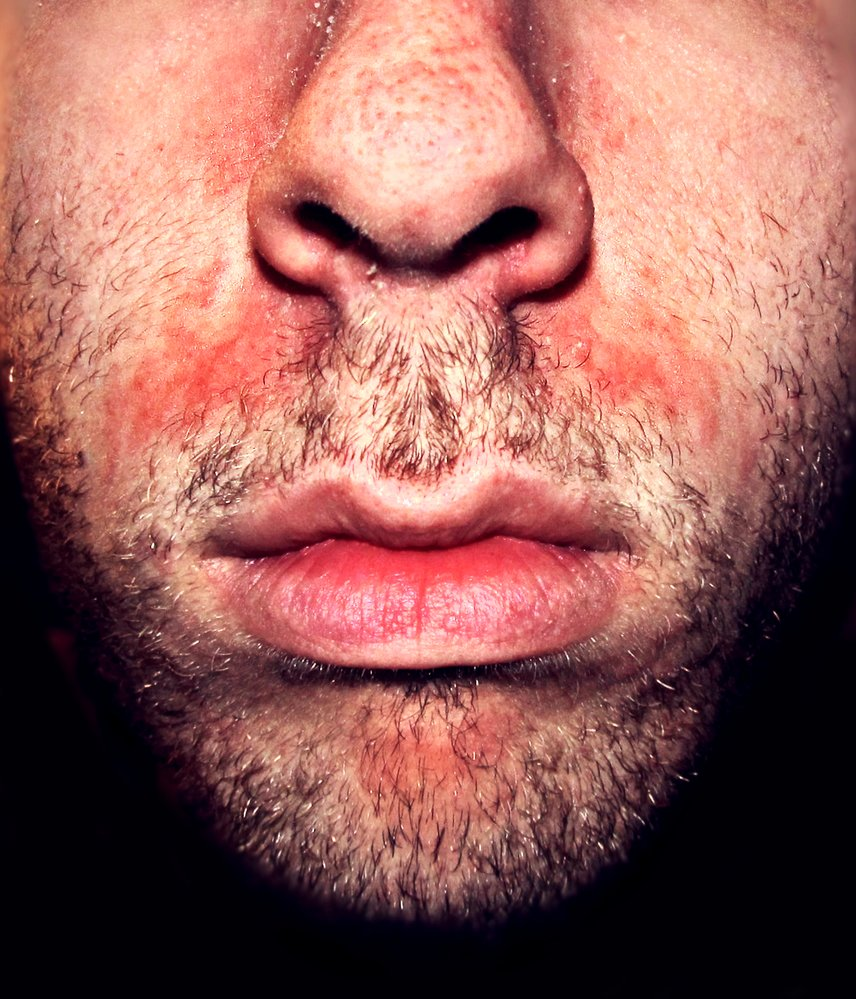
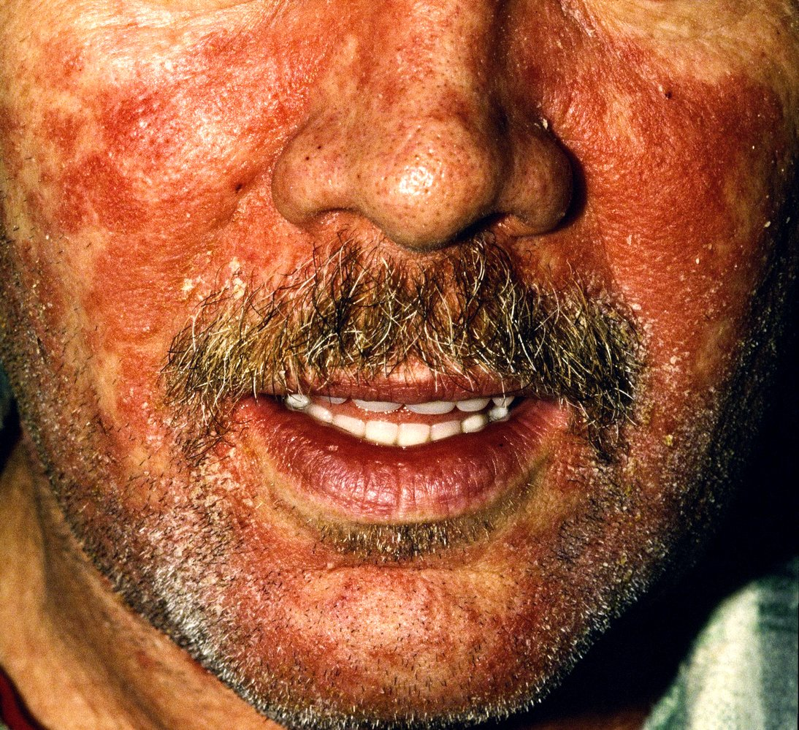
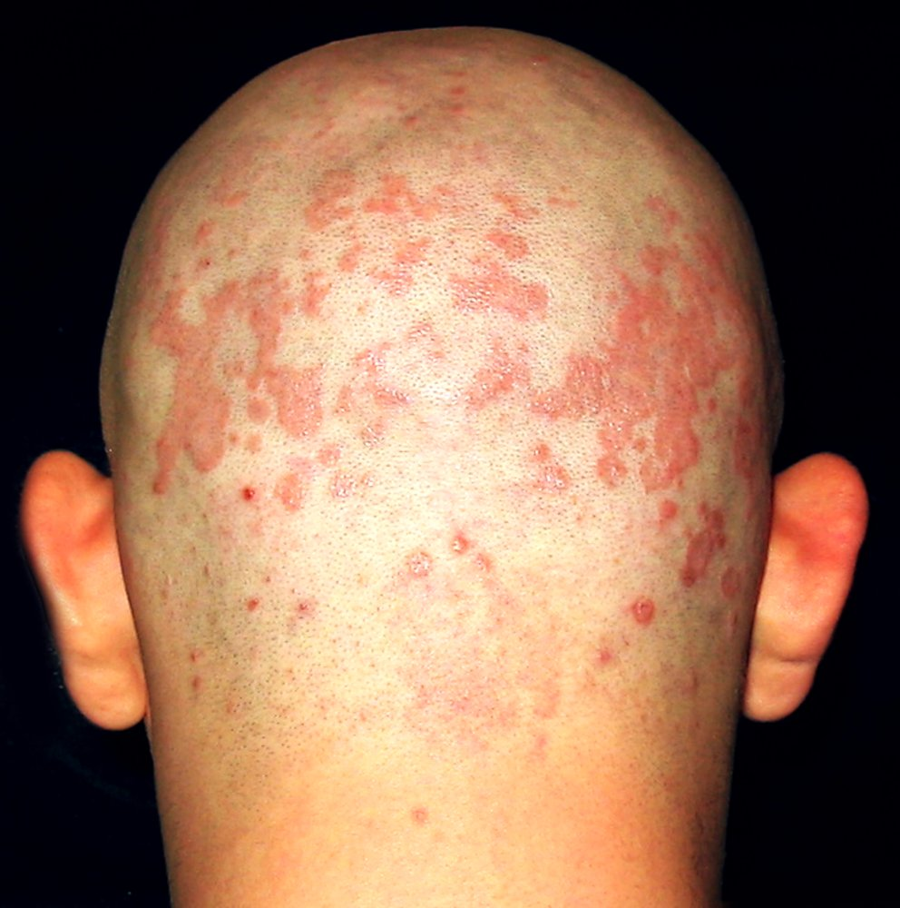
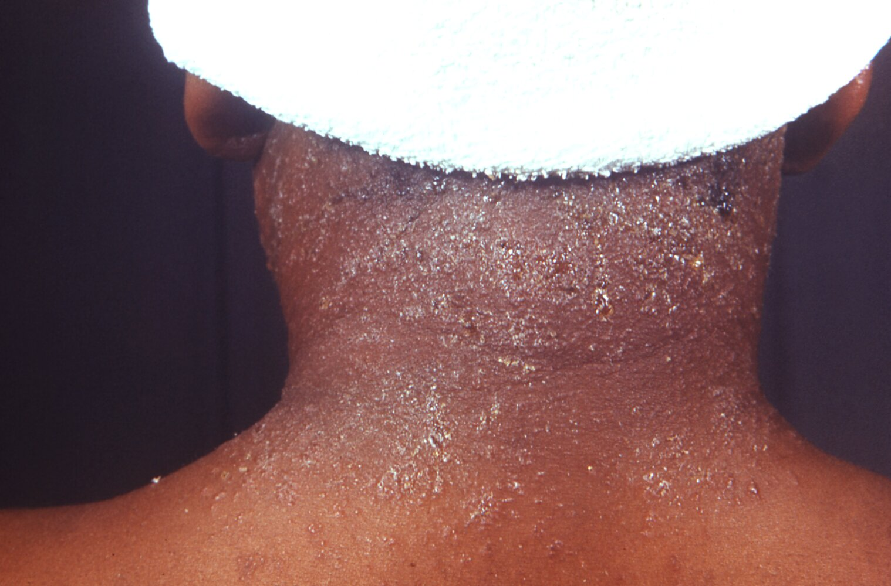
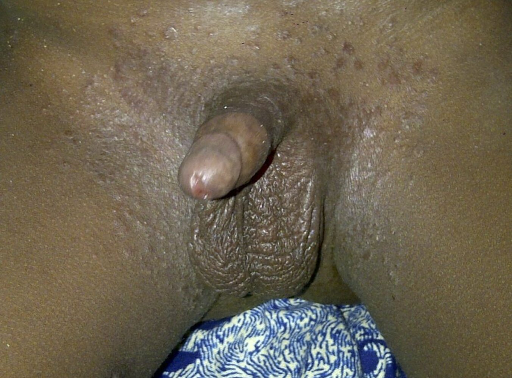

# Seborrheic dermatitis

*Categories: Clinical knowledge > Pediatrics > Pediatric dermatology > Seborrheic dermatitis*

[Original Article Link](https://coursology-qbank.com/amboss/article/Vk0G5T)

---

## Summary

Seborrheic dermatitis is a common chronic inflammatory <u>skin</u> condition that affects areas with a high concentration of <u>sebaceous glands</u> (e.g., scalp, face). The etiology is unknown, but microbial <u>colonization</u> of the <u>skin</u> (esp. Malassezia species), hormonal and immunological factors, and climate have been implicated. Seborrheic dermatitis typically manifests as <u>erythematous</u> patches or <u>plaques</u> with overlying <u>scaling</u> or greasy yellow crusts. Symptoms include burning and/or itching. Diagnosis is clinical. Treatment typically begins with topical <u>antifungal agents</u>; depending on severity and areas of involvement, other topical and/or systemic anti-inflammatory agents may be used. <u>Ongoing management of seborrheic dermatitis</u> may include pharmacotherapy to prevent disease flares.

<u>Infantile seborrheic dermatitis</u> (<u>cradle cap</u>) is a subtype of seborrheic dermatitis that appears within the first 3 months after <u>birth</u> and often affects the scalp. <u>Infantile seborrheic dermatitis</u> usually resolves without intervention by 12 months of age.

---

## Epidemiology

* Sex: <u>♂</u> > <u>♀</u> [[1]](https://coursology-qbank.com/amboss/article/lPWvUl0)

* <u>Bimodal distribution</u>: <u>infants</u> from within the first 3 months to 12 months; <u>puberty</u> and early adulthood [[2]](https://coursology-qbank.com/amboss/article/ZgdZF60)

* <u>Prevalence</u>: approximately 2–5% of general population worldwide [[1]](https://coursology-qbank.com/amboss/article/lPWvUl0)[[3]](https://coursology-qbank.com/amboss/article/zTdrt60)

Epidemiological data refers to the US, unless otherwise specified.

---

## Etiology

* Unknown etiology; may be associated with Malassezia species

* Predisposing factors 

* <u>Parkinson disease</u>

* <u>Immunodeficiency</u> (e.g., <u>HIV</u> infection)

* Oily <u>skin</u> (seborrhea)

* <u>Androgenetic alopecia</u>

* Familial history of seborrheic dermatitis, <u>psoriasis</u>

References:[[4]](https://coursology-qbank.com/amboss/article/q7aC5N)[[5]](https://coursology-qbank.com/amboss/article/I7aYMN)[[6]](https://coursology-qbank.com/amboss/article/A9aRJ5)

---

## Pathophysiology

* The pathophysiology is not yet fully understood.

* <u>Colonization</u> of the <u>yeast</u> <u>Malassezia furfur</u> (previously known as Pityrosporum ovale) in areas with <u>sebaceous glands</u>

* Inadequate or abnormal <u>immune response</u> to Malassezia ) and/or exposure to irritants (toxin production or <u>lipase</u> activity)

* Subsequent inflammatory reaction of the <u>skin</u> (the <u>sebaceous glands</u> themselves are not typically inflamed)

* <u>Endogenous</u> precipitants; : psychological <u>stress</u>; , fatigue, <u>sleep deprivation</u>, and hormonal changes

* <u>Exogenous</u> precipitants; : climate (the condition improves in the summer months and worsens in winter; ), trauma (e.g., <u>excoriation</u> of the <u>skin</u> from scratching), medication

References:[[4]](https://coursology-qbank.com/amboss/article/q7aC5N)[[5]](https://coursology-qbank.com/amboss/article/I7aYMN)[[6]](https://coursology-qbank.com/amboss/article/A9aRJ5)[[7]](https://coursology-qbank.com/amboss/article/_9a5J5)

---

## Clinical features

The following applies to adults and <u>adolescents</u>. See “Special patient groups” for features of <u>infantile seborrheic dermatitis</u>. [[3]](https://coursology-qbank.com/amboss/article/zTdrt60)[[8]](https://coursology-qbank.com/amboss/article/K7aU5N)

* Course: chronic, with episodic flares

* Appearance

* <u>Erythematous</u> patches or <u>plaques</u> with:

* <u>Scaling</u>

* Greasy yellow crusts

* Flaking (e.g., dandruff on scalp)

* <u>Hyperpigmentation</u> or <u>hypopigmentation</u>  [[3]](https://coursology-qbank.com/amboss/article/zTdrt60)

* Distribution: areas with;  a high concentration of <u>sebaceous glands</u>, such as hairy and oily <u>skin</u>

* Locations

* Scalp

* Face

* Forehead, hairline, and retroauricular area

* Cheeks

* <u>Nasolabial fold</u>

* Eyebrows and periocular region (may be associated with <u>blepharitis</u>) [[9]](https://coursology-qbank.com/amboss/article/Rhdldp0)

* Trunk (e.g., chest and back)

* <u>Intertriginous areas</u> (e.g., <u>axillae</u>, under <u>breasts</u>, groin) [[10]](https://coursology-qbank.com/amboss/article/0gdeF60)

* Symptoms: itching and burning [[10]](https://coursology-qbank.com/amboss/article/0gdeF60)

> [!WARNING]
> Patients with dark <u>skin</u> tones may present with <u>hypopigmentation</u>, without <u>erythema</u>, and with less <u>scaling</u> than patients with light <u>skin</u> tones. [[3]](https://coursology-qbank.com/amboss/article/zTdrt60)

Seborrheic dermatitis

Seborrheic dermatitis

Seborrheic dermatitis

Seborrheic dermatitis

Seborrheic dermatitis

Seborrheic dermatitis

---

## Diagnosis

* Diagnosis is clinical. [[8]](https://coursology-qbank.com/amboss/article/K7aU5N)

* Diagnostic uncertainty: Obtain <u>skin biopsy</u>.   [[8]](https://coursology-qbank.com/amboss/article/K7aU5N)

* Severe, extensive, and/or refractory disease: Consider evaluation for underlying medical conditions. [[3]](https://coursology-qbank.com/amboss/article/zTdrt60)[[10]](https://coursology-qbank.com/amboss/article/0gdeF60)

* Immunocompromising conditions (e.g., <u>HIV</u>) [[11]](https://coursology-qbank.com/amboss/article/mLdVyq0)

* Neurologic conditions (e.g., <u>Parkinson disease</u>, <u>stroke</u>)

---

## Differential diagnoses

* See “<u>Rash</u>.”

* See “<u>Differential diagnosis of scaling</u>” in “<u>Psoriasis</u>.”

* <u>Atopic dermatitis</u>: Lesions are usually dry (rather than greasy) and often occur on flexural surfaces. [[12]](https://coursology-qbank.com/amboss/article/Cndqvq0)

* <u>Contact dermatitis</u> (e.g., <u>allergic contact dermatitis</u>, <u>irritant contact dermatitis</u>): The <u>rash</u> distribution reflects the areas and shapes of external exposure. [[8]](https://coursology-qbank.com/amboss/article/K7aU5N)

* <u>Dermatophyte infections</u>: <u>Tinea corporis</u> lesions are typically annular with central clearing; <u>tinea capitis</u> typically involves <u>alopecia</u> and broken <u>hair shafts</u>. [[13]](https://coursology-qbank.com/amboss/article/iTdJq60)

* <u>Rosacea</u>: <u>erythematous</u> <u>papular</u> and <u>pustular</u> lesions across chin, forehead, cheeks, and nose [[14]](https://coursology-qbank.com/amboss/article/QSduz60)

* <u>Candidiasis</u>: typically occurs in <u>intertriginous areas</u> and on <u>mucosal</u> surfaces; characteristic satellite lesions on <u>skin</u> [[15]](https://coursology-qbank.com/amboss/article/i0YJfn)

The differential diagnoses listed here are not exhaustive.

---

## Management

Goals of management are to reduce active lesions, mitigate symptoms, and prevent disease flares. [[3]](https://coursology-qbank.com/amboss/article/zTdrt60)[[8]](https://coursology-qbank.com/amboss/article/K7aU5N)

### Approach [[3]](https://coursology-qbank.com/amboss/article/zTdrt60)[[8]](https://coursology-qbank.com/amboss/article/K7aU5N)[[16]](https://coursology-qbank.com/amboss/article/kndmtq0)

* Advise avoiding precipitating factors, if possible (e.g., <u>stress</u>). [[9]](https://coursology-qbank.com/amboss/article/Rhdldp0)

* Initiate treatment for active seborrheic dermatitis based on severity and areas of involvement.

* All patients: topical <u>antifungals</u> (e.g., <u>ketoconazole</u>, <u>selenium</u> sulfide shampoo, <u>zinc</u> pyrithione shampoo)

* Moderate to severe disease:  Consider a short course of <u>topical corticosteroids</u> (e.g., up to 4 weeks) in addition to <u>antifungals</u>. [[17]](https://coursology-qbank.com/amboss/article/phdLUp0)

* Widespread disease: Refer to dermatology for consideration of systemic therapy.

* Assess response to treatment after 2–8 weeks.

* If active disease is resolved, initiate <u>ongoing management of seborrheic dermatitis</u>.

* For persistent or worsening symptoms, consider:

* Addition of a <u>topical corticosteroid</u> (if not yet tried)

* <u>Treatment of refractory seborrheic dermatitis</u> (including, e.g., referral to dermatology for consideration of systemic therapy)

> [!TIP]
> Exposure to sunlight reduces symptoms in some individuals and precipitates symptoms in others. [[9]](https://coursology-qbank.com/amboss/article/Rhdldp0)

### Treatment of active seborrheic dermatitis [[3]](https://coursology-qbank.com/amboss/article/zTdrt60)[[8]](https://coursology-qbank.com/amboss/article/K7aU5N)[[16]](https://coursology-qbank.com/amboss/article/kndmtq0)

#### Initial treatment

|  Initial topical therapy for seborrheic dermatitis [[3]](https://coursology-qbank.com/amboss/article/zTdrt60)[[8]](https://coursology-qbank.com/amboss/article/K7aU5N)[[16]](https://coursology-qbank.com/amboss/article/kndmtq0)  |  |  |
| --- | --- | --- |
|  | Scalp | Face and body |
| <u>Antifungals</u> |   * <u>Ketoconazole</u> (<u>off-label</u>) DOSAGE [[8]](https://coursology-qbank.com/amboss/article/K7aU5N)  * <u>Ciclopirox</u> DOSAGE  * <u>Selenium</u> sulfide shampoo (over the counter)  * <u>Zinc</u> pyrithione shampoo (over the counter)    |   * <u>Ketoconazole</u> DOSAGE  [[8]](https://coursology-qbank.com/amboss/article/K7aU5N)  * <u>Ciclopirox</u> (<u>off-label</u>) DOSAGE [[8]](https://coursology-qbank.com/amboss/article/K7aU5N)  * Sertaconazole (<u>off-label</u>) DOSAGE [[8]](https://coursology-qbank.com/amboss/article/K7aU5N)    |
| <u>Corticosteroids</u> |   * <u>Betamethasone</u> DOSAGE [[8]](https://coursology-qbank.com/amboss/article/K7aU5N)  * <u>Fluocinolone</u> solution DOSAGE [[8]](https://coursology-qbank.com/amboss/article/K7aU5N)    |   * <u>Betamethasone</u> DOSAGE [[8]](https://coursology-qbank.com/amboss/article/K7aU5N)  * <u>Desonide</u> DOSAGE  [[8]](https://coursology-qbank.com/amboss/article/K7aU5N)  * <u>Fluocinolone</u> solution DOSAGE [[8]](https://coursology-qbank.com/amboss/article/K7aU5N)  * <u>Fluocinolone</u> cream DOSAGE [[8]](https://coursology-qbank.com/amboss/article/K7aU5N)  * <u>Hydrocortisone</u> 1% cream or ointment (over the counter) [[8]](https://coursology-qbank.com/amboss/article/K7aU5N)    |

> [!TIP]
> Topical <u>antifungal</u> therapy is the first-line treatment for seborrheic dermatitis affecting the scalp, face, and/or body. [[8]](https://coursology-qbank.com/amboss/article/K7aU5N)

> [!WARNING]
> <u>Topical corticosteroid</u> use should be intermittent and limited to 2–4 weeks at a time to reduce the risk of adverse effects (e.g., <u>atrophy</u>, <u>hypopigmentation</u>). [[8]](https://coursology-qbank.com/amboss/article/K7aU5N)

#### Treatment of refractory seborrheic dermatitis

* Topical

* <u>Calcineurin inhibitors</u>: only used for nonscalp disease

* <u>Pimecrolimus</u> (<u>off-label</u>) DOSAGE [[8]](https://coursology-qbank.com/amboss/article/K7aU5N)

* <u>Tacrolimus</u> (<u>off-label</u>) DOSAGE [[8]](https://coursology-qbank.com/amboss/article/K7aU5N)

* <u>Roflumilast</u>   [[18]](https://coursology-qbank.com/amboss/article/Fhdgfp0)

* Systemic

* Systemic <u>antifungals</u>

* <u>Isotretinoin</u>

### Ongoing management of seborrheic dermatitis

* Prevention of flares

* Scalp dermatitis: Consider weekly use of topical <u>antifungal</u> shampoo (e.g., <u>ketoconazole</u>, <u>ciclopirox</u>). [[8]](https://coursology-qbank.com/amboss/article/K7aU5N)

* Face and/or body seborrheic dermatitis: topical <u>ketoconazole</u> as needed (up to once daily) [[8]](https://coursology-qbank.com/amboss/article/K7aU5N)[[17]](https://coursology-qbank.com/amboss/article/phdLUp0)

* Treatment of acute flares: See “<u>Treatment of active seborrheic dermatitis</u>.”

> [!TIP]
> Seborrheic dermatitis is a chronic disease; long-term management involves <u>maintenance therapy</u> to reduce the risk of disease flares and acute treatment as needed. [[3]](https://coursology-qbank.com/amboss/article/zTdrt60)[[8]](https://coursology-qbank.com/amboss/article/K7aU5N)

---

## Complications

* Exacerbation of seborrheic dermatitis may lead to generalized <u>erythroderma</u>.

* Secondary bacterial infection

We list the most important complications. The selection is not exhaustive.

---

## Prognosis

Seborrheic dermatitis often has a chronic, recurrent course with flares requiring intermittent treatment. [[8]](https://coursology-qbank.com/amboss/article/K7aU5N)

---

## Special patient groups

### Infantile seborrheic dermatitis [[2]](https://coursology-qbank.com/amboss/article/ZgdZF60)[[8]](https://coursology-qbank.com/amboss/article/K7aU5N)

* Onset: typically within the first 3 months after <u>birth</u> [[2]](https://coursology-qbank.com/amboss/article/ZgdZF60)

* Clinical features

* Appearance: <u>Erythematous</u> (or salmon-colored) patches with greasy, yellow, adherent scales

* Location:

* Scalp (common; also known as <u>cradle cap</u>)

* Face (e.g., forehead, nose, retroauricular area) [[3]](https://coursology-qbank.com/amboss/article/zTdrt60)

* <u>Intertriginous areas</u> (e.g., neck, diaper area)

* Subtypes and variants: <u>desquamative erythroderma</u> (Leiner disease) ;  [[19]](https://coursology-qbank.com/amboss/article/G3dBPp0)

* Most severe form of <u>infantile seborrheic dermatitis</u>

* Clinical features include <u>erythroderma</u>, recurrent <u>diarrhea</u>, and <u>failure to thrive</u>.

* Diagnosis: clinical [[8]](https://coursology-qbank.com/amboss/article/K7aU5N)

* Differential diagnoses

* <u>Atopic dermatitis</u>: Lesions are usually dry (rather than greasy). [[12]](https://coursology-qbank.com/amboss/article/Cndqvq0)

* <u>Diaper dermatitis</u>;  (due to <u>allergic contact dermatitis</u> or <u>irritant contact dermatitis</u>): usually spares <u>intertriginous areas</u>  [[20]](https://coursology-qbank.com/amboss/article/YLdnwq0)

* Treatment: typically unnecessary

* Counsel parents that:

* The condition is benign.

* Most seborrheic dermatitis resolves spontaneously by 1 year of age. [[2]](https://coursology-qbank.com/amboss/article/ZgdZF60)

* If desired, scales can be removed by:

* Frequent washing with baby shampoo and/or applying softener (e.g., <u>petroleum jelly</u>, mineral oil) to scalp

* Gently scrubbing or combing to remove softened scales

* For refractory <u>infantile seborrheic dermatitis</u>, consider <u>ketoconazole</u> (<u>off-label</u>). [[2]](https://coursology-qbank.com/amboss/article/ZgdZF60)[[8]](https://coursology-qbank.com/amboss/article/K7aU5N)

* Complications:  (rare): <u>erythroderma</u> [[21]](https://coursology-qbank.com/amboss/article/s3dtPp0)

Infantile seborrheic dermatitis (cradle cap)

Diaper dermatitis

---