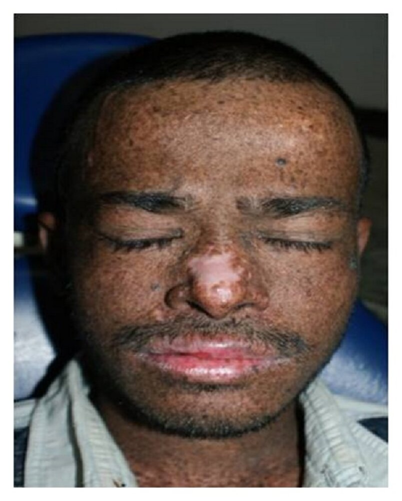

# Xeroderma pigmentosum

*Categories: Clinical knowledge > Pediatrics > Pediatric dermatology > Xeroderma pigmentosum*

[Original Article Link](https://coursology-qbank.com/amboss/article/Wu0PJ3)

---

## Summary

<u>Xeroderma</u> pigmentosum is a rare hereditary disease caused by defective <u>DNA</u> <u>nucleotide excision repair</u> mechanisms. Individuals with <u>xeroderma</u> pigmentosum are at high risk for <u>skin</u> and <u>eye</u> damage from UV radiation exposure, e.g., <u>sunburn</u>, premalignant and malignant <u>skin</u> lesions, dry eyes, and <u>keratitis</u>. Some individuals with <u>xeroderma</u> pigmentosum also experience <u>neurodegenerative disease</u> that affects <u>hearing</u>, gait, and <u>cognition</u>. <u>Genetic testing</u> can confirm the diagnosis. Management is focused on the prevention of UV-related <u>skin</u> and <u>eye</u> damage with strict <u>photoprotective measures</u>, frequent screening for complications, and treatment of cutaneous, ocular, and/or neurological manifestations as indicated.

---

## Etiology

* <u>Autosomal recessive inheritance</u>  [[2]](https://coursology-qbank.com/amboss/article/pTdL760)

* Genetic mutations cause defects in <u>DNA</u> <u>nucleotide excision repair</u> mechanisms.

---

## Clinical features

* Cutaneous manifestations  [[2]](https://coursology-qbank.com/amboss/article/pTdL760)

* Slow healing, <u>blistering</u> <u>burns</u> after minimal exposure to sunlight in ∼ 60% of affected individuals [[1]](https://coursology-qbank.com/amboss/article/GfdBn60)

* <u>Solar lentigines</u>, <u>xerosis</u>, and <u>poikiloderma</u> due to repeated exposure to sunlight

* Premalignant lesions (e.g., <u>actinic keratoses</u>) and malignant lesions often develop during early childhood.  [[2]](https://coursology-qbank.com/amboss/article/pTdL760)

* Ocular manifestations [[1]](https://coursology-qbank.com/amboss/article/GfdBn60)[[4]](https://coursology-qbank.com/amboss/article/RAXlj00)

* <u>Photophobia</u> and dry eyes

* <u>Atrophy</u> of eyelids, loss of eyelashes

* <u>Keratitis</u>, corneal opacification, loss of <u>vision</u>

* <u>Malignancy</u>

* Neurological manifestations: Progressive neurodegeneration affects ∼ 25% of patients. [[2]](https://coursology-qbank.com/amboss/article/pTdL760)

* Cognitive impairment

* <u>Sensorineural hearing loss</u>

* <u>Ataxia</u>

* <u>Spasticity</u> [[3]](https://coursology-qbank.com/amboss/article/8fdOL60)

* Decreased <u>deep tendon reflexes</u>

> [!TIP]
> In patients with <u>xeroderma</u> pigmentosum, minimal UV radiation often causes severe <u>skin</u> damage and increases the risk of <u>skin</u> cancer. [[1]](https://coursology-qbank.com/amboss/article/GfdBn60)

Xeroderma pigmentosum

---

## Management

Treatment of <u>xeroderma</u> pigmentosum is focused on preventing damage from UV exposure and early identification and treatment of complications.

### Prevention of UV radiation damage [[1]](https://coursology-qbank.com/amboss/article/GfdBn60)[[5]](https://coursology-qbank.com/amboss/article/tfdXL60)

* Advise strict <u>photoprotective measures</u> for <u>skin</u> and eyes.

* Perform <u>skin</u> <u>cancer screening</u> and ophthalmic examinations every 3–6 months. [[5]](https://coursology-qbank.com/amboss/article/tfdXL60)[[6]](https://coursology-qbank.com/amboss/article/VgdG860)

* Pharmacological <u>keratinocyte carcinoma</u> prophylaxis may be considered, e.g.: [[4]](https://coursology-qbank.com/amboss/article/RAXlj00)

* Systemic <u>retinoids</u>

* Topical 5-<u>fluorouracil</u> or <u>imiquimod</u> [[7]](https://coursology-qbank.com/amboss/article/2gdTu60)

> [!WARNING]
> Individuals with <u>xeroderma</u> pigmentosum are at increased risk of <u>vitamin D deficiency</u> due to reduced exposure to <u>UV light</u>. Assess for and <u>treat vitamin D deficiency</u> as indicated. [[4]](https://coursology-qbank.com/amboss/article/RAXlj00)[[8]](https://coursology-qbank.com/amboss/article/3gdSE60)

### Management of specific disease manifestations [[1]](https://coursology-qbank.com/amboss/article/GfdBn60)[[6]](https://coursology-qbank.com/amboss/article/VgdG860)

Management of <u>xeroderma</u> pigmentosum requires a <u>multidisciplinary care</u> team (e.g., dermatology, ophthalmology, and <u>neurology</u>).

* Cutaneous disease [[3]](https://coursology-qbank.com/amboss/article/8fdOL60)

* Treat premalignant <u>skin</u> lesions (e.g., <u>actinic keratosis</u>) aggressively to prevent progression.

* For malignant lesions, <u>radiotherapy</u> is usually avoided.  [[3]](https://coursology-qbank.com/amboss/article/8fdOL60)[[9]](https://coursology-qbank.com/amboss/article/L3dwQp0)

* Ocular disease

* Provide <u>treatment for dry eye disease</u> as needed. [[10]](https://coursology-qbank.com/amboss/article/FfdgL60)

* Refer to ophthalmology for:

* UV protective contact lenses.

* Treatment of UV-induced <u>eye</u> damage and tumors.

* Neurological disease [[1]](https://coursology-qbank.com/amboss/article/GfdBn60)[[5]](https://coursology-qbank.com/amboss/article/tfdXL60)

* Refer affected patients to <u>neurology</u>.

* Regularly screen patients for <u>hearing loss</u>.

* Refer as needed to for physical, <u>occupational therapy</u>, and <u>speech therapy</u>. [[6]](https://coursology-qbank.com/amboss/article/VgdG860)

### <u>Supportive care</u> [[1]](https://coursology-qbank.com/amboss/article/GfdBn60)

* Offer <u>genetic counseling</u> to all patients.

* Provide resources for the management of psychosocial issues related to social isolation, e.g.: [[8]](https://coursology-qbank.com/amboss/article/3gdSE60)

* Support groups for patients with <u>xeroderma</u> pigmentosum

* Psychological counseling

> [!TIP]
> Individuals with <u>xeroderma</u> pigmentosum are at increased risk for <u>lung cancer</u> and should be advised to abstain from tobacco use. [[4]](https://coursology-qbank.com/amboss/article/RAXlj00)

---

## Complications

* <u>Skin</u> cancer (<u>basal cell carcinoma</u>, <u>squamous cell carcinoma</u>, <u>melanoma</u>) at a young age (< 20 years)  [[2]](https://coursology-qbank.com/amboss/article/pTdL760)

* <u>Malignant tumors</u> of the:

* Eyes

* Eyelids

* <u>Central nervous system</u>

* <u>Lung cancer</u>

We list the most important complications. The selection is not exhaustive.

---