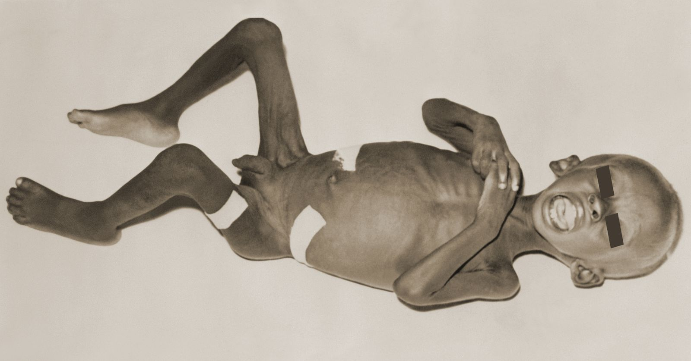
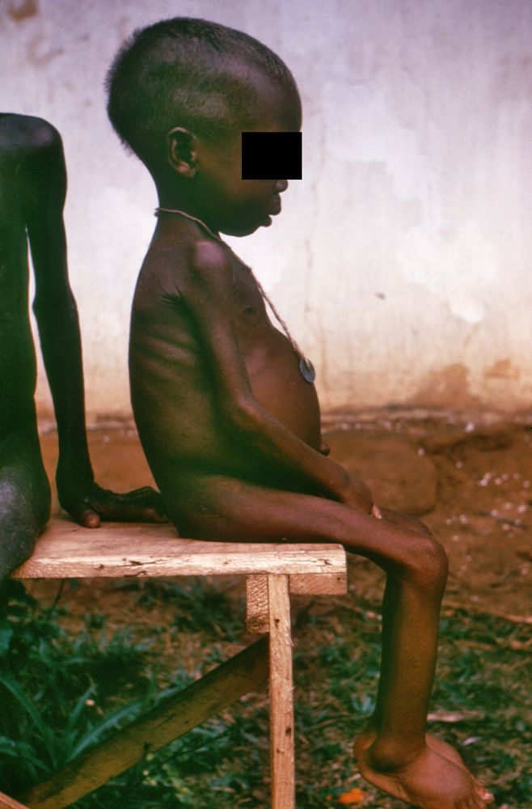

# Acute primary malnutrition in children

*Categories: Clinical knowledge > Pediatrics > Pediatric endocrinology and metabolism > Acute primary malnutrition in children*

[Original Article Link](https://coursology-qbank.com/amboss/article/Gp0BIS)

---

## Summary

<u>Acute malnutrition in children</u> manifests as <u>childhood wasting</u> and/or <u>nutritional edema</u>. It most commonly affects children ≤ 5 years of age and is caused by a combination of biological, sociopolitical, and environmental factors. Primary <u>malnutrition</u> is inadequate intake of the <u>nutrients</u> needed for normal growth and development. <u>Secondary malnutrition</u> is caused by systemic disease. Acute <u>malnutrition</u> is a <u>clinical diagnosis</u>, and severity is determined by anthropometric diagnostic criteria. Diagnostic studies can assess for complications and exclude causes of <u>secondary malnutrition</u>. Management is primarily focused on nutritional <u>rehabilitation</u> and addressing <u>modifiable risk factors</u> and complications. Prevention requires comprehensive interventions, such as caregiver education and ensuring the availability of food and health care services.

<u>Secondary malnutrition</u> is covered in a separate article. See "<u>Growth faltering</u>" and "<u>Overweight and obesity in children</u>" for details on other types of <u>malnutrition</u> in children.

---

## Definitions

* Acute malnutrition in children: <u>malnutrition</u> in a child < 5 years of age leading to either <u>childhood wasting</u> or <u>nutritional edema</u>  [[1]](https://coursology-qbank.com/amboss/article/y-dd-s0)[[2]](https://coursology-qbank.com/amboss/article/2bVTGG0)

* <u>Childhood wasting</u>: a low weight-for-height or weight-for-length score  or low <u>mid-upper arm circumference</u> (<u>MUAC</u>)

* Nutritional edema: bilateral pitting swelling caused by severe <u>malnutrition</u>; low protein intake and metabolic derangements lead to fluid accumulation in tissues, starting at the feet and moving up the legs and body [[1]](https://coursology-qbank.com/amboss/article/y-dd-s0)

* Severe acute malnutrition: <u>malnutrition</u> with any of the following criteria [[1]](https://coursology-qbank.com/amboss/article/y-dd-s0)

* <u>Z-score</u> below 3 standard deviations on WHO weight-for-height or weight-for-length growth charts

* <u>MUAC</u> < 115 mm

* <u>Nutritional edema</u>

* Moderate acute malnutrition: <u>malnutrition</u> with either of the following characteristics (<u>nutritional edema</u> must be absent) [[1]](https://coursology-qbank.com/amboss/article/y-dd-s0)

* A <u>z-score</u> between -2 and -3 standard deviations on WHO weight-for-height or weight-for-length growth charts

* <u>MUAC</u> between 115 and 125 mm

* Primary <u>malnutrition</u>: inadequate intake of the <u>nutrients</u> needed for normal growth and development [[1]](https://coursology-qbank.com/amboss/article/y-dd-s0)[[2]](https://coursology-qbank.com/amboss/article/2bVTGG0)

* <u>Secondary malnutrition</u> (disease-associated <u>malnutrition</u>): <u>undernutrition</u> caused by an underlying medical condition that impairs <u>nutrient</u> intake, absorption, or use or increases metabolic demands, not by a lack of food [[3]](https://coursology-qbank.com/amboss/article/RZVlYG0)

> [!TIP]
> Mild acute <u>malnutrition</u> is not defined in the latest WHO diagnostic criteria. However, children with a <u>z-score</u> between -1 and -1.9 <u>standard deviations</u> below the median for weight-for-height or <u>MUAC</u> may be categorized as having mild acute <u>malnutrition</u> according to older definitions. [[2]](https://coursology-qbank.com/amboss/article/2bVTGG0)

### <u>Phenotypes</u> of severe primary <u>malnutrition</u>

The following definitions describe classic <u>phenotypes</u> of severe <u>malnutrition</u>; however, current guidelines primarily classify <u>malnutrition</u> by severity rather than appearance. [[1]](https://coursology-qbank.com/amboss/article/y-dd-s0)

* <u>Marasmus</u>: manifests as a profound wasting of the muscles and <u>subcutaneous fat</u> without <u>edema</u>; caused by a severe deficiency in all major <u>nutrients</u> due to <u>starvation</u> [[3]](https://coursology-qbank.com/amboss/article/RZVlYG0)[[4]](https://coursology-qbank.com/amboss/article/ZZVZZG0)

* <u>Kwashiorkor</u>: manifests as depigmentation of <u>hair</u> and <u>skin</u>, muscle <u>atrophy</u>, bilateral <u>pitting edema</u>, and a distended abdomen due to <u>ascites</u> and <u>hepatomegaly</u>; caused by severe protein deficiency[[4]](https://coursology-qbank.com/amboss/article/ZZVZZG0)

* Marasmic kwashiorkor: severe <u>undernutrition</u> with features of both <u>marasmus</u> and <u>kwashiorkor</u> [[3]](https://coursology-qbank.com/amboss/article/RZVlYG0)

| Overview of severe malnutrition phenotypes |  |  |
| --- | --- | --- |
|  | Marasmus | Kwashiorkor |
| Deficiency |  * All major <u>nutrients</u>   |  * Protein   |
| Calorie intake |  * Deficient   |  * Variable (can be normal or even high)   |
| Pathophysiology |  * Severe energy deficiency leads to a <u>catabolic</u> state → breakdown of <u>adipose tissue</u>, muscle, and, ultimately, organ tissue for energy   |   * The lack of protein leads to:  * Muscle <u>atrophy</u>  * ↓ <u>Plasma protein</u> (especially <u>albumin</u>) → ↓ plasma <u>oncotic pressure</u> → <u>edema</u>  * ↓ <u>Apolipoprotein</u> synthesis → ↓ secretion of hepatic <u>triglycerides</u> → enlarged <u>fatty liver</u>  * Increased oxidative damage to cellular <u>protein synthesis</u> [[5]](https://coursology-qbank.com/amboss/article/8NXO1A)    |
|  Distinguishing features [[4]](https://coursology-qbank.com/amboss/article/ZZVZZG0)  |    * No <u>edema</u>  * Profound muscle wasting  * Loss of <u>subcutaneous fat</u>  * Thin, dry <u>skin</u> with few <u>hairs</u> [[3]](https://coursology-qbank.com/amboss/article/RZVlYG0)[[4]](https://coursology-qbank.com/amboss/article/ZZVZZG0)        Marasmus    |    * <u>Nutritional edema</u>  [[1]](https://coursology-qbank.com/amboss/article/y-dd-s0)  * Distended abdomen (due to <u>hepatomegaly</u> , intestinal distention, and weakened abdominal muscles) [[3]](https://coursology-qbank.com/amboss/article/RZVlYG0)  * Thin, dry, peeling <u>skin</u> with areas of <u>hyperpigmentation</u>, <u>hyperkeratosis</u>, <u>hypopigmentation</u>, and <u>erythema</u> [[3]](https://coursology-qbank.com/amboss/article/RZVlYG0)        Kwashiorkor    |

> [!NOTE]
> Protein-deficient KWick MEALS lead to Kwashiorkor: Malnutrition, Edema, Anemia, fatty Liver, Skin lesions.

> [!NOTE]
> Marasmus causes Muscle wasting but no <u>edema</u>.

---

## Clinical features

* Irritability and <u>weakness</u> [[4]](https://coursology-qbank.com/amboss/article/ZZVZZG0)

* Slowed movement and impaired speech [[4]](https://coursology-qbank.com/amboss/article/ZZVZZG0)

* <u>Clinical features of growth faltering</u>, e.g.: [[1]](https://coursology-qbank.com/amboss/article/y-dd-s0)

* <u>Childhood wasting</u>

* <u>Growth stunting</u> [[2]](https://coursology-qbank.com/amboss/article/2bVTGG0)[[4]](https://coursology-qbank.com/amboss/article/ZZVZZG0)

* Recurrent infections  [[4]](https://coursology-qbank.com/amboss/article/ZZVZZG0)

* In <u>severe acute malnutrition</u>; <u>bradycardia</u>, <u>hypotension</u>, and <u>hypothermia</u> may be present.

* For distinguishing features of <u>marasmus</u> and <u>kwashiorkor</u>, see "<u>Overview of severe malnutrition phenotypes</u>."

---

## Diagnosis

All children should undergo a comprehensive clinical evaluation and anthropometric assessment to determine the severity of <u>acute malnutrition in children</u>. Consider diagnostic studies to assess for complications. [[1]](https://coursology-qbank.com/amboss/article/y-dd-s0)

### Clinical evaluation [[1]](https://coursology-qbank.com/amboss/article/y-dd-s0)

* Comprehensive <u>pediatric history and physical examination</u>, including:

* Evaluation for weight loss using weight checks on two separate occasions or a caregiver's report

* <u>Examination for pitting edema</u>

* Evaluation for causes of <u>secondary malnutrition</u>

* Feeding and nutrition assessment

* Number and frequency of feeds

* Types of food consumed

* Use of nutrition supplements

* Food refusal

* <u>Assessment of breastfeeding</u> if the child is breastfed

* <u>Social history</u>: Assess for <u>risk factors</u> such as <u>food insecurity</u> and caregiver wellbeing.

### Diagnostic studies

There are no standard diagnostics; selection should be guided by clinical suspicion.

* <u>CBC with differential</u> for: [[4]](https://coursology-qbank.com/amboss/article/ZZVZZG0)[[9]](https://coursology-qbank.com/amboss/article/nF17ii0)

* <u>Anemia</u>; if present, obtain <u>iron studies</u>, B12, and <u>folate</u> levels

* Signs of infection

* <u>CMP</u> to assess for:  [[4]](https://coursology-qbank.com/amboss/article/ZZVZZG0)[[9]](https://coursology-qbank.com/amboss/article/nF17ii0)

* <u>Hypoglycemia</u>

* <u>Electrolyte</u> disturbances (e.g., <u>hypokalemia</u>, <u>hypomagnesemia</u>, <u>hypophosphatemia</u>)

* Impaired renal function

* <u>Liver chemistries</u> to assess <u>albumin</u> (decreased when <u>nutritional edema</u> is present)  [[4]](https://coursology-qbank.com/amboss/article/ZZVZZG0)

> [!TIP]
> <u>Electrolyte</u> disturbances may suggest <u>refeeding syndrome</u> in patients receiving nutritional <u>rehabilitation</u>. [[10]](https://coursology-qbank.com/amboss/article/_-d5-s0)

### Exclusion of causes of <u>secondary malnutrition</u>

* Assessment for clinical features, e.g.:

* <u>Symptoms of exocrine pancreatic insufficiency</u>  [[4]](https://coursology-qbank.com/amboss/article/ZZVZZG0)

* <u>Symptoms of tuberculosis</u>

* <u>Symptoms of celiac disease</u>

* Testing for common underlying infections, depending on <u>prevalence</u>, e.g.:

* <u>HIV screening</u> [[1]](https://coursology-qbank.com/amboss/article/y-dd-s0)[[10]](https://coursology-qbank.com/amboss/article/_-d5-s0)

* <u>Tuberculosis screening</u> [[1]](https://coursology-qbank.com/amboss/article/y-dd-s0)

* <u>Stool microscopy</u> and culture [[10]](https://coursology-qbank.com/amboss/article/_-d5-s0)

* See also "<u>Diagnostics for growth faltering</u>."

---

## Management

The following information is based on guidance for children < 5 years of age. There is a paucity of guidance for older children. [[1]](https://coursology-qbank.com/amboss/article/y-dd-s0)

### Approach [[1]](https://coursology-qbank.com/amboss/article/y-dd-s0)

* Determine the severity of <u>malnutrition</u> and assess for admission criteria.

* Coordinate care with a multidisciplinary team.

* Address <u>modifiable risk factors</u>, underlying chronic diseases, and complications.

* Start nutritional <u>rehabilitation</u>.

* Provide caregivers with community resources.

### Admission criteria [[1]](https://coursology-qbank.com/amboss/article/y-dd-s0)

* Red flags in acute malnutrition in children

* Poor appetite, food refusal, and/or inability to tolerate oral intake (e.g., unremitting <u>vomiting</u>)

* <u>Altered mental status</u>

* <u>Seizures</u>

* Signs of <u>hemodynamic instability</u> (e.g., <u>bradycardia</u>, <u>hypothermia</u>) [[4]](https://coursology-qbank.com/amboss/article/ZZVZZG0)

* <u>Clinical signs of significant dehydration</u> (e.g., <u>hypotension</u>)

* <u>Nutritional edema</u>

* Serious underlying conditions, e.g.:

* <u>Red flags for pediatric fever</u>

* <u>Pediatric pneumonia</u>

* Severe <u>persistent diarrhea</u>

* <u>Skin and soft tissue infections</u> associated with <u>nutritional edema</u>

* Severe <u>iron deficiency anemia in children</u>

* <u>HIV</u>

* Psychosocial factors that could hinder successful outpatient management.

* Unsuccessful outpatient management

### Initial management

#### Inpatient management for acute pediatric malnutrition  [[1]](https://coursology-qbank.com/amboss/article/y-dd-s0)[[11]](https://coursology-qbank.com/amboss/article/ARVRp80)

* <u>Treat hypoglycemia</u>;  and <u>manage hypothermia</u> (< 35.0°C axillary or < 35.5°C rectal).

* Start <u>fluid resuscitation</u>. [[1]](https://coursology-qbank.com/amboss/article/y-dd-s0)

* Children with <u>shock</u>: <u>IV fluids</u>

* Children without <u>shock</u>: <u>oral rehydration solution for malnourished children</u> (preferred) or hypotonic <u>oral rehydration solution</u>  [[1]](https://coursology-qbank.com/amboss/article/y-dd-s0)

* <u>Replete electrolytes</u>.

* Transfuse <u>packed red blood cells</u> within 24 hours if <u>hemoglobin</u> is either: [[12]](https://coursology-qbank.com/amboss/article/zRVrp80)

* < 4 g/dL

* < 6 g/dL and there are <u>signs of respiratory distress</u> or hemodynamic compromise

* Additional management for children with <u>severe acute malnutrition</u>

* Start <u>empiric antibiotics for sepsis in children</u> (e.g., <u>ampicillin</u> and <u>gentamicin</u>).  [[1]](https://coursology-qbank.com/amboss/article/y-dd-s0)[[11]](https://coursology-qbank.com/amboss/article/ARVRp80)

* Ensure the child receives 5000 IU of oral <u>vitamin A</u>, either in fortified food or supplements.  [[1]](https://coursology-qbank.com/amboss/article/y-dd-s0)

* Give frequent, small oral feeds (e.g., every 2–4 hours) and adjust as tolerated.  [[1]](https://coursology-qbank.com/amboss/article/y-dd-s0)[[11]](https://coursology-qbank.com/amboss/article/ARVRp80)

* <u>Infants</u>

* Breastfed: Continue <u>breastfeeding</u> and give supplementary feeds of <u>infant formula</u> or fortified milk (e.g., <u>F-75</u>), ideally via <u>supplementary suckling</u>. [[1]](https://coursology-qbank.com/amboss/article/y-dd-s0)

* Not breastfed: Give commercial formula or <u>F-75</u>.

* Children: Give fortified milk (usually <u>F-75</u>). [[1]](https://coursology-qbank.com/amboss/article/y-dd-s0)

* Monitor closely for <u>refeeding syndrome</u>.

* Once appetite improves and <u>edema</u> starts to resolve, gradually transition to <u>F-100</u> or <u>ready-to-use therapeutic foods</u> (e.g., over 2–3 days). [[1]](https://coursology-qbank.com/amboss/article/y-dd-s0)[[11]](https://coursology-qbank.com/amboss/article/ARVRp80)

* Ensure a calorie density of 150–185 kcal/kg/day with a target weight gain of 5–10 g/kg/day.

* Consider a lower calorie density of 100–139 kcal/kg/day once <u>severe acute malnutrition</u> resolves.

* There is no established method for transitioning patients to a regular diet. [[1]](https://coursology-qbank.com/amboss/article/y-dd-s0)

> [!TIP]
> Nutritional repletion must be slow to <u>prevent refeeding syndrome</u>.  [[1]](https://coursology-qbank.com/amboss/article/y-dd-s0)

> [!WARNING]
> Do not use <u>diuretics</u> to treat <u>nutritional edema</u>, as this can worsen <u>electrolyte</u> imbalances. [[10]](https://coursology-qbank.com/amboss/article/_-d5-s0)

#### Outpatient management [[1]](https://coursology-qbank.com/amboss/article/y-dd-s0)

Most children with a good appetite and no admission criteria can be managed as outpatients.

* Treat <u>dehydration</u> with low-<u>osmolarity</u> <u>oral rehydration solution</u>.

* Prescribe <u>antibiotics</u> when infection is suspected or prophylactically for children with uncomplicated <u>severe acute malnutrition</u>. [[1]](https://coursology-qbank.com/amboss/article/y-dd-s0)

* Encourage continued <u>breastfeeding</u>; additional food may be given via <u>supplementary suckling</u>. [[1]](https://coursology-qbank.com/amboss/article/y-dd-s0)

* Provide <u>ready-to-use therapeutic food</u> to:

* All children with <u>severe acute malnutrition</u>

* Children with moderate <u>malnutrition</u> and any of the following:

* Age < 24 months

* Recurring acute <u>malnutrition</u>

* Chronic underlying disease, such as <u>tuberculosis</u> or a disability

* Extreme psychosocial factors, such as the <u>death</u> or poor health of a caregiver

* Failure to improve on standard treatment

* All other children: Encourage a <u>nutrient-dense diet</u>.

> [!TIP]
> Prophylactic oral <u>antibiotics</u> (e.g., <u>amoxicillin</u>) are recommended for children with uncomplicated <u>severe acute malnutrition</u> because of the increased risk of infection. [[1]](https://coursology-qbank.com/amboss/article/y-dd-s0)[[12]](https://coursology-qbank.com/amboss/article/zRVrp80)

### Ongoing management

* Reduce the risk of infections through:

* <u>Hand hygiene</u> and <u>respiratory hygiene</u>

* <u>Age-appropriate immunizations</u>

* Check weight regularly and adjust frequency as appropriate (e.g., initially every 2 days, then weekly). [[1]](https://coursology-qbank.com/amboss/article/y-dd-s0)

* Assess for signs of nutritional recovery, e.g.: [[1]](https://coursology-qbank.com/amboss/article/y-dd-s0)

* No <u>red flags in acute malnutrition in children</u>

* No longer meets diagnostic criteria for <u>acute malnutrition in children</u> on ≥ 2 consecutive measurements

* No <u>nutritional edema</u> on ≥ 2 consecutive measurements

* Provide caregiver education on the <u>prevention of acute malnutrition in children</u> and refer to food aid programs if available.

> [!WARNING]
> Percentage weight gain and absolute weight gain are not recommended as measures of nutritional recovery in children with acute <u>malnutrition</u>, as these children have a very low starting weight. [[1]](https://coursology-qbank.com/amboss/article/y-dd-s0)

---

## Complications

* Infections (e.g., <u>pneumonia</u>, <u>gastroenteritis</u>, <u>urinary tract infection</u>, <u>pediatric sepsis</u>)

* <u>Delayed wound healing</u>

* <u>Growth stunting</u>: typically occurs in chronic <u>malnutrition</u> (in acute <u>protein-energy malnutrition</u>, linear growth is usually not affected)

* <u>Micronutrient</u> deficiencies (e.g., <u>vitamin deficiencies</u>, <u>iron deficiency</u>, <u>zinc deficiency</u>)

* <u>Dehydration</u>

* <u>Developmental delay</u> [[13]](https://coursology-qbank.com/amboss/article/-RVDp80)

* <u>Multiorgan failure</u> and <u>death</u> if left untreated

We list the most important complications. The selection is not exhaustive.

---