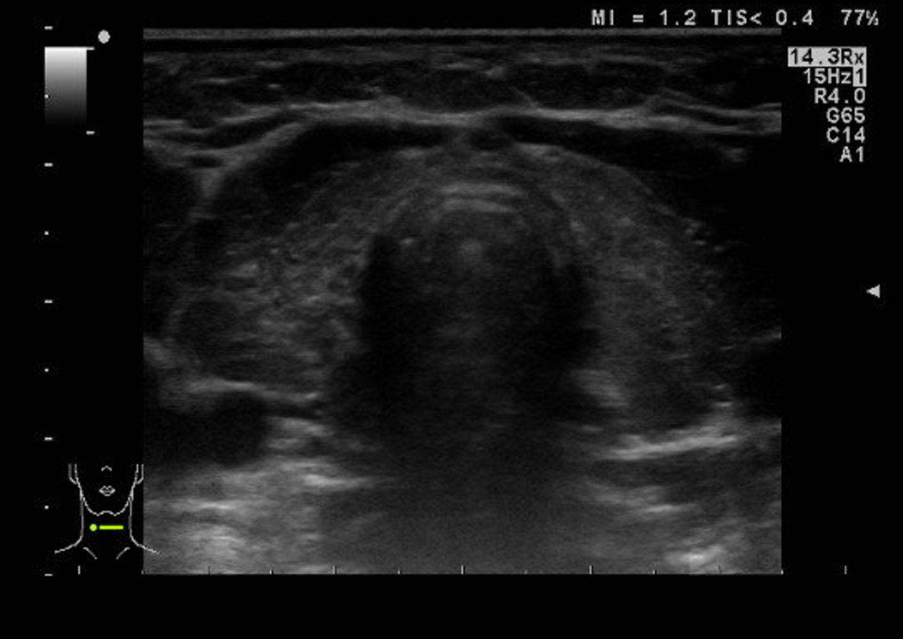
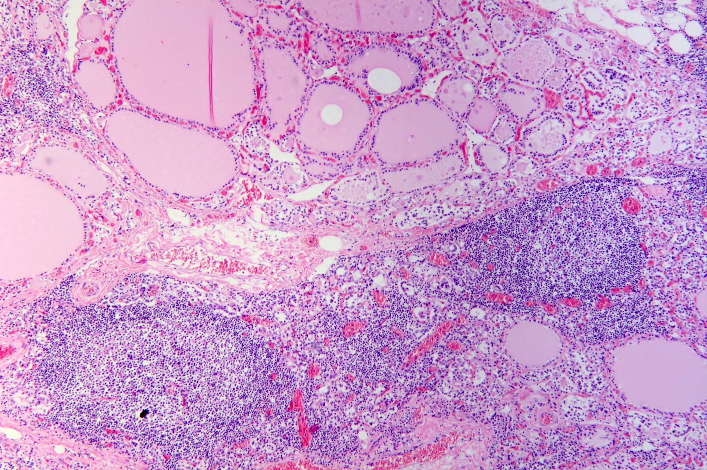

# Hashimoto thyroiditis

*Categories: Clinical knowledge > Pediatrics > Pediatric endocrinology and metabolism > Hashimoto thyroiditis*

[Original Article Link](https://coursology-qbank.com/amboss/article/1g0282)

---

## Summary

Hashimoto thyroiditis is the most common type of <u>autoimmune thyroiditis</u> and the leading <u>cause of hypothyroidism</u> in the United States. Although it is thought to be due to chronic autoimmune-mediated <u>lymphocytic</u> inflammation and destruction of the <u>thyroid</u> tissue, the exact pathophysiology remains unclear. Patients may initially be asymptomatic or show <u>signs of thyrotoxicosis</u>, progressing to <u>hypothyroidism</u> as the organ <u>parenchyma</u> is destroyed. Diagnosis is based on a combination of clinical features, <u>thyroid antibodies</u>, and <u>thyroid function tests</u>. Additional studies (e.g., <u>ultrasound</u>, <u>fine-needle aspiration</u>) may be obtained to rule out alternative conditions and may support the diagnosis. Management consists of lifelong monitoring and, in most cases, <u>hormone replacement therapy</u> with <u>levothyroxine</u>.

---

## Epidemiology

* <u>Prevalence</u>

* 5% in the US [[1]](https://coursology-qbank.com/amboss/article/SDXydZ0)

* Hashimoto disease is the most common form of thyroiditis and the most frequent <u>cause of hypothyroidism</u> in the US.

* <u>Iodine deficiency</u> is the most common <u>cause of hypothyroidism</u> worldwide. [[2]](https://coursology-qbank.com/amboss/article/GO0BFT)

* Sex: <u>♀</u> > <u>♂</u> (7:1)

* Age of onset: occurs in all age groups; most prevalent in women aged 30–50 years

Epidemiological data refers to the US, unless otherwise specified.

---

## Pathophysiology

* Unknown etiology: Genetic and environmental factors likely play a role.

* Immunological mechanisms

* Associations with <u>HLA-DR3</u>, and DR5 have been proposed. [[3]](https://coursology-qbank.com/amboss/article/VN0GZg)

* Cellular (especially <u>T cells</u>) and <u>humoral immune responses</u> are activated;   → active <u>B lymphocytes</u> produce <u>thyroid peroxidase antibodies</u> (<u>TPOAbs</u>) and <u>thyroglobulin antibodies</u> (<u>TgAbs</u>) → destruction of <u>thyroid</u> tissue

---

## Clinical features

* Early-stage

* Primarily asymptomatic

* <u>Goiter</u>: nontender or painless, rubbery <u>thyroid</u> with moderate and symmetrical enlargement [[2]](https://coursology-qbank.com/amboss/article/GO0BFT)

* Hashitoxicosis may occur: transient <u>thyrotoxicosis</u> due to follicular rupture of <u>hormone</u>-containing <u>thyroid</u> tissue that manifests with <u>signs of hyperthyroidism</u> (e.g., irritability, heat intolerance, <u>diarrhea</u>)

* Late-stage

* <u>Thyroid</u> may be normal-sized or small if extensive <u>fibrosis</u> has occurred.

* <u>Signs of hypothyroidism</u> (e.g., cold intolerance, <u>constipation</u>, fatigue)

---

## Diagnosis

Consider Hashimoto thyroiditis in patients with <u>signs of hypothyroidism</u>, <u>thyrotoxicosis</u> (less common), and/or painless <u>goiter</u>.

### Approach [[6]](https://coursology-qbank.com/amboss/article/zy1r3j0)[[7]](https://coursology-qbank.com/amboss/article/-y1D3j0)[[8]](https://coursology-qbank.com/amboss/article/ZIYZYq)

* Obtain for all patients:

* <u>Thyroid function tests</u>

* <u>Thyroid antibodies</u> to confirm the diagnosis

* In patients with <u>goiter</u> or suspected <u>thyroid nodules</u>: Obtain a <u>thyroid ultrasound</u>.

* Consider additional studies to rule out differential diagnoses.

* See “<u>Diagnostic workup for hypothyroidism</u>.”

* See “<u>Diagnostic workup of hyperthyroidism</u>.”

* See “Diagnostics” in “<u>Thyroid cancer</u>.”

> [!TIP]
> Diagnosis of Hashimoto thyroiditis is based on clinical features, <u>thyroid function tests</u>, and positive <u>TPOAbs</u> and/or <u>TgAbs</u>.

### <u>Laboratory studies</u> [[6]](https://coursology-qbank.com/amboss/article/zy1r3j0)[[9]](https://coursology-qbank.com/amboss/article/8o0OdS)

* <u>Thyroid function tests</u> (<u>TFTs</u>)

* Early-stage: Transient <u>hashitoxicosis</u> may appear (↓ <u>TSH</u>, ↑ FT3, and ↑ FT4).

* Progression: <u>subclinical hypothyroidism</u> (mildly ↑ <u>TSH</u>; normal FT3 and FT4)

* Late-stage: <u>overt hypothyroidism</u> (↑ <u>TSH</u>; ↓ FT4 and ↓ FT3)

* <u>Thyroid antibodies</u> [[10]](https://coursology-qbank.com/amboss/article/13c2hX0)

* Anti-<u>TPOAbs</u> (formerly <u>anti-microsomal antibodies</u>): positive in up to 95% of patients [[6]](https://coursology-qbank.com/amboss/article/zy1r3j0)

* Anti-<u>TgAbs</u>: positive in 60–80% of patients [[6]](https://coursology-qbank.com/amboss/article/zy1r3j0)

* Other laboratory findings [[11]](https://coursology-qbank.com/amboss/article/kIYm1q)

* <u>CBC</u>: <u>mild anemia</u>   [[12]](https://coursology-qbank.com/amboss/article/RuWlIM0)

* ↑ <u>ESR</u>

* Additional findings depend on the phase of disease.  (See “<u>Hypothyroidism diagnostics</u>” and “<u>Hyperthyroidism diagnostics</u>.”)

> [!TIP]
> <u>TPOAbs</u> are positive in 70–80% of patients with <u>Graves disease</u> and in ∼15% of individuals without <u>thyroid disease</u>. [[10]](https://coursology-qbank.com/amboss/article/13c2hX0)

### Additional studies

The following studies are not required for diagnosis but may be performed during workups for <u>thyroid disorders</u> or <u>goiter</u> to rule out differential diagnoses (e.g., multinodular <u>goiter</u> or <u>malignancy</u>).

* <u>Thyroid ultrasound</u>  [[11]](https://coursology-qbank.com/amboss/article/kIYm1q)

* Often shows diffuse <u>hypoechogenicity</u>

* May show heterogeneous <u>thyroid</u> enlargement or <u>atrophy</u> [[6]](https://coursology-qbank.com/amboss/article/zy1r3j0)

* In patients with <u>thyroid nodules</u>, it can show <u>sonographic signs of thyroid malignancy</u>.

* <u>Fine-needle aspiration</u>

* Indications: patients with focal <u>nodules</u> to exclude <u>malignancy</u> (see “<u>Workup of thyroid nodules</u>”) [[11]](https://coursology-qbank.com/amboss/article/kIYm1q)[[13]](https://coursology-qbank.com/amboss/article/A-1R-j0)

* Findings: diffuse <u>lymphocytic</u> infiltration (cytotoxic <u>T lymphocytes</u>) with <u>germinal centers</u>, oncocytic-<u>metaplastic</u> cells (<u>Hurthle cells</u>), and <u>fibrotic</u> tissue    [[14]](https://coursology-qbank.com/amboss/article/IbWYEP0)

* <u>Radioactive iodine uptake test</u> (<u>RIUT</u>) [[8]](https://coursology-qbank.com/amboss/article/ZIYZYq)

* Rarely used due to variable results

* <u>Iodine</u> uptake may be decreased in patients with transient <u>thyrotoxicosis</u>.

Hashimoto thyroiditis

Hashimoto thyroiditis (Chronic lymphocytic thyroiditis)

Hashimoto thyroiditis

---

## Differential diagnoses

* See “<u>Differential diagnoses of hypothyroidism</u>” and “<u>Overview of common causes of primary hypothyroidism</u>.”

* <u>Subacute thyroiditis</u> (<u>de Quervain thyroiditis</u>) [[2]](https://coursology-qbank.com/amboss/article/GO0BFT)

* Diffuse toxic <u>goiter</u>/<u>Graves disease</u>

* Nontoxic/multinodular <u>goiter</u>

* Riedel thyroiditis (Riedel struma) [[15]](https://coursology-qbank.com/amboss/article/_qY5aq)

* Rare, special form of <u>autoimmune thyroiditis</u> [[16]](https://coursology-qbank.com/amboss/article/1N02Zg)

* Characterized by inflammatory infiltration and fibrosclerotic changes of <u>thyroid</u> tissue [[2]](https://coursology-qbank.com/amboss/article/GO0BFT)[[16]](https://coursology-qbank.com/amboss/article/1N02Zg)

* Part of the <u>IgG4-related disease</u> spectrum, which includes conditions sharing histopathological features of fibrosclerosis in different organs (e.g., <u>sclerosing</u> <u>sialadenitis</u>, <u>retroperitoneal fibrosis</u>, <u>autoimmune pancreatitis</u>, <u>aortitis</u>, etc.)

* <u>Goiter</u> [[2]](https://coursology-qbank.com/amboss/article/GO0BFT)

* Painless, hard (stone-like), fixed

* May compress surrounding tissues (e.g., <u>trachea</u>, <u>esophagus</u>), mimicking invasive growth of <u>malignant tumor</u> (e.g., feeling of <u>anterior</u> neck pressure, <u>dysphagia</u>, <u>hoarseness</u> , <u>stridor</u>, <u>dyspnea</u>)

* Approx. 30% of affected individuals have <u>hypothyroidism</u>. [[15]](https://coursology-qbank.com/amboss/article/_qY5aq)

* <u>Surgery</u> may be necessary due to compression.

* Acute suppurative thyroiditis

* Definition: extremely rare bacterial infection of the <u>thyroid gland</u>

* Symptoms/clinical features: acute <u>febrile</u> course with tenderness

* Diagnosis: <u>ultrasound</u>

* Treatment

* Administration of broad-spectrum <u>antibiotics</u> (e.g., <u>clindamycin</u> or <u>amoxicillin</u> with <u>clavulanate</u>)

* In the case of <u>abscess</u> formation, opening of the <u>abscess</u> with culture and <u>antibiotic sensitivity testing</u> of the <u>abscess</u> contents

* Complications: <u>mediastinitis</u>

Riedel thyroiditis

The differential diagnoses listed here are not exhaustive.

---

## Management

### Treatment [[6]](https://coursology-qbank.com/amboss/article/zy1r3j0)[[13]](https://coursology-qbank.com/amboss/article/A-1R-j0)[[17]](https://coursology-qbank.com/amboss/article/meXVzC)

Lifelong oral <u>levothyroxine replacement</u> is required in most patients with Hashimoto thyroiditis.

* <u>Overt hypothyroidism</u>

* Full-dose <u>levothyroxine</u> DOSAGE in young, healthy patients [[17]](https://coursology-qbank.com/amboss/article/meXVzC)

* OR low-dose <u>levothyroxine</u> DOSAGE depending on age and comorbidities  [[13]](https://coursology-qbank.com/amboss/article/A-1R-j0)[[17]](https://coursology-qbank.com/amboss/article/meXVzC)

* See “<u>Levothyroxine replacement</u>” in “<u>Hypothyroidism</u>” for details on dosage.

* <u>Subclinical hypothyroidism</u>: Consider low-dose <u>levothyroxine</u>. DOSAGE [[9]](https://coursology-qbank.com/amboss/article/8o0OdS)[[17]](https://coursology-qbank.com/amboss/article/meXVzC)

* <u>Hashitoxicosis</u>: <u>symptomatic therapy for thyrotoxicosis</u> with ß-blockers [[13]](https://coursology-qbank.com/amboss/article/A-1R-j0)

* <u>Goiter</u>: <u>Thyroidectomy</u> may be considered in patients with obstructive symptoms or for cosmetic reasons.  [[8]](https://coursology-qbank.com/amboss/article/ZIYZYq)

### Monitoring

* For all phases (including <u>euthyroidism</u>) [[6]](https://coursology-qbank.com/amboss/article/zy1r3j0)

* Lifelong annual <u>TSH</u> measurements

* Clinical assessment for <u>lymphoma</u> and associated autoimmune diseases

* After <u>levothyroxine</u> initiation or dosage change

* <u>TSH</u> level after 4–6 weeks [[6]](https://coursology-qbank.com/amboss/article/zy1r3j0)[[17]](https://coursology-qbank.com/amboss/article/meXVzC)

* See “<u>Levothyroxine replacement</u>” in “<u>Hypothyroidism</u>” for details on monitoring and dose adjustments.

> [!TIP]
> Patients with Hashimoto thyroiditis are at increased risk of having or developing other autoimmune diseases (e.g., <u>type 1 diabetes</u>, <u>SLE</u>, <u>Graves disease</u>, <u>Addison disease</u>) and <u>non-Hodgkin lymphoma</u>. [[6]](https://coursology-qbank.com/amboss/article/zy1r3j0)

---

## Complications

* <u>Myxedema coma</u>

* <u>Primary thyroid lymphoma</u> [[18]](https://coursology-qbank.com/amboss/article/4bW3FP0)

* <u>Epidemiology</u>: 40- to 80-fold increase in risk in patients with Hashimoto thyroiditis

* Pathophysiology: usually originating from <u>B cells</u>

We list the most important complications. The selection is not exhaustive.

---