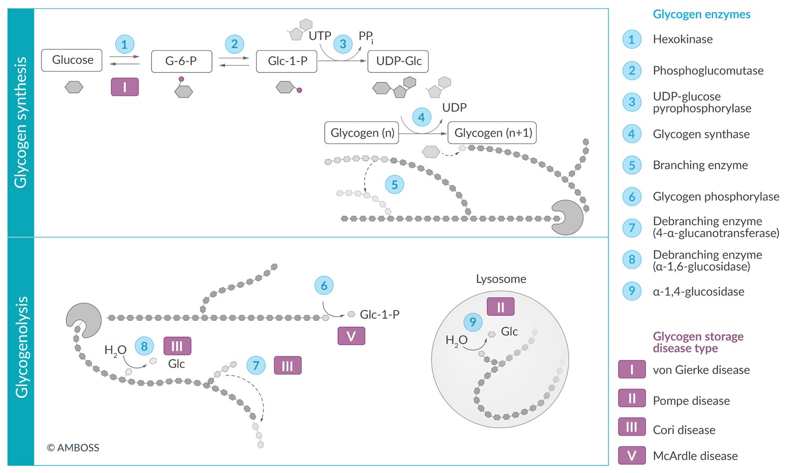
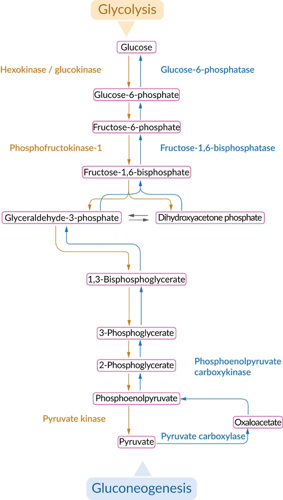
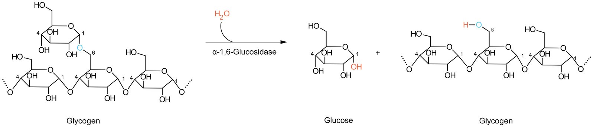
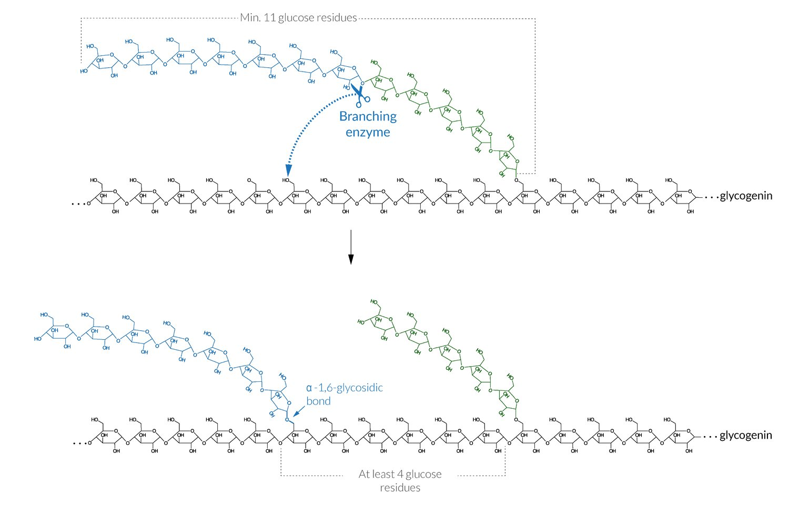
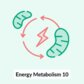
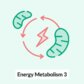
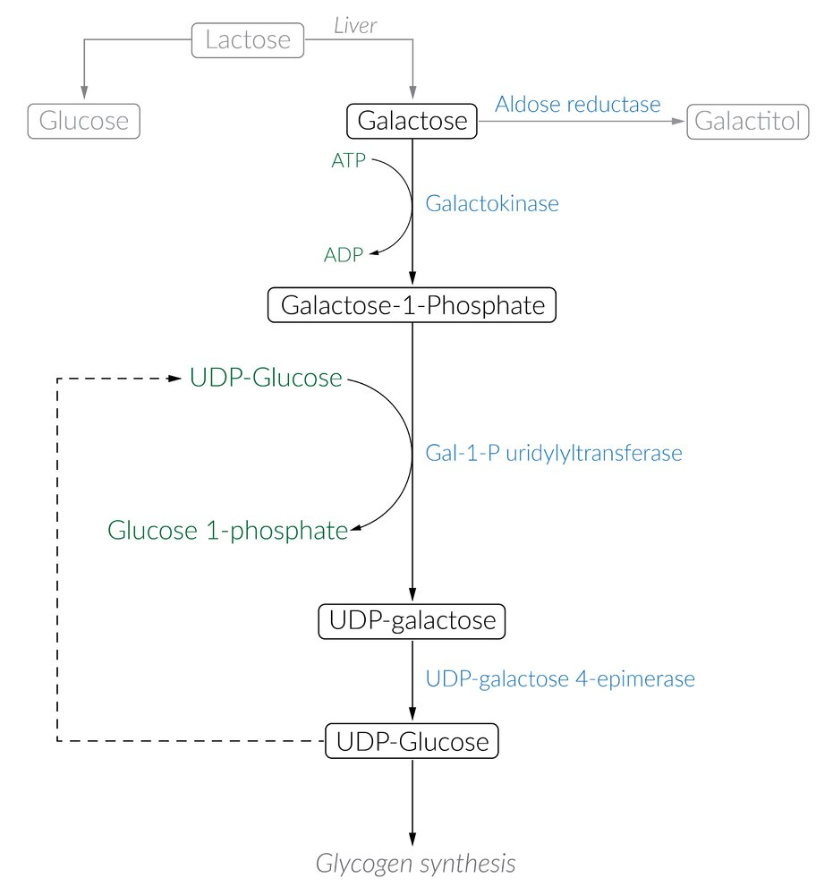
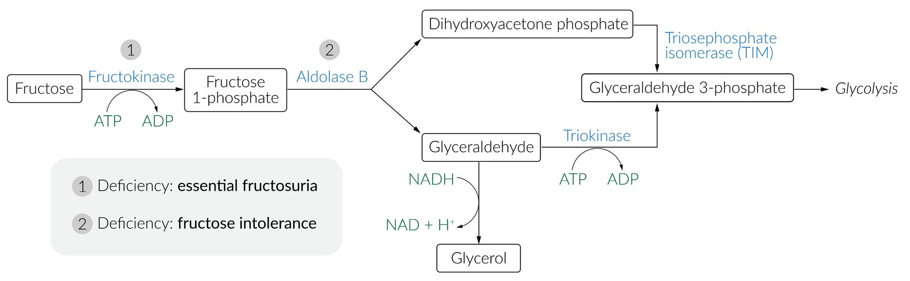

# Inborn errors of carbohydrate metabolism

*Categories: Clinical knowledge > Pediatrics > Pediatric endocrinology and metabolism > Inborn errors of carbohydrate metabolism*

[Original Article Link](https://coursology-qbank.com/amboss/article/lM0vKg)

---

## Summary

All classic disorders of <u>carbohydrate</u> metabolism result from a specific enzyme defect. Almost all of these enzyme defects are inherited in an <u>autosomal recessive</u> fashion. These metabolic diseases may be classified into three main groups, affecting the metabolism of <u>glycogen</u>, galactose, and fructose. Clinical manifestations are variable and range from occasional innocuous <u>hypoglycemia</u> to severe cognitive impairment and <u>death</u> within a few weeks of <u>birth</u>. <u>Newborn screening</u> enables the early detection of metabolic diseases and early initiation of appropriate dietary restrictions helps prevent disease manifestations.

---

## Glycogen storage disorders (GSD)

### Overview

* <u>Glycogen storage disorders</u> (<u>GSDs</u>; <u>glycogenoses</u>) are hereditary metabolic disorders characterized by defects in the enzymes responsible for <u>glycogenolysis</u> or <u>glycolysis</u>.

* 13 different types have been described

* All types cause abnormal accumulation of <u>glycogen</u> due to impaired <u>glycogen metabolism</u>.

* Only a few <u>GSDs</u> are relevant in clinical practice (see “Types of <u>GSD</u>” below).

### <u>Epidemiology</u>

* <u>Incidence</u>: up to 1:20,000 <u>live births</u> [[1]](https://coursology-qbank.com/amboss/article/NjX-0y)

* Age of onset: presentation during <u>infancy</u> or childhood

* Sex: <u>♂</u> = <u>♀</u>

* Mode of inheritance: mostly <u>autosomal recessive</u> (types I, II, III, and V)

### Pathophysiology

* Defective enzymes responsible for <u>glycolysis</u> or <u>glycogenolysis</u> → impaired <u>glycogen</u> metabolization → ↑ storage of either normal or abnormal <u>glycogen</u>

* <u>Liver</u>, <u>heart</u>, and muscle are the most common sites of <u>glycogen</u> storage and are, therefore, predominantly affected.

Glycogen storage diseases

### Types of <u>GSD</u>

|  Overview of types of <u>GSD</u> [[2]](https://coursology-qbank.com/amboss/article/Tra6gN)[[3]](https://coursology-qbank.com/amboss/article/4ra3hN)[[4]](https://coursology-qbank.com/amboss/article/kramhN)  |  |  |  |  |  |
| --- | --- | --- | --- | --- | --- |
|  |  | Relative frequency |  <u>Gene</u> defect and deficient enzyme  | Role of the enzyme | Characteristic features |
| Type I(von Gierke disease) | Type 1a |  * ∼ 25%   |   * G6PC <u>gene</u> on <u>chromosome</u> 17q  * <u>Glucose-6-phosphatase</u> (G6-<u>phosphatase</u>)    |  * <u>Hydrolysis</u> of <u>glucose-6-phosphate</u> to <u>glucose</u> and inorganic <u>phosphate</u>   |   * Renomegaly and <u>hepatomegaly</u> (with <u>hepatic adenomas</u>)  * Severe <u>fasting</u> <u>hypoglycemia</u>, mild <u>ketosis</u>  * Severe <u>hyperlipidemia</u> (especially <u>triglycerides</u>) → doll-like facies  * <u>Hyperuricemia</u> (↑ risk of <u>gout</u>)  [[5]](https://coursology-qbank.com/amboss/article/joX_b_)  * <u>Lactic acidosis</u>  * <u>Anemia</u>  * <u>Failure to thrive</u>  * Dysfunctional <u>glycogenolysis</u> and <u>gluconeogenesis</u>    |
| Type 1b |   * SLC37A4 <u>gene</u> on <u>chromosome</u> 11q  * <u>Glucose-6-phosphate</u> translocase    |  * Transport of <u>glucose-6-phosphate</u> into the <u>endoplasmic reticulum</u>, where it is <u>hydrolyzed</u> by G6-<u>phosphatase</u>   |  |  |  |
| Type II(Pompe disease) |  |  * ∼ 15%   |   * GAA <u>gene</u> on <u>chromosome</u> 17q  * Lysosomal acid maltase (<u>α-1,4-glucosidase</u>) deficiency    |   * <u>Glycogenolysis</u>  * <u>Hydrolyzes</u> α-1,4- and α-1,6-linkages in the acidic environment of the <u>lysosome</u>    |   * <u>Hypertrophic cardiomyopathy</u>, conduction blocks, <u>cardiomegaly</u>  * <u>Macroglossia</u>  * <u>Failure to thrive</u>  * <u>Proximal</u> <u>myopathy</u> and <u>hypotonia</u> leads to <u>respiratory insufficiency</u> and early <u>death</u>  * <u>Intracranial aneurysms</u>    |
|  Type III (Cori disease) |  |  * ∼ 25%   |   * AGL <u>gene</u> on <u>chromosome</u> 1p  * <u>Glycogen debranching enzyme</u> (performs 2 functions: <u>α-1,6-glucosidase</u> and <u>4-α-D-glucanotransferase</u>)    |  * <u>Glycogenolysis</u>   |   * Clinical presentation is similar to that of type I, though symptoms tend to be less severe.  * Generalized <u>muscle weakness</u> and/or cramps  * Possibly <u>cirrhosis</u> (<u>ascites</u>, <u>hepatomegaly</u>, and <u>splenomegaly</u>)  * Mild, <u>fasting</u> <u>hypoglycemia</u> and <u>ketosis</u>  * <u>Hyperlipidemia</u>  * <u>Cytosolic</u> accumulations of limit dextrin-like complexes  * Blood <u>lactate</u> levels are normal.  * <u>Gluconeogenesis</u> is functional.  * Type III may result in <u>cardiomyopathy</u>.    |
| Type IV (Andersen disease) |  |  * ∼ 3%   |   * GBE1 <u>gene</u> on <u>chromosome</u> 3p  * <u>Glycogen branching enzyme</u>    |  * <u>Glycogenesis</u>   |   * Symptoms in early <u>infancy</u> (usually leading to <u>death</u> early in childhood)  * Fetal <u>akinesia</u> sequence  * <u>Failure to thrive</u>  * <u>Hepatosplenomegaly</u>  * <u>Cirrhosis</u> (possibly causing <u>ascites</u>)  * <u>Proximal</u> <u>myopathy</u>  * <u>Cardiomyopathy</u>, <u>hypotonia</u>  * <u>Peripheral neuropathy</u>  * Late symptom: <u>hypoglycemia</u>  * A number of neuromuscular forms have been described; can manifest at any age    |
| Type V(McArdle disease) |  |  * ∼ 2%   |   * PYGM <u>gene</u> on <u>chromosome</u> 11q  * <u>Myophosphorylase</u> (skeletal <u>muscle glycogen phosphorylase</u>)    |  * <u>Glycogenolysis</u>   |   * Generalized <u>muscle weakness</u>, exercise intolerance (with a second wind phenomenon): Symptoms of <u>muscle fatigue</u> disappear after a period of activity because of increased muscular blood flow.  * Demanding physical exercise may cause <u>rhabdomyolysis</u> and <u>myoglobinuria</u>.  * <u>Electrolyte</u> imbalances can trigger <u>cardiac arrhythmias</u>.  * Normal serum <u>glucose</u> levels  * Flat venous <u>lactate</u> curve with exaggerated elevations in blood <u>ammonia</u> during exercise  * <u>Glycogen</u> accumulates in muscles, but can not be metabolized due to enzyme deficiency    |
| Type VI(Hers disease) |  |  * ∼ 30%   |   * PYGL <u>gene</u> on <u>chromosome</u> 14q  * <u>Liver</u> phosphorylase    |  * <u>Glycogenolysis</u>   |   * <u>Hepatomegaly</u>  * <u>Fasting</u> <u>hypoglycemia</u> and <u>ketosis</u>  * <u>Hyperlipidemia</u>    |

> [!NOTE]
> The first six <u>glycogen storage diseases</u> can be remembered with the mnemonic “a Very Presumptuous Corgi Ambles in the Middle of the Highway.”

> [!NOTE]
> McArdle affects the Muscles.

Glycogen storage diseases

Comparison of glycolysis and gluconeogenesis

Glycogenolysis through cleavage of α-1,6-glycosidic bond

Branching enzyme in glycogen synthesis

Energy Metabolism - Part 10: Gluconeogenesis Reactions with molecular structures

Energy Metabolism - Part 10: Gluconeogenesis Reactions without molecular structures

Section 7.1 Von Gierke Disease and Cori Disease

Section 7.2 Pompe Disease and McArdle Disease

### Clinical features

<u>Glycogen storage disorders</u> can be classified as muscle and/or <u>liver</u> <u>GSD</u> according to the presenting symptoms.

* Muscle involvement

* Seen in types II, III, IV, V

* Two groups of <u>skeletal muscle</u> symptoms are seen:

* Defects of muscle <u>glycogenolysis</u> and muscle <u>glycolysis</u>: 

* Easy fatiguability, exercise intolerance

* Cramps

* <u>Rhabdomyolysis</u> → <u>myoglobinuria</u> (burgundy-colored urine)

* Defects of muscle <u>glycogenesis</u> (type IV) and <u>lysosomal</u> <u>glycogenolysis</u> (type II): progressive <u>weakness</u> of extremities and trunk (<u>proximal</u> <u>myopathy</u>)

* Cardiac involvement

* Seen in several types (e.g., type II, type III)

* <u>Hypertrophic cardiomyopathy</u> and/or conduction defects are most common in type II.

* <u>Liver</u> involvement

* Seen in types I, III, IV

* <u>Hypoglycemia</u> (typically <u>fasting</u> <u>hypoglycemia</u>) and ketosis

* <u>Symptoms of hypoglycemia</u> in <u>infancy</u>: <u>seizures</u>, <u>hypotonia</u>, poor feeding, <u>cyanosis</u>, irritability

* <u>Hepatomegaly</u> → distended abdomen

#### Additional clinical manifestations

* Growth delay/growth retardation/<u>failure to thrive</u>: types I, II, III, IV

* <u>Anemia</u>: type I

* <u>Hyperlipidemia</u>: types I, III

* <u>Macroglossia</u>: type II

* <u>Lactic acidosis</u>: type I

* <u>Hyperuricemia</u>: type I

> [!NOTE]
> “Pompe punishes pump, <u>liver</u>, and muscle.”

### Diagnostics [[6]](https://coursology-qbank.com/amboss/article/draoTN)

* Initial tests

* Muscle and/or <u>liver biopsy</u> (depending on the enzyme deficiency): <u>glycogen</u> storage appears as <u>PAS</u>-positive granules .

* Enzyme assays in <u>RBCs</u>, <u>leukocytes</u>, <u>liver</u> tissue, <u>muscle tissue</u>, or <u>fibroblasts</u> (depending on the enzyme deficiency)

* <u>Confirmatory test</u>: <u>DNA</u> testing for the <u>gene</u> defects

* Additional tests

* Muscle <u>GSD</u> [[7]](https://coursology-qbank.com/amboss/article/c2Yago)

* Ischemic forearm test: an important test to evaluate if a patient has a metabolic disorder of muscle function

* A <u>sphygmomanometer</u> cuff is tied around the arm and inflated to beyond systolic blood pressure. The patient is then asked to repeatedly form a fist. The cuff is then deflated and multiple blood samples are taken to measure serum <u>lactate</u> levels.

* The normal response to an <u>ischemic</u> exercise test is an increase in the levels of <u>lactate</u> as a result of <u>anaerobic metabolism</u> of <u>glucose</u>.

* In the case of <u>GSD</u> type III and type V,, not enough <u>glucose</u> is produced from <u>glycogen</u>. As a result, <u>lactate</u> levels do not rise.

* ↑ <u>Creatine kinase</u>

* Electroneuromyography: to identify <u>proximal</u> <u>myopathy</u>

* <u>EKG</u> and/or <u>echocardiography</u>: to identify cardiac <u>hypertrophy</u> and conduction blocks

* <u>Liver</u> <u>GSD</u>

* ↑ Serum biotinidase serves as diagnostic biomarkers in type I and type III  [[8]](https://coursology-qbank.com/amboss/article/eraxTN)[[9]](https://coursology-qbank.com/amboss/article/UrabgN)

* <u>Liver function</u> tests and abdominal <u>ultrasonography</u>: to detect <u>liver cirrhosis</u> and/or hepatic failure

### Therapy [[6]](https://coursology-qbank.com/amboss/article/draoTN)

* General

* Most forms of <u>GSD</u> can be managed effectively with dietary therapy (e.g., uncooked <u>corn</u> starch, <u>glucose</u> preparations) with the aim of preventing <u>hypoglycemia</u> and/or muscle symptoms

* Foods rich in fructose and galactose should be avoided in patients with <u>GSD</u> type I

* Definitive therapy

* Enzyme replacement therapy is available for some forms of <u>GSD</u>

* A <u>liver transplant</u> may be required in the case of <u>liver</u> <u>GSD</u> that progress to <u>liver cirrhosis</u> and/or result in poor metabolic control.

* Cardiac involvement

* Severe conduction defects: pacemaker implantation

* Severe <u>cardiomyopathy</u>: <u>heart transplantation</u> (see “Therapy” in “<u>Hypertrophic cardiomyopathy</u>”)

Energy Metabolism - Part 3: Regulation of Glycolysis

---

## Galactosemia

<u>Galactosemia</u> refers to hereditary defects in enzymes that are responsible for the <u>metabolism of galactose</u> (galactose is a component of the <u>disaccharide</u> <u>lactose</u>, which is present in <u>breast milk</u>).

|  Overview of types of <u>galactosemia</u> [[10]](https://coursology-qbank.com/amboss/article/_bY5wn) |  |  |  |
| --- | --- | --- | --- |
|  | Galactokinase deficiency | Classic galactosemia | Uridine diphosphate galactose-4-epimerase deficiency |
| <u>Epidemiology</u> |   * <u>Incidence</u>: up to 1:16,000 <u>live births</u> [[11]](https://coursology-qbank.com/amboss/article/MjXMay)  * Sex: <u>♂</u> = <u>♀</u>  * Age of onset: <u>infancy</u>    |  |  |
| Mode of inheritance |  * <u>Autosomal recessive</u>   |  |  |
| Enzyme |  * Galactokinase   |  * Galactose-1-phosphate uridyltransferase   |  * <u>Uridine diphosphate galactose-4-epimerase</u>   |
| Relative frequency |  * Rare   |  * Common (<u>classic galactosemia</u>)   |  * Rare   |
| Role of enzyme |  * Converts galactose to <u>galactose-1-phosphate</u>   |  * Converts <u>galactose-1-phosphate</u> to UDP-galactose   |  * Converts UDP-galactose to <u>glucose-1-phosphate</u>   |
| Disease severity |  * Mild   |  * Severe   |   * Mostly asymptomatic  * Possible  * <u>Jaundice</u>  * <u>Hypotonia</u>  * Dysmorphic features  * <u>Failure to thrive</u>  * <u>Splenomegaly</u>  * <u>Cataract</u>  * <u>Sensorineural hearing loss</u>  * Cognitive deficiencies    |
| Effect of enzyme deficiency |   * Accumulation of <u>galactitol</u> in tissues  * Galactose is present in blood and urine    |  * Accumulation of toxic substances in tissues (e.g., <u>galactitol</u> in the <u>lens</u>)   |  |
| Clinical features |   * <u>Cataracts</u>  * <u>Infants</u> often do not track objects with their eyes and show no social smile on <u>physical examination</u>  * Pseudotumor cerebrii    |   * Poor feeding  * <u>Failure to thrive</u>  * <u>Vomiting</u>, <u>diarrhea</u>  * <u>Jaundice</u>, <u>hepatomegaly</u>  * <u>Cataracts</u>  * Cognitive impairment  * ↑ Risk of <u>E. coli</u> <u>sepsis</u> (esp. in <u>neonates</u>)  * <u>Hypoglycemia</u>    |  |
| Diagnostics |   * <u>Newborn screening</u> test: ↑ galactose/<u>galactose-1-phosphate</u> in blood  * Urine galactose levels: galactosuria  * Total serum <u>bilirubin</u>: <u>hyperbilirubinemia</u>    |  |  |
| Treatment |  * Complete cessation of <u>lactose</u>-containing feeds and lifelong adherence to a galactose-free and <u>lactose</u>-free diet   |  |  |

> [!NOTE]
> “Fruits from the Galapagos are kind” (<u>galactokinase</u> and <u>fructokinase</u> deficiencies present with mild symptoms).

Galactose metabolism

---

## Disorders of fructose metabolism

|  Overview of disorders of <u>fructose metabolism</u> [[6]](https://coursology-qbank.com/amboss/article/draoTN)[[12]](https://coursology-qbank.com/amboss/article/qKaChl)  |  |  |
| --- | --- | --- |
|  | Hereditary fructose intolerance | Essential fructosuria |
| <u>Incidence</u> |  * Up to 1:18,000 <u>live births</u> [[13]](https://coursology-qbank.com/amboss/article/njX7ay)   |  * Up to 1:120,000 <u>live births</u> [[14]](https://coursology-qbank.com/amboss/article/LjXway)   |
| <u>Gene</u> defect |  * <u>Chromosome</u> 9q   |  * <u>Chromosome</u> 2p   |
| Mode of inheritance |  * <u>Autosomal recessive</u>   |  |
| Deficient enzyme |  * <u>Aldolase B</u>   |  * <u>Fructokinase</u>   |
| Role of enzyme |  * Converts fructose-1-<u>phosphate</u> to glyceraldehyde and <u>dihydroxyacetone phosphate</u>   |  * Converts fructose to fructose-1-<u>phosphate</u>   |
| Effect of enzyme deficiency |  * Accumulation of fructose-1-<u>phosphate</u> → decrease in available <u>phosphates</u> → inhibition of <u>glycogenolysis</u> and <u>gluconeogenesis</u>  → <u>hypoglycemia</u>   |   * Increased conversion of fructose to <u>fructose-6-phosphate</u> by <u>hexokinase</u> (<u>hexokinase</u> becomes the main pathway for turning fructose to <u>fructose-6-phosphate</u>)  * Unphosphorylated fructose does not get trapped in cells → remaining excess fructose → excretion of fructose in urine    |
| Age of onset |   * Within the first months of life [[15]](https://coursology-qbank.com/amboss/article/ojX0Yy)  * Symptoms begin when the child is weaned off <u>breast milk</u> and starts consuming food that contains <u>sucrose</u> (e.g., fruit, juice, honey)    |  * Asymptomatic   |
| Clinical features |   * <u>Bloating</u>, sweating, <u>vomiting</u>  * <u>Failure to thrive</u>  * <u>Jaundice</u> (can progress to <u>cirrhosis</u>)  * Bleeding tendency  * Severe <u>hypoglycemia</u>: <u>seizures</u>, <u>hypotonia</u>, poor feeding, <u>cyanosis</u>, irritability  * <u>Hepatomegaly</u>  * <u>Proximal</u> tubular dysfunction → <u>renal failure</u>    |  |
| Diagnostics |   * Detection of <u>reducing substances</u> (fructose) in urine  * <u>Urine dipstick</u> only tests for <u>glucose</u> and will, therefore, be negative.  * Definitive diagnosis  * Enzyme assay in a <u>liver biopsy</u> sample  * <u>DNA</u> testing for the genetic defect  * Abnormal <u>liver function</u> tests: ↑ <u>AST</u> and <u>ALT</u>, <u>hypoalbuminemia</u>, ↓ <u>PT</u>/<u>INR</u>    |  * Detection of <u>reducing substances</u> (fructose) in serum and urine   |
| Treatment |  * Lifelong adherence to a fructose-free, <u>sorbitol</u>-free, and <u>sucrose</u>-free diet   |  * No treatment is required   |

Mechanisms of fructose intolerance

---