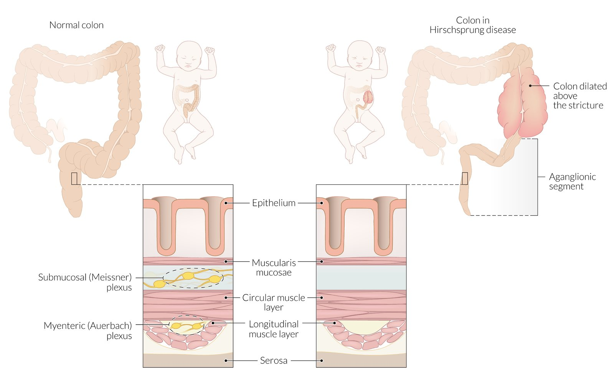
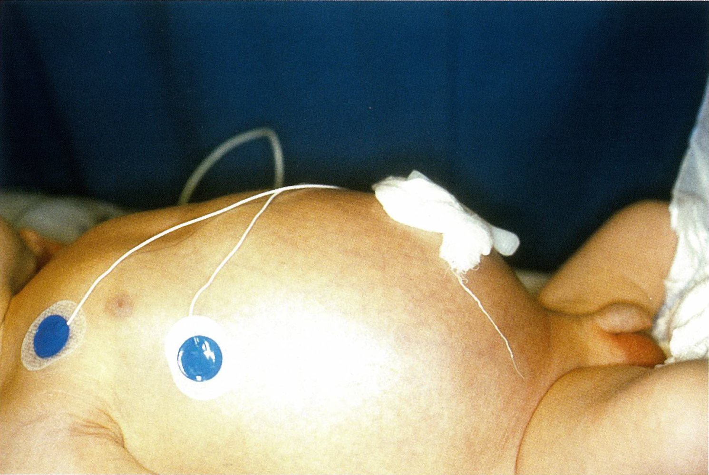
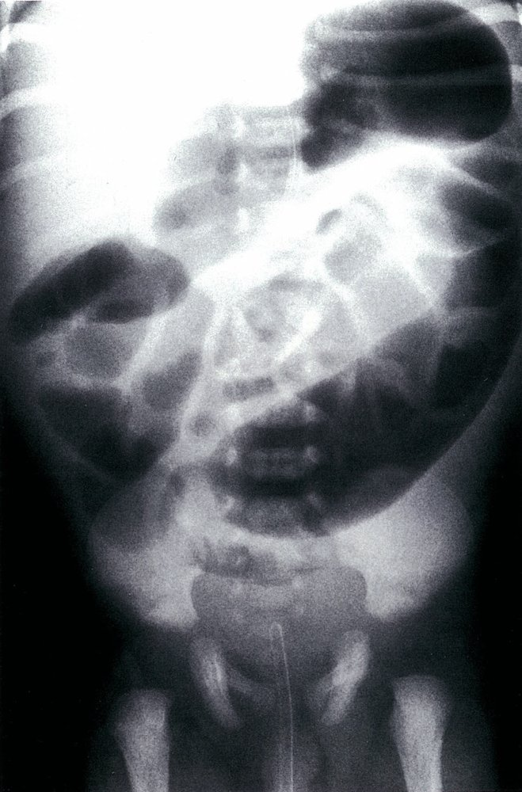
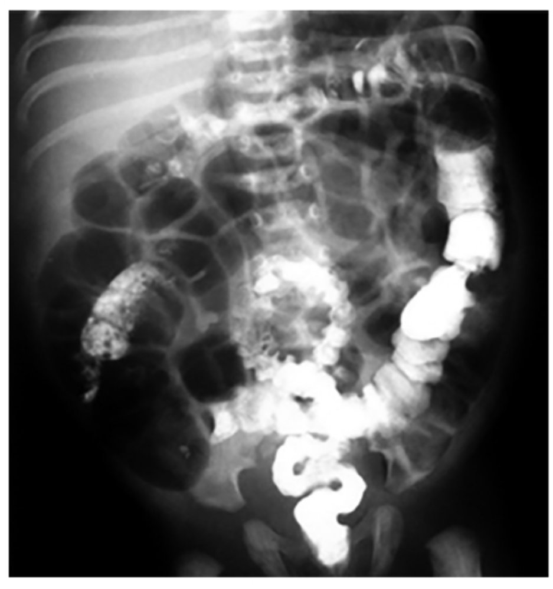

# Hirschsprung disease

*Categories: Clinical knowledge > Pediatrics > Pediatric gastroenterology > Hirschsprung disease*

[Original Article Link](https://coursology-qbank.com/amboss/article/q40C4T)

---

## Summary

Hirschsprung disease (congenital aganglionic <u>megacolon</u>) is an inherited disorder that primarily affects <u>newborns</u>. It is characterized by the absence of <u>ganglion</u> cells in the <u>distal</u> <u>colon</u>, leading to functional obstruction. The first manifestation of Hirschsprung disease is often failure to pass <u>meconium</u> within 24–48 hours of delivery, accompanied by signs of gastrointestinal obstruction such as <u>bilious</u> <u>vomiting</u> and abdominal distention. The onset and severity of symptoms vary based on the length of the aganglionic segment: A longer aganglionic segment is associated with early onset and severe disease. Diagnostic work-up involves <u>x-ray</u>, <u>contrast enema</u>, and, if initial studies are inconclusive, <u>anorectal manometry</u>. Diagnosis is confirmed with rectal <u>biopsy</u>. Initial management includes <u>fluid resuscitation</u>, <u>correction of electrolyte imbalances</u>, and bowel decompression. Definitive treatment involves surgical resection of the aganglionic segment. <u>Hirschsprung-associated enterocolitis</u> (<u>HAEC</u>) is a severe complication, which can manifest with <u>fever</u>, abdominal distention, and/or <u>diarrhea</u>. Without prompt treatment, <u>HAEC</u> can lead to <u>toxic megacolon</u> or <u>sepsis</u>. The prognosis for patients with Hirschsprung disease is good if treated at an early stage.

---

## Epidemiology

* <u>Incidence</u>: 1 in 5000 <u>live births</u> [[1]](https://coursology-qbank.com/amboss/article/TTX6Jx)

* Sex: <u>♂</u> > <u>♀</u> (4:1)

Epidemiological data refers to the US, unless otherwise specified.

---

## Etiology

* Genetic causes  [[1]](https://coursology-qbank.com/amboss/article/TTX6Jx)

* <u>RET</u> <u>gene mutations</u> associated with <u>multiple endocrine neoplasia type 2</u> (<u>MEN2</u>) and familial Hirschsprung disease

* <u>Endothelin</u> <u>receptor</u> B (EDNRB) <u>gene mutations</u> associated with <u>Waardenburg syndrome</u>

* Associated conditions [[1]](https://coursology-qbank.com/amboss/article/TTX6Jx)[[2]](https://coursology-qbank.com/amboss/article/gTXFJx)

* <u>Trisomy 21</u>

* <u>Multiple endocrine neoplasia type 2</u> (<u>MEN2</u>)

* <u>Waardenburg syndrome</u>

* <u>Neuroblastoma</u>

* Other conditions: congenital <u>deafness</u>, malrotation, gastric diverticulum, and <u>intestinal atresia</u>

> [!NOTE]
> Hirschsprung disease always involves the REcTum and is often associated with <u>RET</u> mutations.

---

## Pathophysiology

* Hirschsprung disease is caused by defective <u>caudal</u> migration of <u>parasympathetic</u> neuroblasts (precursors of <u>ganglion</u> cells) from the <u>neural crest</u> to the <u>distal</u> <u>colon</u>. This process takes place between the 4th and 7th week of development.

* Affected segments are histologically characterized by the absence of the <u>Meissner plexus</u> and <u>Auerbach plexus</u> (<u>submucosal</u> and <u>myenteric plexus</u> <u>ganglion</u>) beginning at the anorectal line, leading to: [[3]](https://coursology-qbank.com/amboss/article/STXyJx)

* Inability of the <u>myenteric plexus</u> to control the intestinal wall muscles → uncoordinated <u>peristalsis</u> and slowed motility

* <u>Spastic</u> contraction of intestinal muscles → stenosis and functional obstruction

* Expansion of the <u>colon</u> segment <u>proximal</u> to the aganglionic section (possible <u>megacolon</u>)

* Extent of the disease [[2]](https://coursology-qbank.com/amboss/article/gTXFJx)

* Ultra-short segment: limited to the <u>distal</u> <u>rectum</u> below the <u>pelvic floor</u> and the <u>anus</u>

* Short-segment: limited to the rectosigmoid region (approx. 80% of cases)

* Long-segment: involvement of the <u>distal</u> <u>colon</u> up to the <u>splenic flexure</u> (approx. 10% of cases)

* Total <u>colonic</u>: entire <u>colon</u> (3–8% of cases)

Etiopathogenesis of Hirschsprung disease

---

## Clinical features

For clinical features of <u>HAEC</u>, see “<u>Complications of Hirschsprung disease</u>.”

### <u>Neonates</u>  [[4]](https://coursology-qbank.com/amboss/article/q5dCOq0)[[5]](https://coursology-qbank.com/amboss/article/OC1IHQ0)

* <u>Delayed passage of meconium</u> (more than 24–48 hours)

* <u>Distal</u> <u>intestinal obstruction</u>: abdominal distention and <u>bilious</u> <u>vomiting</u>

* <u>Digital rectal examination</u>

* Tight anal sphincter

* Empty <u>rectum</u>

* Squirt sign: explosive release of stool and air upon removal of the finger

* Palpation of feces via the abdominal wall due to <u>constipation</u> (nonspecific sign)

Hirschsprung disease in a 5-day-old male newborn

### <u>Infants</u> and children  [[6]](https://coursology-qbank.com/amboss/article/hTXcqx)

* Chronic <u>constipation</u>, possibly with the inability to pass gas

* <u>Growth faltering</u>

---

## Diagnosis

### Approach [[4]](https://coursology-qbank.com/amboss/article/q5dCOq0)[[5]](https://coursology-qbank.com/amboss/article/OC1IHQ0)[[8]](https://coursology-qbank.com/amboss/article/AN1Rdh0)

* Obtain imaging (i.e., abdominal <u>x-ray</u> and <u>contrast enema</u>) to identify the site and severity of the obstruction.   [[9]](https://coursology-qbank.com/amboss/article/W-dPws0)

* Perform <u>anorectal manometry</u> if initial studies are inconclusive.

* Confirm the diagnosis with a rectal <u>biopsy</u>.   [[10]](https://coursology-qbank.com/amboss/article/d-dows0)

* Obtain <u>laboratory studies</u> to assess for complications (e.g., <u>sepsis</u>) and guide management.

### <u>Laboratory studies</u>

<u>Laboratory studies</u> may be obtained to assess for complications (see also “<u>Approach to acute abdomen</u>”).

* <u>CBC</u>

* <u>BMP</u>

* <u>Blood cultures</u>

* <u>Emergency preoperative diagnostics</u>: for critically ill patients requiring emergency <u>surgery</u> [[5]](https://coursology-qbank.com/amboss/article/OC1IHQ0)

### Imaging [[4]](https://coursology-qbank.com/amboss/article/q5dCOq0)[[8]](https://coursology-qbank.com/amboss/article/AN1Rdh0)

#### <u>Abdominal x-ray</u>

* Indication: initial study ; (along with <u>contrast enema</u>) in <u>newborns</u> with abdominal distention and <u>delayed passage of meconium</u>

* Findings  

* Decreased or absent air in the <u>rectum</u>

* Dilated <u>colon</u> segment immediately <u>proximal</u> to a narrow aganglionic region

* <u>Distal</u> <u>intestinal obstruction</u>

Hirschsprung disease

#### <u>Contrast enema</u> [[4]](https://coursology-qbank.com/amboss/article/q5dCOq0)[[11]](https://coursology-qbank.com/amboss/article/J5dsOq0)

Contrast enemas can be diagnostic and therapeutic, as the contrast can lead to passage of obstructed stool. [[12]](https://coursology-qbank.com/amboss/article/0GdeBr0)

* Indication: initial study (along with <u>abdominal x-ray</u>) in most patients

* Contraindication: <u>HAEC</u>  [[13]](https://coursology-qbank.com/amboss/article/lMdvKq0)

* Goals

* Support <u>diagnosis of Hirschsprung disease</u>

* Help determine the length of the aganglionic segment

* Rule out differential diagnoses (e.g., <u>intestinal atresia</u>, <u>meconium ileus</u>, <u>meconium plug syndrome</u>)

* Finding: potential change in caliber between the normally innervated, <u>proximal</u> dilated bowel and the aganglionic, narrow <u>distal</u> bowel (transition zone)

> [!WARNING]
> A normal <u>contrast enema</u> cannot rule out Hirschsprung disease. [[14]](https://coursology-qbank.com/amboss/article/jGd__r0)

Barium enema in Hirschsprung disease

### Anorectal manometry [[4]](https://coursology-qbank.com/amboss/article/q5dCOq0)[[7]](https://coursology-qbank.com/amboss/article/3TXSqx)[[11]](https://coursology-qbank.com/amboss/article/J5dsOq0)

<u>Anorectal manometry</u> is a diagnostic procedure used to assess anorectal function.

* Indication: atypical presentation (e.g., high clinical suspicion despite inconclusive findings on <u>contrast enema</u>), older children

* Findings: absent relaxation reflex of the internal sphincter after stretching of the <u>rectum</u>

### Rectal <u>biopsy</u> [[1]](https://coursology-qbank.com/amboss/article/TTX6Jx)[[4]](https://coursology-qbank.com/amboss/article/q5dCOq0)

* Indication: : to confirm the diagnosis in all children with suspected Hirschsprung disease, regardless of imaging findings

* Methods

* <u>Rectal suction biopsy</u>

* Does not require <u>general anesthesia</u>

* Preferred for young <u>infants</u>

* Multilevel suction <u>biopsy</u>: to assess the extent of the aganglionic segment for surgical planning

* <u>Full-thickness biopsy</u>

* Requires <u>general anesthesia</u>

* Preferred for children more than 2–3 years of age

* Findings

* Absence of <u>ganglion</u> cells in an adequate tissue sample

* Elevated <u>acetylcholinesterase</u> activity

* <u>Hypertrophic</u> nerve fibers

* Absence of <u>calretinin</u> <u>immunostaining</u>

> [!TIP]
> Perform a rectal <u>biopsy</u> in children with normal <u>contrast enema</u> or inconclusive findings if there is a high clinical suspicion for Hirschsprung disease. [[1]](https://coursology-qbank.com/amboss/article/TTX6Jx)[[4]](https://coursology-qbank.com/amboss/article/q5dCOq0)

---

## Differential diagnoses

* <u>Bowel obstruction</u> (See “<u>Causes of intestinal obstruction in neonates</u>.”)

* <u>Intestinal neuronal dysplasia</u>

* <u>Meconium plug syndrome</u>

* Complications of <u>cystic fibrosis</u>, e.g., <u>meconium ileus</u>

* <u>Congenital visceral malformations</u> 

* <u>Colonic atresia</u>

* <u>Jejunal atresia</u>

* <u>Duodenal atresia</u>

* <u>Intestinal malrotation and midgut volvulus</u>

* Complications of <u>necrotizing enterocolitis</u>

* <u>Congenital hypothyroidism</u>

Management of bilious vomiting in the newborn

| Causes of intestinal obstruction in neonates |  |  |
| --- | --- | --- |
|  | Clinical features | Diagnosis |
| Hirschsprung disease |   * <u>Delayed passage of meconium</u>  * Abdominal distention and <u>bilious</u> <u>vomiting</u>    |   * <u>Barium enema</u>: change in caliber along the affected intestinal segment  * Rectal <u>biopsy</u>: absence of <u>ganglion</u> cells (aganglionosis)    |
|  Intestinal neuronal dysplasia (<u>IND</u>)  [[15]](https://coursology-qbank.com/amboss/article/TN060g) |   * Colicky <u>pain</u>  * <u>Diarrhea</u>, <u>constipation</u> (in some cases, bloody discharge)    |  * Rectal <u>biopsy</u>: hyperganglionosis as opposed to aganglionosis in Hirschsprung disease   |
| <u>Meconium ileus</u> |   * <u>Delayed passage of meconium</u>  * Abdominal distention  * May have associated <u>cystic fibrosis</u>    |   * <u>Neonatal screening</u> allows early diagnosis of <u>cystic fibrosis</u>.  * <u>Barium enema</u>: “microcolon” and <u>meconium</u> pellets in the <u>terminal ileum</u>    |
| Meconium plug syndrome |   * <u>Delayed passage of meconium</u>  * <u>Vomiting</u>  * <u>Constipation</u>  * Abdominal distention    |  * Diagnosis of exclusion (e.g., <u>cystic fibrosis</u> or Hirschsprung disease ruled out)   |
| <u>Congenital hypothyroidism</u> |  * <u>Constipation</u>   |  * <u>Neonatal screening</u> allows early diagnosis of this condition   |

The differential diagnoses listed here are not exhaustive.

---

## Treatment

### Initial management [[4]](https://coursology-qbank.com/amboss/article/q5dCOq0)[[5]](https://coursology-qbank.com/amboss/article/OC1IHQ0)[[8]](https://coursology-qbank.com/amboss/article/AN1Rdh0)

* Critically ill patients

* Provide <u>IV fluid resuscitation</u> and <u>correct electrolyte imbalances</u>.

* Place a <u>nasogastric tube</u> to decompress the bowel. [[16]](https://coursology-qbank.com/amboss/article/1Md2nq0)

* Consult pediatric <u>surgery</u> for urgent <u>colonic</u> decompression if there is a concern for <u>peritonitis</u> or <u>HAEC</u>.

* Perform <u>rectal irrigation</u> under specialist guidance.

* Expedite emergency <u>diverting ostomy</u> if <u>rectal irrigation</u> is ineffective or <u>complications of Hirschsprung disease</u> occur.  [[4]](https://coursology-qbank.com/amboss/article/q5dCOq0)[[17]](https://coursology-qbank.com/amboss/article/lqdvAI0)

* Obtain <u>emergency preoperative diagnostics</u> for patients requiring emergency <u>surgery</u>. [[5]](https://coursology-qbank.com/amboss/article/OC1IHQ0)

* Stable patients: Consider <u>rectal irrigation</u> to decompress the bowel in consultation with pediatric <u>surgery</u>.

* All patients: Evaluate and treat <u>HAEC</u> and other complications of Hirschprung disease.

### <u>Surgery</u> [[4]](https://coursology-qbank.com/amboss/article/q5dCOq0)[[8]](https://coursology-qbank.com/amboss/article/AN1Rdh0)[[11]](https://coursology-qbank.com/amboss/article/J5dsOq0)

<u>Surgery</u> is a definitive treatment to restore normal bowel function.

* Procedures

* Single-stage total transanal endorectal pull-through: preferred method in most <u>infants</u> with short-segment Hirschsprung disease

* Abdominoperineal pull-through : performed in two stages

* First stage: diverting <u>colostomy</u> or <u>ileostomy</u> for bowel decompression

* Second stage: resection of the aganglionic segment and <u>anastomosis</u> between healthy bowel and the <u>rectum</u>

* Timing: typically delayed until operative conditions improve (e.g., after nutritional optimization and resolution of enterocolitis)

* Postoperative medical management

* Regular <u>colonic</u> <u>irrigation</u>

* <u>Prophylactic antibiotic therapy</u>

* Complications

* Early: <u>anastomotic leak</u>

* Mid-term to long-term: tight muscular cuff and/or <u>anastomotic stenosis</u>

* General: <u>constipation</u>, <u>fecal incontinence</u>, postoperative <u>HAEC</u> [[18]](https://coursology-qbank.com/amboss/article/kqdmAI0)

### Disposition [[4]](https://coursology-qbank.com/amboss/article/q5dCOq0)[[5]](https://coursology-qbank.com/amboss/article/OC1IHQ0)[[8]](https://coursology-qbank.com/amboss/article/AN1Rdh0)

* Critically ill patients

* Consult pediatric <u>surgery</u> urgently for possible emergency <u>surgery</u>.

* Admit to pediatric surgical inpatient unit or <u>PICU</u>.

* Stable symptomatic patients

* <u>Complications of Hirschsprung disease</u> present: Admit to hospital.

* Well-appearing patients without complications [[8]](https://coursology-qbank.com/amboss/article/AN1Rdh0)

* Consider discharge home with instructions for <u>rectal irrigation</u> to prevent fecal retention.

* Follow up with pediatric gastroenterology

* All patients: Refer to pediatric <u>surgery</u> for definitive surgical treatment.

---

## Hirschsprung-associated enterocolitis

<u>HAEC</u> can occur preoperatively and/or postoperatively and is the leading cause of <u>morbidity</u> and mortality in patients with Hirschsprung disease.

### <u>Risk factors</u> [[13]](https://coursology-qbank.com/amboss/article/lMdvKq0)[[20]](https://coursology-qbank.com/amboss/article/RTXlqx)[[21]](https://coursology-qbank.com/amboss/article/I5dYlq0)

* <u>Down syndrome</u>

* Long-segment Hirschsprung disease

* Prior <u>HAEC</u>

* Obstruction from any cause

### Clinical features [[13]](https://coursology-qbank.com/amboss/article/lMdvKq0)

Symptoms and severity vary widely (from features of <u>viral gastroenteritis</u> to features of <u>toxic megacolon</u>).

* Classic features

* <u>Fever</u>

* Abdominal distention

* <u>Diarrhea</u>

* Other possible features

* <u>Lethargy</u>

* Loose stools

* <u>Obstipation</u>

* <u>Vomiting</u>

* <u>Rectal bleeding</u>

### Diagnosis [[13]](https://coursology-qbank.com/amboss/article/lMdvKq0)[[20]](https://coursology-qbank.com/amboss/article/RTXlqx)

* Diagnosed based on clinical features of <u>HAEC</u> and findings of Hirschsprung disease on <u>x-ray</u>.

* See “<u>Diagnosis of Hirschsprung disease</u>.”

> [!WARNING]
> <u>Contrast enema</u> is contraindicated in <u>HAEC</u> due to the risk of perforation. [[13]](https://coursology-qbank.com/amboss/article/lMdvKq0)

### Management [[4]](https://coursology-qbank.com/amboss/article/q5dCOq0)[[13]](https://coursology-qbank.com/amboss/article/lMdvKq0)[[21]](https://coursology-qbank.com/amboss/article/I5dYlq0)

* <u>IV fluid resuscitation</u>

* IV <u>empiric antibiotics for intraabdominal infections</u>

* Bowel decompression

* <u>Rectal irrigations</u>

* Surgical decompression (e.g., <u>colostomy</u>, <u>ileostomy</u>) may be needed for some patients.

### Complications [[4]](https://coursology-qbank.com/amboss/article/q5dCOq0)[[13]](https://coursology-qbank.com/amboss/article/lMdvKq0)

* <u>Toxic megacolon</u>

* <u>Bowel perforation</u>

* <u>Sepsis</u>

---