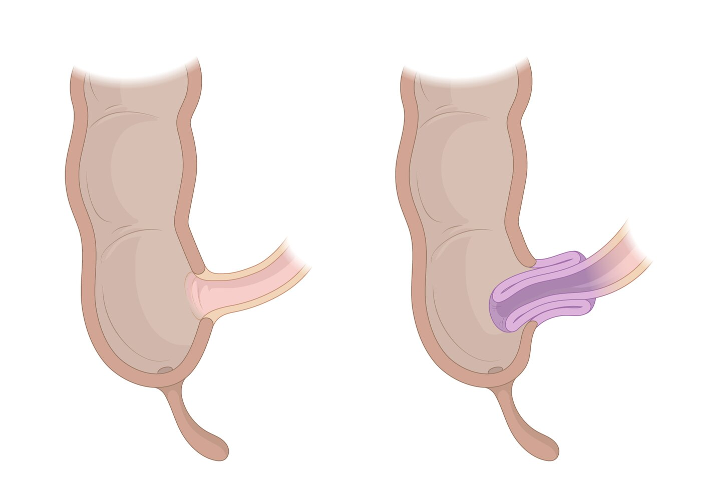
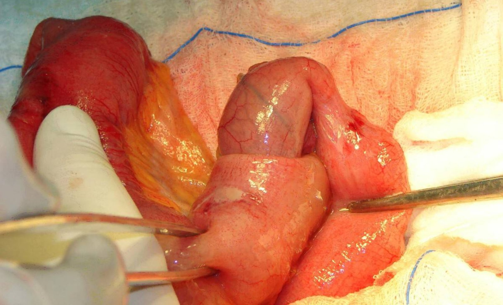
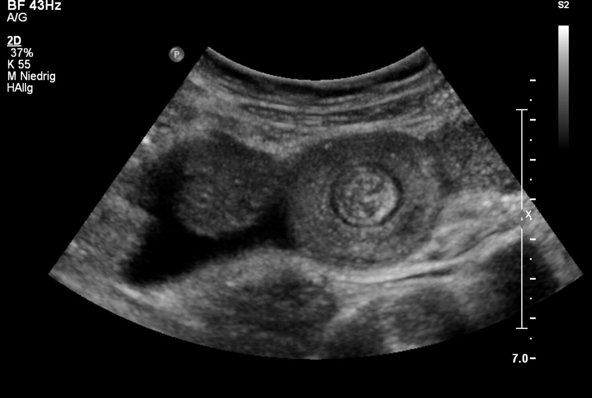
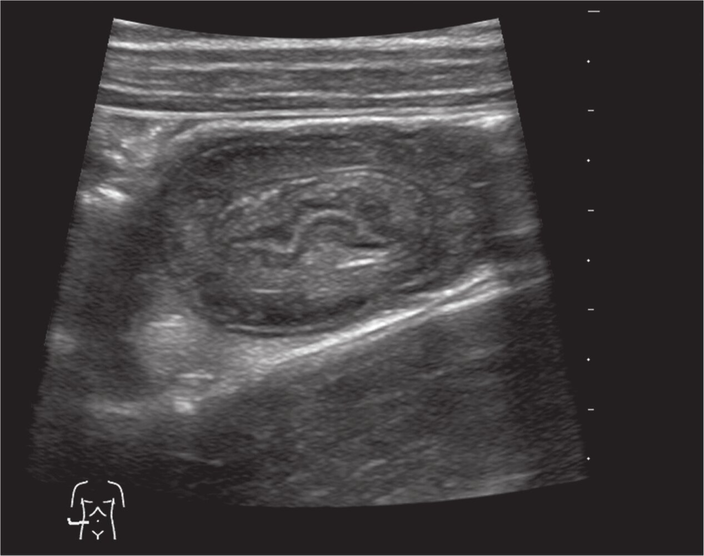
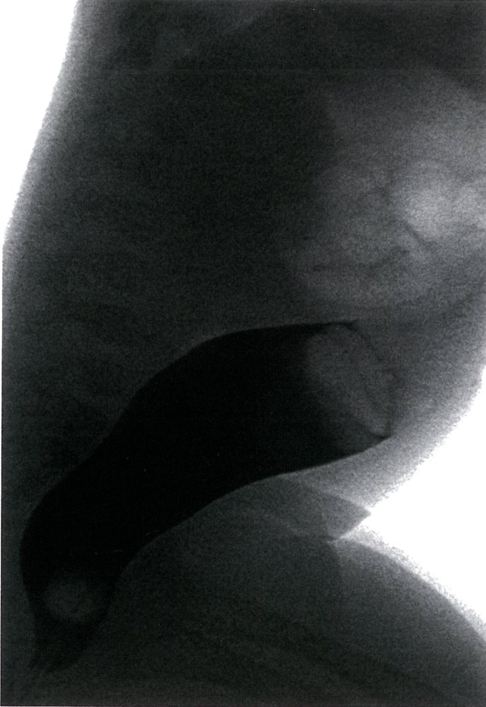

# Intussusception

*Categories: Clinical knowledge > Pediatrics > Pediatric gastroenterology > Intussusception*

[Original Article Link](https://coursology-qbank.com/amboss/article/Ah0Rgf)

---

## Summary

Intussusception is the invagination of a segment of intestine into an adjacent section of intestine, potentially causing <u>bowel obstruction</u> and/or <u>intestinal ischemia</u>. Intussusception occurs primarily in <u>infants</u> and young children and is most commonly <u>idiopathic</u>. Children with intussusception usually have sudden colicky abdominal <u>pain</u>, intermittent <u>vomiting</u>, and have their knees drawn toward their chest. Some children have a palpable mass in the <u>RUQ</u> and/or blood in their stool. <u>Ultrasound</u> is the preferred diagnostic modality. In children with no evidence of <u>bowel ischemia</u>, intussusception is typically reduced by a radiologist using a hydrostatic or <u>pneumatic enema</u>. <u>Intussusception in adults</u> is rare and is typically caused by a pathological abnormality of the bowel (e.g., a <u>neoplasm</u>) that acts as a <u>lead point</u>. Symptoms are usually nonspecific but often include features of <u>bowel obstruction</u>. CT abdomen is the diagnostic modality of choice and surgical reduction is usually required. Complications in children and adults include <u>intestinal ischemia</u>, <u>peritonitis</u>, and recurrence.

---

## Epidemiology

* Children: most commonly affected (95% of all intussusceptions) [[1]](https://coursology-qbank.com/amboss/article/hndcGq0)

* Primarily seen in children between 3 months to 5 years of age [[2]](https://coursology-qbank.com/amboss/article/WGdPyr0)

* Peak <u>incidence</u>: 4–18 months of age [[3]](https://coursology-qbank.com/amboss/article/AN1Rdh0)[[4]](https://coursology-qbank.com/amboss/article/indJGq0)

* <u>Incidence</u> decreases after 2 years of age.  [[4]](https://coursology-qbank.com/amboss/article/indJGq0)[[5]](https://coursology-qbank.com/amboss/article/C6dqMI0)

* <u>♂</u> > <u>♀</u>

* Adults: rarely affected [[3]](https://coursology-qbank.com/amboss/article/AN1Rdh0)[[4]](https://coursology-qbank.com/amboss/article/indJGq0)

* Mean age 50 years [[4]](https://coursology-qbank.com/amboss/article/indJGq0)

* <u>Incidence</u> is the same in men and women.

> [!NOTE]
> In children, intussusception is one of the most common <u>causes of bowel obstruction</u> and <u>acute abdomen</u>. [[3]](https://coursology-qbank.com/amboss/article/AN1Rdh0)

Epidemiological data refers to the US, unless otherwise specified.

---

## Etiology

### <u>Idiopathic</u> [[4]](https://coursology-qbank.com/amboss/article/indJGq0)

* No identified <u>pathological lead point</u>

* Approx. 90% of all pediatric intussusceptions; rare in adults [[6]](https://coursology-qbank.com/amboss/article/RndlGq0)

* Most common in children 3–12 months of age [[7]](https://coursology-qbank.com/amboss/article/apdQLI0)

* Enlarged <u>Peyer patches</u> due to a viral illness (e.g., <u>adenovirus</u> infection) or <u>immunization</u> (e.g., <u>rotavirus</u>) are thought to act as a temporary <u>lead point</u>.  [[4]](https://coursology-qbank.com/amboss/article/indJGq0)

### <u>Pathological lead point</u> [[4]](https://coursology-qbank.com/amboss/article/indJGq0)

See “Pathophysiology” for the definition and mechanism of action of <u>pathological lead points</u>.

* Adults

* Most common cause: <u>neoplasms</u> (∼ 65%)

* Less common causes include:

* Infections

* Postoperative adhesions

* Crohn <u>granulomas</u>

* Congenital abnormalities (e.g., <u>Meckel diverticulum</u>)

* Children (uncommon)

* Most common cause: <u>Meckel diverticulum</u> [[6]](https://coursology-qbank.com/amboss/article/RndlGq0)

* Less common causes include:

* <u>Intestinal polyps</u> and other <u>benign tumors</u>

* <u>Hematoma</u>, <u>hemangioma</u>

* <u>Lymphoma</u>

* Associated conditions include:

* <u>IgA vasculitis</u> with bowel wall thickening

* <u>Cystic fibrosis</u>

> [!TIP]
> In children, a <u>pathological lead point</u> is more likely in <u>full-term</u> <u>neonates</u>, children > 5 years of age, and those with recurrent intussusception. [[7]](https://coursology-qbank.com/amboss/article/apdQLI0)

---

## Pathophysiology

* Development of a lead point: an intestinal lesion or abnormality of the intestinal wall that enables the <u>proximal</u> bowel to be pulled by <u>peristalsis</u> into the <u>distal</u> bowel

* <u>Peristalsis</u> moves the <u>lead point</u> distally → invagination or so-called “telescoping” of a portion of intestinal bowel (intussusceptum) into the <u>distal</u> adjacent bowel loop (intussuscipiens)

* Invaginated bowel leads to <u>mechanical bowel obstruction</u> → <u>vomiting</u>

* Impaired <u>lymphatic drainage</u> and increasing pressure in intussusceptum bowel wall → venous impairment → congestion of <u>mesenteric vessels</u> → <u>ischemia</u> of intussusceptum bowel wall → sloughing of bowel <u>mucosa</u> (most sensitive to <u>bowel ischemia</u> since it is the furthest from the arterial supply) → <u>transmural</u> <u>necrosis</u> and perforation with prolonged <u>ischemia</u>

Intussusception

Intussusception

---

## Classification

Intussusception is classified by the portion and location of the bowel that has been invaginated. [[4]](https://coursology-qbank.com/amboss/article/indJGq0)

* Ileocolic (most common): <u>terminal ileum</u> invaginates through the <u>ileocecal valve</u> into the <u>colon</u>

* Enteroenteric: e.g., ileoileal, jejunojejunal, jejunoileal

* Colocolic: e.g., colosigmoidal, appendicocecal (rare)

---

## Clinical features

The following signs and symptoms apply to children. See “<u>Intussusception in adults</u>” for the presentation in adults. [[3]](https://coursology-qbank.com/amboss/article/AN1Rdh0)[[4]](https://coursology-qbank.com/amboss/article/indJGq0)

### Symptoms

* Abdominal <u>pain</u>

* Acute cyclical colicky <u>pain</u> with asymptomatic intervals

* Knees drawn toward the chest

* <u>Vomiting</u> (may be <u>bilious</u> in patients with <u>bowel obstruction</u>)

* Blood and/or bloody mucus in stool (so-called “<u>currant jelly stool</u>”)  [[4]](https://coursology-qbank.com/amboss/article/indJGq0)

* Restlessness, irritability, and/or <u>lethargy</u>

### <u>Physical examination</u>

* Abdominal tenderness

* Palpable abdominal mass; may be sausage-shaped

* Typically in <u>RUQ</u> or epigastrium

* Dance sign: <u>RLQ</u> is visibly empty (i.e., appears to have a <u>scaphoid</u> <u>depression</u>).  [[9]](https://coursology-qbank.com/amboss/article/WpdPoI0)

* Abnormal <u>bowel sounds</u>: high pitched (early obstruction) or absent (late obstruction)

> [!TIP]
> The classic triad of abdominal <u>pain</u>, palpable abdominal mass, and bloody stool is present in < 15% of children with intussusception. [[4]](https://coursology-qbank.com/amboss/article/indJGq0)

---

## Diagnosis

### Approach [[3]](https://coursology-qbank.com/amboss/article/AN1Rdh0)[[4]](https://coursology-qbank.com/amboss/article/indJGq0)[[10]](https://coursology-qbank.com/amboss/article/2ndTsq0)

See “<u>Diagnostic workup of acute abdominal pain</u>” for a general approach.

* Confirm the diagnosis with imaging.

* <u>Ultrasound</u> abdomen: preferred in children

* CT abdomen: preferred in adults

* Obtain <u>laboratory studies</u> to identify secondary complications.

* If the diagnosis remains uncertain, consider consulting radiology for an image-guided enema.

### <u>Ultrasound</u> abdomen [[3]](https://coursology-qbank.com/amboss/article/AN1Rdh0)[[4]](https://coursology-qbank.com/amboss/article/indJGq0)[[10]](https://coursology-qbank.com/amboss/article/2ndTsq0)

* Indication: suspected intussusception in children

* Findings

* Target sign (transverse view): Invaginated bowel-in-bowel appears as concentric rings.

* Pseudokidney sign (longitudinal view): Invaginated bowel looks like <u>kidney</u>.

> [!TIP]
> Abdominal <u>ultrasound</u> is the preferred imaging modality in children because it has high <u>sensitivity</u> and <u>specificity</u>, minimizes radiation exposure, and facilitates immediate <u>ultrasound</u>-guided reduction.

Target sign in intussusception

Pseudokidney sign in intussusception

### CT abdomen [[3]](https://coursology-qbank.com/amboss/article/AN1Rdh0)[[4]](https://coursology-qbank.com/amboss/article/indJGq0)[[10]](https://coursology-qbank.com/amboss/article/2ndTsq0)

* Indication: suspected <u>intussusception in adults</u>

* Findings

* <u>Target sign</u>

* Evidence of <u>pathological lead point</u> (e.g., intestinal mass)

* Evidence of <u>bowel ischemia</u>

### Image-guided enema [[4]](https://coursology-qbank.com/amboss/article/indJGq0)[[10]](https://coursology-qbank.com/amboss/article/2ndTsq0)

* Indication: diagnostic uncertainty and/or planned reduction

* Techniques: <u>fluoroscopic</u> <u>barium enema</u>, <u>ultrasound</u>-guided hydrostatic enema

* Advantage: may also reduce the intussusception

* Contraindication: suspected <u>bowel perforation</u>

Colosigmoidal intussusception in a 4-year-old girl

### Additional studies [[3]](https://coursology-qbank.com/amboss/article/AN1Rdh0)

* <u>X-ray abdomen</u>

* Not recommended as the initial examination for suspected intussusception because diagnostic <u>accuracy</u> is low.

* If performed as part of the workup for <u>acute abdomen</u>, distended bowel loops may be seen. [[10]](https://coursology-qbank.com/amboss/article/2ndTsq0)

* <u>Colonoscopy</u>: may identify the <u>lead point</u>; increased risk of perforation if there is <u>bowel ischemia</u> [[4]](https://coursology-qbank.com/amboss/article/indJGq0)

---

## Differential diagnoses

### Differential diagnoses of <u>lower gastrointestinal bleeding</u> in children

| Differential diagnosis of lower gastrointestinal bleeding in children |  |  |
| --- | --- | --- |
| Age | Condition | Findings |
| First month of life (<u>neonate</u>) |  * <u>Anal fissures</u>   |  * Visualized during <u>clinical examination</u> of perianal area   |
|  * <u>Necrotizing enterocolitis</u> (see “<u>Differential diagnosis of necrotizing enterocolitis</u>”)   |  * <u>X-ray</u> and <u>ultrasound</u> abdomen: <u>pneumatosis intestinalis</u>   |  |
|  * Malrotation with <u>volvulus</u>   |   * <u>X-ray abdomen</u>: <u>bird-beak sign</u>  * <u>Upper GI series</u>: malpositioned <u>ligament of Treitz</u>    |  |
| 1 month to 1 year (<u>infant</u>) |  * Intussusception   |   * <u>Ultrasound</u>: target and <u>pseudokidney sign</u>  * Image-guided enema: interrupted contrast    |
|  * Milk protein <u>allergy</u>   |  * Cow's milk protein-specific <u>IgE</u>   |  |
|  * <u>Anal fissures</u>   |  * Visualized during <u>clinical examination</u> of perianal area   |  |
| 1 year to 2 years |  * <u>Meckel diverticulum</u>   |  * <u>Technetium-99m pertechnetate scan</u>: gastric <u>mucosa</u>   |
| > 2 years |  * Juvenile polyps   |  * Visualized during <u>colonoscopy</u>   |
|  * <u>Inflammatory bowel disease</u> (e.g., <u>ulcerative colitis</u>)   |  * Endoscopy and <u>biopsy</u>: inflamed <u>mucosa</u> extending from the <u>rectum</u>   |  |
|  * <u>Bacterial gastroenteritis</u> (<u>Escherichia coli</u>, <u>Shigella</u>)   |  * <u>Stool cultures</u>   |  |

### Other differential diagnoses

* <u>Acute appendicitis</u>

* <u>Incarcerated inguinal hernia</u>

* <u>Gastroenteritis</u>

* See also “<u>Differential diagnosis of abdominal pain</u>.”

* See also “<u>Differential diagnosis of bowel obstruction</u>.”

The differential diagnoses listed here are not exhaustive.

---

## Treatment

Intussusception in children is typically initially managed with image-guided reduction. In adults, surgical treatment is usually necessary; see “<u>Intussusception in adults</u>” for details.

### Initial management of intussusception [[3]](https://coursology-qbank.com/amboss/article/AN1Rdh0)[[4]](https://coursology-qbank.com/amboss/article/indJGq0)

* <u>ABCDE assessment</u>

* <u>IV fluid resuscitation</u>

* Consider <u>NG tube placement</u> for decompression (see also “<u>Nonoperative management of mechanical bowel obstruction</u>”).

* <u>Empiric antibiotic therapy for intra-abdominal infections</u> if <u>intestinal ischemia</u> or perforation is suspected

* <u>Acute pain management</u> and/or <u>procedural sedation</u>

* Surgical and/or radiology consultation

> [!WARNING]
> Urgent intervention is necessary to prevent potentially life-threatening complications, e.g., <u>bowel ischemia</u>.

### Guided reduction [[3]](https://coursology-qbank.com/amboss/article/AN1Rdh0)[[4]](https://coursology-qbank.com/amboss/article/indJGq0)[[11]](https://coursology-qbank.com/amboss/article/Undbsq0)

* Indication: intussusception in clinically stable children

* Contraindications: suspected <u>intestinal ischemia</u> or perforation

* Technique

* Fluoroscopy-guided pneumatic reduction

* Air is injected rectally while the bowel is observed with continuous <u>fluoroscopy</u>.

* Most commonly performed technique [[10]](https://coursology-qbank.com/amboss/article/2ndTsq0)

* Disadvantage: radiation exposure

* Ultrasound-guided hydrostatic reduction

* <u>Normal saline</u> or water-soluble contrast is injected rectally while the bowel is observed with continuous <u>ultrasound</u>.

* Avoids radiation exposure, but may not be available at all facilities

* Success rates: Reduction is achieved in ∼ 80% of patients; recurrence occurs in up to 16%. [[10]](https://coursology-qbank.com/amboss/article/2ndTsq0)

> [!WARNING]
> Image-guided reduction is contraindicated in patients with suspected gangrenous and/or perforated bowel.

### <u>Surgery</u> [[3]](https://coursology-qbank.com/amboss/article/AN1Rdh0)[[4]](https://coursology-qbank.com/amboss/article/indJGq0)

* Indications

* Signs of <u>bowel perforation</u> or <u>intestinal ischemia</u>

* <u>Pathological lead point</u> on imaging

* Unsuccessful <u>conservative management</u>

* Most intussusceptions in adults; see “<u>Intussusception in adults</u>” for details.

* Technique

* Open <u>laparotomy</u> with Hutchinson maneuver (manual <u>proximal</u> bowel compression to reduce the intussusception) [[12]](https://coursology-qbank.com/amboss/article/epdxoI0)

* <u>Laparoscopic</u> reduction

* Possible <u>bowel resection</u> (e.g., for <u>bowel ischemia</u>, malignant <u>pathological lead point</u>)

### Disposition [[3]](https://coursology-qbank.com/amboss/article/AN1Rdh0)[[11]](https://coursology-qbank.com/amboss/article/Undbsq0)

* Consider discharge home if the child is stable, asymptomatic, and tolerating oral fluids 4 hours after successful reduction.

* Hospital admission is recommended for children with any of the following:

* Persistent symptoms or unsuccessful reduction

* Prior abdominal <u>surgery</u>

* Neuromuscular disease

* <u>Prematurity</u>

* Recurrent intussusception

---

## Complications

* <u>Bowel obstruction</u>

* <u>Intestinal ischemia</u>

* <u>Gastrointestinal perforation</u>

We list the most important complications. The selection is not exhaustive.

---