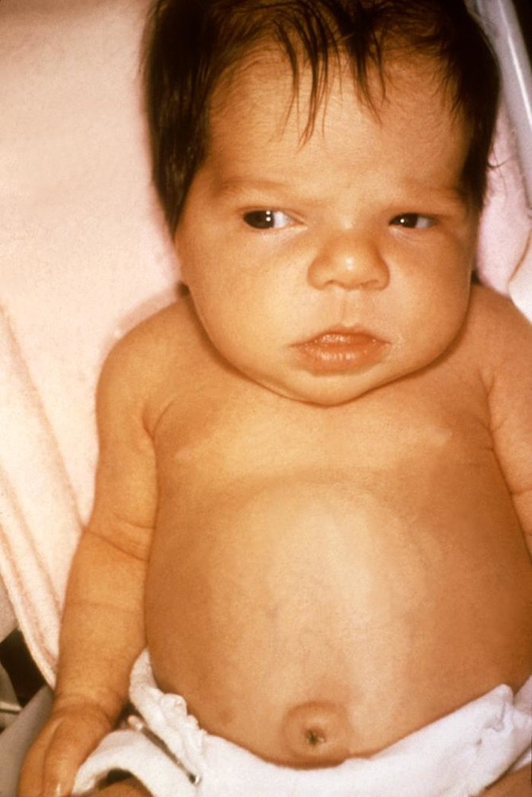
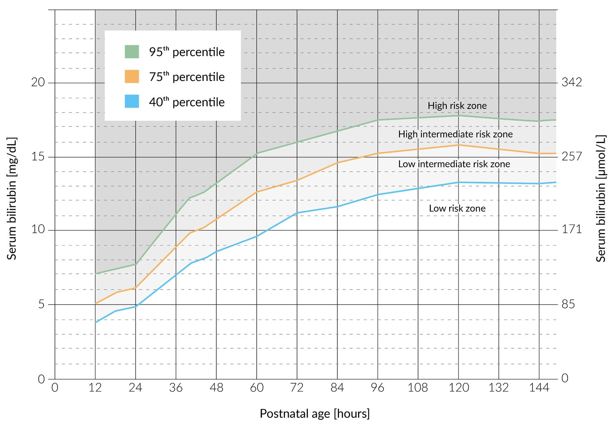
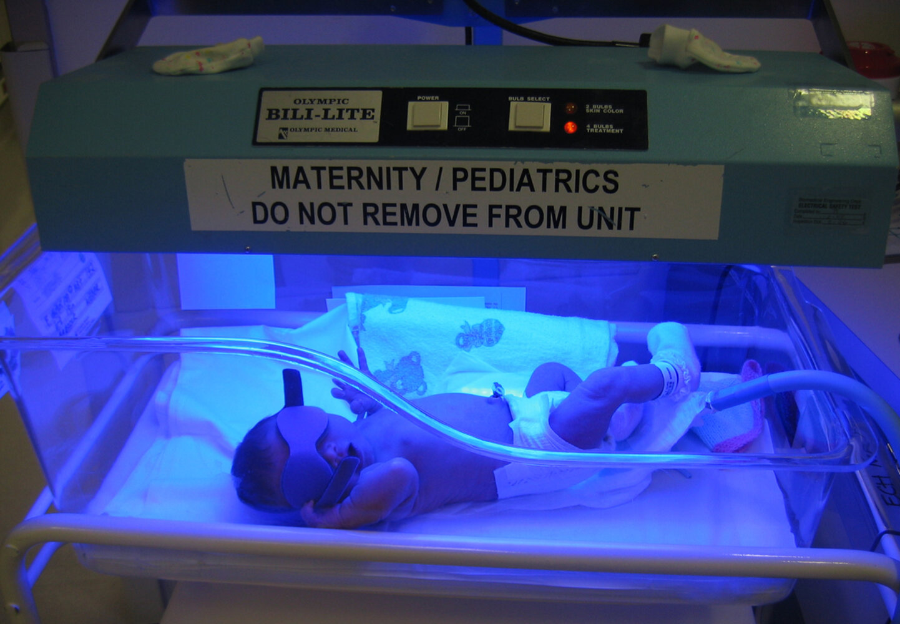
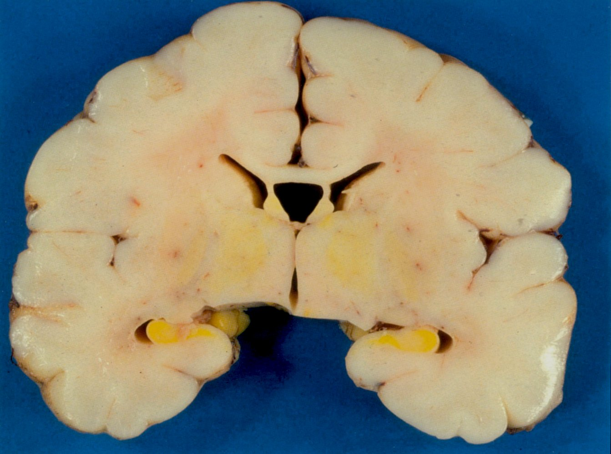

# Neonatal jaundice

*Categories: Clinical knowledge > Pediatrics > Pediatric gastroenterology > Neonatal jaundice*

[Original Article Link](https://coursology-qbank.com/amboss/article/R40lQT)

---

## Summary

Neonatal <u>jaundice</u> is one of the most common conditions occurring in <u>newborn infants</u> and is characterized by elevated levels of <u>bilirubin</u> in the blood (total serum <u>bilirubin</u> concentration > 5 mg/dL). The most common cause of <u>neonata</u>l jaundice is a physiological rise in <u>unconjugated bilirubin</u>, which results from <u>hemolysis</u> of <u>fetal hemoglobin</u> and an immature hepatic metabolism of <u>bilirubin</u>. <u>Physiological neonatal jaundice</u> is harmless and occurs in most <u>infants</u> between the second and the eighth day of life. <u>Pathologic neonatal jaundice</u> can be conjugated or unconjugated and is typically a symptom of an underlying disease. Possible conditions include <u>hemolytic anemias</u>, <u>blood group incompatibilities</u>, <u>Gilbert syndrome</u> and <u>Crigler-Najjar syndrome</u>, <u>G6PD deficiency</u>, and congenital biliary flow obstructions. <u>Hyperbilirubinemia</u> can cause drowsiness and poor feeding in the <u>newborn</u>, and in severe cases, <u>unconjugated bilirubin</u> can cross the <u>blood-brain barrier</u> and cause permanent neurological damage (<u>kernicterus</u>). The degree of <u>hyperbilirubinemia</u> can be measured by transcutaneous and/or serum <u>bilirubin</u> measurements. Treatment modalities include <u>phototherapy</u>, <u>intravenous immune globulin</u> (IVIG), and <u>exchange transfusion</u>, in addition to specific therapies for the respective underlying conditions. Treatment is targeted at reducing the risk of <u>kernicterus</u> and hence permanent neurological sequelae.

---

## Classification

| Types of neonatal jaundice |  |  |
| --- | --- | --- |
| Features | Physiological neonatal jaundice | Pathological neonatal jaundice |
| Type of <u>hyperbilirubinemia</u> |  * Always <u>unconjugated hyperbilirubinemia</u>   |  * Can be either conjugated or unconjugated <u>hyperbilirubinemia</u>   |
| Onset |  * > 24 hours after <u>birth</u>   |  * Can present < 24 hours after <u>birth</u>   |
| Peak total serum <u>bilirubin</u> |  * < 15 mg/dL (in the case of a <u>full-term</u>, breastfed <u>infant</u>)   |  * May rise > 15 mg/dL   |
| Daily rise in <u>bilirubin</u> levels |  * < 5 mg/dL/day   |  * > 5 mg/dL/day   |
| Etiology |  * <u>Hemolysis</u> of <u>fetal hemoglobin</u> and an immature hepatic metabolism of <u>bilirubin</u>   |  * See “Etiology” below.   |

---

## Etiology

|  Overview of mechanisms of neonatal jaundice [[1]](https://coursology-qbank.com/amboss/article/Tec6yY0)[[2]](https://coursology-qbank.com/amboss/article/HIaKVN)  |  |  |  |
| --- | --- | --- | --- |
| Type of <u>hyperbilirubinemia</u> | Mechanism |  | Etiology |
| Pathological unconjugated hyperbilirubinemia |  * <u>Hemolytic</u>   |  * ↑ Production of <u>bilirubin</u>   |   * <u>Hemolytic disease of the newborn</u> (e.g., <u>ABO incompatibility</u>, <u>Rh incompatibility</u>)  * <u>Erythrocyte</u> enzyme defects (e.g., <u>G6PD deficiency</u>, <u>pyruvate kinase deficiency</u>)  * <u>Erythrocyte</u> membrane defects (e.g., <u>hereditary spherocytosis</u>)  * <u>Hemoglobinopathies</u> (e.g., <u>sickle cell anemia</u>, <u>thalassemias</u>)  * <u>Hematomas</u> (e.g., <u>vacuum-assisted delivery</u>, <u>vitamin K deficiency bleeding</u>)  * Infection/<u>sepsis</u> (see “<u>Neonatal infection</u>”)  * <u>Polycythemia</u>    |
|  * <u>Nonhemolytic</u>   |  * ↓ Conjugation of <u>bilirubin</u>   |   * <u>Gilbert syndrome</u>  * <u>Crigler-Najjar syndrome</u>  * Deficiency of <u>UDP-glucuronosyltransferase</u>  * <u>Hypothyroidism</u>    |  |
|  * Decreased stool passage → ↑ <u>Enterohepatic circulation</u> of <u>bilirubin</u>   |   * GI obstruction (e.g., <u>pyloric stenosis</u>, <u>bowel obstruction</u>)  * <u>Hirschsprung disease</u>  * <u>Cystic fibrosis</u>  * <u>Breast milk jaundice</u>  * <u>Breastfeeding jaundice</u>  * <u>Malnutrition</u>    |  |  |
| Pathological conjugated hyperbilirubinemia |  * Intrahepatic   |  * ↓ Hepatic uptake of <u>bilirubin</u>   |  * <u>Rotor syndrome</u> [[3]](https://coursology-qbank.com/amboss/article/xVcE9Y0)   |
|  * ↓ Excretion of <u>bilirubin</u>   |   * <u>Alagille syndrome</u> [[4]](https://coursology-qbank.com/amboss/article/BVcz9Y0)  * <u>TORCH infections</u>  * <u>Dubin-Johnson syndrome</u> [[3]](https://coursology-qbank.com/amboss/article/xVcE9Y0)  * <u>Sepsis</u>  * <u>Idiopathic neonatal hepatitis</u>  * <u>Alpha-1-antitrypsin</u> deficiency  * <u>Cystic fibrosis</u>  * <u>Galactosemia</u>  * <u>Hypothyroidism</u>  * Medication    |  |  |
|  * Extrahepatic   |   * <u>Biliary atresia</u>  * Biliary/<u>choledochal cyst</u>  * Tumors/strictures    |  |  |
| Mixed hyperbilirubinemia |  * Combined   |  * Both conjugated and <u>unconjugated hyperbilirubinemia</u> occur   |   * <u>Hepatitis</u>  * <u>Cirrhosis</u>    |

---

## Pathophysiology

### <u>Physiological neonatal jaundice</u> [[5]](https://coursology-qbank.com/amboss/article/wbYhDn)

* <u>Unconjugated hyperbilirubinemia</u> caused by

* Short lifespan of <u>erythrocytes</u> in the <u>newborn</u>

* Insufficient hepatic <u>bilirubin metabolism</u>: due to immature <u>UDP-glucuronosyltransferase</u>

* ↑ <u>Enterohepatic circulation</u> of <u>bilirubin</u>

### <u>Pathological neonatal jaundice</u> [[5]](https://coursology-qbank.com/amboss/article/wbYhDn)

* <u>Hyperbilirubinemia</u> can be caused by multiple mechanisms

* Increased production of <u>bilirubin</u> (e.g., conditions with increased <u>hemolysis</u>)

* Decreased hepatic uptake (e.g., due to <u>liver</u> immaturity)

* Decreased conjugation (e.g., <u>Crigler-Najjar syndrome</u>)

* Impaired excretion (e.g., conditions with <u>cholestasis</u>, gastrourinary <u>malformations</u>)

* Increased <u>enterohepatic circulation</u> (e.g., conditions with decreased intestinal motility, <u>breastfeeding jaundice</u>)

---

## Subtypes and variants

### Breastfeeding jaundice [[5]](https://coursology-qbank.com/amboss/article/wbYhDn)

* Definition: a <u>type of neonatal jaundice</u> caused by insufficient <u>breastfeeding</u>

* Pathophysiology: insufficient <u>breast milk</u> intake;   → lack of calories and inadequate quantities of bowel movements to remove <u>bilirubin</u> from the body → ↑ <u>enterohepatic circulation</u> → increased reabsorption of <u>bilirubin</u> from the intestines → <u>unconjugated hyperbilirubinemia</u>

* Clinical features: onset within 1 week

* Treatment: : increase <u>breastfeeding</u> sessions, rehydration

### Breast milk jaundice [[5]](https://coursology-qbank.com/amboss/article/wbYhDn)

* Definition: a <u>type of neonatal jaundice</u> caused by increased levels of <u>β-glucuronidase</u> in maternal <u>breast milk</u>

* Pathophysiology: increased concentration of β-glucuronidase in <u>breast</u> milk → ↑ deconjugation and reabsorption of <u>bilirubin</u> → persistence of <u>physiologic jaundice</u> with <u>unconjugated hyperbilirubinemia</u>

* β-Glucuronidase is found in <u>breast milk</u> and the intestinal brush border.

* Deconjugation of <u>bilirubin</u> by bacterial <u>β-glucuronidase</u> can lead to <u>pigment stone</u> formation. [[6]](https://coursology-qbank.com/amboss/article/Rl1l9S0)

* Clinical features: : onset within 2 weeks after <u>birth</u>; lasts for 4–13 weeks

* Treatment

* Continued <u>breastfeeding</u> and supplementation with formula feeds

* <u>Phototherapy</u>, if required

---

## Clinical features

* <u>Physiological neonatal jaundice</u> 

* Asymptomatic, except for transient <u>icterus</u>

* <u>Jaundice</u> manifests after 1st day of life and usually resolves without treatment in 1 week (in term <u>infants</u>) or 2 weeks (in <u>preterm infants</u>).

* Usually most severe on the 5th day

* <u>Pathological neonatal jaundice</u> 

* <u>Jaundice</u> can appear < 24 hours after <u>birth</u> and persist > 1 week in term <u>infants</u> and > 2 weeks in <u>preterm infants</u>.

* Clinical features of the underlying cause

Neonatal jaundice

---

## Diagnosis

* <u>Physical examination</u> for <u>icterus</u>: The American Academy of <u>Pediatrics</u> (<u>AAP</u>) recommends regular assessment of all <u>neonates</u> for <u>jaundice</u> (every 8–12 hours) while in the hospital.

* <u>Bilirubin</u> tests  [[7]](https://coursology-qbank.com/amboss/article/GIaBVN)[[8]](https://coursology-qbank.com/amboss/article/FIageN)

* Transcutaneous <u>bilirubin</u> measurement (TcB) 
* <u>Bilirubin</u> levels > 95th <u>percentile</u> on nomogram indicate <u>neonates</u> at high risk for developing neurological sequelae.

* Serum <u>bilirubin</u> measurement 

* Total serum <u>bilirubin</u> measured

* Differentiation of direct (conjugated) and <u>indirect (unconjugated) bilirubin</u>

* Assessment of degree of <u>jaundice</u> based on nomogram → <u>infants</u> > 95th <u>percentile</u> must be evaluated for pathological <u>jaundice</u> (See “Other laboratory tests” below.)

* Other laboratory tests 

* <u>Complete blood count</u> (including <u>reticulocyte count</u>)

* <u>Blood group</u>

* Direct and indirect <u>Coombs' test</u> (See “<u>Rh incompatibility</u>.”)

* <u>Markers of inflammation</u>

* <u>Liver</u> enzymes

* Total <u>serum protein</u> and serum <u>albumin</u>

* <u>TSH</u> and free T4

* <u>G6PD</u> activity (in patients with <u>G6PD deficiency</u>)

> [!TIP]
> <u>Physiological neonatal jaundice</u> is a diagnosis of exclusion. Laboratory tests should first rule out all pathological causes of <u>neonata</u>l jaundice.

> [!TIP]
> <u>Jaundice</u> in a term <u>newborn</u> less than 24 hours old is always pathologic.

Bhutani nomogram

---

## Treatment

### Phototherapy [[2]](https://coursology-qbank.com/amboss/article/HIaKVN)[[7]](https://coursology-qbank.com/amboss/article/GIaBVN)[[9]](https://coursology-qbank.com/amboss/article/sIatVN)

<u>Phototherapy</u> is the primary treatment in <u>neonates</u> with <u>unconjugated hyperbilirubinemia</u>.

* Indications

* For <u>infants</u> born ≥ 35 weeks <u>gestation</u>, threshold <u>bilirubin</u> levels (TSB) for treatment are based on the American Academy of <u>Pediatrics</u> (<u>AAP</u>) <u>phototherapy</u> nomogram, which divides the <u>infants</u> into three risk groups:  [[7]](https://coursology-qbank.com/amboss/article/GIaBVN)

* Low-risk <u>infants</u>: ≥ 38 weeks and well

* Medium-risk <u>infants</u>: ≥ 38 weeks with <u>risk factors</u> (e.g., isoimmune <u>hemolytic</u> disease, <u>G6PD deficiency</u>, <u>sepsis</u>), or 35-37 weeks and well

* High-risk <u>infants</u>: 35-37 weeks with <u>risk factors</u>

* For <u>infants</u> born < 35 weeks <u>gestation</u>, threshold <u>bilirubin</u> levels for treatment are lower because <u>premature infants</u> are at a greater risk of <u>neurotoxicity</u>.  [[10]](https://coursology-qbank.com/amboss/article/8IaOeN)

* Procedure

* Exposure to blue light (non-UV, wavelength: 420–480 nm) → photoisomerization (major mechanism) and photooxidation (minor mechanism) of unconjugated (hydrophobic) <u>bilirubin</u> in <u>skin</u> to water-soluble forms → excretion of water-soluble form in urine and/or <u>bile</u>

* Continued until total <u>bilirubin</u> levels < < 15 mg/dL

* Adequate fluid supplementation to prevent <u>dehydration</u>

* <u>Eye</u> protection to prevent retinal damage

* Contraindications

* Concomitant use of photosensitizing medications

* <u>Congenital erythropoietic porphyria</u>

* <u>Family history</u> of <u>porphyria</u>

* Side effects

* <u>Diarrhea</u>, <u>dehydration</u>

* Changes in <u>skin</u> hue (bronzing) and <u>skin</u> rashes

* Separation of the <u>neonate</u> from the mother

* ↑ Risk of <u>AML</u>

* Bronze baby syndrome (rare)

* Occurs in <u>infants</u> with elevated <u>direct bilirubin</u> (<u>conjugated bilirubin</u> > 2 mg/dL) following <u>phototherapy</u>

* Thought to be caused by abnormal accumulation of bronze-colored pigments (photoisomers of <u>bilirubin</u>) within the <u>skin</u>

* Presents with a reversible grayish-brown discoloration of the <u>skin</u>, urine, and serum

* Usually resolves slowly after cessation of <u>phototherapy</u> without complications

> [!TIP]
> <u>Newborns</u> with TSB levels below the <u>phototherapy</u> threshold usually do not require treatment. [[11]](https://coursology-qbank.com/amboss/article/UmWbUN0)

Bhutani nomogram

Neonatal phototherapy

### Exchange transfusion

Most rapid method for lowering serum <u>bilirubin</u> concentrations

* Indications

* Threshold in a 24-hour-old term baby is a total serum <u>bilirubin</u> value > 20 mg/dL

* Inadequate response to <u>phototherapy</u>, or a rapid rise in the total serum <u>bilirubin</u> level (> 1 mg/dL/hour in less than 6 hours)

* <u>Acute bilirubin encephalopathy</u>

* <u>Hemolytic</u> disease, <u>severe anemia</u>

* Procedure

* Use ABO-matched and <u>Rh-negative</u> <u>erythrocyte</u> concentrate.

* Exchange blood in quantities of 5–20 mL via an umbilical venous catheter until total serum <u>bilirubin</u> is < 95th <u>percentile</u> on nomogram.

* Side effects

* Higher mortality and <u>morbidity</u> from infections

* <u>Acidosis</u>

* <u>Thrombosis</u>

* <u>Hypotension</u>

* <u>Electrolyte</u> imbalances

### <u>IV immunoglobulin</u>

* Indications: used in cases with immunologically mediated conditions, or in the presence of Rh, ABO, or other <u>blood group incompatibilities</u> that cause significant neonatal <u>jaundice</u>

* Dose range for IVIG: 500–1000 mg/kg

---

## Complications

### Acute bilirubin encephalopathy

* Onset within first days of life

* <u>Lethargy</u>, <u>infantile hypotonia</u>, poor feeding

* <u>Fever</u>, shrill cry

* <u>Stupor</u>, <u>apnea</u>, <u>seizures</u>

* Possibly fatal if <u>neurotoxicity</u> is severe

### Kernicterus (<u>chronic bilirubin encephalopathy</u>)

* Develops over first years of life

* Pathophysiology: deposition of unconjugated <u>bilirubin</u> (<u>liposoluble</u>) in the <u>basal ganglia</u> and/or <u>brain stem</u> <u>nuclei</u>

* Clinical features

* Cerebral <u>paresis</u>, <u>hearing</u> impairment, <u>vertical gaze palsy</u>

* Movement disorder (<u>choreoathetosis</u>)

* Apparent intellectual and developmental disabilities

* <u>Dental enamel</u> <u>hypoplasia</u>

Kernicterus

We list the most important complications. The selection is not exhaustive.

---

## Prevention

Interruption of <u>enterohepatic circulation</u> with adequate <u>enteral nutrition</u> [[7]](https://coursology-qbank.com/amboss/article/GIaBVN)

* Frequent feeds with <u>breast milk</u>

* Protein-rich nutrition  in the form of <u>breast milk</u> or special formula feeds

* In the case of <u>dehydration</u>, protein-rich feeding solutions are preferred over <u>glucose</u> or water.

---