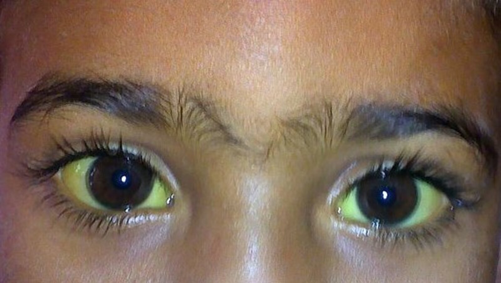
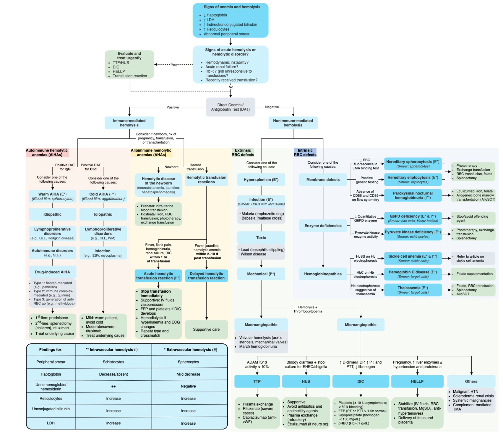
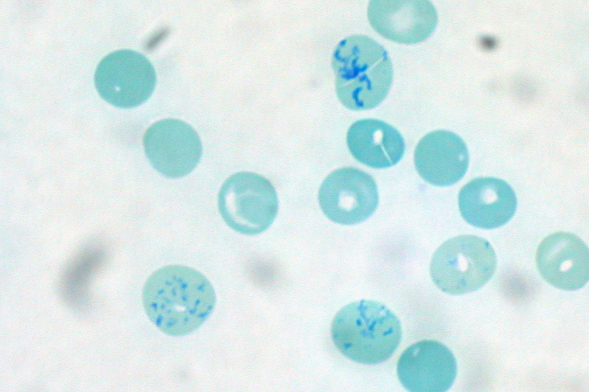
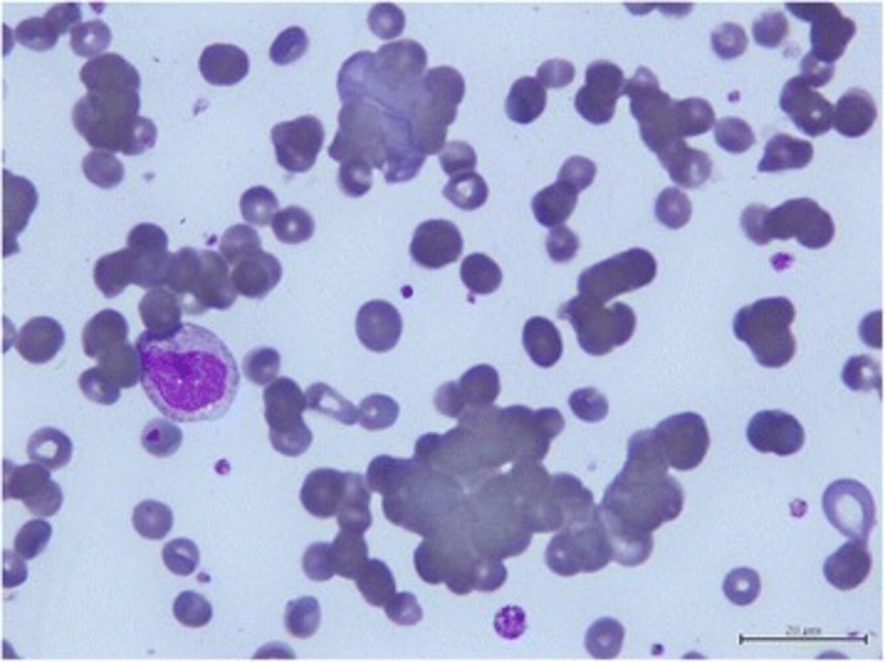
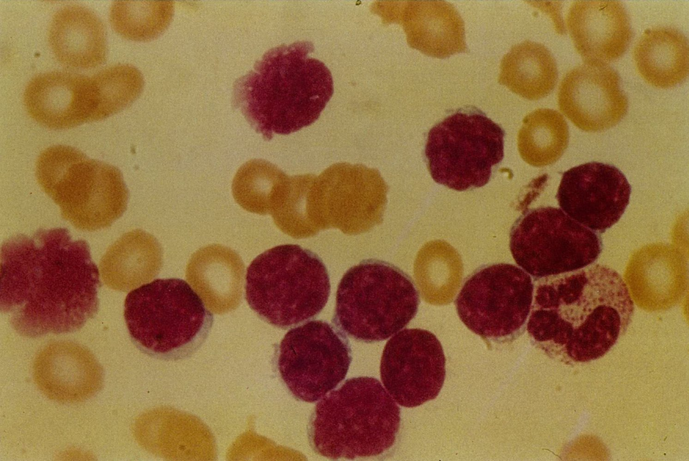
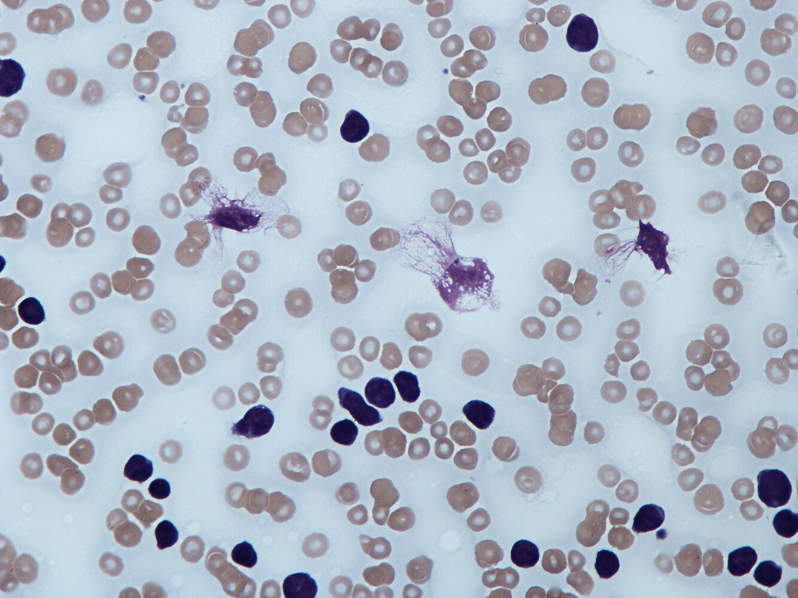
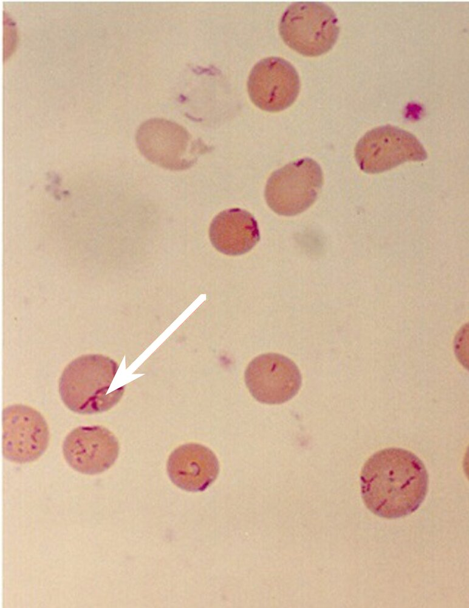
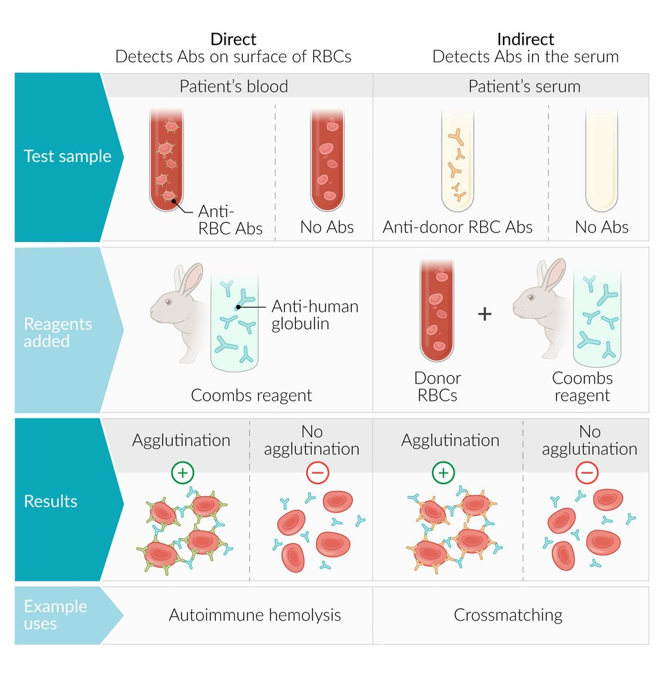

# Hemolytic anemia

*Categories: Clinical knowledge > Pediatrics > Pediatric hematology > Hemolytic anemia*

[Original Article Link](https://coursology-qbank.com/amboss/article/rT0fH2)

---

## Summary

Hemolytic <u>anemia</u> is characterized by the breakdown of <u>red blood cells</u> (<u>RBCs</u>). Hemolysis can either be caused by abnormalities in <u>RBCs</u> (<u>hemoglobin</u>, the <u>RBC</u> membrane, or intracellular enzymes), which is called <u>intrinsic hemolytic anemia</u>, or by external causes (immune-mediated or mechanical damage), which is called <u>extrinsic hemolytic anemia</u>. Hemolysis can be further categorized depending on whether it occurs inside the <u>blood vessels</u> (<u>intravascular hemolysis</u>), in the <u>reticuloendothelial system</u> (<u>extravascular hemolysis</u>), or both. Hemolytic <u>anemias</u> cause varying degrees of fatigue, <u>pallor</u>, and <u>weakness</u>, ranging from asymptomatic disease to life-threatening <u>hemolytic crisis</u>; although, some hemolytic <u>anemias</u> have more specific findings (e.g., <u>thrombosis</u> in <u>paroxysmal nocturnal hemoglobinuria</u>). Hemolytic <u>anemia</u> should be suspected in patients with <u>anemia</u> and <u>laboratory findings of hemolysis</u> (e.g., elevated <u>indirect bilirubin</u> and <u>lactate dehydrogenase</u>, <u>reticulocytosis</u>, and decreased <u>haptoglobin</u> levels). The <u>Coombs test</u> helps to distinguish between <u>antibody</u>-mediated (positive <u>direct Coombs test</u>) and nonantibody-mediated (negative <u>direct Coombs test</u>) <u>anemias</u>. Further tests should be performed to investigate the underlying etiology. Treatment involves <u>RBC</u> <u>transfusions</u> as required. Additional treatment is based on the type of hemolytic <u>anemia</u> and its cause.

See also “<u>Sickle cell disease</u>”, “<u>Paroxysmal nocturnal hemoglobinuria</u>”, and “<u>Autoimmune hemolytic anemia</u>.”

---

## Overview

### Types and etiologies of hemolytic anemia

Hemolytic <u>anemias</u> are characterized by an excessive breakdown of <u>red blood cells</u> (<u>RBCs</u>). They can be classified according to the cause of hemolysis (intrinsic or extrinsic) and by the location of hemolysis (<u>intravascular</u> or extravascular).

| Type | Definition | Causes |
| --- | --- | --- |
| By <u>RBC</u> pathology |  |  |
| <u>Intrinsic hemolytic anemia</u> |  * Increased destruction of <u>RBCs</u> due to a defect within the <u>RBC</u>   |   * <u>RBC</u> membrane defects: e.g., <u>hereditary spherocytosis</u>, <u>paroxysmal nocturnal hemoglobinuria</u> (<u>PNH</u>)  * Enzyme defects: e.g., <u>glucose-6-phosphate</u> <u>dehydrogenase</u> deficiency (<u>G6PD deficiency</u>), <u>pyruvate kinase deficiency</u> (PKD)  * <u>Hemoglobinopathies</u>: <u>sickle cell disease</u>, <u>thalassemia</u>, <u>hemoglobin C disease</u>, <u>hemoglobin Zurich</u>    |
| <u>Extrinsic hemolytic anemia</u> |  * Abnormal breakdown of normal <u>RBCs</u>   |   * Mechanical destruction in large vessels: e.g., <u>prosthetic heart valves</u>  * Mechanical destruction in small vessels (i.e., <u>MAHA</u>): e.g., <u>HUS</u>, <u>TTP</u>, <u>DIC</u>, <u>HELLP syndrome</u>  * Autoimmune reactions: <u>Autoimmune hemolytic anemia</u> (<u>AIHA</u>)  * <u>Alloimmune</u> reactions: e.g., ABO/<u>Rh incompatibility</u>  * Immune reactions due to infections (e.g., <u>Mycoplasma</u>) or tumors (e.g., <u>chronic lymphocytic leukemia</u>)  * Infections causing increased destruction of <u>RBCs</u> (e.g., <u>Babesia</u>, <u>malaria</u>, <u>Bartonella bacilliformis</u>)  * Increased degradation by the <u>spleen</u> (<u>hypersplenism</u>)    |
| By location of <u>RBC breakdown</u> |  |  |
| Intravascular hemolytic anemia |  * Increased destruction of <u>RBCs</u> within the <u>blood vessels</u>   |   * Toxins (e.g., <u>snake bites</u>) and oxidizing agents (e.g., <u>copper</u> <u>poisoning</u>) [[1]](https://coursology-qbank.com/amboss/article/UKYbfJ)[[2]](https://coursology-qbank.com/amboss/article/2KYTfJ)  * <u>G6PD deficiency</u>  * <u>Antibody</u>-mediated hemolysis (<u>transfusion</u> <u>ABO incompatibility</u>, hemolytic <u>anemia</u> of the <u>newborn</u>, <u>cold agglutinin disease</u>)  * <u>Complement</u>-mediated hemolysis: <u>PNH</u>  * <u>Macroangiopathic anemia</u> (mechanical destruction by, e.g., prosthetic cardiac valves)  * Microangiopathic <u>anemia</u> (e.g., <u>TTP</u>, <u>HUS</u>, <u>disseminated intravascular coagulation</u>, <u>HELLP syndrome</u>, <u>systemic lupus erythematosus</u>)    |
| Extravascular hemolytic anemia |  * Increased destruction of <u>RBCs</u> by the <u>reticuloendothelial system</u> (primarily the <u>spleen</u>)   |   * <u>RBC</u> defects (e.g., <u>sickle cell disease</u>, <u>spherocytosis</u>, <u>pyruvate kinase deficiency</u>)  * <u>Antibody</u>-mediated hemolysis (warm and <u>cold agglutinin disease</u>)    |

---

## Clinical features

* <u>Signs of anemia</u>

* <u>Pallor</u>

* Fatigue

* <u>Exertional dyspnea</u>

* In severe cases: <u>tachycardia</u>, <u>angina pectoris</u>, <u>leg ulcers</u>

* <u>Signs of hemolysis</u>

* <u>Jaundice</u>

* <u>Pigmented gallstones</u>

* <u>Splenomegaly</u>

* <u>Back pain</u> and dark urine in severe hemolysis with <u>hemoglobinuria</u>

* Signs of increased <u>hematopoiesis</u> (mostly in severe chronic <u>anemias</u>, e.g., <u>thalassemia</u>)

* <u>Bone marrow</u> expansion: widening of the diploic space of the <u>skull</u>, biconcave deformity of the <u>vertebral bodies</u>

* Cortical thinning and softening of bone → ↑ risk of <u>pathologic fractures</u>

* <u>Extramedullary hematopoiesis</u>: <u>hepatosplenomegaly</u>

Jaundice (scleral and dermal icterus)

References: [[3]](https://coursology-qbank.com/amboss/article/9oYNVJ)[[4]](https://coursology-qbank.com/amboss/article/U30b3f)

---

## Diagnostics

Consider hemolysis in patients with acute or chronic <u>anemia</u> in whom an obvious cause (e.g., bleeding) is not apparent. See “<u>Diagnosis of anemia</u>” for details on the general approach for a patient with <u>anemia</u>. [[5]](https://coursology-qbank.com/amboss/article/uqbpZE)

### Approach  [[5]](https://coursology-qbank.com/amboss/article/uqbpZE)[[6]](https://coursology-qbank.com/amboss/article/YWXnPC)

1. * Perform initial <u>laboratory studies</u> to confirm <u>anemia</u> and hemolysis and <u>classify anemia by morphology</u>.

* <u>Anemia workup</u>: <u>CBC</u> with <u>MCV</u>, <u>reticulocyte count</u>

* <u>Hemolysis workup</u>: Add <u>LDH</u>, <u>haptoglobin</u>, <u>bilirubin</u>, <u>urinalysis</u>, and <u>peripheral blood smear</u> (<u>PBS</u>)
2. * Obtain a <u>direct Coombs test</u> (i.e., <u>DAT</u>) to narrow the differential:

* <u>DAT</u> positive: <u>antibody</u>-mediated hemolytic <u>anemia</u>

* <u>DAT</u> negative: nonantibody-mediated hemolytic <u>anemia</u>
3. * Consider further investigations of the underlying etiology based on clinical suspicion and <u>DAT</u> results.

> [!TIP]
> Rule out hemolysis in any patient with unexplained <u>anemia</u>, even if the <u>urine dipstick test</u> is negative for blood and <u>jaundice</u> is not evident on <u>physical examination</u>.

> [!WARNING]
> If the patient has severe <u>symptoms of anemia</u> or a life-threatening cause is suspected (i.e., <u>TTP</u>/<u>HUS</u>, <u>disseminated intravascular coagulation</u>, <u>HELLP syndrome</u>, <u>acute hemolytic transfusion reaction</u>), proceed directly to treatment in parallel with diagnostic evaluation.

Hemolytic anemia flowchart

### Routine <u>laboratory studies</u> [[5]](https://coursology-qbank.com/amboss/article/uqbpZE)[[6]](https://coursology-qbank.com/amboss/article/YWXnPC)

* <u>CBC</u>

* ↓ <u>Hb</u>, <u>Hct</u>, and <u>RBC count</u>  [[6]](https://coursology-qbank.com/amboss/article/YWXnPC)

* <u>MCV</u>

* <u>Normocytosis</u>: typical finding for most hemolytic <u>anemias</u>; consider other <u>anemia of chronic disease</u>

* ↑ <u>MCV</u>: Can be due to severe <u>reticulocytosis</u> ; consider other causes of <u>macrocytosis</u> (e.g., <u>megaloblastic anemia</u>)

* <u>Microcytosis</u>: consider <u>thalassemia</u> and/or <u>iron deficiency</u>

* <u>WBC count</u>: can be elevated due to inflammation or <u>malignancy</u>

* <u>Platelets</u>: decreased in <u>MAHA</u>  and in <u>Evan syndrome</u>

* <u>Reticulocyte count</u>: Use the <u>corrected reticulocyte count</u> for patients with <u>anemia</u>.

* <u>Reticulocytosis</u>: most common ;

* Can be normal in patients with:

* A delayed <u>bone marrow</u> response

* Concomitant <u>bone marrow suppression</u> or disease  [[6]](https://coursology-qbank.com/amboss/article/YWXnPC)

* <u>Reticulocyte production index</u>: usually ≥ 2% in hemolytic <u>anemia</u> [[7]](https://coursology-qbank.com/amboss/article/rzbf8w)[[8]](https://coursology-qbank.com/amboss/article/yKXdQ_)

* See also “<u>Basics of hematology</u>” and “<u>Hematological parameters</u>.”

> [!TIP]
> <u>Iron studies</u> are usually normal in hemolytic <u>anemia</u>, however, <u>iron deficiency</u> can be seen in chronic <u>intravascular hemolysis</u> [[9]](https://coursology-qbank.com/amboss/article/GqXB-_)

---

## Hemolysis workup

While no single test can be used to confirm hemolysis, the finding of <u>anemia</u> in the presence of accelerated <u>erythropoiesis</u> (i.e., <u>reticulocytosis</u>) in addition to evidence of <u>RBC</u> destruction in serum and/or urine studies is highly suggestive of hemolytic <u>anemia</u>.

> [!TIP]
> Typical biochemical findings in hemolysis include ↓ <u>haptoglobin</u>, ↑ <u>LDH</u> concentration, ↑ <u>indirect bilirubin</u> concentration, <u>peripheral blood smear</u> abnormalities (e.g., ↑ <u>reticulocytes</u>, <u>schistocytes</u>, <u>spherocytes</u>, <u>polychromasia</u>), and <u>urinalysis</u> abnormalities (e.g., <u>hemoglobinuria</u>, <u>hemosiderinuria</u>, and <u>urobilinogen</u>).

### Serum studies

|  Evidence of hemolysis in serum studies [[5]](https://coursology-qbank.com/amboss/article/uqbpZE)[[6]](https://coursology-qbank.com/amboss/article/YWXnPC)  |  |  |  |  |
| --- | --- | --- | --- | --- |
| Parameter | Description | Features of intravascular hemolysis |  | Features of extravascular hemolysis |
|  Haptoglobin [[10]](https://coursology-qbank.com/amboss/article/L9awL5)[[11]](https://coursology-qbank.com/amboss/article/XWX9PC)  |   * <u>Hb</u> released from the <u>breakdown of RBCs</u> binds to <u>haptoglobin</u> → decrease in free circulating <u>haptoglobin</u>  * Level 25–28 mg/dL: highly sensitive and specific for hemolysis.  [[10]](https://coursology-qbank.com/amboss/article/L9awL5)  * Not helpful to distinguish between <u>intravascular hemolysis</u> and <u>extravascular hemolysis</u>. [[10]](https://coursology-qbank.com/amboss/article/L9awL5)    |  * ↓   |  |  * ↓   |
| <u>Lactate dehydrogenase</u> |   * Nonspecific parameter; indicates increased cellular breakdown  * More prominent in <u>intravascular hemolysis</u>  * Can help distinguish between <u>intravascular hemolysis</u> and <u>extravascular hemolysis</u>  * Can be used as a marker of response to treatment    |  * ↑↑   |  |  * ↑   |
| <u>Indirect (unconjugated) bilirubin</u> |   * Hemolysis → <u>Hb</u> release → <u>heme</u> catabolized to <u>indirect bilirubin</u> (see “<u>Bilirubin metabolism</u>”)   [[12]](https://coursology-qbank.com/amboss/article/bVXHGC)  * More prominent in <u>extravascular hemolysis</u>  * Can be used as an early marker of response to treatment    |  * Can be normal or slightly elevated   |  |  * ↑   |
| <u>PBS</u> |   * Used to detect abnormal <u>RBC</u> forms, intracellular microorganisms, and <u>inclusion bodies</u>  * See “<u>RBC morphology</u>” for more information on <u>PBS</u> findings.    |   * ↑ <u>Reticulocytes</u>  * <u>Heinz bodies</u> and <u>bite cells</u> in <u>G6PD deficiency</u>  * <u>Schistocytes</u> in <u>MAHA</u> or <u>macroangiopathic hemolysis</u>  * Intracellular organisms (e.g., in <u>malaria</u> , <u>babesiosis</u> , <u>bartonellosis</u> )    |  |   * ↑ <u>Reticulocytes</u>  * <u>Spherocytes</u> in <u>hereditary spherocytosis</u> and immune-mediated hemolysis (e.g., <u>warm AIHA</u>, <u>hemolytic transfusion reactions</u>)  * <u>RBC</u> agglutination in <u>cold agglutinin disease</u> (<u>CAD</u>)  * <u>Sickle cells</u> in <u>sickle cell disease</u>  * <u>Target cells</u> in <u>sickle cell disease</u>, <u>thalassemia</u>, and <u>hemoglobin C disease</u>  * <u>Teardrop cells</u> in <u>thalassemia</u>  * <u>Hb</u> crystals within <u>RBCs</u> in <u>hemoglobin C disease</u>  * <u>Smudge cells</u> (<u>Gumprecht shadows</u>) in <u>chronic lymphocytic leukemia</u> (<u>CLL</u>)    |

> [!TIP]
> <u>Haptoglobin</u> levels can be low in both <u>intravascular hemolysis</u> and <u>extravascular hemolysis</u> and, therefore, should not be used to differentiate between the two. [[10]](https://coursology-qbank.com/amboss/article/L9awL5)

### Urine studies

|  Evidence of hemolysis in urine studies [[5]](https://coursology-qbank.com/amboss/article/uqbpZE)[[6]](https://coursology-qbank.com/amboss/article/YWXnPC)  |  |  |  |
| --- | --- | --- | --- |
| Parameter | Description | Findings |  |
| <u>Intravascular hemolysis</u> |  <u>Extravascular hemolysis</u> [[13]](https://coursology-qbank.com/amboss/article/Z6XZj_)  |  |  |
|  <u>Hemoglobinuria</u> [[14]](https://coursology-qbank.com/amboss/article/-KXDQ_)  |   * <u>Urine dipstick</u> is positive for <u>heme</u>, but no <u>RBCs</u> are seen on microscopy.  * Early and transient marker of severe <u>intravascular hemolysis</u>  * Brown-colored urine  * Mostly occurs in <u>intravascular hemolysis</u>    |  * Present   |  * Usually absent   |
|  Hemosiderinuria [[7]](https://coursology-qbank.com/amboss/article/rzbf8w)  |   * Filtered <u>Hb</u> is reabsorbed by the <u>proximal</u> convoluted tubule → Hemic <u>iron</u> is removed and stored as <u>hemosiderin</u> → <u>hemosiderin</u>-containing <u>proximal</u> tubule cells are sloughed off into the urine  * Late marker of severe <u>intravascular hemolysis</u>  [[14]](https://coursology-qbank.com/amboss/article/-KXDQ_)  * Lends urine a brown color  * Typically seen in marked <u>intravascular hemolysis</u>    |  * Present   |  * Usually absent   |
|  <u>Urobilinogen</u> [[15]](https://coursology-qbank.com/amboss/article/fOYk76)  |   * ↑ <u>Indirect bilirubin</u> → ↑ <u>bilirubin</u> breakdown in the gut → ↑ <u>urobilinogen</u> reabsorption into the <u>enterohepatic circulation</u> → excess <u>urobilinogen</u> enters the <u>systemic circulation</u> → <u>urobilinogen</u> is excreted in the urine  * Mostly occurs in <u>extravascular hemolysis</u>    |  * Usually absent   |  * Present   |

Schistocytes

Heinz bodies

Heinz bodies

Reticulocytes in peripheral blood

Spherocytosis

Agglutination of erythrocytes

Erythrocyte morphologies in sickle-cell disease

Target cells (codocytes)

Dacrocytes

Smudge cells in chronic lymphocytic leukemia (CLL)

Smudge cells in chronic lymphocytic leukemia (CLL) 

Bartonella bacilliformis infection (Carrión disease)

Falciparum malaria: immature trophozoite in Plasmodium falciparum infection

Babesia microti (blood smear)

---

## Coombs testing (Antiglobulin testing)

* Description: A special reagent is added to patients' blood samples: Coombs serum, which contains <u>antihuman globulins</u> (AHGs) that detect and adhere (with 2 binding sites) to immune <u>proteins</u> that mediate hemolysis, i.e., <u>antibodies</u> (<u>IgG</u>) and/or <u>complement</u> 

* If these <u>proteins</u> are coating the <u>RBC</u> surface when the serum is added, AHGs will cause multiple <u>RBCs</u> to adhere to each other in a process called agglutination.

* If no such <u>proteins</u> are present, AHGs will not bind to anything.

* <u>RBC</u> agglutination is considered a positive result, while the absence of <u>RBC</u> agglutination is considered a negative result.

Direct and indirect Coombs tests

### Direct Coombs test (<u>DAT</u>) [[16]](https://coursology-qbank.com/amboss/article/4VX3uC)

This is a key test in the workup of hemolytic <u>anemia</u>.

* Goal

* Detection of <u>antibodies</u> and/or <u>complement proteins</u> on the surface of <u>RBCs</u>

* Narrowing the differential of hemolysis into two groups:

* <u>Antibody-mediated hemolysis</u>

* Non-<u>antibody-mediated hemolysis</u>

* Indications: All patients with hemolysis

* Method

* The patient's blood sample is purified so that only <u>RBCs</u> remain.

* <u>Coombs serum</u> is added and AHGs bind to the patient's <u>antibodies</u> and/or <u>complement</u> already present on the surface of their <u>RBCs</u>, leading to <u>RBC</u> agglutination.

* Positive result  

* Indicates that the patient's <u>RBCs</u> are coated with <u>autoantibodies</u> and/or <u>complement</u> that are causing hemolysis.  [[17]](https://coursology-qbank.com/amboss/article/vqbAZE)

* Etiologies include:

* <u>Autoimmune hemolytic anemia</u> (<u>warm AIHA</u> or <u>cold AIHA</u>)

* <u>Alloimmune</u> hemolytic <u>anemia</u>

* <u>Transfusion reaction</u>

* <u>Hemolytic disease of the newborn</u>

* <u>Drug-induced autoimmune hemolytic anemia</u> (e.g., due to <u>methyldopa</u>, <u>penicillin</u>, <u>cephalosporin</u>, <u>NSAIDs</u>, immunotherapy, <u>chemotherapy</u>)

* Negative result: Suggests non-<u>antibody</u>-mediated hemolysis

### Indirect Coombs test [[18]](https://coursology-qbank.com/amboss/article/kIYm1q)

* Goal:  is the detection of anti-<u>RBC</u> <u>antibodies</u> in the serum of, for example:

* <u>Transfusion</u> recipients

* Patients with <u>hemolytic disease of the fetus and newborn</u> (<u>HDFN</u>)

* Pregnant women at risk of developing <u>antibodies</u> that cause <u>HDFN</u>

* Indications

* Any patient requiring <u>pretransfusion testing</u>, e.g., <u>blood typing</u>

* Patients with suspected <u>transfusion reactions</u>

* <u>Newborns</u> with <u>signs of hemolysis</u>

* Screening for <u>Rh-negative</u> mothers to determine if <u>anti-D immunoglobulin</u> is indicated

* Method

* The patient's blood sample is purified so that only the serum remains.

* The patient's serum is incubated with test <u>RBCs</u>.

* If there are anti-<u>RBC</u> <u>antibodies</u> in the patient's serum, they will bind to the test <u>RBCs</u>.

* <u>Coombs serum</u> is added and AHGs bind to the patient's <u>antibodies</u>, which are bound to the test <u>RBCs</u>, leading to <u>RBC</u> agglutination.

* Positive result

* Indicates the presence of freely circulating anti-<u>RBC</u> <u>antibodies</u> present in the patient's serum that may be responsible for <u>HDFN</u> or <u>transfusion reactions</u>.

* Etiologies include:

* <u>RBC</u> <u>alloimmunization</u> in <u>transfusion</u> recipients or <u>newborns</u>

* <u>Maternal alloimmunization</u>

* Negative result: No detectable anti-<u>RBC</u> <u>antibodies</u>

### Differences between the Coombs tests

|  Key differences between direct and <u>indirect Coombs testing</u>  |  |  |  |
| --- | --- | --- | --- |
|  |  |  <u>Direct Coombs test</u> [[16]](https://coursology-qbank.com/amboss/article/4VX3uC) |  <u>Indirect Coombs test</u> [[18]](https://coursology-qbank.com/amboss/article/kIYm1q) |
| Clinical applications |  |  * Workup of hemolytic <u>anemia</u>   |   * <u>Transfusion</u> medicine (workup and prevention of <u>transfusion reactions</u>)  * <u>Perinatal</u> care (workup and prevention of <u>HDFN</u>)    |
| Location of <u>antibodies</u> detected |  |  * <u>RBC</u> surface   |  * Serum   |
| <u>Coombs serum</u> added to: |  |  * The patient's purified <u>RBCs</u>   |  * The patient's purified serum which has been mixed with test <u>RBCs</u>   |
|  AHGs in <u>Coombs serum</u> bind to: |  |  * <u>Antibodies</u> and/or <u>complement</u> already coating the patient's <u>RBCs</u>   |  * The patient's <u>antibodies</u> which are bound to test <u>RBCs</u>   |

> [!NOTE]
> The direct <u>Coombs test</u> detects <u>antibodies</u> that are directly attached to the <u>RBC</u> surface. The indirect (or not direct) <u>Coombs test</u> detects serum <u>antibodies</u> that are not bound to <u>RBCs</u>.

---

## Investigation of underlying causes

Perform further diagnostic workup according to the suspected etiology; specialist consultation is advised. [[17]](https://coursology-qbank.com/amboss/article/vqbAZE)[[19]](https://coursology-qbank.com/amboss/article/Dqb10E)

* <u>Hb electrophoresis</u>: abnormal <u>Hb</u> patterns, e.g., in <u>thalassemia</u>

* <u>Flow cytometry</u>

* Absence of <u>CD55</u> and <u>CD59</u> on <u>RBC</u> surface in <u>PNH</u>

* Detection of <u>CD19</u>, <u>CD20</u>, and CD23, <u>light chain restriction</u> (kappa or lambda) in <u>CLL</u>

* <u>Genetic analysis</u>: mutations in congenital hemolytic <u>anemia</u>

* <u>Bone marrow biopsy</u>

* Rarely used in the workup of <u>anemia</u> due to its invasiveness

* Indication: <u>pancytopenia</u>, presence of abnormal cells (e.g., blasts) in <u>CBC</u>/<u>peripheral blood smear</u>

* Pathologic findings are most common in malignancies that replace <u>bone marrow</u> (e.g., <u>CLL</u>).

### Antibody-mediated hemolysis (<u>DAT</u> positive)

|  Laboratory investigations for <u>antibody-mediated hemolysis</u>  [[5]](https://coursology-qbank.com/amboss/article/uqbpZE)  |  |  |  |  |
| --- | --- | --- | --- | --- |
|  |  | Concerning initial features |  | Suggested additional investigations |
| <u>Laboratory studies</u> | <u>PBS</u> |  |  |  |
|  <u>AIHA</u> [[20]](https://coursology-qbank.com/amboss/article/vIbAeE)  | <u>Warm AIHA</u> |   * <u>Features of extravascular hemolysis</u>  * <u>DAT</u> positive for <u>IgG</u>    |  * <u>Spherocytes</u>   |  * Investigations for potential underlying secondary causes of <u>AIHA</u> (based on clinical suspicion)   * Infections: e.g., <u>HIV test</u>, <u>HBsAg</u>, <u>HCV</u> <u>antibody</u>  * Autoimmune disorders: e.g., <u>ANA</u>  * Lymphoproliferative diseases: <u>Serum protein electrophoresis</u>  * <u>Immune deficiency</u> syndromes (e.g., <u>CVID</u>): Serum <u>immunoglobulins</u> and <u>electrophoresis</u>  * <u>Malignancy</u>: e.g., CT chest, abdomen, <u>pelvis</u> , or <u>bone marrow biopsy</u>   |
| <u>Cold AIHA</u> |   * <u>Features of extravascular hemolysis</u>  * <u>DAT</u>: positive for C3d    |  * <u>RBC</u> agglutination   |  |  |
|  Hemolytic <u>transfusion reactions</u> [[21]](https://coursology-qbank.com/amboss/article/85XONA)  |  |   * <u>Features of intravascular hemolysis</u>  * <u>DAT</u>: positive for <u>IgG</u> ± C3d    |  * <u>Spherocytes</u>   |   * <u>IAT</u>  * Repeat <u>blood typing</u> and <u>crossmatching</u>    |

#### Nonantibody-mediated hemolysis (<u>DAT</u> negative)

|  Laboratory investigations for <u>nonantibody-mediated hemolysis</u> [[5]](https://coursology-qbank.com/amboss/article/uqbpZE)  |  |  |  |  |
| --- | --- | --- | --- | --- |
|  |  | Concerning initial features |  | Suggested additional investigations |
| <u>Laboratory studies</u> | <u>PBS</u> |  |  |  |
| <u>Intrinsic hemolytic anemia</u> | <u>Hereditary spherocytosis</u> |  * <u>Features of extravascular hemolysis</u>   |  * <u>Spherocytes</u>   |  * <u>Eosin-5-maleimide binding test</u>   |
| <u>Hereditary elliptocytosis</u> |  * <u>Elliptocytes</u>   |  * <u>Genetic testing</u> for <u>elliptocytosis</u>   |  |  |
|  <u>Paroxysmal nocturnal hemoglobinuria</u> [[17]](https://coursology-qbank.com/amboss/article/vqbAZE)  |  * Variable <u>leukopenia</u> and <u>thrombocytopenia</u>   |  * <u>Flow cytometry</u> of peripheral blood   |  |  |
| <u>Pyruvate kinase deficiency</u> |  * <u>Echinocytes</u>   |   * <u>Pyruvate kinase</u> enzyme activity  * PKLR <u>gene</u> mutation    |  |  |
| <u>Hemoglobinopathies</u> |   * <u>Sickle cells</u> (in <u>sickle cell disease</u>)  * <u>Target cells</u> (in <u>sickle cells</u> disease, <u>thalassemia</u>, and <u>hemoglobin C disease</u>)    |  * <u>Hb electrophoresis</u>   |  |  |
| <u>G6PD deficiency</u> |  * <u>Features of intravascular hemolysis</u>   |   * <u>Heinz bodies</u>  * <u>Bite cells</u>    |   * Screening: <u>fluorescent spot test</u>  * Confirmation: quantitative <u>G6PD</u> enzyme analysis    |  |
| <u>Extrinsic hemolytic anemia</u> | <u>Microangiopathic hemolysis</u> |   * <u>Schistocytes</u>  * <u>Thrombocytopenia</u>    |   * See “<u>Workup for underlying causes of microangiopathic hemolytic anemia</u>.”  * <u>Echocardiography</u> (if a cardiac cause of <u>macroangiopathic hemolysis</u> is suspected)    |  |
| <u>Macroangiopathic hemolysis</u> |  |  |  |  |
| Toxin-mediated |  * Features of <u>intravascular</u> and/or <u>extravascular hemolysis</u>   |   * <u>Basophilic stippling</u> (in <u>lead poisoning</u>)  * <u>Heinz bodies</u>, <u>bite cells</u>, <u>blister</u> cells (in oxidative hemolysis)    |   * Blood lead levels  * Testing for <u>G6PD deficiency</u>    |  |
| Intracellular pathogens |  * Intracellular organisms   |  * <u>Pathogen</u>-specific testing   |  |  |
| <u>Hypersplenism</u> |  * <u>Features of extravascular hemolysis</u>   |   * <u>Spherocytes</u>  * <u>Thrombocytopenia</u>  * <u>Leukopenia</u>    |  * Workup for underlying <u>causes of splenomegaly</u>   |  |

---

## Intrinsic hemolytic anemias

Hemolytic <u>anemia</u> that is caused by structural or functional <u>RBC</u> abnormalities can be further classified as one of the following based on pathogenesis:

* <u>RBC</u> membrane defects

* <u>Paroxysmal nocturnal hemoglobinuria</u>

* <u>Hereditary spherocytosis</u>

* <u>Hereditary elliptocytosis</u>

* Enzyme defects

* <u>Pyruvate kinase deficiency</u>

* <u>Glucose-6-phosphate dehydrogenase deficiency</u>

* <u>Hexokinase deficiency</u>

* <u>Adenylate kinase deficiency</u>

* <u>Hemoglobinopathies</u>

* <u>Hemoglobin C disease</u>

* <u>Hemoglobin Zurich</u>

* <u>Sickle cell disease</u>

* <u>Thalassemia</u>

See respective articles for more detailed information.

---

## Pyruvate kinase deficiency

* Etiology: <u>autosomal recessive</u> defect of <u>pyruvate kinase</u>

* Pathophysiology

* <u>Glucose</u> is the only energy source in <u>RBCs</u>

* <u>Pyruvate kinase</u> catalyzes the last step of <u>glycolysis</u> (i.e., irreversibly converts <u>phosphoenolpyruvate</u> into <u>pyruvate</u>)

* Absence of <u>pyruvate</u> <u>kinase</u> → <u>ATP</u> deficiency in <u>RBC</u>

* <u>ATP</u> deficiency disrupts the <u>cation</u> gradient along the <u>RBC</u> membrane → rigid <u>RBCs</u> → ↑ hemolysis (extravascular)

* Accumulation of <u>2,3-bisphosphoglycerate</u> → ↑ release of O2 from <u>Hb</u> → masks <u>symptoms of anemia</u>

* Clinical symptoms

* Seldom asymptomatic

* Typically <u>newborn</u> <u>jaundice</u> due to hemolysis and history of exchange <u>transfusions</u>

* <u>Splenomegaly</u>

* <u>Pallor</u>, fatigue, <u>weakness</u>

* In rare cases: <u>hydrops fetalis</u>

* Diagnosis

* ↓ <u>Pyruvate</u> <u>kinase</u> enzyme activity

* PKLR <u>gene</u> mutation

* <u>Blood smear</u>: <u>burr cells</u>

* Therapy

* <u>Phototherapy</u> and/or exchange <u>transfusions</u>

* In the case of <u>severe anemia</u> or excessively enlarged <u>spleen</u>: <u>splenectomy</u>

References [[22]](https://coursology-qbank.com/amboss/article/VL0G9g)[[23]](https://coursology-qbank.com/amboss/article/zqbraE)[[24]](https://coursology-qbank.com/amboss/article/-qbDaE)

---

## Hemoglobin C disease

### Definitions

* <u>Hemoglobin C disease</u>: occurs in individuals who are <u>homozygous</u> for the <u>hemoglobin C</u> mutation (HbCC)

* Hemoglobin C trait: occurs in individuals who are <u>heterozygous</u> carriers of the <u>hemoglobin C</u> mutation (<u>HbAC</u>)

### Pathophysiology [[25]](https://coursology-qbank.com/amboss/article/3iYSrK)

<u>Glutamic acid</u> can also be replaced with a <u>lysine</u>, creating hemoglobin C.

* <u>HbC</u> precipitates as crystals → ↑ <u>RBC</u> rigidity and ↓ deformability → <u>extravascular hemolysis</u>

* <u>β-globin</u> mutation (<u>glutamate</u> replaced by <u>lysine</u>)

* <u>HbC</u> is less soluble than <u>HbA</u> and tends to form hexagonal crystals, which lead to RBC dehydration (↑ <u>MCHC</u>).

* <u>RBCs</u> have reduced oxygen-binding capacity and a shorter lifespan.

> [!NOTE]
> In <u>hemoglobin</u> C disease, lyCine (<u>lysine</u>) replaces the <u>amino acid</u> <u>glutamic acid</u>.

### Clinical features [[25]](https://coursology-qbank.com/amboss/article/3iYSrK)

* Hemolytic <u>anemia</u> (usually mild)

* <u>Cholelithiasis</u>

* <u>Jaundice</u>

* <u>Splenomegaly</u>

* Patients with <u>HbSC</u> <u>gene</u> mutation (one <u>HbC</u> and one <u>HbS</u> trait) have milder symptoms than HbSS patients.

### Diagnostics

|  Characteristic findings in <u>hemoglobin C disease</u> compared with <u>hemoglobin C trait</u> [[26]](https://coursology-qbank.com/amboss/article/ciXaqB) |  |  |
| --- | --- | --- |
|  | <u>Hemoglobin C disease</u> (HbCC) | <u>Hemoglobin C trait</u> (<u>HbAC</u>) |
| <u>CBC</u> |   * ↓ <u>MCV</u>, ↑ <u>MCHC</u>  * <u>Mild anemia</u>  * ↑ <u>Reticulocytes</u>    |   * ↓ <u>MCV</u>, ↑ <u>MCHC</u>  * Usually no <u>anemia</u> or <u>reticulocytosis</u>    |
|  <u>PBS</u> [[27]](https://coursology-qbank.com/amboss/article/2AYTQ7) |   * <u>Anisopoikilocytosis</u>  * <u>Target cells</u> and microspherocytes  * Rod-shaped <u>RBCs</u> containing precipitated hemoglobin C crystals    |  * Usually normal   |
| <u>Hemolysis workup</u> |  * <u>Evidence of hemolysis in serum studies</u>.   |  * No <u>evidence of hemolysis in serum studies</u>.   |
| <u>Hb electrophoresis</u> |  * <u>Hemoglobin C</u>: > 95%   |  * <u>Hemoglobin C</u>: ∼ 50%   |

### Treatment [[28]](https://coursology-qbank.com/amboss/article/FVXgwC)

* Most patients do not require treatment.

* Consider <u>folic acid</u> supplements in <u>hemoglobin C disease</u>.

* Consider <u>cholecystectomy</u> in patients with symptomatic <u>gallstones</u>.

* <u>Splenectomy</u> is rarely indicated.

---

## Extrinsic hemolytic anemia

Hemolytic <u>anemia</u> that is caused by the destruction of functionally and structurally normal <u>RBCs</u> can be further classified as one of the following based on the mechanism of <u>RBC</u> destruction:

* <u>Antibody</u>-mediated destruction of <u>RBCs</u>

* <u>Alloimmune</u> hemolytic <u>anemia</u>

* <u>Hemolytic transfusion reaction</u>

* <u>Hemolytic disease of the fetus and newborn</u>

* <u>Autoimmune hemolytic anemia</u>

* <u>Cold agglutinin hemolytic anemia</u>

* <u>Warm agglutinin hemolytic anemia</u>

* Mechanical destruction of <u>RBCs</u>

* <u>MAHA</u>

* <u>Macroangiopathic hemolytic anemia</u>

* Other

* Toxin-mediated <u>RBC</u> destruction, e.g., from a <u>snake bite</u>, oxidizing agents (e.g., <u>dapsone</u>, <u>nitrofurantoin</u>, <u>phenazopyridine</u>, <u>primaquine</u>)  [[5]](https://coursology-qbank.com/amboss/article/uqbpZE)

* <u>RBC</u> destruction by intracellular pathogens, e.g., in <u>malaria</u>, <u>babesiosis</u>, <u>bartonellosis</u>, <u>rickettsiosis</u>

* <u>RBC</u> destruction due to <u>hypersplenism</u>

See respective articles for more detailed information.

---

## Mechanical destruction of RBCs

### Microangiopathic hemolytic anemia (<u>MAHA</u>) [[5]](https://coursology-qbank.com/amboss/article/uqbpZE)[[30]](https://coursology-qbank.com/amboss/article/uoYpdJ)

#### Background

* Etiology [[31]](https://coursology-qbank.com/amboss/article/4jX30y)

* Primary <u>MAHA</u> 

* <u>Thrombotic thrombocytopenic purpura</u> (<u>TTP</u>)

* <u>Hemolytic uremic syndrome</u> (<u>HUS</u>)

* Secondary <u>MAHA</u> ; causes include:

* Autoimmune disease (e.g., <u>SLE</u>)

* <u>HELLP syndrome</u>

* <u>Hypertensive emergency</u>

* <u>Disseminated intravascular coagulation</u> (<u>DIC</u>)

* <u>Drug-induced hemolytic anemia</u> (e.g., <u>quinine</u>, <u>trimethoprim/sulfamethoxazole</u>, <u>cyclosporine</u>)

* Pathophysiology

* Systemic microthrombi plug small vessels → physical <u>intravascular</u> shearing of <u>RBCs</u> that pass through the small vessels → <u>intravascular hemolysis</u>, <u>schistocytes</u>, and ↑ free <u>Hb</u>

* Characteristically accompanied by <u>thrombocytopenia</u>

#### Clinical features

* <u>Features of anemia</u> (e.g., <u>pallor</u>, fatigue)

* <u>Jaundice</u>

* Organ dysfunction due to microthrombi formation (e.g., renal dysfunction, <u>altered mental status</u>)

* <u>Petechiae</u> due to <u>thrombocytopenia</u>

#### Diagnostics in suspected MAHA

* Consider <u>MAHA</u> in patients with the following:

* <u>CBC</u> showing <u>anemia</u> and <u>thrombocytopenia</u>

* <u>Laboratory evidence of hemolysis</u> with a negative <u>DAT</u>

* <u>PBS</u> showing abundant <u>schistocytes</u> (typically ≥ 2 per <u>high-power field</u>)

* Determine if <u>end-organ damage</u> and/or a secondary cause of <u>MAHA</u> are present.

* Order routine studies: e.g., <u>coagulation studies</u>, <u>renal function tests</u>, <u>liver chemistries</u>

* Order further studies based on the patient's clinical presentation: e.g., <u>ECG</u>, <u>cardiac biomarkers</u>, CT head (see “<u>Workup for underlying causes of MAHA</u>”).

* Measure <u>ADAMTS13</u> activity if there is no obvious secondary cause of <u>MAHA</u>.

* <u>ADAMTS13</u> activity ≥ 10%: <u>TTP</u> unlikely

* <u>ADAMTS13</u> activity < 10%: <u>TTP</u> likely

| Workup for underlying causes of MAHA |  |  |  |
| --- | --- | --- | --- |
| Suspected etiology |  | Supportive clinical features | Diagnostic testing and characteristic findings |
| Primary <u>thrombotic microangiopathy</u> | <u>TTP</u> |   * <u>Fever</u>  * Neurological features    |  * <u>ADAMTS13</u> activity: < 10%   |
| <u>ST-HUS</u> |   * Child 6 months– 5 years of age  * Recent gastrointestinal illness, typically with bloody <u>diarrhea</u>  * Symptoms of <u>HUS triad</u>    |   * Diagnostic confirmation of <u>HUS triad</u>  * Normal <u>coagulation studies</u> and <u>ADAMTS13</u> activity  * Evidence of <u>Shiga toxin</u> or <u>Shiga-toxin</u> producing organism on stool studies  * Positive stool <u>PCR</u>  * And/or positive <u>stool culture</u> for <u>STEC</u> or <u>Shigella</u> spp.    |  |
| Complement-mediated HUS |   * Any age  * Symptoms of <u>HUS triad</u>  * Features of <u>suspected complement-mediated HUS</u>    |   * Diagnostic confirmation of <u>HUS triad</u>  * Normal <u>coagulation studies</u> and <u>ADAMTS13</u> activity  * No evidence of <u>Shiga toxin</u> or <u>Shiga-toxin</u> producing organism on stool studies  * Abnormal <u>complement</u> studies (e.g., ↓ C3 levels) or <u>complement</u> <u>gene</u> variants    |  |
|  Drug-induced <u>thrombotic microangiopathy</u> [[32]](https://coursology-qbank.com/amboss/article/g7XFOz)[[33]](https://coursology-qbank.com/amboss/article/kjXm0y)  |  |   * History of exposure to a typical culprit drug  * Acute onset when immune mediated (e.g., from <u>quinine</u> exposure)  * Gradual, dose-dependent onset when caused by a toxic effect (e.g., from <u>cyclosporine</u> or <u>tacrolimus</u> exposure)    |   * Improvement after drug discontinuation  * Test for drug-dependent <u>antibodies</u>.    |
| <u>Malignant hypertension</u> |  |   * Neurological signs  * Cardiac involvement  * <u>Hypertensive retinopathy</u>    |   * ↑ Blood pressure  * <u>Renal function tests</u> and <u>urinalysis</u>: <u>Acute kidney injury</u> is common.    |
|  <u>HELLP syndrome</u> [[34]](https://coursology-qbank.com/amboss/article/w4Xhly)  |  |  * <u>Pregnancy</u>   |   * Abnormal <u>liver chemistries</u>  * ↑ <u>LDH</u>  * ↑ Urine protein  * See “Diagnostics” in “<u>Hypertensive pregnancy disorders</u>.”    |
| <u>Disseminated intravascular coagulation</u> |  |  * History of trauma, <u>sepsis</u>, or <u>malignancy</u>   |   * ↑ <u>Prothrombin time</u>, ↑ <u>partial thromboplastin time</u>  * ↑ Markers of <u>fibrinogen</u> breakdown (<u>D-dimer</u> or <u>fibrinogen</u> degradation products)  * ↓ <u>Fibrinogen</u>    |
|  Autoimmune disease (e.g., <u>SLE</u>) |  |   * History of an autoimmune disease  * Features of a systemic autoimmune disease    |  * Positive <u>autoantibodies</u> (e.g., <u>ANA</u>, <u>antiphospholipid antibodies</u>)   |
| <u>Malignancy</u> |  |  * Any of the following:  * <u>B symptoms</u>  * Age > 60 years  * Suspicious abnormalities on <u>PBS</u>   |   * Abnormalities on <u>bone marrow biopsy</u> studies  * Malignant lesion on imaging studies    |
| Infection |  |   * Symptoms of infection (e.g., <u>fever</u>, symptoms of <u>AIDS-defining conditions</u>)  * <u>Risk factors for blood-borne pathogens</u>    |  * Positive findings on infection-specific testing  [[35]](https://coursology-qbank.com/amboss/article/S7XyOz)   |

#### Management [[31]](https://coursology-qbank.com/amboss/article/4jX30y)[[33]](https://coursology-qbank.com/amboss/article/kjXm0y)

* If an evident secondary cause is identified (e.g., <u>HELLP syndrome</u>, <u>hypertensive emergency</u>, <u>DIC</u>), treat accordingly.

* If suspicion for <u>TTP</u> is high:

* Do not await <u>ADAMTS13</u> activity results.

* Refer for urgent plasma exchange.

* Consider <u>corticosteroid</u> therapy (e.g., <u>prednisone</u> DOSAGE).

* Refractory or relapsing <u>TTP</u> : requires treatment with intensified plasma exchange and <u>systemic immunomodulators</u> (e.g., <u>caplacizumab</u> or <u>rituximab</u>)

> [!WARNING]
> <u>MAHA</u> is a <u>medical emergency</u>. Consult <u>hematology</u> urgently, especially if there is no immediately evident cause (e.g., <u>hypertensive emergency</u>, <u>preeclampsia</u>).

> [!TIP]
> Consider urgent initiation of plasma exchange for suspected <u>TTP</u> while waiting for <u>ADAMTS13</u> test results.

### Macroangiopathic hemolytic anemia

* Etiology

* Congenital cardiovascular anomalies (e.g., <u>bicuspid aortic valve</u>, <u>coarctation of the aorta</u>) [[36]](https://coursology-qbank.com/amboss/article/EoY8dJ)

* Moderate and severe <u>aortic stenosis</u>: <u>Heart valve</u> replacement usually resolves the <u>anemia</u>.

* In other patient groups: <u>Prosthetic heart valves</u> can cause <u>anemia</u>.

* Extracorporeal circulation, dialysis

* <u>Exertional hemoglobinuria</u> (“<u>march hemoglobinuria</u>”): <u>RBC</u> destruction in the feet during strenuous exercise (e.g., running on hard surfaces)

* Pathophysiology: : <u>RBC</u> destruction in the <u>systemic circulation</u> (large vessels) due to mechanical forces applied to <u>RBC</u> membrane → <u>intravascular hemolysis</u>, <u>schistocytes</u>, ↑ free <u>Hb</u>

* Clinical features

* <u>Features of anemia</u> (e.g., <u>pallor</u>, fatigue)

* <u>Jaundice</u>

* Diagnostics

* <u>Evidence of hemolysis</u> (e.g., ↑ <u>Indirect bilirubin</u>, ↑ <u>LDH</u>, ↓ <u>haptoglobin</u>, <u>reticulocytosis</u>)  [[37]](https://coursology-qbank.com/amboss/article/OjXI0y)

* <u>DAT</u>: Negative

* <u>Blood smear</u>: <u>Schistocytes</u>  [[37]](https://coursology-qbank.com/amboss/article/OjXI0y)

* Consider <u>echocardiography</u>  [[38]](https://coursology-qbank.com/amboss/article/ljXv0y)

* Treatment
* Address the underlying cause.  [[38]](https://coursology-qbank.com/amboss/article/ljXv0y)

---