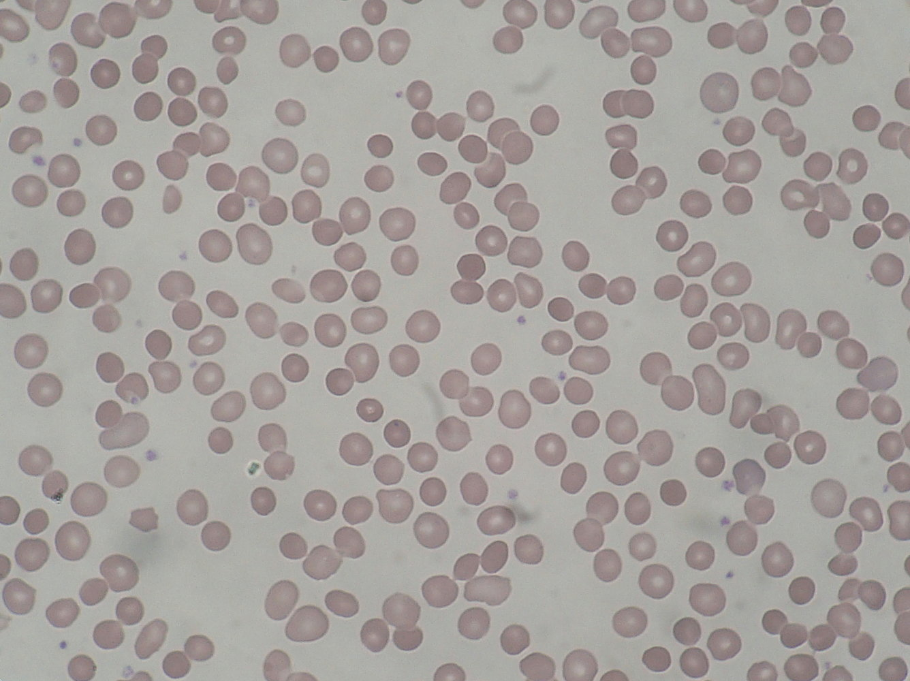

# Hereditary spherocytosis

*Categories: Clinical knowledge > Pediatrics > Pediatric hematology > Hereditary spherocytosis*

[Original Article Link](https://coursology-qbank.com/amboss/article/7T04H2)

---

## Summary

Hereditary spherocytosis (HS) is the most common congenital <u>hemolytic</u> disorder among individuals of northern European descent. In most cases, it is an <u>autosomal dominant</u> disease that is caused by <u>red blood cell</u> (<u>RBC</u>) <u>membrane protein</u> defects, which render the <u>RBCs</u> more vulnerable to osmotic <u>stress</u> and <u>hemolysis</u>. Clinical presentation ranges from mild HS, which is generally asymptomatic, to severe HS, which can already present in utero with <u>hydrops fetalis</u>. Moderate HS, which is the most common form, usually presents in <u>infancy</u> or childhood with the classic triad of <u>anemia</u>, <u>jaundice</u>, and <u>splenomegaly</u>. Diagnosis is established based on <u>family history</u>, typical laboratory findings (e.g., elevated <u>mean corpuscular hemoglobin concentration</u> and <u>RBC distribution width</u>), and tests (e.g., eosin-5-maleimide binding test, <u>osmotic fragility test</u>). Treatment depends on the severity of the disease and involves acute measures (e.g., <u>red blood cell</u> <u>transfusions</u>, <u>phototherapy</u>), medication (e.g., <u>folate supplementation</u>), and <u>splenectomy</u>. HS patients are also at risk for complications such as <u>hemolytic</u> and aplastic crises, <u>megaloblastic anemia</u>, and <u>gallstone</u> formation.

---

## Etiology

* Congenital <u>RBC</u> <u>membrane protein</u> defect

* <u>Inheritance pattern</u>

* <u>Autosomal dominant</u> (∼ 75% of cases)

* <u>Autosomal recessive</u> (∼ 25% of cases)

* <u>Family history</u> often positive for relatives who required <u>splenectomy</u> and/or developed <u>cholelithiasis</u> at a young age

* Frequently affected <u>proteins</u>

* <u>Spectrin</u>

* <u>Ankyrin</u>

* <u>Band 3</u>

* Protein 4.2

---

## Pathophysiology

Genetic mutation → defects in <u>RBC</u> <u>membrane proteins</u> (especially <u>spectrin</u> and/or <u>ankyrin</u>) responsible for tying the inner membrane skeleton with the outer <u>lipid bilayer</u> → continuous loss of <u>lipid bilayer</u> components → decreased surface area of <u>RBCs</u> in relation to volume → sphere-shaped <u>RBCs</u> with decreased membrane stability → inability to change form while going through narrowed vessels →

* Entrapment within splenic vasculature → <u>splenomegaly</u>

* Destruction via splenic <u>macrophages</u> → <u>extravascular hemolysis</u>

---

## Diagnosis

* Laboratory findings

* <u>Normocytic</u> <u>anemia</u>: mean cell volume (<u>MCV</u>) within normal range (80–100 μm³) or slightly decreased

* Increased <u>mean corpuscular hemoglobin concentration</u> (<u>MCHC</u>)  [[4]](https://coursology-qbank.com/amboss/article/3-cSCU0)

* ↑ <u>Red blood cell distribution width</u> (↑ <u>RDW</u>)

* ↑ <u>Reticulocytes</u> (normal range: 0.5–1.5 % of total <u>RBC count</u>)

* Findings of <u>hemolytic anemia</u>

* ↑ <u>Unconjugated bilirubin</u>

* ↓ <u>Haptoglobin</u>

* ↑ <u>LDH</u>

* Laboratory tests

* Eosin-5-maleimide binding test (<u>EMA binding test</u>)

* Test of choice, as results are readily available (within two hours)

* Decreased binding between dye (eosin-5-maleimide) and <u>RBC</u> <u>membrane proteins</u>

* Binding is quantified using <u>flow cytometry</u>, which shows decreased mean fluorescence

* Other tests may be performed in addition to the <u>EMA binding test</u>.

* Negative <u>Coombs test</u>: to exclude <u>autoimmune hemolytic anemia</u> (positive <u>Coombs test</u>), since spherocytosis is seen in both

* Positive osmotic fragility test 

* Measures the ability of <u>RBCs</u> to resist <u>hemolysis</u> when exposed to different degrees of salt dilution (e.g., <u>RBCs</u> swell and eventually lyse when incubated in hypotonic saline due to water influx)

* Whether or not <u>RBCs</u> lyse depends on their surface area to volume <u>ratio</u>. This <u>ratio</u> is decreased in patients with HS, so their <u>RBCs</u> are more fragile and more vulnerable to osmotic <u>stress</u>.

* Acidified glycerol lysis test

* <u>Red blood cells</u> are incubated in a hypotonic solution, to which glycerol is added.

* The test is positive if the patient's <u>spherocytes</u> lyse more quickly than normal <u>RBCs</u>.

* Has a greater <u>sensitivity</u> than the classic <u>osmotic fragility test</u>.

* <u>Blood smear</u>

* Characteristic <u>spherocytes</u> (small round cells without central <u>pallor</u>)

* Potentially <u>anisocytosis</u>

* <u>Ultrasound</u>: to evaluate <u>gallbladder</u> complications (see <u>cholelithiasis</u>, <u>cholecystitis</u>, and <u>cholangitis</u>)

Spherocytosis

Hereditary spherocytosis

References:[[5]](https://coursology-qbank.com/amboss/article/pnaL8O)

---

## Treatment

* Non-surgical treatments

* <u>Phototherapy</u> and/or exchange <u>transfusions</u> may be necessary in <u>neonates</u> (e.g., to avoid <u>kernicterus</u>).

* <u>Blood transfusions</u> may be required in cases of aplastic or <u>hemolytic crisis</u> (see “Complications” below).

* <u>Folate supplementation</u> to maintain <u>erythropoiesis</u>

* <u>Splenectomy</u>

* Sole definitive treatment

* Prior to the procedure, vaccinate against <u>Streptococcus pneumoniae</u>, <u>Haemophilus influenzae</u> type B, and <u>Neisseria meningitidis</u> (see <u>asplenia</u>).

---

## Complications

* <u>Hemolytic crisis</u>: esp. as a result of viral infection

* <u>Aplastic crisis</u>: following infection with <u>parvovirus B19</u> (<u>erythema infectiosum</u>); characterized by a low <u>reticulocyte count</u> (< 0.1% of total <u>RBC count</u>)

* <u>Megaloblastic anemia</u>: <u>folate</u> and <u>vitamin B12 deficiency</u> may develop due to chronic <u>hemolysis</u> and high <u>RBC</u> turnover

* Megaloblastic crisis: due to <u>folate deficiency</u> (although uncommon in developed countries, it might still be seen among pregnant women)

* Other

* Bilirubinate <u>gallstone</u> formation, possibly leading to <u>cholecystitis</u>, <u>cholangitis</u>, and <u>pancreatitis</u>

* Growth retardation and skeletal abnormalities due to <u>bone marrow</u> expansion

References:[[5]](https://coursology-qbank.com/amboss/article/pnaL8O)

We list the most important complications. The selection is not exhaustive.

---