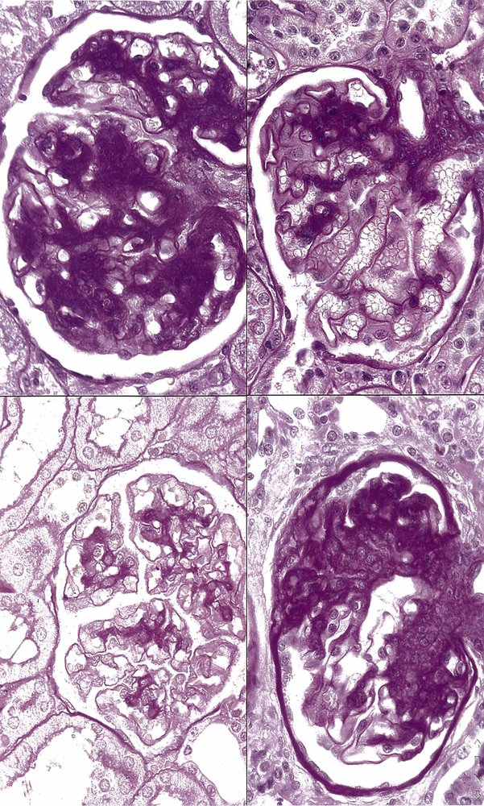

# IgA nephropathy

*Categories: Clinical knowledge > Pediatrics > Pediatric nephrology > IgA nephropathy*

[Original Article Link](https://coursology-qbank.com/amboss/article/CL0q-g)

---

## Summary

<u>IgA</u> nephropathy (IgAN), also known as Berger disease, is the most common primary <u>glomerulonephritis</u> worldwide. It most frequently affects male individuals in the second to third decades of life. Clinical manifestations are usually triggered by <u>upper respiratory tract</u> or <u>gastrointestinal infections</u> and include <u>gross hematuria</u> and flank <u>pain</u>; however, most individuals with IgAN are asymptomatic. Rarely, IgAN may manifest as <u>rapidly progressive glomerulonephritis</u> (<u>RPGN</u>). <u>Urinalysis</u> usually shows persistent <u>microhematuria</u> and <u>proteinuria</u>, while more severe IgAN may manifest with recurrent episodes of <u>nephritic syndrome</u>. <u>Kidney biopsy</u> is required for definitive diagnosis and is usually indicated in patients with severe or progressive <u>kidney</u> disease. Treatment consists of measures to slow the progression of the disease (e.g., <u>ACE inhibitors</u>); <u>immunosuppressive therapy</u> is reserved for more severe IgAN. Even with treatment, up to 40% of patients progress to <u>end-stage renal disease</u> (<u>ESRD</u>) within 20 years.

---

## Epidemiology

<u>IgA</u> nephropathy is the most common primary <u>glomerulonephritis</u> in adults. [[1]](https://coursology-qbank.com/amboss/article/wBXh100)

* Peak <u>incidence</u>: second to third decades of life [[2]](https://coursology-qbank.com/amboss/article/9BXN100)

* Sex: <u>♂</u> > <u>♀</u> (2:1) [[3]](https://coursology-qbank.com/amboss/article/joX_b_)

* Ethnicity: more common in the Asian population (worldwide) [[4]](https://coursology-qbank.com/amboss/article/xBXE100)

Epidemiological data refers to the US, unless otherwise specified.

---

## Pathophysiology

* The cause is still not entirely understood.

* Most likely mechanism: an increased number of defective, circulating <u>IgA antibodies</u> are synthesized (often triggered by <u>mucosal</u> infections, i.e., <u>upper respiratory tract</u> and <u>gastrointestinal infections</u>) → <u>IgA</u> <u>antibodies</u> form <u>immune complexes</u> that deposit in the renal mesangium → mesangial cell and <u>complement system</u> activation → <u>glomerulonephritis</u> (<u>type III hypersensitivity</u> reaction) [[5]](https://coursology-qbank.com/amboss/article/ylWdzl0)

---

## Clinical features

The course and presentation of IgAN are highly variable.

* Asymptomatic with <u>urinalysis</u> abnormalities, e.g., <u>microhematuria</u>, <u>proteinuria</u> (most common presentation) [[6]](https://coursology-qbank.com/amboss/article/3ddSpK0)[[7]](https://coursology-qbank.com/amboss/article/RedlAK0)

* Symptomatic episodes, usually during or immediately following a respiratory or <u>gastrointestinal infection</u> or following strenuous exercise [[6]](https://coursology-qbank.com/amboss/article/3ddSpK0)[[8]](https://coursology-qbank.com/amboss/article/eddxKK0)

* Gross or <u>microscopic hematuria</u>  [[6]](https://coursology-qbank.com/amboss/article/3ddSpK0)[[8]](https://coursology-qbank.com/amboss/article/eddxKK0)

* Flank <u>pain</u>

* Low-grade <u>fever</u>

* <u>Nephritic syndrome</u> (including <u>hypertension</u>)

* <u>RPGN</u> and/or <u>nephrotic syndrome</u> (∼ 5% of individuals with IgAN) [[6]](https://coursology-qbank.com/amboss/article/3ddSpK0)[[7]](https://coursology-qbank.com/amboss/article/RedlAK0)

* <u>ESRD</u> [[8]](https://coursology-qbank.com/amboss/article/eddxKK0)

> [!TIP]
> Manifestations of IgAN usually begin < 5 days after the onset of <u>URTI</u> or GI infection symptoms. [[6]](https://coursology-qbank.com/amboss/article/3ddSpK0)[[9]](https://coursology-qbank.com/amboss/article/3UdS160)

> [!NOTE]
> IgAN and <u>IgA vasculitis</u> are both <u>IgA</u>-mediated <u>vasculitides</u> triggered by a <u>mucosal</u> infection. <u>IgA vasculitis</u> most commonly occurs in children < 10 years of age and affects multiple organs (palpable <u>purpura</u>, abdominal <u>pain</u>, <u>arthralgia</u>). IgAN is limited to the <u>kidneys</u> and typically affects adults.

---

## Diagnosis

### General principles

* Suspect IgAN in patients with:

* Suggestive clinical features, e.g., <u>gross hematuria</u> during or following a <u>URTI</u> or <u>gastrointestinal infection</u>

* Incidental <u>hematuria</u> and <u>proteinuria</u>

* Declining <u>kidney function</u> (especially in patients < 40 years of age)

* Consult nephrology for all patients with suspected IgAN.

* A <u>renal biopsy</u> is needed for a definitive diagnosis of IgAN. [[6]](https://coursology-qbank.com/amboss/article/3ddSpK0)[[10]](https://coursology-qbank.com/amboss/article/Dyc1hU0)

* Additional <u>laboratory studies</u> (e.g., serum <u>IgA</u>, <u>C3 complement</u> level) can help exclude differential diagnoses and secondary causes.

> [!TIP]
> IgAN is the most common cause of <u>kidney failure</u> in individuals < 40 years of age. [[6]](https://coursology-qbank.com/amboss/article/3ddSpK0)

### Urine studies [[6]](https://coursology-qbank.com/amboss/article/3ddSpK0)

* <u>Urinalysis</u>: <u>nephritic sediment</u>

* <u>Hematuria</u>: episodic gross or microscopic

* <u>Proteinuria</u>: usually accompanies <u>hematuria</u>  [[9]](https://coursology-qbank.com/amboss/article/3UdS160)[[11]](https://coursology-qbank.com/amboss/article/VddGKK0)

* <u>Red blood cell casts</u> may be present.

* <u>24-hour urine profile</u>: <u>proteinuria</u>

* Ranges from mild (< 1 g/24 h) to severe (> 3 g/24 h)  [[6]](https://coursology-qbank.com/amboss/article/3ddSpK0)[[7]](https://coursology-qbank.com/amboss/article/RedlAK0)

* More severe <u>proteinuria</u> is associated with an increased likelihood of IgAN progression. [[6]](https://coursology-qbank.com/amboss/article/3ddSpK0)

### <u>Renal biopsy</u> [[6]](https://coursology-qbank.com/amboss/article/3ddSpK0)[[9]](https://coursology-qbank.com/amboss/article/3UdS160)

* Indications

* The decision to perform a <u>renal biopsy</u> is often based on regional and institutional practices. [[6]](https://coursology-qbank.com/amboss/article/3ddSpK0)[[9]](https://coursology-qbank.com/amboss/article/3UdS160)[[12]](https://coursology-qbank.com/amboss/article/ndd7qK0)

* Usually warranted if there are signs of severe or progressive <u>kidney</u> disease, e.g.:

* ↑ Serum <u>creatinine</u>

* <u>Proteinuria</u> 500–1,000 mg/24 h

* <u>Secondary hypertension</u>

* Findings [[1]](https://coursology-qbank.com/amboss/article/wBXh100)[[6]](https://coursology-qbank.com/amboss/article/3ddSpK0)

* <u>Light microscopy</u>: mesangial <u>proliferation</u> and matrix expansion

* Immunofluorescent microscopy: mesangial <u>IgA</u> deposits with C3 and occasionally <u>IgM</u> and/or <u>IgG</u> [[6]](https://coursology-qbank.com/amboss/article/3ddSpK0)

* <u>Electron microscopy</u>: mesangial <u>immune complex</u> deposits

* Histological classification using the revised Oxford classification (MEST-C score) helps determine prognosis.  [[10]](https://coursology-qbank.com/amboss/article/Dyc1hU0)

> [!TIP]
> If findings would not impact management decisions, a <u>biopsy</u> may not be indicated in patients with nonsevere <u>kidney</u> disease.

> [!TIP]
> The renal manifestation of <u>IgA vasculitis</u> is histologically indistinguishable from IgAN. [[6]](https://coursology-qbank.com/amboss/article/3ddSpK0)[[7]](https://coursology-qbank.com/amboss/article/RedlAK0)

IgA nephropathy

### Additional <u>laboratory studies</u> [[6]](https://coursology-qbank.com/amboss/article/3ddSpK0)[[9]](https://coursology-qbank.com/amboss/article/3UdS160)

The following studies may support the diagnosis of IgAN but are not required in the diagnostic workup.

* <u>BMP</u>: <u>Creatinine</u> and <u>BUN</u> may be elevated.  [[6]](https://coursology-qbank.com/amboss/article/3ddSpK0)

* ↑ <u>IgA</u> in serum: in 50% of patients; not specific to IgAN   [[6]](https://coursology-qbank.com/amboss/article/3ddSpK0)

* C3 level: typically normal

* Consider further studies to assess for secondary causes of IgAN (e.g., IgAN associated with <u>chronic liver disease</u>, <u>IgA vasculitis</u>) if clinically suspected. [[6]](https://coursology-qbank.com/amboss/article/3ddSpK0)[[10]](https://coursology-qbank.com/amboss/article/Dyc1hU0)

---

## Differential diagnoses

* <u>Poststreptococcal glomerulonephritis</u>

* Associated with low <u>complement</u> levels

* Clinical features take longer to appear (typically 10–20 days) following an infection  [[9]](https://coursology-qbank.com/amboss/article/3UdS160)

* <u>IgA vasculitis</u> nephritis

* <u>Lupus nephritis</u>

* <u>Membranoproliferative glomerulonephritis</u>

The differential diagnoses listed here are not exhaustive.

---

## Treatment

### General principles

* Consult nephrology for all patients.

* Management consists mainly of supportive measures, i.e.:

* Management of <u>proteinuria</u> and <u>hypertension</u>

* <u>ASCVD risk</u> reduction

* Lifestyle modifications

* Use of <u>immunosuppressive therapy</u> for severe or progressive <u>kidney</u> disease is controversial.

* Long-term monitoring of blood pressure, urine protein, and <u>GFR</u> is required for all patients. [[10]](https://coursology-qbank.com/amboss/article/Dyc1hU0)

> [!TIP]
> Even with treatment, 20–40% of patients with IgAN develop <u>ESRD</u> within 20 years. [[8]](https://coursology-qbank.com/amboss/article/eddxKK0)[[10]](https://coursology-qbank.com/amboss/article/Dyc1hU0)

### Supportive measures [[6]](https://coursology-qbank.com/amboss/article/3ddSpK0)[[10]](https://coursology-qbank.com/amboss/article/Dyc1hU0)[[13]](https://coursology-qbank.com/amboss/article/8UdOU60)

Indicated for all patients to slow disease progression.

* <u>Management of hypertension</u> and <u>proteinuria</u> > 0.5 g/24 h [[10]](https://coursology-qbank.com/amboss/article/Dyc1hU0)

* First line: <u>ACE inhibitors</u> or <u>angiotensin II</u> <u>receptor</u> blockers at maximally tolerated doses  [[6]](https://coursology-qbank.com/amboss/article/3ddSpK0)[[10]](https://coursology-qbank.com/amboss/article/Dyc1hU0)

* <u>SGLT-2 inhibitors</u> may be added to <u>RAASi</u>.

* Dual <u>endothelin</u> <u>angiotensin receptor antagonists</u> (e.g., sparsentan) may be considered if other agents are not effective. [[6]](https://coursology-qbank.com/amboss/article/3ddSpK0)[[14]](https://coursology-qbank.com/amboss/article/tUdXU60)

* See “<u>Antihypertensive treatment by comorbidities</u>.”

* <u>ASCVD risk</u> reduction

* <u>Management of hyperlipidemia</u>

* <u>Management of ASCVD risk factors in chronic kidney disease</u>

* Lifestyle modifications

* <u>Obesity management</u>

* <u>Tobacco cessation</u>

* Exercise

* Dietary <u>sodium</u> restriction

### <u>Immunosuppressive therapy</u> [[6]](https://coursology-qbank.com/amboss/article/3ddSpK0)[[10]](https://coursology-qbank.com/amboss/article/Dyc1hU0)

A nephrology consultation is required before starting <u>immunosuppressive therapy</u>.

* <u>Glucocorticoids</u> may be considered for severe or progressive disease (i.e., <u>proteinuria</u> > 1 g/24 h despite supportive measures for ≥ 3 months).  [[10]](https://coursology-qbank.com/amboss/article/Dyc1hU0)[[15]](https://coursology-qbank.com/amboss/article/JR1sLg0) [[10]](https://coursology-qbank.com/amboss/article/Dyc1hU0)[[13]](https://coursology-qbank.com/amboss/article/8UdOU60)

* A short course (≤ 6 months) is recommended. [[10]](https://coursology-qbank.com/amboss/article/Dyc1hU0)

* Implement preventive measures for <u>adverse effects of glucocorticoids</u> (e.g., infections, <u>osteoporosis</u>).

* Consider <u>PCP prophylaxis</u>.

* <u>Cyclophosphamide</u>: for rapidly progressive IgAN, in addition to <u>glucocorticoids</u> [[10]](https://coursology-qbank.com/amboss/article/Dyc1hU0)

---

## Prognosis

* Symptoms resolve spontaneously in 5–30% of patients. [[6]](https://coursology-qbank.com/amboss/article/3ddSpK0)[[16]](https://coursology-qbank.com/amboss/article/kIYm1q)

* 20–40% of patients with IgAN develop <u>ESRD</u> within 20 years. [[8]](https://coursology-qbank.com/amboss/article/eddxKK0)[[10]](https://coursology-qbank.com/amboss/article/Dyc1hU0)

---