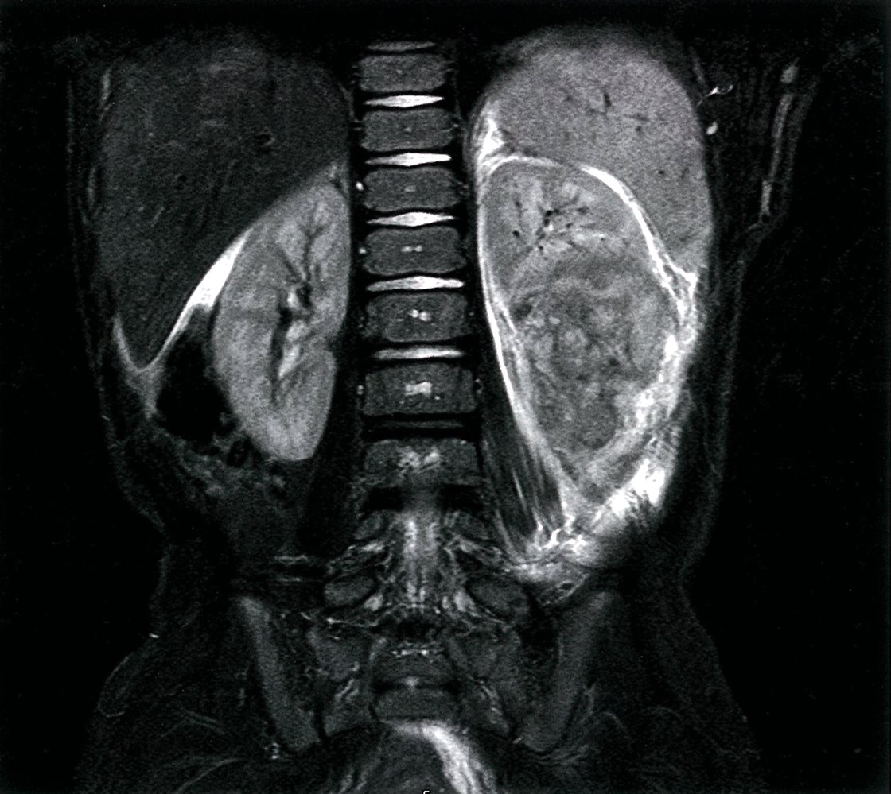
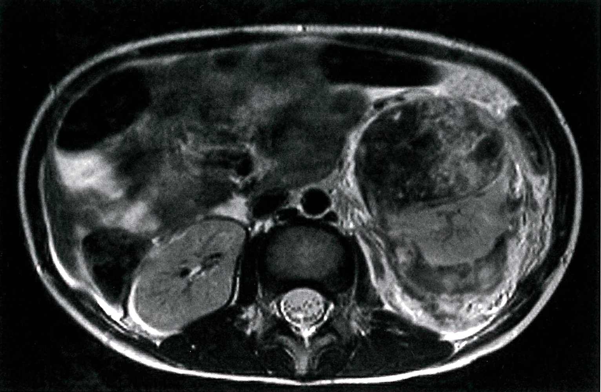
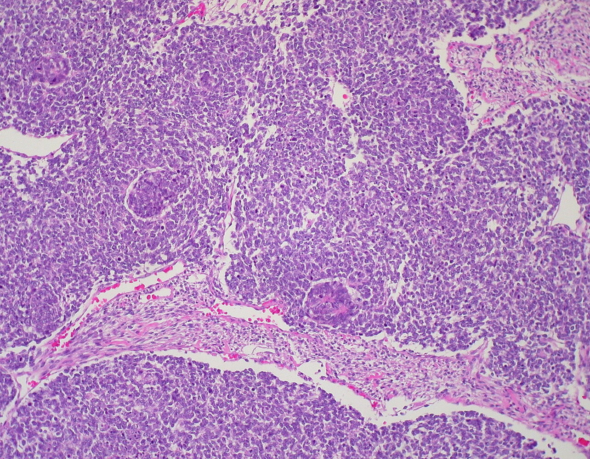

# Nephroblastoma

*Categories: Clinical knowledge > Pediatrics > Pediatric nephrology > Nephroblastoma*

[Original Article Link](https://coursology-qbank.com/amboss/article/zi0r8f)

---

## Summary

Nephroblastoma (Wilms <u>tumor</u>) is the most common <u>renal malignancy</u> in children, typically affecting children between 2 and 5 years of age. A minority of cases are associated with specific syndromes (e.g., <u>WAGR</u>, <u>Beckwith-Wiedemann</u>) and <u>gene mutations</u> (e.g., <u>WT1</u>). Nephroblastoma is typically an incidental finding that manifests as a large abdominal mass. Other signs and symptoms may occur, such as <u>hematuria</u> and abdominal <u>pain</u>, especially in tumors that are large, ruptured, or <u>metastasized</u>. Treatment consists of <u>tumor</u> resection and <u>chemotherapy</u> for all stages (except for very low-risk tumors), while radiation is predominantly used in advanced disease.

---

## Epidemiology

* Peak <u>incidence</u>: between 2 and 5 years

* Most common malignant <u>neoplasm</u> of the <u>kidney</u> in children

References: [[1]](https://coursology-qbank.com/amboss/article/RUXl1x)

Epidemiological data refers to the US, unless otherwise specified.

---

## Etiology

The exact etiology of nephroblastoma remains unknown, but it is associated with several genetic mutations and syndromes.

### Genetic predisposition [[2]](https://coursology-qbank.com/amboss/article/a0aQeQ)[[3]](https://coursology-qbank.com/amboss/article/00aeeQ)

* <u>Gene mutations</u> have been found in children both with and without genetic syndromes who have nephroblastoma (Wilms <u>tumor</u>).

* Associated with <u>loss of function mutations</u> of <u>tumor</u> supressor <u>genes</u> on <u>chromosome</u> 11

* The <u>WT1</u> (Wilms <u>tumor</u> 1) <u>gene</u> is the most important nephroblastoma <u>tumor</u> <u>gene</u> (mutated in ∼ 10–20% of cases).

* <u>WT2</u> (<u>Wilms tumor 2</u>) <u>gene</u>  [[4]](https://coursology-qbank.com/amboss/article/17b2kE)

### Associated syndromes  [[5]](https://coursology-qbank.com/amboss/article/3UXS1x)

* WAGR syndrome: Deletion of the 11p13 band leads to the deletion of the <u>WT1 gene</u> and other <u>genes</u>, such as PAX6. [[6]](https://coursology-qbank.com/amboss/article/dQYoEK) 

* Nephroblastoma

* <u>Aniridia</u>

* Genitourinary anomalies

* <u>Pseudohermaphroditism</u>, <u>undescended testes</u> in males (due to <u>gonadal dysgenesis</u>)

* Early-onset <u>nephrotic syndrome</u>

* Range of <u>intellectual disability</u>

* Denys-Drash syndrome: <u>point mutation</u> in <u>WT1 gene</u>, which encodes a <u>zinc finger transcription factor</u> [[7]](https://coursology-qbank.com/amboss/article/WQYPEK)

* Nephroblastoma

* <u>Pseudohermaphroditism</u>, <u>undescended testes</u> in males (due to <u>gonadal dysgenesis</u>)

* Early-onset <u>nephrotic syndrome</u> caused by diffuse mesangial <u>sclerosis</u>

* <u>Beckwith-Wiedemann syndrome</u>: mutations of the <u>WT2</u> <u>gene</u>

> [!NOTE]
> <u>WAGR</u> syndrome consists of Wilms <u>tumor</u>, Aniridia, Genitourinary anomalies, and Range of <u>intellectual disability</u>.

> [!TIP]
> Denys-Drash syndrome is a mild form of <u>WAGR</u> without <u>aniridia</u> or <u>intellectual disability</u>.

---

## Clinical features

### Abdominal symptoms

* Palpable abdominal mass (often found incidentally)

* Non-tender

* Unilateral and large but not crossing midline

* Smooth and firm

* Abdominal <u>pain</u> (∼ 40% of cases)

### Other signs and symptoms

* <u>Hematuria</u> (∼ 25% of cases)

* <u>Hypertension</u> (∼ 25% of cases)

* In cases of subcapsular hemorrhage:

* <u>Anemia</u>

* Possibly <u>fever</u>

* Symptoms caused by <u>metastatic</u> spread (e.g., pulmonary symptoms)

> [!TIP]
> Nephroblastoma should be suspected in a <u>toddler</u> with a non-tender abdominal mass, especially if it is firm, smooth, and associated with <u>hematuria</u> and/or <u>hypertension</u>.

> [!WARNING]
> Careless palpation of a nephroblastoma can result in rupture of the <u>renal capsule</u> and <u>tumor</u> spillage!

---

## Diagnosis

* <u>Urinalysis</u>: <u>hematuria</u> may be present

* Imaging

* <u>Ultrasound</u> (best initial test)

* Hypervascular <u>tumor</u>

* Mostly uniform <u>echogenicity</u> with <u>hypoechoic</u> areas of <u>necrosis</u>

* Abdominal CT/<u>MRI</u>  

* To assess extent of involvement

* Surgical planning

* CT thorax/<u>CXR</u>

* To detect <u>metastases</u>

* Staging

> [!TIP]
> <u>Biopsy</u> is usually reserved for assessing <u>nodules</u> that are suspected <u>metastases</u>, as <u>tumor</u> capsule rupture and spillage results in more advanced staging and intensive treatment.

Nephroblastoma

Nephroblastoma

---

## Pathology

### Overview

* Nephroblastoma consists of embryonic <u>glomerular</u> structures.

* May include cysts, hemorrhage, or <u>necrosis</u>

* Typically has a <u>pseudocapsule</u>

### <u>Histology</u>

* Classic type: consists of three cell types 

* <u>Epithelial</u> cells (i.e., <u>glomeruli</u> and tubules)

* Stromal cells

* Undifferentiated blastemal cells of metanephric origin

* <u>Anaplastic</u> type 

* Contains multipolar polypoid <u>mitotic figures</u>

* Marked hyperchromasia of <u>nuclei</u>

Wilms tumor (Nephroblastoma)

---

## Treatment

|  Treatment of nephroblastoma according to stage  |  |  |  |  |
| --- | --- | --- | --- | --- |
| Treatment |  | Stages I and II | Stages III and IV | Stage V (bilateral) |
| <u>Surgery</u> |  Renal <u>parenchymal</u>-sparing resection  |  * No   |  |  * Yes   |
| <u>Nephrectomy</u> |  * Yes   |  |  * No   |  |
| <u>Chemotherapy</u> |  Preoperative <u>chemotherapy</u>  |  * No   |  |  * Yes   |
| <u>Doxorubicin</u> |  * No   |  * Yes   |  |  |
| <u>Dactinomycin</u> and <u>vincristine</u> |  * Yes   |  |  |  |
| Radiation |  |  * No   |  * Possible   |  * Yes   |

---

## Prognosis

* Good prognosis: survival rates are > 90% [[10]](https://coursology-qbank.com/amboss/article/hUXc1x)

* The majority of <u>tumor</u> recurrences happen within two years of treatment.

---