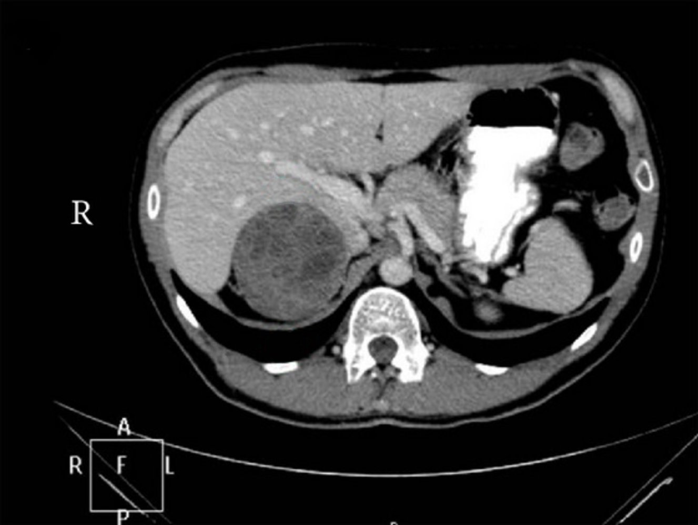
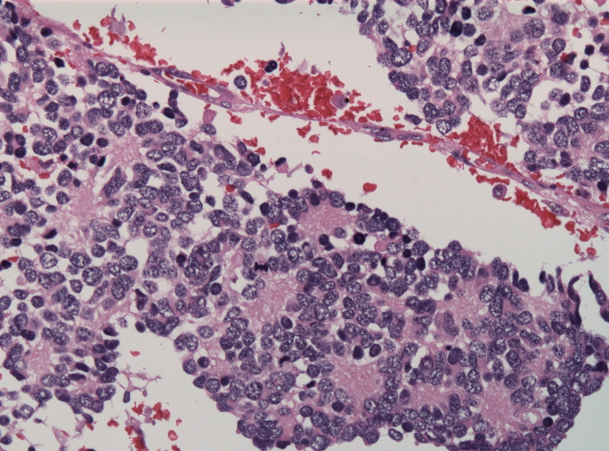

# Neuroblastoma

*Categories: Clinical knowledge > Pediatrics > Pediatric oncology > Neuroblastoma*

[Original Article Link](https://coursology-qbank.com/amboss/article/940NlT)

---

## Summary

Neuroblastoma is a malignant <u>neuroendocrine tumor</u> of the <u>sympathetic nervous system</u> that originates from <u>neural crest cells</u>. It is the most common extracranial solid <u>malignancy</u> in children and the most common <u>malignancy</u> found in <u>infants</u>. Given its origin, neuroblastoma can occur in any aggregation of <u>sympathetic</u> nervous tissue, including the <u>adrenal glands</u>, the <u>sympathetic chain</u>, and the paraganglia (e.g., the carotid body). The clinical presentation is mainly determined by the site of the primary <u>tumor</u>, if it secretes <u>catecholamines</u>, and whether it has <u>metastasized</u>. In most cases, neuroblastomas stem from the <u>adrenal glands</u> within the <u>abdominal cavity</u> and present as a palpable abdominal mass that can cross the midline. Urine tests for <u>catecholamine</u> metabolites <u>homovanillic acid</u> (<u>HVA</u>) and <u>vanillylmandelic acid</u> (<u>VMA</u>) play an important role in diagnosis. Treatment is determined mainly by patient age at the time of diagnosis, clinical stage, and possible amplification of the <u>MYCN</u> <u>oncogene</u>. The prognosis depends on disease progression and is very good in early stages. Spontaneous remission may occur even in cases of <u>metastatic</u> disease.

---

## Definitions

Neuroblastoma is a malignant, embryonal <u>neuroendocrine neoplasm</u> of the <u>sympathetic nervous system</u> that originates from <u>neural crest cells</u>; , potentially secretes <u>catecholamines</u>; , and is usually found in the <u>adrenal glands</u> or <u>sympathetic ganglia</u>.
References:[[1]](https://coursology-qbank.com/amboss/article/VcYGYL)

---

## Epidemiology

* Most common <u>malignancy</u> of the <u>adrenal medulla</u> in <u>infants</u> and third most common childhood cancer overall following <u>leukemia</u> and <u>brain tumors</u>

* Mean age at diagnosis: 1–2 years

* The majority of children have progressed to advanced-stage disease by the time of diagnosis.

References:[[2]](https://coursology-qbank.com/amboss/article/5bai8Q)[[3]](https://coursology-qbank.com/amboss/article/MbaM8Q)[[4]](https://coursology-qbank.com/amboss/article/nba78Q)[[5]](https://coursology-qbank.com/amboss/article/7ba4EQ)

Epidemiological data refers to the US, unless otherwise specified.

---

## Etiology

* Cause: unclear

* Genetic associations: <u>chromosomal abnormalities</u>, especially deletions (found in ∼ 50% of neuroblastomas)

* Deletions of 1p; , 11q, and 14q <u>chromosomal</u> regions  [[3]](https://coursology-qbank.com/amboss/article/MbaM8Q)

* Amplification and overexpression of <u>oncogene</u> <u>MYCN</u> (<u>N-myc</u>)  [[6]](https://coursology-qbank.com/amboss/article/CbXqD9)

* <u>Risk factors</u>

* Maternal: <u>gestational diabetes</u>, <u>opiates</u>, <u>folate deficiency</u>

* Congenital syndromes: <u>Turner syndrome</u>, <u>neurofibromatosis</u>, <u>Hirschsprung's disease</u>, <u>Beckwith-Wiedemann</u> syndrome

* Familial

References:[[3]](https://coursology-qbank.com/amboss/article/MbaM8Q)

---

## Clinical features

### General symptoms

* <u>Failure to thrive</u> or weight loss

* <u>Fever</u>

* <u>Nausea</u>, <u>vomiting</u>, loss of appetite

* <u>Hypertension</u>

### <u>Localized symptoms</u>

| Location of primary tumors | Associated signs and symptoms |
| --- | --- |
|  Abdomen (in > 60% of cases)   |   * Palpable, firm, irregular abdominal mass that may cross the midline (in contrast to <u>nephroblastoma</u>, which is smooth and usually does not cross the midline)  * Abdominal distension and <u>pain</u>  * <u>Hepatomegaly</u>  * <u>Constipation</u>    |
|  Chest (in ∼ 20% of cases): particularly <u>paravertebral ganglia</u>   |   * <u>Spinal cord compression</u> → <u>back pain</u>, <u>weakness</u>, numbness, <u>ataxia</u>, loss of bowel or <u>bladder</u> control  * <u>Scoliosis</u>  * <u>Dyspnea</u>, <u>cough</u>  * <u>Inspiratory stridor</u>    |
| Neck |   * <u>Horner syndrome</u>  * Symptoms due to <u>spinal cord compressions</u>    |
| Location of <u>metastases</u> | Associated signs and symptoms |
| <u>Orbit</u> of the <u>eye</u> |   * <u>Periorbital ecchymoses</u> (“<u>raccoon eyes</u>”)  * <u>Proptosis</u>    |
| Bones |   * Bone <u>pain</u>  * <u>Anemia</u> (<u>bone marrow suppression</u>)    |
| <u>Skin</u> |  * Subcutaneous <u>nodules</u>   |

### <u>Paraneoplastic syndromes</u>

* <u>Chronic diarrhea</u> → <u>electrolyte</u> imbalances

* <u>Opsoclonus-myoclonus-ataxia</u>; : a <u>paraneoplastic syndrome</u> of unclear etiology characterized by rapid and  multi-directional <u>eye movements</u>, rhythmic jerks of the limbs, and <u>ataxia</u> (dancing eyes dancing feet syndrome)

* Possibly <u>hypertension</u>, <u>tachycardia</u>, <u>palpitations</u>, sweating, flushing;   (<u>hypertension</u> is more commonly seen in <u>pheochromocytoma</u>)

References:[[7]](https://coursology-qbank.com/amboss/article/qt0Ce3)[[8]](https://coursology-qbank.com/amboss/article/Lbaw8Q)[[9]](https://coursology-qbank.com/amboss/article/KbaUuQ)[[10]](https://coursology-qbank.com/amboss/article/6bajuQ)[[11]](https://coursology-qbank.com/amboss/article/pbaLuQ)[[12]](https://coursology-qbank.com/amboss/article/ecYxYL)

---

## Diagnosis

### Laboratory tests

* Urine

* ↑ <u>Catecholamine</u> metabolites homovanillic acid (<u>HVA</u>) and <u>vanillylmandelic acid</u> (<u>VMA</u>) in 24-hour urine

* <u>Urinalysis</u>

* Blood

* ↑ <u>Catecholamine</u> metabolites (<u>HVA</u>/<u>VMA</u>)

* ↑ <u>Lactate</u> <u>dehydrogenase</u> (<u>LDH</u>), <u>ferritin</u>, <u>neuron</u>-specific <u>enolase</u> (<u>NSE</u>)

* <u>CBC with differential</u>

* Serum chemistry profile

* <u>Liver</u> and <u>kidney function tests</u>

### Other procedures

* Imaging: to identify the primary site

* Abdominal <u>ultrasound</u>

* CT or <u>MRI</u> (depending on the presumable site of the lesion)

* <u>Scintigraphy</u>

* MIBG scan: Uptake scan of metaiodobenzylguanidine (MIBG) combined with a <u>radioactive iodine</u> tracer.

* In MIBG non-avid tumors: <u>technetium bone scan</u> and plain radiographs

* <u>Biopsy</u>

* Image-guided needle <u>aspiration</u> of the <u>tumor</u> or <u>biopsy</u> at the time of surgical <u>tumor</u> resection

* Evaluation for <u>MYCN gene</u> amplification

* Evaluation for <u>DNA</u> <u>ploidy</u>

* Bilateral <u>bone marrow biopsy</u> of iliac crests

Neuroblastoma of the adrenal gland

References:[[7]](https://coursology-qbank.com/amboss/article/qt0Ce3)

---

## Pathology

* Homer Wright rosettes: Halo-like <u>clusters</u> of neuroblast cells surrounding a central pale area containing <u>neuropil</u> (associated with tumors of neuronal origin such as neuroblastoma, <u>medulloblastoma</u>, primitive <u>neuroectodermal</u> tumors, and pineoblastoma)

* Small round blue cells with <u>hyperchromatic</u> <u>nuclei</u>

* Bombesin and <u>NSE</u> positive

Homer Wright rosettes

References:[[3]](https://coursology-qbank.com/amboss/article/MbaM8Q)[[14]](https://coursology-qbank.com/amboss/article/IbaYEQ)[[15]](https://coursology-qbank.com/amboss/article/rbafEQ)

---

## Differential diagnoses

* <u>Differential diagnosis of nephroblastoma</u>

* <u>Pheochromocytoma</u>

* <u>Lymphoma</u>

* <u>Sarcomas</u>

* <u>Osteomyelitis</u> or <u>transient synovitis</u>

The differential diagnoses listed here are not exhaustive.

---

## Treatment

Neuroblastoma patients are treated based on their risk category (low, intermediate, or high), which is based on the stage of their neuroblastoma (extent of disease), age at diagnosis, and the presence/absence of <u>MYCN</u> amplification.

* Low risk: generally children with early-stage disease (Stages 1–2) and no <u>MYCN</u> amplification

* Intermediate risk: generally children with intermediate and late-stage disease (Stages 3–4) and no <u>MYCN</u> amplification

* High risk: generally children with late-stage disease and/or <u>MYCN</u> amplification

* Stage 4S (an exception): disseminated disease in <u>infants</u> (< 12 months)

* Better prognosis than other stage 4 neuroblastoma and spontaneous regression is very common

* Children with Stage 4S belong to the low-risk or intermediate-risk groups unless they have a <u>MYCN</u> amplification, in which case they are high-risk patients

| Treatment of neuroblastoma |  |  |  |
| --- | --- | --- | --- |
| Treatment | Low-risk neuroblastoma | Intermediate-risk neuroblastoma | High-risk neuroblastoma |
| Observation only | X   |  |  |
|  Preoperative <u>chemotherapy</u> (e.g., <u>doxorubicin</u>, <u>cyclophosphamide</u>, <u>etoposide</u>, and a <u>platinum</u> drug) | X   | X | X |
| <u>Surgery</u> | X | X | X |
| Postoperative <u>chemotherapy</u> |  | X | X   |
| Radiation |  | X   | X |
|  GD2  <u>antibody</u>, dinutuximab, <u>granulocyte</u> <u>macrophage</u> colony-stimulating factor (<u>GM-CSF</u>), <u>interleukin 2</u> (<u>IL-2</u>), and cis-retinoic acid |  |  | X |
|  Other postoperative therapies (e.g., MIBG therapy) |  |  | X |

> [!WARNING]
> <u>Spinal cord compression</u> requires immediate surgical decompression or <u>chemotherapy</u> to shrink <u>tumor</u> tissue!

References:[[16]](https://coursology-qbank.com/amboss/article/ot00e3)[[17]](https://coursology-qbank.com/amboss/article/Kt0Ue3)[[18]](https://coursology-qbank.com/amboss/article/6t0je3)[[19]](https://coursology-qbank.com/amboss/article/pt0Le3)[[20]](https://coursology-qbank.com/amboss/article/Jt0se3)

---