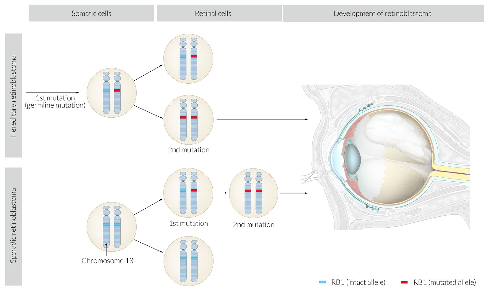
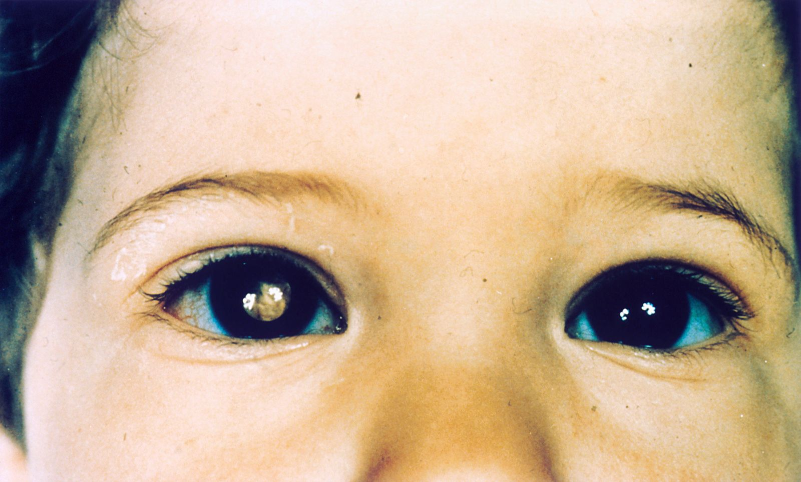

# Retinoblastoma

*Categories: Clinical knowledge > Pediatrics > Pediatric oncology > Retinoblastoma*

[Original Article Link](https://coursology-qbank.com/amboss/article/C40qlT)

---

## Summary

Retinoblastoma is the most common primary intraocular <u>malignancy</u> in children and is caused by inherited or spontaneous mutations in the <u>retinoblastoma gene</u> (<u>RB1 gene</u>). The characteristic clinical presentation is <u>leukocoria</u> with or without <u>strabismus</u> in children < 5 years of age. Diagnostic evaluation is performed by a specialist and includes dilated <u>fundoscopic examination</u>, imaging, and <u>genetic testing</u>. Management is determined by <u>tumor stage</u> and includes focal treatments (e.g., <u>cryotherapy</u>, <u>brachytherapy</u>, laser), <u>enucleation of the eye</u>, <u>chemotherapy</u>, and/or radiation. Prognosis is favorable with early diagnosis and treatment. Routine screening with <u>red reflex examination</u> is recommended for all children as part of <u>pediatric vision screening</u>. Individuals with a <u>first-degree relative</u> or <u>second-degree relative</u> with retinoblastoma should be referred to an ophthalmologist with pediatric training for appropriate screening (e.g., <u>genetic counseling</u>, <u>genetic testing</u>, frequent dilated <u>fundoscopic examination</u>).

---

## Epidemiology

* Most common primary intraocular <u>malignancy</u> among children [[1]](https://coursology-qbank.com/amboss/article/YQVnu80)

* <u>Incidence</u>: more common in young children

* Individuals < 20 years of age: 3/1,000,000 [[2]](https://coursology-qbank.com/amboss/article/VmVGeE0)

* Children ≤ 4 years of age: ∼18/1,000,000 [[3]](https://coursology-qbank.com/amboss/article/AQVRA80)

Epidemiological data refers to the US, unless otherwise specified.

---

## Pathophysiology

The retinoblastoma gene (<u>RB1 gene</u>) is a <u>tumor suppressor gene</u> found on <u>chromosome</u> 13.

* Sporadic retinoblastomas (∼ 70%): due to spontaneous mutation [[3]](https://coursology-qbank.com/amboss/article/AQVRA80)

* Two spontaneous mutations must occur in the same retinal cell, affecting both Rb <u>alleles</u>.

* Sporadic retinoblastomas tend to be unilateral.

* Heritable retinoblastomas (∼ 30%): <u>autosomal dominant inheritance</u> [[3]](https://coursology-qbank.com/amboss/article/AQVRA80)[[4]](https://coursology-qbank.com/amboss/article/PmVWfE0)

* <u>Two-hit hypothesis</u>

* A <u>germline mutation</u> occurs in one of the <u>alleles</u> of the <u>RB1 gene</u>, which renders this <u>allele</u> nonfunctional in all cells of the affected individual.

* The presence of the second functional <u>allele</u> prevents the development of a retinoblastoma.

* However, a spontaneous <u>somatic mutation</u> in the second <u>allele</u> in any retinal cell results in a nonfunctioning <u>RB1 gene</u> and the development of a retinoblastoma.

* Inherited retinoblastomas tend to be bilateral.

* A child whose biological parent had a <u>heritable retinoblastoma</u> has a 50% chance of acquiring the mutated RB <u>allele</u>. [[5]](https://coursology-qbank.com/amboss/article/a4XQ3y)

> [!NOTE]
> Individuals with inherited <u>RB1 gene</u> mutations also have a significantly higher risk of developing <u>osteosarcomas</u> and <u>pinealomas</u>.

Pathophysiology of retinoblastoma

---

## Clinical features

* Age of onset 

* Usually affects children < 5 years of age (majority before 2 years of age) [[6]](https://coursology-qbank.com/amboss/article/zQVrA80)

* Approx. one-third of patients have bilateral retinoblastoma, which usually manifests by 12 months of age. [[3]](https://coursology-qbank.com/amboss/article/AQVRA80)[[7]](https://coursology-qbank.com/amboss/article/emVxeE0)

* Initial features [[3]](https://coursology-qbank.com/amboss/article/AQVRA80)[[4]](https://coursology-qbank.com/amboss/article/PmVWfE0)

* <u>Leukocoria</u> (“<u>white pupil</u>”)

* <u>Strabismus</u>

* Features of advanced disease [[3]](https://coursology-qbank.com/amboss/article/AQVRA80)[[4]](https://coursology-qbank.com/amboss/article/PmVWfE0)

* Signs of advanced intraocular involvement

* <u>Eye pain</u> and/or redness

* Sudden or progressive <u>vision loss</u> ; (e.g., from <u>retinal detachment</u>, <u>tumor</u> growth)

* <u>Nystagmus</u> [[8]](https://coursology-qbank.com/amboss/article/ijVJZu0)

* Signs of orbital involvement (e.g., <u>proptosis</u>)

* Signs of <u>metastasis</u>

* Regional <u>lymphadenopathy</u> (e.g., preauricular, submandibular, and cervical <u>lymph nodes</u>)

* Signs of distant <u>metastases</u> (e.g., <u>headache</u>, <u>focal neurological deficits</u>, bone <u>pain</u>)

> [!TIP]
> <u>Leukocoria</u> is highly concerning for retinoblastoma; refer for an urgent examination by an ophthalmologist. [[9]](https://coursology-qbank.com/amboss/article/5E1iwi0)

> [!TIP]
> <u>Strabismus</u> may be normal in early <u>infancy</u>. Refer to ophthalmology if isolated <u>strabismus</u> is present at ≥ 4 months of age. [[9]](https://coursology-qbank.com/amboss/article/5E1iwi0)

Leukocoria

---

## Diagnosis

### General principles [[3]](https://coursology-qbank.com/amboss/article/AQVRA80)[[4]](https://coursology-qbank.com/amboss/article/PmVWfE0)[[6]](https://coursology-qbank.com/amboss/article/zQVrA80)

* Refer all young children with <u>leukocoria</u> urgently to an ophthalmologist with pediatric training for further assessment.

* Initial assessment includes dilated <u>fundoscopic examination</u> with or without ocular <u>ultrasound</u>.

* All patients then require:

* <u>MRI</u>

* <u>Genetic testing</u>

* Patients with evidence of extraocular involvement: workup for <u>metastatic</u> disease

> [!WARNING]
> <u>Biopsy</u> of retinoblastomas is not recommended due to the risk of <u>tumor</u> seeding. [[3]](https://coursology-qbank.com/amboss/article/AQVRA80)[[4]](https://coursology-qbank.com/amboss/article/PmVWfE0)[[10]](https://coursology-qbank.com/amboss/article/_QV5A80)

### Initial assessment

#### Dilated <u>fundoscopic examination</u> [[3]](https://coursology-qbank.com/amboss/article/AQVRA80)[[9]](https://coursology-qbank.com/amboss/article/5E1iwi0)[[11]](https://coursology-qbank.com/amboss/article/MjVMau0)

* Performed by a specialist (e.g., ophthalmologist with pediatric training), usually under <u>general anesthesia</u>

* Findings [[6]](https://coursology-qbank.com/amboss/article/zQVrA80)[[11]](https://coursology-qbank.com/amboss/article/MjVMau0)

* White or yellow retinal mass

* Other findings adjacent to the <u>tumor</u> may include:

* Subretinal fluid

* Subretinal seeding

* <u>Retinal detachment</u>

#### Ocular <u>ultrasound</u>

* Indications include: [[12]](https://coursology-qbank.com/amboss/article/fmVkUE0)

* Diagnostic uncertainty

* Obstructed retinal views because of <u>retinal detachment</u>, intraocular hemorrhage, or <u>cataract</u>

* B scan findings include <u>hyperechoic</u> mass with intratumor calcifications.  [[11]](https://coursology-qbank.com/amboss/article/MjVMau0)

### Further imaging [[10]](https://coursology-qbank.com/amboss/article/_QV5A80)[[11]](https://coursology-qbank.com/amboss/article/MjVMau0)[[12]](https://coursology-qbank.com/amboss/article/fmVkUE0)

* High-resolution contrast-enhanced <u>MRI</u> (<u>orbits</u> and <u>brain</u>) is used to:

* Confirm <u>clinical diagnosis</u> and <u>ultrasound</u> findings

* Assess for <u>tumor</u> characteristics and spread, e.g.: 

* Invasive disease (<u>optic nerve</u>, extraorbital, and/or intracranial invasion)

* Trilateral retinoblastoma: bilateral retinoblastoma and a primary midline intracranial lesion  [[10]](https://coursology-qbank.com/amboss/article/_QV5A80)[[13]](https://coursology-qbank.com/amboss/article/kmVmfE0)

* Other imaging modalities include: [[11]](https://coursology-qbank.com/amboss/article/MjVMau0)

* <u>Optical coherence tomography</u>: used to assess for small tumors, monitor treatment response, and assess recurrence

* <u>Fluorescein angiography</u>: assesses for posttreatment changes

> [!WARNING]
> CT is not recommended in the evaluation of patients with retinoblastoma because exposure to <u>ionizing radiation</u> may increase the risk of secondary malignancies. [[10]](https://coursology-qbank.com/amboss/article/_QV5A80)

### <u>Genetic testing</u> of <u>RB1 gene</u> [[3]](https://coursology-qbank.com/amboss/article/AQVRA80)[[10]](https://coursology-qbank.com/amboss/article/_QV5A80)

* All patients: blood testing for a <u>germline mutation</u>

* If <u>enucleation of the eye</u> has been performed: testing of <u>tumor</u> tissue for <u>somatic mutations</u>

### <u>Metastatic</u> evaluation [[3]](https://coursology-qbank.com/amboss/article/AQVRA80)

* Indications: patients with features of extraocular involvement on clinical evaluation or imaging

* Options: <u>bone scintigraphy</u>, <u>lumbar puncture</u>, <u>bone marrow aspiration</u>

---

## Differential diagnoses

* See “<u>Differential diagnosis of leukocoria</u>.”

* See “<u>Ocular motility disorders and strabismus</u>.”

The differential diagnoses listed here are not exhaustive.

---

## Management

### Initial management [[3]](https://coursology-qbank.com/amboss/article/AQVRA80)[[4]](https://coursology-qbank.com/amboss/article/PmVWfE0)[[14]](https://coursology-qbank.com/amboss/article/hmVc2E0)

Treatment is individualized and developed by a multidisciplinary team; it may include one or more of the following:

* Focal therapy 

* Indicated for focal lesions when the <u>eye</u> may be salvageable, e.g.: 

* Low-risk lesions confined to the <u>eye</u>

* Residual tumors (e.g., after <u>chemotherapy</u>)

* Options are <u>cryotherapy</u>, <u>brachytherapy</u>, and laser (e.g., <u>thermotherapy</u>, <u>photocoagulation</u>).

* Surgical treatment (<u>enucleation of the eye</u>) 

* Indicated when the <u>eye</u> and/or <u>vision</u> is not salvageable

* The entire eyeball and part of the <u>optic nerve</u> are removed.

* <u>Chemotherapy</u> and <u>external beam radiotherapy</u> 

* Often combined with other treatment modalities to treat the following:

* Extraocular spread (e.g., <u>optic nerve</u> involvement, <u>metastases</u>)

* High-risk pathology features following enucleation

* Disease progression on other treatment modalities

* Options for <u>chemotherapy</u> include intra-arterial, intravitreal, and intravenous.

### Ongoing management

* Ongoing monitoring [[3]](https://coursology-qbank.com/amboss/article/AQVRA80)[[15]](https://coursology-qbank.com/amboss/article/OmVIfE0)

* Regular specialist follow-up to assess for: 

* Recurrence, progression of the <u>tumor</u>

* New retinoblastoma lesions (in either <u>eye</u>)

* Other malignancies, e.g., primitive <u>neuroectodermal</u> <u>tumor</u>, radiation-induced subsequent <u>neoplasms</u>

* Adverse effects of treatment

* Frequency of monitoring is based on individual risk.

* <u>Genetic counseling</u> [[1]](https://coursology-qbank.com/amboss/article/YQVnu80)[[4]](https://coursology-qbank.com/amboss/article/PmVWfE0)

* Recommendation that all <u>first-degree relatives</u> and <u>second-degree relatives</u> receive <u>retinoblastoma screening for at-risk individuals</u>

* Discussion of risk of transmission to offspring and available reproductive planning options

> [!TIP]
> Individuals with retinoblastoma (especially those with <u>heritable retinoblastoma</u> and those who received <u>radiation therapy</u>) are at an increased risk of subsequent malignancies. [[3]](https://coursology-qbank.com/amboss/article/AQVRA80)

---