# Blunt trauma

*Categories: Clinical knowledge > Pediatrics > Pediatric orthopedics and trauma > Blunt trauma*

[Original Article Link](https://coursology-qbank.com/amboss/article/GL0B_g)

---

## Summary

Blunt trauma is any nonpenetrating injury caused by the impact of a blunt object against the body, resulting in damage to underlying structures. Common causes include <u>motor vehicle collisions</u> and falls from height. Clinical features and diagnostic studies vary based on the type and location of blunt trauma. Assessment of patients with blunt trauma follows the systematic evaluation outlined in the <u>advanced trauma life support</u> (<u>ATLS</u>) algorithm: <u>primary survey</u>, transfer to a <u>trauma center</u> (if indicated), <u>secondary survey</u>, and <u>tertiary survey</u>. Management involves treating immediately life-threatening injuries and surgical repair of traumatic injuries.

See also “<u>Management of trauma patients</u>” and “<u>Penetrating trauma</u>.”

---

## Overview

Management of blunt trauma is based on the type and location of the injury. Recommendations in this article are consistent with the 2018 guidelines on <u>ATLS</u>. See also “<u>Trauma in pregnant individuals</u>,” “<u>Trauma in older adults</u>,” and “<u>Trauma in children</u>.” [[1]](https://coursology-qbank.com/amboss/article/ZyYZd7)

### Types of blunt trauma [[1]](https://coursology-qbank.com/amboss/article/ZyYZd7)[[2]](https://coursology-qbank.com/amboss/article/AN1Rdh0)

* <u>Open wounds</u> (e.g., <u>abrasions</u>, <u>lacerations</u>)

* <u>Contusions</u>

* <u>Fractures</u>

* <u>Crush injury</u>

* <u>Acceleration-deceleration injury</u> (e.g., <u>coup-contrecoup injury</u>)

### <u>Blunt trauma injuries by mechanism</u> [[1]](https://coursology-qbank.com/amboss/article/ZyYZd7)[[2]](https://coursology-qbank.com/amboss/article/AN1Rdh0)

The most common causes of blunt trauma injuries include <u>motor vehicle collisions</u>, vehicle-pedestrian collisions, falls from height, and bicycling injuries. [[3]](https://coursology-qbank.com/amboss/article/FNYg1p)

|  Blunt trauma injuries by mechanism [[1]](https://coursology-qbank.com/amboss/article/ZyYZd7)[[2]](https://coursology-qbank.com/amboss/article/AN1Rdh0)  |  |  |  |
| --- | --- | --- | --- |
| Mechanism |  | Typical injuries |  |
| Motor vehicle collisions (<u>MVC</u>) | Frontal impact |   * Head/neck: <u>facial fractures</u>, <u>traumatic brain injury</u> (<u>TBI</u>), <u>C-spine injuries</u>  * Thoracic: <u>blunt thoracic trauma</u>  * Abdominopelvic: <u>blunt abdominal trauma</u>  * Musculoskeletal: <u>blunt extremity trauma</u>    |  |
| Rear impact |  * Head/neck: <u>TBI</u>, <u>C-spine injuries</u> (including <u>whiplash injury</u>)   |  |  |
| Side impact |   * Head/neck: <u>TBI</u>, <u>C-spine injuries</u>  * Thoracic: <u>blunt thoracic trauma</u>  * Abdominopelvic: <u>blunt abdominal trauma</u>, <u>pelvic fractures</u>    |  |  |
| Rollover |  * Complex injury patterns   |  |  |
| Ejection from vehicle |  * Complex injury patterns   |  |  |
| <u>MVC</u>-related trauma mechanisms | Windshield-related trauma |  * Head/neck: <u>TBI</u>, <u>skull fractures</u>, <u>C-spine injuries</u>, <u>facial fractures</u>   |  |
| Seatbelt-related trauma |   * Thoracic: <u>blunt thoracic trauma</u> (e.g., <u>sternal fractures</u>, <u>rib fractures</u>, <u>pulmonary contusions</u>)  * Abdominopelvic: <u>blunt abdominal trauma</u>    |  |  |
| Airbag-related trauma |   * Head/neck: <u>corneal abrasions</u>, <u>C-spine injuries</u>  * Musculoskeletal: extremity <u>fractures</u> and/or injuries  * Other: <u>burns</u>    |  |  |
| Motor vehicle–pedestrian collision | Low-speed collision |  * Musculoskeletal: lower extremity <u>fractures</u> (e.g., <u>tibial fractures</u>, <u>fibula fractures</u>, knee injuries)   |  |
| High-speed collision |   * Head/neck: <u>TBI</u>, <u>C-spine injuries</u>  * Thoracic: <u>blunt thoracic trauma</u>  * Abdominopelvic: <u>blunt abdominal trauma</u>, <u>pelvic fractures</u>  * Musculoskeletal: lower extremity injuries    |  |  |
|  Motorcycle collisions [[4]](https://coursology-qbank.com/amboss/article/YnWn7N0)  |  |   * Head/neck: <u>TBI</u>, <u>facial fractures</u>, <u>C-spine injuries</u>  * Thoracic: <u>blunt thoracic trauma</u>  * Abdominopelvic: <u>blunt abdominal trauma</u>  * Musculoskeletal: <u>vertebral fractures</u>, lower extremity <u>fractures</u>    |  |
|  Bicycle collisions [[5]](https://coursology-qbank.com/amboss/article/bnWH7N0)  |  |   * Head/neck: <u>TBI</u>, <u>facial fractures</u>, <u>C-spine injuries</u>  * Abdominopelvic: <u>handlebar injuries</u>  * Musculoskeletal: other <u>fractures</u> (e.g., <u>clavicle fractures</u>, <u>distal radius fractures</u>, <u>rib fractures</u>)  * Other: <u>abrasions</u> (e.g., road <u>rash</u>)    |  |
|  Falls from a height [[6]](https://coursology-qbank.com/amboss/article/ASWRXO0)  | Vertical impact |   * Head/neck: <u>C-spine injuries</u>  * Abdominopelvic: <u>pelvic fractures</u>, <u>renal injuries</u>  * Musculoskeletal: lower extremity <u>fractures</u> (e.g., <u>calcaneal fractures</u>)    |  |
| Horizontal impact |   * Head/neck: <u>facial fractures</u>  * Thoracic: <u>blunt thoracic trauma</u>  * Abdominopelvic: <u>blunt abdominal trauma</u>  * Musculoskeletal: upper extremity <u>fractures</u>    |  |  |
| Ground-level falls |  |   * Thoracic: <u>rib fractures</u>  * Abdominopelvic: <u>pelvic fractures</u>  * Musculoskeletal: extremity <u>fractures</u>    |  |
| Battery |  |  * Head/neck: <u>TBI</u>, facial injuries (e.g., <u>nasal fractures</u>, <u>zygomatic fractures</u>, <u>mandibular fractures</u>), <u>blunt neck trauma</u>, <u>C-spine injuries</u>   |  |

### Blunt trauma injuries by location [[1]](https://coursology-qbank.com/amboss/article/ZyYZd7)

|  Blunt trauma by body region [[1]](https://coursology-qbank.com/amboss/article/ZyYZd7)  |  |  |
| --- | --- | --- |
|   Location  | Potential injuries | Management |
| Head |   * <u>TBI</u>  * <u>Fractures</u>: <u>skull fractures</u>, <u>facial fractures</u>  * Wounds: <u>facial wounds</u>, <u>scalp lacerations</u>  * <u>Traumatic eye injuries</u>    |  * See:  * “<u>Management approach for TBI</u>”  * “<u>Management of skull fractures</u>”  * “<u>Management of facial fractures</u>”  * “<u>Management of soft tissue injuries of the head and neck</u>”  * “<u>Management of traumatic eye injuries</u>”   |
| Neck |   * <u>Tracheal injury</u>  * <u>Esophageal rupture</u>  * Vascular injury (e.g., carotid <u>artery</u>, <u>vertebral artery</u>, jugular <u>vein</u>)  * <u>Cranial nerve</u> injury (e.g., <u>vagus nerve</u>, <u>recurrent laryngeal nerve</u>)  * <u>C-spine injury</u>    |  * See “<u>Approach to blunt neck trauma</u>.”   |
| Chest |   * <u>Chest wall injury</u> (e.g., <u>rib fractures</u>, <u>sternal fracture</u>)  * Cardiovascular injuries  * <u>Blunt cardiac injury</u> (e.g., <u>cardiac contusion</u>, <u>commotio cordis</u>)  * <u>Pericardial effusion</u>, <u>cardiac tamponade</u>  * <u>Blunt thoracic aortic injury</u>  * Pulmonary injuries  * Blunt pulmonary injury (e.g., <u>pulmonary contusion</u>)  * <u>Hemothorax</u>  * <u>Pneumothorax</u> (e.g., <u>tension pneumothorax</u>)  * <u>Tracheobronchial injury</u>  * <u>Diaphragmatic injury</u>  * <u>Esophageal rupture</u>  * <u>Spinal cord injury</u>    |  * See “<u>Approach to blunt chest trauma</u>.”   |
| Abdomen and <u>pelvis</u> |   * <u>Diaphragmatic injury</u>  * <u>Gastrointestinal perforation</u> (e.g., <u>duodenal</u> rupture)  * <u>Small bowel</u> injuries (e.g., <u>duodenal hematoma</u>)  * Large bowel injuries  * <u>Pancreatic</u> injuries  * <u>Splenic injuries</u> (e.g., <u>splenic rupture</u>, <u>splenic laceration</u>)  * <u>Liver</u> injuries (e.g., <u>liver hematoma</u>, <u>liver</u> <u>laceration</u>)  * <u>Genitourinary trauma</u> (e.g., <u>renal injuries</u>, <u>bladder injuries</u>)  * <u>Pelvic fracture</u>    |  * See “<u>Approach to blunt abdominal trauma</u>.”   |
| Extremities |   * <u>Fracture</u>  * <u>Dislocation</u>  * <u>Neurovascular injury</u>  * <u>Crush injury</u>  * <u>Compartment syndrome</u>    |  * See “<u>Approach to blunt extremity trauma</u>.”   |

---

## Blunt chest trauma

### Approach to blunt chest trauma [[1]](https://coursology-qbank.com/amboss/article/ZyYZd7)

Ensure the following components are included as part of the standard <u>management of trauma patients</u> using the <u>ATLS algorithm</u>:

* <u>Primary survey</u>

* Identify and treat <u>respiratory failure</u> and <u>shock</u>, <u>tension pneumothorax</u>, <u>massive hemothorax</u>, and <u>cardiac tamponade</u> (see “Management” for details).

* Perform <u>resuscitative thoracotomy</u> in pulseless patients with previously documented signs of life.

* If at a nontrauma center, initiate transfer to a <u>trauma center</u>; high-speed <u>MVCs</u>, ejection from vehicle, or <u>death</u> of a passenger are <u>indications for trauma team activation</u>.

* See “<u>Traumatic circulatory arrest</u>” for the management of <u>cardiac arrest</u> due to trauma.

* <u>Secondary survey</u>

* Examine the chest for <u>paradoxical chest movement</u> and <u>crepitus</u>.

* Utilize clinical decision tools while obtaining <u>urgent diagnostics for trauma patients</u> (see “Diagnostics”).

* Assess for indications for <u>urgent thoracotomy</u>.

* Begin <u>initial management of vertebral injuries</u>, if suspected.

### Clinical features [[1]](https://coursology-qbank.com/amboss/article/ZyYZd7)

* <u>Hemorrhagic shock</u> and/or <u>obstructive shock</u> (e.g., <u>hypotension</u>, <u>tachycardia</u>)

* <u>Respiratory distress</u> (e.g., <u>tachypnea</u>, <u>hypoxia</u>)

* Absent or decreased breath sounds

* <u>Jugular venous distention</u>

* <u>Pain</u> (e.g., <u>chest pain</u>, <u>rib</u> <u>pain</u>, <u>pleuritic chest pain</u>)

* <u>Chest wall</u> deformity (e.g., <u>flail chest</u>)

* <u>Subcutaneous emphysema</u>

* <u>Tracheal deviation</u>

> [!WARNING]
> <u>Esophageal injuries</u> may be missed initially; suspect <u>esophageal rupture</u> in a patient with left-sided <u>pneumothorax</u> without apparent <u>rib fracture</u>. [[1]](https://coursology-qbank.com/amboss/article/ZyYZd7)

### Diagnostics [[1]](https://coursology-qbank.com/amboss/article/ZyYZd7)[[7]](https://coursology-qbank.com/amboss/article/0hWecO0)[[8]](https://coursology-qbank.com/amboss/article/zlWrzl0)

Clinical decision tools can help identify patients who do not require imaging. See “<u>Urgent diagnostics for trauma patients</u>” for a comprehensive approach to trauma imaging.

* Bedside assessment: <u>CXR</u>, <u>eFAST</u>, <u>ECG</u>

* <u>CT imaging in trauma</u>

* Chest CT with IV contrast

* <u>CTA</u> chest if vascular injury is suspected

* Additional testing: <u>bronchoscopy</u>, <u>esophagoscopy</u>, <u>echocardiography</u>

#### NEXUS chest decision instrument for <u>blunt chest trauma</u>  [[9]](https://coursology-qbank.com/amboss/article/r4Wfkl0)[[10]](https://coursology-qbank.com/amboss/article/74W4kl0)

The NEXUS chest decision instrument for <u>blunt chest trauma</u> is a clinical decision tool to identify patients with a very low risk of thoracic injury who do not require thoracic imaging (e.g., <u>CXR</u>, chest CT).

|  NEXUS chest decision instrument for <u>blunt chest trauma</u> [[9]](https://coursology-qbank.com/amboss/article/r4Wfkl0)[[10]](https://coursology-qbank.com/amboss/article/74W4kl0)  |  |
| --- | --- |
| Criteria | Points |
| Age > 60 years | 1 |
| Rapid deceleration mechanism, e.g., fall from 20 ft or <u>MVC</u> > 40 mph | 1 |
| <u>Chest pain</u> | 1 |
| Intoxication | 1 |
| <u>Altered mental status</u> | 1 |
| <u>Distracting injury</u> | 1 |
| <u>Chest wall</u> tenderness | 1 |
|   * Total score 0: Thoracic imaging (e.g., <u>CXR</u>, CT) is not required.  * Total score ≥ 1: Thoracic imaging (e.g., <u>CXR</u>, CT) may be required.    |  |

NEXUS Chest Decision Instrument for Blunt Chest Trauma

#### NEXUS chest CT-all decision instrument for <u>blunt chest trauma</u> [[11]](https://coursology-qbank.com/amboss/article/s4Wtkl0)

The NEXUS chest CT-all decision instrument for <u>blunt chest trauma</u> is a clinical decision tool to identify patients at very low risk of thoracic injuries who do not require a chest CT.

|  NEXUS chest CT-all decision instrument for <u>blunt chest trauma</u> [[11]](https://coursology-qbank.com/amboss/article/s4Wtkl0)  |  |
| --- | --- |
| Criteria | Points |
| Abnormal <u>CXR</u> | 1 |
| <u>Distracting injury</u> | 1 |
| <u>Chest wall</u>, <u>sternum</u>, <u>thoracic spine</u>, or scapular tenderness | 1 |
| Rapid deceleration mechanism, e.g., fall from 20 ft or <u>MVC</u> > 40 mph | 1 |
|   * Total score 0: Chest CT is not required.  * Total score ≥ 1: Chest CT may be required.    |  |

### Management [[1]](https://coursology-qbank.com/amboss/article/ZyYZd7)[[2]](https://coursology-qbank.com/amboss/article/AN1Rdh0)

#### Bedside interventions

The following bedside interventions may be performed during the <u>primary survey</u>:

* Pulseless patient;  with previously documented signs of life  after blunt injury: <u>resuscitative thoracotomy</u>

* <u>Respiratory failure</u>: <u>rapid sequence intubation</u> and <u>mechanical ventilation</u>

* <u>Tension pneumothorax</u>: <u>emergency chest decompression</u>

* <u>Massive hemothorax</u>: <u>chest tube placement</u>

* <u>Cardiac tamponade</u>: <u>pericardiocentesis</u> followed by <u>pericardial window</u>; or <u>resuscitative thoracotomy</u>

* <u>Esophageal injury</u>: <u>chest tube placement</u>

Thoracostomy sites

Chest tube placement equipment, patient positioning, and insertion site

Chest tube placement

#### Further management

Further management depends on the type and extent of associated injuries.

* Close monitoring of <u>vital signs</u>

* Definitive surgical management after stabilization, e.g., <u>urgent thoracotomy</u> for <u>open pneumothorax</u>, <u>definitive management of vertebral injuries</u>

* Nonsurgical management, e.g., <u>analgesia</u> for <u>rib fractures</u>

---

## Chest wall injury

### Rib fracture [[1]](https://coursology-qbank.com/amboss/article/ZyYZd7)[[12]](https://coursology-qbank.com/amboss/article/ahWQcO0)

#### Etiology

* <u>Blunt thoracic trauma</u> (e.g., <u>MVC</u>, fall from height)

* <u>Nonaccidental trauma</u>

* <u>Pathological fractures</u>

#### Clinical features

* <u>Pleuritic chest pain</u>

* <u>Respiratory distress</u> (e.g., <u>tachypnea</u>, <u>dyspnea</u>)

* <u>Chest wall</u> tenderness, <u>bruising</u>, and/or deformity

* <u>Crepitus</u>

* Flail chest  

* Caused by three or more adjacent <u>ribs</u> fractured in two or more places

* <u>Paradoxical chest movement</u>: The <u>floating rib</u> segment moves inward during inspiration and outward during expiration.

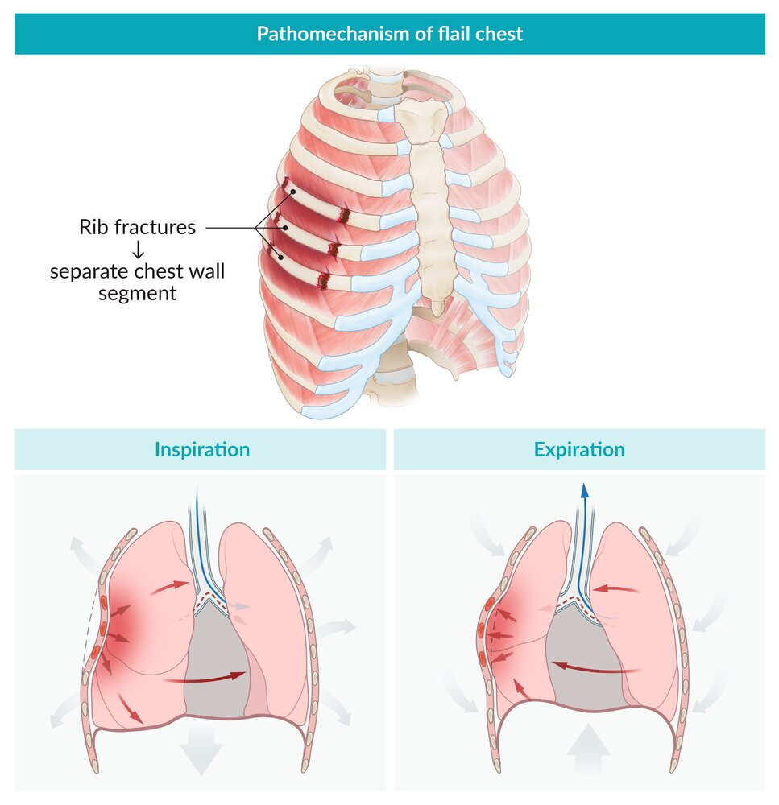

Pathomechanism of flail chest

#### Diagnostics [[2]](https://coursology-qbank.com/amboss/article/AN1Rdh0)[[8]](https://coursology-qbank.com/amboss/article/zlWrzl0)[[13]](https://coursology-qbank.com/amboss/article/EVW8w40)

* <u>Clinical diagnosis</u> based on <u>physical examination</u> findings

* Minor trauma: <u>CXR</u> (AP and <u>lateral</u> view)   [[14]](https://coursology-qbank.com/amboss/article/YkWnml0)

* Major trauma: chest CT with or without IV contrast

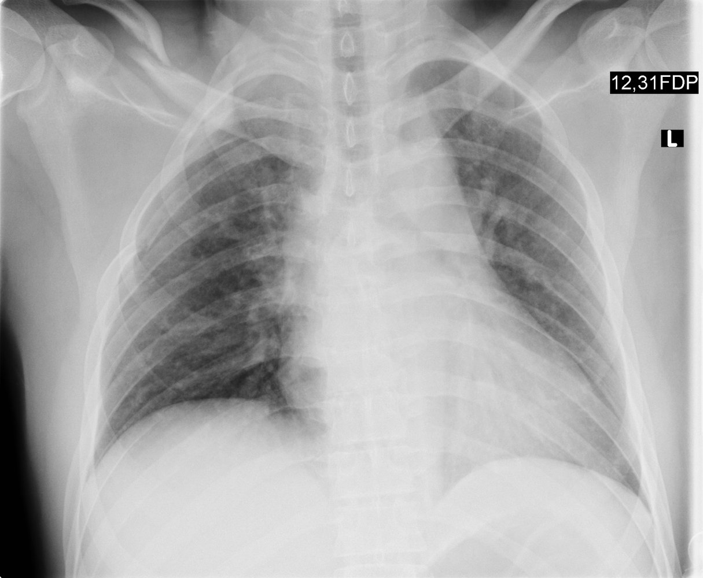

Clavicle and rib fractures

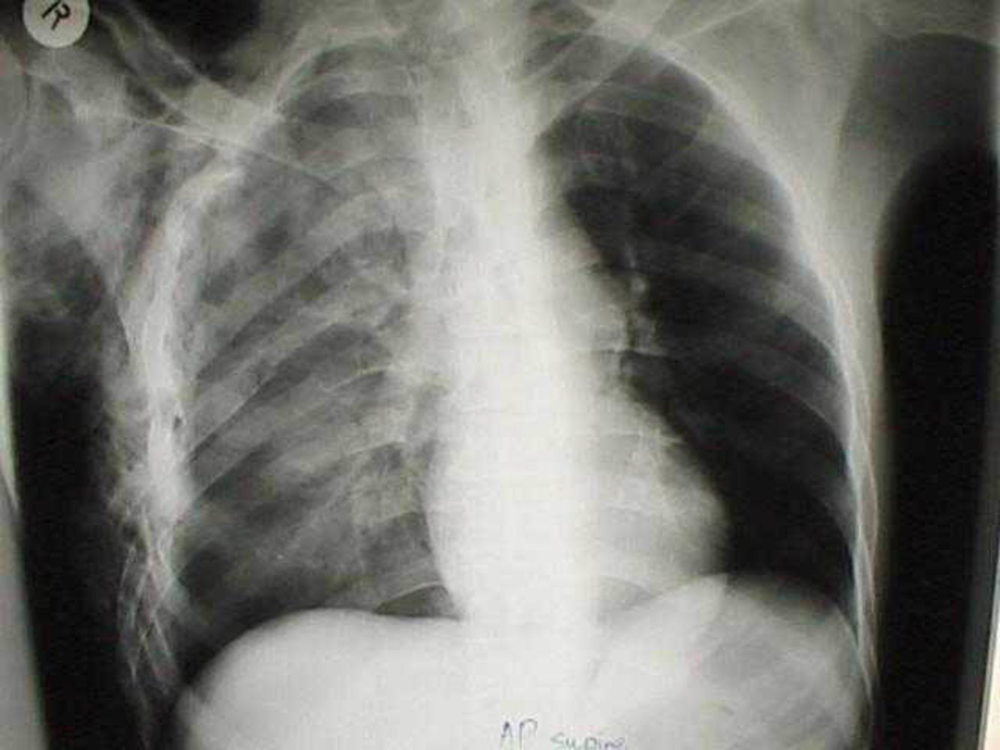

Flail chest

#### Treatment [[2]](https://coursology-qbank.com/amboss/article/AN1Rdh0)[[15]](https://coursology-qbank.com/amboss/article/6rWjR50)

* Isolated <u>rib fractures</u>: typically managed nonsurgically

* Provide <u>pain management</u> (e.g., <u>acetaminophen</u>, <u>NSAIDs</u>, <u>lidocaine</u> patches).

* Encourage deep breathing exercises (e.g., <u>incentive spirometry</u>).

* Multiple <u>rib fractures</u> and/or <u>flail chest</u>

* Intubate and begin <u>positive pressure ventilation</u> (PPV) in patients with <u>signs of acute respiratory distress</u> (see “<u>Airway management</u>”).  [[16]](https://coursology-qbank.com/amboss/article/snWtuN0)

* Manage <u>pneumothorax</u> and/or <u>hemothorax</u> with <u>chest tube placement</u>.

* Provide <u>pain management</u> (e.g., <u>patient-controlled analgesia</u>, <u>intercostal nerve block</u>).

* Encourage deep breathing exercises (e.g., <u>incentive spirometry</u>).

* <u>Flail chest</u>: Consult thoracic <u>surgery</u> for surgical management.

> [!TIP]
> In patients with <u>flail chest</u> and <u>respiratory distress</u>, <u>positive pressure ventilation</u> improves <u>gas exchange</u> and may provide internal stabilization while patients await <u>surgery</u>.

#### Disposition [[15]](https://coursology-qbank.com/amboss/article/6rWjR50)[[17]](https://coursology-qbank.com/amboss/article/chWa1O0)

* Patients with ≤ 2 <u>rib</u> <u>fractures</u> with adequate <u>pain control</u>: may be discharged

* Patients with ≥ 3 <u>rib</u> <u>fractures</u> and/or poorly controlled <u>pain</u>: Admit for <u>pain management</u> and monitoring.

* Patients at risk for respiratory decompensation (e.g., aged > 65 years, respiratory comorbidities) with ≥ 3 <u>rib</u> <u>fractures</u>: Consider <u>ICU</u> admission.

#### Complications

* <u>Respiratory failure</u>

* <u>Pneumothorax</u>

* <u>Hemothorax</u>

* <u>Atelectasis</u>

* <u>Pneumonia</u>

* <u>Pulmonary contusion</u>

* Intraabdominal organ injury

* <u>Nonunion</u>

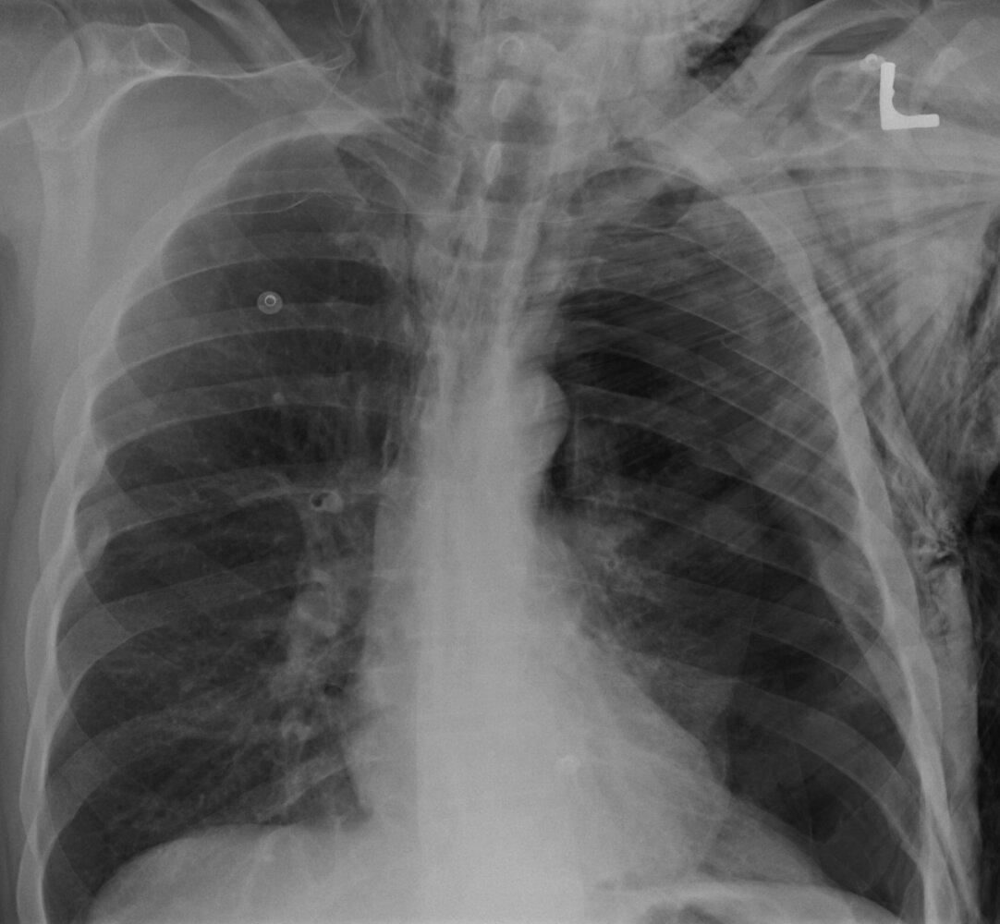

Tension pneumothorax with mediastinal and subcutaneous emphysema

Traumatic pneumothorax and subcutaneous emphysema

Hemothorax following rib fracture

### Other <u>chest wall injuries</u>

* <u>Sternal fracture</u>

* <u>Clavicle fracture</u>

* <u>Vertebral fractures</u>

---

## Cardiovascular injury

### Blunt cardiac injury (<u>BCI</u>) [[1]](https://coursology-qbank.com/amboss/article/ZyYZd7)[[18]](https://coursology-qbank.com/amboss/article/gnWFsN0)[[19]](https://coursology-qbank.com/amboss/article/hnWcGN0)

Cardiac injuries from blunt trauma most commonly occur after high-speed <u>MVC</u> and range from minor asymptomatic injury to <u>myocardial</u> rupture and <u>death</u>. [[2]](https://coursology-qbank.com/amboss/article/AN1Rdh0)

#### Possible injuries

* Cardiac contusion: a cardiac injury secondary to <u>blunt force thoracic trauma</u>, which causes <u>myocardial</u> dysfunction with a wide range of clinical effects, including <u>chest pain</u>, <u>hypotension</u>, <u>arrhythmias</u>, elevated <u>cardiac biomarkers</u>, and <u>cardiogenic shock</u>

* Atrial and ventricular wall injuries

* Septal and valvular injuries

* <u>Acute coronary syndrome</u>, <u>myocardial infarction</u>

* <u>Pericardial effusion and cardiac tamponade</u>

* <u>Myocardial</u> rupture

#### Clinical features

* Asymptomatic

* Chest <u>ecchymosis</u>

* <u>Chest pain</u> or tenderness

* <u>Hypotension</u>

* <u>Tachypnea</u>, <u>shortness of breath</u>

* <u>Tachycardia</u>, <u>arrhythmias</u>

* New cardiac <u>murmur</u>, muffled <u>heart sounds</u>

* <u>Jugular venous distention</u>

* <u>Dizziness</u>, <u>syncope</u>

* <u>Cardiogenic shock</u>

* Sudden <u>cardiac arrest</u>

> [!TIP]
> Consider <u>BCI</u> if <u>tachycardia</u> persists despite <u>fluid resuscitation</u> and hemorrhage has been ruled out.

#### Diagnostics [[18]](https://coursology-qbank.com/amboss/article/gnWFsN0)[[19]](https://coursology-qbank.com/amboss/article/hnWcGN0)

See “<u>Approach to blunt chest trauma</u>” for initial measures.

* <u>ECG</u>

* Obtain in all patients with suspected <u>BCI</u>.

* Potential findings include:

* <u>Arrhythmia</u> (e.g., <u>sinus tachycardia</u>, <u>dysrhythmia</u>)

* <u>ST-segment abnormalities</u>

* <u>ECG changes in STEMI</u>

* <u>AV block</u>

* <u>Troponin</u>

* Obtain in all patients with suspected <u>BCI</u>.

* May be elevated in patients with coronary or <u>myocardial injury</u>

* <u>Echocardiography</u> [[20]](https://coursology-qbank.com/amboss/article/BV1z9f0)

* Obtain in patients with <u>hemodynamic instability</u>, abnormal <u>ECG</u>, or elevated <u>troponin</u>.

* <u>TEE</u> may be performed if <u>TTE</u> is inconclusive.

* Potential findings include:

* <u>Pericardial effusion</u>

* <u>Cardiac tamponade</u>

* <u>Myocardial</u> rupture

* Wall motion abnormality

* Valvular injuries

* Septal injuries

* Additional diagnostics [[20]](https://coursology-qbank.com/amboss/article/BV1z9f0)

* General imaging in trauma: e.g., <u>eFAST</u>, <u>CXR</u>, chest CT with or without IV contrast

* <u>CT angiography</u>: for suspected vascular injury

#### Management

* Initiate <u>immediate hemodynamic support</u> and <u>continuous cardiac monitoring</u>.

* Start treatment of underlying pathology (e.g., <u>management of cardiac tamponade</u>, <u>management of cardiogenic shock</u>).

* Patients with abnormal <u>ECG</u> or <u>troponin</u> levels: Monitor for delayed cardiac injuries (e.g., <u>myocardial</u> rupture).

* Patients with normal <u>ECG</u> and <u>troponin</u> levels: Consider discharge if there are no other injuries.

### Commotio cordis [[21]](https://coursology-qbank.com/amboss/article/qdWCI40)[[22]](https://coursology-qbank.com/amboss/article/97WNL50)

* Definition: <u>ventricular fibrillation</u> and <u>sudden cardiac death</u> caused by a relatively mild nonpenetrating blunt force trauma to the precordial area

* Etiology: blow to the precordial area at a perpendicular angle, most commonly by a hard, spherical object (e.g., baseball, golf ball), during a brief electrically vulnerable period of <u>T-wave</u> upstroke

* Pathophysiology: blunt trauma leads to <u>myocardial</u> stretch → activation of ion channels because of mechano-electric coupling → augmentation of <u>repolarization</u> and premature ventricular <u>depolarization</u> → <u>ventricular fibrillation</u> [[23]](https://coursology-qbank.com/amboss/article/IdWYr40)

* Diagnosis is clinical and based on the following criteria:

* Blunt trauma to the chest followed by collapse

* Absence of structural <u>myocardial injury</u> (on imaging studies and/or <u>autopsy</u>)

* <u>ECG</u> showing <u>ventricular fibrillation</u> (if obtained)

* Management

* Immediate: <u>cardiopulmonary resuscitation</u>

* Long-term: cardiac workup (<u>ECG</u>, <u>echocardiogram</u>, <u>cardiac MRI</u>, <u>stress</u> testing)

* Prevention

* Avoidance of sports that involve <u>chest wall</u> impact (e.g., baseball, hockey, football)

* Use of chest protectors and/or safety balls may reduce risk.

* Treat any underlying cardiac disease.

* No underlying cardiac disease: no <u>ICD</u> necessary

### Blunt thoracic aortic injury [[24]](https://coursology-qbank.com/amboss/article/3nWSGN0)[[25]](https://coursology-qbank.com/amboss/article/WhWP1O0)[[26]](https://coursology-qbank.com/amboss/article/DE11Bi0)

* Definition: an injury of the <u>thoracic aorta</u> resulting from blunt trauma; most commonly occurs <u>distal</u> to the <u>left subclavian artery</u> in the <u>aortic isthmus</u>

* Etiology: rapid deceleration from blunt trauma (e.g., <u>MVC</u>, fall from height)

* Clinical features: Severity ranges from <u>intimal</u> lesions (e.g., <u>aortic pseudocoarctation</u>) to thoracic <u>aortic rupture</u>.

* <u>Chest pain</u>

* Upper <u>back pain</u>

* <u>Dyspnea</u>, <u>hoarseness</u> and/or <u>stridor</u>

* <u>Dysphagia</u>

* <u>Chest wall</u> instability and/or <u>ecchymoses</u>

* New interscapular <u>murmur</u>

* Thoracic <u>aortic rupture</u>: signs of <u>hemorrhagic shock</u> (e.g., <u>tachycardia</u>, <u>hypotension</u>) and tearing <u>pain</u>

* Imaging [[1]](https://coursology-qbank.com/amboss/article/ZyYZd7)

* <u>CXR</u> (initial imaging); potential findings include:

* Left main <u>bronchus</u> <u>depression</u>

* <u>Tracheal deviation</u>

* <u>Apical pleural cap</u>

* Left <u>pleural effusion</u> (<u>hemothorax</u>)

* Obscuration of the <u>aortic knob</u>

* <u>Mediastinal widening</u>

* Definitive imaging: based on the patient's hemodynamic status and trauma <u>surgeon</u> preference [[1]](https://coursology-qbank.com/amboss/article/ZyYZd7)

* <u>CTA</u> chest in hemodynamically stable patients

* <u>Transesophageal echocardiography</u>

* Management [[26]](https://coursology-qbank.com/amboss/article/DE11Bi0)

* Initiate blood pressure and <u>heart rate</u> control.

* Goal: <u>heart rate</u> ≤ 100 bpm and systolic blood pressure ≤ 100 mm Hg

* Treatment: <u>beta blockers</u> (e.g., <u>esmolol</u>, <u>labetalol</u>)  and <u>vasodilator</u> therapy (e.g., <u>nitroprusside</u>, <u>nicardipine</u>) if needed

* Definitive management

* Endovascular repair (<u>TEVAR</u>)

* Open surgical repair

* Prognosis: very poor (∼ 80% of patients die before reaching the hospital) [[26]](https://coursology-qbank.com/amboss/article/DE11Bi0)

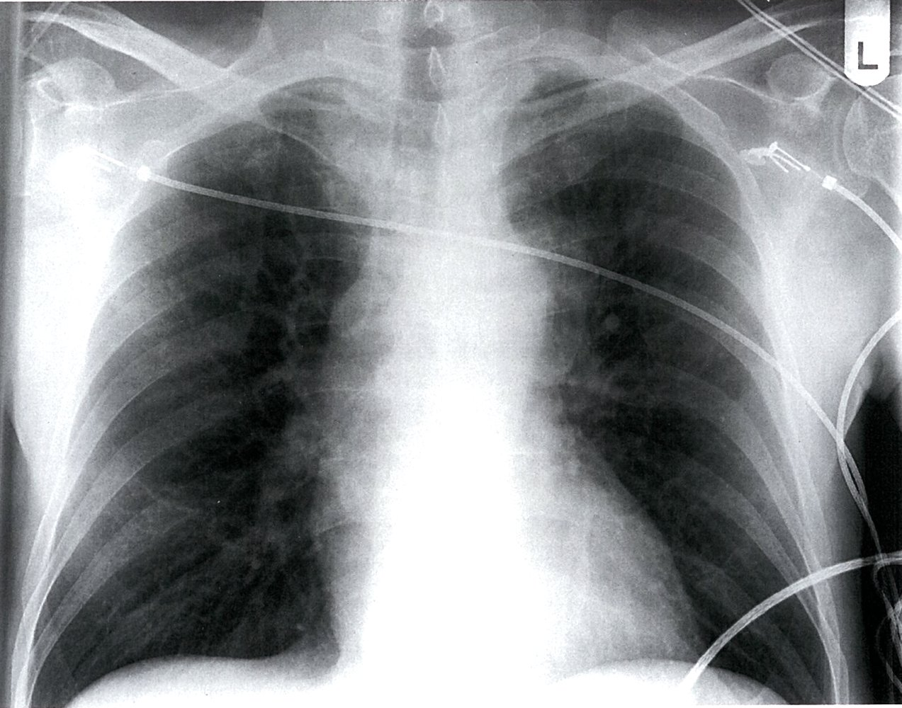

Widened mediastinum secondary to traumatic thoracic aortic injury

---

## Pulmonary injury

### Pulmonary contusion [[1]](https://coursology-qbank.com/amboss/article/ZyYZd7)[[2]](https://coursology-qbank.com/amboss/article/AN1Rdh0)[[16]](https://coursology-qbank.com/amboss/article/snWtuN0)

* Definition: a <u>lung injury</u> from blunt trauma resulting in <u>alveolar edema</u> and hemorrhage

* Clinical features

* <u>Clinical features of respiratory distress</u> (e.g., <u>dyspnea</u>; , <u>tachypnea</u>, <u>cyanosis</u>)

* <u>Hypoxia</u>

* <u>Tachycardia</u>

* <u>Chest pain</u>

* Chest <u>ecchymosis</u>

* Diagnostics

* <u>CXR</u> ;  [[2]](https://coursology-qbank.com/amboss/article/AN1Rdh0)

* Patchy alveolar infiltrates

* White-out hemithorax or diffuse opacity

* Chest CT: if <u>CXR</u> is inconclusive

* Management

* Provide <u>pain management</u>.

* Provide <u>respiratory support</u> (e.g., oxygen, <u>positive pressure ventilation</u>).

* Maintain <u>euvolemia</u> and avoid excessive <u>IVF</u> resuscitation.

* Monitor for <u>respiratory insufficiency</u>, e.g., with repeated <u>ABGs</u>.

* Complications

* <u>ARDS</u>

* <u>Pneumonia</u>

Flail chest

Pulmonary trauma

### Tracheobronchial injury [[1]](https://coursology-qbank.com/amboss/article/ZyYZd7)[[2]](https://coursology-qbank.com/amboss/article/AN1Rdh0)

* Definition: a tear in the tracheobronchial tree resulting from high-energy impact, decelerating forces, or a penetrating <u>chest wall injury</u>

* Clinical features

* <u>Dyspnea</u>

* Sternal tenderness

* <u>Subcutaneous emphysema</u>

* <u>Clinical features of pneumothorax</u>

* <u>Hamman sign</u>

* <u>Hoarseness</u>

* <u>Hemoptysis</u>

* Diagnostics

* <u>CXR</u>; : <u>subcutaneous emphysema</u>, <u>pneumomediastinum</u>, <u>pneumothorax</u>

* Chest CT: <u>subcutaneous emphysema</u>, <u>pneumomediastinum</u>, <u>pneumothorax</u>, bronchial tear, <u>tracheal tear</u>

* <u>Bronchoscopy</u>: visualization of the lesion  [[2]](https://coursology-qbank.com/amboss/article/AN1Rdh0)

* Initial management [[2]](https://coursology-qbank.com/amboss/article/AN1Rdh0)[[27]](https://coursology-qbank.com/amboss/article/3wYSir)

* Prepare for <u>difficult airway management</u>.

* Intubate using a <u>fiberoptic laryngoscope</u> or bronchoscope.

* <u>Place chest tube</u> for concomitant <u>pneumothorax</u>.

* For injuries of the <u>proximal</u> <u>trachea</u>, see also “<u>Approach to blunt neck trauma</u>.”

* Definitive treatment: surgical repair

* Complications [[2]](https://coursology-qbank.com/amboss/article/AN1Rdh0)

* <u>Pneumothorax</u> with persistent air leak

* <u>Airway obstruction</u>

* Bronchopleural <u>fistula</u>

* <u>Mediastinitis</u>

> [!TIP]
> Suspect <u>tension pneumothorax</u> in patients with <u>tracheobronchial injury</u> and midline shift or distended neck <u>veins</u>.

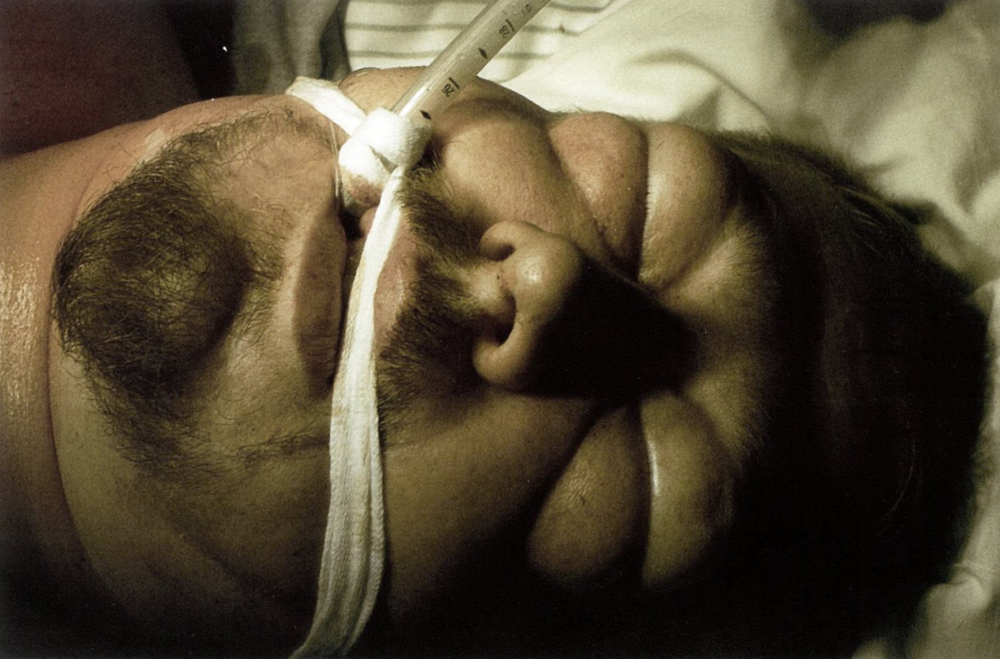

Subcutaneous emphysema after bronchial rupture

Traumatic pneumothorax and pneumomediastinum with subcutaneous emphysema

---

## Blunt abdominopelvic trauma

### Approach to blunt abdominal trauma [[1]](https://coursology-qbank.com/amboss/article/ZyYZd7)[[2]](https://coursology-qbank.com/amboss/article/AN1Rdh0)

Ensure the following components are included as part of the standard <u>management of trauma patients</u> using the <u>ATLS algorithm</u>:

* All patients

* Assess for <u>indications for trauma team activation</u> (e.g., high-speed <u>MVCs</u>, ejection from vehicle, <u>death</u> of a passenger) and initiate transfer to a <u>trauma center</u>, if necessary.

* Examine abdomen, flank, back, and groin for <u>bruising</u> and <u>signs of peritonitis</u>.

* Consider portable <u>CXR</u> and <u>pelvic</u> <u>x-ray</u>.

* Stabilize <u>pelvic fractures</u> with a <u>pelvic binder</u>.

* Begin <u>initial management of vertebral injuries</u>, if suspected.

* <u>Hemodynamically unstable</u> patients

* Perform <u>FAST</u> to quickly identify intraabdominal bleeding.

* Treat <u>hemorrhagic shock</u> with <u>emergency transfusion</u> and <u>immediate hemodynamic support</u>.

* Identify obvious indications for <u>exploratory laparotomy</u>, e.g., <u>hypotension</u> with a positive <u>FAST</u>, <u>peritoneal signs</u>, subdiaphragmatic air on <u>CXR</u>.

* Associated <u>pelvic fracture</u>: Coordinate <u>interventions for pelvic hemorrhage control</u> (e.g., <u>angioembolization</u>) concurrently with <u>emergency laparotomy</u> (see “<u>Initial management of pelvic fractures</u>” for details).

* Hemodynamically stable patients

* Obtain <u>urgent diagnostics for trauma patients</u> as indicated, e.g., CT abdomen and <u>pelvis</u> with contrast.

* Identify other radiological indications for <u>exploratory laparotomy</u> (e.g., significant <u>hemoperitoneum</u> or <u>gastrointestinal perforation</u>).

* If there are no indications for <u>surgery</u>, initiate nonsurgical management with serial examinations and close monitoring of <u>vital signs</u>.

> [!WARNING]
> If there are obvious indications for immediate <u>exploratory laparotomy</u> (e.g., <u>hypotension</u> and <u>peritoneal signs</u>), do not delay transfer to the OR for diagnostic studies. [[1]](https://coursology-qbank.com/amboss/article/ZyYZd7)[[2]](https://coursology-qbank.com/amboss/article/AN1Rdh0)

### Clinical features [[1]](https://coursology-qbank.com/amboss/article/ZyYZd7)

#### General features

* <u>Hemorrhagic shock</u> (e.g., <u>hypotension</u>, <u>tachycardia</u>)

* <u>Signs of peritonitis</u> (e.g., abdominal <u>pain</u>, abdominal distention, <u>abdominal guarding</u>)

* Decreased <u>bowel sounds</u>

* Abdominal <u>bruising</u> (e.g., <u>seat belt sign</u> )

> [!WARNING]
> The absence of abdominal <u>pain</u> or tenderness does not exclude intraabdominal injuries. [[2]](https://coursology-qbank.com/amboss/article/AN1Rdh0)

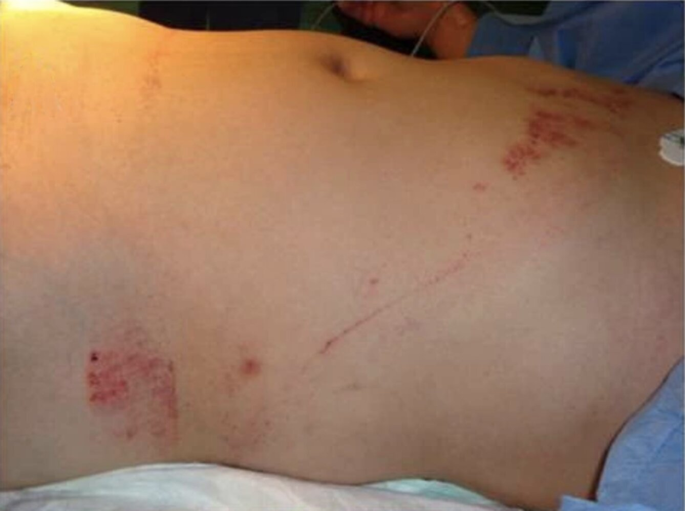

Seatbelt sign

#### Specific injuries

* <u>Splenic injury</u>

* Left-sided abdominal <u>pain</u>

* <u>Referred pain</u> in the left shoulder (<u>Kehr sign</u>)

* <u>Liver</u> injury

* Right-sided abdominal <u>pain</u>

* <u>Referred pain</u> in the right shoulder

* <u>Duodenal</u> injury

* <u>Nausea and vomiting</u>

* <u>Bilious</u> <u>vomiting</u> in case of gastrointestinal obstruction

* Epigastric <u>pain</u>

* <u>Retroperitoneal</u> injury

* Back and/or flank <u>pain</u> or tenderness

* Periumbilical <u>ecchymosis</u> (<u>Cullen sign</u>)

* Flank <u>ecchymosis</u> (<u>Grey Turner sign</u>)

* <u>Renal injury</u>: <u>hematuria</u>

* <u>Pancreatic</u> injury: upper abdominal <u>pain</u>, <u>clinical features of acute pancreatitis</u>  [[28]](https://coursology-qbank.com/amboss/article/t7WXn50)

* <u>Diaphragmatic injury</u>

* Decreased breath sounds

* <u>Bowel sounds</u> in the thorax

* <u>Respiratory distress</u>

* <u>Vertebral injury</u> (e.g., <u>Chance fracture</u>)

* <u>Lower back pain</u>

* <u>Clinical features of spinal cord injury</u>

> [!TIP]
> Extensive <u>duodenal hematoma</u> can obstruct gastroduodenal passage and manifest with <u>bilious</u> <u>vomiting</u>.

> [!TIP]
> Symptom onset in <u>pancreatic</u> injury may be delayed.

> [!TIP]
> Suspect <u>herniation</u> of abdominal organs into the chest if there are <u>bowel sounds</u> in the thorax after abdominal or thoracic trauma.

Cullen sign

Grey Turner sign

### Diagnostics [[1]](https://coursology-qbank.com/amboss/article/ZyYZd7)[[8]](https://coursology-qbank.com/amboss/article/zlWrzl0)[[29]](https://coursology-qbank.com/amboss/article/O7WIN50)

See “<u>Urgent diagnostics for trauma patients</u>” for a comprehensive approach.

* General imaging in trauma: <u>CXR</u> and <u>pelvic</u> <u>x-ray</u>

* Performed for most patients after major trauma

* May show free intraabdominal air, evidence of <u>diaphragmatic injury</u>, and <u>fractures</u>

* Bedside intraabdominal hemorrhage assessment: <u>FAST</u>, <u>eFAST</u>, or <u>diagnostic peritoneal lavage</u> (<u>DPL</u>)  

* Indicated for all <u>hemodynamically unstable</u> patients with <u>blunt abdominal trauma</u>

* Detects hemoperitoneum (collection of blood in the <u>peritoneal cavity</u>)

* <u>CT imaging in trauma</u>

* Minimum evaluation: CT abdomen and <u>pelvis</u> with IV contrast

* Suspected vascular injuries: <u>CTA</u> abdomen and <u>pelvis</u>

* Suspected <u>T-spine</u> or <u>L-spine</u> injuries: See “<u>Diagnosis of vertebral injuries</u>.”

* Potential findings

* <u>Hemoperitoneum</u>

* <u>Pneumoperitoneum</u>

* <u>Splenic laceration</u>

* <u>Liver hematoma</u>

* <u>Duodenal hematoma</u>

* <u>Pelvic fracture</u>

* Minimally invasive surgical assessment: <u>diagnostic laparoscopy</u>

> [!WARNING]
> <u>Pancreatic</u>, diaphragmatic, <u>small bowel</u>, and <u>mesenteric</u> injuries may be missed on initial CT imaging. [[2]](https://coursology-qbank.com/amboss/article/AN1Rdh0)

Pneumoperitoneum

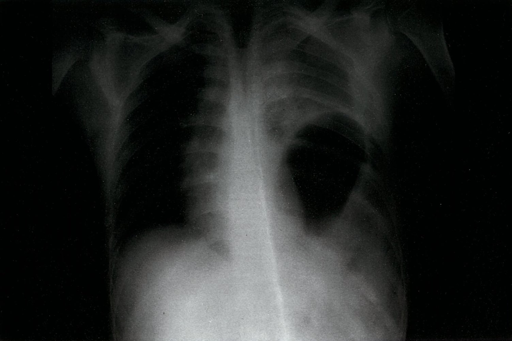

Left diaphragmatic rupture

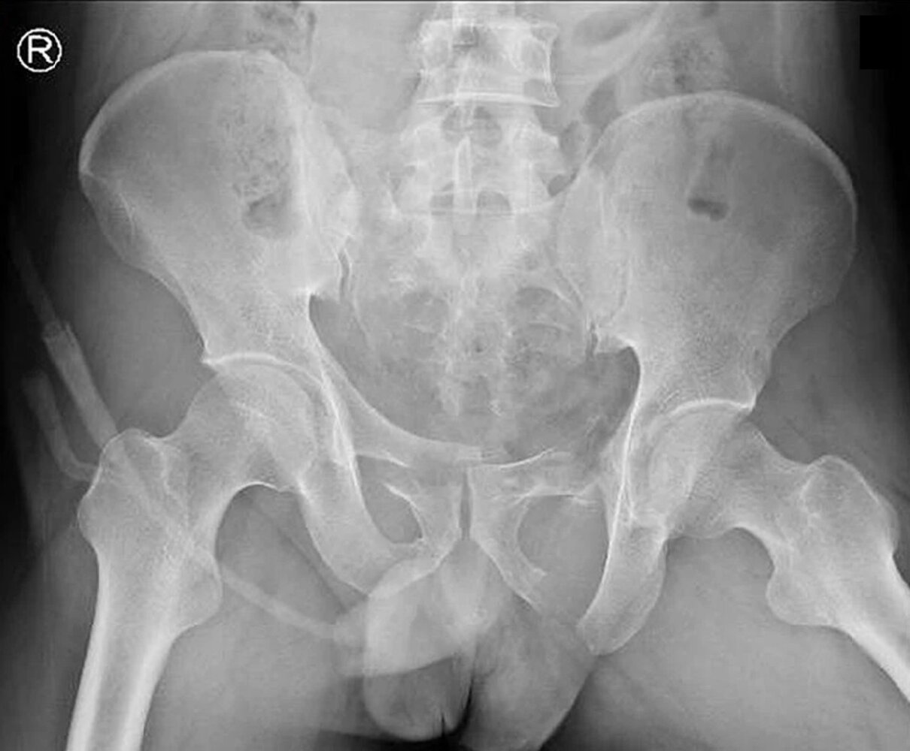

Unstable pelvic ring fracture

Free fluid in hepatorenal space (Morison pouch)

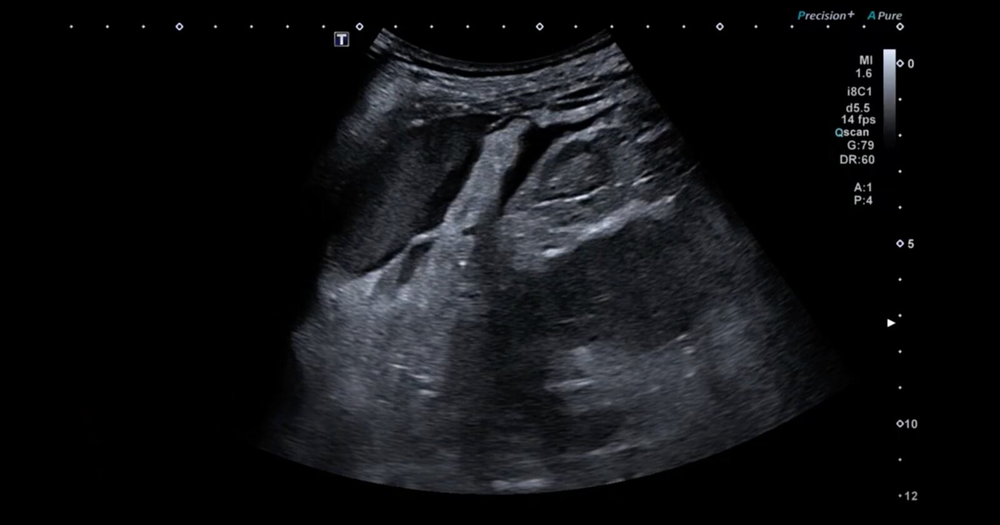

Free fluid in the splenorenal recess

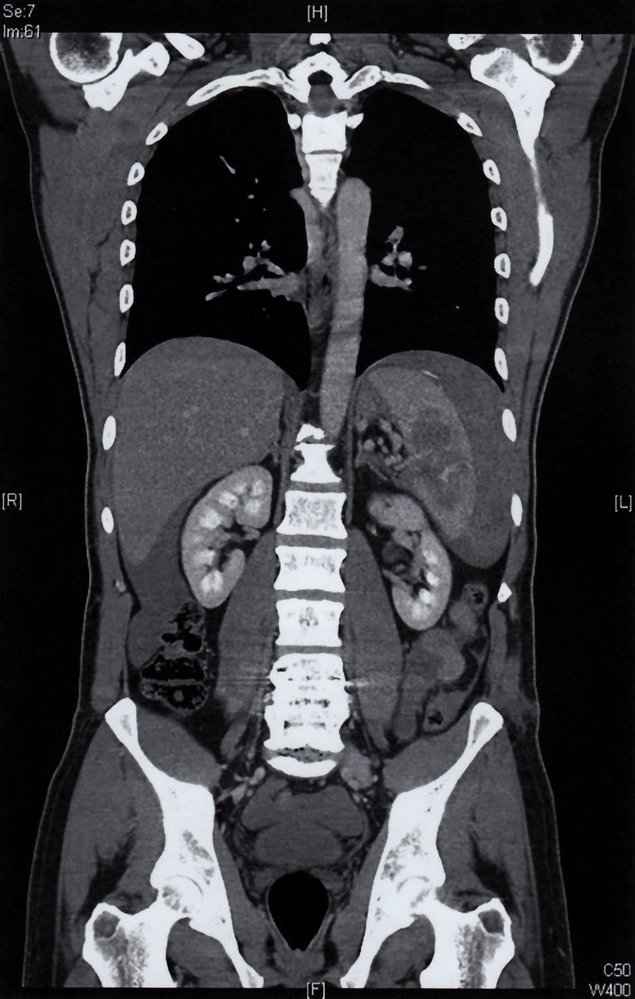

Splenic laceration

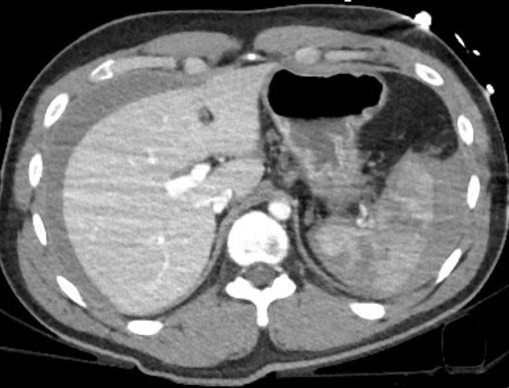

Lacerated spleen

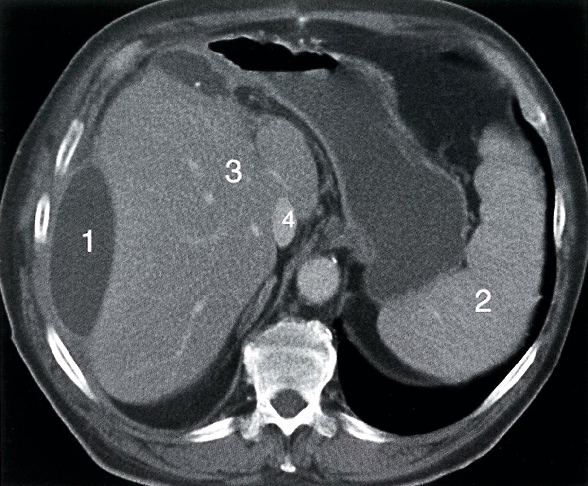

Subcapsular hepatic hematomas

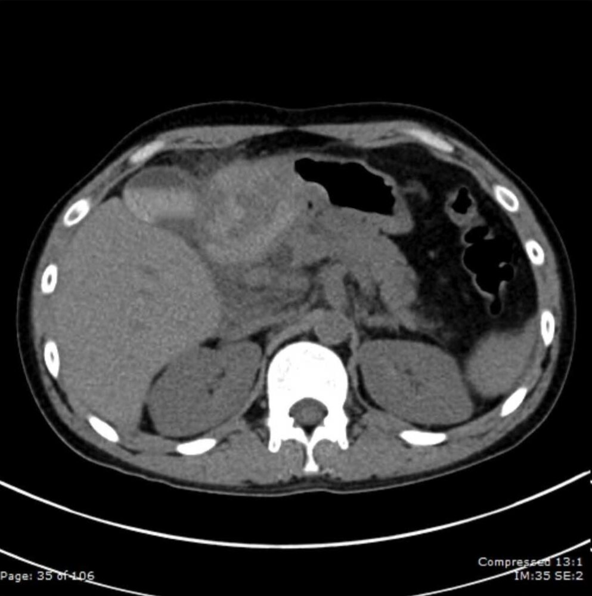

Mass in region of duodenum

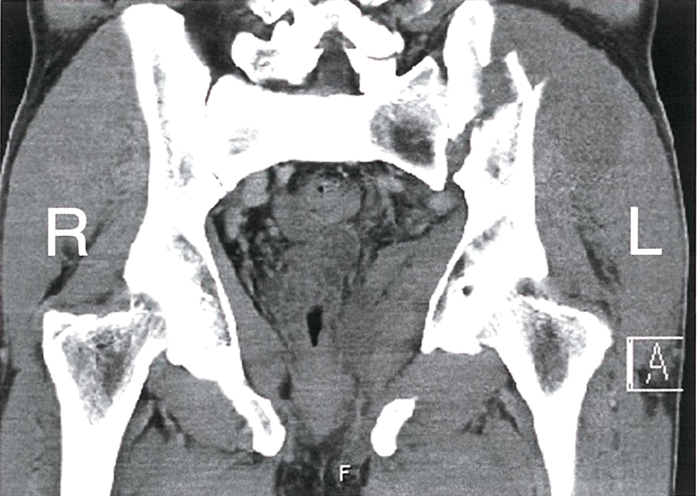

Left iliac wing fracture

### Management [[2]](https://coursology-qbank.com/amboss/article/AN1Rdh0)

#### Nonoperative management [[30]](https://coursology-qbank.com/amboss/article/F7Wgn50)[[31]](https://coursology-qbank.com/amboss/article/k4Wmjl0)[[32]](https://coursology-qbank.com/amboss/article/O4WIjl0)

Nonoperative management should take place in a center with facilities for urgent <u>laparotomy</u>.

* May be considered for:

* Hemodynamically stable patients with no <u>signs of peritonitis</u>

* Renal, splenic, <u>pancreatic</u>, and hepatic injuries

* Typically includes:

* Monitoring for changes in clinical status (e.g., <u>vital signs</u>, <u>pain</u> levels, <u>serial abdominal examination</u>)

* Serial <u>laboratory studies</u> (e.g., <u>hemoglobin</u>)

* Repeat imaging for injury progression

* <u>Supportive care</u> (e.g., <u>pain management</u>, <u>wound care</u>)

#### Operative and interventional management [[33]](https://coursology-qbank.com/amboss/article/87WOn50)

<u>Hemodynamically unstable</u> patients typically require surgical or interventional management, which may include:

* <u>Exploratory laparotomy</u>: e.g., for <u>hemodynamically unstable</u> patients with a positive <u>FAST</u> and/or <u>CT scan</u> or <u>signs of peritonitis</u>

* <u>Angiographic embolization</u>: e.g., for patients with <u>pelvic fracture</u>, <u>retroperitoneal hematoma</u>, or <u>liver</u> injury

* <u>External fixation</u> of <u>pelvic fractures</u>

#### Injury-specific management

Management depends on the type and extent of injuries and is determined in consultation with specialists (e.g., trauma <u>surgery</u>, interventional radiology).

* <u>Splenic injury</u> [[31]](https://coursology-qbank.com/amboss/article/k4Wmjl0)

* Monitoring for <u>delayed splenic rupture</u>

* <u>Laparotomy</u> and repair or <u>splenectomy</u> in unstable patients

* <u>Liver</u> injury [[32]](https://coursology-qbank.com/amboss/article/O4WIjl0)

* Nonoperative management with observation and <u>supportive care</u>

* OR <u>arteriography</u> and hepatic embolization

* <u>Laparotomy</u> and repair in unstable patients

* <u>Gastrointestinal perforation</u>: <u>laparotomy</u>; see “<u>Treatment of gastrointestinal perforation</u>.”

* <u>Duodenal hematoma</u>: bowel rest, <u>nasogastric decompression</u>, and <u>total parenteral nutrition</u> [[34]](https://coursology-qbank.com/amboss/article/4BW3aL0)[[35]](https://coursology-qbank.com/amboss/article/kBWmaL0)

* <u>Pancreatic</u> injury [[28]](https://coursology-qbank.com/amboss/article/t7WXn50)[[36]](https://coursology-qbank.com/amboss/article/s7WtM50)

* Nasogastric suction and <u>total parenteral nutrition</u>

* OR <u>surgical debridement</u>, repair, and percutaneous drainage

* <u>Pelvic fracture</u> [[37]](https://coursology-qbank.com/amboss/article/H7WKM50)[[38]](https://coursology-qbank.com/amboss/article/77W4M50)

* External or <u>internal fixation</u>

* <u>Hemostatic measures</u>: <u>angiographic embolization</u>, preperitoneal packing

* <u>Vertebral injuries</u>: See "<u>Definitive management of vertebral injuries</u>.”

---

## Blunt neck trauma

### Approach to blunt neck trauma [[1]](https://coursology-qbank.com/amboss/article/ZyYZd7)

Ensure the following components are included as part of the standard <u>management of trauma patients</u> using the <u>ATLS algorithm</u>:

* <u>Primary survey</u>

* Prepare for <u>difficult airway management</u> and <u>secure the airway</u> early (see “Treatment”).

* Apply <u>C-spine immobilization</u> (see “<u>Initial management of C-spine injury</u>”).

* Consider <u>neurogenic shock</u> in hypotensive patients with no evidence of hemorrhagic or <u>obstructive shock</u>.

* If at a nontrauma center, initiate transfer to a <u>trauma center</u>; <u>airway obstruction</u> or <u>hypotension</u> are <u>indications for trauma team activation</u>.

* <u>Secondary survey</u>

* Perform <u>neurovascular examination</u> focusing on <u>clinical and diagnostic features of BCVI</u>.

* Obtain <u>urgent diagnostics for trauma patients</u> (see “Diagnostics”).

* Consult specialists based on injured anatomical structures (see “Surgical management”).

### Associated injuries [[2]](https://coursology-qbank.com/amboss/article/AN1Rdh0)

* Laryngotracheal <u>contusions</u> and <u>lacerations</u>

* Laryngeal fracture: a <u>fracture</u> of the <u>thyroid</u> <u>cartilage</u> and/or the cricoid <u>cartilage</u>

* <u>Fractures</u> and/<u>dislocations</u> of the <u>tracheal</u> cartilages

* Tracheal rupture: the partial or complete puncture or <u>laceration</u> of the <u>trachea</u> or the main <u>bronchi</u>

* Pharyngoesophageal injury

* <u>Blunt cerebrovascular injury</u>

* <u>Cervical spine injuries</u>, e.g., <u>hangman fracture</u>

### Clinical features [[1]](https://coursology-qbank.com/amboss/article/ZyYZd7)

* <u>Airway</u> or esophageal injury

* <u>Signs of airway compromise</u> (e.g., <u>dyspnea</u>)

* <u>Hoarseness</u> and/or <u>stridor</u>

* <u>Subcutaneous emphysema</u> (e.g., <u>crepitus</u>)

* <u>Mediastinal emphysema</u> (e.g., <u>Hamman sign</u>)

* <u>Hemoptysis</u>

* <u>Dysphagia</u>

* Vascular injury

* <u>Carotid bruit</u>

* Expanding neck <u>hematoma</u>

* <u>Focal neurological deficit</u>

* Clinical features of strangulation [[2]](https://coursology-qbank.com/amboss/article/AN1Rdh0)[[39]](https://coursology-qbank.com/amboss/article/zqcrad0)

* <u>Asphyxiation</u>, <u>loss of consciousness</u>

* <u>Dysphagia</u>, voice changes

* <u>Subconjunctival hemorrhage</u>, facial <u>petechiae</u>

* <u>Bruising</u> around the neck, <u>strangulation marks</u>

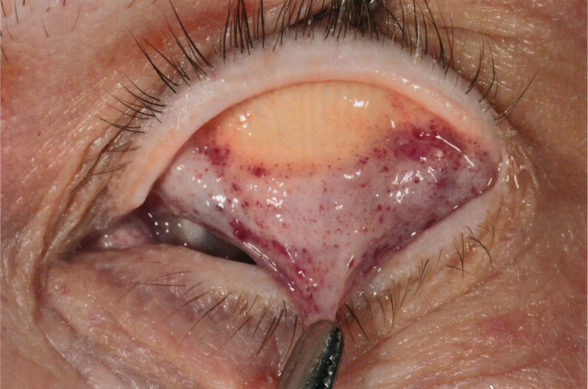

Petechiae of the conjunctiva after violent asphyxiation

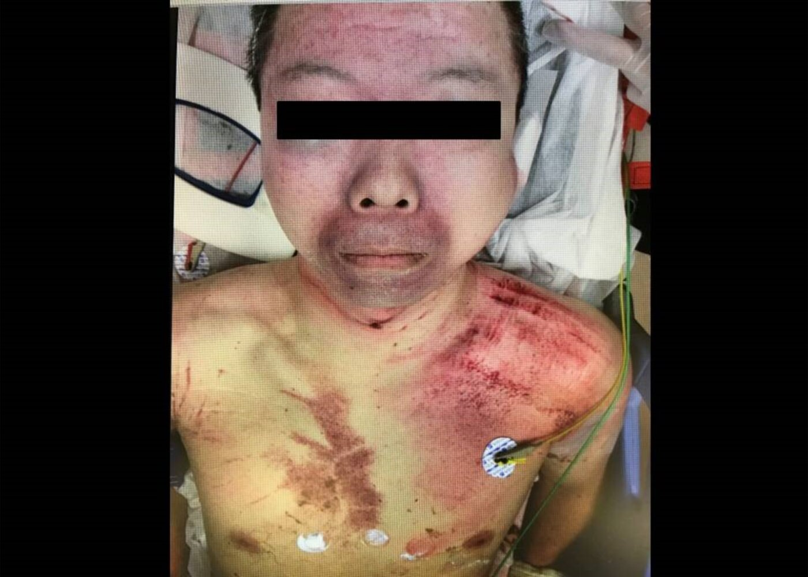

Ligature marks

### Diagnostics [[1]](https://coursology-qbank.com/amboss/article/ZyYZd7)

See “<u>Urgent diagnostics for trauma patients</u>” for a comprehensive approach.

* Bedside assessment: <u>CXR</u>

* CT imaging in trauma

* Vascular injury: <u>CTA</u> head and neck

* <u>C-spine injury</u>: CT <u>C-spine</u> without IV contrast (See “<u>Diagnostics for C-spine injuries</u>” for details.)

* Laryngeal injury: CT neck with IV contrast

* Additional testing

* Vascular injury: <u>duplex ultrasound</u>, <u>angiography</u>

* <u>Esophageal injury</u>: <u>esophagoscopy</u>, <u>esophagography</u>

* Laryngeal injury: <u>direct laryngoscopy</u>, <u>flexible nasopharyngoscopy</u>

### Treatment [[1]](https://coursology-qbank.com/amboss/article/ZyYZd7)[[2]](https://coursology-qbank.com/amboss/article/AN1Rdh0)

#### <u>Airway management</u> [[40]](https://coursology-qbank.com/amboss/article/GB1BXj0)

* If there are <u>signs of airway compromise</u>, call for help immediately (e.g., emergent anesthesia or ENT consult).

* Perform <u>BMV</u> with caution.

* Prepare for <u>difficult airway management</u> (e.g., distorted anatomy, blood, and/or <u>edema</u>) by an experienced provider.

* <u>Intubation via direct laryngoscopy</u> or <u>video laryngoscopy</u> using a smaller-sized <u>ET tube</u> can be attempted initially.

* <u>Awake fiberoptic intubation</u> is preferred for distorted anatomy.

* Prepare for <u>emergency surgical airway</u> as a backup.

* Perform <u>manual in-line cervical stabilization</u> during <u>airway management</u>.

> [!WARNING]
> <u>Cricothyroidotomy</u> may be impossible if anatomical landmarks are invisible or deformed, e.g., due to a <u>laryngeal fracture</u>. Emergency <u>tracheostomy</u> may be required if <u>intubation</u> has failed. [[1]](https://coursology-qbank.com/amboss/article/ZyYZd7)

#### Surgical management

Consult surgical subspecialties based on clinical and diagnostic findings.

* Vascular injuries: vascular <u>surgery</u>

* Laryngotracheal injuries: otolaryngology

* <u>C-spine injuries</u>: <u>spine</u> <u>surgery</u> (See “<u>Definitive management of C-spine injuries</u>.”)

* <u>Esophageal injuries</u>: thoracic <u>surgery</u>

---