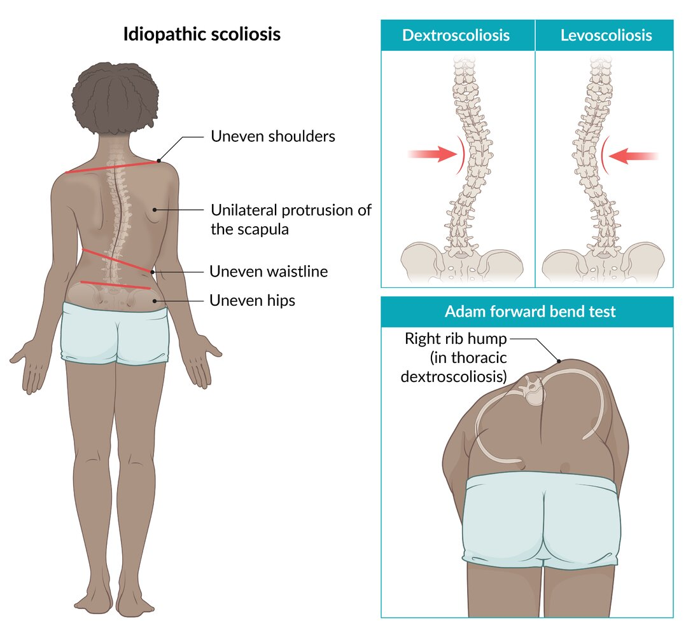
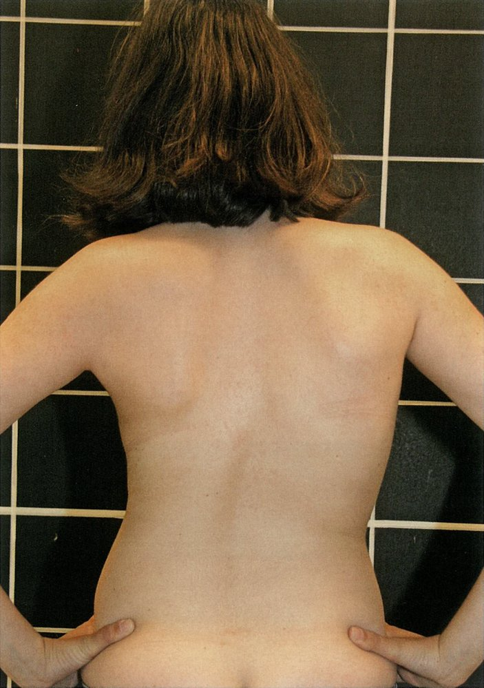
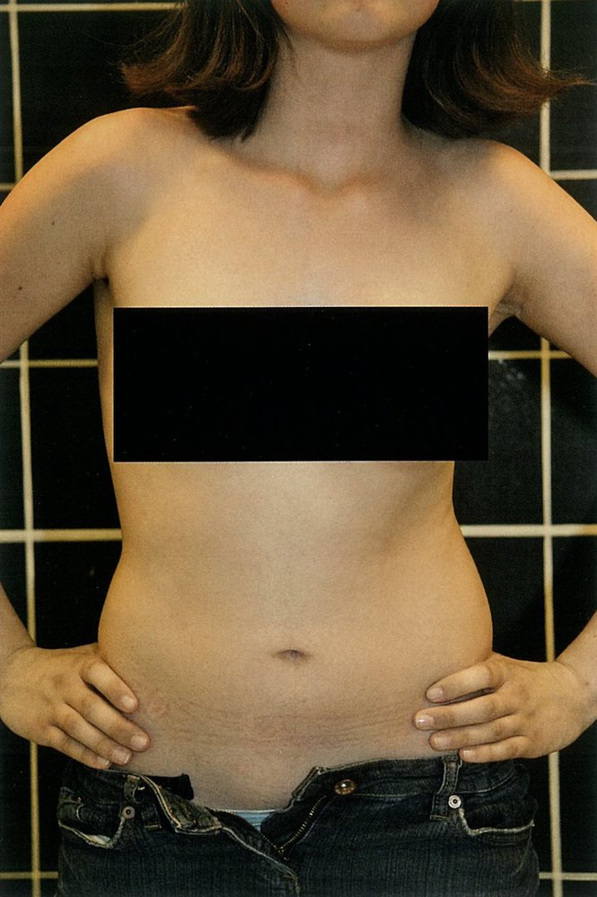
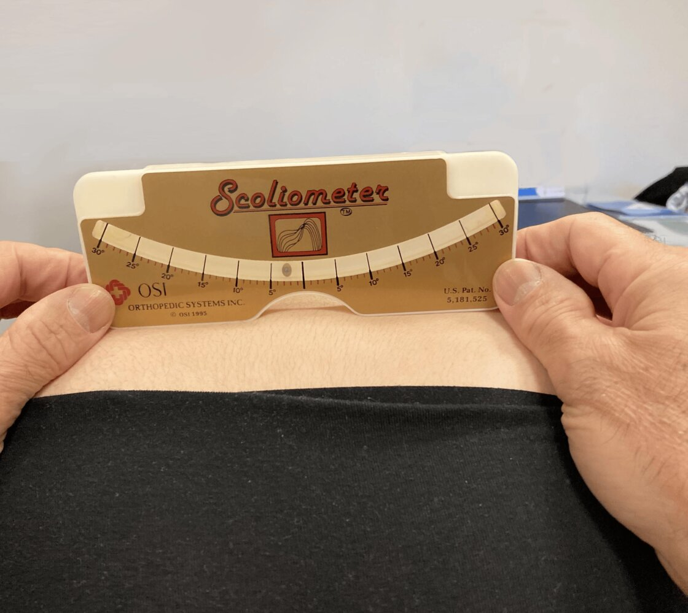
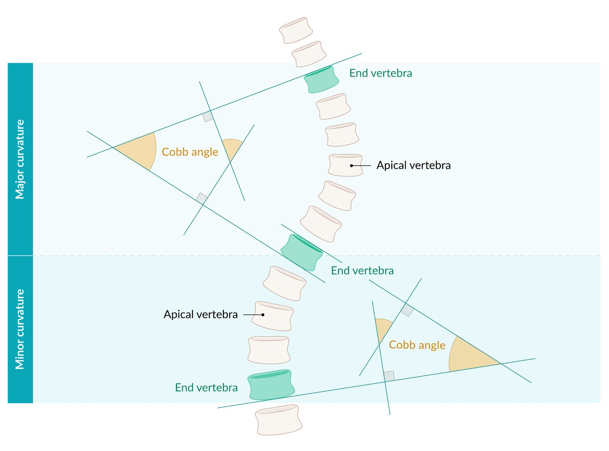
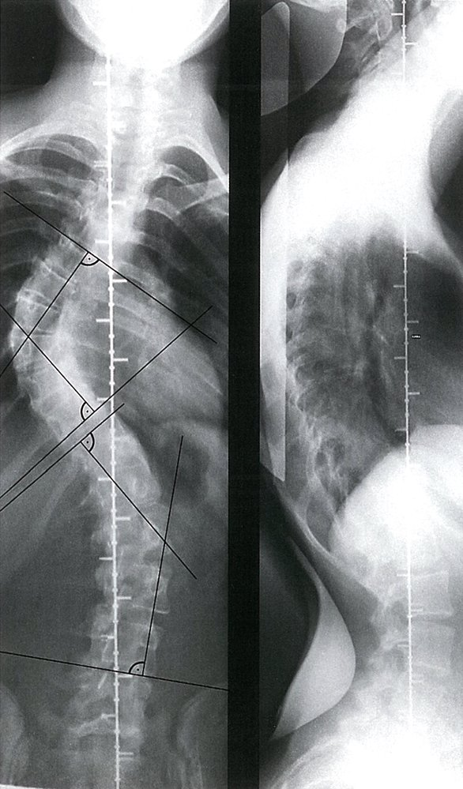
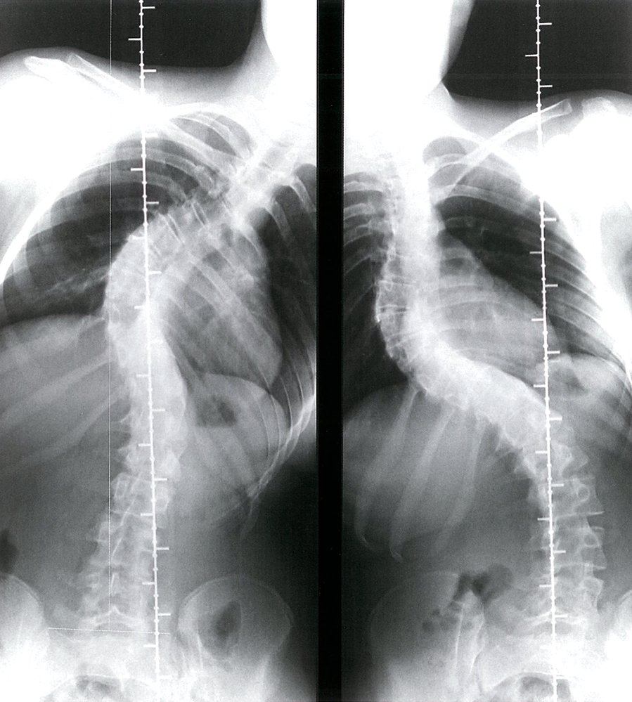
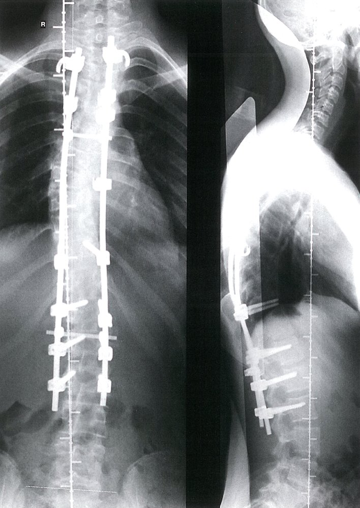

# Idiopathic scoliosis

*Categories: Clinical knowledge > Pediatrics > Pediatric orthopedics and trauma > Idiopathic scoliosis*

[Original Article Link](https://coursology-qbank.com/amboss/article/4Q03wf)

---

## Summary

<u>Idiopathic</u> scoliosis is a <u>lateral</u> curvature of the <u>spine</u> with a <u>Cobb angle</u> ≥ 10° on <u>x-ray</u> with no organic underlying cause. Simultaneous rotation of the involved <u>vertebrae</u> also occurs. The most common classification is <u>adolescent idiopathic scoliosis</u>, which occurs between 10 and 18 years of age, is more common in girls, and typically manifests with a right <u>convex</u> thoracic curvature. Mild scoliosis is usually asymptomatic and only suspected on routine screening. The diagnosis is confirmed with spinal <u>x-rays</u>. Patients with <u>red flags for scoliosis</u> should be evaluated for nonidiopathic causes and treated as indicated. <u>Management of idiopathic scoliosis</u> is based on the classification, degree of curvature, and remaining growth potential. Options include regular monitoring, <u>physical therapy</u>, and interventions to prevent progression (i.e., with bracing and/or <u>surgery</u>). Progression of <u>idiopathic</u> scoliosis to a severe curvature may cause <u>pain</u>, functional impairment, and/or thoracic restriction (e.g., pulmonary disorders and <u>heart failure</u>).

---

## Epidemiology

* Sex: <u>♀</u> > <u>♂</u> (∼ 5:1)

* The spinal curvature deformity can progress in skeletally immature patients as they grow.

Epidemiological data refers to the US, unless otherwise specified.

---

## Etiology

* Exact etiology unknown

* Genetic factors are likely

* Possible causes

* Mismatch in growth of <u>dorsal</u> and <u>ventral</u> parts of the <u>vertebrae</u>: growth of <u>vertebral arches</u> lags behind that of <u>vertebral bodies</u> → impaired longitudinal growth with rotation of <u>vertebrae</u> → <u>lateral</u> curvature of the <u>spine</u>

* Primary muscle or <u>connective tissue disorders</u>

* Abnormal <u>growth hormone</u> secretion

---

## Classification

### Classification by age [[4]](https://coursology-qbank.com/amboss/article/pQ0LCf)[[5]](https://coursology-qbank.com/amboss/article/oNd0Xq0)[[6]](https://coursology-qbank.com/amboss/article/OC1IHQ0)

* Infantile idiopathic scoliosis

* <u>Epidemiology</u>: 0–3 years of age (<u>♂</u> = <u>♀</u>)

* Often manifests as a left <u>convex</u> thoracic curvature

* Usually resolves spontaneously without treatment [[7]](https://coursology-qbank.com/amboss/article/zNdrdq0)

* Juvenile idiopathic scoliosis [[5]](https://coursology-qbank.com/amboss/article/oNd0Xq0)[[6]](https://coursology-qbank.com/amboss/article/OC1IHQ0)

* <u>Epidemiology</u>: 4–9 years of age (<u>♀</u> > <u>♂</u>)  [[6]](https://coursology-qbank.com/amboss/article/OC1IHQ0)

* <u>Levocurvature</u> most common in children ≤ 6 years of age; <u>dextrocurvature</u> most common in children > 6 years of age [[6]](https://coursology-qbank.com/amboss/article/OC1IHQ0)

* <u>Surgery</u> often required if the curve is ≥ 30° at the start of <u>puberty</u> [[6]](https://coursology-qbank.com/amboss/article/OC1IHQ0)

* Deteriorates progressively and may cause cardiopulmonary complications

* Adolescent idiopathic scoliosis (also called “<u>late-onset idiopathic scoliosis</u>”) [[5]](https://coursology-qbank.com/amboss/article/oNd0Xq0)

* <u>Epidemiology</u>: 10–18 years of age (<u>♀</u> > <u>♂</u>) [[4]](https://coursology-qbank.com/amboss/article/pQ0LCf)[[5]](https://coursology-qbank.com/amboss/article/oNd0Xq0)

* Most common type of <u>idiopathic</u> scoliosis (affects up to 3% of all <u>adolescents</u>) [[4]](https://coursology-qbank.com/amboss/article/pQ0LCf)[[5]](https://coursology-qbank.com/amboss/article/oNd0Xq0)[[8]](https://coursology-qbank.com/amboss/article/YNdn-J0)

* Usually manifests as a right <u>convex</u> thoracic curvature

* Adult <u>idiopathic</u> scoliosis: the persistence or progression of childhood <u>idiopathic</u> scoliosis

> [!TIP]
> Early-onset <u>idiopathic</u> scoliosis, which occurs before the age of 10 years, consists of <u>infantile idiopathic scoliosis</u> and <u>juvenile idiopathic scoliosis</u>. [[9]](https://coursology-qbank.com/amboss/article/UpdbKI0)

### Classification by location

* Cervical: C2 to C6

* Cervicothoracic: C7 to T1

* Thoracic: T2 to T11

* Thoracolumbar: T12 to L1

* Lumbar: L2 to L4

* Lumbosacral: L5 or below

---

## Clinical features

<u>Idiopathic</u> scoliosis is often asymptomatic and identified during <u>well-child examinations</u> or <u>scoliosis screening</u>. [[2]](https://coursology-qbank.com/amboss/article/bNdH-J0)[[5]](https://coursology-qbank.com/amboss/article/oNd0Xq0)

* Abnormal posture

* Anatomical asymmetries on visual inspection  

* Uneven shoulders, hips, waistline, and/or <u>skin</u> folds

* Unilateral <u>scapula</u> protrusion

* Uneven paravertebral muscles (may be the only abnormality in lumbar scoliosis)

* Spinal curvature: a single C-shaped or compensatory S-shaped curvature  [[10]](https://coursology-qbank.com/amboss/article/MNdMbq0)

* Mild <u>pain</u>

> [!TIP]
> Severe scoliosis may cause <u>symptoms of respiratory distress</u> and/or <u>symptoms of heart failure</u> due to thoracic restriction. [[5]](https://coursology-qbank.com/amboss/article/oNd0Xq0)

---

## Diagnosis

### Approach [[5]](https://coursology-qbank.com/amboss/article/oNd0Xq0)[[11]](https://coursology-qbank.com/amboss/article/aNdQ-J0)

* Obtain a focused history and <u>physical examination</u> to assess for:

* <u>Red flags for scoliosis</u>

* <u>Nonidiopathic causes of scoliosis</u>

* Remaining growth potential (e.g., with <u>Tanner stage</u>, age at <u>menarche</u>)  [[5]](https://coursology-qbank.com/amboss/article/oNd0Xq0)

* Inspect the patient's back and perform an <u>Adam forward bend test</u>, preferably with <u>scoliometer</u> measurements.

* Obtain an <u>x-ray</u> in individuals with either of the following:

* Abnormal findings on visual inspection, especially if <u>scoliometer</u> is unavailable

* Angle of trunk rotation ≥ 5° or ≥ 7° (cut-offs differ) with a <u>scoliometer</u> [[5]](https://coursology-qbank.com/amboss/article/oNd0Xq0)[[8]](https://coursology-qbank.com/amboss/article/YNdn-J0)

* In individuals with <u>red flags for scoliosis</u>, consider an <u>MRI</u> <u>spine</u> to evaluate for an underlying cause and complications. [[12]](https://coursology-qbank.com/amboss/article/tcWXV40)

### <u>Adam forward bend test</u> [[2]](https://coursology-qbank.com/amboss/article/bNdH-J0)[[5]](https://coursology-qbank.com/amboss/article/oNd0Xq0)[[8]](https://coursology-qbank.com/amboss/article/YNdn-J0)

In addition to asymmetries on visual inspection (see “Clinical features”), findings include the following:

* A thoracic <u>rib</u> hump on the <u>convex</u> side (<u>dextroconvex</u> in 90% of patients) [[4]](https://coursology-qbank.com/amboss/article/pQ0LCf)

* A lumbar hump on the <u>convex</u> side (typically <u>levoconvex</u>)

* Angle of trunk rotation ≥ 5° or ≥ 7° (cut-offs vary) on <u>scoliometer measurement</u> (if available)   [[5]](https://coursology-qbank.com/amboss/article/oNd0Xq0)[[8]](https://coursology-qbank.com/amboss/article/YNdn-J0)

> [!TIP]
> <u>Adolescent idiopathic scoliosis</u> is most commonly a thoracic <u>dextroscoliosis</u> that manifests with a right <u>rib</u> hump, elevated right shoulder, and protruding right <u>scapula</u>. [[2]](https://coursology-qbank.com/amboss/article/bNdH-J0)[[4]](https://coursology-qbank.com/amboss/article/pQ0LCf)[[5]](https://coursology-qbank.com/amboss/article/oNd0Xq0)

> [!TIP]
> Suspect <u>leg length discrepancy</u> in patients with uneven iliac crests when standing and normal findings on the <u>Adam forward bend test</u>. [[5]](https://coursology-qbank.com/amboss/article/oNd0Xq0)

Idiopathic scoliosis

Right convex thoracic scoliosis

Right convex thoracic scoliosis

Scoliometer

### Scoliosis x-ray [[12]](https://coursology-qbank.com/amboss/article/tcWXV40)

* Modality

* Standing full-length <u>x-ray</u> (PA and <u>lateral</u> view) of the thoracic and <u>lumbar spine</u>, <u>sacrum</u>, and <u>pelvis</u>   [[3]](https://coursology-qbank.com/amboss/article/uNdp1q0)[[5]](https://coursology-qbank.com/amboss/article/oNd0Xq0)

* <u>Lateral</u> view not needed for follow-up imaging [[5]](https://coursology-qbank.com/amboss/article/oNd0Xq0)

* Findings

* Cobb angle: a radiographic measurement to assess degree of spinal curvature   [[8]](https://coursology-qbank.com/amboss/article/YNdn-J0) 

* Normal: < 10°

* Mild scoliosis: 10–24°

* Moderate scoliosis: 25–49°

* Severe scoliosis: ≥ 50°

* Risser stage: a radiographic measurement of <u>ossification</u> of the iliac <u>apophysis</u> used to estimate skeletal maturity and remaining growth potential [[2]](https://coursology-qbank.com/amboss/article/bNdH-J0)[[4]](https://coursology-qbank.com/amboss/article/pQ0LCf)[[17]](https://coursology-qbank.com/amboss/article/mNdVbq0)

> [!TIP]
> An orthopedic specialist may order a <u>bone age</u> to further assess skeletal maturity and remaining growth potential. [[18]](https://coursology-qbank.com/amboss/article/M6dMlI0)

Cobb angle

Right convex thoracic scoliosis

Lateral bending (side bending) radiographs in thoracic scoliosis

---

## Differential diagnoses

### Nonidiopathic scoliosis [[5]](https://coursology-qbank.com/amboss/article/oNd0Xq0)[[6]](https://coursology-qbank.com/amboss/article/OC1IHQ0)[[11]](https://coursology-qbank.com/amboss/article/aNdQ-J0)[[12]](https://coursology-qbank.com/amboss/article/tcWXV40)

* Congenital scoliosis: congenital <u>vertebral</u> <u>malformations</u> (e.g., from unilateral fusion of L5 with the <u>sacrum</u>)

* Neuromuscular scoliosis [[1]](https://coursology-qbank.com/amboss/article/oQ00Cf)

* <u>Cerebral palsy</u>

* <u>Muscular dystrophy</u>

* <u>Spina bifida</u>

* <u>Friedreich ataxia</u> [[19]](https://coursology-qbank.com/amboss/article/VpdGoI0)

* Syndromic scoliosis

* <u>Connective tissue disease</u> (e.g., <u>Marfan syndrome</u>, <u>Ehlers Danlos syndrome</u>, <u>osteogenesis imperfecta</u>)

* <u>Neurofibromatosis type 1</u>

* Functional scoliosis: an apparent curvature of the <u>spine</u> not caused by a structural abnormality of the <u>spine</u> [[2]](https://coursology-qbank.com/amboss/article/bNdH-J0)[[3]](https://coursology-qbank.com/amboss/article/uNdp1q0)

* Congenital functional scoliosis: occurs during the first months of life

* Typically C-shaped with elongated leftward thoracolumbar curvature and only a small degree of rotation

* Usually resolves spontaneously

* Nonspinal anatomical abnormalities (e.g., <u>leg length discrepancy</u>, trauma, tumors)

* Muscular imbalances (e.g., poor posture, <u>pain</u>, muscle spasms, <u>muscle weakness</u>)

* Other

* Metabolic diseases (e.g., <u>rickets</u>)

* Spinal tumors

* <u>Spinal infections</u>

* <u>Adult degenerative scoliosis</u>

#### Adult degenerative scoliosis [[20]](https://coursology-qbank.com/amboss/article/yNdddq0)[[21]](https://coursology-qbank.com/amboss/article/p6dLNI0)

* <u>Epidemiology</u>: typically occurs after 50 years of age [[20]](https://coursology-qbank.com/amboss/article/yNdddq0)

* Etiology: degenerative changes to the <u>spine</u>

* <u>Degenerative disc disease</u>

* <u>Facet joint osteoarthritis</u>

* Clinical features

* <u>Pain</u> (90% of patients) [[21]](https://coursology-qbank.com/amboss/article/p6dLNI0)

* Commonly affects the lumbar region (loss of lumbar <u>lordosis</u> may be present)

* Neurological symptoms (e.g., <u>clinical features of spinal stenosis</u>, <u>radiculopathy</u>)

* Diagnosis

* All patients: <u>scoliosis x-ray</u> in both standing and <u>supine</u> positions

* Individuals with neurological symptoms: <u>MRI</u> <u>spine</u>, <u>CT myelogram</u>

* See “<u>Diagnosis of scoliosis</u>.”

* Management

* Nonsevere symptoms

* Weight loss (if indicated)

* <u>Physical therapy</u>

* <u>Analgesia</u> (see “<u>Conservative management of nonspecific back pain</u>”)

* Epidural or <u>nerve root</u> injections

* Severe neurological symptoms, refractory <u>pain</u>, or curve progression

* Referral to a <u>spine</u> specialist

* Surgical management (e.g., decompression, <u>laminectomy</u>, <u>spinal fusion</u>)

> [!TIP]
> Adult scoliosis is typically caused by adult <u>idiopathic</u> scoliosis or de novo <u>adult degenerative scoliosis</u>. [[20]](https://coursology-qbank.com/amboss/article/yNdddq0)

> [!TIP]
> Bracing in adults may temporarily relieve <u>pain</u> but does not prevent curve progression and may contribute to paraspinal muscle <u>deconditioning</u>. [[21]](https://coursology-qbank.com/amboss/article/p6dLNI0)

The differential diagnoses listed here are not exhaustive.

---

## Management

### Approach [[4]](https://coursology-qbank.com/amboss/article/pQ0LCf)[[5]](https://coursology-qbank.com/amboss/article/oNd0Xq0)[[18]](https://coursology-qbank.com/amboss/article/M6dMlI0)

* Management varies based on the remaining growth potential and degree of spinal curvature on <u>X-ray</u>.

* Refer to a <u>spine</u> specialist (e.g., neurosurgery, orthopedics) for further management for either:

* <u>Red flags for scoliosis</u>  [[11]](https://coursology-qbank.com/amboss/article/aNdQ-J0)[[12]](https://coursology-qbank.com/amboss/article/tcWXV40)

* <u>Cobb angle</u> ≥ 20°  [[4]](https://coursology-qbank.com/amboss/article/pQ0LCf)[[5]](https://coursology-qbank.com/amboss/article/oNd0Xq0)[[18]](https://coursology-qbank.com/amboss/article/M6dMlI0)

* In individuals without <u>red flags</u> and a <u>Cobb angle</u> 10–24°, observation is recommended.  [[4]](https://coursology-qbank.com/amboss/article/pQ0LCf)[[5]](https://coursology-qbank.com/amboss/article/oNd0Xq0)[[18]](https://coursology-qbank.com/amboss/article/M6dMlI0)

* Treat any associated symptoms (e.g., mild <u>back pain</u>); see “<u>Nonopioid oral analgesia in children</u>.”

> [!TIP]
> The risk for curve progression is increased in individuals with a <u>Cobb angle</u> of ≥ 20° if skeletally immature and > 50° if skeletally mature. [[4]](https://coursology-qbank.com/amboss/article/pQ0LCf)[[12]](https://coursology-qbank.com/amboss/article/tcWXV40)[[22]](https://coursology-qbank.com/amboss/article/dpdooI0)

### Observation [[4]](https://coursology-qbank.com/amboss/article/pQ0LCf)[[5]](https://coursology-qbank.com/amboss/article/oNd0Xq0)[[18]](https://coursology-qbank.com/amboss/article/M6dMlI0)

* Indication: Indicated for <u>Cobb angle</u> 10–24°

* Method

* Monitor with repeat examination and/or <u>x-rays</u> every 6 months until the patient has no remaining growth potential. [[4]](https://coursology-qbank.com/amboss/article/pQ0LCf)[[5]](https://coursology-qbank.com/amboss/article/oNd0Xq0)[[18]](https://coursology-qbank.com/amboss/article/M6dMlI0)

* Refer to orthopedics (if not already done) if curvature progresses.

### Interventions for scoliosis [[4]](https://coursology-qbank.com/amboss/article/pQ0LCf)[[5]](https://coursology-qbank.com/amboss/article/oNd0Xq0)[[18]](https://coursology-qbank.com/amboss/article/M6dMlI0)

* Bracing

* Indication: <u>Cobb angle</u> 25–45° in patients with remaining growth potential [[18]](https://coursology-qbank.com/amboss/article/M6dMlI0)

* Modalities: a rigid thoracolumbosacral <u>orthosis</u> worn for ≥ 13 hours/day [[18]](https://coursology-qbank.com/amboss/article/M6dMlI0)

* May combine with scoliosis-specific <u>physical therapy</u> exercises

* <u>Surgery</u>

* Indication: <u>Cobb angle</u> greater than 45–50° [[18]](https://coursology-qbank.com/amboss/article/M6dMlI0)

* Modalities: <u>posterior</u> <u>spinal fusion</u> (techniques vary)

> [!TIP]
> The goal of bracing and <u>surgery</u> is to limit or prevent the progression of scoliosis. [[5]](https://coursology-qbank.com/amboss/article/oNd0Xq0)[[18]](https://coursology-qbank.com/amboss/article/M6dMlI0)

Posterior spinal fusion with instrumentation

---