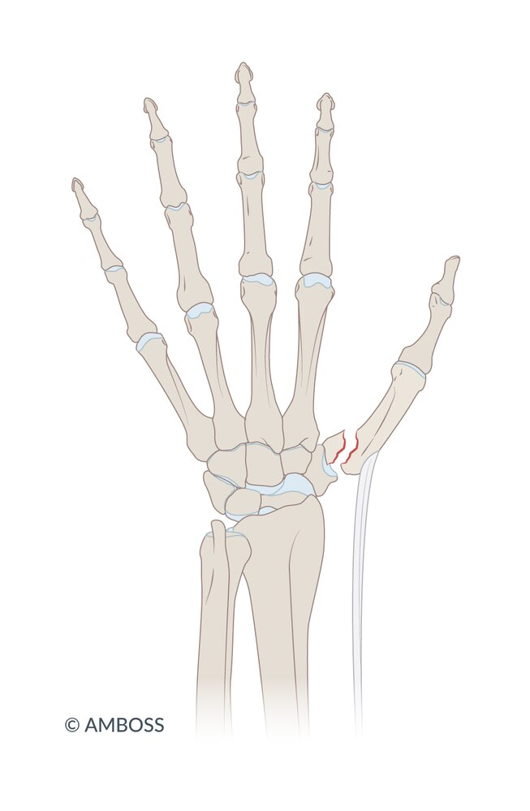
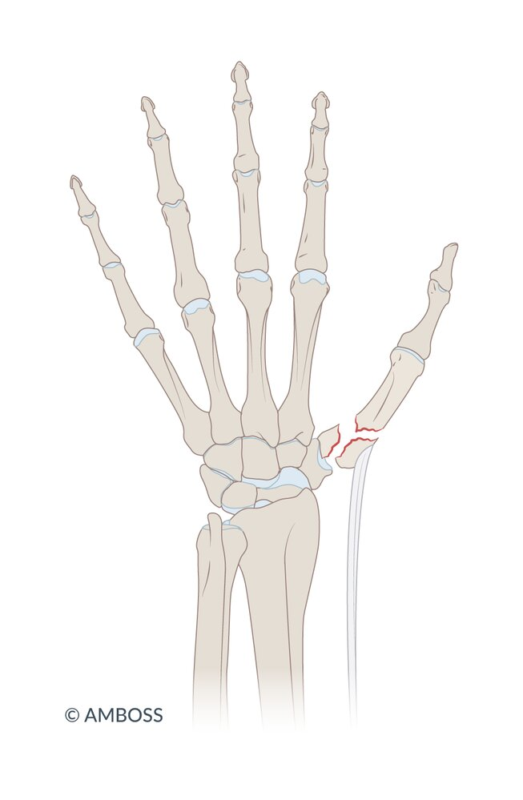
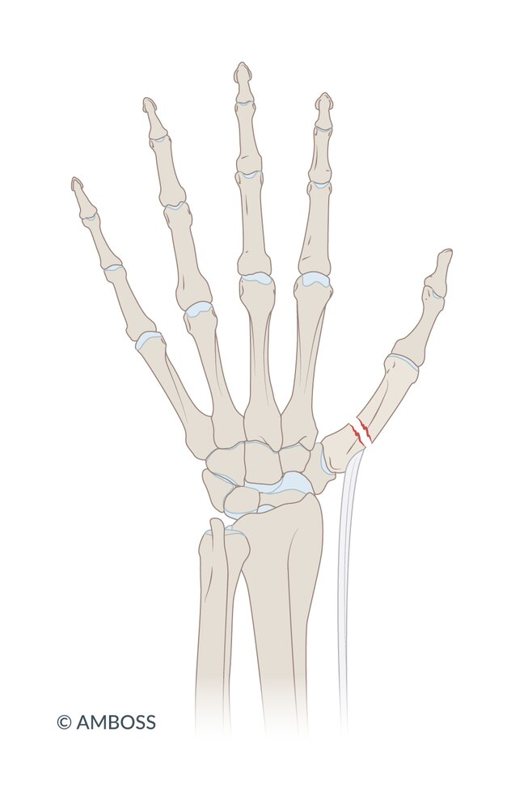
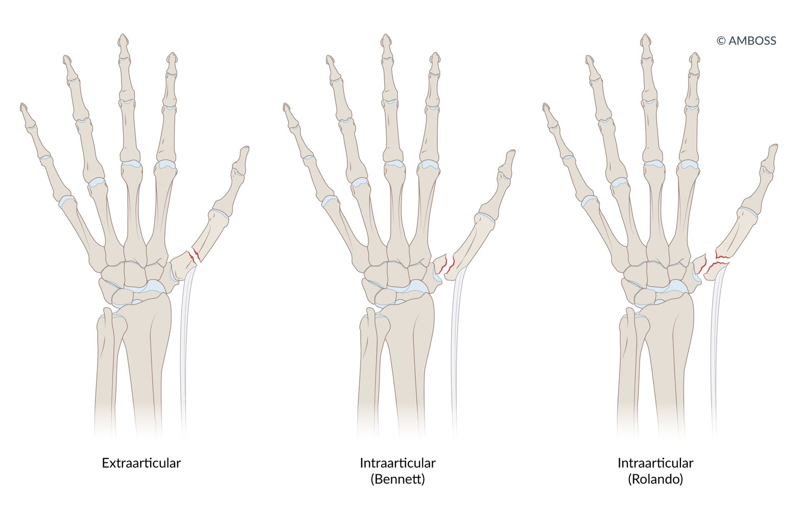
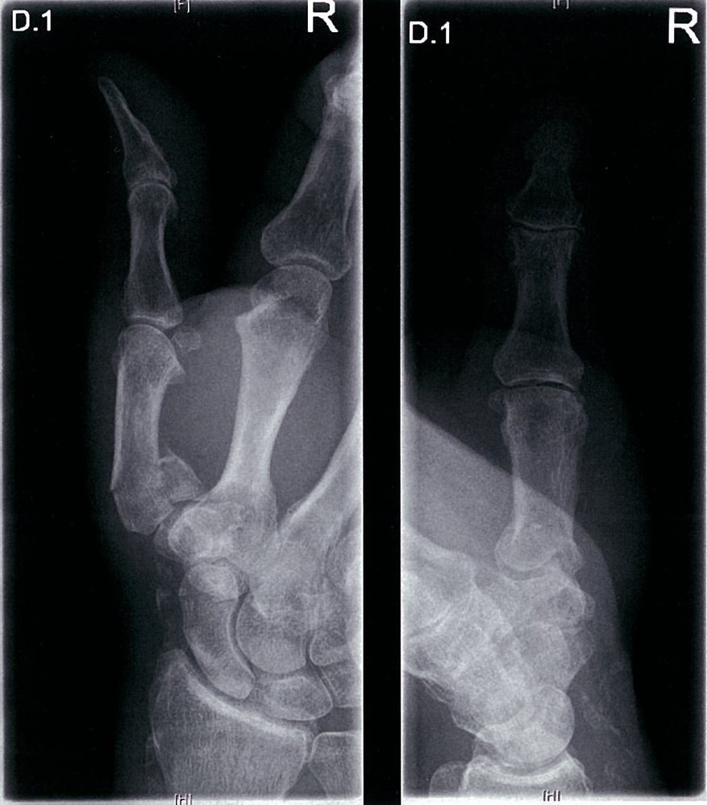
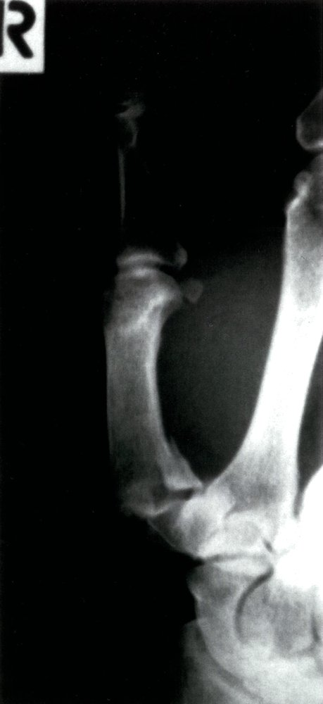
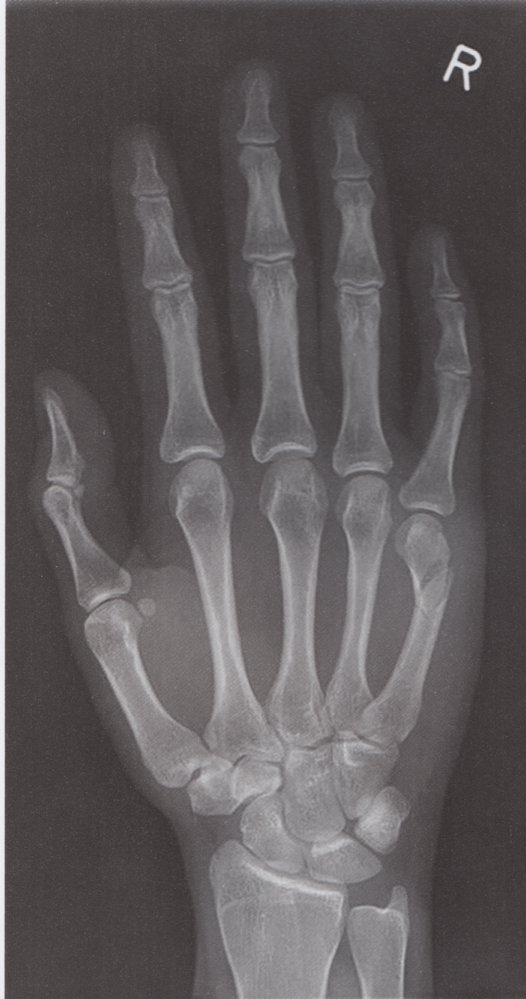
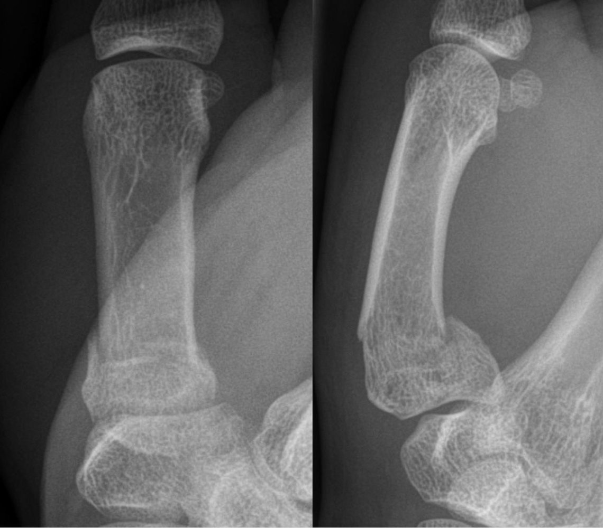
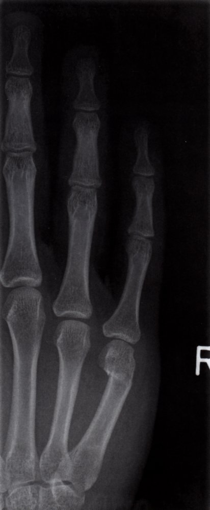

# Metacarpal fractures

*Categories: Clinical knowledge > Pediatrics > Pediatric orthopedics and trauma > Metacarpal fractures*

[Original Article Link](https://coursology-qbank.com/amboss/article/Wl0PDT)

---

## Summary

<u>Metacarpal</u> <u>fractures</u> are caused by direct or indirect trauma to <u>metacarpal bones</u> and account for approximately 30% of all hand <u>fractures</u>. <u>Metacarpal</u> <u>fractures</u> may occur at the <u>metacarpal</u> head, neck, base, or shaft. Because <u>fracture</u> of the 4th or 5th <u>metacarpal</u> neck most commonly occurs when a clenched fist comes in contact with a solid object, this type of <u>metacarpal</u> <u>fracture</u> is also known as a <u>boxer's fracture</u>. Clinical features include general <u>fracture signs</u> (e.g., <u>pain</u>, swelling, tenderness, reduced <u>range of motion</u>), incomplete grip, and, in some cases, deformity. An <u>x-ray</u> of the hand usually confirms a <u>metacarpal</u> <u>fracture</u> and may be used to identify associated <u>joint</u> <u>dislocation</u>. Treatment is predominantly conservative and involves reduction and <u>immobilization</u>. Surgical treatment is required for severe cases (e.g., <u>open fractures</u>, intraarticular <u>fractures</u>, malalignment). Complications include permanent deformity, <u>osteoarthritis</u>, and reduced grip strength.

---

## Etiology

* Direct or indirect trauma to the <u>metacarpal bones</u>;  (e.g., a fall, striking a firm object with a clenched fist, forced hyperextension or rotation of the <u>joints</u>)

* <u>Fatigue fractures</u> in rare cases (e.g., <u>stress</u> injuries in athletes, occupational injuries due to repetitive strain)

* Common mechanisms of injury

* Direct trauma → transverse <u>fracture</u>

* Torsional trauma → oblique or spiral <u>fracture</u>

* Crush injury → <u>comminuted fracture</u>

---

## Classification

* Anatomical location

* <u>Fractures</u> of the <u>metacarpal</u> head, neck, base, and shaft

* A <u>fracture</u> of the 4th or 5th <u>metacarpal</u> neck is called a boxer's fracture because it is usually caused by a closed fist forcibly coming into contact with a solid surface.

* Type of <u>fracture</u>: transverse, oblique, spiral, comminuted (see “<u>Fracture classification</u>” in “<u>General principles of fractures</u>”)

* First <u>metacarpal</u> <u>fractures</u> 

* Intraarticular

* Type I metacarpal base fracture (<u>Bennett fracture-dislocation</u>) 

* Two-part <u>fracture</u> of the <u>metacarpal</u> base

* The 1st <u>metacarpal</u> shaft fragment is radially and proximally <u>dislocated</u> by the pull of the <u>abductor pollicis longus muscle</u>.

* Type II metacarpal base fracture (<u>Rolando fracture</u>) 

* <u>Comminuted fracture</u> of the <u>metacarpal</u> base

* The fragments often form a T- or Y-shaped pattern.

* Extraarticular

* Type III metacarpal base fracture: transverse or oblique <u>fracture</u> of the <u>metacarpal</u> base

* Type IV metacarpal base fracture: a pediatric physeal <u>fracture</u>, most commonly a type II <u>Salter-Harris fracture</u> (see “<u>Pediatric fractures</u>”)

Metacarpal bones

Bennett first metacarpal base fracture

Rolando first metacarpal base fracture

Extraarticular first metacarpal base fracture

Classification of first metacarpal base fractures

---

## Diagnosis

* <u>X-ray</u> [[1]](https://coursology-qbank.com/amboss/article/NJX-8_)

* Definitive diagnosis typically requires three radiographic views: anteroposterior, <u>lateral</u>, and oblique

* Additional radiographic views for specific injuries

* 1st <u>metacarpal</u> <u>fractures</u>

* Visualization of the 1st <u>CMC joint</u>: true anteroposterior view (Robert view) in full <u>pronation</u>

* <u>Bennett fracture-dislocation</u>: true <u>lateral</u> view (Bett view)

* 2nd–5th <u>metacarpal</u> base <u>fractures</u>

* Visualization of the 2nd–3rd <u>CMC joints</u>: semipronated oblique view

* Visualization of the 4th–5th <u>CMC joints</u>: semisupinated oblique view

* CT: only indicated for severe <u>fractures</u>, <u>CMC joint</u> <u>dislocation</u>, and intraarticular <u>fractures</u> with bone fragmentation

* Musculoskeletal <u>ultrasound</u>: may be performed in linear areas of bone (e.g., <u>diaphysis</u>/<u>metaphysis</u> of the <u>metacarpals</u>)

Rolando fracture

Bennett fracture

Fracture of the fifth metacarpal 1/2

Fracture of the fifth metacarpal 2/2

Extraarticular metacarpal fracture

Boxer fracture

---

## Treatment

* General

* See “<u>General fracture care</u>” in “<u>General principles of fractures</u>.”

* Ensure concomitant injuries and/or infections are also treated.

* <u>Conservative treatment</u> [[1]](https://coursology-qbank.com/amboss/article/NJX-8_)

* Indication

* Simple, closed, and stable <u>metacarpal</u> <u>fractures</u>

* Mild deformity is often preferable to surgical treatment.

* Treatment options

* <u>Closed reduction</u>, if necessary

* <u>Immobilization</u> for approx. 4 weeks, depending on <u>physical examination</u> findings 

* 1st <u>metacarpal</u> <u>fractures</u>: short-arm <u>thumb spica splint</u>

* 2nd–4th <u>metacarpal</u> <u>fractures</u>: <u>palmar</u> wrist <u>splint</u>/cast

* 5th <u>metacarpal</u> <u>fractures</u> : <u>ulnar gutter splint</u>/cast or twin taping to the ring finger

* Surgical treatment [[2]](https://coursology-qbank.com/amboss/article/HqXK-_)

* Indication

* <u>Open fractures</u>

* Intraarticular <u>fractures</u> occupying > 25% of the articular surface [[1]](https://coursology-qbank.com/amboss/article/NJX-8_)

* Displaced <u>fractures</u> with a step-off of > 1 mm or subluxation/<u>dislocation</u> of the <u>CMC joint</u>

* Deformities leading to functional impairment: severe angulation , shortening  , or malrotation [[3]](https://coursology-qbank.com/amboss/article/mqXV__)

* Treatment options: <u>fracture</u> fixation with <u>K-wires</u>, interfragmentary screws, or mini plates

> [!TIP]
> The majority of <u>metacarpal</u> <u>fractures</u> can be <u>treated conservatively</u>.

---