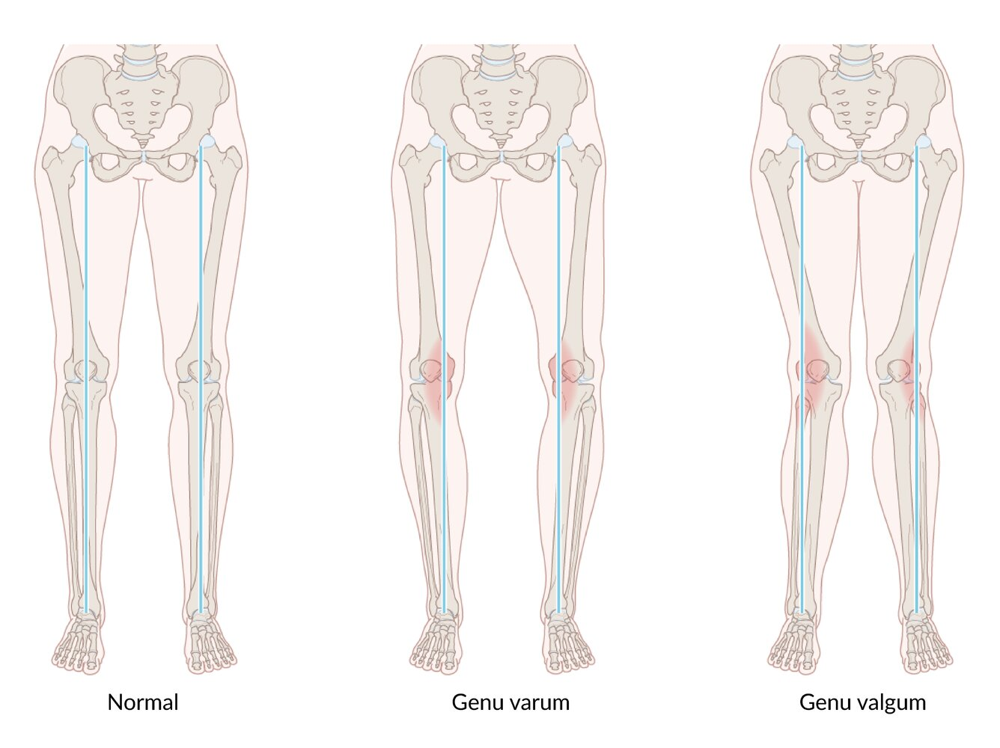

# Osteomalacia and rickets

*Categories: Clinical knowledge > Pediatrics > Pediatric orthopedics and trauma > Osteomalacia and rickets*

[Original Article Link](https://coursology-qbank.com/amboss/article/XT0962)

---

## Summary

<u>Osteomalacia</u> and <u>rickets</u> are disorders of bone mineralization. In <u>osteomalacia</u>, remodeling of preexisting bone is defective; in <u>rickets</u>, new bone formation is defective. <u>Osteomalacia</u> can affect individuals of any age, whereas <u>rickets</u> can only occur in children with open <u>growth plates</u>. <u>Osteomalacia</u> and <u>rickets</u> are caused by insufficient <u>calcium</u>, <u>phosphate</u> depletion, and/or direct inhibition of bone mineralization. The most common cause of both disorders is <u>vitamin D deficiency</u>. Patients with <u>osteomalacia</u> usually present with bone <u>pain</u> and tenderness, while patients with <u>rickets</u> exhibit bone deformities and impaired growth. Over time, both conditions may lead to bowing of the <u>long bones</u> and/or <u>pathological fractures</u>. The diagnosis involves a combination of clinical history, abnormal <u>laboratory studies</u>, and, in many cases, imaging. Treatment, which is directed at the underlying cause, most commonly involves <u>treatment of vitamin D deficiency</u> and ensuring sufficient <u>calcium</u> intake.

---

## Etiology

| Overview of etiologies of <u>rickets</u> and <u>osteomalacia</u> |  |
| --- | --- |
| Mechanism | Underlying causes |
|  Insufficient <u>calcium</u> (calcipenic rickets) [[1]](https://coursology-qbank.com/amboss/article/H31KPg0) |   * <u>Vitamin D deficiency</u> (most common cause): See “<u>Causes of vitamin D deficiency</u>.” [[2]](https://coursology-qbank.com/amboss/article/kIYm1q)  * <u>Vitamin D-dependent rickets type 1</u> [[3]](https://coursology-qbank.com/amboss/article/8dXO7C)  * <u>Vitamin D-dependent rickets type 2</u> [[4]](https://coursology-qbank.com/amboss/article/FdXg7C)  * <u>Calcium</u> deficiency and other <u>causes of hypocalcemia</u>    |
|  <u>Phosphate</u> deficiency (phosphopenic rickets) [[1]](https://coursology-qbank.com/amboss/article/H31KPg0) |   * Renal <u>phosphate</u> wasting due to renal tubular defects (e.g., <u>distal</u> <u>renal tubular acidosis</u>, <u>Fanconi syndrome</u>)  * Chronic use of <u>phosphate binders</u>  * Other <u>causes of hypophosphatemia</u>, e.g.:  * <u>Hereditary hypophosphatemic rickets</u>  * <u>Tumor-induced osteomalacia</u>    |
|  Direct inhibition of bone mineralization [[1]](https://coursology-qbank.com/amboss/article/H31KPg0) |   * Medications, e.g., <u>bisphosphonates</u>, aluminum, <u>fluoride</u>  * Hereditary <u>hypophosphatasia</u>    |

> [!TIP]
> <u>Vitamin D deficiency</u> is the most common cause of both <u>osteomalacia</u> and <u>rickets</u>. <u>Vitamin D</u>-independent causes (i.e., <u>hypophosphatemia</u>, <u>hypocalcemia</u>, medication-induced) and hereditary causes are less common. [[2]](https://coursology-qbank.com/amboss/article/kIYm1q)

---

## Pathophysiology

The <u>causes of osteomalacia and rickets</u> involve at least one of the following mechanisms: [[1]](https://coursology-qbank.com/amboss/article/H31KPg0)[[5]](https://coursology-qbank.com/amboss/article/S31y3g0)

* <u>Calcipenic rickets</u>

* ↓ <u>Calcium</u> → ↑ <u>PTH</u> levels → ↓ <u>phosphate</u> → impaired bone mineralization  [[1]](https://coursology-qbank.com/amboss/article/H31KPg0)[[5]](https://coursology-qbank.com/amboss/article/S31y3g0)

* See “<u>Calcium homeostasis</u>.”

* <u>Phosphopenic rickets</u>: ↓ <u>phosphate</u> → impaired bone mineralization

* Direct inhibition of mineralization → impaired bone mineralization

> [!TIP]
> Impaired bone mineralization can affect both existing <u>bone matrix</u> (<u>osteomalacia</u>) and, if <u>growth plates</u> are still open, new bone formation (<u>rickets</u>).  [[1]](https://coursology-qbank.com/amboss/article/H31KPg0)

> [!TIP]
> Low <u>phosphate</u> is present in both calcipenic and phosphopenic forms of <u>osteomalacia</u> and <u>rickets</u>. [[1]](https://coursology-qbank.com/amboss/article/H31KPg0)[[5]](https://coursology-qbank.com/amboss/article/S31y3g0)

---

## Clinical features

### <u>Osteomalacia</u> [[5]](https://coursology-qbank.com/amboss/article/S31y3g0)

* Occurs in adults and children

* Bone <u>pain</u> and tenderness

* <u>Pathologic fractures</u>

* <u>Myopathy</u> (predominantly <u>proximal</u>)

* <u>Muscle weakness</u> causing <u>waddling gait</u> and difficulty walking

* Spasms

* Cramps

* <u>Symptoms of hypocalcemia</u>

* Severe <u>osteomalacia</u>: bone deformities, e.g., bowing of the lower limbs

> [!TIP]
> <u>Osteomalacia</u> and <u>rickets</u> may be asymptomatic. [[6]](https://coursology-qbank.com/amboss/article/KZWUcP0)[[7]](https://coursology-qbank.com/amboss/article/y31dOg0)

### <u>Rickets</u> [[1]](https://coursology-qbank.com/amboss/article/H31KPg0)

* Only occurs in children (<u>growth plates</u> have not fused)

* Bone deformities

* Bowing, primarily of the <u>long bones</u>

* Distention of the bone-<u>cartilage</u> junctions

* Rachitic rosary: bead-like distention of the bone-<u>cartilage</u> junctions in the <u>ribs</u>

* Marfan sign

* Distention of the <u>epiphyseal plate</u> of the <u>distal</u> <u>tibia</u> with widening and cupping of the <u>metaphysis</u>

* Gives appearance of a double <u>medial malleolus</u> on inspection and palpation of the ankle

* Widened wrists

* Craniotabes: softening of the <u>skull</u>

* Deformities of the knee, especially <u>genu varum</u>    [[1]](https://coursology-qbank.com/amboss/article/H31KPg0)

* Increased risk of <u>fracture</u>

* Harrison groove 

* A <u>depression</u> of the thoracic outlet

* Caused by muscles pulling along the costal insertion of the <u>diaphragm</u>

* Impaired growth

* <u>Symptoms of hypocalcemia</u> including <u>seizures in infants</u>

* Late closing of <u>fontanelles</u>

* Delayed walking (> 18 months)

* <u>Cardiomyopathy</u>

> [!TIP]
> <u>Osteomalacia</u> is defective mineralization of existing bone and can occur in individuals with open or closed <u>growth plates</u>. <u>Rickets</u> is defective mineralization of new bone formation and, therefore, only occurs in children with open <u>growth plates</u> (i.e., before the end of <u>puberty</u>). [[8]](https://coursology-qbank.com/amboss/article/YB1nzQ0)

Rickets secondary to vitamin D deficiency fact sheet

Genu varum and genu valgum

---

## Subtypes and variants

### Vitamin D-dependent rickets type 1 [[1]](https://coursology-qbank.com/amboss/article/H31KPg0)[[3]](https://coursology-qbank.com/amboss/article/8dXO7C)[[9]](https://coursology-qbank.com/amboss/article/fy1kej0)

* Pathophysiology

* <u>Autosomal recessive</u> mutation in the <u>25-hydroxyvitamin-D-1α-hydroxylase</u> <u>gene</u>  [[1]](https://coursology-qbank.com/amboss/article/H31KPg0)

* Leads to impaired conversion of inactive <u>vitamin D</u> to the active form, 1,25‑dihydroxyvitamin D3 (<u>calcitriol</u>)

* Clinical features

* Early onset of <u>rickets</u> (in <u>infancy</u>)

* <u>Muscle weakness</u>

* <u>Growth faltering</u>

* <u>Hypotonia</u>

* <u>Pathological fractures</u>

* Diagnostics [[1]](https://coursology-qbank.com/amboss/article/H31KPg0)[[9]](https://coursology-qbank.com/amboss/article/fy1kej0)[[10]](https://coursology-qbank.com/amboss/article/OC1IHQ0)

* Normal or elevated plasma 25-OH

* Low or undetectable <u>1,25(OH)2D</u>

* <u>Hypocalcemia</u>, <u>hypophosphatemia</u>, and elevated <u>ALP</u>

* Elevated parathyroid <u>hormones</u>

* Treatment: <u>calcitriol</u> supplementation

### Vitamin D-dependent rickets type 2 [[1]](https://coursology-qbank.com/amboss/article/H31KPg0)[[4]](https://coursology-qbank.com/amboss/article/FdXg7C)[[9]](https://coursology-qbank.com/amboss/article/fy1kej0)

* Pathophysiology: : An <u>autosomal recessive</u> mutation in the <u>vitamin D</u> <u>receptor</u> <u>gene</u> causes end-organ resistance to <u>vitamin D</u>.

* Clinical features

* Early onset of <u>rickets</u> (in <u>infancy</u>)

* <u>Growth faltering</u>

* <u>Alopecia</u>

* Diagnostics [[1]](https://coursology-qbank.com/amboss/article/H31KPg0)[[9]](https://coursology-qbank.com/amboss/article/fy1kej0)[[10]](https://coursology-qbank.com/amboss/article/OC1IHQ0)

* Normal or elevated plasma 25-OH

* Extremely elevated plasma <u>1,25(OH)2D</u>

* <u>Hypocalcemia</u>, <u>hypophosphatemia</u>, elevated <u>ALP</u>

* Elevated parathyroid <u>hormones</u>

* Treatment [[1]](https://coursology-qbank.com/amboss/article/H31KPg0)[[9]](https://coursology-qbank.com/amboss/article/fy1kej0)

* Very high-dose <u>vitamin D</u> therapy  [[9]](https://coursology-qbank.com/amboss/article/fy1kej0)

* Refractory disease: elemental <u>calcium</u>

---

## Diagnosis

### General principles [[1]](https://coursology-qbank.com/amboss/article/H31KPg0)[[5]](https://coursology-qbank.com/amboss/article/S31y3g0)[[11]](https://coursology-qbank.com/amboss/article/g31F3g0)

* Diagnosis is based on characteristic laboratory and imaging findings.

* The choice of imaging depends on whether <u>osteomalacia</u> or <u>rickets</u> is suspected.

* If there is diagnostic uncertainty, refer patients to <u>endocrinology</u> for advanced studies.

> [!TIP]
> Diagnostic scoring systems for <u>osteomalacia</u> that include clinical history, biochemical results, and radiological imaging findings have been proposed, but they have not yet been validated. [[5]](https://coursology-qbank.com/amboss/article/S31y3g0)

### <u>Laboratory studies</u> [[1]](https://coursology-qbank.com/amboss/article/H31KPg0)[[5]](https://coursology-qbank.com/amboss/article/S31y3g0)[[12]](https://coursology-qbank.com/amboss/article/s31tPg0)

* Obtain the studies listed in the table below.

* <u>Common laboratory findings in vitamin D deficiency</u> include ↓ Ca, ↓ <u>phosphorus</u>, ↑ <u>PTH</u>, and ↑ <u>ALP</u>).

* If findings are not consistent with <u>osteomalacia</u>/<u>rickets</u>, see “<u>Laboratory evaluation of bone disease</u>.”

|  Laboratory findings in <u>osteomalacia</u> and <u>rickets</u> by etiology [[1]](https://coursology-qbank.com/amboss/article/H31KPg0)[[5]](https://coursology-qbank.com/amboss/article/S31y3g0)[[12]](https://coursology-qbank.com/amboss/article/s31tPg0)  |  |  |
| --- | --- | --- |
| Test | <u>Calcipenic rickets</u> | <u>Phosphopenic rickets</u> |
| <u>Calcium</u>, serum |  * Normal (initially) or ↓   |  * Normal or ↑   |
|  <u>Phosphorus</u>, serum [[1]](https://coursology-qbank.com/amboss/article/H31KPg0)  |  * Normal (initially) or ↓   |  * ↓   |
| <u>Calcium</u>, urine |  * ↓   |  * Variable   |
| <u>Phosphorus</u>, urine |  * Variable   |  * ↑ (unless dietary <u>phosphate</u> deficiency)   |
|  <u>ALP</u>  |  * ↑   |  * ↑   |
| <u>Parathyroid hormone</u> (<u>PTH</u>) |  * ↑   |  * Normal   |
| Serum 25-OH (<u>vitamin D</u> levels) |  * ↓ or normal   |  * Normal   |

> [!TIP]
> <u>PTH</u> is elevated in <u>calcipenic rickets</u> but is typically normal in <u>phosphopenic rickets</u>. [[1]](https://coursology-qbank.com/amboss/article/H31KPg0)

### Imaging

#### Modalities [[1]](https://coursology-qbank.com/amboss/article/H31KPg0)[[12]](https://coursology-qbank.com/amboss/article/s31tPg0)[[13]](https://coursology-qbank.com/amboss/article/f31k3g0)

* <u>X-rays</u>

* Children with open <u>growth plates</u>: <u>x-rays</u> of wrists and knees to evaluate for <u>rickets</u>

* Adults and children with closed <u>growth plates</u>: Consider <u>x-rays</u> of <u>ribs</u>, <u>scapulae</u>, or <u>pelvis</u>.  [[5]](https://coursology-qbank.com/amboss/article/S31y3g0)[[14]](https://coursology-qbank.com/amboss/article/rB1fXj0)

* Additionally, in <u>osteomalacia</u>, consider:

* <u>DEXA</u>

* <u>Bone scintigraphy</u>

#### Imaging findings in osteomalacia and/or rickets [[1]](https://coursology-qbank.com/amboss/article/H31KPg0)[[12]](https://coursology-qbank.com/amboss/article/s31tPg0)[[13]](https://coursology-qbank.com/amboss/article/f31k3g0)

* General

* Evidence of bone loss  [[15]](https://coursology-qbank.com/amboss/article/7314Pg0)

* ↓ <u>Bone mineral density</u> (i.e., <u>osteopenia</u> or <u>osteoporosis</u>)

* Thinned <u>cortical bone</u>

* <u>Pathological fractures</u>

* Looser zones (<u>pseudofractures</u>), which are transverse <u>radiolucent</u> bands that represent insufficiency <u>stress fractures</u> seen in <u>osteomalacia</u> and severe <u>rickets</u>; typical features include: [[13]](https://coursology-qbank.com/amboss/article/f31k3g0)[[15]](https://coursology-qbank.com/amboss/article/7314Pg0)[[16]](https://coursology-qbank.com/amboss/article/5TWirk0)

* Multiple and symmetrical

* Perpendicular to the periosteal surface

* Most often occur in the <u>ribs</u>, <u>scapulae</u>, pubic rami, and <u>medial</u> cortex of <u>long bones</u>

* Additional findings in <u>rickets</u> may include:

* <u>Epiphyseal plate</u> widening

* Metaphyseal cupping, stippling, and fraying

* Bone bowing (e.g., <u>genu varum</u>  )

* <u>Chest x-ray</u>: prominent costochondral junctions of the <u>ribs</u> (i.e., <u>rachitic rosary</u>)

* <u>X-ray</u> <u>skull</u>: persistently widened suture lines (i.e., open <u>fontanelles</u>), occipital flattening, and a more squared appearance

* <u>X-ray</u> <u>spine</u>: spinal curvature

* Additional findings in <u>osteomalacia</u> may include increased uptake on <u>bone scintigraphy</u>. [[15]](https://coursology-qbank.com/amboss/article/7314Pg0)

* Occurs as a result of increased <u>bone turnover</u>

* May mimic <u>metastatic</u> cancer

### Advanced studies [[1]](https://coursology-qbank.com/amboss/article/H31KPg0)[[5]](https://coursology-qbank.com/amboss/article/S31y3g0)[[15]](https://coursology-qbank.com/amboss/article/7314Pg0)

* Indications

* Diagnostic uncertainty

* Rare etiologies suspected e.g.:

* <u>Tumor-induced osteomalacia</u>

* <u>Vitamin D-dependent rickets type I</u> or type II

* Potential studies

* Serum <u>1,25(OH)2D</u> levels

* <u>FGF23</u> levels

* Iliac <u>bone biopsy</u> with <u>tetracycline</u> labeling

---

## Treatment

### General principles [[1]](https://coursology-qbank.com/amboss/article/H31KPg0)[[5]](https://coursology-qbank.com/amboss/article/S31y3g0)[[12]](https://coursology-qbank.com/amboss/article/s31tPg0)

* Treat any acute <u>electrolyte</u> abnormalities, e.g.:

* <u>Calcium repletion</u> for severe and/or symptomatic <u>hypocalcemia</u>

* <u>Phosphate repletion</u>

* Review diet and medication list to look for reversible <u>etiologies of osteomalacia and rickets</u>.

* Determine underlying etiology and refer to a specialist for further management, e.g.:

* <u>Endocrinology</u> for <u>treatment of vitamin D deficiency</u> or other <u>metabolic bone disease</u>

* Nephrology for treatment of underlying renal disease

* Fully complete treatment for underlying <u>osteomalacia</u> before treating other metabolic bone diseases (e.g., <u>osteoporosis</u>). [[6]](https://coursology-qbank.com/amboss/article/KZWUcP0)[[15]](https://coursology-qbank.com/amboss/article/7314Pg0)

* For bone deformities that persist despite medical management, refer to orthopedics for surgical correction. [[21]](https://coursology-qbank.com/amboss/article/Od1IJf0)

### Treatment of <u>vitamin D</u>-associated <u>osteomalacia</u> and <u>rickets</u> [[1]](https://coursology-qbank.com/amboss/article/H31KPg0)[[12]](https://coursology-qbank.com/amboss/article/s31tPg0)[[15]](https://coursology-qbank.com/amboss/article/7314Pg0)

* Pharmacological therapy

* Treatment doses of <u>vitamin D</u> DOSAGE [[5]](https://coursology-qbank.com/amboss/article/S31y3g0)[[11]](https://coursology-qbank.com/amboss/article/g31F3g0)[[22]](https://coursology-qbank.com/amboss/article/yoYdeJ)

* Adequate daily intake of <u>calcium</u> DOSAGE   [[5]](https://coursology-qbank.com/amboss/article/S31y3g0)[[11]](https://coursology-qbank.com/amboss/article/g31F3g0)[[12]](https://coursology-qbank.com/amboss/article/s31tPg0)

* <u>Calcitriol</u> may be required for selected indications.  [[1]](https://coursology-qbank.com/amboss/article/H31KPg0)[[5]](https://coursology-qbank.com/amboss/article/S31y3g0)

* Ongoing management

* Monitoring for clinical features of <u>vitamin D toxicity</u> (uncommon at typical treatment doses) [[11]](https://coursology-qbank.com/amboss/article/g31F3g0)

* Follow-up <u>x-rays</u> and <u>laboratory studies</u> to ensure resolution of abnormalities [[1]](https://coursology-qbank.com/amboss/article/H31KPg0)[[15]](https://coursology-qbank.com/amboss/article/7314Pg0)

* Target serum <u>25(OH)D</u>: > 30 ng/mL [[5]](https://coursology-qbank.com/amboss/article/S31y3g0)

* Target <u>PTH</u> level: normal [[5]](https://coursology-qbank.com/amboss/article/S31y3g0)

* Maintenance dosing of <u>vitamin D</u> for <u>prevention of vitamin D deficiency</u>

> [!TIP]
> In patients with <u>malabsorption</u>, <u>vitamin D</u> and <u>calcium</u> doses may need to be increased or given via alternative routes (i.e., IM/IV). [[5]](https://coursology-qbank.com/amboss/article/S31y3g0)[[11]](https://coursology-qbank.com/amboss/article/g31F3g0)

---