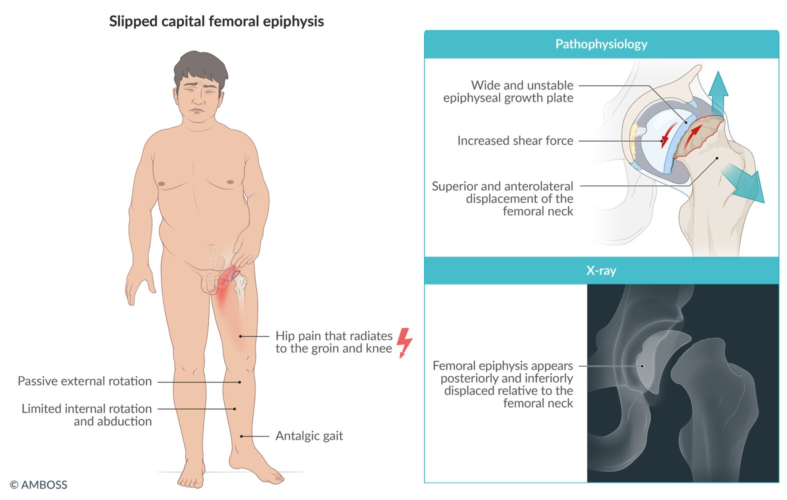
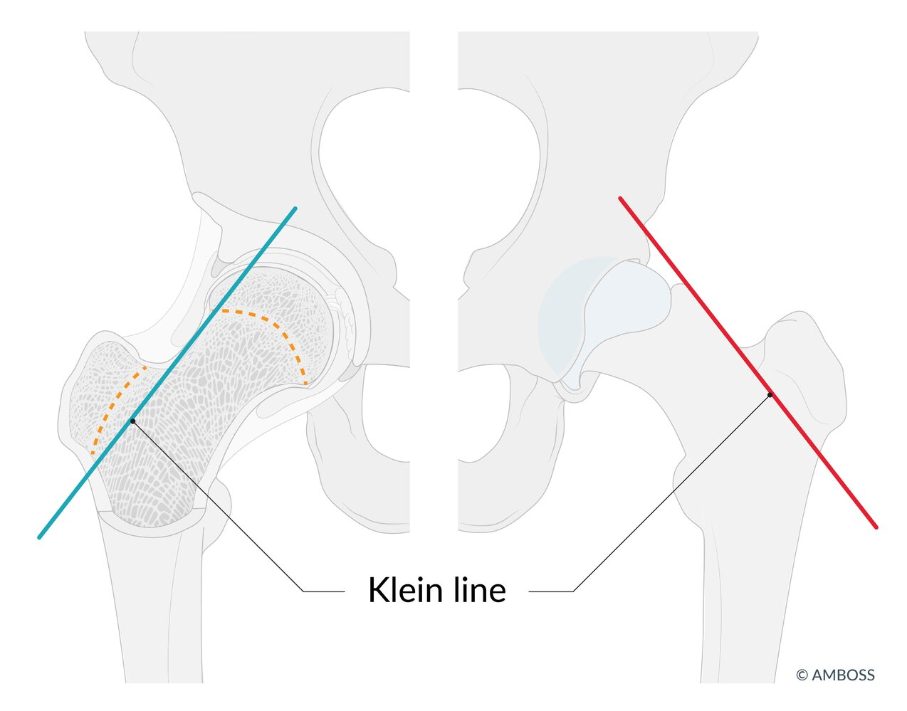
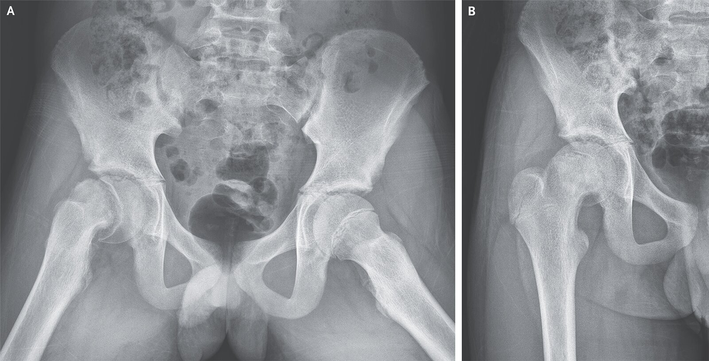
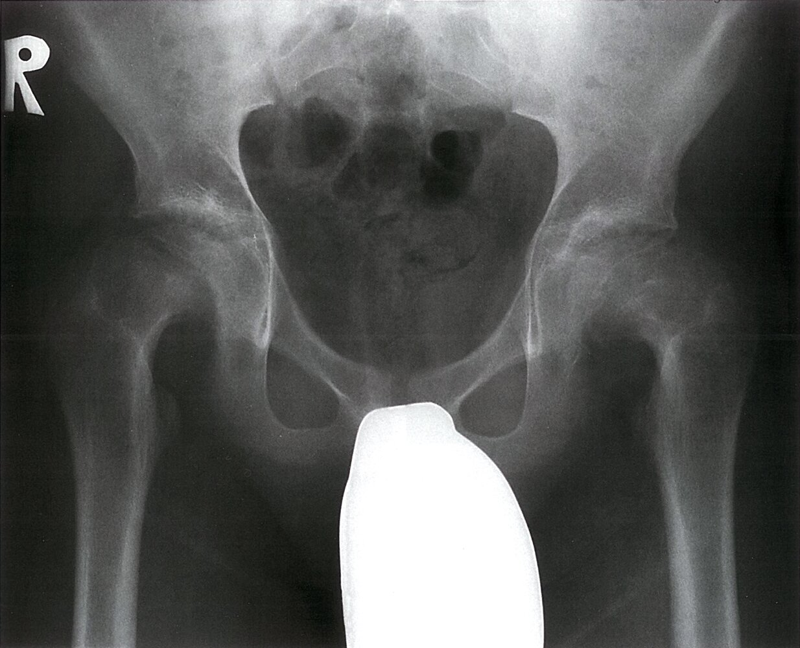
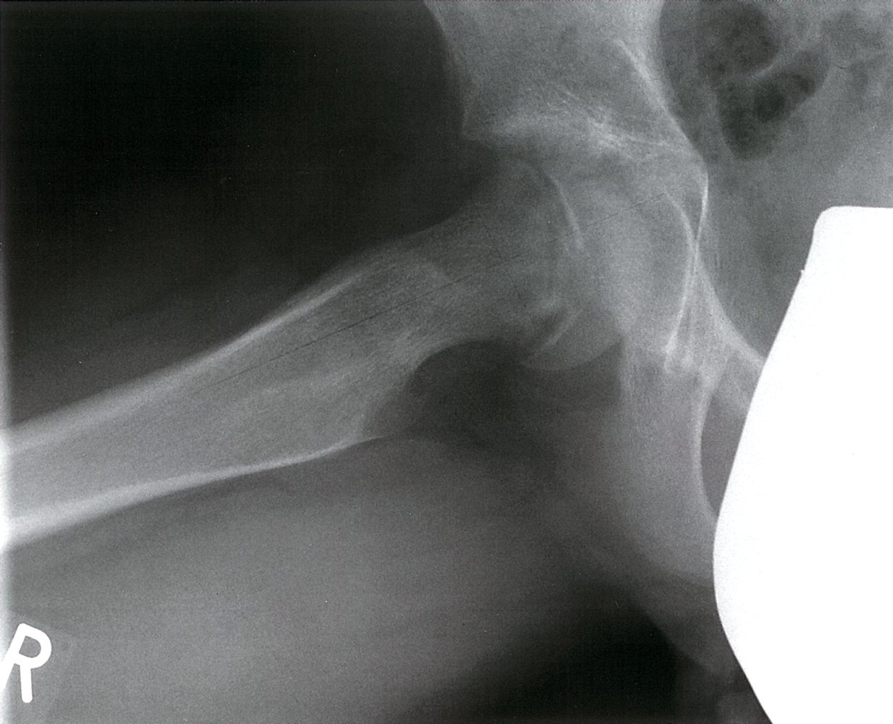
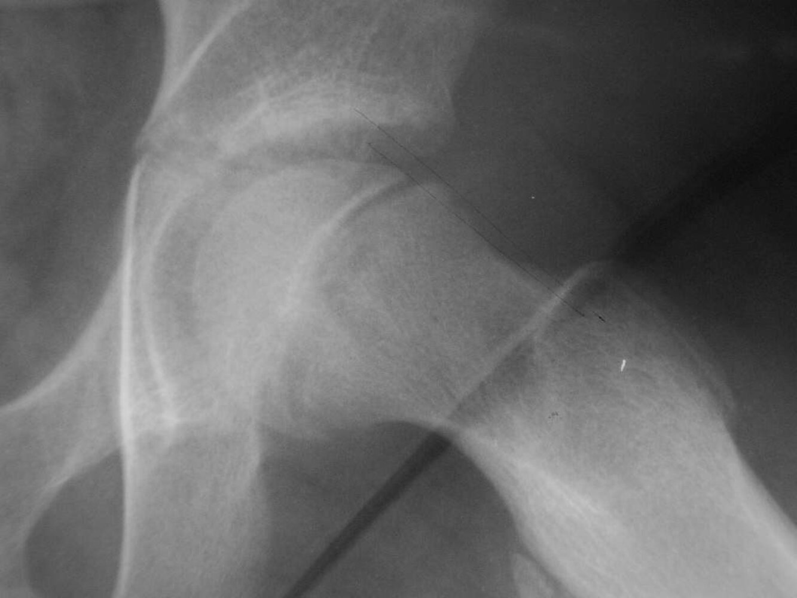
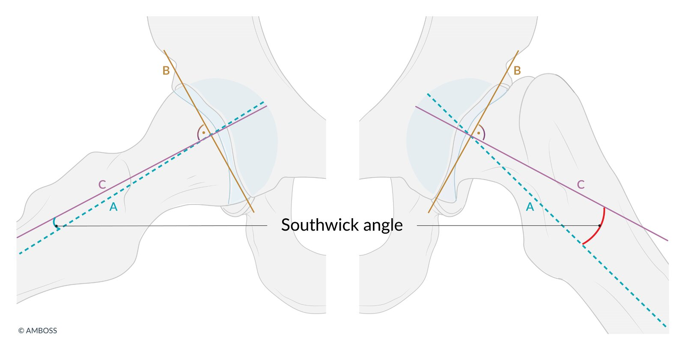
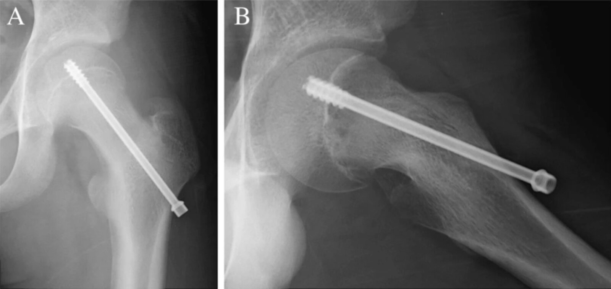

# Slipped capital femoral epiphysis

*Categories: Clinical knowledge > Pediatrics > Pediatric orthopedics and trauma > Slipped capital femoral epiphysis*

[Original Article Link](https://coursology-qbank.com/amboss/article/MQ0M9f)

---

## Summary

Slipped capital femoral epiphysis (SCFE) is the superior and anterolateral displacement of the femoral neck relative to the <u>epiphysis</u> due to weakening of the <u>proximal</u> femoral <u>epiphyseal growth plate</u>. It most commonly occurs in boys aged 10–16 years. The etiology is not fully understood, but <u>risk factors</u> include <u>obesity</u> and endocrine disorders. SCFE may have an acute or insidious onset and manifests with <u>hip pain</u>, limping, and restricted movement of the affected hip. If the patient is unable to ambulate, the SCFE is considered unstable, which increases the risk of complications such as <u>avascular necrosis of the femoral head</u>. <u>Conventional x-ray</u> confirms the displacement and allows for severity assessment. Patients should be <u>non-weight-bearing</u>; surgical fixation is the only definitive treatment option.

---

## Epidemiology

* <u>Prevalence</u>: most common hip disorder in <u>adolescents</u> [[1]](https://coursology-qbank.com/amboss/article/rUXfex)

* Peak <u>incidence</u>: : 10–16 years (often occurs during a <u>growth spurt</u>) [[1]](https://coursology-qbank.com/amboss/article/rUXfex)

* Sex: : <u>♂</u> > <u>♀</u>

Epidemiological data refers to the US, unless otherwise specified.

---

## Etiology

The exact etiology is still unknown. However, there are some <u>risk factors</u> that increase the likelihood of SCFE: [[2]](https://coursology-qbank.com/amboss/article/HUXKex)

* <u>Obesity</u>

* <u>Family history</u>

* Endocrine or hormonal factors (e.g., <u>hypothyroidism</u>; , <u>pituitary tumors</u>, <u>down syndrome</u>, <u>renal osteodystrophy</u>, <u>craniopharyngioma</u>)

* Trauma (e.g., sports-related injury or fall)

---

## Pathophysiology

* <u>Puberty</u>-induced hormonal changes, endocrine disorders, inflammation → poor <u>cartilaginous</u> organization and maturation → wide and unstable <u>proximal</u> femoral <u>epiphyseal growth plate</u> [[3]](https://coursology-qbank.com/amboss/article/nIW7W50)

* <u>Obesity</u>, <u>growth spurts</u>, trauma → increased shear force

* Shear force > strength of the <u>epiphyseal growth plate</u> → superior and anterolateral displacement of the <u>metaphysis</u> <u>distal</u> to the <u>growth plate</u>

> [!NOTE]
> In SCFE, the <u>metaphysis</u> is displaced, not the <u>epiphysis</u>.

---

## Clinical features

* Onset

* Acute

* Chronic (3 weeks to several months)

* Acute on chronic (chronic with acute exacerbations)

* Location: bilateral in 20–40% of cases  [[4]](https://coursology-qbank.com/amboss/article/sUXtex)

* Symptoms [[2]](https://coursology-qbank.com/amboss/article/HUXKex)

* Dull <u>pain</u> in the <u>medial</u> thigh, knee , groin, or hip (often left > right)

* Limping

* Restricted <u>range of motion</u>

* Reduced <u>internal rotation</u> and <u>abduction</u>

* Patients may hold their hip in passive <u>external rotation</u>

* Drehmann sign positive: <u>external rotation</u> and <u>abduction</u> during passive <u>flexion</u> of the affected hip in the <u>supine position</u> [[5]](https://coursology-qbank.com/amboss/article/OAcIPU0)

* Stability  [[6]](https://coursology-qbank.com/amboss/article/AN1Rdh0)[[7]](https://coursology-qbank.com/amboss/article/-OdDEJ0)

* Stable SCFE: Ambulation is possible with or without crutches.

* Unstable SCFE: Ambulation is not possible, even with crutches.

Slipped capital femoral epiphysis

---

## Diagnosis

### Approach [[6]](https://coursology-qbank.com/amboss/article/AN1Rdh0)[[7]](https://coursology-qbank.com/amboss/article/-OdDEJ0)[[8]](https://coursology-qbank.com/amboss/article/IldYyJ0)

* Obtain bilateral hip <u>x-rays</u> for all patients with suspected SCFE.

* Evaluate the <u>contralateral</u> hip to rule out bilateral SCFE and assess severity.

* Atypical presentation (e.g., atypical age of onset, <u>short stature</u>): Evaluate for <u>risk factors</u> (e.g., endocrinopathies) under specialist guidance.

* SCFE with equivocal <u>x-ray</u> findings: Consider advanced imaging (CT or <u>MRI</u>).

### <u>X-ray</u> [[6]](https://coursology-qbank.com/amboss/article/AN1Rdh0)[[7]](https://coursology-qbank.com/amboss/article/-OdDEJ0)[[8]](https://coursology-qbank.com/amboss/article/IldYyJ0)

<u>X-ray</u> is the initial imaging modality for all patients with suspected SCFE (see “Clinical features”).

#### Indications

The following are common indications for <u>x-rays</u>:

* Limping

* Dull <u>pain</u> in the <u>medial</u> thigh, knee, groin, or hip

* Restricted <u>range of motion</u> of the hip

#### Views

* All patients: AP view <u>pelvis</u>

* <u>Stable SCFE</u>: additional <u>frog leg lateral</u> views

* <u>Unstable SCFE</u>: additional cross-table <u>lateral</u> views

#### Findings

* Widening of the <u>epiphyseal growth plate</u> and relative reduced epiphyseal height

* Superior and anterolateral displacement of the femoral neck relative to the <u>epiphysis</u>

* Klein line: a straight line drawn along the superior border of the femoral neck in AP view  

* Normal: line passes through the femoral neck

* SCFE: line does not intersect the femoral head or marked asymmetry between affected and unaffected sides

> [!NOTE]
> To visualize the displacement of the femoral head relative to the femoral neck as seen on <u>x-ray</u>, imagine a scoop of ice cream slipping from its cone.

Slipped capital femoral epiphysis

Klein line

Slipped capital femoral epiphysis

Slipped capital femoral epiphysis (slipped upper femoral epiphysis)

Slipped capital femoral epiphysis

Slipped capital femoral epiphysis

#### Severity assessment

Measure using <u>frog leg lateral</u> views.

* Southwick method: Calculate the difference in head-shaft angle between affected and unaffected sides; if bilateral SCFE suspected, subtract 10° instead. [[9]](https://coursology-qbank.com/amboss/article/tLdXzq0) 

* Mild SCFE: < 30° difference

* Moderate SCFE: 30–50° difference

* Severe SCFE: > 50° difference

* Wilson method: Measure displacement of the <u>epiphysis</u> relative to the <u>metaphysis</u>.

* Type I: < 33% displacement

* Type II: 33–50% displacement

* Type III: > 50% displacement

Southwick angle

---

## Treatment

### Initial management [[6]](https://coursology-qbank.com/amboss/article/AN1Rdh0)[[7]](https://coursology-qbank.com/amboss/article/-OdDEJ0)[[8]](https://coursology-qbank.com/amboss/article/IldYyJ0)

* Patients should be <u>non-weight-bearing</u>.

* Provide <u>analgesia</u>.

* Urgently admit or transfer all patients to orthopedics for surgical stabilization.

### Definitive management [[7]](https://coursology-qbank.com/amboss/article/-OdDEJ0)[[8]](https://coursology-qbank.com/amboss/article/IldYyJ0)

* Indication: all patients

* Goal: stabilize the <u>epiphysis</u> to prevent further slippage

* Surgical techniques

* In situ pinning (<u>gold standard</u>)

* Alternative: <u>open reduction</u>

* <u>Contralateral</u> prophylactic fixation may be indicated for patients with a high risk of delayed <u>contralateral</u> slip.

> [!WARNING]
> Do not attempt forceful <u>closed reduction</u> as there is a high risk of complications.

In situ fixation of slipped capital femoral epiphysis

---

## Differential diagnoses

* See “<u>Differential diagnosis of pediatric hip pain</u>.”

* <u>Legg-Calvé-Perthes disease</u>

* <u>Transient synovitis</u>

* <u>Septic arthritis</u>

### Snapping hip syndrome [[10]](https://coursology-qbank.com/amboss/article/pLdLAq0)

* Definition: : snapping of the <u>iliotibial band</u> or <u>gluteus maximus</u> over the greater trochanter (external), or snapping of the <u>iliopsoas</u> <u>tendon</u> over the iliopectineal eminence (internal), typically seen in young athletes and dancers

* <u>Epidemiology</u>

* Sex: <u>♀</u> > <u>♂</u>

* Peak <u>incidence</u>: 15–35 years

* Clinical features

* Sensation of <u>lateral</u> or <u>anterior</u> snapping of the hip (possibly audible), with or without <u>pain</u>

* Feeling of subluxing hip

* Reduced or resolved with rest

* May progress to <u>trochanteric bursitis</u>

* Treatment

* <u>Physical therapy</u>, rest, ice

* Injection of <u>local anesthetic</u>

* If complaints persist: surgical treatment

The differential diagnoses listed here are not exhaustive.

---

## Complications

* <u>Avascular necrosis of the femoral head</u>

* Early hip <u>osteoarthritis</u> [[11]](https://coursology-qbank.com/amboss/article/7UX4ex)

* <u>Chondrolysis</u> of the hip: rapid degeneration of <u>articular cartilage</u>

* Bone deformity due to premature closure of the <u>epiphyseal plate</u> [[6]](https://coursology-qbank.com/amboss/article/AN1Rdh0)

We list the most important complications. The selection is not exhaustive.

---