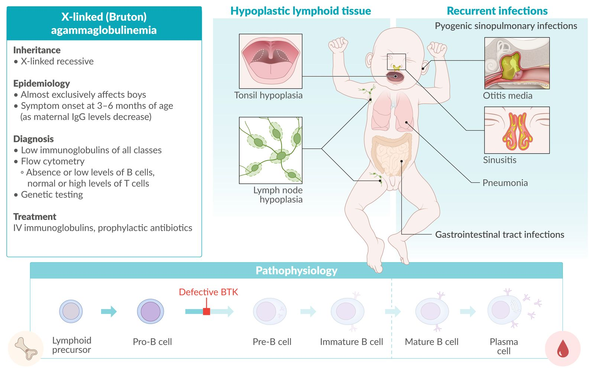
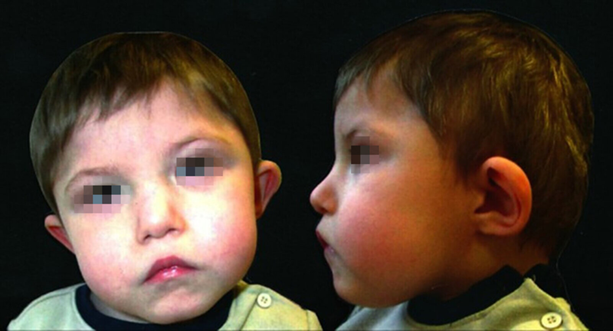
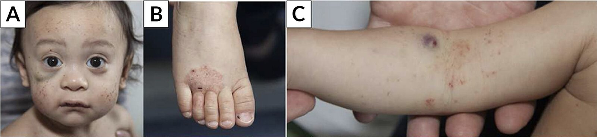
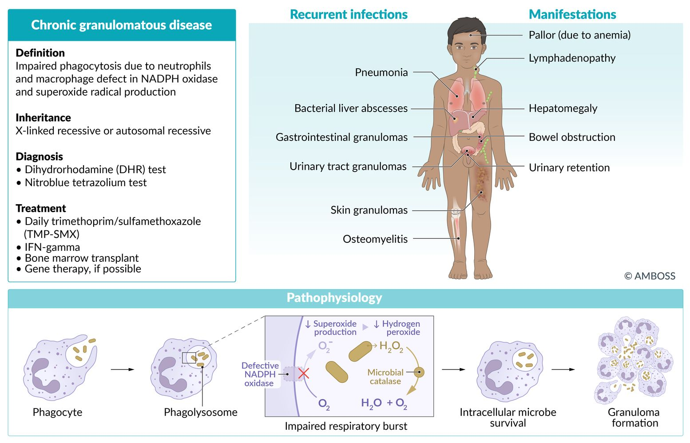
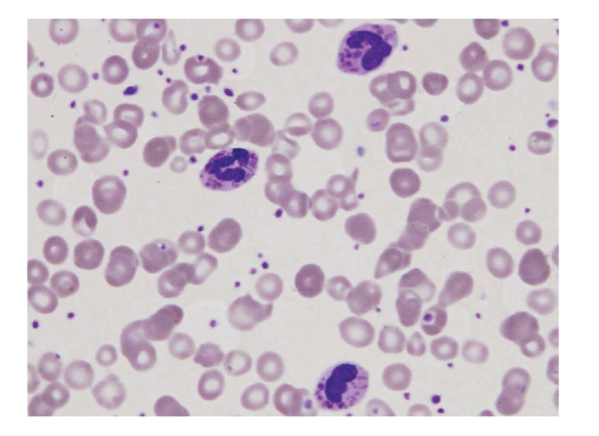

# Congenital immunodeficiency disorders

*Categories: Clinical knowledge > Pediatrics > Pediatric rheumatology and immunology > Congenital immunodeficiency disorders*

[Original Article Link](https://coursology-qbank.com/amboss/article/tM0Xqg)

---

## Summary

Congenital <u>immunodeficiency</u> disorders are characterized by a deficiency, absence, or defect in one or more of the main components of the <u>immune system</u>. These disorders are genetically determined and typically manifest during <u>infancy</u> and childhood as frequent, chronic, or <u>opportunistic infections</u>. Classification is based on the component of the <u>immune system</u> that is deficient, absent, or defective. The diagnosis is confirmed with tests such as differential <u>WBC count</u>, absolute <u>lymphocyte</u> count, quantitative <u>immunoglobulin</u> (Ig) measurements, and <u>antibody</u> <u>titers</u>. Treatment usually consists of prophylactic <u>antibiotics</u> to manage and prevent infections. The prognosis in congenital <u>immunodeficiency</u> disorders is variable and depends on the specific disorder.

---

## Overview

### Congenital <u>B-cell</u> <u>immunodeficiencies</u>

| Overview of <u>congenital B-cell immunodeficiencies</u> |  |  |  |
| --- | --- | --- | --- |
| <u>Immunodeficiency</u> | Etiology | Clinical features | Diagnostic findings |
| <u>X-linked (Bruton) agammaglobulinemia</u> |   * <u>X-linked recessive inheritance</u>  * BTK gene defect → defective <u>Bruton tyrosine kinase</u> expressed in <u>B cells</u> → complete deficiency of mature <u>B cells</u>    |   * Onset: between 3 and 6 months of age when maternal <u>IgG</u> levels in fetal serum start to decrease  * Recurrent, severe <u>pyogenic</u> infections, especially by <u>encapsulated bacteria</u> and <u>enteroviruses</u>  * <u>Hypoplasia</u> of lymphoid tissue (e.g., <u>tonsils</u>, <u>lymph nodes</u>)    |   * Absent or low <u>B cells</u>  * Normal <u>T-cell</u> count  * Low <u>immunoglobulins</u> of all classes    |
| <u>Selective IgA deficiency</u> |   * Unknown  * Most common primary <u>immunodeficiency</u>    |   * Often asymptomatic  * May manifest with respiratory infections, and/or <u>chronic diarrhea</u> (e.g., <u>giardiasis</u>)  * Increased risk of autoimmune diseases like:  * <u>Gluten-sensitive enteropathy</u>  * <u>Inflammatory bowel disease</u>  * <u>Anaphylactic</u> reaction to products containing <u>IgA</u>  * <u>Atopy</u>    |   * Low serum <u>IgA</u>  * Normal <u>IgG</u> and <u>IgM</u>    |
| <u>Common variable immunodeficiency</u> |   * Unknown  * <u>Phenotypically</u> normal <u>B cells</u> are unable to differentiate into plasma cells → low <u>immunoglobulins</u> of all classes    |   * Clinical symptoms usually develop between 20-40 years of age  , but may also manifest during childhood.  * Recurrent sinopulmonary infections  * Increased risk of <u>lymphoma</u>, autoimmune disorders, and <u>bronchiectasis</u>    |   * Low <u>IgG</u>, <u>IgA</u>, <u>IgM</u>  * Low <u>plasma cells</u>  * Normal <u>B-cell</u> and <u>T-cell</u> counts  * Poor response to immunizations    |

### <u>Congenital T-cell immunodeficiencies</u>

| Overview of <u>congenital T-cell immunodeficiencies</u> |  |  |  |
| --- | --- | --- | --- |
| <u>Immunodeficiency</u> | Etiology | Clinical features | Diagnostic findings |
| <u>DiGeorge syndrome</u> |   * Microdeletion at <u>22q11.2</u>  * <u>Autosomal dominant inheritance</u>  * Defective development of the <u>pharyngeal pouches</u> and <u>pharyngeal arches</u> * E.g.: Defective development of 3rd and 4th <u>pharyngeal pouches</u> → <u>hypoplastic</u> or absent <u>thymus</u> and parathyroids    |   * Variable <u>phenotype</u>  * Remember the acronym <u>CATCH-22</u>  * Cardiac anomalies  * Anomalous face  * Thymus <u>aplasia</u>/<u>hypoplasia</u>  * Cleft <u>palate</u>  * Hypocalcemia  * Affected <u>chromosome</u> 22    |   * Detection of <u>22q11.2 deletion</u> via <u>FISH</u>  * Low <u>PTH</u> and <u>Ca2+</u>  * Low <u>T cells</u>  * <u>CXR</u>: absence of <u>thymic shadow</u>  * <u>Skin</u> testing: <u>delayed hypersensitivity</u>    |
| <u>Autosomal dominant hyper-IgE syndrome</u> (<u>Job syndrome</u>) |   * <u>STAT3</u> <u>gene</u> mutation → ↓ <u>Th17 cells</u>  * Defective <u>neutrophil</u> <u>chemotaxis</u>    |  * Remember the acronym FATED:  * Fractures and Facies (coarse facial features)  * Abscesses (mainly staphylococcal)  * Teeth (retained <u>primary teeth</u>)  * Hyper-IgE and Eosinophilia  * Dermatologic features (severe <u>eczema</u>)   |   * Increased <u>IgE</u>  * Low <u>IFN-γ</u>  * Commonly increased <u>eosinophils</u>    |
| <u>IL-12 receptor deficiency</u> |   * <u>Autosomal recessive inheritance</u>  * Decreased <u>IL-12</u> → impaired <u>Th1</u> response → no release of <u>IFN-γ</u>    |   * Onset varies but usually 1–3 years of age  * Disseminated disease, especially <u>tuberculosis</u>  * <u>Fungal infections</u>    |  * Low <u>IFN-γ</u>   |
| <u>Chronic mucocutaneous candidiasis</u> |  * Several congenital defects (e.g., STAT1 <u>gain of function mutation</u>, <u>AIRE</u> protein deficiency) → impaired <u>T-cell</u> function → impaired or absent <u>immune response</u> to <u>Candida</u>   |   * Noninvasive <u>Candida</u> infections of the <u>skin</u>, <u>nails</u>, and <u>mucous membranes</u>  * Associated with autoimmune disorders    |   * Usually clinical  * Cutaneous reaction to <u>Candida</u> <u>antigens</u> is absent.  * In vitro <u>T-cell</u> <u>proliferation</u> is absent when exposed to <u>Candida</u> <u>antigens</u>.    |
| <u>IPEX syndrome</u> |   * <u>FOXP3</u> <u>gene</u> mutation → impaired regulatory <u>T cells</u> → <u>autoimmunity</u>  * X-linked recessive inheritance    |   * Onset: early <u>infancy</u>  * <u>Lymphadenopathy</u>, chronic lymphoid tissue <u>hypertrophy</u>  * Autoimmune <u>skin</u> and endocrine disorders (e.g., <u>type 1 DM</u> especially in boys)  * Enteropathy  * <u>Failure to thrive</u>  * <u>Nail</u> <u>dystrophy</u>    |   * <u>Genetic testing</u>: <u>FOXP3</u> <u>gene mutations</u>  * Low or absent <u>CD4+</u><u>CD25</u>+<u>regulatory T cells</u>  * Otherwise normal <u>T-cell</u> populations    |

### Congenital combined <u>immunodeficiencies</u>

| Overview of congenital combined <u>immunodeficiencies</u> |  |  |  |
| --- | --- | --- | --- |
| <u>Immunodeficiency</u> | Etiology | Clinical features | Diagnostic findings |
| <u>Severe combined immunodeficiency</u> |  * Various mutations resulting in impaired function of <u>B cells</u> and <u>T cells</u>  * <u>X-linked recessive inheritance</u>: defective <u>IL-2R gamma chain</u> (most common variant)  * <u>Autosomal recessive inheritance</u>: <u>adenosine deaminase deficiency</u>  * Human <u>RAG</u> mutations: defective <u>VDJ recombination</u>   |   * Asymptomatic at <u>birth</u>  * Recurrent bacterial, viral, fungal (<u>thrush</u>), and <u>protozoal</u> infections  * <u>Chronic diarrhea</u>  * <u>Failure to thrive</u>  * <u>Lymph nodes</u> and <u>tonsils</u> may be absent    |   * <u>Quantitative PCR</u>: low <u>TRECs</u>  * Absent <u>T cells</u> (X-linked variant); absent <u>T cells</u>, <u>B cells</u>, and <u>NK cells</u> (<u>AR</u> variant)  * <u>CXR</u>: absent <u>thymic shadow</u>  * <u>Lymph node</u> <u>biopsy</u>: absent <u>germinal centers</u>    |
| <u>Wiskott-Aldrich syndrome</u> (WAS) |   * X-linked recessive inheritance  * <u>WAS gene</u> mutation→ ↓ WAS <u>protein synthesis</u> → impaired remodeling of <u>T-cells</u> <u>actin</u> <u>cytoskeleton</u> → defective <u>antigen</u> presentation    |   * Present at <u>birth</u>  * Remember the acronym Wis-PER:  * Wiskott-Aldrich syndrome  * Purpura (due to <u>thrombocytopenia</u>)  * Eczema  * Recurrent <u>pyogenic</u> infections (with encapsulated organisms)  * Increased risk of autoimmune diseases and hematological malignancies    |   * Normal or low <u>IgG</u> and <u>IgM</u>  * Increased <u>IgE</u> and <u>IgA</u>  * <u>Thrombocytopenia with small platelets</u>  * <u>Genetic analysis</u>: mutated <u>WAS gene</u>    |
| <u>Hyper-IgM syndrome</u> |   * X-linked recessive inheritance  * Class-switching defect of <u>Th cells</u> (most commonly <u>CD40 ligand</u> deficiency)    |   * Recurrent sinopulmonary infections  * Commonly infections with <u>Pneumocystis jirovecii</u>, <u>Histoplasma</u>, <u>Cryptosporidium</u>, and <u>CMV</u>  * <u>Failure to thrive</u>    |   * Low <u>IgG</u>, <u>IgA</u>, and <u>IgE</u>  * Normal or increased <u>IgM</u>  * <u>Lymph node</u> <u>biopsy</u>: absent <u>germinal centers</u>    |
| <u>Ataxia telangiectasia</u> |   * <u>Autosomal recessive inheritance</u>  * ATM <u>gene</u> defect → failure to recognize and repair dsDNA breaks → no <u>cell cycle</u> arrest → continuous replication of damaged <u>DNA</u>    |   * Onset: early childhood  * Classic triad of 3 As  * Progressive Ataxia due to <u>cerebellar</u> <u>atrophy</u>  * Spider Angiomas  * IgA deficiency  * Susceptibility to infections (e.g., <u>ear</u> infections, <u>sinusitis</u>, <u>pneumonia</u>)  * Increased risk of <u>malignancy</u> (e.g., <u>non-Hodgkin</u> <u>lymphoma</u> and <u>leukemia</u>)  * Increased <u>sensitivity</u> to radiation, therefore <u>x-ray</u> exposure should be avoided in these individuals.    |   * <u>MRI</u>: <u>cerebellar</u> (<u>vermis</u>) <u>atrophy</u>  * Increased <u>AFP</u> levels  * Low <u>IgA</u>, <u>IgG</u>, and <u>IgE</u>  * <u>Lymphopenia</u>    |

### <u>Congenital neutrophil and phagocyte disorders</u>

| Overview of congenital <u>neutrophil</u> and <u>phagocytes</u> disorders |  |  |  |
| --- | --- | --- | --- |
| <u>Immunodeficiency</u> | Etiology | Clinical features | Diagnostic findings |
| <u>Chronic granulomatous disease</u> (<u>CGD</u>) |   * X-linked (most common) or <u>autosomal recessive inheritance</u>  * Defective phagocytic <u>NADPH oxidase</u>  * Defective <u>ROS</u> production by <u>neutrophils</u> and <u>macrophages</u>  * Decreased <u>respiratory burst</u> in <u>neutrophils</u>    |   * Recurrent, severe infections with <u>catalase-positive organisms</u>  [[1]](https://coursology-qbank.com/amboss/article/cDbaWD)  * <u>Lymphadenopathy</u>  * Possible <u>skin</u> <u>granulomas</u>    |   * Abnormal <u>DHR test</u>: absent or decreased green fluorescence  * Negative <u>nitroblue tetrazolium dye reduction test</u>  * <u>Anemia</u>  * Genotyping is confirmatory    |
| <u>Leukocyte adhesion deficiency type 1</u> |   * <u>Autosomal recessive inheritance</u>  * Absent <u>LFA-1</u> (CD18) protein → impaired <u>leukocyte</u> <u>chemotaxis</u> and migration    |   * Recurrent nonsuppurative bacterial infections of <u>skin</u> and <u>mucosa</u>  * Impaired <u>wound healing</u>  * Delayed separation of the <u>umbilical cord</u>  * <u>Periodontitis</u>    |   * <u>Leukocytosis</u>; however, <u>neutrophils</u> are absent at the site of infection  * <u>Flow cytometry</u>: absent CD18    |
| <u>Chédiak-Higashi syndrome</u> |   * <u>Autosomal recessive inheritance</u>  * <u>LYST</u> <u>gene</u> defect → defective <u>neutrophil</u> <u>chemotaxis</u> and <u>microtubule</u> polymerization dysfunction → defective <u>phagosome</u>-<u>lysosome</u> fusion    |  * Remember the acronym ALPINe  * Partial Albinism  * Lymphohistiocytosis  * Peripheral neuropathy  * Recurrent <u>pyogenic</u> Infections (<u>S. pyogenes</u>, <u>S. aureus</u>, and <u>Pseudomonas</u> spp.)  * Progressive Neurodegeneration (and Neutropenia)   |   * <u>Peripheral smear</u>: giant <u>cytoplasmic</u> granules in <u>granulocytes</u> and <u>platelets</u>  * Mild coagulation abnormalities  * <u>Pancytopenia</u>    |
| <u>Myeloperoxidase deficiency</u> |   * <u>Autosomal recessive inheritance</u>  * Mutation in <u>MPO</u> <u>gene</u> → partial or complete deficiency of <u>MPO</u> in <u>phagocytes</u>    |   * Often asymptomatic  * Recurrent <u>Candida</u> infections    |   * Positive <u>nitroblue tetrazolium test</u> (intact <u>NADPH oxidase</u>)  * Absent <u>MPO</u> on staining  * <u>Genetic analysis</u>: <u>MPO</u> <u>gene</u> mutation    |
| <u>Severe congenital neutropenia</u> |   * <u>Autosomal dominant</u>, <u>autosomal recessive</u>, or X-linked recessive inheritance  * <u>Bone marrow</u> failure of myeloid lineage    |   * Recurrent bacterial infections, e.g. <u>gingivitis</u>, <u>otitis media</u>, respiratory infections, and <u>cellulitis</u> (<u>Streptococcus</u> and <u>Staphylococcus</u>)  * Oral <u>ulcerations</u>    |   * Absolute <u>neutropenia</u>, relative <u>monocytosis</u>  * <u>Bone marrow aspirate</u>: normal or decreased cellularity; arrest of myeloid lineage    |

### <u>Complement</u> disorders

| Overview of <u>complement</u> disorders |  |  |  |  |
| --- | --- | --- | --- | --- |
| <u>Immunodeficiency</u> |  | Etiology | Clinical features | Diagnostic findings |
| C1 esterase inhibitor deficiency |  |   * <u>Autosomal dominant inheritance</u>  * Unregulated activation of <u>kallikrein</u> → ↑ <u>bradykinin</u> → <u>angioedema</u>  * See <u>bradykinin-mediated angioedema</u> in <u>angioedema</u>.    |   * Recurrent angioedemas provoked by triggers (e.g., trauma, <u>surgery</u>, infections, and drugs)  * <u>Airway</u> edemas can be life-threatening    |   * <u>CH50 assay</u> <u>screening test</u>  * ↑ <u>Bradykinin</u> levels  * Low C4 levels  * Strong contraindication for <u>ACE inhibitors</u>    |
| Early <u>complement deficiencies</u> | C1, C2, and <u>C4 deficiency</u> |   * Mostly <u>autosomal recessive inheritance</u>  * Most common deficiency: C2 [[2]](https://coursology-qbank.com/amboss/article/R2blhG)    |   * ↑ Risk of recurrent severe infections of the respiratory tract and sinus  * ↑ Risk of developing <u>SLE</u>    |   * <u>CH50 assay</u> <u>screening test</u>  * ↓ Levels of <u>complement</u>    |
| <u>C3 deficiency</u> |   * Deficiency of C3 and its cleaved fragments (e.g., C3b)  * Impaired <u>opsonization</u> of pathogens → reduced clearance of C3b-bound immune complexes → ↑ susceptibility to <u>type III HSR</u>    |   * Recurrent, severe infections with <u>encapsulated bacteria</u> (e.g., <u>Neisseria meningitidis</u>, <u>Haemophilus influenzae</u>, <u>Streptococcus pneumoniae</u>)  * Associated with autoimmune diseases (e.g., <u>SLE</u>)    |  |  |
| <u>Terminal complement deficiency</u> |  |   * <u>Autosomal recessive inheritance</u>  * Most common deficiencies: C5, C6, and C8  * Inability to form <u>membrane attack complex</u>    |   * Recurrent <u>Neisseria</u> (e.g. meningococcal) or gonococcal <u>pyogenic</u> infections  * Life-threatening <u>sepsis</u> is possible.  * Associated with <u>SLE</u> and <u>glomerulonephritis</u>    |  |

---

## Congenital B-cell immunodeficiencies

<u>B-cell</u> defects (<u>humoral immunity deficiencies</u>) account for 50–60% of all primary <u>immunodeficiencies</u>.

### X-linked (Bruton) agammaglobulinemia [[3]](https://coursology-qbank.com/amboss/article/YXYn9n)

* Definition: X-linked recessive;  disease that causes a complete deficiency of mature <u>B lymphocytes</u>

* <u>Epidemiology</u>: occurs mainly in boys

* Etiology: defect of <u>Bruton tyrosine kinase</u> (<u>BTK</u>) expressed in <u>B cells</u> → complete deficiency of mature <u>B cells</u>

* Clinical features: Symptoms develop between 3 and 6 months of age when maternal <u>IgG</u> levels in fetal serum start to decrease.

* <u>Hypoplasia</u> of lymphoid tissue (e.g., <u>tonsils</u>, <u>lymph nodes</u>)

* Recurrent, severe, <u>pyogenic</u> infections (e.g., <u>pneumonia</u>, <u>otitis media</u>), especially with <u>encapsulated bacteria</u> (<u>S. pneumoniae</u>, <u>N. meningitidis</u>, and <u>H. influenzae</u>)

* <u>Hepatitis</u> <u>virus</u> and <u>enterovirus</u> (e.g., <u>Coxsackie virus</u>) infections

* Diagnosis

* <u>Flow cytometry</u>

* Absent or low levels of <u>B cells</u> (marked by <u>CD19</u>, <u>CD20</u>, and <u>CD21</u>)

* Normal or high <u>T cells</u>

* Low <u>immunoglobulins</u> of all classes

* Absent lymphoid tissue, i.e., no <u>germinal centers</u> and <u>primary follicles</u>

* Treatment

* IV <u>immunoglobulins</u>

* Prophylactic <u>antibiotics</u>

Bruton agammaglobulinemia fact sheet

> [!WARNING]
> <u>Live vaccines</u> (e.g., <u>MMR</u>) are contraindicated in patients with <u>X-linked (Bruton) agammaglobulinemia</u>.

> [!NOTE]
> X-linked (Bruton) agammaglobulinemia: Brutal defects in a B cell make little Boys feel unwell.

### Selective IgA deficiency (<u>SIgAD</u>) [[4]](https://coursology-qbank.com/amboss/article/5rai3N)[[5]](https://coursology-qbank.com/amboss/article/MraM3N)

* Definition: most common primary <u>immunodeficiency</u>;  that is characterized by a near or total absence of serum and secretory <u>IgA</u>

* <u>Epidemiology</u>: approx. 1:220 to 1:1,000

* Etiology: unknown

* Clinical features

* Often asymptomatic

* May manifest with <u>sinusitis</u> or respiratory infections (<u>S. pneumoniae</u>, <u>H. influenzae</u>)

* <u>Chronic diarrhea</u>, partially due to elevated susceptibility to parasitic infection;  (e.g. by <u>Giardia lamblia</u>)

* Associated with autoimmune diseases (e.g., <u>gluten-sensitive enteropathy</u>, <u>inflammatory bowel disease</u>, <u>immune thrombocytopenia</u>) and <u>atopy</u>

* <u>Anaphylactic</u> reaction to products containing <u>IgA</u> (e.g., <u>intravenous immunoglobulin</u>)

* Diagnosis

* Decreased serum <u>IgA</u> levels (< 7 mg/dL)

* Normal <u>IgG</u> and <u>IgM</u> levels

* <u>False-positive</u> <u>pregnancy tests</u> [[6]](https://coursology-qbank.com/amboss/article/hebcAs)

* Treatment

* Treatment of infections

* Prophylactic <u>antibiotics</u>

* Intravenous infusion of <u>IgA</u> is not recommended because of the risk of <u>anaphylactic</u> reactions (caused by the production of anti-<u>IgA</u> <u>antibodies</u>).

> [!TIP]
> To prevent <u>transfusion reactions</u>, <u>IgA</u>-deficient patients must be given washed <u>blood products</u> without <u>IgA</u> or obtain blood from an <u>IgA</u>-deficient donor.

> [!NOTE]
> The Six A's of selective IgA deficiency: Asymptomatic, Airway infections, Anaphylaxis to IgA-containing products, Autoimmune diseases, Atopy

### Common variable immunodeficiency (<u>CVID</u>) [[7]](https://coursology-qbank.com/amboss/article/OebI_s)[[8]](https://coursology-qbank.com/amboss/article/eXYxCn)[[9]](https://coursology-qbank.com/amboss/article/VXYGCn)

* Definition: primary <u>immunodeficiency</u> with low serum levels of all <u>immunoglobulins</u> despite <u>phenotypically</u> normal <u>B cells</u>

* <u>Epidemiology</u>

* Sex: <u>♀</u> = <u>♂</u>

* Onset: later than other <u>B-cell</u> defects (typically at 20–40 years of age) [[10]](https://coursology-qbank.com/amboss/article/a2bQTG)

* Etiology: Most cases are sporadic with no known <u>family history</u>.

* Pathophysiology: <u>B cells</u> are <u>phenotypically</u> normal but are unable to differentiate into Ig-producing cells, resulting in low <u>immunoglobulins</u> of all classes.

* Clinical features

* Recurrent <u>pyogenic</u> respiratory infections, e.g., sinopulmonary infections (in rare cases, enteroviral <u>meningitis</u>)

* Associated with a high risk of <u>lymphoma</u>, <u>gastric cancer</u>, <u>bronchiectasis</u>, and autoimmune disorders (e.g., <u>rheumatoid arthritis</u>, <u>autoimmune hemolytic anemia</u>, <u>immune thrombocytopenia</u>, <u>vitiligo</u>)  [[11]](https://coursology-qbank.com/amboss/article/X5X9iA)

* Diagnosis

* Quantitative <u>immunoglobulin</u> levels: low levels of <u>IgG</u>, <u>IgA</u>, and <u>IgM</u>

* Decreased number of <u>plasma cells</u>

* <u>Flow cytometry</u> shows subsets of normal B and <u>T cells</u>

* Poor response to immunizations

* Treatment

* Treatment of infections

* Prophylactic <u>antibiotics</u>

* IV <u>immunoglobulins</u>

### Transient hypogammaglobulinemia of infancy (<u>THI</u>) [[12]](https://coursology-qbank.com/amboss/article/ZT0Z62)[[13]](https://coursology-qbank.com/amboss/article/Os1IER0)

* Definition: an age-related delay in <u>immunoglobulin production</u> despite having normal levels of <u>B cells</u>

* <u>Epidemiology</u>

* Approx. 1:1000 <u>live births</u> [[13]](https://coursology-qbank.com/amboss/article/Os1IER0)

* Onset: > 6 months of age; Ig levels typically increase and normalize at 2–6 years of age. [[12]](https://coursology-qbank.com/amboss/article/ZT0Z62)

* Clinical features

* Recurrent infections (most common: sinopulmonary infections, <u>otitis media</u>, <u>bronchitis</u>, <u>tonsillitis</u>, <u>diarrhea</u>)

* <u>Atopic</u> manifestations (e.g., <u>asthma</u>, <u>food allergies</u>)

* <u>Failure to thrive</u> and/or <u>developmental delay</u>

* Can be asymptomatic

* Severe and/or invasive infections, such as <u>meningitis</u> and <u>bacteremia</u> (rare)

* Diagnosis

* Quantitative <u>immunoglobulin</u> levels

* <u>IgG</u> is ≤ 2 SD of age-appropriate levels.

* Levels of <u>IgA</u> and <u>IgM</u> may be low.

* <u>Flow cytometry</u> shows subsets of normal B and <u>T cells</u>.

* Presence of specific <u>antibodies</u>

* Post-exposure <u>IgG antibodies</u> (e.g., <u>rubella</u>, <u>varicella</u>)

* Post-<u>immunization</u> <u>IgG antibodies</u> (e.g., <u>tetanus toxoid</u>, <u>pneumococcal</u> <u>polysaccharide</u>)

* Isohemagglutinins (anti-A, anti-B)

* Treatment

* Prophylactic <u>antibiotics</u> in patients with recurrent infections

* IV <u>immunoglobulins</u> in patients who develop severe and/or invasive infections or recurrent infections despite prophylaxis

* Appropriate treatment in patients with <u>atopic</u> manifestations (e.g., <u>bronchodilators</u>)

* <u>Routine immunization schedule</u> should be continued.

---

## Congenital T-cell immunodeficiencies

<u>T-cell</u> defects (<u>cellular immunity deficiencies</u>) are responsible for 5–10% of congenital <u>immunodeficiencies</u>.

### DiGeorge syndrome (<u>22q11.2 deletion syndrome</u>) [[14]](https://coursology-qbank.com/amboss/article/TXY6xn)

* Definition: genetic disorder, which is characterized by a microdeletion at the <u>22q11.2</u> region resulting in a range of developmental abnormalities

* <u>Epidemiology</u>: ∼ 1 in 2,000 to 7,000 <u>live births</u>

* Etiology: microdeletion at <u>chromosome</u> 22 (<u>22q11.2</u>); de novo mutation (∼ 90%), <u>autosomal dominant</u> (∼ 10%)

* Pathophysiology

* The TBX1 <u>gene</u> in the <u>22q11.2</u> region is the main <u>gene</u> responsible for the DiGeorge <u>phenotype</u>

* Deletions in TBX1 lead to <u>malformations</u> in the <u>pharyngeal apparatus</u>, which results in abnormalities of the:

* Bones and muscles of the face and neck → abnormal facies, <u>cleft palate</u>

* Outflow tract of the <u>heart</u> → <u>heart</u> defects (e.g., ToF)

* 3rd and 4th <u>pharyngeal pouches</u> → <u>thymus</u> <u>hypoplasia</u> (<u>T-cell</u> <u>immunodeficiency</u>) and parathyroid <u>hypoplasia</u> (<u>hypocalcemia</u>)

* Clinical features  

* Cardiac anomalies in DiGeorge syndrome

* <u>Conotruncal abnormalities</u> (e.g., <u>tetralogy of Fallot</u> or <u>persistent truncus arteriosus</u>)

* <u>Ventricular septal defect</u> (<u>VSD</u>)

* <u>Atrial septal defect</u> (<u>ASD</u>)

* Anomalous face

* Prominent nasal bridge

* <u>Hypoplastic</u> wing of the nose

* <u>Dysplastic</u> <u>ears</u>

* Micrognathia;  (small lower <u>jaw</u>) and/or <u>retrognathia</u>

* Thymus <u>aplasia</u>/<u>hypoplasia</u>: recurrent infections (viral/fungal/<u>PCP pneumonia</u>) due to <u>T-cell</u> deficiency

* Cleft <u>palate</u>

* Hypoparathyroidism: hypocalcemia with <u>tetany</u>

* Diagnosis

* Detection of <u>22q11.2 deletion</u> via <u>fluorescence in situ hybridization</u> (<u>FISH</u>)

* ↓ <u>PTH</u> and <u>Ca2+</u>

* ↓ Absolute <u>T-lymphocyte</u> count

* <u>Delayed hypersensitivity</u> <u>skin</u> testing

* <u>CXR</u>: absence of <u>thymic shadow</u>

* Treatment

* <u>Immune deficiency</u> treatment

* <u>Antibiotics</u>, virostatics, and <u>antimycotics</u>

* <u>PCP prophylaxis</u>

* Consider <u>bone marrow transplant</u> and/or IVIG

* Possible <u>thymus</u> <u>transplantation</u>

* Prognosis: mostly normal <u>life expectancy</u> with appropriate medical care

> [!NOTE]
> CATCH-22 is the acronym for typical features of <u>DiGeorge syndrome</u>: Cardiac anomalies; Anomalous face; Thymic <u>aplasia</u>/<u>hypoplasia</u>; Cleft <u>palate</u>; Hypocalcemia; <u>Chromosome</u> 22.

DiGeorge syndrome (22q11.2 deletion syndrome) fact sheet

Facial features in DiGeorge syndrome

Section 12.3 DiGeorge Syndrome

### Autosomal dominant hyperimmunoglobulin E syndrome (<u>Job syndrome</u>) [[15]](https://coursology-qbank.com/amboss/article/gXYFxn)

* Definition: defect in <u>neutrophil</u> <u>chemotaxis</u>

* Etiology: <u>autosomal dominant</u>; <u>STAT3</u> mutation → ↓ <u>Th17 cells</u> → ↓ <u>neutrophil</u> <u>chemotaxis</u>

* Clinical features

* Coarse Facies

* Recurrent, cold Abscesses, recurrent bacterial (staphylococcal) infections

* Retained primary Teeth

* Hyper-IgE (Eosinophilia)

* Dermatologic (severe <u>eczema</u>)

* Other features: Decreased <u>bone density</u> increases the risk of bone <u>fractures</u> following minor trauma. [[16]](https://coursology-qbank.com/amboss/article/0oYe0J)

* Diagnosis

* ↑ <u>IgE</u>

* (Variable) <u>eosinophilia</u>

* ↓ <u>IFN γ</u>

* Treatment

* <u>Antibiotics</u> and prophylaxis (with <u>penicillinase</u>-resistant <u>antibiotics</u>)

* <u>IV immunoglobulin</u> therapy

> [!NOTE]
> FATED is the acronym for the typical features of <u>Autosomal dominant hyper-IgE syndrome</u>: Coarse Facies/Fractures; Abscesses; Retained primary Teeth; Hyper-IgE/Eosinophilia); Dermatologic (severe <u>eczema</u>).

Autosomal dominant hyper-IgE syndrome fact sheet

### IL-12 receptor deficiency [[17]](https://coursology-qbank.com/amboss/article/nra73N)[[18]](https://coursology-qbank.com/amboss/article/Lraw3N)[[19]](https://coursology-qbank.com/amboss/article/ora0RN)

* Definition: impaired <u>Th1</u> response due to ↓ <u>IL-12</u> <u>receptors</u>

* Etiology: <u>autosomal recessive</u>

* Pathophysiology

* Normally, <u>antigen</u>-presenting <u>macrophages</u> release <u>IL-12</u> → <u>Th cells</u> transformation to T1 type → release of <u>IFN-γ</u> to activate <u>macrophages</u>

* Defective <u>IL-12</u> <u>receptors</u>: <u>macrophages</u> cannot be activated by <u>IFN-γ</u> → no cytotoxicity in cells infected with intracellular pathogens (e.g., <u>Mycobacteria</u>, <u>Salmonella</u>)

* <u>IL-12</u> <u>receptor</u> deficiency is the underlying pathology in most cases of high Mendelian susceptibility to mycobacterial disease (<u>MSMD</u>)

* Affected individuals have defects in <u>IFN-γ</u> mediated <u>immunity</u>.

* This increases susceptibility to infection with weakly <u>virulent</u> <u>mycobacteria</u> (e.g., environmental <u>mycobacteria</u>, <u>BCG</u> <u>vaccine</u>).

* Clinical features

* The age of onset varies (depends on the age at exposure to causative pathogens): ∼ 1–3 years of age

* Features of disseminated disease

* <u>Mycobacterial</u> infections (e.g., developing <u>tuberculosis</u> after <u>BCG</u> <u>vaccination</u>)

* <u>Fungal infections</u>

* Diagnosis: : ↓ <u>IFN-γ</u>

* Treatment: <u>antibiotics</u> and <u>IFN-γ</u> therapy

### Chronic mucocutaneous candidiasis

* Definition: impaired or absent <u>T-cell</u> response to <u>Candida</u> <u>antigens</u>

* Etiology

* Several congenital defects that result in impaired <u>T-cell</u> function

* Autoimmune regulator (<u>AIRE protein</u>) deficiency is a common cause.

* The majority of cases are caused by a <u>gain of function mutation</u> in the STAT1 <u>gene</u>.  [[20]](https://coursology-qbank.com/amboss/article/f5XkjA)

* Pathophysiology: defects in <u>IL-17</u> and <u>IL-17</u> <u>receptors</u> → insufficient cell-mediated <u>immune response</u> to <u>Candida</u> infections

* Clinical features

* Persistent or, less commonly, recurrent noninvasive <u>Candida</u> infections of the <u>skin</u>, <u>mucous membranes</u>, and <u>nails</u>

* Associated autoimmune disorders (e.g., <u>immune thrombocytopenic purpura</u>, <u>rheumatoid arthritis</u>)

* Diagnosis

* Usually clinical

* Absent in vitro <u>T-cell</u> <u>proliferation</u> when exposed to <u>Candida</u> <u>antigen</u>

* Absent cutaneous reaction to <u>Candida</u> <u>antigen</u>

* Treatment

* <u>Antifungal</u> therapy

* Treatment of associated conditions

### IPEX syndrome (Immune dysregulation, Polyendocrinopathy, Enteropathy, X-linked)

* Definition: : A syndrome characterized by a dysfunctional regulatory <u>T-cell</u> lineage that leads to <u>autoimmunity</u> as a result of disrupted tolerance to self-<u>antigens</u>.

* Etiology

* X-linked recessive type of inheritance

* Mutation in <u>transcription factor</u> <u>FOXP3</u> → unchecked activation of <u>T cells</u> against host tissues

* Clinical features

* Classically presents in early <u>infancy</u>

* <u>Lymphadenopathy</u> and/or chronic lymphoid tissue <u>hypertrophy</u> (e.g., enlarged <u>tonsils</u>)

* <u>Eczema</u>, possibly accompanied by other autoimmune dermatologic conditions

* Autoimmune endocrine conditions (e.g., <u>hyperthyroidism</u> or <u>hypothyroidism</u>, <u>type 1 diabetes</u> mellitus in male individuals)

* Enteropathy, manifesting as e.g., <u>chronic diarrhea</u>

* <u>Nail</u> <u>dystrophy</u>

* <u>Failure to thrive</u>

* Diagnosis

* Primarily based on <u>clinical examination</u> and <u>family history</u>

* <u>Genetic testing</u>: mutations in <u>FOXP3</u>

* <u>Flow cytometry</u>: severely reduced or absent <u>CD4+</u><u>CD25</u>+ <u>regulatory T cells</u> with otherwise normal <u>T-cell</u> populations

* Treatment

* <u>Nutritional support</u>

* <u>Immunosuppression</u>: <u>tacrolimus</u>, <u>cyclosporine</u>, or <u>sirolimus</u>

* <u>Rituximab</u>

* <u>Bone marrow transplant</u>

---

## Congenital mixed immunodeficiencies

### Severe combined immunodeficiency (<u>SCID</u>, <u>Glanzmann–Riniker</u> syndrome, <u>alymphocytosis</u>)

* Definition: : A rare genetic condition caused by numerous genetic mutations that result in the defective development of functional <u>B cells</u> and <u>T cells</u>.

* Etiology: various mutations, the most common of which are:

* <u>X-linked recessive</u>: mutations in the <u>gene</u> encoding the common gamma chain → defective IL-2R gamma chain receptor linked to JAK3 (most common <u>SCID</u> mutation)

* <u>Autosomal recessive</u>

* <u>Adenosine deaminase</u> (<u>ADA</u>) deficiency → accumulation of toxic metabolites (deoxyadenosine and <u>dATP</u>) and disrupted <u>purine</u> metabolism → accumulation of <u>dATP</u> inhibits the function of ribonucleotide reductase → impaired generation of deoxynucleotides

* Janus-associated <u>kinase</u> 3 (JAK3) deficiency

* <u>RAG</u> mutation results in faulty <u>VDJ recombination</u> (see “<u>Immunoglobulin properties</u>”).

* Clinical features

* Normal at <u>birth</u>

* Severe, recurrent infections: bacterial <u>diarrhea</u>, chronic <u>candidiasis</u> (<u>thrush</u>), viral and <u>protozoal</u> infections

* <u>Failure to thrive</u>

* <u>Chronic diarrhea</u>

* <u>Lymph nodes</u> and <u>tonsils</u> may be absent

* Subtype: Omenn syndrome (an <u>autosomal recessive</u> form of <u>SCID</u>) [[21]](https://coursology-qbank.com/amboss/article/vFXAP-)

* Etiology: mutations of <u>RAG</u> <u>gene</u> or ILRA7 <u>gene</u>

* Clinical features

* Onset before 3 months of age

* <u>Erythroderma</u>, <u>adenopathy</u>, and <u>hepatosplenomegaly</u>

* Severe, recurrent infections

* <u>Failure to thrive</u>

* Diagnosis: oligoclonal <u>T cells</u>, <u>eosinophilia</u>, ↑ <u>IgE</u> levels

* Diagnosis

* <u>Quantitative PCR</u>: ↓ <u>T-cell</u> <u>receptor</u> excision circles (<u>TRECs</u>); detection of <u>TRECs</u> is used in the <u>newborn screening</u> for <u>SCID</u>

* <u>Flow cytometry</u>: absent <u>T cells</u>

* <u>CXR</u>: absent <u>thymic shadow</u>

* <u>Lymph node</u> <u>biopsy</u>: absent <u>germinal centers</u>

* Treatment

* IV <u>immunoglobulins</u>

* <u>PCP prophylaxis</u>

* <u>Bone marrow transplant</u> or <u>stem cell transplantation</u>

* Avoidance of <u>live vaccines</u>

* Prognosis: often fatal in the first year of life if left untreated  [[22]](https://coursology-qbank.com/amboss/article/YoYn0J)

### Wiskott-Aldrich syndrome (WAS)

* Definition: genetic condition characterized by impaired function of <u>T cells</u> and <u>thrombocytopenia</u>

* <u>Epidemiology</u>: : occurs primarily in males

* Etiology: mutated WAS gene (<u>X-linked recessive</u> inheritance) → impaired signaling to <u>actin</u> <u>cytoskeleton</u> reorganization → defective <u>antigen</u> presentation

* Clinical features

* Onset of symptoms: from <u>birth</u>

* Classic triad

* <u>Purpura</u> (<u>bleeding diathesis</u>)

* <u>Eczema</u> (high risk of <u>atopic</u> disorders)

* Recurrent opportunistic infections with encapsulated organisms;  in the first years of life (e.g., <u>otitis media</u>)

* Increased risk of autoimmune diseases and hematological malignancies (e.g., <u>lymphoma</u>, <u>leukemia</u>)

* Diagnosis

* Normal or ↓ <u>IgG</u> and <u>IgM</u>

* ↑ <u>IgE</u> and <u>IgA</u>

* <u>Thrombocytopenia</u> with small <u>platelets</u>

* <u>Genetic analysis</u> (<u>confirmatory test</u>): mutated <u>WAS gene</u>

* Treatment

* <u>IV immunoglobulin</u> therapy

* Prophylactic <u>antibiotics</u>

* <u>Platelet transfusions</u>

* <u>Stem cell transplantation</u> may be curative.

* Prognosis: : shortened <u>life expectancy</u>

Wiskott-Aldrich syndrome

Wiskott-Aldrich syndrome

> [!NOTE]
> Classic findings of <u>Wiskott-Aldrich</u> syndrome (Wiskott-Aldrich syndrome, Purpura, Eczema, Recurrent infections): WisPER

### Hyper-IgM syndrome [[23]](https://coursology-qbank.com/amboss/article/SXYyxn)

* Definition: A group of syndromes characterized by impaired interaction between <u>Th cells</u> and <u>B cells</u> that results in a <u>B cell</u> class-switching defect

* <u>Epidemiology</u>: <u>CD40 ligand</u> deficiency is the most common form.

* Etiology

* <u>X-linked recessive</u> inheritance

* <u>CD40L</u> deficiency in <u>Th cells</u> leads to abnormal interaction with <u>B cells</u> that express the <u>CD40</u> <u>receptor</u>, disrupting <u>B-cell</u> class-switching, which leads to depleted <u>immunoglobulins</u>

* Clinical features

* Recurrent severe <u>pyogenic</u> infections that manifest since childhood

* Opportunistic sinopulmonary infections (commonly <u>Pneumocystis jirovecii</u> and <u>Histoplasma</u>)

* <u>Cryptosporidium</u> enteritis (which may lead to biliary disease, <u>cirrhosis</u>, and <u>cholangiocarcinoma</u>)

* <u>CMV hepatitis</u>

* <u>Failure to thrive</u>

* Diagnosis

* ↓ <u>IgG</u>, <u>IgA</u>, <u>IgE</u>

* Normal or ↑ <u>IgM</u>

* <u>Lymph node</u> <u>biopsy</u>: absent <u>germinal centers</u>

* Treatment

* <u>IV immunoglobulin</u> therapy

* Prophylactic <u>antibiotics</u>

* Recombinant human <u>granulocyte-colony</u> stimulating factor

* <u>Stem cell transplantation</u> may be curative.

### <u>Ataxia telangiectasia</u>

* See “<u>Ataxia telangiectasia</u>” for details.

---

## Congenital neutrophil and phagocyte disorders

Phagocytic defects are characterized by the impaired ability of phagocytic cells (e.g., <u>monocytes</u>, <u>macrophages</u>, <u>granulocytes</u> such as <u>neutrophils</u> and <u>eosinophils</u>) to kill pathogens. These types of defects account for 10–15% of primary <u>immunodeficiencies</u>.

### Chronic granulomatous disease (<u>CGD</u>)

* Definition: deficiency of <u>superoxide</u> production by polymorphonuclear <u>neutrophils</u> and <u>macrophages</u>

* Etiology

* <u>X-linked recessive</u> or <u>autosomal recessive</u> inheritance (2:1)

* Defective phagocytic <u>nicotinamide adenine dinucleotide phosphate</u> (<u>NADPH</u>) <u>oxidase</u> that results in:

* Defective <u>reactive oxygen species</u> (<u>ROS</u>) production (e.g., <u>superoxide</u>) → impaired ability to deactivate or kill ingested microorganisms

* Decreased <u>respiratory burst</u> in <u>neutrophils</u>

* Clinical features

* Recurrent, severe infections (chronic <u>skin</u>, <u>lymph node</u>, bone, respiratory, GI, and <u>urinary tract infections</u>) with <u>catalase-positive organisms</u> (<u>S. aureus</u>, <u>Nocardia</u> spp., <u>Escherichia coli</u>, <u>Candida</u>, <u>Klebsiella</u>, <u>Pseudomonas</u>, <u>Aspergillus</u>, <u>Serratia</u>)

* <u>Lymphadenopathy</u>

* <u>Granulomas</u> of the <u>skin</u> and GI/GU tract

* Diagnosis

* <u>Neutrophil</u> assay

* Dihydrorhodamine test (DHR): <u>flow cytometry</u> test showing abnormal <u>NADPH oxidase</u> activity;  (inability to metabolize dihydrorhodamine to fluorescent product, rhodamine → decreased green fluorescence) [[24]](https://coursology-qbank.com/amboss/article/63YjjK)

* Nitroblue tetrazolium dye reduction test: negative, i.e., incubated <u>leukocytes</u> fail to turn blue when exposed to <u>nitroblue tetrazolium</u>

* <u>Hypergammaglobulinemia</u>

* <u>Anemia</u>

* Genotyping is confirmatory

* Treatment

* Treatment of infections

* Life-long prophylactic <u>antibiotics</u>, e.g., <u>TMP-SMX</u> (for <u>catalase-positive</u> infections)

* <u>Antifungal</u> prophylaxis (e.g., <u>itraconazole</u>, <u>voriconazole</u>, <u>posaconazole</u>)

* <u>Glucocorticoids</u> for severe inflammation

* <u>IFN-γ</u> therapy

* <u>Bone marrow transplant</u>

* Possibly <u>gene therapy</u>

Chronic granulomatous disease fact sheet

### Leukocyte adhesion deficiency type 1 (<u>LAD1</u>)

* Definition: : A genetic condition characterized by a defect in the leukocytic <u>chemotaxis</u> that results in decreased <u>phagocyte</u> activity

* Etiology

* <u>Autosomal recessive</u> inheritance

* Absence of the <u>β2-integrin</u> <u>leukocyte adhesion</u> surface molecule <u>LFA-1</u> (CD18) prevents <u>leukocytes</u> from migrating to tissues during infection or inflammation.

* Clinical features

* Recurrent nonsuppurative bacterial infections (e.g., <u>skin</u> and <u>mucosal</u> infections) with minimal inflammation due to dysfunctional <u>neutrophils</u>

* Impaired <u>wound healing</u>

* <u>Omphalitis</u>

* Delayed separation of the <u>umbilical cord</u> (> 30 days postpartum)

* Diagnosis

* <u>Leukocytosis</u>; however, <u>neutrophils</u> are absent at the site of infection

* <u>Flow cytometry</u>: absent CD18, CD11a, CD11b, and CD11c

* Treatment

* Prevention of further infections (e.g., adequate dental hygiene)

* Treatment of infections

* <u>Bone marrow transplant</u>

### Chédiak-Higashi syndrome

* Definition: defect in <u>neutrophil</u> <u>chemotaxis</u> and <u>microtubule</u> polymerization dysfunction → defective <u>phagosome</u>-<u>lysosome</u> fusion

* Etiology: <u>autosomal recessive</u>; defective <u>lysosomal</u> trafficking regulator (<u>LYST</u>) <u>gene</u>

* Clinical features

* Recurrent <u>pyogenic</u> infections

* May be extensive if massive infiltration occurs

* Pathogens include: <u>S. pyogenes</u>, <u>S. aureus</u>, and <u>Pseudomonas</u> spp.

* Partial <u>albinism</u>

* Progressive degeneration of <u>neurons</u> and peripheral neuropathy

* <u>Hemophagocytic lymphohistiocytosis</u> (can occur in the accelerated phase and is potentially fatal)

* Diagnosis

* <u>Peripheral smear</u> shows giant <u>cytoplasmic</u> granules in <u>granulocytes</u> and <u>platelets</u>

* Mild coagulation abnormalities

* <u>Pancytopenia</u> (especially <u>neutropenia</u>)

* Treatment: <u>bone marrow transplant</u>

Chediak-Higashi syndrome

> [!NOTE]
> Classic findings of <u>Chediak-Higashi</u> syndrome (Albinism, Lymphohistiocytosis, Peripheral neuropathy, Infections, Neurodegeneration, Neutropenia): ALPINe

### Myeloperoxidase deficiency

* Definition: : A genetic condition characterized by the deficiency or absence of <u>myeloperoxidase</u> enzyme in <u>phagocytes</u> that are unable to form <u>hypochlorous acid</u> (<u>HClO</u>) but have preserved <u>respiratory burst</u> (since <u>NADPH oxidase</u> is intact).

* Etiology: <u>autosomal recessive</u> mutation in the <u>MPO</u> <u>gene</u>

* Clinical features

* Recurrent <u>Candida</u> infections (e.g., <u>oral thrush</u>, <u>vulvovaginitis</u>)

* Many patients are asymptomatic.

* Diagnosis

* Positive <u>nitroblue tetrazolium test</u>: intact <u>NADPH oxidase</u>

* Absent <u>myeloperoxidase</u> on staining

* Mutations in <u>MPO</u> <u>gene</u> on <u>sequencing</u>

* Treatment

* No specific treatment or prophylaxis

* Treatment of <u>fungal infections</u>

### Severe congenital neutropenia

* Definition: A deficiency of <u>neutrophils</u> that occurs at or around <u>birth</u> due to <u>bone marrow</u> failure of the myeloid lineage.

* Etiology

* <u>Autosomal dominant</u>, <u>autosomal recessive</u>, or <u>X-linked recessive</u> inheritance

* Mutations in the <u>neutrophil</u> <u>elastase</u> <u>gene</u>, HAX1 <u>gene</u>, and <u>Wiskott-Aldrich</u> syndrome <u>gene</u>

* Clinical features

* Recurrent bacterial infections, e.g., <u>gingivitis</u>, <u>otitis media</u>, respiratory infections, and <u>cellulitis</u> due to <u>Streptococcus</u> and <u>Staphylococcus</u>

* Oral <u>ulcerations</u> are commonly seen by the age of 2 years.

* Diagnosis

* Absolute <u>neutropenia</u> with relative <u>monocytosis</u>. <u>Absolute neutrophil count</u> is usually < 200/μL in <u>infants</u>.

* <u>Bone marrow</u> examination

* Normal or decreased cellularity

* Arrest of the myeloid lineage at the <u>promyelocyte</u>/<u>myelocyte</u> stage

* Treatment

* <u>G-CSF</u>

* <u>Hematopoietic cell transplantation</u>

---

## Congenital complement deficiencies

### Complement component deficiencies

<u>Complement component deficiencies</u> are a group of rare inherited genetic conditions characterized by absent or abnormal <u>complement component</u> <u>proteins</u>, which increases the risk of recurrent bacterial infections and autoimmune conditions.

| Overview of complement component deficiencies |  |  |  |  |  |  |
| --- | --- | --- | --- | --- | --- | --- |
| Classification | Classical pathway component deficiencies |  | Alternative pathway component deficiencies |  |  |  Terminal complement deficiency (C5–C9) [[25]](https://coursology-qbank.com/amboss/article/zCcrue0)  |
|  C1q deficiency [[26]](https://coursology-qbank.com/amboss/article/3wcSie0)[[27]](https://coursology-qbank.com/amboss/article/IwcY4e0)  | C1r deficiency and/or C1s deficiency |  C2 deficiency [[28]](https://coursology-qbank.com/amboss/article/SwcyRe0)  |  C3 deficiency [[29]](https://coursology-qbank.com/amboss/article/p3YLjK)  |  C4 deficiency [[30]](https://coursology-qbank.com/amboss/article/wwchOe0)  |  |  |
| <u>Epidemiology</u> |  * Very rare  [[26]](https://coursology-qbank.com/amboss/article/3wcSie0)   |  * Extremely rare  [[31]](https://coursology-qbank.com/amboss/article/WxcPve0)   |   * 1:20,000 in individuals of Western European descent [[32]](https://coursology-qbank.com/amboss/article/Ewc8ke0)  * Most common genetically determined <u>complement deficiency</u>    |  * Very rare  [[33]](https://coursology-qbank.com/amboss/article/VxcGve0)   |  * Very rare  [[30]](https://coursology-qbank.com/amboss/article/wwchOe0)   |  * C5, C6, and C8 deficiency are the most common   |
| Etiology |  * <u>Autosomal recessive inheritance</u>   |  |  |  |   * <u>Autosomal dominant</u> or <u>autosomal recessive inheritance</u>  * C4 <u>gene mutations</u>    |  * <u>Autosomal recessive inheritance</u>   |
|  * <u>C1q</u> <u>gene</u> mutations   |  * C1r and/or C1s <u>gene mutations</u>   |  * C2 <u>gene mutations</u>   |  * Primary or secondary due to impairment in the <u>regulatory proteins</u> <u>factor I</u> or factor H   |  |  |  |
| Pathophysiology |  * Decreased or abnormal (i.e., low-molecular weight) <u>C1q</u> protein, ↓ C1r and/or ↓ C1s  → inability to form the C1 complex → disruption of the <u>classical pathway</u> cascade   |  |   * Type I <u>C2 deficiency</u>: deletion in C2 <u>gene</u> → impaired <u>translation</u> of the C2 protein → absent C2 protein  * Type II <u>C2 deficiency</u>: <u>point mutation</u> the C2 <u>gene</u> → ↓ C2 secretion → ↓ plasma levels    |  * Decreased C3b → impaired <u>opsonization</u> of pathogens and ↓ clearance of C3b-bound <u>immune complexes</u>   |  * Decreased or absent C4 protein → ↓ activation of the classical and lectin <u>complement</u> pathway [[34]](https://coursology-qbank.com/amboss/article/BCcz8e0)   |  * Impaired formation of the <u>membrane attack complex</u> due to deficiencies in terminal <u>complement factors</u> (C5–C9)   |
| Clinical features |  * Increased risk of bacterial infections   |  |  |  |  |  |
|   * Recurrent <u>skin</u> lesions that worsen with excessive <u>UV light</u> exposure  * <u>Cataracts</u>  * <u>Hair</u> loss (eyelashes, eyebrows, scalp <u>hair</u>)    |  * High frequency of sinopulmonary infections (especially with <u>S. pneumonia</u>)   |  * Asymptomatic in the majority of cases   |  * Recurrent, severe childhood infections (e.g., <u>upper respiratory tract infections</u>, <u>pneumonia</u>, <u>meningitis</u>) with <u>encapsulated bacteria</u> (e.g., <u>N. meningitidis</u>, <u>H. influenzae</u>, <u>S. pneumoniae</u>)   |  * Increased risk of viral infections   |  * Increased risk of recurrent <u>Neisseria</u> spp. infections   |  |
| Diagnosis |   * Measurement of <u>serum protein</u> levels  * Confirmatory molecular <u>genetic testing</u>  * <u>C1q deficiency</u>: <u>neuroimaging</u> may show cerebral <u>vasculitis</u>, <u>brain atrophy</u>, and/or lesions of the <u>basal ganglia</u>  * CH50 assay <u>screening test</u>  * Measures total <u>hemolytic</u> <u>complement</u> activity (of the <u>classical complement pathway</u>).  * <u>Hemolysis</u> of the serum sample will be absent if the patient has a <u>complement deficiency</u>.    |  |  |  |  |  |
| Management |   * No specific treatment available  * <u>Immunization</u> against the most likely pathogens  * <u>Antibiotic prophylaxis</u> and treatment of infections  * <u>Immunosuppression</u> in patients with <u>SLE</u>  * <u>C1q deficiency</u>: <u>Allogeneic hematopoietic stem cell transplantation</u> can restore physiologic <u>C1q</u> production.    |  |  |  |  |  |
|  Complications [[2]](https://coursology-qbank.com/amboss/article/R2blhG)  |   * Associated with renal disease (mesangial proliferative <u>glomerulonephritis</u>, <u>IgA nephropathy</u>)  * ↑ Risk of autoimmune conditions    |  |  |  |  |  * Risk of infection and subsequent potentially life-threatening <u>sepsis</u> increases with course of the disease.   |
|  * Extremely high risk of <u>SLE</u> or <u>SLE</u>-like disease   * Usually manifests with severe symptoms during childhood  * Prominent cutaneous manifestations  * Neuropsychiatric symptoms (e.g., <u>seizures</u>, <u>psychosis</u>, <u>ataxia</u>)   |  * High risk of <u>SLE</u> or <u>SLE</u>-like disease   |  * 10–30% of affected individuals develop <u>SLE</u>   |  * Associated with <u>SLE</u> and <u>type III hypersensitivity reactions</u>   |  * Very high risk of developing <u>SLE</u> or <u>SLE</u>-like diseases   |  |  |

### <u>C1 esterase inhibitor deficiency</u> (<u>hereditary angioedema</u>)

* See “<u>Bradykinin-mediated angioedema</u>.”

### Mannose-binding lectin deficiency (<u>MBL deficiency</u>) [[35]](https://coursology-qbank.com/amboss/article/Dwc1Oe0)

* Definition: an inherited genetic condition characterized by low levels of <u>MBL</u> associated with increased susceptibility to infections

* <u>Epidemiology</u>: common; affects an estimated 10–30% of the population worldwide

* Etiology: mutations in the MBL2 <u>gene</u>

* Pathophysiology: genetic mutations → ↓ production of <u>MBL</u> subunits or impaired subunit assembly into functional <u>MBL</u> → ↓ activation of the lectin <u>complement</u> pathway → ↑ susceptibility to infections  [[36]](https://coursology-qbank.com/amboss/article/uwcpke0)

* Clinical features: symptoms of recurrent infections

* Diagnostics

* Measurement of serum <u>MBL</u> protein levels

* Confirmatory molecular <u>genetic testing</u>

* Management and complications: see <u>C1q deficiency</u>

---