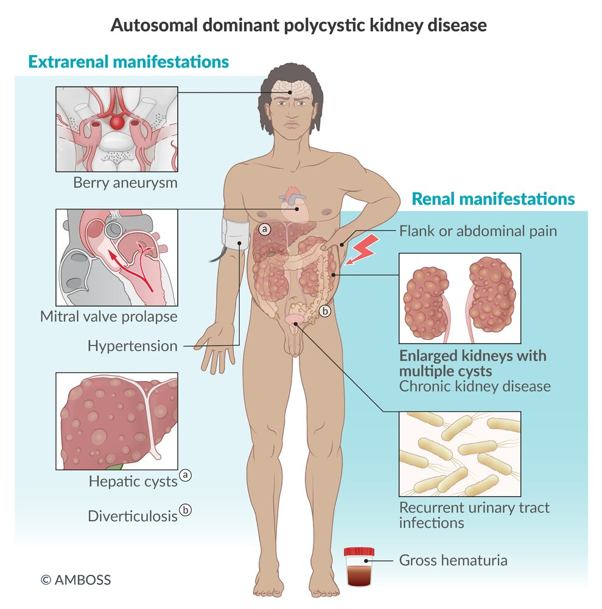
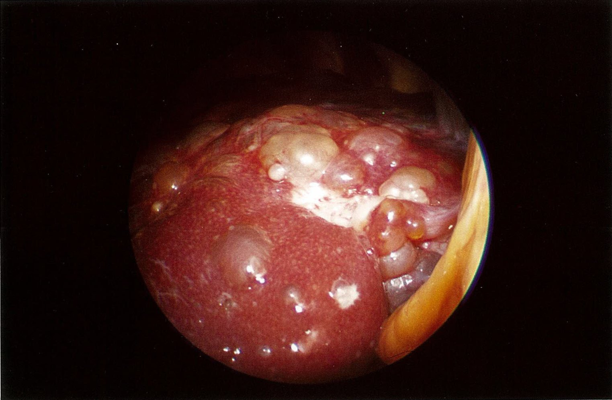
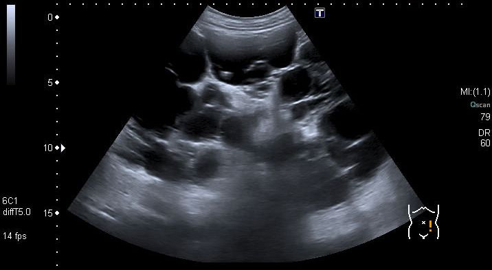
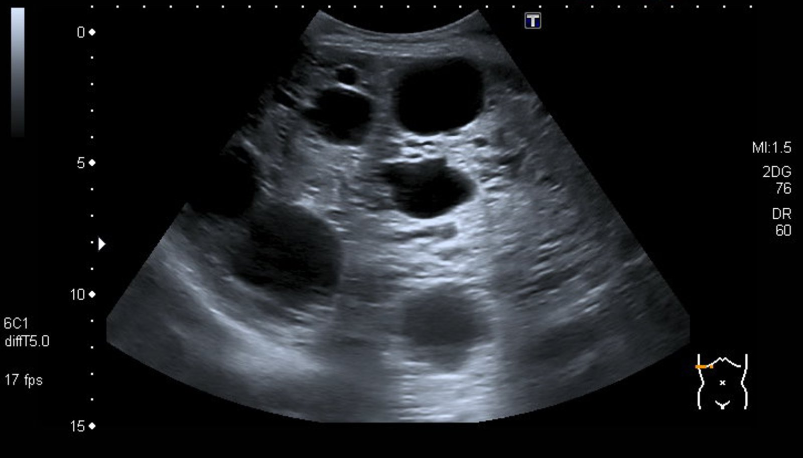
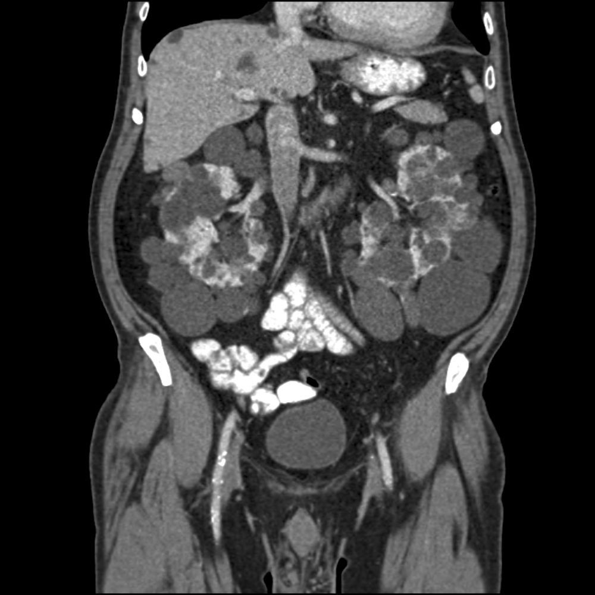
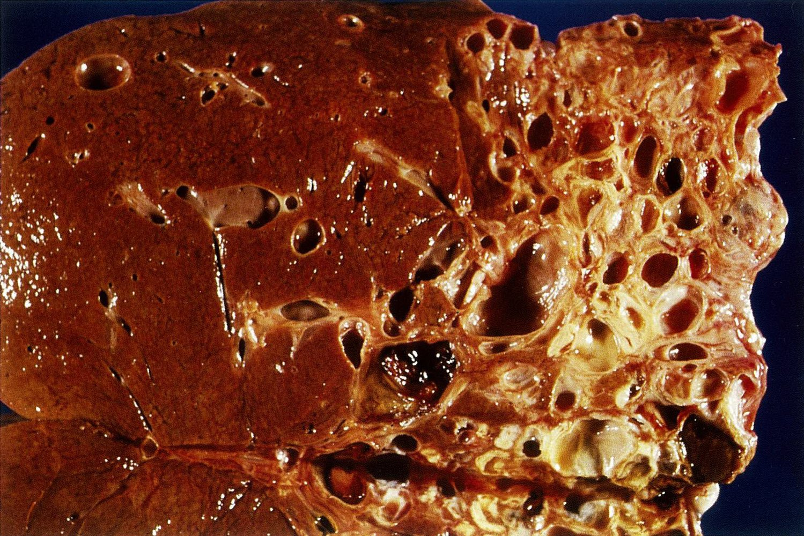
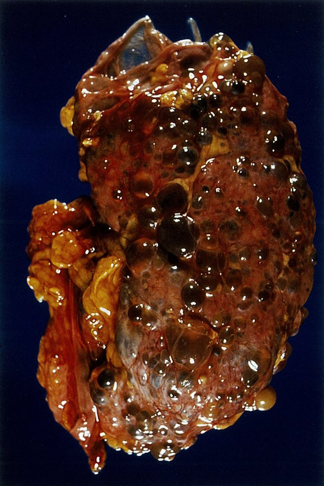
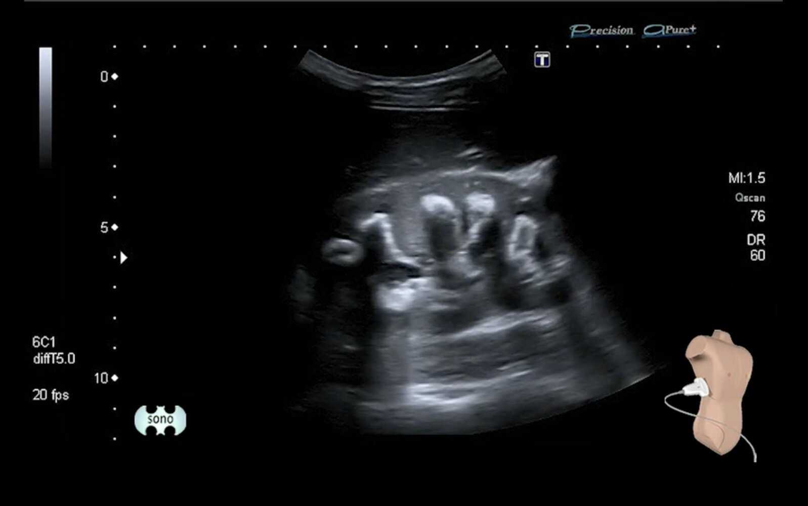

# Polycystic kidney disease

*Categories: Clinical knowledge > Pediatrics > Pediatric urology > Polycystic kidney disease*

[Original Article Link](https://coursology-qbank.com/amboss/article/li0v7f)

---

## Summary

Polycystic <u>kidney</u> disease (PKD) is an inherited disorder characterized by the development of multiple cysts in the <u>kidneys</u>. There are two forms of PKD: <u>autosomal dominant</u> (<u>ADPKD</u>) and <u>autosomal recessive</u> (<u>ARPKD</u>). Both disorders have a wide range of clinical presentations. <u>ADPKD</u> manifests with flank <u>pain</u>, <u>arterial hypertension</u>, and <u>end-stage renal disease</u> (<u>ESRD</u>) with symptom onset in adulthood. Patients with severe <u>ARPKD</u> and onset during <u>infancy</u> or early childhood have a <u>mortality rate</u> of up to 40% and typically present with <u>respiratory failure</u> and progressive renal impairment. Early diagnosis and treatment may prevent or delay <u>ESRD</u> in both conditions, but <u>kidney transplant</u> is the only curative treatment option.

---

## Epidemiology

* <u>Incidence</u>

* <u>ADPKD</u>: ∼ 1/1,000 [[1]](https://coursology-qbank.com/amboss/article/KybUTw)

* The most common inherited cause of <u>chronic kidney disease</u> [[2]](https://coursology-qbank.com/amboss/article/tBbXcw)

* Responsible for 5–10% of <u>end-stage renal disease</u> (<u>ESRD</u>) [[3]](https://coursology-qbank.com/amboss/article/w8YhKI)

* <u>ARPKD</u>: ∼ 1/20,000 [[4]](https://coursology-qbank.com/amboss/article/5wYijr)

* <u>Prevalence</u>: ∼ 140,000 patients with polycystic <u>kidney</u> disease in the US [[5]](https://coursology-qbank.com/amboss/article/GDYBfr)

* Sex: <u>♂</u> = <u>♀</u> [[6]](https://coursology-qbank.com/amboss/article/tDYXTr)

Epidemiological data refers to the US, unless otherwise specified.

---

## Etiology

* <u>ADPKD</u> [[7]](https://coursology-qbank.com/amboss/article/ZNWZ-l0)

* <u>Autosomal dominant inheritance</u>

* <u>Complete penetrance</u> but <u>variable expressivity</u>

* Mutation in: [[8]](https://coursology-qbank.com/amboss/article/FDYgTr)[[9]](https://coursology-qbank.com/amboss/article/yKYdQJ)

* PKD1 on <u>chromosome</u> 16 (85% of cases); , the <u>gene</u> that encodes <u>polycystin-1</u> OR

* PKD2 on <u>chromosome</u> 4 (15% of cases); , the <u>gene</u> that encodes <u>polycystin-2</u>

* Positive <u>family history</u>  [[1]](https://coursology-qbank.com/amboss/article/KybUTw)

* <u>ARPKD</u>

* <u>Autosomal recessive inheritance</u>

* Mutation in PKHD1 <u>gene</u> on <u>chromosome</u> 6, the <u>gene</u> that encodes for fibrocystin, a protein involved in the maintenance of <u>primary cilia</u> of the renal <u>collecting duct</u> and biliary <u>epithelial</u> cells

---

## Pathophysiology

### <u>ADPKD</u>

* <u>Two-hit hypothesis</u>

* Inherited mutation in one <u>allele</u> of <u>PKD1</u> (<u>polycystin-1</u>) or <u>PKD2</u> (<u>polycystin-2</u>) <u>genes</u>  [[10]](https://coursology-qbank.com/amboss/article/dwYo3r)

* Polycystin-1: involved in cell-cell and/or cell-matrix interactions

* Polycystin-2: a nonselective <u>cation</u> channel transporting <u>Ca2+</u>

* Additional second somatic <u>acquired mutation</u> in tubule <u>epithelial</u> cells

* Abnormal <u>cilia</u>-mediated signaling pathways →;  formation and expansion of cysts in the <u>renal cortex</u> and medulla → compression of renal vessels with activation of the <u>renin-angiotensin-aldosterone system</u> (<u>RAAS</u>), <u>ischemia</u>, and destruction of the <u>kidney</u> <u>parenchyma</u> [[11]](https://coursology-qbank.com/amboss/article/OwYIQr)

### <u>ARPKD</u>

* Inherited mutation in the <u>PKHD1</u> <u>gene</u> → defective <u>fibrocystin</u> (also called <u>polyductin</u>) → cystic dilatation of <u>collecting ducts</u> and <u>bile</u> ducts (intrahepatic and extrahepatic <u>bile</u> ducts) [[12]](https://coursology-qbank.com/amboss/article/swYt4r)

---

## Clinical features

### ADPKD [[1]](https://coursology-qbank.com/amboss/article/KybUTw)[[11]](https://coursology-qbank.com/amboss/article/OwYIQr)

Clinical manifestations of <u>ADPKD</u> usually directly correlate with the progression of cystic degeneration.

#### Symptom onset

* Symptom onset most commonly occurs after 30 years of age but can develop earlier, occasionally even in childhood. [[1]](https://coursology-qbank.com/amboss/article/KybUTw)

* Patients with the <u>PKD2</u> mutation often have less severe symptoms and later onset than patients with the <u>PKD1</u> mutation. [[1]](https://coursology-qbank.com/amboss/article/KybUTw)

#### Renal manifestations

* Mild <u>polyuria</u>

* <u>Macroscopic hematuria</u>

* Flank and/or abdominal <u>pain</u>

* <u>Recurrent UTIs</u>

* <u>Nephrolithiasis</u>

* Signs of <u>CKD</u> (e.g., <u>fluid overload</u>, <u>uremia</u>)

* Palpable, enlarged <u>kidneys</u> (usually normal at <u>birth</u>)

#### Extrarenal manifestations

* Digestive

* <u>Hepatic cysts</u>: multiple, benign, mostly asymptomatic, and more prevalent with age

* <u>Pancreatic</u> cysts

* <u>Colonic diverticulosis</u>

* Abdominal or <u>inguinal hernias</u>

* Cardiovascular 

* Symptoms of <u>hypertension</u>; , e.g., morning <u>headaches</u> due to increased <u>renin</u> production

* <u>Heart valve</u> defects (commonly <u>mitral valve prolapse</u>)

* <u>Pericardial effusion</u>

* <u>Left ventricular hypertrophy</u>

* <u>Coronary artery aneurysm</u> and <u>aortic aneurysm</u>

* Neurological: intracranial <u>saccular aneurysm</u> (in ∼ 8% of patients with <u>ADPKD</u>) [[1]](https://coursology-qbank.com/amboss/article/KybUTw)

* Higher risk if positive <u>ADPKD</u> <u>family history</u>

* <u>Aneurysm</u> rupture: <u>clinical features of SAH</u>

* Other manifestations

* <u>Bronchiectasis</u>

* Cysts in the <u>spleen</u>, <u>ovaries</u>, or <u>seminal vesicles</u>

> [!TIP]
> <u>Hypertension</u>, <u>hematuria</u>, and <u>UTIs</u> often precede <u>kidney function</u> decline. [[1]](https://coursology-qbank.com/amboss/article/KybUTw)

Autosomal dominant polycystic kidney disease

Polycystic liver

### ARPKD [[1]](https://coursology-qbank.com/amboss/article/KybUTw)

Symptom onset occurs most commonly in utero, <u>infancy</u>, or childhood.

#### Renal manifestations

* In severe cases, fetal renal impairment and <u>oliguria</u> leading to <u>oligohydramnios</u> and <u>Potter sequence</u>

* Craniofacial abnormalities (e.g., <u>retrognathia</u>, low-set <u>ears</u>, flat nose) and <u>talipes equinovarus</u>

* <u>Pulmonary hypoplasia</u> leading to <u>respiratory failure</u> in <u>neonates</u>

* Protruding abdomen;  due to bilateral renal enlargement and/or <u>hepatomegaly</u>  [[1]](https://coursology-qbank.com/amboss/article/KybUTw)

* Signs of <u>CKD</u>, e.g., <u>hematuria</u>, <u>proteinuria</u>, <u>oliguria</u>

> [!TIP]
> Renal manifestations are typically more severe in patients with <u>perinatal</u> onset than those with onset in childhood, <u>adolescence</u>, or adulthood. [[1]](https://coursology-qbank.com/amboss/article/KybUTw)

#### Extrarenal manifestations

* <u>Hypertension</u> 

* Early manifestation  [[4]](https://coursology-qbank.com/amboss/article/5wYijr)

* Often resistant to monotherapy

* Complications often occur, e.g., <u>heart failure</u>, <u>cerebrovascular disease</u>, progressive renal impairment.

* Congenital hepatic and portal <u>fibrosis</u>

* Progressive <u>liver</u> failure

* Signs of <u>portal hypertension</u> or <u>cholangitis</u>

---

## Diagnosis

### General principles [[1]](https://coursology-qbank.com/amboss/article/KybUTw)[[13]](https://coursology-qbank.com/amboss/article/yGddb70)

* Consult nephrology for all patients.

* Preferred initial study: abdominal <u>ultrasound</u>

* If <u>ultrasound</u> findings are unclear or presentation is atypical, obtain <u>MRI</u> (or CT) and <u>genetic testing</u>.

* Screen for extrarenal complications (e.g., <u>hypertension</u>, <u>intracranial aneurysms</u>) in patients with <u>ADPKD</u>.

* Monitor <u>kidney function</u> and <u>CKD complications</u>.

### Imaging

#### Abdominal <u>ultrasound</u> [[1]](https://coursology-qbank.com/amboss/article/KybUTw)[[13]](https://coursology-qbank.com/amboss/article/yGddb70)[[14]](https://coursology-qbank.com/amboss/article/ggdFu60)

* Indications

* Screening for adults who have <u>first-degree relatives</u> with <u>ADPKD</u> [[13]](https://coursology-qbank.com/amboss/article/yGddb70)

* Preferred initial study for all patients with clinically suspected PKD

* Diagnostic criteria for patients with <u>first-degree relatives</u> with <u>ADPKD</u> [[13]](https://coursology-qbank.com/amboss/article/yGddb70)

* Children < 15 years old: ≥ 1 cyst (unilateral or bilateral) [[14]](https://coursology-qbank.com/amboss/article/ggdFu60)

* Patients 15–39 years old: ≥ 3 cysts (unilateral or bilateral)

* Patients 40–59 years old: ≥ 2 cysts in each <u>kidney</u>

* Patients > 60 years old: ≥ 4 cysts in each <u>kidney</u>

* <u>ADPKD</u> findings  ;  [[14]](https://coursology-qbank.com/amboss/article/ggdFu60)

* <u>Renal cysts</u>: multiple, bilateral, <u>anechoic</u>, round lesions of varying sizes

* Bilateral renal enlargement

* Hepatic, <u>pancreatic</u>, and/or splenic cysts [[11]](https://coursology-qbank.com/amboss/article/OwYIQr)

* <u>Kidney stones</u> (i.e., <u>hyperechoic</u> signal with <u>acoustic shadowing</u>) may be observed.

* <u>ARPKD</u> findings [[1]](https://coursology-qbank.com/amboss/article/KybUTw)

* <u>Renal cysts</u>: multiple, bilateral, <u>anechoic</u>, round lesions of equal size

* Bilateral renal enlargement with diffuse <u>increased echogenicity</u> and poor corticomedullary differentiation

* <u>Hepatic cysts</u>

* Hepatic and portal <u>fibrosis</u>

Autosomal dominant polycystic kidney disease (ADPKD)

Liver involvement in polycystic kidney disease

#### <u>MRI</u> or CT abdomen [[1]](https://coursology-qbank.com/amboss/article/KybUTw)[[14]](https://coursology-qbank.com/amboss/article/ggdFu60)

* Indications

* Equivocal findings on abdominal <u>ultrasound</u>

* To measure <u>height-adjusted total kidney volume</u>, an important prognostic marker used to assess for risk of rapid progression

* Findings [[14]](https://coursology-qbank.com/amboss/article/ggdFu60)  

* Bilateral renal enlargement

* <u>Renal cysts</u>: multiple, <u>hypodense</u>, well-demarcated, nonseptated, and thin-walled

Autosomal dominant polycystic kidney disease (ADPKD)

### <u>Laboratory studies</u> [[1]](https://coursology-qbank.com/amboss/article/KybUTw)[[13]](https://coursology-qbank.com/amboss/article/yGddb70)

* <u>CBC</u>: may show <u>anemia of chronic disease</u>

* <u>Kidney function tests</u>: ↑ <u>creatinine</u> and <u>BUN</u>, ↓ <u>estimated GFR</u> (may be normal even in patients with severe disease) [[1]](https://coursology-qbank.com/amboss/article/KybUTw)

* Urine studies: may show <u>proteinuria</u> (> 300 mg/24 h), <u>hematuria</u>  [[1]](https://coursology-qbank.com/amboss/article/KybUTw)[[13]](https://coursology-qbank.com/amboss/article/yGddb70)

* <u>CRP</u>: ↑ in cyst infection

* <u>Genetic testing</u>

* <u>ADPKD</u>: Sanger <u>sequencing</u> of <u>PKD1</u> and <u>PKD2</u>

* <u>ARPKD</u>: <u>gold standard</u> for diagnosis  [[1]](https://coursology-qbank.com/amboss/article/KybUTw)

### Additional studies in <u>ADPKD</u> [[1]](https://coursology-qbank.com/amboss/article/KybUTw)[[13]](https://coursology-qbank.com/amboss/article/yGddb70)

* <u>MR angiography</u> <u>brain</u> [[13]](https://coursology-qbank.com/amboss/article/yGddb70)[[15]](https://coursology-qbank.com/amboss/article/s_btpw)

* Use: screen for intracranial <u>saccular aneurysms</u>

* Indications

* <u>Family history</u> of <u>aneurysm</u> or <u>SAH</u>

* Planned extensive <u>surgery</u> (e.g., transplant)

* High-risk occupations (e.g., driver)

* <u>Blood pressure measurement</u>

* Indication: <u>family history</u> of <u>ADPKD</u>

* Frequency: annually starting at 5 years of age [[13]](https://coursology-qbank.com/amboss/article/yGddb70)

* <u>Echocardiography</u>

* Indications

* Cardiovascular signs and/or symptoms

* <u>Family history</u> of <u>idiopathic</u> <u>dilated cardiomyopathy</u>

* Findings may include:

* <u>Valvular heart disease</u> (e.g., <u>mitral valve prolapse</u>)

* <u>Pericardial effusion</u>

* <u>Idiopathic</u> <u>dilated cardiomyopathy</u>

---

## Pathology

* <u>ADPKD</u>  

* Progressive cystic dilatation of the <u>kidney</u> tubular system

* Cystic dilatation in other organs such as <u>liver</u> and <u>pancreas</u>

* <u>Left ventricular hypertrophy</u>

* Vascular dolichoectasias (elongations and distentions of the <u>arteries</u> caused by weakening of the vessel walls)

* Cardiac valvular abnormalities (e.g., defects of the <u>mitral valve</u> and the aortic root, annulus, and/or valve)

* <u>ARPKD</u>

* Cystic dilatation of the <u>collecting ducts</u> (other <u>nephron</u> segments are usually not affected)

* <u>Hepatic fibrosis</u> (see “Pathology” section in “<u>Cirrhosis</u>”)

Hepatic cysts in autosomal dominant polycystic kidney disease

Renal cysts in autosomal dominant polycystic kidney disease (ADPKD)

---

## Differential diagnoses

* <u>Renal cysts</u>

* <u>Acquired cystic kidney disease</u>

* <u>Multicystic dysplastic kidneys</u>

* <u>Autosomal dominant tubulointerstitial kidney disease</u>

* <u>Medullary sponge kidney</u>

* <u>Nephronophthisis</u>

* <u>Obstructive cystic dysplasia</u>

* <u>von Hippel-Lindau syndrome</u>

### Acquired cystic kidney disease

* Etiology

* No <u>gene</u> mutation

* Typically seen in advanced <u>chronic kidney disease</u>, especially in patients on <u>renal replacement therapy</u>

* Clinical features

* Small, usually bilateral cysts

* Multiple cysts (> 4 cysts per <u>kidney</u>)

* Small-to-normal size <u>kidney</u>

* Complications: cyst infection or bleeding, <u>renal cell carcinoma</u>

* Diagnosis: <u>ultrasound</u>

* Treatment: See “Treatment” in “<u>Renal cysts</u>.”

* Prevention: Prevent or delay progression to <u>ESRD</u> (see “Treatment” below).

### Multicystic dysplastic kidneys

* Definition: <u>renal dysplasia</u> with multiple cystic dilatations of <u>nephrons</u> during <u>embryonic development</u>

* Etiology: predominantly nonhereditary

* Pathophysiology

* Sporadic occurrence during <u>embryonic development</u> of the <u>ureter</u> and <u>nephrons</u>

* Defective interaction of the <u>ureteric bud</u> and the <u>metanephric mesenchyme</u> → nonfunctional <u>kidney</u> with multiple cysts and <u>connective tissue</u>

* Clinical features

* Onset: <u>birth</u> to childhood

* Rarely symptomatic

* Large cysts might impair urinary output (due to constriction of the <u>urinary tract</u>).

* Usually unilateral cysts

* In the case of bilateral involvement

* <u>Potter sequence</u> (due to <u>oligohydramnios</u>)

* <u>Spontaneous abortion</u> in case of failure of <u>amniotic fluid</u> production

* <u>Renal insufficiency</u> is rare.

* Extrarenal manifestations:

* <u>Congenital heart defects</u>

* Esophageal or <u>intestinal atresia</u>

* Spinal anomalies

* <u>VACTERL association</u>

* Diagnosis: <u>ultrasound</u> showing unilateral (rarely bilateral) cysts of varying size

* Treatment

* Surveillance in most cases

* <u>Nephrectomy</u> is indicated in severe cases (e.g., <u>hypertension</u>, progression of cyst growth)

* Prognosis

* Most cases regress spontaneously.

* The nondysplastic <u>kidney</u> usually functions properly and takes over the function of two <u>kidneys</u>.

### Autosomal dominant tubulointerstitial kidney disease (<u>ADTKD</u>) [[16]](https://coursology-qbank.com/amboss/article/gkbFMF)

* Definition: a group of rare <u>kidney</u> diseases characterized by tubular damage and <u>interstitial</u> <u>fibrosis</u> in the absence of <u>glomerular</u> lesions

* Etiology
* The 3 major genetic causes include <u>autosomal dominant</u> mutation of one of the following <u>genes</u>: [[17]](https://coursology-qbank.com/amboss/article/LwYwjr)

* <u>UMOD</u>, encoding <u>uromodulin</u> (∼ 70% of cases)

* MUC1, encoding <u>mucin</u>–1 (∼ 30% of cases)

* <u>REN</u>, encoding <u>renin</u> (< 5% of cases)

* Pathophysiology

* <u>ADTKD</u> due to <u>UMOD</u> mutation

* Accumulation of <u>uromodulin</u> within the cells of the thick <u>ascending loop of Henle</u> → <u>mitochondrial</u> dysregulation → tubular <u>cell death</u> → <u>chronic kidney disease</u>

* ↓ <u>Uromodulin</u> production → ↓ apical expression of the Na-K-2Cl cotransporter → ↑ <u>natriuresis</u> → compensatory <u>proximal</u> tubular <u>sodium</u> reabsorption → secondary increase in <u>proximal</u> <u>urate</u> reabsorption  → <u>hyperuricemia</u>

* <u>ADTKD</u> due to MUC1 mutation: possible dominant-negative or <u>gain-of-function</u> effect of MUC1 mutation

* <u>ADTKD</u> due to <u>REN</u> mutation: accumulation of preprorenin in the renal tubular cells → <u>apoptosis</u> → <u>chronic kidney disease</u>

* Clinical features

* Small-to-normal size <u>kidney</u>

* <u>Signs of chronic kidney disease</u> (e.g., <u>hypertension</u>, <u>fluid overload</u>, <u>uremia</u>)

* <u>ESRD</u> usually develops between 30–60 years of age.

* Occasional bilateral cysts, mostly medullary

* Absent or minimal <u>proteinuria</u> with a <u>bland urine sediment</u>

* <u>ADTKD</u> due to <u>UMOD</u> mutation: <u>gout</u> since <u>adolescence</u>

* Clinical findings associated with low <u>renin</u> in <u>ADTKD</u> due to <u>REN</u> mutation

* Low-to-normal blood pressure

* <u>Hypoproliferative anemia</u> in childhood

* Mild <u>hyperkalemia</u>

* <u>Hyperuricemia</u>

* Diagnosis

* <u>Ultrasound</u>

* Small <u>kidneys</u> in advanced <u>stages of CKD</u>

* Medullary cysts can rarely be seen.

* <u>Genetic analysis</u> provides a definitive diagnosis.

* Pathology: tubulointerstitial <u>fibrosis</u>

* Treatment

* Curative: <u>kidney transplant</u>

* <u>Treatment of chronic kidney disease</u>

* <u>ADTKD</u> due to <u>UMOD</u> mutation: <u>allopurinol</u> for <u>gout</u>

* <u>ADTKD</u> due to <u>REN</u> mutation: <u>Fludrocortisone</u> or high-<u>sodium</u> diet may be used for <u>low blood pressure</u>, <u>hyperkalemia</u>, and to potentially preserve <u>kidney function</u>.

* Prognosis: poor (due to progression of <u>chronic kidney disease</u>) [[16]](https://coursology-qbank.com/amboss/article/gkbFMF)

### Medullary sponge kidney [[18]](https://coursology-qbank.com/amboss/article/owY0Pr)

* Definition: a rare congenital disorder characterized by calcified cysts in the <u>collecting ducts</u> in one or both <u>kidneys</u>

* <u>Epidemiology</u> [[18]](https://coursology-qbank.com/amboss/article/owY0Pr)

* <u>Prevalence</u>: occurs in ∼ 1% of the general population and 12–20% of patients with recurrent <u>calcium</u> <u>nephrolithiasis</u> [[18]](https://coursology-qbank.com/amboss/article/owY0Pr)

* <u>♀</u> = <u>♂</u>

* Mostly diagnosed in young adults

* Etiology

* Most cases are sporadic.

* Some cases are associated with genetic mutations.

* Pathophysiology: disruption at the <u>ureteric bud</u>-<u>metanephric mesenchyme</u> interface → <u>distal</u> tubular acidification defect → ↑ urine <u>pH</u> and urinary stasis in the dilated <u>collecting ducts</u> → <u>calcium</u> <u>phosphate</u> and/or <u>calcium</u> oxalate lithogenesis

* Clinical features

* Usually asymptomatic (incidental finding)

* <u>Signs of nephrolithiasis</u> (e.g., colicky flank <u>pain</u>)

* Painful excretion of small stones with <u>urine passage</u> is common.

* <u>Signs and symptoms of UTI</u> (e.g., <u>polyuria</u>, <u>dysuria</u>)

* <u>Hematuria</u>

* Diagnosis [[19]](https://coursology-qbank.com/amboss/article/9QdNyp0)

* <u>Ultrasound</u> abdomen and <u>pelvis</u>: cysts and/or neprholithiasis, dilatation of the collection ducts, <u>hyperechoic</u> <u>renal papillae</u>

* Contrast <u>CT urography</u>: parallel striations from contrast that extend from the <u>papilla</u> to the medulla and persist on delayed imaging (<u>papillary</u> blush), <u>nephrocalcinosis</u>

* <u>Intravenous urography</u> (rarely used): irregular ectatic medullary <u>collecting ducts</u> (classic paintbrush or bouquet appearance)

* Treatment

* <u>Prevention of nephrolithiasis</u>: high fluid intake, <u>potassium</u> <u>citrate</u>, <u>thiazide diuretics</u>

* Management of complications: e.g., <u>extracorporeal shock wave lithotripsy</u>, <u>renal replacement therapy</u> for <u>ESRD</u>

* Complications

* <u>Recurrent UTIs</u> can cause <u>urinary tract obstruction</u>.

* Rare: <u>renal tubular acidosis</u>, <u>ESRD</u>

* Defective bone mineralization secondary to <u>renal tubular acidosis</u>

Medullary sponge kidney

### Nephronophthisis (<u>NPHP</u>)

* Definition: a hereditary cystic <u>kidney</u> disease that typically manifests in childhood, characterized by renal ciliopathy, reduced renal concentration ability, and progression to <u>ESRD</u>

* <u>Epidemiology</u> [[20]](https://coursology-qbank.com/amboss/article/UAbbQw)

* <u>Incidence</u>: ∼ 1/1,000,000 in the U.S.

* One of the most common genetic disorders leading to <u>ESRD</u> in children

* Etiology

* <u>Autosomal recessive inheritance</u> pattern

* Mutations in <u>genes</u> encoding nephrocystin protein

* Clinical features

* Similar clinical and histopathological features as <u>ADTKD</u>

* Renal manifestations

* Multiple, bilateral, mostly corticomedullary, <u>kidney cysts</u>

* <u>Polyuria</u>, <u>polydipsia</u> (due to impaired ability to concentrate urine)

* Signs of <u>chronic tubulointerstitial nephritis</u>

* Signs of <u>chronic kidney disease</u> (e.g., <u>hypertension</u>, <u>fluid overload</u>, <u>anemia</u>, <u>uremia</u>)

* <u>ESRD</u> usually develops before the age of 20 years  [[21]](https://coursology-qbank.com/amboss/article/VzbG7w)

* Extrarenal manifestations (10–20% of cases) include: retinal defects, <u>liver</u> fibrosis, skeletal abnormalities, cardiac defects, or <u>brain</u> developmental disorders

* Diagnosis

* <u>Renal ultrasound</u> may reveal corticomedullary cysts

* <u>Genetic analysis</u> allows definitive diagnosis

* Treatment

* <u>Treatment of chronic kidney disease</u>

* Curative: <u>kidney transplant</u>

### Obstructive cystic dysplasia

* Definition: <u>renal dysplasia</u> and cystic dilatation secondary to obstruction in the <u>urinary tract</u> (e.g., <u>ureteral stenosis</u>, urethral <u>agenesis</u>) during <u>fetal development</u>

* Etiology

* <u>Ureteral stenosis</u>

* <u>Posterior urethral valves</u>

* <u>Bladder outlet obstruction</u>

* Urethral <u>agenesis</u>

* <u>Duplex collecting system</u> with obstructing <u>ureterocele</u>

* Congenital vesicoureteric junction obstruction

* Pathophysiology: <u>urinary tract obstruction</u> → <u>urine retention</u> in functioning <u>nephrons</u> → formation of <u>glomerular</u> cysts in the nephrogenic zone

* Clinical features

* Onset: <u>birth</u> to childhood

* During <u>pregnancy</u>: <u>oligohydramnios</u>

* The cause, the severity, and the timing of the obstruction determine the extent of symptoms

* Asymptomatic in mild cases

* <u>Acute renal failure</u> in severe cases

* Extrarenal manifestations

* <u>Congenital heart defects</u>

* <u>CNS</u> anomalies

* <u>VACTERL association</u>

* Diagnosis: <u>ultrasound</u> showing unilateral or bilateral cysts of varying size (cysts are usually smaller than those seen in patients with <u>multicystic dysplastic kidneys</u>) [[22]](https://coursology-qbank.com/amboss/article/ywYdlr)

* Treatment: elimination of the obstruction as a curative approach (e.g., urethral valve <u>ablation</u>)

The differential diagnoses listed here are not exhaustive.

---

## Treatment

Specialist consultation (e.g., nephrologist, hepatologist) is required for all patients.

### Supportive measures [[1]](https://coursology-qbank.com/amboss/article/KybUTw)[[13]](https://coursology-qbank.com/amboss/article/yGddb70)

The following are evidence-based recommendations for <u>ADPKD</u> that may also benefit patients with <u>ARPKD</u>.

* Management of blood pressure 

* Goal: to prevent or treat <u>hypertension</u> and <u>proteinuria</u> and slow <u>estimated GFR</u> decline

* Blood pressure targets

* 18–49 years of age, BP > 130/85 mm Hg, and <u>CKD stage</u> G1–2: BP ≤ 110/75 mm Hg [[13]](https://coursology-qbank.com/amboss/article/yGddb70)

* ≥ 50 years of age with any stage <u>CKD</u>: mean <u>SBP</u> < 120 mm Hg [[13]](https://coursology-qbank.com/amboss/article/yGddb70)

* Agents: <u>ACE inhibitors</u> or <u>ARBs</u>

* <u>ASCVD risk</u> reduction

* <u>Smoking cessation</u>

* <u>Management of hyperlipidemia</u>

* Maintaining a <u>healthy weight</u>

* Lifestyle modifications

* High fluid intake: to prevent <u>nephrolithiasis</u> and potentially slow cyst progression

* Dietary <u>sodium</u> and protein restriction

* General measures

* Early <u>treatment of UTIs</u> to prevent <u>renal cyst</u> infection

* Avoidance of <u>nephrotoxic substances</u> and <u>vasopressin</u> <u>agonists</u>, e.g., <u>NSAIDs</u>, <u>sulfonamide</u> <u>antibiotics</u>, <u>aminoglycosides</u>

* <u>Genetic counseling</u> during <u>family planning</u> as available

### <u>Tolvaptan</u> [[1]](https://coursology-qbank.com/amboss/article/KybUTw)[[13]](https://coursology-qbank.com/amboss/article/yGddb70)

* Indication: <u>ADPKD</u> with <u>estimated GFR</u> ≥ 25 mL/min/1.73m2 at risk of rapid progression  [[13]](https://coursology-qbank.com/amboss/article/yGddb70)

* Not recommended for patients with <u>ARPKD</u>

* <u>Tolvaptan</u> slows cyst progression and <u>estimated GFR</u> decline in <u>ADPKD</u>.

* Obtain <u>liver chemistries</u> before and during treatment to monitor for <u>liver</u> injury (may be irreversible).

### Management of complications [[1]](https://coursology-qbank.com/amboss/article/KybUTw)[[13]](https://coursology-qbank.com/amboss/article/yGddb70)

* <u>Hematuria</u> and cyst hemorrhage

* Typically <u>self-limited</u>, i.e., 2–7 days

* <u>Supportive care</u>, e.g., oral fluids, rest

* Consider temporary discontinuation of <u>anticoagulants</u>, <u>diuretics</u>, and <u>RAAS inhibitors</u>.

* Extensive bleeding and/or <u>retroperitoneal</u> or subcapsular <u>hematoma</u>: Inpatient management is often required.

* Persistent <u>hematuria</u>: Consider evaluation for <u>renal cell carcinoma</u>.

* <u>Renal cyst</u> infection [[23]](https://coursology-qbank.com/amboss/article/8OdO8J0)

* Obtain blood and <u>urine cultures</u>.

* <u>Management of sepsis</u> as indicated

* First-line: IV <u>antibiotics</u>, e.g., <u>fluoroquinolones</u>

* Duration of <u>antibiotic therapy</u>: 4–6 weeks [[13]](https://coursology-qbank.com/amboss/article/yGddb70)

* If <u>antibiotic</u> treatment failure: percutaneous or surgical drainage

* <u>ESRD</u>

* <u>Kidney transplant</u> is the only curative option.

* Other <u>renal replacement therapies</u> may be considered for patients awaiting transplant.

* Other complications

* Severe polycystic <u>liver</u> disease: Surgical excision, percutaneous <u>aspiration</u>, or <u>sclerotherapy</u> may be considered.

* <u>Management of SAH</u>

* <u>Management of portal hypertension</u>

* <u>Management of nephrolithiasis</u>

---