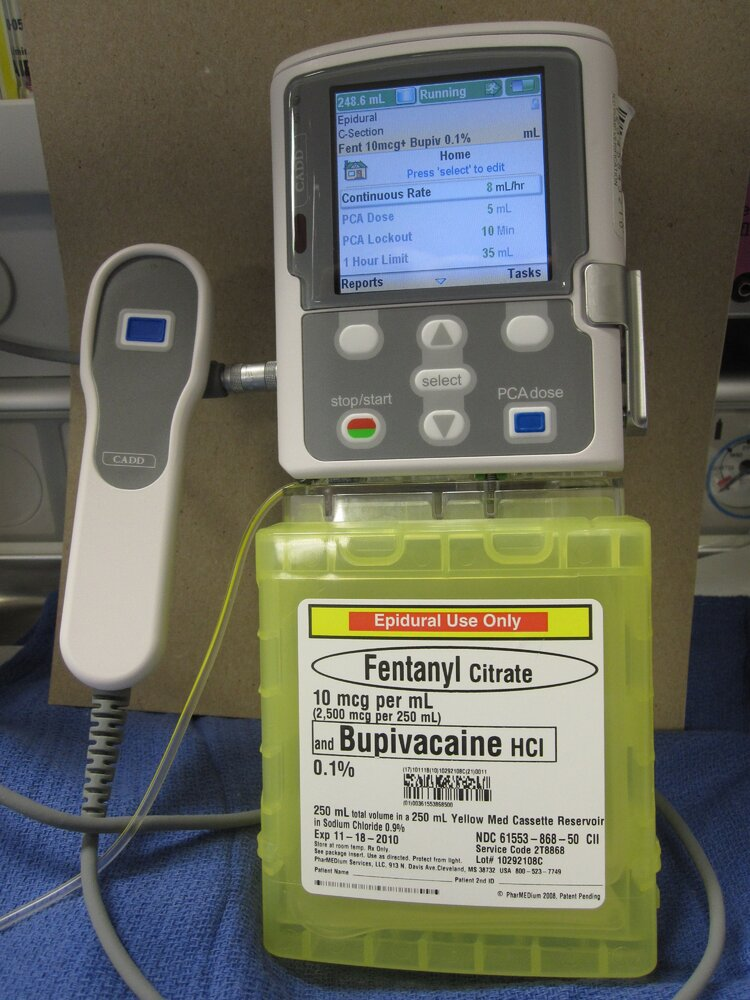

# Acute pain management

*Categories: Clinical knowledge > Pharmacology > Analgesics > Acute pain management*

[Original Article Link](https://coursology-qbank.com/amboss/article/Du01t3)

---

## Summary

<u>Acute pain</u> is typically sudden in onset and lasts less than one month. It indicates actual or potential tissue damage and is associated with trauma, <u>surgery</u>, and/or illness. <u>Acute pain</u> requires prompt treatment. <u>Analgesics</u> should be tailored to the underlying cause, patient factors (e.g., <u>opioid</u> naive or <u>opioid tolerant</u>, <u>contraindications for NSAIDs</u>), and care setting. The <u>WHO analgesic ladder</u> can help guide the selection of the most appropriate <u>pain management</u> strategy. When possible, <u>nonpharmacological analgesia</u> and <u>nonopioid analgesics</u> are preferred. <u>Opioids</u> should only be used if the benefits outweigh the risks and additional precautions are taken to minimize associated harms (e.g., <u>risk mitigation for opioid prescribing</u>). <u>Patient-controlled analgesia</u> (PCA), self-administered by the patient and delivered intravenously by an electronically controlled infusion pump, is used for severe <u>acute pain</u> that is difficult to manage and expected to be of short duration. <u>Management of acute exacerbation of chronic pain</u> can be challenging because complete <u>pain</u> relief is not usually possible; the primary aim is to restore patients to baseline function. <u>Pain management</u> in the emergency department often involves <u>local anesthesia</u>, <u>regional anesthesia</u>, and/or <u>analgesics for procedural sedation</u>. Specialized <u>pain</u> scales and scoring systems are used to <u>assess pain</u> in patients who cannot communicate verbally (e.g., critically ill patients, <u>neonates</u>, and <u>infants</u>).

See "<u>Principles of pain management</u>" for more information on <u>evaluation of pain</u>, <u>analgesics</u> and dosages, <u>nonpharmacological analgesia</u>, and <u>pain management in children</u>.

---

## Approach to acute pain

* Provide prompt <u>analgesia</u> for severe <u>acute pain</u>.

* <u>Evaluation of pain</u>

* Obtain a thorough <u>patient history</u>.

* Perform a comprehensive <u>physical examination</u>.

* <u>Assess pain</u> severity with a <u>pain intensity scale</u>.

* Document recent <u>analgesic</u> use (e.g., type and dosage).

* Tailor the treatment strategy to the patient,  ;  the underlying condition,  ;  and the care setting. 

* Use the <u>WHO analgesic ladder</u> as a guiding principle.

* Maximize <u>nonpharmacological analgesia</u> and <u>nonopioid analgesia</u> whenever possible. [[2]](https://coursology-qbank.com/amboss/article/FC1gFQ0)

* See “<u>Choice of analgesic for acute pain</u>” for cases in which <u>opioids</u> are required.

> [!TIP]
> Administer <u>acute pain</u> management promptly; withholding it does not improve the <u>accuracy</u> of a <u>physical examination</u>. [[3]](https://coursology-qbank.com/amboss/article/AN1Rdh0)

---

## Opioids for acute pain

### Risk mitigation [[2]](https://coursology-qbank.com/amboss/article/FC1gFQ0)

* Only prescribe <u>opioids</u> if the benefits outweigh the risks.

* See “<u>Risk mitigation for opioid prescribing</u>.”

### Prescribing principles [[2]](https://coursology-qbank.com/amboss/article/FC1gFQ0)

* Use immediate-release <u>opioids</u> rather than extended-release or <u>long-acting opioids</u>.

* Start at the lowest effective dose.

* Prescribe <u>PRN</u> doses rather than scheduled doses.

* Limit prescription duration to the expected duration of severe <u>pain</u>.

* Reevaluate the risk-benefit <u>ratio</u> if dosage increases are required.  [[2]](https://coursology-qbank.com/amboss/article/FC1gFQ0)

* See “<u>Oral analgesics</u>” and “<u>Parenteral analgesics</u>” for dosages.

* For management of overdose, see “<u>Opioid overdose</u>.”

---

## Patient-controlled analgesia

### Definition [[4]](https://coursology-qbank.com/amboss/article/zAdrms0)

<u>Patient-controlled analgesia</u> is a <u>pain management</u> method that allows patients to self-administer predetermined doses of <u>analgesic</u> medication (typically <u>opioids</u>) via an electronically controlled infusion pump.

### Indications

* For severe <u>acute pain</u> that is difficult to manage and is expected to be of short duration, e.g.: [[4]](https://coursology-qbank.com/amboss/article/zAdrms0)[[5]](https://coursology-qbank.com/amboss/article/_Ad5ms0)[[6]](https://coursology-qbank.com/amboss/article/PPVWUu0)

* Trauma-related <u>pain</u>

* <u>Vaso-occlusive crisis</u> in <u>sickle cell disease</u>

* Postoperative <u>pain</u> (e.g., if <u>oral analgesia</u> is insufficient or contraindicated)

* <u>Labor</u> <u>pain</u>

* Occasionally used in <u>chronic pain</u> (e.g., cancer <u>pain</u>)

### Components and settings [[5]](https://coursology-qbank.com/amboss/article/_Ad5ms0)[[6]](https://coursology-qbank.com/amboss/article/PPVWUu0)[[7]](https://coursology-qbank.com/amboss/article/-jVD1u0)

* Route of administration: IV (most common), epidural, transdermal

* Initial <u>loading dose</u> (optional): improves <u>early pain</u> control (e.g., in the postoperative period)

* On-demand bolus: patient-triggered, predetermined dose

* Lockout time

* Minimum time between boluses

* Allows each bolus to reach peak effect, which reduces the risk of overdose

* Continuous background infusion: basal delivery independent of patient input

### General principles [[5]](https://coursology-qbank.com/amboss/article/_Ad5ms0)[[6]](https://coursology-qbank.com/amboss/article/PPVWUu0)[[7]](https://coursology-qbank.com/amboss/article/-jVD1u0)

* <u>Opioid therapy</u> is typically used.

* <u>Morphine</u>: most common

* <u>Hydromorphone</u> or <u>fentanyl</u>: for patients with abnormal <u>kidney function</u> or <u>morphine</u> intolerance

* Consider a background infusion in patients with known <u>opioid tolerance</u>.

* Monitoring

* <u>Assess pain</u> level regularly (e.g., every 1–2 hours). [[4]](https://coursology-qbank.com/amboss/article/zAdrms0)

* Evaluate <u>respiratory rate</u> and level of sedation regularly.

* Inadequate <u>pain</u> relief

* Patient is not sedated: Consider increasing the IV bolus dose.

* Patient is sedated: Consider adding <u>nonopioid analgesics</u> or <u>regional anesthesia</u>.

* Discontinue when <u>oral analgesia</u> is sufficient for <u>pain control</u>.

> [!TIP]
> There is no consensus on optimal regimens; follow local protocols when available.

### Standard-dose regimens

|  Common standard-dose regimens for IV <u>patient-controlled analgesia</u> in adults [[5]](https://coursology-qbank.com/amboss/article/_Ad5ms0)[[7]](https://coursology-qbank.com/amboss/article/-jVD1u0)  |  |  |
| --- | --- | --- |
| ‎Opioid | Bolus dosage | Lockout time |
| <u>Morphine</u> |  * 1–2 mg   |  * 5–10 minutes   |
| <u>Hydromorphone</u> |  * 0.2–0.4 mg   |  * 5–10 minutes   |
| <u>Fentanyl</u> |  * 10–50 mcg   |  * 5–10 minutes   |

> [!TIP]
> Bolus dosages differ based on patient context (e.g., reason for <u>pain control</u>, history of <u>opioid</u> use).

### Complications [[5]](https://coursology-qbank.com/amboss/article/_Ad5ms0)

* <u>Adverse effects of opioids</u> (e.g., <u>nausea</u>, sedation)

* <u>Masking</u> of new pathologies (e.g., <u>thromboembolism</u>, <u>myocardial infarction</u>): may delay diagnosis, leading to worse outcomes

> [!TIP]
> PCA may result in slightly higher <u>opioid</u> doses but does not increase adverse effects; respiratory complications are usually due to prescribing or administration errors. [[5]](https://coursology-qbank.com/amboss/article/_Ad5ms0)

Patient controlled analgesia (PCA) pump

---