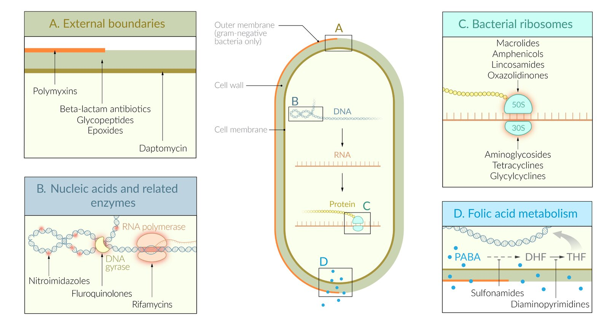
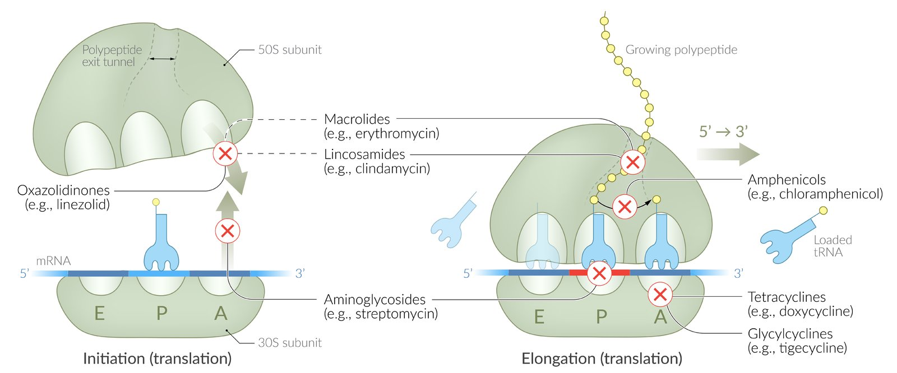
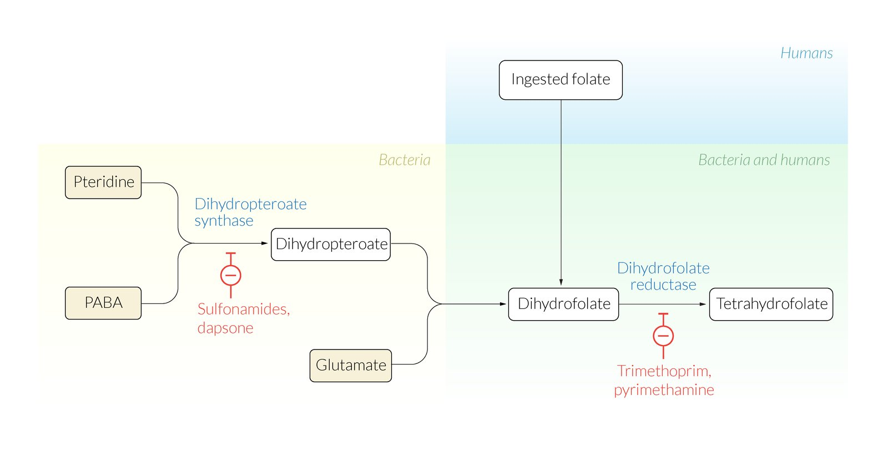
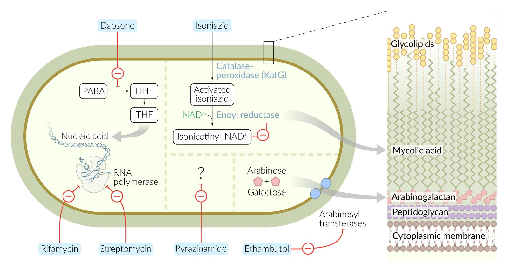

# Overview of antibiotic therapy

*Categories: Clinical knowledge > Pharmacology > Antimicrobials > Overview of antibiotic therapy*

[Original Article Link](https://coursology-qbank.com/amboss/article/mm0VTg)

---

## Summary

Antibiotics are a class of drugs employed mainly against bacterial infections. Some antibiotics are also used against parasitic infections. Antibiotics can have <u>bacteriostatic</u> (i.e., stopping bacterial reproduction), <u>bactericidal</u> (i.e., killing bacteria), or both mechanisms of action. Antibiotics are effective against either a small group of bacteria (narrow-spectrum) or a wide range of pathogens (broad-spectrum). Most antibiotics work by inhibiting <u>cell wall</u> synthesis, <u>protein synthesis</u>, or certain enzymes (e.g., <u>THF</u>, <u>RNA</u>-polymerase) in bacteria. Common side effects of antibiotic treatment include <u>hypersensitivity reactions</u>, as well as <u>nephrotoxic</u> and <u>hepatotoxic</u> effects. Many antibiotics are contraindicated in certain patient groups (e.g., children, pregnant and/or <u>breastfeeding</u> women). In the case of severe infection, one or more antibiotics may be initiated without waiting for a microbiological confirmation (<u>empiric antibiotic therapy</u>) to target the most likely pathogens. Antibiotics are widely used because they are instrumental in the management of infectious diseases; however, use of antibiotics without valid indications and with inappropriate dosages and timing has led to the emergence of antibiotic-resistant pathogens (e.g., <u>MRSA</u>, <u>Pseudomonas</u>).

---

## Overview

### Definitions

* Antibiotics: antimicrobial drugs effective against bacteria

* Bactericidal drug: a substance that kills bacteria (e.g., <u>β-lactams</u>, <u>glycopeptides</u>, <u>epoxides</u>)
* Some antibiotics are only effective if used:

* In combination (e.g., <u>sulfonamides</u> combined with diaminopyrimidine; <u>streptogramin</u> A combined with <u>streptogramin</u> B

* Against certain pathogens (e.g., <u>oxazolidinones</u> are only <u>bactericidal</u> against <u>Streptococci</u>)

* In higher concentrations (e.g., <u>amphenicols</u>)

* Bacteriostatic drug: a substance that slows bacterial growth or stops bacterial reproduction (e.g., <u>tetracyclines</u>, <u>glycylcyclines</u>, <u>macrolides</u>)

* Some antibiotics are <u>bacteriostatic</u> only against certain pathogens (e.g., <u>glycopeptides</u> against <u>C. difficile</u>).

* Some antibiotics can be both <u>bactericidal</u> and <u>bacteriostatic</u> (e.g., <u>dapsone</u> ).

* Antibiotics that are interfering with bacterial <u>protein synthesis</u> target the subunits (30S and 50S) of bacterial <u>ribosomes</u> (70S) and do not affect human <u>ribosomes</u> (80S).

> [!NOTE]
> As a general rule, agents that inhibit <u>cell wall</u> synthesis are <u>bactericidal</u> (except <u>ethambutol</u>), while those that inhibit <u>protein synthesis</u> are <u>bacteriostatic</u> (except <u>rifamycins</u>, and <u>aminoglycosides</u>).

### Overview  [[1]](https://coursology-qbank.com/amboss/article/6NYjXp)[[2]](https://coursology-qbank.com/amboss/article/pNYLXp)

| Overview of antibiotics |  |  |  |  |  |
| --- | --- | --- | --- | --- | --- |
| Antibacterial classes |  | Examples | Mechanism of action | <u>Bacteriostatic</u>/<u>bactericidal</u> | Mechanisms of resistance |
| Inhibition of <u>cell wall</u> synthesis |  |  |  |  |  |
| <u>β-lactams</u> | <u>Penicillins</u> |   * Natural <u>penicillins</u> (<u>penicillin G</u> and <u>penicillin V</u>)  * Anti-staphylococcal <u>penicillins</u> (e.g., <u>oxacillin</u>, <u>nafcillin</u>, <u>dicloxacillin</u>)  * <u>Aminopenicillins</u> (<u>amoxicillin</u>, <u>ampicillin</u>)  * <u>Antipseudomonal penicillins</u> (e.g., <u>piperacillin</u>, <u>ticarcillin</u>)    |  * Bind to <u>penicillin-binding</u> <u>proteins</u> (<u>PBPs</u>) → ↓ crosslinking of <u>peptidoglycan</u> layer   |  * <u>Bactericidal</u>   |   * Cleavage of <u>β-lactam</u> ring by <u>β-lactamases</u> (<u>penicillinases</u>)  * <u>PBP</u> mutations (e.g., <u>MRSA</u>)    |
| <u>Cephalosporins</u> |   * 1st generation (e.g., <u>cephalexin</u>)  * 2nd generation (e.g., cefaclor)  * 3rd generation (e.g., <u>cefixime</u>)  * 4th generation (e.g., <u>cefepime</u>)  * 5th generation (<u>ceftaroline</u>)    |   * Cleavage of <u>β-lactam</u> ring by <u>β-lactamases</u> (cephalosporinases)  * <u>PBP</u> mutations    |  |  |  |
| <u>Carbapenems</u> |   * <u>Imipenem</u>  * <u>Meropenem</u>  * <u>Ertapenem</u>  * <u>Doripenem</u>    |  * Cleavage of <u>β-lactam</u> ring by <u>β-lactamases</u> (carbapenemases)   |  |  |  |
| <u>Monobactams</u> |  * <u>Aztreonam</u>   |  * Cleavage by <u>β-lactamases</u> (less suceptible than other ß-lactams)   |  |  |  |
| <u>Glycopeptides</u> |  |   * <u>Vancomycin</u>  * <u>Bacitracin</u>  * <u>Teicoplanin</u>  * Telavancin  * Dalbavancin  * Oritavancin    |  * Bind to D-alanyl-D-<u>alanine</u> section of <u>peptidoglycan</u> precursor → inhibited <u>peptidoglycan</u> synthesis   |   * <u>Bactericidal</u>  * <u>Bacteriostatic</u> against <u>C. difficile</u>    |   * Reduced penetration in gram-negative bacteria  * Change in <u>peptidoglycan</u> precursor structure  * D-alanyl-D-<u>alanine</u> → D-alanyl-D-<u>lactate</u>  * <u>Glycopeptides</u> do not bind to the altered precursor.    |
| <u>Epoxides</u> |  |  * <u>Fosfomycin</u>   |  * Inactivate enolpyruvate transferase (MurA) → inhibition of <u>N-acetylmuramic acid</u> formation → disruption of <u>peptidoglycan</u> synthesis [[3]](https://coursology-qbank.com/amboss/article/2JYTtJ)   |  * <u>Bactericidal</u>   |   * Reduced penetration  * Enzyme <u>gene</u> overexpression  * Enzymatic inactivation    |
| Disruption of <u>cell membrane</u> integrity |  |  |  |  |  |
| <u>Lipopeptides</u> |  |  * <u>Daptomycin</u>   |  * Lipid portion binds to bacterial <u>cytoplasmic</u> membrane → formation of ion-conducting channels → intracellular <u>K+</u> efflux → bacterial <u>cell membrane</u> <u>depolarization</u>   |  * <u>Bactericidal</u>   |   * Not fully understood  * Altered <u>cell membrane</u> potential    |
| <u>Polymyxins</u> |  |   * <u>Polymyxin E</u> (<u>colistin</u>)  * <u>Polymyxin</u> B    |   * Cationic <u>detergents</u> (<u>polypeptides</u>) bind to outer <u>cell membrane</u> (phospholipids on gram-negative bacteria) → ↑ permeability → bacterial lysis  * Bind to and inhibit <u>lipopolysaccharides</u> → ↓ effect of bacterial <u>endotoxins</u>    |  * <u>Bactericidal</u>   |   * Not fully understood  * Altered <u>lipid A</u> portion of <u>lipopolysaccharides</u> (LPSs)  * Efflux pumps    |
| Inhibition of <u>protein synthesis</u> - <u>30S ribosomal subunit</u> |  |  |  |  |  |
| <u>Aminoglycosides</u> |  |   * <u>Gentamicin</u>  * <u>Amikacin</u>  * <u>Tobramycin</u>  * <u>Streptomycin</u>  * <u>Neomycin</u>    |  * Inhibit initiation complex → protein mistranslation   |  * <u>Bactericidal</u>   |   * Inactivating enzymes (via e.g., <u>acetylation</u>, <u>phosphorylation</u>, <u>adenylation</u>)  * Removal by efflux pumps  * Mutation of the bacterial <u>ribosome</u> binding site  * Reduced penetration  * <u>Anaerobic bacteria</u>  * Acidic environment    |
| <u>Tetracyclines</u> |  |   * <u>Tetracycline</u>  * <u>Doxycycline</u>  * <u>Minocycline</u>  * Eravacycline  * <u>Sarecycline</u>  * Omadacycline    |  * Block incoming <u>aminoacyl-tRNA</u> with <u>amino acids</u> → ↓ protein synthesis   |  * <u>Bacteriostatic</u>   |   * Reduced <u>cell wall</u> penetration  * Removal by efflux pumps (<u>plasmid</u>-encoded)  * Production of a protein that protects <u>ribosome</u>    |
| <u>Glycylcyclines</u> (tetracyclin derivative) |  |  * <u>Tigecycline</u>   |  * Designed to overcome the resistance of <u>tetracycline</u> (e.g., efflux pumps, <u>ribosomal</u> protection) [[4]](https://coursology-qbank.com/amboss/article/9JYNwJ)   |  |  |
| Inhibition of <u>protein synthesis</u> - <u>50S ribosomal subunit</u> |  |  |  |  |  |
| <u>Macrolides</u> and ketolides |  |   * <u>Erythromycin</u>  * <u>Clarithromycin</u>  * <u>Azithromycin</u>    |  * Bind to 23S <u>rRNA</u> → inhibition of transpeptidation, translocation, and chain elongation → ↓ protein synthesis   |  * <u>Bacteriostatic</u>   |   * Reduced penetration  * Efflux pumps  * <u>Methylation</u> of 23S <u>rRNA</u> binding site (of <u>50S subunit</u>) → inhibits binding of <u>macrolides</u>  * Cross-resistance with <u>clindamycin</u> and streptogramins  * Mutation of bacterial <u>ribosome</u> binding site    |
| <u>Lincosamides</u> |  |  * <u>Clindamycin</u>   |   * Impair transpeptidation → inhibition of chain elongation → ↓ protein synthesis  * Increase <u>opsonization</u> and <u>phagocytosis</u>  * Inhibit <u>alpha toxin</u> expression    |  * <u>Bacteriostatic</u>   |   * Reduced penetration  * Mutation of bacterial <u>ribosome</u> binding site    |
| Streptogramins |  |  * <u>Quinupristin-dalfopristin</u>   |   * <u>Dalfopristin</u> binds to 23S portion of the <u>50S subunit</u> → conformation change → facilitation of binding of <u>quinupristin</u>  * <u>Quinupristin</u> binds to and blocks <u>50S subunit</u> → inhibition of <u>polypeptide</u> elongation → ↓ protein synthesis [[5]](https://coursology-qbank.com/amboss/article/fJYktJ)    |   * <u>Bactericidal</u> when used in combination  * <u>Bacteriostatic</u> when used separately    |   * Alteration of bacterial <u>ribosome</u> binding site  * Enzyme-mediated <u>methylation</u>  * Efflux pumps    |
| <u>Oxazolidinones</u> |  |  * <u>Linezolid</u>   |  * Prevent association of 50S with <u>30S subunit</u> (23S <u>RNA</u>)→ impairment of <u>initiation complex</u> formation → early interruption of <u>protein synthesis</u>   |   * <u>Bacteriostatic</u>  * Only <u>bactericidal</u> against <u>Streptococci</u>    |  * <u>Point mutation</u> of the 23S <u>rRNA</u>   |
| <u>Amphenicols</u> |  |  * <u>Chloramphenicol</u>   |  * Prevent binding of amino acid-containing <u>aminoacyl-tRNA</u> → inhibition of <u>peptidyltransferase</u> → ↓ protein synthesis   |   * <u>Bacteriostatic</u>  * <u>Bactericidal</u> in higher concentrations    |   * Reduced penetration  * Enzymatic inactivation by acetyltransferase (<u>plasmid</u>-encoded)    |
| <u>DNA gyrase</u> inhibition |  |  |  |  |  |
| <u>Fluoroquinolones</u> |  |   * <u>Norfloxacin</u>  * <u>Moxifloxacin</u>  * <u>Gemifloxacin</u>  * <u>Ciprofloxacin</u>  * <u>Ofloxacin</u>  * <u>Levofloxacin</u>  * Enoxacin    |  * Inhibit <u>prokaryotic</u> <u>topoisomerase II</u> (<u>DNA gyrase</u>) and <u>topoisomerase IV</u> → inhibited <u>DNA synthesis</u>   |  * <u>Bacteriostatic</u> and <u>bactericidal</u>   |   * Mutations (<u>chromosome</u>-encoded) in <u>DNA gyrase</u> and <u>topoisomerase IV</u>  * ↓ Cell wall permeability  * Efflux pumps (<u>plasmid</u>-encoded resistance)    |
| Disruption of <u>DNA</u> integrity |  |  |  |  |  |
| <u>Nitroimidazoles</u> |  |   * <u>Metronidazole</u>  * <u>Tinidazole</u>    |   * Prodrug [[6]](https://coursology-qbank.com/amboss/article/TJY6tJ)  * <u>Free radical</u> formation → single-strand breaks in <u>DNA</u> molecules    |  * <u>Bactericidal</u> (and <u>antiprotozoal</u>)   |  * Reduced activation due to decreased enzymatic activity   |
| Inhibition of <u>folic acid</u> synthesis and reduction |  |  |  |  |  |
| <u>Sulfonamides</u> and diaminopyrimidines |  |   * <u>Trimethoprim-sulfamethoxazole</u>  * <u>Sulfadiazine</u> and <u>pyrimethamine</u>  * Sulfisozaxole    |   * Prevent bacterial <u>tetrahydrofolate</u> formation (<u>THF</u>)  → ↓ <u>DNA methylation</u>  * Synergistic effect  * <u>Sulfamethoxazole</u> inhibits <u>THF</u>  * <u>Trimethoprim</u> inhibits <u>dihydrofolate reductase</u> (<u>DHFR</u>).    |   * <u>Bactericidal</u> (<u>sulfamethoxazole</u>)  * <u>Bacteriostatic</u> (<u>trimethoprim</u>)    |   * Overproduction of para-aminobenzoate (<u>PABA</u>)  * Decreased uptake  * Structural changes on target enzymes (e.g., <u>dihydropteroate synthase</u>)  * Efflux pumps    |
| <u>Antimycobacterial drugs</u> |  |  |  |  |  |
| <u>Rifamycins</u> |  |   * <u>Rifampin</u>  * <u>Rifabutin</u>  * <u>Rifaximin</u>    |  * Block <u>mRNA</u> synthesis via inhibition of bacterial <u>DNA</u>-dependent <u>RNA</u>-polymerase → ↓ <u>protein synthesis</u>   |  * <u>Bacteriostatic</u> and <u>bactericidal</u>   |  * Mutated <u>RNA</u>-polymerase → ↓ binding of <u>rifamycins</u>   |
| Hydrazides |  |  * <u>Isoniazid</u>   |   * Prodrug  * Inhibits <u>mycolic acid</u> synthesis → ↓ <u>cell wall</u> synthesis    |  * <u>Bactericidal</u>   |  * Mutation causing ↓ <u>KatG</u> → ↓ expression of <u>catalase-peroxidase</u>   |
| Nicotinamides |  |  * <u>Pyrazinamide</u>   |   * Prodrug  * Not completely understood    |  * <u>Bacteriostatic</u> and <u>bactericidal</u> (depending on concentration)   |  * Mutations in RpsA <u>gene</u> coding for <u>ribosomal</u> protein <u>S1</u>   |
| Ethylenediamine derivates |  |  * <u>Ethambutol</u>   |  * Inhibits <u>arabinosyltransferase</u> → ↓ <u>cell wall</u> synthesis   |  * <u>Bacteriostatic</u>   |  * Mutations in EmbCAB <u>gene</u> coding for <u>arabinosyltransferase</u> → inability of the drug to inhibit the enzyme   |
| Sulfones |  |  * <u>Dapsone</u>   |  * Competitive <u>antagonism</u> of <u>para-aminobenzoic acid</u> → inhibited dihydrofolic acid synthesis   |  * <u>Bacteriostatic</u> and <u>bactericidal</u>   |  * Mutations in folP1 <u>gene</u> coding for dihydropteroate <u>synthase</u> → ↓ expression of <u>dihydropteroate synthase</u>   |
| <u>Nitrofurans</u> |  |  * <u>Nitrofurantoin</u>   |   * Prodrug  * Bind to bacterial <u>ribosomes</u> → inhibition of <u>DNA</u>, <u>RNA</u>, (<u>cell wall</u>) and <u>protein synthesis</u> [[7]](https://coursology-qbank.com/amboss/article/gJYFtJ)[[8]](https://coursology-qbank.com/amboss/article/SJYytJ)    |   * <u>Bacteriostatic</u>  * <u>Bactericidal</u> in higher concentrations    |   * Enzyme-mediated reduction  * Efflux pumps    |

> [!NOTE]
> AcTions at 30, CELebrationS at 50: Aminoglycosides and Tetracyclines are 30S inhibitors; Chloramphenicol/Clindamycin, <u>macrolides</u> (e.g., Erythromycin), Linezolid, and Streptogramin are 50S inhibitors.

> [!NOTE]
> All <u>protein synthesis</u> inhibitors are <u>bacteriostatic</u>, except <u>aminoglycosides</u> (<u>bactericidal</u>) and <u>linezolid</u> (can be either <u>bactericidal</u> or <u>bacteriostatic</u> depending on concentration).

Mechanism of action: antibiotics

Mechanisms of action of antibiotics on the bacterial ribosome

Antibiotics interfering with folate/tetrahydrofolate synthesis

---

## Beta-lactam antibiotics

### <u>Beta-lactams</u>

* Definition: : a group of antibiotics that contains <u>beta-lactam</u> ring in their molecular structure;  and includes <u>penicillins</u>, <u>carbapenems</u>, <u>monobactams</u>, and <u>cephalosporins</u>

* Mechanism of action

* Inhibit <u>cell wall</u> synthesis by blocking <u>peptidoglycan</u> crosslinking

* <u>β-lactam</u> mimics the D-ala-D-ala structure of bacterial <u>peptidoglycan</u> residue.

* <u>β-lactam</u> irreversibly binds to penicillin-binding proteins (<u>PBPs</u>) which act as transpeptidases → stalled cross-linking of <u>peptidoglycan</u> in <u>cell wall</u>;  (<u>β-lactam</u> cannot be cleaved) → inability to synthesize new <u>cell wall</u> during replication → bacterial <u>death</u> (<u>bactericidal</u> effect)

* Activate autolytic enzymes [[9]](https://coursology-qbank.com/amboss/article/VrYGTq)

* <u>CNS</u> penetration

* Only when <u>meninges</u> are inflamed

* Exceptions: <u>ceftriaxone</u> and <u>aztreonam</u> always have good <u>CNS</u> penetration.

* Route of elimination

* Primarily renal (via tubular secretion)

* Exceptions

* Primarily biliary: <u>nafcillin</u>

* Both renal and biliary: other anti-staphylococcal <u>penicillins</u> (e.g., <u>oxacillin</u>, <u>dicloxacillin</u>), <u>ceftriaxone</u>

* General adverse effects

* <u>Jarisch-Herxheimer reaction</u> (e.g., in <u>treatment of syphilis</u>)

* <u>Hypersensitivity reactions</u>

### Beta-lactamase inhibitors

* <u>β-lactamases</u>

* Are usually produced by gram-negative and anaerobic organisms

* Can split the <u>β-lactam</u> ring and render certain <u>β-lactam</u> antibiotics ineffective

* <u>β-lactamase inhibitors</u>

* Prevent the destruction of <u>β-lactam antibiotics</u> by <u>β-lactamases</u> and increase the spectrum of the antibiotic activity.

* Can be coadministered with <u>β-lactamase</u>-sensitive <u>penicillins</u> in order to treat <u>β-lactamase</u>-producing organisms

* Examples

* Clavulanate (combined with <u>amoxicillin</u>)

* Avibactam (combined with <u>ceftazidime</u>)

* Sulbactam (combined with <u>ampicillin</u>)

* Tazobactam (combined with <u>piperacillin</u>)

> [!NOTE]
> CATS: Clavulanate, Avibactam, Tazobactam, Sulbactam are <u>β-lactamase inhibitors</u>.

---

## Penicillins

### Natural <u>penicillins</u> (prototype <u>beta-lactam antibiotics</u>)

* Examples

* Penicillin G (<u>benzylpenicillin</u>)

* IV: crystalline <u>penicillin G</u>

* IM: <u>procaine</u> <u>penicillin G</u>, benzathine <u>penicillin G</u>

* Oral: penicillin V (<u>phenoxymethylpenicillin</u>)

* Clinical use

* Gram-positive aerobes (esp. <u>Streptococcus pyogenes</u>, <u>Streptococcus pneumoniae</u>)

* Gram-negative <u>cocci</u> (esp. <u>Neisseria meningitidis</u>)

* <u>Spirochetes</u> (esp. <u>Treponema pallidum</u>)

* Branching gram-positive <u>anaerobes</u> (especially <u>Actinomyces</u>)

* Adverse effects

* <u>Hypersensitivity reactions</u>

* <u>Hemolytic anemia</u> positive <u>direct Coombs test</u>

* Drug-induced <u>interstitial</u> nephritis

* <u>Seizures</u> [[10]](https://coursology-qbank.com/amboss/article/RJYlFJ)

* Mechanisms of resistance

* Cleavage of the <u>β-lactam</u> ring by <u>β-lactamases</u> (penicillinases)

* <u>PBP</u> mutations

### Penicillinase-resistant penicillins

* Examples (oral or IV)

* Nafcillin

* Dicloxacillin

* Oxacillin

* Floxacillin

* <u>Methicillin</u>

* Special characteristics: intrinsically <u>β-lactamase</u> resistant through the addition of bulky side chains (e.g., isoxazolyl), which prevent bacterial <u>β-lactamase</u> from hydrolyzing the <u>β-lactam</u> ring

* Clinical use: narrow spectrum

* Gram-positive aerobes; , especially <u>S. aureus</u> (non-<u>MRSA</u>)

* <u>Penicillinase-resistant penicillins</u> are not effective against <u>Streptococcus viridans</u>, <u>Enterococci</u>, or <u>Listeria</u>.

* Adverse effects

* <u>Interstitial</u> nephritis (esp. associated with <u>methicillin</u> use)

* <u>Hypersensitivity reactions</u>

* Mechanism of resistance: alteration of <u>PBP</u> binding site;  → reduced affinity → <u>pathogen</u> is not bound or inactivated by <u>β-lactam</u> (an altered <u>PBP</u> target site is one of the main <u>virulence factors</u> of <u>MRSA</u>)

> [!NOTE]
> Use NAF (<u>nafcillin</u>) for STAPH (<u>S. aureus</u>).

### Aminopenicillins (<u>penicillinase</u>-sensitive <u>penicillins</u>)

* Examples

* Oral or IV: amoxicillin (combined with <u>clavulanate</u>;  )

* IV or IM: ampicillin (with or without <u>sulbactam</u>)

* Special characteristics

* The molecular structure is similar to <u>penicillin</u> and therefore susceptible to degradation by <u>β-lactamase</u> (<u>β-lactamase</u> sensitive).

* Oral <u>bioavailability</u> of <u>amoxicillin</u> is greater than that of <u>ampicillin</u>

* Clinical use: broader spectrum of activity than <u>penicillin</u> (extended-spectrum <u>penicillin</u>)

* Gram-positive aerobes

* Gram-negative rods (not effective against <u>Enterobacter</u> spp.)

* Most effective against:

* <u>H. pylori</u>

* <u>H. influenzae</u>

* <u>E. coli</u>

* <u>Listeria monocytogenes</u>

* <u>Proteus mirabilis</u>

* <u>Salmonella</u>

* <u>Shigella</u>

* <u>Enterococci</u>

* <u>Spirochetes</u>

* Adverse effects

* <u>Diarrhea</u>

* <u>Pseudomembranous colitis</u>

* <u>Hypersensitivity reactions</u>

* Drug-induced <u>rash</u>

* Possibly <u>acute interstitial nephritis</u>

* Mechanisms of resistance: cleavage of the <u>β-lactam</u> ring by <u>penicillinases</u>

> [!NOTE]
> AmOxicillin is administered Orally, while amPicillin is administered by a Prick!

> [!NOTE]
> <u>Aminopenicillin</u> therapy HHEELPSSS against H. influenzae, H. pylori, E. coli, Enterococci, Listeria monocytogenes, Proteus mirabilis, Salmonella, Shigella, Spirochetes.

Aminopenicillin-related exanthem in infectious mononucleosis

### Antipseudomonal penicillins

* Examples

* IV ureidopenicillins: piperacillin (combined with <u>tazobactam</u>) , mezlocillin

* IV carboxypenicillins (e.g., ticarcillin)

* PO carbenicillin

* Clinical use: extended spectrum but <u>penicillinase</u>-sensitive

* Gram-negative rods, especially <u>Pseudomonas</u>

* Also effective against <u>anaerobes</u> (e.g., <u>Bacteroides fragilis</u>)

* Gram-positive aerobes: not effective against <u>S. viridans</u>

* Adverse effects: <u>hypersensitivity reactions</u>

> [!NOTE]
> The PIPER in his CAR full of TICks ran over <u>Pseudomonas</u>: PIPERacillin, CARbenicillin, and TICarcillin are antipseudomonals.

---

## Carbapenems

* Examples

* IV imipenem (combined with <u>cilastatin</u>)

* IV meropenem

* IV ertapenem

* IV doripenem

* Special characteristics

* <u>Imipenem</u> is always given with cilastatin, which inhibits human dehydropeptidase I (a renal tubular enzyme that breaks down <u>imipenem</u>).

* <u>Meropenem</u> is stable to dehydropeptidase I.

* Clinical use

* Last-resort drugs (used only in life-threatening infections or after other antibiotics have failed) because of the significant adverse effects

* Broad-spectrum antibiotics with intrinsic <u>beta-lactamase</u> resistance

* Gram-positive <u>cocci</u>;  (except for <u>MRSA</u> and <u>Enterococcus faecalis</u> and <u>Enterococcus faecium</u>, which are intrinsically resistant)

* Gram-negative rods, including <u>Pseudomonas aeruginosa</u> (except <u>ertapenem</u> which has limited activity against <u>Pseudomonas</u>)

* <u>Anaerobes</u>

* Adverse effects

* Secondary <u>fungal infections</u> [[11]](https://coursology-qbank.com/amboss/article/iJYJFJ)

* <u>CNS</u> toxicity: can lower <u>seizure</u> threshold at high serum concentrations

* Highest risk: <u>imipenem</u>

* Lowest risk: <u>meropenem</u>

* Gastrointestinal upset

* <u>Rash</u>

* <u>Thrombophlebitis</u> [[12]](https://coursology-qbank.com/amboss/article/QJYuFJ)

* Mechanism of resistance: inactivation by carbapenemase

* A type of <u>β-lactamase</u>

* Produced by carbapenemase-producing Enterobacteriaceae (e.g., <u>E. coli</u>, <u>K. pneumoniae</u>, <u>K. aerogenes</u>)

> [!NOTE]
> Get a kill that is lastin' with <u>imipenem</u> plus cilastatin.

> [!NOTE]
> don't DIe on ME: Doripenem, lmipenem, Meropenem, and Ertapenem are <u>carbapenems</u> and used in life-threatening infections.

---

## Monobactams

* Examples:  IV aztreonam

* Special characteristics

* Specifically binds to PBP3: inhibits <u>peptidoglycan</u> cross-linking [[13]](https://coursology-qbank.com/amboss/article/fwYkRr)

* Less susceptible to <u>β-lactamases</u>

* Clinical use

* Effective against gram-negative bacteria only , including <u>nosocomial</u> <u>Pseudomonas</u>, <u>H. influenzae</u>, and <u>N. meningitidis</u>

* Not effective against gram-positive rods or <u>anaerobes</u>

* Alternative for <u>penicillin</u>-allergic patients (no cross-<u>sensitivity</u> with <u>penicillins</u>)

* Can be used as an alternative to <u>aminoglycosides</u> for patients with <u>renal insufficiency</u> because it is synergistic with <u>aminoglycosides</u>

* Broad-spectrum coverage in combination with <u>vancomycin</u> or <u>clindamycin</u>

* Adverse effects: rare

* GI upset

* Injection reactions

* <u>Rash</u>

---

## Cephalosporins

| Overview of clinical use of cephalosporins |  |  |  |  |  |
| --- | --- | --- | --- | --- | --- |
|  | 1st generation cephalosporins | 2nd generation cephalosporins | 3rd generation cephalosporins | 4th generation cephalosporins | 5th generation cephalosporins |
| Examples |   * Oral: cephalexin  * IV, IM: cefazolin    |   * Oral: cefaclor, <u>cefuroxime</u>  * IV: cefuroxime, cefoxitin, cefotetan    |   * Oral: cefixime, cefpodoxime, cefdinir  * IV: ceftriaxone, cefotaxime, ceftazidime  * IM: <u>ceftriaxone</u>    |  * IV cefepime   |  * IV ceftaroline   |
| Microbial coverage |  |  |  |  |  |
| Activity against <u>gram-positive bacteria</u> |  * Highly active   |  * Less active than 1st generation   |  * Least active among all <u>cephalosporins</u>   |  * Highly active   |  * Highly active   |
| <u>Gram-negative bacteria</u> coverage |   * <u>Proteus mirabilis</u>  * <u>E. coli</u>  * <u>Klebsiella pneumoniae</u>    |   * <u>Proteus mirabilis</u>  * <u>E. coli</u>  * <u>Klebsiella pneumoniae</u>  * <u>H. influenzae</u>  * <u>Klebsiella aerogenes</u> (previously known as <u>Enterobacter</u> aerogenes)  * <u>Neisseria</u>  * <u>Serratia marcescens</u>    |  * Extended-spectrum   |  * Extended-spectrum   |  * Extended-spectrum   |
| <u>MRSA</u> |  * No   |  * No   |  * No   |  * No   |  * Yes   |
| <u>Listeria</u> |  * No   |  * No   |  * No   |  * No   |  * Yes   |
| <u>Pseudomonas</u> |  * No   |  * No   |  * Yes (<u>ceftazidime</u> and cefoperazone)   |  * Yes   |  * No   |
| <u>Enterococcus</u> |  * No   |  * No   |  * No   |  * No   |  * Yes (only <u>E. faecalis</u>)   |
| Atypicals (<u>Chlamydia</u>, <u>Mycoplasma</u>, <u>Legionella</u>) |  * No   |  * No   |  * No   |  * No   |  * No   |
| Special clinical considerations |  * <u>Cefazolin</u> for perioperative wound infection prophylaxis (covers <u>S. aureus</u>)   |  * N/A   |   * Perioperative wound infection (<u>S. aureus</u>) prophylaxis  * <u>Ceftriaxone</u> specifically  * Has good <u>CNS</u> <u>penetrance</u>: used to treat <u>meningitis</u>  * Also used for <u>gonorrhea</u> and disseminated <u>Lyme disease</u>    |  * Used for severe life-threatening infections (including <u>nosocomial</u>)   |  * N/A   |

* Special characteristics: less susceptible to <u>penicillinases</u>

* Adverse effects

* Potential cross-reactivity in patients with <u>penicillin</u> <u>allergies</u> (the rate is low even in patients with <u>allergy</u> to <u>penicillin</u>)

* <u>Autoimmune hemolytic anemia</u> (<u>AIHA</u>)  [[14]](https://coursology-qbank.com/amboss/article/uJYpDJ)

* <u>Vitamin K deficiency</u>, which increases the risk of bleeding  [[15]](https://coursology-qbank.com/amboss/article/FJYgDJ)[[16]](https://coursology-qbank.com/amboss/article/8JYODJ)

* <u>Disulfiram-like reaction</u>, especially when consumed with <u>alcohol</u> (flushing, <u>tachycardia</u>, <u>hypotension</u>)

* Increases <u>nephrotoxic</u> effect of <u>aminoglycosides</u> when administered together with <u>cephalosporins</u>

* <u>Neurotoxicity</u> (can lower <u>seizure</u> threshold) [[17]](https://coursology-qbank.com/amboss/article/PJYW8J)

* In <u>neonates</u>: <u>hyperbilirubinemia</u> (<u>ceftriaxone</u>)

* Mechanisms of resistance

* Inactivation by cephalosporinase (a type of <u>β-lactamase</u>)

* Change in transpeptidase (<u>PBP</u>) structure

> [!NOTE]
> 1 PEcK: 1st generation <u>cephalosporins</u> cover Proteus mirabilis, E. coli, Klebsiella pneumoniae.
> 2 HENS PEcK: 2nd generation <u>cephalosporins</u> cover H. influenzae, Enterobacter aerogenes (now <u>Klebsiella aerogenes</u>), Neisseria, Serratia marcescens, Proteus mirabilis, E. coli, Klebsiella pneumoniae.

> [!NOTE]
> 2nd graders wear fake fox fur to tea parties: 2nd generation <u>cephalosporins</u> include cefaclor, cefoxitin, cefur<u>oxime</u>, and cefotetan.

> [!NOTE]
> <u>Cephalosporins</u> are LAME: 1st–4th generation <u>cephalosporins</u> do not act against Listeria, Atypical organisms (e.g., <u>Chlamydia</u>, <u>Mycoplasma</u>), MRSA, and Enterococci (with the exception of <u>ceftaroline</u>, which does act against <u>MRSA</u>).

---

## Glycopeptides

* Examples

* Oral or IV vancomycin, teicoplanin

* Topical bacitracin

* Mechanism of action

* Bind terminal D-ala-D-ala of cell-wall precursor <u>peptides</u> → inhibition of <u>cell wall</u> synthesis (<u>peptidoglycan</u> formation) → bacterial <u>death</u> (<u>bactericidal</u> effect against most <u>gram-positive bacteria</u>)

* <u>Bacteriostatic</u> against <u>C. difficile</u>

* <u>CNS</u> penetration: only when there is increased permeability of the meningeal vessels (i.e., with meningeal inflammation)

* Route of elimination: renal (via <u>glomerular filtration</u>)

* Clinical use: especially effective against multidrug-resistant organisms

* Is effective against a wide range of <u>gram-positive bacteria</u> only

* <u>MRSA</u>

* <u>S. epidermidis</u>

* <u>Enterococci</u> (if not <u>vancomycin resistant enterococci</u>)

* <u>C. difficile</u> (causing <u>pseudomembranous colitis</u>): administered orally

* Adverse effects

* Intravenous administration

* <u>Nephrotoxicity</u>

* <u>Ototoxicity</u>/vestibular toxicity

* <u>Thrombophlebitis</u>

* Vancomycin flushing reaction: an <u>anaphylactoid reaction</u> caused by rapid infusion of <u>vancomycin</u> 

* Nonspecific <u>mast cell</u> <u>degranulation</u> → rapid release of <u>histamine</u>

* Symptoms

* Diffuse flushing of the <u>skin</u>, <u>pruritus</u> mainly of the upper body

* Muscle spasms and <u>pain</u> in the back and chest

* Possible <u>hypotension</u> and <u>dyspnea</u> [[18]](https://coursology-qbank.com/amboss/article/oJY0EJ)

* Can be prevented by slowing the rate of infusion and pretreating with <u>antihistamines</u>

* <u>DRESS syndrome</u> [[19]](https://coursology-qbank.com/amboss/article/OJYI8J)

* <u>Neutropenia</u>  [[20]](https://coursology-qbank.com/amboss/article/lJYv8J)

* <u>Dysgeusia</u> and gastrointestinal side effects (e.g., <u>nausea</u>, <u>vomiting</u>, abdominal <u>pain</u>)

* Oral administration: predominantly <u>dysgeusia</u> and gastrointestinal side effects

* Contraindications: Consider use in pregnant women only if the benefits outweigh the risks.  [[21]](https://coursology-qbank.com/amboss/article/pqYLzJ)

* Mechanisms of resistance

* Modification of <u>amino acid</u> D-Ala-D-Ala to D-Ala-D-Lac: occurs mainly in <u>Enterococcus</u> (e.g., <u>E. faecium</u>, less in <u>E. faecalis</u>)

* <u>Beta-lactamase</u> resistant

> [!NOTE]
> The vancomycin van carries a <u>TON</u> of flashy <u>DRESS</u>es: the side effects of <u>vancomycin</u> are Thrombophlebitis, Ototoxicity, Nephrotoxicity, <u>vancomycin</u> flushing reaction, and <u>DRESS</u> syndrome.

> [!NOTE]
> The fine for VANdalism is one DALlAr in LACjac: VANcomycin resistance is caused by <u>amino acid</u> modification (D-Ala-D-Ala to D-Ala-D-Lac).

Vancomycin flushing reaction

---

## Epoxides

* Examples: : oral and IV fosfomycin

* Mechanism of action: : inhibits enolpyruvate transferase (MurA) → no formation of N-acetylmuramic acid;  (a component of bacterial <u>cell wall</u>) → inhibition of <u>cell wall</u> synthesis → <u>cell death</u> (<u>bactericidal</u> effect)  [[22]](https://coursology-qbank.com/amboss/article/0GceBd0)

* Route of elimination: renal

* Clinical use: : women with <u>uncomplicated urinary tract infections</u> (e.g., <u>cystitis</u> due to <u>E. coli</u> or <u>E. faecalis</u>)  [[3]](https://coursology-qbank.com/amboss/article/2JYTtJ)[[23]](https://coursology-qbank.com/amboss/article/mJYVuJ)

* Adverse effects

* Mild <u>electrolyte</u> imbalances (e.g., <u>hypernatremia</u>, <u>hypokalemia</u>)

* <u>Diarrhea</u> [[3]](https://coursology-qbank.com/amboss/article/2JYTtJ)

* Contraindications: hypersensitivity

* Mechanisms of resistance: MurA mutations [[24]](https://coursology-qbank.com/amboss/article/iwYJir)

---

## Lipopeptides

* Examples: daptomycin

* Mechanism of action: incorporate <u>K+</u> channels into <u>the cell</u> membrane of gram-positive bacteria → rapid membrane <u>depolarization</u>;  → loss of membrane potential → inhibition of synthesis of <u>DNA</u>, <u>RNA</u>, and <u>proteins</u> → <u>cell death</u> (<u>bactericidal</u> effect) [[25]](https://coursology-qbank.com/amboss/article/KJYUEJ)

* Route of elimination: renal

* Clinical use

* <u>Gram-positive bacteria</u>

* <u>S. aureus</u>, especially <u>MRSA</u>

* Mainly used in <u>skin</u> and <u>skin</u> structure infections, <u>bacteremia</u>, and <u>endocarditis</u>

* <u>Vancomycin</u>-resistant <u>Enterococci</u> (<u>VRE</u>)

* Not used in <u>pneumonia</u> (<u>daptomycin</u> is bound and inactivated by <u>surfactant</u>) [[25]](https://coursology-qbank.com/amboss/article/KJYUEJ)

* Adverse effects

* Reversible <u>myopathy</u>

* <u>Rhabdomyolysis</u>

* Allergic <u>pneumonitis</u> [[26]](https://coursology-qbank.com/amboss/article/6JYjEJ)

* Contraindications: hypersensitivity

* Mechanisms of resistance: repulsion of <u>daptomycin</u> molecules due to the change in the bacterial surface charge [[27]](https://coursology-qbank.com/amboss/article/QwYuir)

> [!NOTE]
> Dap-to-my-cin is good to my <u>skin</u>: <u>daptomycin</u> is used to treat <u>skin infections</u>.

---

## Polymyxins

* Examples

* IV or IM <u>polymyxin</u> B

* IV or IM <u>polymyxin E</u> (colistin) [[28]](https://coursology-qbank.com/amboss/article/1qY2xJ)

* Mechanism of action

* A cationic detergent (<u>polypeptides</u>) molecule that binds to phospholipids of the <u>cytoplasmic membrane</u> of gram-negative bacteria → increased membrane permeability→ leakage of cell contents → <u>cell death</u> (<u>bactericidal</u> effect)

* Binds to and inactivates <u>endotoxins</u>

* <u>CNS</u> penetration: poor

* Route of elimination: mostly renal

* Clinical use: severe infections caused by multidrug-resistant gram-negative bacteria

* Effective only against gram-negative bacteria including <u>P. aeruginosa</u>, <u>K. pneumoniae</u>, <u>E. coli</u>, <u>Acinetobacter baumannii</u>, and <u>Enterobacteriaceae</u> spp.

* Not effective against gram-positive bacteria

* Topical antibiotics: triple antibiotic ointment;  (<u>bacitracin</u>, <u>neomycin</u>, and <u>polymyxin</u> B) for <u>superficial</u> <u>skin infections</u>

* Oral <u>polymyxin</u> B may be used to <u>disinfect</u> the bowel to prevent <u>ICU</u> infections

* Adverse effects

* <u>Nephrotoxicity</u>

* <u>Neurotoxicity</u>;  (e.g., <u>paresthesias</u>, <u>weakness</u>, <u>speech disorders</u>, neuromuscular blockage)

* <u>Urticaria</u>, <u>eosinophilia</u>, and/or <u>anaphylactoid reactions</u> [[29]](https://coursology-qbank.com/amboss/article/WqYPxJ)

* <u>Respiratory failure</u>

* Contraindications:

* Hypersensitivity to <u>polymyxins</u>

* Cautious use in patients with renal dysfunction

---

## Aminoglycosides

* Examples

* IV or IM gentamicin

* IV or IM amikacin

* IV or IM tobramycin

* IV or IM streptomycin

* Oral neomycin

* Capreomycin

* Kanamycin

* Mechanism of action

* Bind to <u>30S subunit</u> of the bacterial <u>ribosome</u> → <u>irreversible inhibition</u> of <u>initiation complex</u> → inhibition of bacterial <u>protein synthesis</u> → <u>cell death</u> (<u>bactericidal</u> effect)

* Misreading of <u>mRNA</u>

* Blockage of translocation

* Synergistic effect when combined with <u>β-lactam antibiotics</u>: <u>β-lactams</u> inhibit <u>cell wall</u> synthesis → facilitated entry of <u>aminoglycoside</u> drugs into the <u>cytoplasm</u>

* <u>CNS</u> penetration: poor

* Route of elimination: renal (via <u>glomerular filtration</u>)

* Clinical use [[30]](https://coursology-qbank.com/amboss/article/1jY2zK)

* Severe gram-negative rod infections

* Not effective against <u>anaerobes</u> (<u>aminoglycosides</u> require oxygen to be absorbed by cells)

* <u>Neomycin</u>, which is not absorbed systemically, is administered orally to prepare the gut for <u>bowel surgery</u>.

* <u>Streptomycin</u> is used as a second-line treatment for <u>Mycobacterium tuberculosis</u> and <u>M. avium-intracellulare</u>

* Adverse effects

* <u>Nephrotoxicity</u>

* <u>Ototoxicity</u> and <u>vestibulotoxicity</u> (risk of <u>ototoxicity</u> is higher when used concurrently with <u>loop diuretics</u>) resulting in:

* <u>Tinnitus</u>

* <u>Ataxia</u>

* <u>Vertigo</u>

* Neuromuscular blockade

* <u>Teratogenicity</u>

* Contraindications

* <u>Myasthenia gravis</u>

* <u>Botulism</u>

* <u>Pregnancy</u>

* Cautious use in patients with renal dysfunction

* Mechanisms of resistance: inactivation via <u>acetylation</u>, <u>phosphorylation</u>, and/or <u>adenylation</u> by secreted bacterial transferase enzymes

> [!NOTE]
> Me and my NEw <u>AMI</u>gA are taking GENeral STEPs to AMeliorate our TOBacco intake but are still unsuccessful: NEomycin, <u>AMI</u>kAcin, GENtamicin, STrEPtomycin AMinoglycosides, and TOBramycin are unsuccessful in killing <u>anaerobes</u>.

> [!NOTE]
> Ah, <u>MI</u>(y) NEPHew's OTter keeps TERrorizing our block: the side effects of <u>AMI</u>noglycosides include NEPHrotoxicity, OTotoxicity, TERatogenicity, and neuromuscular blockade.

Mechanisms of action of antibiotics on the bacterial ribosome

---

## Tetracyclines

* Examples

* Oral or IV minocycline

* Oral or IV <u>tetracycline</u>

* Oral doxycycline

* Oral demeclocycline

* Mechanism of action: bind <u>30S subunit</u> → <u>aminoacyl-tRNA</u> is blocked from binding to <u>ribosome</u> acceptor site → inhibition of bacterial <u>protein synthesis</u> (<u>bacteriostatic</u> effect)

* <u>CNS</u> penetration: poor

* Route of elimination

* Renal

* <u>Doxycycline</u>: only gastrointestinal elimination (<u>doxycycline</u> is the only <u>tetracycline</u> that is not contraindicated in patients with <u>renal failure</u>)

* Clinical use

* Bacteria that lack a <u>cell wall</u> (e.g, <u>Mycoplasma pneumoniae</u>, <u>Ureaplasma</u>)

* Intracellular bacteria, such as <u>Rickettsia</u>, <u>Chlamydia</u>; , or <u>Anaplasma</u> (<u>tetracyclines</u> accumulate intracellularly and are, therefore, effective against intracellular pathogens)

* <u>Borrelia burgdorferi</u>

* Other: <u>Ehrlichia</u>, <u>Vibrio cholerae</u>, <u>Francisella tularensis</u>

* <u>Cutibacterium acnes</u> (oral <u>doxycycline</u> is used to treat <u>acne</u>) [[31]](https://coursology-qbank.com/amboss/article/0fdek60)

* Community-acquired <u>MRSA</u> (<u>doxycycline</u>)

* Special considerations

* Oral <u>tetracyclines</u> should not be taken with substances that contain large amounts of <u>Ca2+</u>, <u>Mg2+</u>, or Fe2+ (e.g., milk, <u>antacids</u>, <u>iron supplements</u>, respectively) because divalent <u>cations</u> inhibit the intestinal absorption of <u>tetracyclines</u>.

* <u>CNS</u> penetration is limited

* Adverse effects

* <u>Hepatotoxicity</u>

* Deposition in bones and <u>teeth</u>;   → inhibition of bone growth (in children) and discoloration of <u>teeth</u>

* Damage to <u>mucous membranes</u> (e.g., <u>esophagitis</u>, GI upset)

* <u>Photosensitivity</u>: drug or metabolite in the <u>skin</u> absorbs UV radiation → photochemical reaction → formation of <u>free radicals</u> → damage to cellular components → inflammation (<u>sunburn</u>-like) [[32]](https://coursology-qbank.com/amboss/article/wJYhwJ)

* Degraded <u>tetracyclines</u> are associated with <u>Fanconi syndrome</u>. [[33]](https://coursology-qbank.com/amboss/article/EJY8DJ)

* Rarely: <u>pseudotumor cerebri</u> [[34]](https://coursology-qbank.com/amboss/article/WHXP6z)

* Contraindications

* Children < 8 years of age (except <u>doxycycline</u>)  [[35]](https://coursology-qbank.com/amboss/article/rCYftr)

* Pregnant women

* <u>Breastfeeding</u> women

* Patients with <u>renal failure</u> (except <u>doxycycline</u>)

* Cautious use in patients with hepatic dysfunction

* Mechanisms of resistance: <u>Plasmid</u>-encoded transport pumps increase efflux out of the bacterial cell and decrease uptake of <u>tetracyclines</u>.

> [!NOTE]
> <u>Teeth</u>racyclines: <u>teeth</u> discoloration is a side effect of <u>tetracyclines</u>.

---

## Glycylcyclines

* Examples: tigecycline

* Mechanism of action [[36]](https://coursology-qbank.com/amboss/article/XC09qR)

* <u>Tetracycline</u> derivate  [[4]](https://coursology-qbank.com/amboss/article/9JYNwJ)

* Bind to <u>30S subunit</u> ; → blockage of entry of amino-acyl <u>tRNA</u> into <u>ribosomal</u> A site → inhibition of <u>protein synthesis</u> (<u>bacteriostatic</u> effect) [[4]](https://coursology-qbank.com/amboss/article/9JYNwJ)

* <u>CNS</u> penetration: poor

* Route of elimination: mostly biliary

* Clinical use

* Gram-positive aerobes (not effective against <u>S. viridans</u> or <u>Enterococci</u>; limited <u>efficacy</u> against <u>MSSA</u>)

* <u>MRSA</u>

* <u>VRE</u>

* <u>Anaerobes</u> (broad spectrum)

* Partially effective against gram-negative aerobes (no effect against <u>Proteus</u> species)

* Gram-intermediate bacteria: <u>Borrelia</u>, <u>Mycoplasma</u>, <u>Rickettsia</u>, <u>Chlamydia</u> [[37]](https://coursology-qbank.com/amboss/article/CJYqwJ)[[38]](https://coursology-qbank.com/amboss/article/xJYEwJ)

* Special considerations

* Good <u>soft tissue</u> penetration: effective for treating deep tissue infections

* <u>Glycylcyclines</u> should not be taken with milk, <u>antacids</u>, or <u>iron supplements</u> because divalent <u>cations</u> inhibit the absorption of <u>glycylcyclines</u> in the intestines.

* Adverse effects  [[4]](https://coursology-qbank.com/amboss/article/9JYNwJ)

* GI upset (<u>nausea</u>, <u>vomiting</u>)

* <u>Hepatotoxicity</u>

* Deposition in bones and <u>teeth</u>

* <u>Photosensitivity</u>

* Contraindications [[39]](https://coursology-qbank.com/amboss/article/Ny0-2i)

* Children < 8 years of age

* Pregnant women

* <u>Breastfeeding</u> women

* Cautious use in patients with hepatic dysfunction

---

## Macrolides

* Examples

* Oral or IV: erythromycin, azithromycin, clarithromycin

* Oral: Roxithromycin

* Mechanism of action: bind to 23S <u>ribosomal RNA</u> molecule of the <u>50S subunit</u> → blockage of translocation → inhibition of bacterial <u>protein synthesis</u>;   (<u>bacteriostatic</u> effect)

* <u>CNS</u> penetration: poor

* Route of elimination: biliary

* Clinical use

* <u>Atypical pneumonia</u> caused by:

* <u>Mycoplasma pneumonia</u>

* <u>Legionella pneumophila</u>

* <u>Chlamydia pneumoniae</u>

* <u>Bordetella pertussis</u>

* <u>STIs</u> caused by <u>Chlamydia</u>

* <u>Gram-positive cocci</u> especially for the treatment of <u>streptococcal</u> infection in patients who are allergic to <u>penicillin</u>)

* <u>Neisseria</u> spp.

* Second-line prophylaxis for <u>N. meningitidis</u>

* Dual therapy with <u>ceftriaxone</u> for <u>N. gonorrhoeae</u> (<u>azithromycin</u>)

* <u>Mycobacterium avium</u>

* Prophylaxis: <u>azithromycin</u>

* Treatment: <u>azithromycin</u>, <u>clarithromycin</u>

* <u>H. pylori</u> (<u>clarithromycin</u> is the part of triple therapy )

* <u>Ureaplasma urealyticum</u>

* <u>Babesia</u> spp. (<u>azithromycin</u> in combination with <u>atovaquone</u>)

* Adverse effects

* Increased intestinal motility → GI upset

* <u>QT-interval</u> prolongation;   , <u>arrhythmia</u>

* Acute <u>cholestatic</u> <u>hepatitis</u>

* <u>Rash</u>

* Increased risk of <u>hypertrophic pyloric stenosis</u> (<u>erythromycin</u> and <u>azithromycin</u>) in <u>infants</u> up to 6 weeks of age  [[40]](https://coursology-qbank.com/amboss/article/yJXd9_)

* <u>Drug interactions</u>

* <u>Erythromycin</u> enhances the effect of <u>oral anticoagulants</u> (e.g., <u>warfarin</u>).

* <u>Erythromycin</u> and <u>clarithromycin</u>

* Increased <u>theophylline</u> serum concentrations [[41]](https://coursology-qbank.com/amboss/article/cqYaxJ)

* <u>CYP3A4</u> inhibition (<u>cytochrome P450 inhibitors</u>)

* Special considerations

* All <u>macrolides</u> (except <u>azithromycin</u>) have a short <u>half-life</u>.

* <u>Erythromycin</u> is used <u>off-label</u> for the treatment of <u>gastroparesis</u> because it increases GI motility.

* Contraindications [[42]](https://coursology-qbank.com/amboss/article/qrbCRE)[[43]](https://coursology-qbank.com/amboss/article/IrbYiE)[[44]](https://coursology-qbank.com/amboss/article/rrbfiE)

* <u>Erythromycin</u> estolate and <u>clarithromycin</u> are contraindicated in pregnant women (potentially hazardous to the fetus)

* <u>Erythromycin</u> estolate use in pregnant women during the <u>first trimester</u> is associated with an increased risk of hepatic failure in the women.

* All the other forms of <u>erythromycin</u> (e.g., ethyl <u>succinate</u>, stearate, etc.) can be safely used.

* <u>Azithromycin</u> and <u>clarithromycin</u> are contraindicated in patients with hepatic failure (<u>erythromycin</u> should be used cautiously).

* Consider use of <u>erythromycin</u> in children < 12 years of age only if benefits outweigh the risks, as safety in this population has not been established.

* Consider use of <u>clarithromycin</u> and <u>azithromycin</u> in children < 6 months of age only if benefits outweigh the risks, as safety in this population has not been established.

* Cautious use in <u>breastfeeding</u> women

* Cautious use of <u>clarithromycin</u> in patients with <u>renal failure</u>

* Mechanisms of resistance: <u>Methylation</u> of the binding site of 23S <u>rRNA</u> prevents the <u>macrolide</u> from binding to <u>rRNA</u>.

> [!NOTE]
> Macroslides: <u>macrolides</u> inhibit translocation during <u>protein synthesis</u>, in which <u>ribosomes</u> slide along <u>mRNA</u>.

> [!NOTE]
> The adverse effects of MACROlides include gastrointestinal Motility issues, Arrhythmia (due to <u>prolonged QT interval</u>), acute Cholestatic <u>hepatitis</u>, Rash, and eOsinophilia.

---

## Lincosamides

* Examples: clindamycin

* Mechanism of action: binds to <u>50S subunit</u> → blockage of <u>peptide</u> translocation (transpeptidation) → inhibition of <u>peptide</u> chain elongation →inhibition of bacterial <u>protein synthesis</u> (<u>bacteriostatic</u> effect)

* <u>CNS</u> penetration: poor

* Route of elimination: both renal and biliary

* Clinical use

* <u>Anaerobes</u>, such as <u>Clostridium perfringens</u>, <u>Bacteroides</u> spp. (<u>clindamycin</u> is less effective against <u>Bacteroides</u> than other anaerobic species)

* <u>Aspiration pneumonia</u>

* <u>Lung abscesses</u>

* Oral infections

* Group A <u>streptococcus</u>: especially invasive infections

* Partially effective against gram-positive aerobes

* Can be used in <u>MRSA</u> infections

* Not effective against <u>Enterococci</u>

* <u>Babesia</u> (together with <u>quinine</u>) [[45]](https://coursology-qbank.com/amboss/article/BJYzwJ)

* Special considerations: cross-resistance with <u>macrolides</u>

* Adverse effects

* GI upset (e.g., <u>diarrhea</u>)

* <u>Pseudomembranous colitis</u>

* <u>Fever</u>

* <u>Teratogenicity</u> [[46]](https://coursology-qbank.com/amboss/article/yJYd9J)

* Contraindications: cautious use in pregnant patients during the <u>1st trimester</u>  and in <u>breastfeeding</u> patients  [[47]](https://coursology-qbank.com/amboss/article/2NcT010)

Learn Clindamycin Faster with Picmonic (USMLE, Step 1, Step 2 CK)

---

## Streptogramin

* Examples: IV quinupristin-dalfopristin

* Mechanism of action [[48]](https://coursology-qbank.com/amboss/article/ghYFWK)

* Synergistic effect

* Dalfopristin

* Inhibits the early phase of <u>protein synthesis</u>

* Binds to 23S portion of <u>50S subunit</u> → change of conformation → enhanced binding of <u>quinupristin</u>

* Inhibits <u>peptidyl transferase</u>

* Quinupristin

* Inhibits the late phase of <u>protein synthesis</u>

* Binds to <u>50S subunit</u> → elongation of <u>polypeptide</u> is prevented → release of incomplete chains [[5]](https://coursology-qbank.com/amboss/article/fJYktJ)

* <u>Bacteriostatic</u> when used separately, but <u>bactericidal</u> when used in combination [[49]](https://coursology-qbank.com/amboss/article/0IYeYq)

* Route of elimination: biliary and renal [[50]](https://coursology-qbank.com/amboss/article/NqY-AJ)

* Clinical use

* <u>Skin</u> and <u>skin</u> structure infection with:

* <u>S. aureus</u> (<u>methicillin</u>-susceptible and resistant)

* <u>S. pyogenes</u>

* <u>Vancomycin</u>-resistant <u>E. faecium</u>

* Not effective against <u>E. faecalis</u> [[5]](https://coursology-qbank.com/amboss/article/fJYktJ)[[51]](https://coursology-qbank.com/amboss/article/OqYIAJ)[[52]](https://coursology-qbank.com/amboss/article/lqYvAJ)

* Special considerations: inhibits <u>CYP3A4</u> [[52]](https://coursology-qbank.com/amboss/article/lqYvAJ)

* Adverse effects

* <u>Nausea</u>, <u>vomiting</u>

* <u>Diarrhea</u>

* <u>Headache</u>

* <u>Arthralgia</u>, <u>myalgia</u>

* <u>Thrombophlebitis</u>

* <u>Rash</u>, <u>pruritus</u>

* <u>Pseudomembranous colitis</u>

* Contraindications: consider use in the following populations only if benefits outweigh the risks, as safety in these has not been established [[52]](https://coursology-qbank.com/amboss/article/lqYvAJ)

* Pregnant and/or <u>breastfeeding</u> women

* Children < 16 years of age

* Mechanisms of resistance

* Modification of bacterial <u>ribosome</u> binding site

* Enzyme-mediated <u>methylation</u>

* Efflux pumps [[50]](https://coursology-qbank.com/amboss/article/NqY-AJ)

---

## Oxazolidinones

* Examples: linezolid

* Mechanism of action

* Binds to <u>50S subunit</u> (23S <u>RNA</u>) of bacterial <u>ribosome</u>;   → inhibition of <u>initiation complex</u> formation → inhibition of bacterial <u>protein synthesis</u> (<u>bacteriostatic</u> effect)

* Nonselective <u>monoamine oxidase</u> inhibition (<u>MAOI</u>) [[53]](https://coursology-qbank.com/amboss/article/YqYnCJ)

* <u>Bactericidal</u> against <u>streptococci</u>

* <u>CNS</u> penetration: good

* Route of elimination: both biliary and <u>renal elimination</u> after hepatic metabolism

* Clinical use: multidrug-resistant gram-positive bacteria (<u>VRE</u>, <u>MRSA</u>)

* Adverse effects

* GI upset

* <u>Pancytopenia</u> (especially <u>thrombocytopenia</u>) due to <u>bone marrow suppression</u>

* <u>Peripheral neuropathy</u>

* <u>Serotonin syndrome</u>: <u>Linezolid</u> partially inhibits <u>monoamine oxidase</u>, which is responsible for the break down of <u>neurotransmitters</u> like <u>serotonin</u>.

* Contraindications

* Concurrent use with <u>MAOIs</u> and <u>selective serotonin reuptake inhibitors</u> (<u>SSRIs</u>)

* Consider use in pregnant women only if benefits outweigh the risks, as safety in this population has not been established.

* Mechanism of resistance: <u>point mutation</u> of 23S <u>rRNA</u> [[54]](https://coursology-qbank.com/amboss/article/bqYHCJ)

---

## Amphenicols

* Examples: chloramphenicol

* Mechanism of action: bind <u>50S subunit</u> → blockage of <u>peptidyltransferase</u> → inhibition of bacterial <u>protein synthesis</u> (<u>bacteriostatic</u> effect)  [[55]](https://coursology-qbank.com/amboss/article/_JY59J)

* <u>CNS</u> penetration: good

* Route of elimination: <u>renal elimination</u> after hepatic metabolism

* Clinical use 

* <u>Meningitis</u> caused by <u>H. influenzae</u>, <u>N. meningitidis</u>, and/or <u>S. pneumonia</u>e

* <u>Rickettsia</u> infections (e.g., <u>Rocky Mountain spotted fever</u> caused by <u>Rickettsia rickettsii</u>)

* Special considerations

* Potent inhibitory effect on <u>cytochrome P450</u> isoforms <u>CYP2C19</u> and <u>CYP3A4</u> [[55]](https://coursology-qbank.com/amboss/article/_JY59J)

* Rare in the US due to adverse effects

* Most commonly used in resource-limited countries due to low drug costs

* Adverse effects

* Dose-dependent <u>bone marrow</u> suppression: <u>aplastic anemia</u>, <u>leukopenia</u>, and/or <u>thrombocytopenia</u>

* <u>Gray baby syndrome</u>

* Occurs mainly in <u>premature infants</u> because of developmental lack of UDP-<u>glucuronyltransferase</u>

* Symptoms: <u>cyanosis</u>, <u>vomiting</u>, flaccidity, <u>hypothermia</u>, <u>shock</u>

* Contraindications

* <u>Infancy</u>

* <u>Pregnancy</u>

* Cautious use in patients with renal and/or hepatic dysfunction

* Mechanisms of resistance: drug inactivation via <u>plasmid</u>-encoded acetyltransferase

---

## Fluoroquinolones

* Examples

* 1st generation: nalidixic acid (oral)

* 2nd generation: norfloxacin, ciprofloxacin, ofloxacin;  (oral), enoxacin (oral or IV)

* 3rd generation: levofloxacin (oral or IV)

* 4th generation: moxifloxacin, gemifloxacin, gatifloxacin (oral)

* <u>Levofloxacin</u>, <u>moxifloxacin</u>, and <u>gemifloxacin</u> are respiratory fluoroquinolones.

* Mechanism of action: inhibition of <u>prokaryotic</u> <u>topoisomerase II</u> (<u>DNA gyrase</u>) and <u>topoisomerase IV</u>; → <u>DNA supercoiling</u> → formation of double-stranded breaks → inhibition of <u>DNA replication</u> and <u>transcription</u> (<u>bactericidal</u> effect) [[56]](https://coursology-qbank.com/amboss/article/rJYfvJ)

* <u>CNS</u> penetration: good [[57]](https://coursology-qbank.com/amboss/article/KcaUWj)

* Route of elimination

* Primarily renal (via <u>glomerular filtration</u> and tubular secretion)

* <u>Moxifloxacin</u> undergoes biliary excretion.

* Absorption is reduced when coadministered with polyvalent <u>cations</u> (e.g., <u>magnesium</u>, <u>calcium</u>, <u>iron</u>).

* Clinical use

* <u>Norfloxacin</u>, <u>ciprofloxacin</u>, and <u>ofloxacin</u>

* Gram-negative rods causing urinary and <u>gastrointestinal infections</u>

* Some gram-positive pathogens

* Genitourinary infections caused by <u>Neisseria gonorrhoeae</u>, <u>Chlamydia trachomatis</u>, and/or <u>Ureaplasma urealyticum</u>

* <u>Ciprofloxacin</u>: <u>Pseudomonas aeruginosa</u> (e.g., <u>malignant otitis externa</u>)

* <u>Levofloxacin</u>, <u>moxifloxacin</u>, and <u>gemifloxacin</u>:

* Atypical bacteria (e.g., <u>Legionella</u> spp., <u>Mycoplasma</u> spp., <u>Chlamydia pneumoniae</u>)

* Also effective against <u>anaerobes</u>

* <u>Gemifloxacin</u> is highly potent against <u>penicillin</u>-resistant <u>pneumococci</u>.

* <u>Moxifloxacin</u>: 2nd-line <u>treatment of tuberculosis</u> in patients who cannot tolerate antitubercular drugs and in multidrug resistant <u>tuberculosis</u>

* Adverse effects

* GI upset

* Neurological symptoms

* Mild <u>headache</u>

* <u>Dizziness</u>

* Mood changes

* <u>Peripheral neuropathy</u>

* Can lower <u>seizure</u> threshold (increased risk in patients taking <u>NSAIDs</u>  and those with a previous history of <u>epilepsy</u>)

* <u>Hyperglycemia</u>/<u>hypoglycemia</u>

* <u>QT prolongation</u>

* <u>Photosensitivity</u>

* <u>Skin</u> <u>rash</u>

* <u>Superinfection</u> (most commonly with gram-positive pathogens) [[58]](https://coursology-qbank.com/amboss/article/Py0W2i)[[59]](https://coursology-qbank.com/amboss/article/sJYtvJ)

* Potentially life-threatening exacerbations in patients with <u>myasthenia gravis</u> [[60]](https://coursology-qbank.com/amboss/article/tJYXDJ)

* In children: potential damage to growing <u>cartilage</u> → reversible <u>arthropathy</u>

* Muscle ache, leg cramps, <u>tendinitis</u>

* <u>Tendon</u> rupture, especially of the <u>Achilles tendon</u> (the risk of <u>tendon</u> rupture is higher for individuals over 60 years of age and for individuals on <u>steroid</u> therapy)

* Clinical features: <u>tendon</u> <u>pain</u> that develops within days after initiation of therapy

* Management

* Stop <u>fluoroquinolone</u> therapy and change regimen to a non-<u>fluoroquinolone</u> antibiotic

* Avoid exercise

* Special considerations

* Increased risk for <u>drug interactions</u> as <u>ciprofloxacin</u> inhibits <u>cytochrome P450</u>

* Concomitant administration of substances that contain divalent <u>cations</u> (e.g., dairy, <u>antacids</u>) and oral <u>fluoroquinolones</u> → decreased absorption of <u>fluoroquinolone</u> → lower serum concentrations

* Contraindications

* Children and teenagers < 18 years of age

* Patients > 60 years of age and those taking <u>cortisol</u>

* Pregnant women

* <u>Breastfeeding</u> women

* <u>Epilepsy</u>, <u>stroke</u>, <u>CNS</u> lesions/inflammation

* <u>QT prolongation</u>

* <u>Myasthenia gravis</u>

* Cautious use in patients with:

* <u>Renal failure</u>

* Hepatic failure

* <u>Antacid</u> use  [[61]](https://coursology-qbank.com/amboss/article/GJYBvJ)

* Known <u>aortic aneurysm</u> or increased risk of <u>aneurysms</u> (e.g., <u>Marfan syndrome</u>, <u>Ehlers-Danlos syndrome</u>, advanced age, peripheral atherosclerotic disease, <u>hypertension</u>)

* Mechanism of resistance

* <u>Chromosome</u>-encoded mutation in <u>DNA gyrase</u> and <u>topoisomerase IV</u> enzymes

* Altered <u>cell wall</u> permeability

* <u>Plasmid</u>-encoded mutations in efflux pump <u>proteins</u>

> [!NOTE]
> Fluoroquinolones hurt the attachments to your bones.

---

## Nitroimidazoles

* Examples

* Oral or IV metronidazole

* Oral or IV <u>tinidazole</u>

* Mechanism of action: creates <u>free radicals</u> within the bacterial cell → <u>DNA</u>-strand breaks;   → <u>cell death</u> (<u>bactericidal</u> and <u>antiprotozoal</u> effect)

* <u>CNS</u> penetration: good

* Route of elimination: renal

* Clinical use

* Certain <u>protozoa</u> (e.g., <u>Entamoeba histolytica</u>, Giardia, <u>Trichomonas</u>)

* <u>Anaerobes</u>(e.g., <u>C. difficile</u>, <u>Bacteroides</u> spp.) [[62]](https://coursology-qbank.com/amboss/article/4y032i)

* <u>Facultative anaerobes</u>

* <u>Gardnerella vaginalis</u>

* <u>Helicobacter pylori</u> in place of <u>amoxicillin</u> (e.g., in case of <u>penicillin</u> <u>allergy</u>) as part of a triple therapy regimen

* Not effective against aerobes

* Adverse effects

* <u>Headache</u> [[63]](https://coursology-qbank.com/amboss/article/7JY4vJ)

* <u>Disulfiram-like reaction</u>: <u>Nitroimidazoles</u> are no longer believed to cause <u>disulfiram-like</u> reactions. [[47]](https://coursology-qbank.com/amboss/article/2NcT010)

* Despite <u>case reports</u> suggesting that concomitant <u>metronidazole</u> and <u>alcohol</u> intake can trigger a <u>disulfiram-like</u> reaction, evidence of an association is lacking.  [[47]](https://coursology-qbank.com/amboss/article/2NcT010)

* <u>Metronidazole</u> does not inhibit <u>acetaldehyde dehydrogenase</u> and therefore does not increase blood acetaldehyde concentrations. [[64]](https://coursology-qbank.com/amboss/article/xu1Eti0)

* Possible explanations behind the reaction involve <u>metronidazole</u>-induced changes in the gut flora and <u>histamine</u> reactions. [[64]](https://coursology-qbank.com/amboss/article/xu1Eti0)

* Metallic <u>taste</u> and gastrointestinal side effects (e.g., <u>nausea</u>, <u>vomiting</u>, abdominal <u>pain</u>)

* <u>Peripheral neuropathy</u> (particularly with prolonged use), <u>CNS</u> toxicity [[65]](https://coursology-qbank.com/amboss/article/Ead8mo0)

* Contraindications

* Consider use in the following populations, if benefits outweigh the risks, as safety in this populations has not been established.

* <u>Breastfeeding</u> women [[66]](https://coursology-qbank.com/amboss/article/GrbBiE)

* Pregnant women

* Children

* Cautious use in patients with hepatic dysfunction

> [!NOTE]
> Take the Metro To lonG BEaCH: Metronidazole treats Trichomonas, Giardia/Gardnerella, Bacteroides, Entamoeba, Clostridium, and H. pylori.

---

## Sulfonamides and diaminopyrimidine

* Drug classes

* Diaminopyrimidine derivatives: <u>trimethoprim</u> (TMP), pyrimethamine

* <u>Sulfonamides</u>

* Antibiotics: sulfamethoxazole (<u>SMX</u>), sulfadiazine, sulfisoxazole

* Nonantibiotic <u>sulfonamides</u> 

* <u>Diuretics</u>: <u>thiazides</u>, <u>furosemide</u>, <u>acetazolamide</u>

* Anti-inflammatory drugs: <u>sulfasalazine</u>, <u>celecoxib</u>

* <u>Sulfonylureas</u>

* <u>Probenecid</u>

* Examples

* Oral or IV cotrimoxazole (<u>TMP/SMX</u>)

* Oral <u>sulfadiazine</u> in combination with <u>pyrimethamine</u>

* Oral sulfisoxazole

* Mechanism of action

* Inhibition of bacterial <u>folic acid</u> synthesis 

* <u>Sulfonamides</u> inhibit dihydropteroate synthase.

* Diaminopyrimidine derivatives inhibit <u>dihydrofolate reductase</u> (<u>DHFR</u>). 

* <u>DHFR</u> uses <u>NADPH</u> to reduce dihydrofolic acid to <u>tetrahydrofolic acid</u> (<u>THF</u>).

* <u>THF</u> can be converted to <u>methylene-THF</u>.

* <u>Methylene-THF</u> is an important <u>cofactor</u> for <u>thymidylate synthetase</u>, which catalyzes the conversion of deoxyuridine monophosphate (dUMP) to deoxythymidine monophosphate (dTMP).

* Both are <u>bacteriostatic</u> but become <u>bactericidal</u> when combined (sequential block of <u>folate</u> synthesis)

* <u>CNS</u> penetration: good

* Route of elimination: primarily renal (via tubular secretion)

* Clinical use: Common indications include <u>UTIs</u> and <u>acute otitis media</u>.

* Sulfisoxazole

* <u>Gram-positive bacteria</u> and <u>gram-negative bacteria</u>

* <u>N. meningitidis</u>

* <u>Chlamydia trachomatis</u>

* <u>Nocardia asteroides</u>

* <u>Toxoplasma gondii</u>

* <u>Plasmodia</u> spp. [[67]](https://coursology-qbank.com/amboss/article/4qY3AJ)

* <u>TMP/SMX</u>

* <u>Shigella</u>

* <u>Salmonella</u>

* Empiric treatment for simple <u>UTI</u>

* Prophylaxis and treatment of <u>P. jirovecii</u>

* Prophylaxis of <u>toxoplasmosis</u>

* Adverse effects of <u>sulfonamides</u>

* <u>Drug interactions</u> due to <u>CYP450</u> inhibition

* Displacement of other drugs (e.g., <u>warfarin</u>) from <u>albumin</u>

* <u>Kernicterus</u> in <u>infancy</u>

* <u>Nephrotoxicity</u> (especially <u>acute tubulointerstitial nephritis</u>) [[68]](https://coursology-qbank.com/amboss/article/Qy0uUi)

* GI upset

* <u>Hyperkalemia</u> [[69]](https://coursology-qbank.com/amboss/article/Ry0lUi)

* <u>Agranulocytosis</u>

* <u>Aplastic anemia</u>, <u>thrombocytopenia</u>, and <u>pancytopenia</u> [[70]](https://coursology-qbank.com/amboss/article/qJYCEJ)

* Triggers <u>hemolytic anemia</u> in <u>G6PD</u>-deficient patients

* <u>Stevens-Johnson syndrome</u>

* <u>Hypersensitivity reactions</u> (especially <u>urticaria</u> and <u>hives</u>)  [[71]](https://coursology-qbank.com/amboss/article/JJYsEJ)

* <u>Photosensitivity</u>

* <u>Fever</u>

* Adverse effects of diaminopyrimidine derivatives

* <u>Megaloblastic anemia</u>

* <u>Leukopenia</u>, <u>granulocytopenia</u> (can be prevented with concomitant administration of <u>folinic acid</u>)

* <u>Hyperkalemia</u> 

* Caused by competitive inhibition of <u>ENaC channels</u> in the <u>distal convoluted tubule</u> → ↓ Na+reabsorption → ↓ <u>K+</u> secretion [[72]](https://coursology-qbank.com/amboss/article/PfWWmk0)

* Patients with <u>HIV</u> are commonly affected because they often take higher doses of <u>trimethoprim</u>. [[69]](https://coursology-qbank.com/amboss/article/Ry0lUi)

* Increased <u>creatinine</u> [[72]](https://coursology-qbank.com/amboss/article/PfWWmk0)

* Caused by decreased tubular secretion

* <u>GFR</u> is unchanged.

* Contraindications

* Pregnant women

* Children < 2 months of age

* <u>Breastfeeding</u> women

* Cautious use in people with

* Hepatic failure

* <u>Renal failure</u>

* Mechanisms of resistance
* <u>Sulfonamides</u>

* Mutation in bacterial <u>dihydropteroate synthase</u>

* Decreased uptake of <u>sulfonamide</u>

* Increased para-aminobenzoate (<u>PABA</u>) synthesis

> [!NOTE]
> TMP Treats Marrow Poorly.

> [!NOTE]
> ROCk, PAper, SCiSSors: the most important <u>sulfa drugs</u> are fuROsemide, (hydro)Chlorthalidone, Probenecid, Acetazolamide, Sulfamethoxazole/<u>Sulfadiazine</u>, Celecoxib, Sulfasalazine, and Sulfonylureas).

Antibiotics interfering with folate/tetrahydrofolate synthesis

---

## Nitrofurans

* Examples: nitrofurantoin

* Mechanism of action: : reduced by bacterial nitroreductases to reactive metabolites → bind to bacterial <u>ribosomes</u> → impaired metabolism, impaired synthesis of protein, <u>DNA</u>, and <u>RNA</u> → <u>cell death</u> (<u>bactericidal</u> effect)[[7]](https://coursology-qbank.com/amboss/article/gJYFtJ)[[8]](https://coursology-qbank.com/amboss/article/SJYytJ)

* Route of elimination: : primarily renal  , small amounts in feces

* Clinical use

* <u>Urinary tract</u> pathogens

* Gram-positive: <u>Enterococci</u>, <u>Staphylococcus saprophyticus</u>, group B <u>streptococcus</u>, <u>Staphylococcus aureus</u>, <u>Staphylococcus epidermidis</u>

* Gram-negative: <u>E. coli</u>, <u>Enterobacter</u> spp., <u>Shigella</u> spp., <u>Salmonella</u> spp., Citrobacter spp, <u>Neisseria</u> spp, <u>Bacteroides</u> spp., <u>Klebsiella</u> spp.

* Not effective against <u>Pseudomonas</u> and/or <u>Proteus</u>

* Clinical indications include:

* Treatment and prophylaxis of acute uncomplicated <u>UTIs</u> (e.g., <u>urethritis</u>, <u>cystitis</u>)

* <u>Asymptomatic bacteriuria</u> or symptomatic <u>UTI</u> in pregnant women

* Should not be used in (suspected) <u>pyelonephritis</u> because <u>nitrofurantoin</u> does not achieve adequate concentration in renal tissue

* Adverse effects

* Nitrofurantoin-induced lung disease (<u>NILD</u>) [[73]](https://coursology-qbank.com/amboss/article/kfWmmk0)

* Types

* Acute <u>NILD</u>: a <u>hypersensitivity reaction</u> that usually occurs approximately nine days after the first exposure

* Chronic <u>NILD</u>: a cell-mediated or toxic reaction that usually occurs ∼ 6 months after initiation of the drug

* Clinical features

* Acute <u>NILD</u>: <u>fever</u>, <u>dyspnea</u>, <u>cough</u>, and <u>rash</u>

* Chronic <u>NILD</u>: manifests gradually with <u>cough</u> and <u>dyspnea</u> and can lead to permanent <u>pulmonary fibrosis</u>

* Diagnostics

* Presence of characteristic clinical and diagnostic features with <u>nitrofurantoin</u> exposure

* <u>Chest x-ray</u>: reticular shadowing, bilateral alveolar or <u>interstitial</u> infiltrates, <u>pleural effusion</u>

* <u>PFT</u>: restrictive pattern, ↓ <u>DLCO</u>

* <u>Eosinophilia</u> may be present in serum or <u>bronchoalveolar lavage</u> sample.

* Differential diagnoses: <u>heart failure</u>, infection, and <u>ARDS</u>

* Treatment: cessation of <u>nitrofurantoin</u>

* <u>Pulmonary fibrosis</u> (see “Chronic <u>NILD</u>”)

* <u>Hemolytic anemia</u> in patients with <u>G6PD deficiency</u>

* GI upset

* Reversible <u>peripheral neuropathy</u>

* Contraindications

* Children < 1 month of age

* <u>Breastfeeding</u> women

* Women at 38–42 weeks' <u>gestation</u> or during delivery

* Hepatic dysfunction [[74]](https://coursology-qbank.com/amboss/article/trbXQE)

* Renal dysfunction with a <u>creatinine clearance</u> < 60 mL/min

---

## Antimycobacterial drugs

See “Treatment” in “<u>Tuberculosis</u>.”

Mechanism of action: antimycobacterial drugs

---

## Rifamycins

* Examples

* Oral or IV rifampin (<u>rifampicin</u>)

* Oral rifabutin

* Oral <u>rifaximin</u>

* Oral rifapentine

* Mechanism of action: inhibits bacterial <u>DNA</u>-dependent <u>RNA</u>-polymerase → prevention of <u>transcription</u> (<u>mRNA</u> synthesis) → inhibition of bacterial <u>protein synthesis</u> → <u>cell death</u> (<u>bactericidal</u> effect)

* Route of elimination: biliary

* Clinical use [[36]](https://coursology-qbank.com/amboss/article/XC09qR)

* <u>Mycobacteria</u>

* <u>Tuberculosis</u> (together with <u>isoniazid</u>, <u>pyrazinamide</u>, and <u>ethambutol</u>)

* <u>Leprosy</u>

* Long-term treatment of tuberculoid form: <u>dapsone</u> and <u>rifampin</u> (<u>rifampin</u> delays resistance to <u>dapsone</u>)

* Long-term treatment of lepromatous form: combination of <u>dapsone</u>, <u>clofazimine</u>, and <u>rifampin</u>

* <u>M. avium-intracellulare</u> prophylaxis and treatment (<u>rifabutin</u>)

* Meningococcal prophylaxis

* <u>Chemoprophylaxis</u> for people who had contact with children infected with <u>H. influenzae type b</u>

* <u>Rifaximin</u>: second-line therapy in <u>hepatic encephalopathy</u>.  [[75]](https://coursology-qbank.com/amboss/article/SqYyBJ)

* Adverse effects

* Harmless red-orange discoloration of body fluids (e.g., urine, tears)

* <u>Flu-like</u> symptoms (<u>fever</u>, <u>arthralgia</u>; in severe cases <u>hemolytic anemia</u>, <u>thrombocytopenia</u>, and <u>renal failure</u>)

* Minor <u>hepatotoxicity</u>

* <u>Cytochrome P450</u> induction (<u>CYP3A4</u>, <u>CYP2C9</u>)

* Causes minor <u>drug interactions</u>

* <u>Rifabutin</u> is preferred for the treatment of <u>mycobacterial</u> infections in patients with <u>HIV</u> because it has a lower potential for <u>CYP</u> induction than <u>rifampin</u>.

* Intermittent therapy is associated with an increased risk of <u>renal failure</u>, so <u>rifamycins</u> should be administered daily [[76]](https://coursology-qbank.com/amboss/article/f7YkOq)

* <u>False positive</u> urine <u>opiate</u> screening [[77]](https://coursology-qbank.com/amboss/article/K3XUjB)

* Contraindications

* <u>Breastfeeding</u> women

* Should be used during <u>pregnancy</u> only if clearly needed

* Cautious use in patients with hepatic dysfunction

* Mechanisms of resistance

* <u>RNA polymerase</u> mutations decrease the affinity of <u>rifamycins</u> to <u>RNA polymerase</u>. [[78]](https://coursology-qbank.com/amboss/article/hqYcyJ)

* Resistance develops rapidly if used as monotherapy.

> [!NOTE]
> The 6Rs of Rifampin: Red or orange urine, RNA polymerase Repression, Ramping up of <u>cytochrome P450</u> activity, and Rapid Resistance development if used alone.

> [!NOTE]
> Rifampin really amplifies (induces) <u>cytochrome P450</u>, but rifabutin does not.

---

## Isoniazid (INH)

* Mechanism of action

* <u>Isoniazid</u> is a prodrug and needs to be converted into its active metabolite by bacterial <u>catalase-peroxidase</u> (encoded by <u>KatG</u>).

* Prevents <u>cell wall</u> synthesis by inhibiting the synthesis of <u>mycolic acid</u>

* <u>CNS</u> penetration: variable

* Metabolization: primarily hepatic

* <u>INH</u> is converted into various metabolites (e.g., via <u>acetylation</u>), some of which are <u>hepatotoxic</u> (e.g., hydrazine, acetylhydrazine).

* Main metabolic enzyme: <u>N-acetyltransferase</u> (<u>NAT</u>): involved in metabolite formation and subsequent neutralization

* The rate of <u>NAT</u> <u>acetylation</u> is genetically determined.

* Individuals with slow <u>acetylation</u>: higher <u>half-life</u> due to lack of hepatic <u>NAT</u> → increased risk of drug-induced toxicity

* Individuals with fast <u>acetylation</u>: lower <u>half-life</u> of active drug → administration of a higher dose is required for reaching the same blood concentration compared to individuals with slow <u>acetylation</u> [[79]](https://coursology-qbank.com/amboss/article/iqYJyJ)[[80]](https://coursology-qbank.com/amboss/article/QqYuyJ)

* Inhibits <u>cytochrome P450</u> isoforms (<u>CYP1A2</u>, CYP2A6, <u>CYP2C19</u>, and <u>CYP3A4</u>) [[80]](https://coursology-qbank.com/amboss/article/QqYuyJ)

* Route of elimination: <u>renal elimination</u> after hepatic metabolism

* Clinical use:  [[81]](https://coursology-qbank.com/amboss/article/WjYPzK)

* Treatment of <u>TB</u> (together with <u>rifampin</u>, <u>pyrazinamide</u>, and <u>ethambutol</u>)

* The only drug that can be used as monoprophylaxis against <u>TB</u>

* Adverse effects

* <u>Hepatotoxicity</u> (<u>drug-induced hepatitis</u>)

* <u>Anion gap metabolic acidosis</u>

* <u>Drug-induced lupus erythematosus</u>

* High doses of <u>INH</u> can precipitate <u>benzodiazepine</u>-refractory <u>seizures</u>

* <u>Vitamin B6 deficiency</u>: <u>INH</u> should be administered with <u>pyridoxine</u> to avoid <u>vitamin B6 deficiency</u>.

* Peripheral neuropathy due to <u>S-adenosylmethionine</u> accumulation

* <u>Sideroblastic anemia</u>, <u>aplastic anemia</u>, <u>thrombocytopenia</u>

* <u>Pellagra</u>

* Contraindications

* Should be used during <u>pregnancy</u> only if clearly needed

* Cautious use in patients with renal and/or hepatic dysfunction

* Mechanisms of resistance: mutations causing decreased KatG;   → decreased expression of <u>catalase-peroxidase</u> → less/no biologically active <u>INH</u>

> [!NOTE]
> <u>INH</u> Is Not Healthy In Neurons and Hepatocytes.

> [!TIP]
> <u>Neurotoxicity</u> may be prevented by supplementing with <u>pyridoxine</u> (<u>vitamin B6</u>).

---

## Pyrazinamide

* Mechanism of action

* Not completely understood

* Prodrug: converted into active form pyrazinoic acid

* Most effective at acidic <u>pH</u> (e.g., in acidic <u>phagolysosomes</u>)

* <u>Bactericidal</u> effect

* <u>CNS</u> penetration: only when <u>meninges</u> are inflamed

* Route of elimination: <u>renal elimination</u> after hepatic metabolism

* Clinical use: <u>M. tuberculosis</u>

* Adverse effects

* <u>Hyperuricemia</u>

* <u>Hepatotoxicity</u>

* Contraindications

* Consider use in pregnant and <u>breastfeeding</u> women only if benefits outweigh the risks  [[82]](https://coursology-qbank.com/amboss/article/jqY_yJ)

* Hepatic failure [[83]](https://coursology-qbank.com/amboss/article/urbpQE)

* <u>Acute gout</u>

* Mechanisms of resistance: mutations in RpsA <u>gene</u> coding for <u>ribosomal</u> protein <u>S1</u>  [[84]](https://coursology-qbank.com/amboss/article/pwYLPr)

---

## Ethambutol

* Mechanism of action: inhibits arabinosyltransferase → ↓ <u>carbohydrate</u> polymerization → prevention of <u>mycobacterial</u> <u>cell wall</u> synthesis (<u>bacteriostatic</u> effect)

* <u>CNS</u> penetration: only when <u>meninges</u> are inflamed

* Route of elimination: primarily renal

* Clinical use

* <u>M. tuberculosis</u> therapy (together with <u>isoniazid</u>, <u>rifampin</u>, and <u>pyrazinamide</u>)

* <u>M. avium-intracellulare</u> treatment

* Together with <u>azithromycin</u> or <u>clarithromycin</u>

* <u>Ciprofloxacin</u> or <u>rifabutin</u> can be added

* Adverse effects

* Optic neuropathy with decreased <u>visual acuity</u> and <u>red-green color blindness</u> which may result in irreversible blindness

* Resistance develops rapidly if used as monotherapy

* <u>Hyperuricemia</u> [[85]](https://coursology-qbank.com/amboss/article/63XjjB)

* Contraindications

* Contraindicated in patients who are unable to report visual changes

* Contraindicated in patients with <u>optic neuritis</u>

* Consider use in the following populations only if benefits outweigh the risks, as safety in these has not been established

* Children < 13 years of age

* Pregnant women

* <u>Breastfeeding</u> women [[86]](https://coursology-qbank.com/amboss/article/Erb8QE)

* Mechanisms of resistance: mutations of EmbCAB <u>gene</u> coding for <u>arabinosyltransferase</u> [[87]](https://coursology-qbank.com/amboss/article/6wYjPr)

> [!NOTE]
> EYEthambutol: Ethambutol causes optic neuropathy.

---

## Dapsone

* Mechanism of action

* Competitive <u>antagonist</u> of <u>para-aminobenzoic acid</u> (<u>PABA</u>) for dihydropteroate synthetase → inhibition of dihydrofolic acid synthesis

* <u>Bacteriostatic</u> and weakly <u>bactericidal</u> effect [[88]](https://coursology-qbank.com/amboss/article/aIYQYq)

* Structurally different from <u>sulfonamides</u> but a similar mechanism of action

* Route of elimination: mostly renal

* Clinical use

* <u>M. leprae</u>: lepromatous and <u>tuberculoid leprosy</u> [[88]](https://coursology-qbank.com/amboss/article/aIYQYq)

* P. jiroveci <u>pneumonia</u>

* Prophylaxis

* Treatment: used in combination with TMP as an alternative to <u>TMP/SMX</u>

* <u>Dermatitis herpetiformis</u> [[89]](https://coursology-qbank.com/amboss/article/vrbAQE)

* Alternative to the combination of <u>sulfadiazine</u> and <u>pyrimethamine</u> for <u>toxoplasmosis</u>

* In combination with <u>pyrimethamine</u> as an alternative for <u>chloroquine</u>-resistant <u>malaria</u>

* Adverse effects

* <u>Methemoglobinemia</u>

* Triggers <u>hemolytic anemia</u> in patients with <u>G6PD deficiency</u>

* <u>Agranulocytosis</u>

* GI upset

* <u>Peripheral neuropathy</u>

* Contraindications

* <u>G6PD deficiency</u>

* Consider use in pregnant and <u>breastfeeding</u> women only if benefits outweigh the risks

* Cautious use in patients with renal and/or hepatic dysfunction

* Mechanism of resistance: mutations of folP1 <u>gene</u> coding for <u>dihydropteroate synthase</u> [[90]](https://coursology-qbank.com/amboss/article/KwYUPr)

Antibiotics interfering with folate/tetrahydrofolate synthesis

---

## Contraindications

|  | <u>Absolute contraindication</u> |  <u>Relative contraindication</u>  | Safe to use |
| --- | --- | --- | --- |
| Children |   * <u>Tetracyclines</u>: < 8 years old (except <u>doxycycline</u>)  * <u>Glycylcyclines</u>: < 8 years old  * <u>Chloramphenicol</u>  * <u>Fluoroquinolones</u>  * <u>Sulfonamides</u> and diaminopyrimidines: < 2 years old  * <u>Nitrofurans</u>: < 1 month old  * <u>Ethambutol</u>: young children who are unable to report visual changes    |   * <u>Polymyxin</u>: < 2 years old  * <u>Streptogramin</u>: < 16 years old  * <u>Nitroimidazole</u>  * <u>Ethambutol</u>: < 13 years old  * <u>Macrolides</u>  * <u>Erythromycin</u>: < 12 years old  * <u>Clarithromycin</u> and <u>azithromycin</u>: < 6 months old    |   * <u>β-lactams</u>  * <u>Epoxide</u>  * <u>Lipopeptide</u>  * <u>Glycopeptide</u>  * <u>Aminoglycosides</u>  * <u>Lincosamides</u>  * <u>Oxazolidinones</u>  * <u>Rifamycins</u>  * <u>Isoniazid</u>  * <u>Pyrazinamide</u>  * <u>Dapsone</u>    |
| Pregnant women |   * <u>Aminoglycosides</u>  * <u>Tetracyclines</u>  * <u>Glycylcyclines</u>  * <u>Chloramphenicol</u>  * <u>Fluoroquinolones</u>  * <u>Sulfonamides</u> with diaminopyrimidines  * <u>Macrolides</u> (<u>clarithromycin</u> and <u>erythromycin</u> estolate )    |   * <u>Lincosamides</u>: <u>1st trimester</u>  * <u>Oxazolidinones</u>  * <u>Nitrofurans</u>  * <u>Rifamycins</u>  * <u>Isoniazid</u>  * <u>Pyrazinamide</u>  * <u>Ethambutol</u>  * <u>Dapsone</u>  * <u>Glycopeptide</u>  * <u>Polymyxin</u>  * <u>Streptogramin</u>  * <u>Nitroimidazole</u>    |   * <u>β-lactams</u>  * <u>Epoxide</u>  * <u>Lipopeptide</u>  * <u>Macrolides</u> (<u>azithromycin</u> and <u>erythromycin</u> )    |
| <u>Breastfeeding</u> women |   * <u>Aminoglycosides</u>  * <u>Tetracyclines</u>  * <u>Glycylcyclines</u>  * <u>Lincosamides</u>  * <u>Chloramphenicol</u>  * <u>Fluoroquinolones</u>  * <u>Sulfonamides</u> with diaminopyrimidines  * <u>Nitrofurans</u>  * <u>Rifamycins</u>    |   * <u>Macrolides</u>  * <u>Oxazolidinones</u>  * <u>Nitroimidazole</u>  * <u>Pyrazinamide</u>  * <u>Ethambutol</u>  * <u>Dapsone</u>  * <u>Glycopeptide</u>  * <u>Epoxide</u>  * <u>Streptogramin</u>    |   * <u>β-lactams</u>  * <u>Lipopeptide</u>  * <u>Polymyxin</u>  * <u>Isoniazid</u>    |
| Individuals with <u>renal failure</u> |   * <u>Epoxides</u>  * <u>Aminoglycosides</u>  * <u>Tetracyclines</u>  * <u>Sulfonamides</u> with diaminopyrimidines  * <u>Nitrofurans</u>    |   * <u>Polymyxin</u>  * <u>Chloramphenicol</u>  * <u>Fluoroquinolones</u>  * <u>Isoniazid</u>  * <u>Dapsone</u>  * <u>Macrolides</u> (<u>clarithromycin</u>)    |   * <u>β-lactams</u>  * <u>Glycopeptide</u>  * <u>Lipopeptide</u>  * <u>Lincosamides</u>  * <u>Streptogramin</u>  * <u>Oxazolidinones</u>  * <u>Nitroimidazole</u>  * <u>Rifamycins</u>  * <u>Pyrazinamide</u>  * <u>Ethambutol</u>  * <u>Macrolides</u> (<u>erythromycin</u> and <u>azithromycin</u>)    |
| Individuals with hepatic failure |   * <u>Tetracyclines</u>  * <u>Macrolides</u> (<u>azithromycin</u> and <u>clarithromycin</u>)  * <u>Sulfonamides</u> with diaminopyrimidines  * <u>Nitrofurans</u>  * <u>Pyrazinamide</u>    |   * <u>Glycylcyclines</u>  * <u>Macrolides</u> (<u>erythromycin</u>)  * <u>Chloramphenicol</u>  * <u>Fluoroquinolones</u>  * <u>Nitroimidazole</u>  * <u>Rifamycins</u>  * <u>Isoniazid</u>  * <u>Dapsone</u>    |   * <u>β-lactams</u>  * <u>Glycopeptide</u>  * <u>Epoxide</u>  * <u>Lipopeptide</u>  * <u>Polymyxin</u>  * <u>Aminoglycosides</u>  * <u>Lincosamides</u>  * <u>Streptogramin</u>  * <u>Oxazolidinones</u>  * <u>Ethambutol</u>    |

> [!NOTE]
> For SaFe Children, these Tablets are Contraindicated: Sulfonamides, Fluoroquinolones, Clarithromycin, Tetracyclines, and Chloramphenicol are contraindicated in children.

> [!NOTE]
> Cut the Tablets for your Child's SAFety: Chloramphenicol, Tetracyclines, Clarithromycin, Sulfonamides, Aminoglycosides, and Fluoroquinolones are contraindicated in <u>pregnancy</u>.

We list the most important contraindications. The selection is not exhaustive.

---

## Additional considerations

### Empiric antibiotic therapy

<u>Empiric antibiotic therapy</u> covers the most probable causative organism(s) before the pattern of resistance and/or causative organism are known.

#### Indications

* A bacterial infection that is potentially life-threatening (e.g., <u>meningitis</u>, <u>sepsis</u>) and/or may result in severe <u>morbidity</u> (e.g., <u>septic arthritis</u>) if treatment is delayed until the causative organism is definitively identified.

* Infections that are commonly treated empirically

* <u>Brain</u>: <u>meningitis</u>, <u>brain abscess</u>

* <u>Lung</u>: <u>pneumonia</u>, <u>lung abscess</u>

* <u>Skin</u>: <u>cellulitis</u>, <u>necrotizing fasciitis</u>, <u>surgical site infections</u>

* Bones and/or <u>joints</u>: <u>osteomyelitis</u>, <u>septic arthritis</u>

* Respiratory tract: <u>bacterial rhinosinusitis</u>, <u>tonsillitis</u>, <u>pharyngitis</u>

* <u>Heart</u>: <u>infective endocarditis</u>

* <u>GI tract</u>: <u>dysentery</u>, <u>spontaneous bacterial peritonitis</u>

* <u>Kidney</u> and genital region: <u>urinary tract infections</u> (e.g., <u>pyelonephritis</u>, <u>prostatitis</u>, genital discharge)

* Any cause of <u>sepsis</u>

#### Choosing <u>empiric antibiotic therapy</u>

Target the most probable causative organism(s) but consider factors which might affect the success of usage of the chosen agent:

* Host factors

* Circumstances of infection 

* Community-acquired vs. <u>nosocomial infection</u>

* If <u>nosocomial</u>: general ward vs. <u>intensive care unit</u>

* Geographical location

* Differences among individual hospitals

* Site of infection

* Specific infections are more commonly caused by certain organisms (e.g., <u>UTIs</u> are most commonly caused by <u>E. coli</u>

* Certain sites are difficult to reach by antibiotics and require the use of higher/more frequent doses, longer duration of therapy, combinations of antibiotics, and/or the use of antibiotics that cross the <u>blood-brain barrier</u>.

* <u>Meningitis</u>/<u>encephalitis</u>: <u>blood-brain barrier</u>

* Chronic <u>prostatitis</u>, intraocular infections: nonfenestrated <u>capillaries</u>

* <u>Abscesses</u>: thick walls, acidic <u>pH</u>, hydrolyzing enzymes within the <u>abscess</u> cavity

* <u>Infective endocarditis</u>: poor penetration within vegetations

* <u>Osteomyelitis</u>: avascular <u>sequestrum</u>

* <u>Relative contraindications</u> (see “Contraindications” above)

* Children, pregnant women, <u>breastfeeding</u> women

* Individuals with pre-existing illnesses and/or comorbidities

* <u>Allergies</u>

* <u>Immunosuppression</u>

* Previous antibiotic therapy

* Drug factors

* Route of administration

* Antibiotic toxicity

* <u>Drug interactions</u>

* Cost of the antibiotic

#### Other guiding principles

* Escalation of antibiotic therapy

* Increasing the spectrum of antibiotic therapy coverage when clinical symptoms do not improve and/or if the causative <u>pathogen</u> persists

* Broad-spectrum antibiotics are effective against both <u>gram-positive bacteria</u> and <u>gram-negative bacteria</u>.

* Examples include:

* <u>Aminopenicillins</u> with <u>β-lactamase</u> inhibitors

* <u>Antipseudomonal penicillins</u>

* <u>Carbapenems</u>

* 3rd, 4th, and <u>5th generation cephalosporins</u>

* 3rd and 4th generation <u>fluoroquinolones</u>

* <u>Tetracyclines</u>

* <u>Macrolides</u>

* <u>Chloramphenicol</u>

* De-escalation of antibiotic therapy: A more specific narrow-spectrum antibiotic regimen is initiated after the causative organism, as well as its patterns of resistance and <u>sensitivity</u>, are known.

> [!TIP]
> <u>Blood cultures</u> should be taken before initiating <u>empiric antibiotic therapy</u>.

### Targeted antibiotic therapy

* <u>Targeted antibiotic therapy</u> is chosen based on the results of culture and <u>antibacterial sensitivity testing</u>.

* Aims to decrease the risk of treatment toxicity, prevent the development of <u>antimicrobial resistance</u>, and reduce the cost of the treatment

* Usually employs narrow-spectrum agents to maximize <u>efficacy</u> and reduce the risk of side effects

### Antibiotic prophylaxis

* Antibiotics are commonly used for prophylaxis against infections in the following situations:

* <u>Immunocompromised</u> patients (e.g., <u>HIV</u>, immunosupression, <u>neutropenia</u>)

* <u>Infective endocarditis</u> (see “<u>Prophylaxis for endocarditis</u>”)

* Before and/or after surgical procedures (e.g., perioperative <u>cefazolin</u> to <u>prevent surgical site infection</u>)

* Post-exposure prophylaxis (e.g., <u>doxycycline</u> against <u>malaria</u>, <u>rifampin</u> against <u>bacterial meningitis</u>)

---