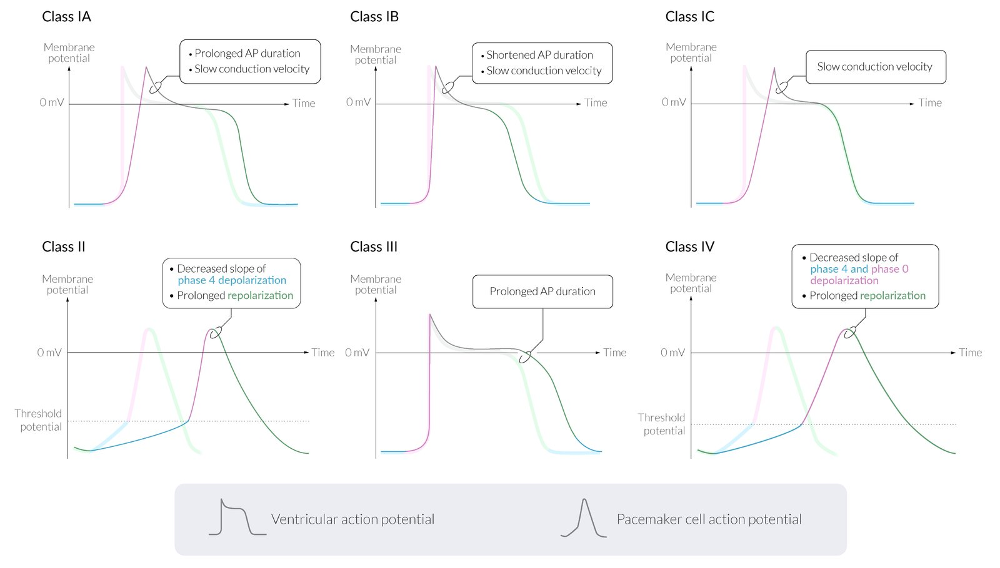
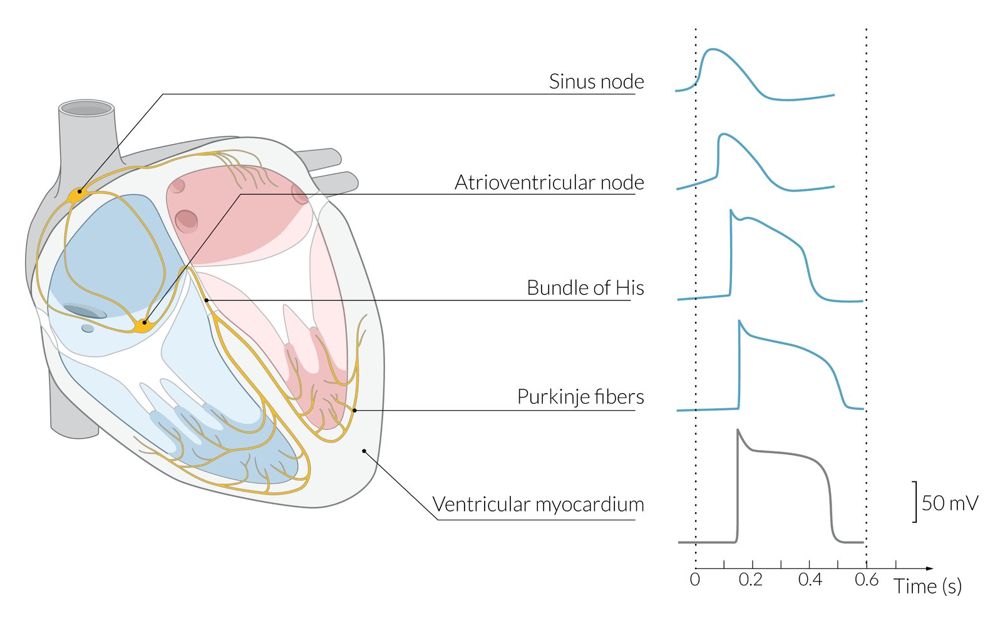
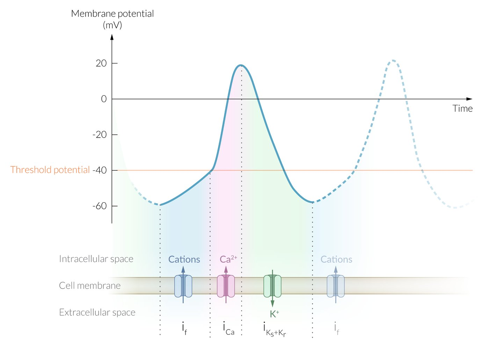
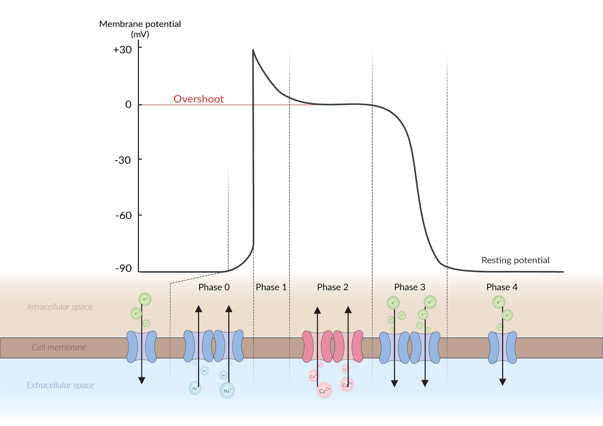

# Antiarrhythmic drugs

*Categories: Clinical knowledge > Pharmacology > Cardiovascular, pulmonary, and renal > Antiarrhythmic drugs*

[Original Article Link](https://coursology-qbank.com/amboss/article/jo0_bS)

---

## Summary

Antiarrhythmic drugs are used to prevent recurrent <u>arrhythmias</u> and restore <u>sinus rhythm</u> in patients with <u>cardiac arrhythmias</u>. These drugs are classified based on their electrophysiological effect on the <u>myocardium</u>. Antiarrhythmic drugs do not improve the survival of patients with non-life-threatening <u>arrhythmias</u> and may increase mortality, particularly in patients with <u>structural heart disease</u>. They are associated with severe adverse effects, primarily due to their proarrhythmic effects on the <u>myocardium</u>. Patients who have received an intravenous antiarrhythmic should be monitored closely with serial <u>ECGs</u>. Several classes of antiarrhythmics, including <u>beta blockers</u>, <u>calcium channel blockers</u>, <u>amiodarone</u>, <u>cardiac glycosides</u>, and <u>lidocaine</u>, also have other medical uses, which are discussed in their respective articles.

---

## Overview

|  Classes of antiarrhythmic drugs [[1]](https://coursology-qbank.com/amboss/article/GmYBSp)[[2]](https://coursology-qbank.com/amboss/article/JNXsXA)  |  |  |  |  |  |  |  |
| --- | --- | --- | --- | --- | --- | --- | --- |
| Class |  | Drug group |  Mechanism of action  |  | Examples |  Use  | Adverse effects |
| Class I antiarrhythmics | Class IA antiarrhythmics |  * Fast <u>sodium channel blockers</u>   |   * Reduce or even block conduction (negative <u>dromotropy</u>), particularly in depolarized tissue (e.g., during <u>tachycardia</u>)  * State-dependent: the faster the <u>heart rate</u> (e.g., <u>tachycardia</u>), the greater the effect  * Shorter <u>diastole</u>  * <u>Sodium</u> channels spend less time in resting state  * Decreases the slope of phase 0 <u>depolarization</u>  * Stabilize membrane  * Categorized into 3 subgroups based upon their effects on the Na+ channel and the <u>action potential</u> (AP) duration    |   * Moderate blockage of Na+ channels (intermediate association/dissociation)  * Prolong <u>action potential</u> (AP) duration (right shift)  * Slow conduction <u>velocity</u>  * Prolong <u>effective refractory period</u> (<u>ERP</u>) in ventricular APs  * Weak blockade of the <u>K+</u> channel    |   * Quinidine  * Procainamide  * Disopyramide  * Ajmaline    |   * <u>Paroxysmal supraventricular tachycardia</u> (<u>PSVT</u>): <u>AVNRT</u> and <u>AVRT</u>  * <u>Ectopic</u> <u>SVTs</u>  * <u>Antidromic AVRT</u> and <u>WPW</u> (<u>procainamide</u>)  * <u>Atrial fibrillation</u> (AFib) and <u>atrial flutter</u>  * <u>Ventricular arrhythmias</u>    |   * <u>QT prolongation</u> → <u>torsade de pointes</u> (<u>TdP</u>)  * Cinchonism: <u>headache</u>, <u>hearing</u>/<u>vision loss</u>, <u>tinnitus</u>, <u>psychosis</u> and cognitive impairment, associated with <u>quinidine</u> use  * <u>Thrombocytopenia</u>  * <u>Procainamide</u>  * <u>Drug-induced lupus erythematosus</u> (reversible)  * <u>Drug fever</u>  * <u>Disopyramide</u>  * <u>Heart failure</u>  * <u>Anticholinergic effects</u>    |
| Class IB antiarrhythmics |   * Weak blockade of Na+ channels (fast association/dissociation)  * Shorten AP duration  * Slow conduction <u>velocity</u>  * No effect on or slight prolongation of <u>ERP</u>  * Strongest effect on <u>ischemic</u> or depolarized <u>cardiac Purkinje cells</u> and ventricular <u>myocardium</u>    |   * <u>Lidocaine</u>  * Mexiletine  * <u>Phenytoin</u>    |   * <u>Ventricular arrhythmias</u> (especially following <u>myocardial infarction</u>)  * <u>Digitalis</u>-induced <u>cardiac arrhythmias</u>    |   * <u>CNS</u>: possible <u>depression</u> or excitation  * <u>Dizziness</u>, <u>nausea</u>  * <u>Seizures</u>  * Cardiovascular: <u>AV conduction block</u>, ventricular extrasystoles    |  |  |  |
| Class IC antiarrhythmics |   * Strong blockage of Na+ channels (slow association/dissociation) → QRS prolongation  * No to minimal effect on AP duration (no shift)  * Slow conduction <u>velocity</u>  * Extend duration of <u>effective refractory period</u> in both <u>AV node</u> and accessory tracts  * <u>ERP</u> unaffected in <u>cardiac Purkinje cells</u> and ventricular <u>myocardium</u>    |   * Flecainide  * Propafenone    |   * <u>PSVT</u>  * AFib (<u>cardioversion</u>)  * <u>Atrial flutter</u>  * Last resort in refractory VT    |   * Proarrhythmogenic: contraindicated following <u>myocardial infarction</u>  * Possible <u>QT prolongation</u> due to increased QRS duration  [[3]](https://coursology-qbank.com/amboss/article/RNXlaA)    |  |  |  |
| Class II antiarrhythmic drugs |  |  * <u>Beta blockers</u>   |   * Inhibit <u>β-adrenergic</u> activation of <u>adenylate cyclase</u> → ↓ <u>cAMP</u> → ↓ <u>Ca2+</u> → ↓ <u>SA node</u> and <u>AV node</u> activity  * Prolong <u>AV node</u> <u>repolarization</u> (<u>AV node</u> is highly sensitive to <u>beta blockers</u>) → prolongation of <u>PR interval</u>  * Decrease slope of phase 4 in <u>cardiac pacemaker cells</u> → suppression of aberrant pacemakers  * Slow conduction <u>velocity</u>    |  |   * <u>Metoprolol</u>  * <u>Esmolol</u> (short acting)  * <u>Propranolol</u>  * <u>Atenolol</u>  * <u>Timolol</u>  * <u>Carvedilol</u>  * <u>Sotalol</u>    |   * AFib (<u>rate control</u>)  * <u>Atrial flutter</u>  * <u>PSVT</u>  * <u>Premature ventricular contractions</u>  * <u>Ventricular arrhythmias</u>  * <u>Atrial premature beats</u> [[4]](https://coursology-qbank.com/amboss/article/AD0RSR)    |   * <u>AV block</u>, <u>bradycardia</u>, <u>heart failure</u>  * Exacerbation of <u>asthma</u>, <u>COPD</u>  * Sedation, <u>CNS depression</u>, <u>sleep</u> alterations  * <u>Impotence</u>  * <u>Hypoglycemia</u> (can mask <u>symptoms of hypoglycemia</u>)  * <u>Hyperkalemia</u>  * <u>Dyslipidemia</u> (<u>metoprolol</u>)  * Propanolol: may intensify vasospams in patients with preexisting <u>vasospastic angina</u>  * Avoid in patients with concurrent <u>cocaine</u> use or <u>pheochromocytoma</u>.  * Unopposed α1<u>agonism</u> → ↑ blood pressure, coronary and systemic <u>vasoconstriction</u>  * Except for <u>labetalol</u> and <u>carvedilol</u>, which are nonselective α- and β-<u>antagonists</u>    |
| Class III antiarrhythmic drugs |  |  * <u>Potassium channel blockers</u>   |   * Inhibit delayed rectifier <u>potassium</u> currents  * Prolong <u>QT interval</u>  * Prolong AP duration (reverse use dependence) and <u>ERP</u>  * No effect on conduction <u>velocity</u>    |  |   * <u>Amiodarone</u> (has class I, II, III, and IV properties; <u>lipophilic</u>)  * Dronedarone  * <u>Sotalol</u>  * Bretylium  * Ibutilide  * Dofetilide    |   * AFib (<u>cardioversion</u> and <u>rhythm control</u>)  * <u>Atrial flutter</u>  * <u>Sotalol</u> and <u>amiodarone</u> can be used to treat:  * <u>Supraventricular arrhythmias</u>  * <u>Ventricular arrhythmias</u>, e.g., <u>tachycardia</u>    |   * <u>QT prolongation</u> → <u>TdP</u>  * <u>Amiodarone</u>  * Cardiovascular  * May cause <u>heart failure</u>, <u>heart block</u>, <u>bradycardia</u>, <u>hypotension</u>  * Lowest risk of <u>ventricular arrhythmia</u> compared to other drugs in its class [[5]](https://coursology-qbank.com/amboss/article/mOaVGk)  * <u>Pulmonary fibrosis</u>  * <u>Thyroid</u> dysfunction (hypo- or <u>hyperthyroidism</u>) due to high <u>iodine</u> content  * <u>Liver</u> dysfunction  * Neurologic side effects (e.g., <u>peripheral neuropathy</u>)  * Can act as a <u>hapten</u> → bluish-gray deposits in <u>cornea</u> and <u>skin</u> → <u>photosensitivity</u> → photodermatitis  * <u>Constipation</u>  * <u>Sotalol</u>: see “<u>Beta blocker adverse effects</u>”    |
| Class IV antiarrhythmic drugs |  |  * <u>Calcium channel blockers</u>   |   * Inhibit slow <u>calcium</u> channels  * Decrease slope of phase 0 and 4 → slower conduction <u>velocity</u> → increased <u>ERP</u>  * Prolong <u>AV node</u> <u>repolarization</u>  * Prolong <u>PR interval</u>    |  |   * <u>Verapamil</u>  * <u>Diltiazem</u>  * <u>Nifedipine</u>    |   * AFib (<u>rate control</u>)  * <u>Atrial flutter</u>  * Prophylaxis of nodal <u>arrhythmias</u>, e.g., <u>PSVT</u>  * <u>Multifocal atrial tachycardia</u>  * <u>Hypertension</u> (<u>nifedipine</u>)    |   * <u>Verapamil</u>  * <u>AV block</u>  * <u>Bradycardia</u>  * <u>Depression</u> of sinus node  * <u>Heart failure</u>  * <u>Constipation</u>  * Flushing  * <u>Edema</u>  * <u>Nifedipine</u>  * <u>Headache</u>  * Flushing  * <u>Pitting edema</u>  * <u>Reflex tachycardia</u>  * <u>Diltiazem</u>: adverse effects similar to those of both <u>verapamil</u> and <u>nifedipine</u>, but less prominent    |
| <u>Class V antiarrhythmic drugs</u> |  |  * Variable mechanisms   |   * Activates <u>Gi protein</u> → ↓ <u>cAMP</u> → deactivation of L-type <u>Ca2+</u> channels → ↓ <u>Ca2+</u> and ↑ <u>K+</u> efflux → transient <u>AV node block</u>  * Very short acting (∼ 15 sec)    |  |  * <u>Adenosine (drug)</u>   |  * Diagnosis and termination of certain forms of <u>PSVT</u> (e.g., <u>AVNRT</u> and <u>orthodromic AVRT</u>)   |   * <u>Chest pain</u>  * Flushing  * <u>Hypotension</u>  * <u>Bronchospasm</u>  * Sense of impending doom  * Effect weakened by <u>adenosine</u> <u>receptor</u> <u>antagonists</u> (e.g., <u>theophylline</u>, <u>caffeine</u>)    |
|  * Decreases <u>calcium</u> influx → prevents <u>early afterdepolarizations</u> (<u>EADs</u>)   |  |  * <u>Magnesium sulfate</u>   |   * <u>TdP</u>  * <u>Digoxin toxicity</u>    |   * <u>Hypotension</u>  * <u>Asystole</u>  * Drowsiness  * Flushing  * Loss of reflexes  * Respiratory <u>depression</u>    |  |  |  |
|  * Inhibits Na+/<u>K+</u>-ATPases → higher intracellular Na+ concentration → reduced <u>efficacy</u> of <u>Na+/Ca2+ exchangers</u> → higher intracellular <u>Ca2+</u> concentration → increased contractility and decreased <u>heart rate</u>   |  |  * <u>Digoxin</u>   |   * AFib  * <u>Atrial flutter</u>  * Chronic systolic <u>heart failure</u>    |   * <u>Nausea</u>, <u>vomiting</u>  * Abdominal <u>pain</u>  * Blurry <u>vision</u> with a yellow tint and halos    |  |  |  |
|  * Selectively inhibits Ifchannel in the pacemaker cells of the <u>SA node</u> → prolongs slow <u>depolarization</u> (phase 4) → slows <u>heart rate</u>   |  |  * <u>Ivabradine</u>   |   * Chronic stable <u>coronary heart disease</u> in patients who cannot tolerate <u>beta blockers</u>  * Chronic <u>HFrEF</u>    |   * <u>Vision</u> changes: luminous phenomena (enhanced visual brightness)  * <u>Bradycardia</u>  * <u>Hypertension</u>    |  |  |  |

> [!WARNING]
> All antiarrhythmic drugs are also potentially proarrhythmic! Intravenous administration should only be performed with <u>continuous cardiac monitoring</u>!

> [!NOTE]
> “I am Ambivalent about the QUEEn PROofreading my DISsertation”: Class IA antiarrhythmic drugs are QUEEnidine, PROcainamide, DISopyramide.
> “LInDO MEXIco Is the Best”: LIDOcaine and MEXIletine are class IB antiarrhythmic drugs.
> “I Can't Fail, Please”: Class IC antiarrhythmics are Flecainide, Propafenone.
> “I Am Sober, Doctor, for III days”: Ibutilide, Amiodarone, Sotalol, and Dofetilide are class III antiarrhythmic drugs.

> [!NOTE]
> Diltiazem and Verapamil Diminish conduction Velocity.

> [!NOTE]
> Class IB antiarrhythmic drugs work Best after <u>myocardial infarction</u>; class IC antiarrhythmic drugs are Contraindicated.

Overview of antiarrhythmic drug classes

Cardiac action potentials

Action potentials of pacemaker cells in the sinus node

Action potential and ion flux in myocardial contractile cells

References:[[6]](https://coursology-qbank.com/amboss/article/Claq_k)[[7]](https://coursology-qbank.com/amboss/article/qyaCTM)[[8]](https://coursology-qbank.com/amboss/article/IyaYgM)

---

## Other antiarrhythmic drugs

### Adenosine (drug) [[1]](https://coursology-qbank.com/amboss/article/GmYBSp)

* Mechanism of action: activates <u>Gi protein</u> → inhibition of <u>adenylate cyclase</u> → ↓ <u>cAMP</u> → deactivation of L-type <u>Ca2+</u> channels and activation of <u>K+</u> channels → ↓ <u>Ca2+</u> and ↑ <u>K+</u> efflux → <u>hyperpolarization</u> → transient <u>AV node block</u> (short-acting, ∼ 15 seconds) → acute termination of <u>supraventricular tachycardia</u>

* Indications

* Diagnosis and termination of certain forms of <u>paroxysmal supraventricular tachycardias</u>;  (e.g., <u>AVNRT</u> and <u>orthodromic AVRT</u>) [[9]](https://coursology-qbank.com/amboss/article/Np0-pS)

* Diagnosis of underlying AFib in <u>supraventricular tachyarrhythmias</u>

* <u>Pharmacological stress test</u> in <u>myocardial</u> <u>perfusion</u> <u>scintigraphy</u> [[10]](https://coursology-qbank.com/amboss/article/SNXy0A)

* Administration

* Rapid bolus IV (very short <u>half-life</u>: < 10 seconds) [[11]](https://coursology-qbank.com/amboss/article/gNXF0A)

* May be administered repeatedly if the previous dose was unsuccessful

* Adverse effects [[12]](https://coursology-qbank.com/amboss/article/yladzk)

* <u>Chest pain</u>, flushing, <u>hypotension</u>, <u>bronchospasm</u>

* Sense of impending doom

* <u>AV block</u>, <u>asystole</u>

* Contraindications to adenosine

* Pre-excitation syndromes: <u>antidromic AVRT</u>, <u>WPW</u>

* <u>AV block</u>

* <u>Asthma</u>

* Interactions: <u>Theophylline</u> and <u>caffeine</u> weaken the effects of <u>adenosine</u> because they are <u>adenosine</u> <u>receptor</u> <u>antagonists</u>.

> [!WARNING]
> Avoid <u>adenosine</u> in patients with suspected pre-excitation <u>tachycardia</u> (e.g., <u>WPW</u>), because it may exacerbate the <u>tachycardia</u> via <u>accessory pathway</u> routes.

### <u>Digoxin</u>

* Mechanism of action: inhibits Na+/<u>K+</u>-ATPases → higher intracellular Na+ concentration → reduced <u>efficacy</u> of <u>Na+/Ca2+ exchangers</u> → higher intracellular <u>Ca2+</u> concentration → increased contractility, decreased <u>heart rate</u>

* Indications

* AFib

* <u>Atrial flutter</u>

* Chronic systolic <u>heart failure</u>

* Adverse effects: See “<u>Cardiac glycoside poisoning</u>”.

### Magnesium sulfate [[1]](https://coursology-qbank.com/amboss/article/GmYBSp)[[13]](https://coursology-qbank.com/amboss/article/zlarzk)

* Mechanism of action: decreases <u>calcium</u> influx → prevents <u>early afterdepolarizations</u> (<u>EADs</u>)

* Indications

* <u>Torsade-de-pointes</u>

* Refractory <u>ventricular tachyarrhythmias</u> (e.g., <u>polymorphic VT</u>)

* <u>Digoxin</u> intoxication

* <u>Eclampsia</u>

* <u>Constipation</u>

* <u>Tocolysis</u>

* Adverse effects

* <u>Hypotension</u>

* <u>Asystole</u>

* Drowsiness

* Flush

* Loss of reflexes

* Respiratory <u>depression</u>

### Ivabradine [[14]](https://coursology-qbank.com/amboss/article/hNXcaA)

* Mechanism of action: selectively inhibits Ifchannel in the pacemaker cells of the <u>SA node</u> → prolongs slow <u>depolarization</u> (phase 4) → slows <u>heart rate</u>

* Indications: symptomatic stable <u>coronary heart disease</u> and <u>congestive heart failure</u> (<u>NYHA</u> II-IV) in patients who cannot tolerate <u>beta blockers</u>

* Adverse effects

* <u>Vision</u> changes: luminous phenomena (enhanced visual brightness)

* <u>Bradycardia</u>

* <u>Hypertension</u>

> [!NOTE]
> IVabradine slows <u>depolarization</u> in phase IV.

---