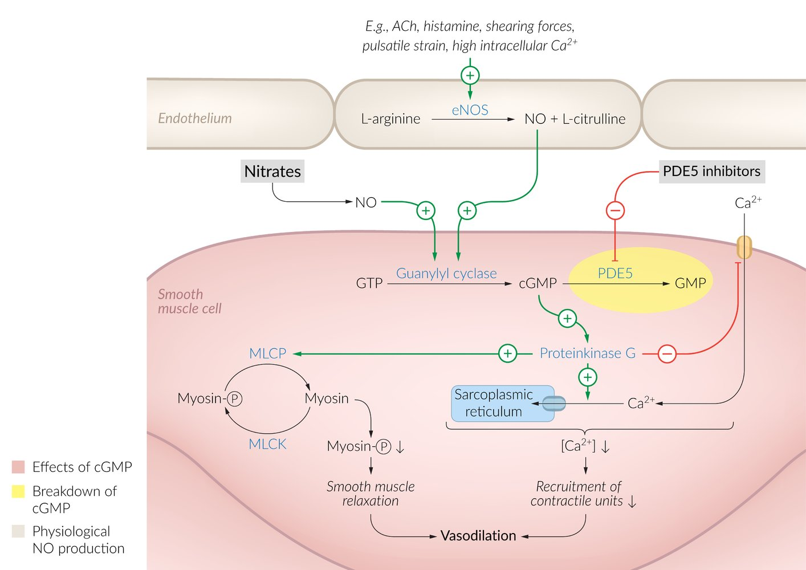
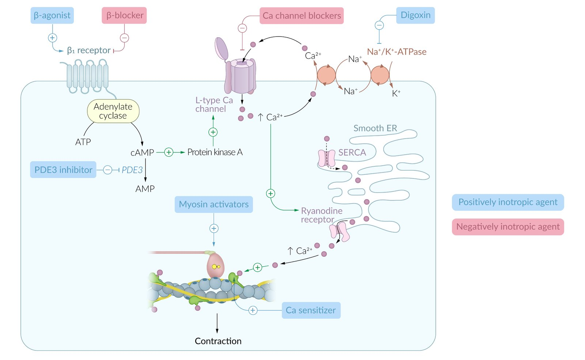

# Phosphodiesterase inhibitors

*Categories: Clinical knowledge > Pharmacology > Cardiovascular, pulmonary, and renal > Phosphodiesterase inhibitors*

[Original Article Link](https://coursology-qbank.com/amboss/article/em0xeg)

---

## Summary

<u>Phosphodiesterase</u> inhibitors (<u>PDE</u> inhibitors) are a class of drugs that inhibit <u>phosphodiesterase</u> enzymes (<u>PDE</u> enzymes). <u>PDE</u> enzymes normally break off <u>phosphate</u> groups and decrease <u>cAMP</u> or <u>cGMP</u> in <u>target cells</u>. <u>PDE</u> inhibitors are classified according to which enzyme(s) they act upon as nonspecific, PDE5, PDE4, and <u>PDE3 inhibitors</u>. <u>PDE5 inhibitors</u> cause pulmonary <u>vasodilation</u> and penile <u>smooth muscle</u> relaxation, and are used for <u>pulmonary hypertension</u> and <u>erectile dysfunction</u>. <u>PDE4 inhibitors</u> enable bronchial dilation in severe <u>COPD</u>. <u>PDE3 inhibitors</u> have positive <u>inotropic</u>, <u>vasodilator</u>, and antiplatelet effects, which are used in <u>acute heart failure</u> and in <u>peripheral vascular disease</u>. <u>PDE3 inhibitors</u> are not recommended for long-term use in patients with <u>heart failure</u> because of their strong cardiostimulatory effects. <u>Nitrates</u> or <u>alpha-blockers</u> are strongly contraindicated in patients taking <u>PDE5 inhibitors</u> because of the risk of life-threatening <u>hypotension</u>.

---

## Pharmacodynamics

<u>Phosphodiesterase</u> (<u>PDE</u>) inhibitors are a heterogenic class of drugs that target various isoforms of <u>PDE</u> enzymes. Normally, the <u>PDE</u> decreases <u>cAMP</u> or <u>cGMP</u> in <u>target cells</u> by catalyzing the <u>hydrolysis</u> of these <u>second messengers</u>. By inhibiting this step, <u>PDE</u> inhibitors actually increase <u>cAMP</u> and/or <u>cGMP</u> concentrations. They are classified according to their target isoforms as nonspecific, PDE5, PDE4, and <u>PDE3 inhibitors</u>, each of which has a different clinical use.

| <u>Phosphodiesterase</u> inhibitors |  |  |  |  |
| --- | --- | --- | --- | --- |
| Types | Active ingredient | Indications | Mechanism of action | Desired effect |
|  Nonspecific <u>phosphodiesterase</u> inhibitors (inhibitors of <u>PDE3</u>, 4, and 5)  |  * Theophylline (methylxanthines)   |   * <u>COPD</u> (severe and refractory cases)  * <u>Asthma</u>    |   * Nonspecific <u>PDE</u> inhibition → ↓ <u>hydrolysis</u> of <u>cAMP</u> → ↑ <u>cAMP</u> levels  * <u>Adenosine</u> <u>receptor</u> blockade    |   * Inhibition of proinflammatory mediators  * Deceleration of <u>fibrotic</u> changes in the <u>lung</u>  * Relaxation of the bronchial musculature → bronchodilation    |
|  Phosphodiesterase type 5 inhibitor (<u>PDE5 inhibitor</u>)  |   * Sildenafil  * Tadalafil  * Avanafil  * Vardenafil  * <u>Dipyridamole</u>    |   * <u>Erectile dysfunction</u>  * <u>Pulmonary hypertension</u>  * <u>Benign prostatic hyperplasia</u> (<u>tadalafil</u> only)    |  * PDE5 inhibition → ↓ breakdown of <u>cGMP</u> → ↑ <u>cGMP</u> → ↑ <u>smooth muscle</u> relaxation in reaction to <u>nitric oxide</u> activation → pulmonary <u>vasodilation</u>, penile <u>smooth muscle</u> relaxation, and increased blood flow   |   * Decrease in <u>pulmonary vascular resistance</u>  * ↑ Blood flow in the <u>corpus cavernosum</u> → increase in <u>penis</u> size during an <u>erection</u>    |
|  Phosphodiesterase type 4 inhibitor (<u>PDE4 inhibitor</u>) |  * Roflumilast   |  * Severe <u>COPD</u>   |  * PDE4 inhibition → ↑ <u>cAMP</u> in <u>bronchial epithelium</u>, <u>granulocytes</u>, and <u>neutrophils</u> → bronchiodilation and ↓ inflammation   |   * Inhibition of proinflammatory mediators  * Deceleration of <u>fibrotic</u> changes in the <u>lung</u>  * Relaxation of the bronchial musculature    |
|  Phosphodiesterase type 3 inhibitor (<u>PDE3 inhibitor</u>)  |   * Milrinone  * Amrinone  * Enoximone    |  * Acute treatment of decompensated cardiac failure with <u>cardiogenic shock</u>   |   * Inhibition of <u>smooth muscle</u> <u>proliferation</u>  * <u>PDE3</u> inhibition → ↑ <u>cAMP</u>   * In the <u>myocardium</u>: ↑ <u>cAMP</u> → activation of <u>calcium</u> channels → cardiostimulatory effects → ↑ <u>inotropy</u> and ↑ <u>chronotropy</u>  * In peripheral vessels: ↑ <u>cAMP</u> → inhibition of <u>myosin light chain kinase</u> → <u>smooth muscle</u> relaxation → <u>vasodilation</u> with reduced cardiovascular <u>preload</u> and <u>afterload</u>  * In <u>platelets</u>:  * ↑ <u>cAMP</u> → inhibited <u>platelet aggregation</u>  * ↓ <u>Adenosine</u> reuptake → ↑ extracellular <u>adenosine</u> concentration → <u>vasodilation</u> (<u>dipyridamole</u>)    |   * Increase cardiac contractility acutely in cardiac failure  * <u>Vasodilation</u> and antiplatelet action in <u>intermittent claudication</u>  * Inhibition of <u>platelet aggregation</u> for <u>angina</u> prophylaxis, <u>TIA</u>/<u>stroke</u> prevention, and deceleration of restenosis in coronary <u>stents</u>  * <u>Dipyridamole</u> dilates the <u>coronary arteries</u> and can therefore be used in <u>cardiac stress testing</u>    |
|   * Cilostazol  * Dipyridamole    |   * Intermittent vascular <u>claudication</u>  * Antiplatelet (antianginal, <u>TIA</u>/<u>stroke</u> prevention)  * Coronary <u>stent</u> restenosis prophylaxis    |  |  |  |

Mechanism of action: nitrates and phosphodiesterase-5 inhibitors

Mechanism of action: inotropic drugs

> [!NOTE]
> SildenaFIL, tadalaFIL, avanaFIL, and vardenaFIL: FIrst-Line therapy for FILling the <u>corpus cavernosum</u>

References:[[1]](https://coursology-qbank.com/amboss/article/XC09qR)[[2]](https://coursology-qbank.com/amboss/article/l_0voi)[[3]](https://coursology-qbank.com/amboss/article/jTY_qo)

---

## Adverse effects

* Nonspecific <u>phosphodiesterase</u> inhibitors

* General considerations

* Close drug monitoring due to <u>narrow therapeutic index</u> (high risk of overdose).

* Metabolized in the <u>liver</u> by the <u>cytochrome P450</u> <u>oxidase</u> system.

* Elimination time varies.

* Serum concentrations are <u>prone</u> to fluctuations.

* ↑ Risk of <u>drug interactions</u> (e.g., <u>ciprofloxacin</u> can increase <u>theophylline</u> serum levels).

* Concomitant <u>adenosine</u> <u>receptor</u> block: associated with severe cardiac and neurological adverse effects

* Cardiotoxicity

* <u>Tachycardia</u>, <u>arrhythmias</u>

* <u>Hypotension</u> (in severe overdose)

* <u>Neurotoxicity</u> (dosage-dependent)

* At low levels of overdose: <u>dizziness</u>, <u>lightheadedness</u>, <u>headache</u>, <u>tremor</u>, <u>agitation</u>, irritability, <u>insomnia</u>, <u>psychotic symptoms</u>

* At high levels of overdose: <u>seizures</u>

* Gastrointestinal (GI) toxicity

* Severe refractory <u>nausea and vomiting</u>

* <u>Diarrhea</u>

* Abdominal <u>pain</u>

* <u>Phosphodiesterase type 5 inhibitors</u> [[4]](https://coursology-qbank.com/amboss/article/N_0-oi)[[5]](https://coursology-qbank.com/amboss/article/PTYWIo)

* <u>Headache</u>

* <u>Lightheadedness</u>

* Exanthema, flushing

* Visual changes: <u>photophobia</u>, optic neuropathy, visual deficits (cyanopsia)  [[6]](https://coursology-qbank.com/amboss/article/dbbosH)

* GI symptoms (e.g., <u>dyspepsia</u>)

* Runny nose, nasal congestion

* Rare: <u>myocardial infarction</u>, <u>stroke</u>, <u>hearing loss</u>

* <u>Phosphodiesterase</u> type 4 inhibitors [[7]](https://coursology-qbank.com/amboss/article/4TY3Io)

* Weight loss

* GI symptoms (e.g., <u>nausea</u>, abdominal <u>pain</u>)

* Psychiatric symptoms: <u>sleep</u> disturbances, <u>anxiety</u>, <u>depression</u>

* <u>Phosphodiesterase type 3 inhibitors</u> [[4]](https://coursology-qbank.com/amboss/article/N_0-oi)

* Most common and severe adverse effects: <u>tachycardia</u>, <u>ventricular arrhythmias</u> (<u>PDE 3</u> inhibitors are not recommended for long-term use or patients with <u>acute heart failure</u> due to the high risk of adverse effects.)

* <u>Headaches</u>

* Flushing

* <u>Hypotension</u>

* GI symptoms (e.g., <u>nausea</u>)

References:[[1]](https://coursology-qbank.com/amboss/article/XC09qR)

We list the most important adverse effects. The selection is not exhaustive.

---

## Contraindications

Because of their <u>vasodilatory</u> and arrhythmogenic effects, <u>PDE</u> inhibitors have a number of contraindications:

* <u>Theophylline</u>

* Damaged <u>cardiac muscle</u> (e.g., following <u>myocardial infarction</u>)

* Significant risk of <u>drug interactions</u> (e.g., <u>ciprofloxacin</u>, <u>cimetidine</u>)

* <u>Phosphodiesterase type 5 inhibitors</u>

* <u>Nitrates</u>: Use of <u>PDE5 inhibitors</u> with <u>nitrates</u> (e.g., <u>nitroglycerin</u>) can result in life-threatening <u>hypotension</u>.
* Both <u>nitrates</u> (e.g., sublingual <u>nitroglycerin</u>) and <u>PDE-5 inhibitors</u> (e.g., <u>vardenafil</u>) function by activating <u>guanylate cyclase</u> in the <u>cytosol</u> of vascular <u>smooth muscle cells</u> → increasing <u>cGMP</u> concentration → activation of <u>myosin light chain phosphatase</u> (<u>MLCP</u>) → dephosphorylation of <u>light chains</u> of <u>myosin</u> → <u>smooth muscle cell</u> relaxation in blood vessels → <u>vasodilation</u>

* <u>Alpha blockers</u>: Use of <u>PDE5 inhibitors</u> with <u>alpha blockers</u> can also result in <u>hypotension</u>. [[8]](https://coursology-qbank.com/amboss/article/OTYIIo)

* <u>Phosphodiesterase type 3 inhibitors</u>

* Severe obstructive <u>cardiomyopathy</u> or <u>ventricular aneurysm</u>

* <u>Hypovolemia</u>

* <u>Tachycardia</u>

> [!WARNING]
> Patients being treated with PDE5s should not receive <u>nitrates</u> in <u>unstable angina pectoris</u>, <u>acute coronary syndrome</u>, or <u>myocardial infarction</u> because this could result in a life-threatening decrease in blood pressure!

References:[[1]](https://coursology-qbank.com/amboss/article/XC09qR)[[4]](https://coursology-qbank.com/amboss/article/N_0-oi)[[8]](https://coursology-qbank.com/amboss/article/OTYIIo)[[9]](https://coursology-qbank.com/amboss/article/m_0VKi)

We list the most important contraindications. The selection is not exhaustive.

---