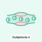
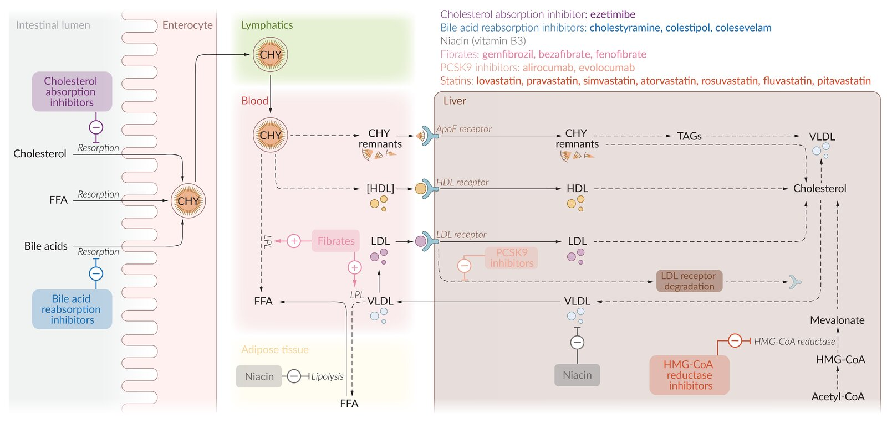

# Statins

*Categories: Clinical knowledge > Pharmacology > Endocrine > Statins*

[Original Article Link](https://coursology-qbank.com/amboss/article/am0QVg)

---

## Summary

Statins are the lipid-lowering drugs of choice. Statins reduce hepatic <u>cholesterol synthesis</u> by inhibiting enzyme <u>HMG-CoA</u> reductase. This leads to a consequent upregulation of <u>LDL receptors</u> on <u>hepatocytes</u>, which, in turn, lowers <u>LDL cholesterol</u> levels and <u>triglycerides</u> while raising <u>HDL cholesterol</u>. <u>Headache</u> and gastrointestinal side-effects are common. Statins carry a risk of hepatic and muscle toxicity. Muscle toxicity may rarely manifest with <u>rhabdomyolysis</u>.

Dyslipidemia - Part 4: Laboratory Parameters & Lipid-Lowering Agents

---

## Overview

For a comparison of statins with other <u>lipid-lowering agents</u>, see “<u>Overview of lipid metabolism and lipid-lowering agents</u>.”

| Overview of statin <u>pharmacokinetics</u> |  |  |  |
| --- | --- | --- | --- |
| Statin | <u>Half-life</u> in hours | <u>CYP</u>-450 |  <u>Bioavailability</u> [[1]](https://coursology-qbank.com/amboss/article/bA0HRi) |
| Atorvastatin | 15–30 | <u>CYP3A4</u> |  ∼ 10%   |
| Simvastatin | 2–3 |  <u>CYP3A4</u>, CYP3A5 |  ∼ 5%   |
| Pravastatin | ∼ 2 | -   |  ∼ 20%   |
| Lovastatin | 3 | <u>CYP3A4</u> |  ∼ 5%   |
| Fluvastatin | 0.5–2.5 | <u>CYP2C9</u> |  ∼20–30%   |
| Pitavastatin | 12 | Limited <u>CYP2C9</u>  |  ∼ 50%   |
| Rosuvastatin | 19 | Limited <u>CYP2C9</u>  |  ∼ 20%   |

> [!NOTE]
> “Flo Loves Prague Since A Tour of Russia.” Lipid-lowering <u>potency</u> increases in the following order: Fluvastatin → Lovastatin → Pravastatin → Simvastatin → Atorvastatin → Rosuvastatin

Overview of lipid metabolism and lipid-lowering agents

---

## Pharmacodynamics

* Competitive inhibition of <u>HMG-CoA</u> reductase renders this enzyme unable to convert <u>HMG-CoA</u> to <u>mevalonate</u> (the rate-limiting step of <u>cholesterol</u> synthesis) → reduced intrahepatic <u>cholesterol</u> biosynthesis → upregulation of expression of <u>LDL receptor</u> <u>gene</u> via sterol regulatory element-binding protein (<u>SREBP</u>) → increased <u>LDL</u> recycling and: [[2]](https://coursology-qbank.com/amboss/article/VA0Gii)

* ↓↓ <u>LDL cholesterol</u>

* ↑ <u>HDL cholesterol</u>

* ↓ <u>Triglyceride</u> level

* See the article on <u>second-line lipid-lowering agents</u> to see the comparison of lipid-lowering <u>potency</u> of different <u>lipid-lowering agents</u>.

* <u>Pleiotropic</u> effect:

* ↓ <u>C-reactive protein</u>

* ↑ <u>Plaque</u> stabilization

* ↑ Anti-inflammatory effect

* Antioxidant effect and improved <u>endothelial</u> function of <u>coronary arteries</u>

---

## Adverse effects

* General (common): <u>headache</u> and gastrointestinal symptoms (e.g., <u>constipation</u>, <u>diarrhea</u>)

* Hepatic: : (up to 3% of patients) ↑ <u>LFTs</u> due to the involvement of <u>cytochrome P450</u> systems (<u>CYP3A4</u> and <u>CYP2C9</u>) in the breakdown of statins  [[3]](https://coursology-qbank.com/amboss/article/xA0ENi)[[4]](https://coursology-qbank.com/amboss/article/BA0zNi)

* Muscular: Statins decrease the synthesis of <u>coenzyme Q10</u> and impair energy production within the muscle.

* <u>Myalgia</u>:  (muscle <u>pain</u>): continue treatment as long as <u>creatine phosphokinase</u> (CK) remain normal

* Statin-associated myopathy

* Muscle <u>pain</u> and <u>weakness</u>, especially when used alongside <u>fibrates</u> or <u>niacin</u>

* <u>Myositis</u>: ↑ CK

* May progress to <u>rhabdomyolysis</u>; : rare but severe side-effect that may lead to <u>myoglobinuria</u> → <u>AKI</u> (↑ <u>BUN</u> and ↑ <u>creatinine</u>)

* Management: discontinue statin therapy for 2–4 weeks; start treatment with a low-dose statin (e.g., <u>pravastatin</u> or <u>fluvastatin</u>) once symptoms have resolved

> [!TIP]
> Treatment must be discontinued if <u>myopathy</u>/<u>rhabdomyolysis</u> occurs.

> [!WARNING]
> Interaction with certain drugs can increase the risk of <u>myopathy</u> (see “Interactions” section below).

We list the most important adverse effects. The selection is not exhaustive.

---

## Indications

* <u>High-intensity statins</u> [[5]](https://coursology-qbank.com/amboss/article/b-bHDw)[[6]](https://coursology-qbank.com/amboss/article/Gx1BBQ0)[[7]](https://coursology-qbank.com/amboss/article/0fcekb0)

* Patients < 75 years of age with clinical <u>atherosclerotic cardiovascular disease</u> (includes <u>coronary artery disease</u>, <u>stroke</u>, and <u>peripheral arterial disease</u>)

* Patients 20–75 years of age with <u>LDL cholesterol</u> ≥ 190 mg/dL (first-line treatment)

* Adult patients with <u>diabetes mellitus</u> and multiple <u>ASCVD risk factors</u>

* Low- to <u>moderate-intensity statins</u>: <u>primary prevention of ASCVD</u> (see “<u>Indications for statins for primary ASCVD prevention</u>”)

For details on treatment of very high <u>LDL cholesterol</u>, see the treatment section in <u>Lipid disorders</u>.

> [!TIP]
> Statins are the first-line therapy for <u>hypercholesterolemia</u>.

> [!TIP]
> <u>Treatment of hyperlipidemia</u> with statins significantly reduces the risk of mortality in patients suffering from <u>CAD</u>.

---

## Interactions

* Other lipid-lowering agents

* <u>Fibrates</u>

* <u>Nicotinic acid</u>

* Both agents may also cause <u>myopathy</u> → concomitant use with statins further increases the risk of <u>myopathy</u>!

* <u>CYP3A4</u> inhibitors 

* <u>HIV</u>/<u>HCV</u> <u>protease</u> inhibitors

* <u>Macrolides</u> (especially <u>erythromycin</u> and <u>clarithromycin</u>)

* <u>Azole antifungals</u>

* <u>Cyclosporine</u>

* <u>Warfarin</u>

> [!TIP]
> Maintain a high index of suspicion for <u>rhabdomyolysis</u> if muscle <u>pain</u> occurs after administering statins.

---