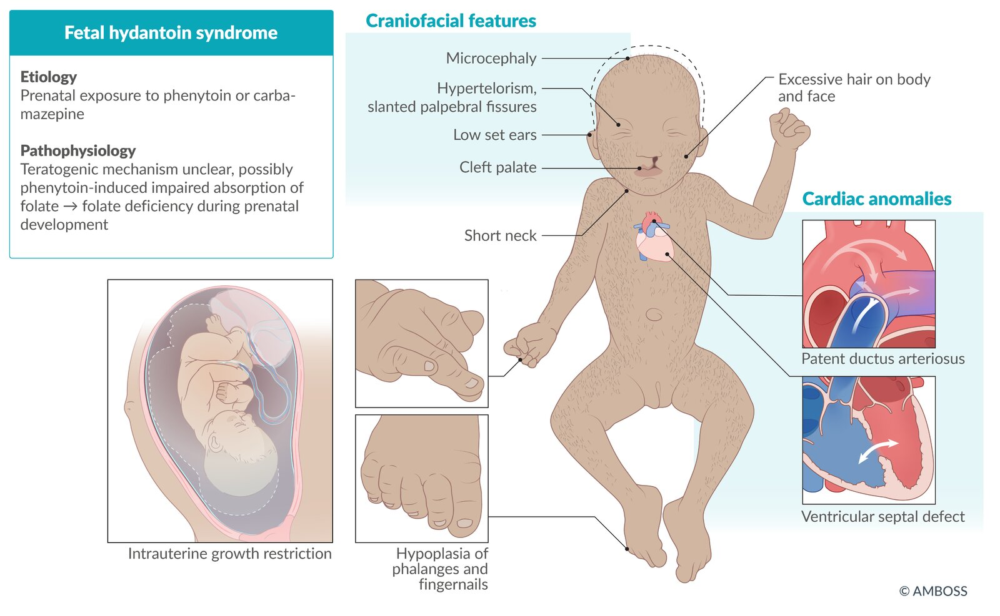

# Pharmacotherapy during pregnancy

*Categories: Clinical knowledge > Pharmacology > General > Pharmacotherapy during pregnancy*

[Original Article Link](https://coursology-qbank.com/amboss/article/dm0oeg)

---

## Summary

Pharmacotherapy during <u>pregnancy</u> is an important concern for a medical professional because there are only a limited number of drugs that can be safely administered during this period. Many drugs can cause harm to the fetus in the form of defects in <u>organogenesis</u>, growth restriction, and functional deficits. The aim of drug selection in this period is to prescribe an agent that effectively alleviates the mother's medical complaints while ensuring the safety of the unborn fetus. This article provides a brief overview of drugs that can be used for common conditions in pregnant women. It also lists the substances that should be avoided during <u>pregnancy</u>.

---

## Antimicrobials

### Antibiotics during pregnancy

#### Drugs of choice

* <u>Penicillin</u> group : <u>ampicillin</u>, <u>amoxicillin</u>, <u>flucloxacillin</u>, <u>penicillin V</u>, propicillin

* <u>Cephalosporins</u>

* <u>Macrolides</u>: <u>erythromycin</u>, <u>azithromycin</u>

* <u>Metronidazole</u>

* <u>Fosfomycin</u> (see also: “<u>UTI in pregnancy</u>”)

#### Drugs to avoid

|  Overview of antibiotics to avoid during pregnancy [[1]](https://coursology-qbank.com/amboss/article/kiYm7K)[[2]](https://coursology-qbank.com/amboss/article/OiYI7K)[[3]](https://coursology-qbank.com/amboss/article/liYv7K)  |  |
| --- | --- |
|  | Harmful side effects |
| <u>Tetracycline</u> |   * Inhibition of bone growth  * <u>Malformation</u> and permanent yellow discoloration of the <u>primary teeth</u>    |
|  <u>Aminoglycoside</u>  |  * <u>Ototoxicity</u> (<u>CN VIII</u> toxicity) and <u>hearing loss</u>   |
| <u>Trimethoprim</u>/<u>sulfonamide</u> combinations |   * Cardiovascular <u>birth</u> defects  * <u>Neonatal jaundice</u> (risk of <u>kernicterus</u>)    |
| <u>Chloramphenicol</u> |  * Gray baby syndrome: a syndrome associated with <u>chloramphenicol</u> accumulation in the body, leading to ashen gray color of the <u>skin</u>, cardiovascular collapse, and abdominal distention   |
| <u>Clarithromycin</u> |  * Potentially embryotoxic   |
| <u>Fluoroquinolones</u> |  * Bone and <u>cartilage</u> damage   |

> [!NOTE]
> “<u>Teeth</u>racycline:” <u>teeth</u> discoloration with <u>tetracycline</u>.
> “A mean guy stepped on baby's <u>ear</u>:” Aminoglycoside can cause ototoxicity.

### Antivirals during pregnancy

#### Drugs of choice

* <u>Acyclovir</u> and <u>valacyclovir</u> for herpes

* Oral <u>oseltamivir</u> and <u>zanamivir</u> for <u>influenza</u>

* <u>Zidovudine</u> PLUS <u>lamivudine</u> PLUS <u>nevirapine</u> PLUS <u>atazanavir</u> for <u>HIV infection</u> (see “<u>HIV in pregnancy</u>”)

#### Drugs to avoid

|  Overview of antivirals to avoid during pregnancy [[4]](https://coursology-qbank.com/amboss/article/S_0yni)[[5]](https://coursology-qbank.com/amboss/article/h_0cLi)[[6]](https://coursology-qbank.com/amboss/article/3_0SLi)[[7]](https://coursology-qbank.com/amboss/article/5iYiHK)[[8]](https://coursology-qbank.com/amboss/article/MiYMHK)  |  |
| --- | --- |
|  | Harmful side effects |
|  <u>Efavirenz</u>  [[9]](https://coursology-qbank.com/amboss/article/miYVHK)  |  * Fetal <u>neural tube defects</u>   |
| <u>Ribavirin</u> |   * <u>Preterm birth</u>  * Significant <u>teratogenic</u> and/or embryocidal effects    |
| <u>Interferon α</u> |  |
| <u>Ribavirin</u> and <u>interferon α</u> combination |  |
| <u>Didanosine</u> and <u>stavudine</u> combination |  * <u>Lactic acidosis</u> and hepatic failure leading to <u>death</u>   |
| <u>Nevirapine</u> |  * Potentially fatal <u>hepatotoxicity</u>   |

> [!WARNING]
> <u>Nevirapine</u> should not be used as first-line therapy if avoidable!

### Antifungals during pregnancy

#### Drugs of choice

* Topical: <u>imidazoles</u>

* Vaginal: <u>nystatin</u>

* Systemic: <u>amphotericin B</u>

#### Drugs to avoid

|  Overview of antifungals to avoid during pregnancy [[10]](https://coursology-qbank.com/amboss/article/g_0Fni)  |  |
| --- | --- |
|  | Harmful side effects |
| <u>Ketoconazole</u>, <u>flucytosine</u>, and <u>griseofulvin</u> |  * <u>Teratogenic</u> and/or embryotoxic   |
|  <u>Itraconazole</u>, <u>fluconazole</u> (> 300 mg)   |  |
| Iodides |  * Congenital <u>goiter</u>   |

---

## Antihypertensives

### Drugs of choice

* <u>Methyldopa</u> in <u>arterial hypertension</u> and <u>hypertensive crisis</u>

* <u>Beta blockers</u> (particularly <u>metoprolol</u> and <u>labetalol</u>)

* Especially in the first and second trimesters

* Avoid during the <u>third trimester</u>

* <u>Dihydralazine</u> in uncontrolled <u>hypertension</u>

* <u>Nifedipine</u>

* See also: “<u>Antihypertensives in pregnancy</u>”.

> [!NOTE]
> “Moms Love Healthy Newborns:” Methyldopa, Labetalol, Hydralazine, Nifedipine are safe to use during <u>pregnancy</u>.

### Drugs to avoid

|  Overview of antihypertensives to avoid during pregnancy [[11]](https://coursology-qbank.com/amboss/article/T_06ni)[[12]](https://coursology-qbank.com/amboss/article/NiY-7K)  |  |
| --- | --- |
|  | Harmful side effects |
|  <u>Diuretics</u>  |  * Reduction of <u>placental</u> <u>perfusion</u>, particularly in the <u>third trimester</u>.   |
|  <u>ACE inhibitors</u> [[13]](https://coursology-qbank.com/amboss/article/tNXX1A)  |   * <u>First trimester</u>: cardiovascular and <u>CNS</u> <u>malformations</u> [[14]](https://coursology-qbank.com/amboss/article/2_0Tni)  * Second and third trimesters  * <u>Oligohydramnios</u>  * Fetal <u>renal hypoplasia</u>  * Poor <u>cranial</u> <u>ossification</u>  * Fetal <u>death</u>    |
| <u>Angiotensin-receptor blockers</u> |   * Severe renal <u>malformation</u>  * <u>Oligohydramnios</u>    |
| <u>Atenolol</u> |   * <u>Fetal growth restriction</u>  * ↓ <u>Placental</u> growth    |

---

## Anticoagulants

### Drugs of choice

* <u>Heparin</u>: <u>anticoagulant</u> of choice (does not cross the <u>placental barrier</u>)

* <u>Aspirin</u> (<u>ASA</u>)

* Low doses may be prescribed for high-risk <u>preeclampsia</u>.

* High doses should be especially avoided in the <u>third trimester</u>

### Drugs to avoid

|  Overview of anticoagulants to avoid during pregnancy [[18]](https://coursology-qbank.com/amboss/article/Q_0uLi)[[19]](https://coursology-qbank.com/amboss/article/j_0_Li)  |  |
| --- | --- |
| Drugs to avoid | Harmful side effects |
| <u>Warfarin</u> |  * Can pass through the <u>placental barrier</u> and may cause:  * <u>Spontaneous abortion</u>, <u>stillbirth</u>, or preterm <u>death</u>  * Cerebral hemorrhage leading to <u>CNS</u> abnormalities  * <u>Atrophy</u> of the <u>optic nerve</u>  * Bone deformities (e.g., stippled <u>epiphyses</u>, nasal <u>hypoplasia</u>)   |
| <u>Phenprocoumon</u> |  |
|  Non-<u>vitamin K</u> <u>oral anticoagulants</u> (<u>apixaban</u>, <u>rivaroxaban</u>, <u>dabigatran</u>) |  * The data available do not suggest a high risk of embryopathy, but, because of significant data gaps, they are to be avoided in <u>pregnancy</u>.   |

> [!NOTE]
> “Don't Warry, be Heppy:” warfarin should be replaced with heparin during <u>pregnancy</u>.

---

## Analgesics

### Drugs of choice

* <u>Non-opioid</u> <u>analgesics</u>

* <u>Acetaminophen</u>, especially in the <u>third trimester</u>

* <u>NSAIDs</u> in the <u>first trimester</u> only

* <u>Opioid analgesics</u> (e.g., <u>fentanyl</u>, <u>codeine</u>) for moderate to severe <u>pain</u>

### Drugs to avoid

|  Overview of analgesics to avoid during pregnancy [[20]](https://coursology-qbank.com/amboss/article/mC0VsR) |  |
| --- | --- |
|  | Harmful side effects |
|  <u>NSAIDs</u> (in the second and third trimesters) |   * Premature <u>closure of the ductus arteriosus</u>  * <u>Persistent pulmonary hypertension</u>  * Inhibits uterine contractility    |
| <u>Metamizole</u> |   * In the first and second trimesters: increased occurrence of <u>nephroblastoma</u> in the embryo/fetus  * In the <u>third trimester</u>: causes premature <u>closure of the ductus arteriosus</u>.    |

---

## Thyroid agents

### Drugs of choice

* <u>Antithyroid drugs</u>

* <u>First trimester</u>: <u>propylthiouracil</u>

* Second and <u>third trimester</u>: <u>methimazole</u>

* <u>L-thyroxine</u>

### Drugs to avoid

|  Overview of thyroid agents to avoid during pregnancy [[21]](https://coursology-qbank.com/amboss/article/niY7HK) |  |
| --- | --- |
|  | Harmful side effects |
|  <u>Radioiodine therapy</u> (absolutely contraindicated) |  * <u>Ablation</u> of fetal <u>thyroid</u> tissue leading to <u>hypothyroidism</u>   |
|  <u>Methimazole</u> (<u>first trimester</u>) <u>Carbimazole</u>  Thiamazole  |   * Aplasia cutis: a congenital dermatological condition characterized by the absence of a portion of <u>skin</u> in a localized or widespread area at <u>birth</u>  * Craniofacial <u>malformations</u> (e.g., facial dysmorphism, <u>choanal atresia</u>)  * Gastrointestinal <u>malformations</u> (e.g., <u>esophageal atresia</u> with or without <u>tracheoesophageal fistula</u>)    |

---

## Antiepileptics

### Drugs of choice

* Individualized treatment based on <u>seizure</u> type and most tolerated drug

* See “<u>Epilepsy in pregnancy</u>” for details.

### Drugs to avoid

|  Overview of antiepileptics to avoid during pregnancy [[2]](https://coursology-qbank.com/amboss/article/OiYI7K)[[22]](https://coursology-qbank.com/amboss/article/e_0xMi)[[23]](https://coursology-qbank.com/amboss/article/oiY0sK)  |  |
| --- | --- |
|  | Harmful side effects |
|  <u>Phenytoin</u> <u>Carbamazepine</u>  |   * Fetal hydantoin syndrome   * Characterized by <u>cleft palate</u>, <u>phalanx</u>/fingernail <u>hypoplasia</u>, excessive <u>hair</u> growth, and <u>intrauterine growth restriction</u>  * Due to impaired absorption of <u>folate</u>  * <u>Neural tube defects</u> (<u>carbamazepine</u> only)    |
| <u>Valproate</u> |   * <u>Neural tube defects</u> (e.g., <u>spina bifida</u>)  * Craniofacial dysmorphism    |

Fetal hydantoin syndrome

---

## Other medications during pregnancy

This section provides an overview of drug classes to avoid during <u>pregnancy</u>. See also “Drugs to avoid” in each of the sections above.

|  Overview of other drugs to avoid during pregnancy [[2]](https://coursology-qbank.com/amboss/article/OiYI7K)[[22]](https://coursology-qbank.com/amboss/article/e_0xMi)[[23]](https://coursology-qbank.com/amboss/article/oiY0sK)  |  |  |
| --- | --- | --- |
| Drugs to avoid |  | Harmful effects |
|  <u>Steroid</u> therapy (especially as antiallergenics) |  |   * Reduced <u>birth</u> weight  * Increased risk of <u>preeclampsia</u>  * Increased risk of oral and lip clefts    |
| Oral <u>antidiabetic agents</u> |  |   * <u>Pre-eclampsia</u>  * <u>Neonatal jaundice</u>  * <u>Macrosomia</u>  * <u>Neonatal hypoglycemia</u>    |
| <u>Methotrexate</u> |  |  * <u>Neural tube defects</u>   |
| <u>Cholestyramine</u> |  |  * Fetal and maternal hemorrhage   |
| <u>Lithium</u> |  |  * <u>Congenital heart defects</u> (particularly <u>Ebstein anomaly</u>)   |
| <u>Antineoplastic drugs</u> (specifically antifolate metabolites and <u>alkylating agents</u>) |  |   * Congenital <u>malformation</u> of digits  * Other <u>malformations</u> (e.g., <u>neural tube defects</u>)    |
|  <u>Isotretinoin</u> and excessive intake of <u>vitamin A</u> (> 8,000 IU <u>vitamin A</u> per day as <u>retinol</u>/retinyl esters)   |  |   * High risk of <u>miscarriage</u>  * Multiple congenital <u>malformations</u>, including cardiac anomalies, facial cleft, and skeletal abnormalities    |
| <u>Misoprostol</u> |  |   * Abortions  * Increased risk <u>malformations</u> [[24]](https://coursology-qbank.com/amboss/article/GNXBcA)  * Möbius sequence (bilateral congenital <u>paralysis</u> of the <u>abducens nerve</u> and <u>facial nerve</u>)  * <u>Hydrocephalus</u>, <u>encephalocele</u>  * Terminal limb reduction defects (e.g., <u>clubfoot</u>, <u>syndactyly</u>)    |
| <u>5α-reductase inhibitor</u> |  |  * Increased risk of male genital <u>malformation</u> (e.g., <u>hypospadias</u>) [[25]](https://coursology-qbank.com/amboss/article/sNXtcA)   |
| <u>Antacids</u> | <u>Calcium carbonate</u> |  * Increased risk of <u>milk-alkali syndrome</u> (<u>hypercalcemia</u>, <u>metabolic alkalosis</u>, and <u>acute kidney injury</u>) [[26]](https://coursology-qbank.com/amboss/article/uNXp1A)   |
| <u>Magnesium hydroxide</u> |   * Inhibition of uterine contractions [[27]](https://coursology-qbank.com/amboss/article/ENX81A)  * Might delay the onset of lactation [[28]](https://coursology-qbank.com/amboss/article/vNXA1A)    |  |

> [!NOTE]
> “IsoTERATinoin” is a TERrible TERATogen.”

> [!TIP]
> <u>First-generation antihistamines</u> (e.g., <u>chlorpheniramine</u>) may be used as antiallergenics during <u>pregnancy</u>. <u>Second-generation antihistamines</u> (e.g., <u>loratadine</u>, <u>fexofenadine</u>, <u>cetirizine</u>) may be considered if <u>chlorpheniramine</u> is not tolerated. <u>Loratadine</u> is the best-studied second-generation <u>antihistamine</u>.  [[29]](https://coursology-qbank.com/amboss/article/O_0Ioi)

> [!TIP]
> <u>Type 2 diabetes</u> during <u>pregnancy</u> or <u>gestational diabetes</u> requires <u>insulin therapy</u>!

---