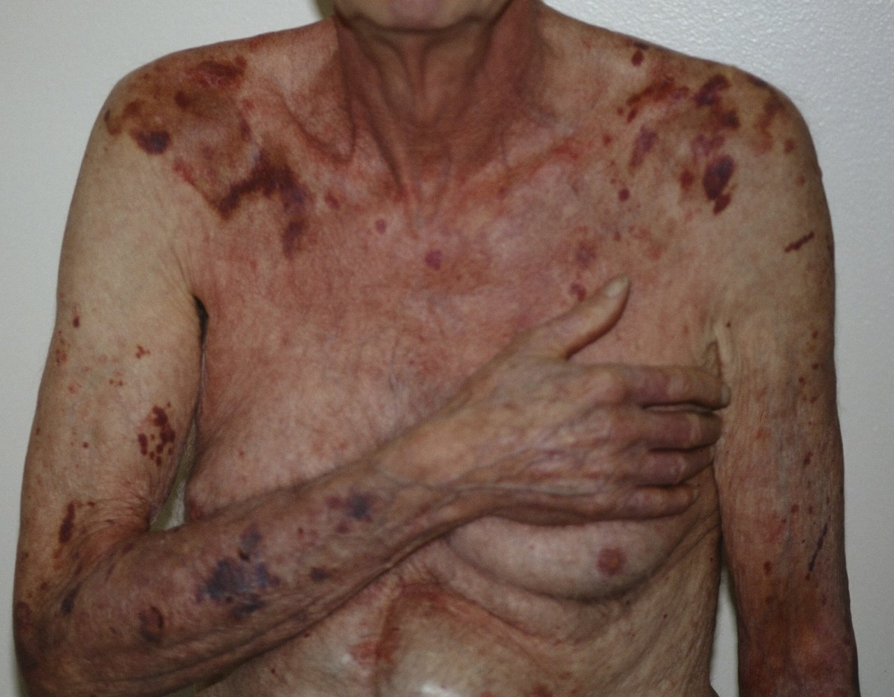
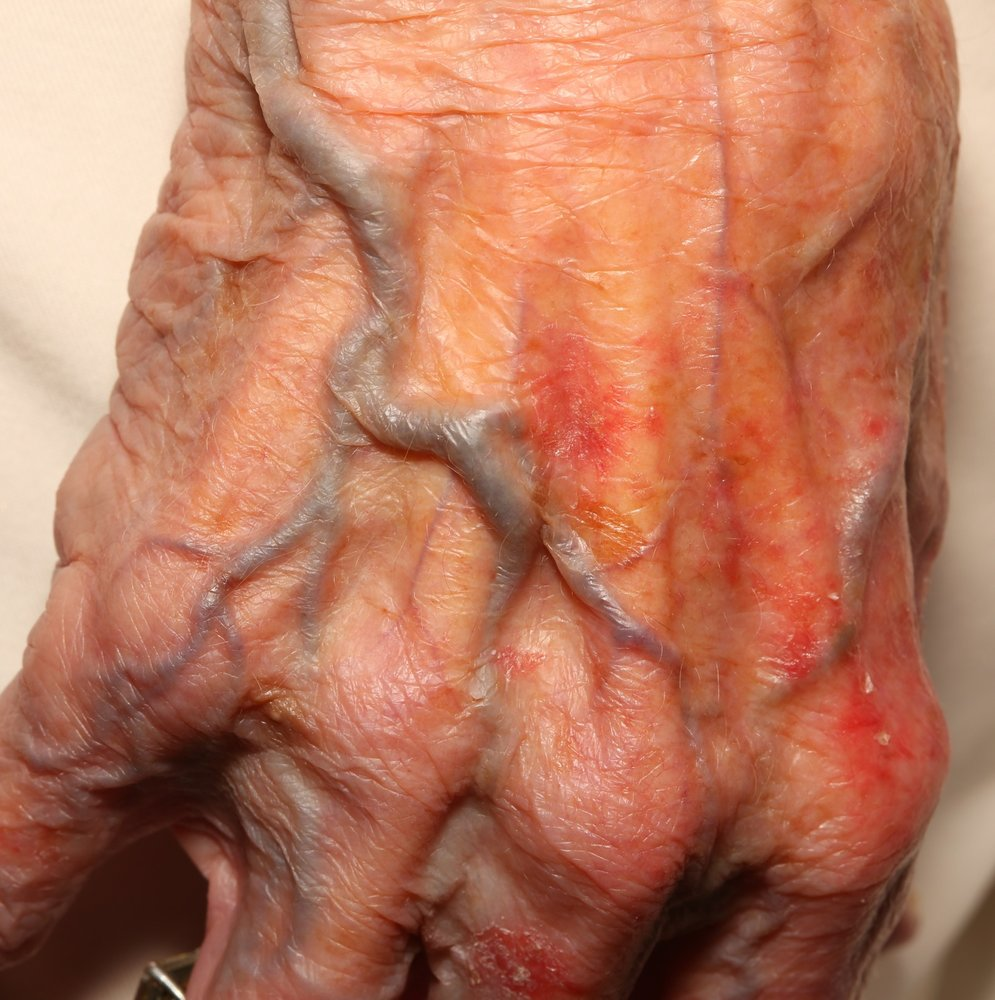
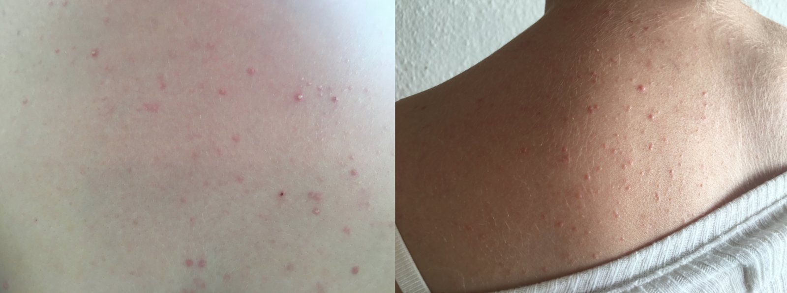
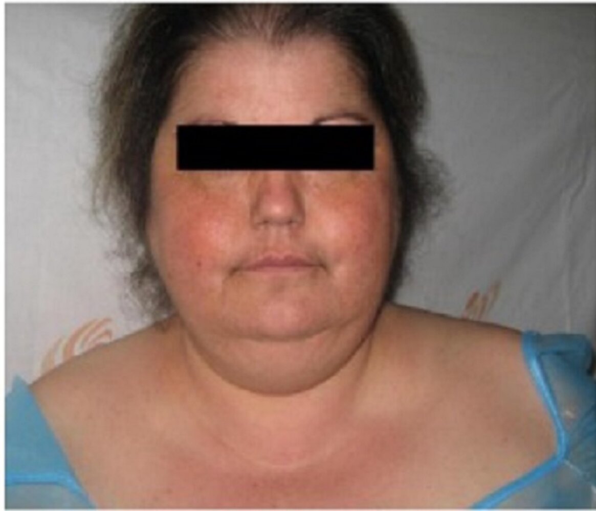

# Glucocorticoids

*Categories: Clinical knowledge > Pharmacology > Immunosuppressive drugs > Glucocorticoids*

[Original Article Link](https://coursology-qbank.com/amboss/article/km0mfg)

---

## Summary

Synthetic glucocorticoids are a group of drugs with antiinflammatory, <u>immunosuppressant</u>, metabolic, and endocrine effects. These drugs are structurally and functionally similar to the <u>endogenous</u> glucocorticoid <u>hormone</u> <u>cortisol</u>. Glucocorticoids have immediate effects (e.g., <u>vasoconstriction</u>) that do not depend on <u>DNA</u> interaction. However, they exert their main antiinflammatory and <u>immunosuppressive</u> actions by binding to glucocorticoid <u>receptors</u>, which causes complex changes in <u>gene transcription</u>. These genomic effects only begin to manifest after several hours. Similarly, glucocorticoids bind to <u>mineralocorticoid</u> <u>receptors</u>, but, for most glucocorticoid drugs, high doses are required for a significant <u>mineralocorticoid</u> effect. <u>Systemic glucocorticoids</u> are used for <u>hormone replacement therapy</u> (e.g., in <u>Addison disease</u>), for acute or chronic inflammatory diseases (e.g., <u>rheumatoid arthritis</u>), and for <u>immunosuppression</u> (e.g., after organ transplants). <u>Local glucocorticoids</u> are used to treat conditions like dermatoses, <u>asthma</u>, and <u>anterior uveitis</u>. Adverse effects include metabolic and endocrine disturbances, weight gain, <u>skin</u> reactions, <u>hypertension</u>, and psychiatric disorders; using the lowest dose possible for the shortest period of time, patient education, and regular screening can help lower the <u>incidence</u> of adverse effects and ensure early detection if they do occur. Contraindications for <u>systemic glucocorticoids</u> include <u>systemic fungal infections</u> and, in the case of <u>dexamethasone</u>, cerebral <u>malaria</u>. <u>Status asthmaticus</u> is a contraindication for <u>inhaled glucocorticoids</u>. Topical and ophthalmic glucocorticoids are usually contraindicated if there are preexisting local infections.

This article describes the pharmacology of synthetic glucocorticoids in detail; accordingly, glucocorticoids refer here to the drug class rather than the <u>endogenous</u> <u>hormone</u>.

---

## Definition

* Corticosteroids: a class of <u>steroid hormones</u> that includes glucocorticoids and <u>mineralocorticoids</u> [[1]](https://coursology-qbank.com/amboss/article/6NYjXp)

* <u>Endogenous</u> <u>corticosteroids</u>: <u>hormones</u> synthesized from <u>cholesterol</u> in the <u>adrenal cortex</u> [[2]](https://coursology-qbank.com/amboss/article/zx0r_R)

* <u>Endogenous</u> glucocorticoids (e.g., <u>cortisol</u>): synthesized in the <u>zona fasciculata</u> with antiinflammatory, <u>immunosuppressant</u>, metabolic, and endocrine effects

* <u>Endogenous</u> <u>mineralocorticoid</u> (i.e., <u>aldosterone</u>): synthesized in the <u>zona glomerulosa</u> and primarily functions to regulate the <u>renin-angiotensin system</u> and maintain <u>electrolyte</u> and water balance

* Synthetic <u>corticosteroids</u>: structural and functional analogs of <u>endogenous</u> <u>corticosteroids</u> that are used in the treatment of a variety of conditions [[3]](https://coursology-qbank.com/amboss/article/kEYmDI)

---

## Overview

* Systemic corticosteroids

* <u>Corticosteroids</u> that are administered orally, intravenously, or intramuscularly

* Act systemically as they are distributed throughout the body

* Examples: See table below.

* Local corticosteroids (<u>local glucocorticoids</u>)

* <u>Corticosteroids</u> that are administered topically, intraarticularly, as <u>eye</u>/<u>ear</u> drops, or are aerosolized and inhaled (inhaled corticosteroids)

* Act primarily at the site administered; a fraction is systemically absorbed [[4]](https://coursology-qbank.com/amboss/article/iXXJB9)

* Examples: beclomethasone, budesonide; , clobetasol, and fluticasone

* <u>Potency</u> of <u>systemic corticosteroids</u> [[3]](https://coursology-qbank.com/amboss/article/kEYmDI)

* <u>Hydrocortisone</u> is the synthetic equivalent of <u>endogenous</u> <u>cortisol</u> and its glucocorticoid and <u>mineralocorticoid</u> <u>potency</u> is considered to be “1” (see table below).

* Relative to <u>hydrocortisone</u>, <u>systemic corticosteroids</u> differ in <u>potency</u> of their glucocorticoid effects (relative glucocorticoid potency) and <u>mineralocorticoid</u> effects (relative mineralocorticoid potency) for a given dose.

|  Relative potency of systemic corticosteroids [[1]](https://coursology-qbank.com/amboss/article/6NYjXp)[[3]](https://coursology-qbank.com/amboss/article/kEYmDI)  |  |  |  |  |  |
| --- | --- | --- | --- | --- | --- |
| Duration of action |  Drug   |  Common routes of administration  |  Equivalent doses   | Relative glucocorticoid <u>potency</u> | Relative <u>mineralocorticoid</u> <u>potency</u> |
| Systemic glucocorticoids |  |  |  |  |  |
|  Short-acting (8–12 hours)  | Hydrocortisone |   * Oral  * Injectable  * Topical    |  * 20 mg   |  * 1   |  * 1   |
|  Cortisone  |   * Oral  * Injectable    |  * 25 mg   |  * 0.8   |  * 0.8   |  |
|  Intermediate-acting (12–36 hours)  |  Prednisolone   |   * <u>Prednisone</u>: oral  * <u>Prednisolone</u>:  * Oral  * Injectable    |  * 5 mg   |  * 4   |  * 0.8   |
|  Prednisone  |  |  |  |  |  |
| Methylprednisolone |   * Oral  * Injectable    |  * 4 mg   |  * 5   |  * 0.5   |  |
| Triamcinolone |   * Injectable  [[5]](https://coursology-qbank.com/amboss/article/vlbAAF)[[6]](https://coursology-qbank.com/amboss/article/Dlb1_F)[[7]](https://coursology-qbank.com/amboss/article/wlbh_F)  * Topical    |  * 4 mg   |  * 5   |  * 0   |  |
|  Long-acting 36–72 hours  | Dexamethasone |   * Oral  * Injectable  * Topical    |  * 0.75 mg   |  * 30   |  * 0   |
| Betamethasone |   * Oral  * Injectable  * Topical    |  * 0.6 mg   |  * 30   |  * 0   |  |
| Systemic mineralocorticoid |  |  |  |  |  |
|  Intermediate-acting 12–36 hours  | Fludrocortisone |  * Oral   |  * 0.1 mg   |  * 10–15   |  * 125–150   |

* Summary of effects of <u>systemic corticosteroids</u>

* Glucocorticoids with minimal <u>mineralocorticoid</u> activity: <u>triamcinolone</u>, <u>dexamethasone</u>, <u>betamethasone</u>

* Glucocorticoids with some <u>mineralocorticoid</u> activity: <u>hydrocortisone</u>, <u>prednisolone</u>

* Synthetic <u>corticosteroid</u> with predominantly <u>mineralocorticoid</u> activity: <u>fludrocortisone</u>

> [!TIP]
> <u>Fludrocortisone</u> is not used for glucocorticoid activity but as a <u>mineralocorticoid</u> substitute in the <u>management of adrenal insufficiency</u>. [[3]](https://coursology-qbank.com/amboss/article/kEYmDI)[[8]](https://coursology-qbank.com/amboss/article/RXXlB9)

Corticosteroid equivalence

---

## Pharmacodynamics

1. * Antiinflammatory and <u>immunosuppressive</u>

* Acute effects (within minutes) 

* ↓ <u>Vasodilation</u> and ↓ <u>capillary</u> permeability

* ↓ <u>Leukocyte</u> migration to inflammatory foci

* Long-term effects (within hours) : Glucocorticoids bind to <u>cytoplasmic</u> glucocorticoid <u>receptors</u> (GRs)

* Inhibition of <u>neutrophil</u> <u>apoptosis</u> and demargination (loss of <u>neutrophil</u> binding to adhesive <u>endothelial</u> <u>integrin</u> molecules) → <u>neutrophilic leukocytosis</u>

* Promotion of sequestration and <u>apoptosis</u> of <u>eosinophils</u>, <u>monocytes</u>, and <u>lymphocytes</u> → <u>lymphopenia</u> and <u>eosinopenia</u>

* ↑ Inhibition of phospholipase A2, which decreases the production of <u>arachidonic acid derivatives</u> → ↓ production of <u>leukotrienes</u> and <u>prostaglandins</u>

* ↑ Inhibition of <u>transcription factors</u> (e.g., <u>NF-κB</u>) → ↓ expression of pro-inflammatory <u>genes</u> (e.g., <u>TNF-α</u> <u>gene</u>, <u>interleukin-2</u> <u>gene</u>)

* Translocation to <u>the cell</u> <u>nucleus</u> and binding to glucocorticoid responsive elements (GREs) within the <u>promoters</u> of antiinflammatory <u>genes</u> (e.g., <u>interleukin-10</u> <u>gene</u>) → ↑ expression of antiinflammatory <u>genes</u>

* Suppression of <u>B cells</u> and <u>T cells</u> (<u>T cell</u> <u>apoptosis</u>)

* Inhibition of <u>histamine</u> release from <u>mast cells</u>

* Permissive effect on <u>epinephrine</u> and <u>norepinephrine</u> via upregulation of α1-<u>adrenergic receptors</u> on <u>arterioles</u>
2. * <u>Mineralocorticoid</u> properties

* <u>Cortisol</u> can bind to <u>mineralocorticoid</u> <u>receptors</u> at high concentrations  [[9]](https://coursology-qbank.com/amboss/article/hj0cZT)

* Effects include, e.g., reduced <u>sodium</u> excretion, increased <u>potassium</u> excretion
3. * Antiproliferative: triggers cell <u>apoptosis</u>, and inhibits <u>fibroblast</u> <u>proliferation</u> [[10]](https://coursology-qbank.com/amboss/article/-vXDcZ0)
4. * <u>Anabolic-androgenic effects</u> with steroid abuse:  : increase in muscle mass and strength

> [!TIP]
> Both acute and long-term effects of glucocorticoids lead to inhibition of inflammatory processes and to <u>immunosuppression</u>.

References:[[11]](https://coursology-qbank.com/amboss/article/ix0JwR)[[12]](https://coursology-qbank.com/amboss/article/jx0_wR)[[13]](https://coursology-qbank.com/amboss/article/Px0W9R)[[14]](https://coursology-qbank.com/amboss/article/lx0v9R)[[15]](https://coursology-qbank.com/amboss/article/5x0iCR)

---

## Adverse effects

### <u>Systemic glucocorticoids</u>

Glucocorticoid toxicity depends on the dose that is administered over a certain period of time. Therefore, even low doses can have toxic effects if administered long-term. If glucocorticoids are administered once or only briefly (e.g., for treatment of <u>anaphylactic shock</u>), there are usually no significant adverse effects even at high doses.

| Organ/System of organs | Effects |
| --- | --- |
| <u>Skin</u> |   * Poor <u>wound healing</u>, <u>skin</u> <u>atrophy</u>, and <u>stretch marks</u> due to impaired <u>fibroblast</u> activity and thus, impaired <u>collagen synthesis</u>  * <u>Purpura</u>  * Steroid acne  * <u>Hypertrichosis</u>  * Increased risk of squamous and <u>basal cell carcinomas</u>    |
| <u>Cardiovascular system</u> |  * <u>Hypertension</u>, most likely due to  * Increased <u>sensitivity</u> to <u>catecholamines</u> due to the upregulation of <u>alpha-1 receptors</u>  * <u>Mineralocorticoid</u> activity at high concentrations   |
| Metabolism, <u>electrolytes</u> and <u>endocrine system</u> |   * Weight gain with <u>truncal obesity</u>, <u>buffalo hump</u>, and moon face (Cushingoid appearance)  * Proteolysis and <u>lipolysis</u>: proteolysis contributes to <u>hyperglycemia</u> whereas <u>lipolysis</u> leads to <u>hyperlipidemia</u> and eventually to redistribution of <u>fat tissue</u> towards the trunk.  * Increased <u>gluconeogenesis</u>, <u>lipolysis</u>, and proteolysis  * <u>Hyperglycemia</u> and ↑ <u>insulin resistance</u> → glucocorticoid-induced <u>diabetes</u>  * Decreased <u>glucose</u> utilization in <u>skeletal muscle</u> and <u>white adipose tissue</u> (due to antagonization of <u>insulin</u> response)  * <u>Hypocalcemia</u> → <u>PTH</u> activation → secondary <u>osteoporosis</u>    |
| GI system |   * Increased appetite  * <u>Peptic ulcers</u> and <u>gastrointestinal hemorrhage</u>  * Possibly <u>pancreatitis</u>  [[16]](https://coursology-qbank.com/amboss/article/ZDXZ1Z0)    |
| <u>CNS</u> and psyche |   * <u>Mood disorders</u>  * Cognitive disorders  * Steroid-induced psychosis    |
| Eyes |   * <u>Cataract</u>  * <u>Glaucoma</u>    |
| Other |   * Adrenocortical <u>atrophy</u>  * <u>Acute adrenal insufficiency</u> (predominantly when glucocorticoids are discontinued suddenly after chronic intake)  * <u>Avascular bone necrosis</u> [[17]](https://coursology-qbank.com/amboss/article/rx0fBR)  * Glucocorticoid-induced osteoporosis, <u>osteopenia</u>: chronic glucocorticoid use → <u>RANKL</u>-mediated activation of <u>osteoclasts</u> and <u>apoptosis</u> of <u>osteoblasts</u> → decreased bone formation and increased bone resorption [[18]](https://coursology-qbank.com/amboss/article/b2YHTo)  * Corticosteroid-induced myopathy  [[19]](https://coursology-qbank.com/amboss/article/JMXspA)  * Acute: generalized <u>muscle weakness</u>  * Chronic  * Classic form of <u>steroid myopathy</u>  * Progressive <u>weakness</u> of <u>proximal</u> limb muscles, <u>myalgia</u>  * <u>Venous thromboembolism</u>  * Growth inhibition in children  * <u>Immunosuppression</u>  * Can result in the reactivation of latent infectious diseases (e.g., <u>CMV</u>, <u>tuberculosis</u>) and <u>opportunistic infections</u> (e.g., <u>candidiasis</u>)  * Blood test may show <u>leukocytosis</u> since <u>white blood cells</u> get demarginalized.  * Specific to <u>anabolic</u>-androgenic <u>steroid abuse</u>  * Endocrine/reproductive  * Women: e.g., <u>amenorrhea</u>, <u>hirsutism</u>, <u>breast atrophy</u>, deep voice, <u>androgenic alopecia</u>  * Men: e.g., <u>gynecomastia</u>, <u>acne</u>, small <u>testes</u>, low <u>sperm</u> density (due to inhibition of the <u>hypothalamic-pituitary-gonadal axis</u>)  * Cardiovascular: ↑ <u>heart rate</u>, ↑ blood pressure  * Hematologic: ↑ <u>LDL</u>, ↓ <u>HDL</u>, ↑ <u>hematocrit</u>  * Neuropsychiatric: e.g., aggressive behavior  * <u>Tendon</u> ruptures  * Hepatic damage    |

> [!NOTE]
> Many of the adverse effects listed above are also features of <u>iatrogenic</u> <u>Cushing syndrome</u>.

> [!NOTE]
> The <u>tibia</u> is BIGgA than the FIBula: <u>cortisol</u> increases Blood pressure, Insulin resistance, Gluconeogenesis, and Appetite; and decreases Fibroblast activity, Immune response, and Bone formation.

Adverse effects of glucocorticoids

Steroid purpura

Steroid skin atrophy

Steroid acne

Moon face

### <u>Local glucocorticoids</u> [[20]](https://coursology-qbank.com/amboss/article/tx0XyR)

|  | Topical glucocorticoids | <u>Inhaled glucocorticoids</u> |
| --- | --- | --- |
| Local effects |   * <u>Skin</u> manifestations as in <u>systemic glucocorticoids</u>  * Allergic dermatitis    |   * <u>Oral candidiasis</u> (can be prevented by using a spacer or by rinsing out the mouth after inhalation)  * <u>Lung</u> infections  * <u>Hoarseness</u>  * Allergic dermatitis    |
| Eyes |  * As in <u>systemic glucocorticoids</u>   |  * Ocular reactions   |
| Other | - |   * Growth inhibition  * <u>Osteoporosis</u>  * <u>Adrenal suppression</u>    |

> [!NOTE]
> Local side-effects of <u>inhaled glucocorticoids</u> can be avoided by reducing the dose to the lowest effective amount, rinsing with mouthwash after each puff, improving the inhalation technique and compliance, and keeping <u>vaccinations</u> up to date.

We list the most important adverse effects. The selection is not exhaustive.

---

## Indications

* Replacement therapy

* Adrenocortical insufficiency (<u>Addison disease</u>)

* <u>Congenital adrenal hyperplasia</u>

* <u>Hypopituitarism</u>

* Systemic symptomatic treatment

* Acute

* <u>Allergic reactions</u> and <u>anaphylactic shock</u>

* <u>Asthma</u>

* Antiemetic treatment (e.g., <u>nausea</u> due to cytostatic treatment)

* Toxic <u>pulmonary edema</u> [[21]](https://coursology-qbank.com/amboss/article/9x0NAR)

* Acute exacerbation of autoimmune diseases (e.g., <u>multiple sclerosis</u>, <u>psoriasis</u>)

* <u>Acute exacerbation of COPD</u>

* <u>Gout</u>, <u>calcium pyrophosphate deposition disease</u>

* <u>Cerebral edema</u>

* <u>Thyroid storm</u>: <u>Cortisol</u> inhibits the peripheral conversion of T4 to T3(the inactive byproduct of T4, <u>rT3</u>, increases).

* <u>Acute pericarditis</u>

* Long-term

* Chronic, inflammatory diseases (; e.g., <u>asthma</u>, <u>chronic obstructive pulmonary disease</u>, <u>inflammatory bowel disease</u>, <u>vasculitides</u>)

* Rheumatic diseases (e.g., <u>sarcoidosis</u>, <u>Sjogren syndrome</u>)

* <u>Graves ophthalmopathy</u>

* <u>Malignancy</u> (e.g., <u>CLL</u>, <u>non-Hodgkin lymphoma</u>)

* Local symptomatic treatment: : <u>anterior uveitis</u>, <u>tenosynovitis</u>, dermatoses, and <u>osteoarthritis</u> or <u>juvenile idiopathic arthritis</u>

* Prophylactic

* Organ transplant

* <u>Preterm delivery</u>: Glucocorticoids are given to the mother prenatally to <u>induce fetal lung maturity</u>.

---

## Contraindications

* General: hypersensitivity

* Systemic

* Systemic <u>fungal infections</u>

* Intrathecal administration

* Cerebral <u>malaria</u> (<u>dexamethasone</u>)

* Concomitant live or live attenuated <u>virus</u> <u>vaccination</u> (if glucocorticoids are used in <u>immunosuppressive</u> doses)

* Use in <u>premature infants</u> (formulations containing benzyl <u>alcohol</u>)

* Topical

* Dermatological: bacterial, viral or fungal infection of the mouth or throat (<u>triamcinolone</u>)

* Ophthalmic

* <u>Systemic fungal infection</u> (<u>triamcinolone</u>)

* Acute untreated <u>purulent</u> ocular infections (<u>prednisolone</u>)

* Fungal or <u>mycobacterial</u> ocular infections, <u>viral conjunctivitis</u>, or <u>keratitis</u> (<u>prednisolone</u>, <u>dexamethasone</u>)

* Inhalation: <u>status asthmaticus</u> or <u>acute asthma episode</u> requiring intensive measures (<u>beclomethasone</u>, <u>budesonide</u>)

* <u>Relative contraindications</u>: Glucocorticoids should be avoided in certain conditions due to increased risk of toxicity.

* Adrenocortical <u>atrophy</u>

* <u>Cushing syndrome</u>

* <u>Diabetes mellitus</u> (<u>steroid</u> <u>diabetes</u>), <u>hyperglycemia</u>

* <u>Amenorrhea</u>

* <u>Osteoporosis</u>

* <u>Avascular necrosis</u> (e.g., of the femoral head)

* <u>Peptic ulcers</u>

* <u>Cataracts</u>

* <u>Psychosis</u>

References:[[22]](https://coursology-qbank.com/amboss/article/wXYhZL)

We list the most important contraindications. The selection is not exhaustive.

---

## Additional considerations

* Systemic administration

* Tapering to avoid toxicity

* Short-term administration (≤ 3 weeks): usually no tapering necessary

* Long-term administration (> 3 weeks): tapering regimen based on patient age and condition and on duration/dose of prior glucocorticoid administration  → e.g., tapering over 2 months

* Sudden discontinuation after chronic use should be avoided because of the risk of <u>adrenal insufficiency</u> (<u>adrenal crisis</u>) secondary to long-term <u>hypothalamic-pituitary-adrenal axis</u> suppression.

* IM application

* Indications include antenatal <u>induction of fetal lung maturity</u> and <u>adrenal crisis</u>

* For other conditions, IM application is generally avoided as it can result in localized atrophies and disturbances in the <u>endogenous</u> release of glucocorticoids

> [!WARNING]
> If the Cushing threshold is exceeded over a longer period of treatment, the glucocorticoid dose should be gradually decreased to minimize the risk of adrenocortical insufficiency.

> [!WARNING]
> An intratendinous injection carries the risk of bacterial spread and <u>iatrogenic</u> <u>bacterial arthritis</u>.

References:[[2]](https://coursology-qbank.com/amboss/article/zx0r_R)[[23]](https://coursology-qbank.com/amboss/article/Ax0R_R)

---