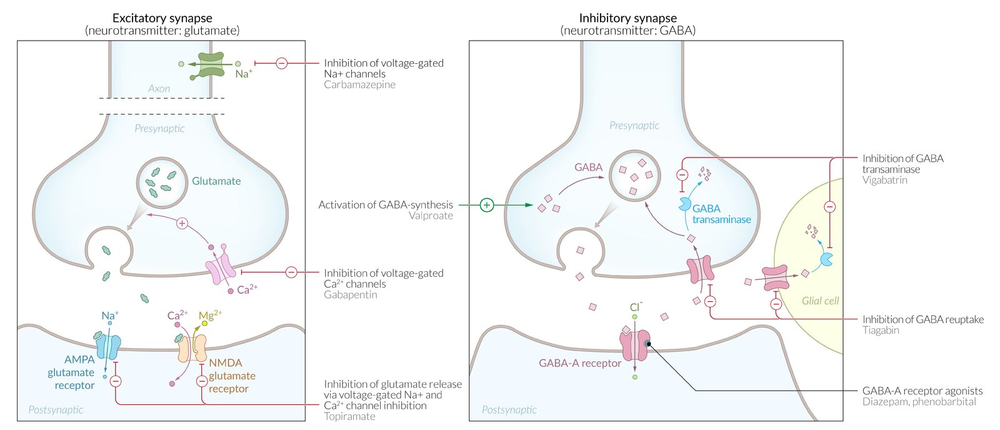

# Anticonvulsant drugs

*Categories: Clinical knowledge > Pharmacology > Neurologic and psychiatric > Anticonvulsant drugs*

[Original Article Link](https://coursology-qbank.com/amboss/article/-N0Ddg)

---

## Summary

Anticonvulsant drugs are classified as either first-generation (classic) agents or second-generation agents. Second-generation anticonvulsants are usually better tolerated and have a broader therapeutic range than classic anticonvulsant drugs. The choice of drug is guided by the type of <u>seizure</u>. First-line treatment for <u>focal seizures</u> includes, e.g., <u>lamotrigine</u> or <u>levetiracetam</u>, while <u>valproate</u> is used for <u>generalized seizures</u>. While all anticonvulsants have dose-dependent side effects on the <u>central nervous system</u> (e.g., <u>somnolence</u>, <u>nausea</u>), select agents also have other side effects (e.g., <u>gingival hyperplasia</u> caused by <u>phenytoin</u>). Anticonvulsants are also used for <u>pain management</u> (e.g., <u>carbamazepine</u> or <u>gabapentin</u>) and as <u>mood stabilizers</u> in <u>bipolar disorders</u> (<u>valproate</u>).

For more information on the treatment of <u>generalized seizures</u>, see <u>treatment of epileptic seizures</u>.

---

## Overview

Anticonvulsant drugs inhibit neural activity (↓ neural excitation, ↑ neural inhibition) and increase the <u>seizure</u> threshold by interacting with specific <u>receptors</u> and ion channels.

### Overview of first-generation anticonvulsants [[1]](https://coursology-qbank.com/amboss/article/XC09qR)

| Overview |  |  |  |  |  |
| --- | --- | --- | --- | --- | --- |
| Agent | Indication | Mechanism of action | Adverse effects | Contraindications | Interactions |
| Valproate |   * First-line long-term treatment for <u>tonic-clonic</u> <u>generalized seizures</u>  * Partial (focal) <u>seizures</u>  * Absence <u>epilepsy</u>  * Treatment of established <u>status epilepticus</u> [[2]](https://coursology-qbank.com/amboss/article/dQboEt)  * <u>Myoclonic seizures</u>  * <u>Migraine prophylaxis</u>  * <u>Bipolar disorder</u>    |   * Inhibits <u>GABA transaminase</u> → ↑ <u>GABA</u> → ↓ neuronal excitability  * Inactivates Na+ channels and <u>Ca2+</u> channels    |   * Gastrointestinal upset  * <u>Tremor</u>  * <u>Alopecia</u>  * <u>Pancreatitis</u>  * Weight gain  * <u>Teratogenicity</u>  * Especially <u>neural tube defects</u> (contraindicated in women of childbearing age/<u>pregnancy</u>) )  * See <u>pharmacotherapy during pregnancy</u>  * <u>Hepatotoxicity</u> (usually occurs during the first 6 months of treatment): <u>LFT</u> should be regularly performed in people taking <u>valproate</u>  [[3]](https://coursology-qbank.com/amboss/article/VJ1GG30)  * <u>Cytochrome P450 inhibition</u>  [[4]](https://coursology-qbank.com/amboss/article/jHX_Jz)  * <u>Rash</u>  * <u>Dizziness</u>  * Sedation  * <u>Ataxia</u>  * <u>Thrombocytopenia</u> (may manifest as easy <u>bruising</u>)  * <u>Agranulocytosis</u>    |  * <u>Pregnancy</u> (especially <u>valproate</u> and <u>carbamazepine</u>)   |  * <u>Cytochrome P450 inhibition</u>   |
|  Carbamazepine [[5]](https://coursology-qbank.com/amboss/article/kGXmzz)  |   * First-line treatment for <u>focal seizures</u>  * First-line <u>treatment of trigeminal neuralgia</u>  * Second-line treatment for generalized <u>tonic-clonic</u> <u>seizures</u>    |  * Inactivates Na+ channels   |   * Gastrointestinal symptoms (e.g., <u>nausea</u>, <u>vomiting</u>, <u>diarrhea</u>)  * <u>Rash</u>  * <u>Hyponatremia</u>, hyperhydration, and <u>edema</u> (due to <u>SIADH</u>)  * <u>DRESS syndrome</u>  * Blood count abnormalities (e.g., <u>agranulocytosis</u>, <u>aplastic anemia</u>)  * <u>Teratogenicity</u> during the <u>first trimester</u> (<u>cleft lip</u>/<u>palate</u>, <u>spina bifida</u>) (see <u>pharmacotherapy during pregnancy</u>)  * <u>Folate</u> depletion  * <u>Diplopia</u>  * <u>Ataxia</u>  * <u>Hepatotoxicity</u>  * <u>Stevens-Johnson syndrome</u>  * Induces <u>cytochrome P450</u>  * <u>Dizziness</u>  * Sedation    |  * Strong induction of <u>cytochrome P450</u>   |  |
| Ethosuximide |  * First-line for <u>absence seizures</u>   |  * Inhibition of <u>voltage</u>-gated <u>calcium</u> channels (T-type) in <u>neurons</u> of the <u>thalamus</u>   |   * Gastrointestinal symptoms  * Allergic <u>skin</u> reactions (<u>urticaria</u>, <u>Stevens-Johnson syndrome</u>)  * <u>Pancytopenia</u>  * Fatigue  * <u>Headache</u>  * <u>Myopia</u>  * Sedation  * <u>Dizziness</u>    |  * Increases serum levels of <u>phenytoin</u>   |  |
| Phenytoin, fosphenytoin |   * <u>Tonic-clonic</u> <u>seizures</u>  * Only rarely used for long-term treatment of <u>focal seizures</u>  * Treatment of established <u>status epilepticus</u>[[2]](https://coursology-qbank.com/amboss/article/dQboEt)    |   * Inactivation of Na+ channels  * Zero-order elimination (i.e., constant rate of drug eliminated)    |   * <u>Hirsutism</u>  * <u>Hyperpigmentation</u> of <u>skin</u> (<u>melasma</u>)  * <u>Gingival hyperplasia</u>  * <u>Nystagmus</u>  * <u>Osteopenia</u>  * <u>Megaloblastic anemia</u> due to ↓ <u>folate</u> absorption  * Peripheral neuropathy  * <u>Stevens-Johnson</u> syndrome  * <u>Drug-induced lupus erythematosus</u>  * <u>DRESS syndrome</u>  * Intoxication: sedation, <u>diplopia</u>, <u>ataxia</u>, <u>arrhythmias</u>  * Induction of cytochrome P-450 enzymes  * <u>Teratogenic</u>: <u>fetal hydantoin syndrome</u>  * <u>Hypothyroidism</u>  [[6]](https://coursology-qbank.com/amboss/article/eXcxCa0)  * Sedation  * <u>Dizziness</u>  * <u>Rash</u>  * <u>Hepatotoxicity</u>    |  * Induction of <u>cytochrome P450</u>   |  |
| Phenobarbital |   * First-line treatment in <u>neonates</u>  * <u>Tonic-clonic</u> <u>generalized seizures</u>  * <u>Focal seizures</u>  * <u>Status epilepticus</u>    |  * GABAA<u>agonist</u> → ↑ <u>GABA</u> action   |   * Cardiorespiratory <u>depression</u>  * Tolerance and dependence  * Sedation  * Induces cytochrome P-450    |  |  |
| <u>Benzodiazepines</u> |   * First-line for <u>status epilepticus</u>  * Second-line treatment for <u>eclampsia</u>    |  * Indirect GABAA <u>agonist</u> → ↑ <u>GABA</u> action   |   * Sedation and dependence (see <u>benzodiazepines</u>)  * Tolerance  * Respiratory <u>depression</u>    |  * <u>Alcohol</u>, <u>opioids</u>, sedatives: ↑ <u>CNS</u> <u>depression</u>   |  |

### Overview of second-generation anticonvulsants [[1]](https://coursology-qbank.com/amboss/article/XC09qR)

| Overview |  |  |  |  |  |  |
| --- | --- | --- | --- | --- | --- | --- |
| Agent |  | Indication | Mechanism of action | Adverse effects | Contraindications | Interactions |
| Lamotrigine |  |   * First-line treatment for long-term therapy of <u>focal seizures</u>  * Second-line treatment for <u>generalized seizures</u> and <u>absence seizures</u>  * <u>Mood stabilizer</u> for <u>treatment of bipolar disorder</u>    |  * Inhibition of <u>voltage</u>-gated Na+channels → ↓ <u>glutamate</u> release   |   * <u>Rash</u>, <u>exfoliative dermatitis</u>, or rarely, <u>Stevens-Johnson</u> syndrome (slow <u>titration</u> is necessary to prevent <u>skin</u> and <u>mucous membrane</u> reactions)  * <u>Hemophagocytic lymphohistiocytosis</u>  * Rarely <u>hepatotoxic</u> or <u>nephrotoxic</u>  * Blurry <u>vision</u>  * Gastrointestinal symptoms  * Sedation  * <u>Dizziness</u>  * <u>DRESS</u> Syndrome    |  * Hypersensitivity   |  * Coadministration of <u>carbamazepine</u>, <u>phenobarbital</u>, <u>phenytoin</u> → ↑ clearance   |
| Tiagabine |  |  * <u>Focal seizures</u>, with or without impairment of consciousness (adjunctive therapy)   |  * Inhibits <u>GABA</u> reuptake → ↑ <u>GABA</u>   |   * <u>Dizziness</u>  * Gastrointestinal upset: <u>nausea</u>, <u>vomiting</u>, <u>diarrhea</u>  * <u>Insomnia</u>  * Drowsiness  * Weight changes    |  |  |
| Levetiracetam |  |   * First-line treatment for long-term therapy of <u>focal seizures</u>  * <u>Generalized seizures</u>    |   * Not fully understood  * Blockage of SV2A <u>receptor</u> → <u>GABA</u> and/or <u>glutamate</u> release modulation and inhibition of <u>voltage</u>-gated <u>Ca2+</u> channels    |   * <u>Lethargy</u>, fatigue  * <u>Nausea</u>  * <u>Headache</u>  * Psychiatric symptoms (e.g., <u>personality</u> changes)  * Sedation  * <u>Dizziness</u>    |  * No significant interactions   |  |
| Gabapentinoids |  Pregabalin (tentative <u>FDA</u> approval) |   * Drug combination for long-term treatment of <u>focal seizures</u>  * <u>Neuropathic pain</u>  * <u>Neuralgia</u> after <u>herpes infection</u>  * <u>Generalized anxiety disorder</u>    |   * Inhibition of presynaptic P/Q-type <u>Ca2+</u> channels via action on the α2δ-subunit → ↓ <u>Ca2+</u> intracellular flow → ↓ <u>glutamate</u> release [[1]](https://coursology-qbank.com/amboss/article/XC09qR)  * Does not bind to <u>GABA</u> <u>receptors</u> despite being a <u>GABA</u> analog    |   * <u>Somnolence</u>  * <u>Nausea</u>  * <u>Ataxia</u>  * Impaired <u>vision</u>  * Weight gain    |  |  |
| Gabapentin |   * Second-line treatment for <u>focal seizures</u>  * <u>Postherpetic neuralgia</u>  * Peripheral (poly)neuropathy    |   * Dry mouth  * <u>Somnolence</u>, <u>nausea</u>  * <u>Ataxia</u>  * <u>Dizziness</u>  * Weight gain    |  * <u>Morphine</u>: ↑ concentrations of <u>gabapentin</u>   |  |  |  |
| Vigabatrin |  |   * Refractory <u>focal seizures</u> (adjunctive therapy)  * Monotherapy for <u>infantile spasms</u> (<u>West syndrome</u>)    |  * Inhibits <u>GABA transaminase</u> irreversibly → ↑ <u>GABA</u>   |  * Irreversible <u>vision loss</u>   |  * None   |  * Decreases serum levels of <u>phenytoin</u>   |
| Topiramate |  |   * Focal and generalized <u>tonic-clonic</u> <u>epileptic seizures</u>  * <u>Migraine prophylaxis</u>  * <u>Idiopathic intracranial hypertension</u>    |   * Blockage of <u>voltage</u>-gated Na+ channels  * ↑ <u>GABA</u>    |   * <u>Angle-closure glaucoma</u>  * Weight loss  * <u>Kidney stones</u>  * Cognitive dysfunction (e.g., decreased verbal fluency, cognitive speed, and <u>working memory</u>)  * Sedation  * <u>Dizziness</u>  * Mood disturbance, <u>depression</u>  * <u>Paresthesia</u>    |  * Decreases <u>efficacy</u> of <u>oral contraceptives</u>   |  |

Learn Topiramate Faster with Picmonic (USMLE, Step 1, Step 2 CK)

Mechanism of action: anticonvulsant drugs

> [!NOTE]
> You can use the following to remember the features of PHENYTOIN: cytochrome P-450 interaction, Hirsutism, Enlarged <u>gums</u> (<u>gingival hyperplasia</u>), Nystagmus, Yellow-browning of <u>skin</u> (<u>melasma</u>), Teratogenicity, Osteomalacia, Interacts with <u>folate</u>, Neuropathy

> [!NOTE]
> To remember that the most important side effects of ethoSUXimide are Steven-Johnson syndrome, fatigue, <u>headache</u>, ABdominal upset, and ALLErGies (e.g., <u>urticaria</u>), think of “It sucks that Steven's FATher has given everyone a <u>headache</u> with his ABsurd ALLEGorizations.”

> [!NOTE]
> To remember a crucial side effect of vigabatrin, think of “Vision goes away by accident.”

> [!NOTE]
> To remember that phenobarbital is first-line treatment for <u>neonates</u>, think of “Phenobarbital is phenomenal for treating babies.”

> [!NOTE]
> To remember that the most common side effects of topiramate are speech impairment, weight loss (light), cognitive impairment, sedation, and <u>kidney</u> stones, think of “It leaves you speechless how lightly the cog railway travels through sediments and stones to the top.”

References:[[1]](https://coursology-qbank.com/amboss/article/XC09qR)[[7]](https://coursology-qbank.com/amboss/article/nu0773)

---

## Special patient groups

### <u>Pregnancy</u> and <u>breastfeeding</u>

* Classic anticonvulsants (especially <u>carbamazepine</u> and <u>sodium</u> <u>valproate</u>!) should be avoided if possible → <u>teratogenic</u> effects

* Newer anticonvulsants: lack of medical data and trials during <u>pregnancy</u>  [[9]](https://coursology-qbank.com/amboss/article/OGXIzz)

* The choice of treatment depends on the type of <u>seizure</u> and which substance enables optimal control of <u>seizures</u>.

* Approach

* Optimize <u>seizure</u> control prior to <u>conception</u>.

* Avoid multiple therapies.

* Administer the drug at the lowest dose that controls <u>seizures</u>.

* Monitor plasma drug levels regularly.

---