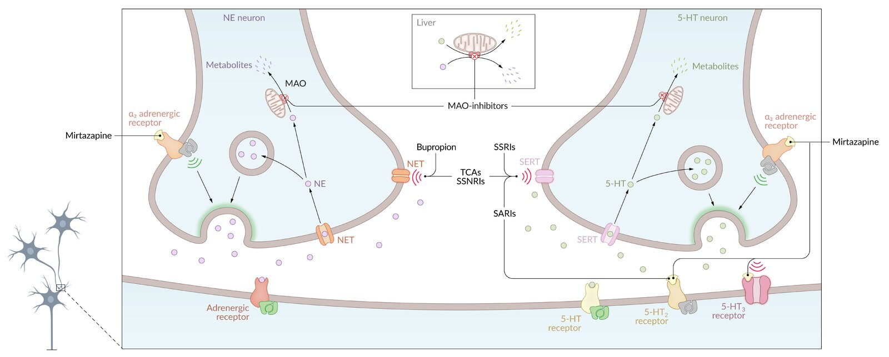

# Antidepressants

*Categories: Clinical knowledge > Pharmacology > Neurologic and psychiatric > Antidepressants*

[Original Article Link](https://coursology-qbank.com/amboss/article/_N05dg)

---

## Summary

Antidepressants are used primarily to treat <u>major depressive disorder</u> (<u>MDD</u>), although they are also indicated for the treatment of many other neuropsychiatric conditions. The most widely used classes of antidepressants are <u>selective serotonin reuptake inhibitors</u> (<u>SSRIs</u>), <u>serotonin-norepinephrine</u> reuptake inhibitors (<u>SNRIs</u>), <u>monoamine oxidase inhibitors</u> (<u>MAOIs</u>), and <u>tricyclic antidepressants</u> (<u>TCAs</u>). Most of these drugs work by increasing levels of <u>serotonin</u>, <u>norepinephrine</u>, or <u>dopamine</u> within the <u>synaptic cleft</u>. <u>SSRIs</u> are the first-line treatment for the vast majority of patients with <u>depression</u> because of their <u>efficacy</u> and favorable side-effect profile. While <u>MAOIs</u> and <u>TCAs</u> also have a high degree of <u>efficacy</u>, they are no longer widely used because of their undesirable side-effect profiles. <u>Serotonin syndrome</u> may occur as a complication of serotonergic antidepressant use; <u>TCA toxicity</u> is also possible, as is <u>antidepressant discontinuation syndrome</u>, which is caused by abrupt withdrawal or dose reduction of an antidepressant taken for ≥ 4 weeks.

---

## Overview

| Overview of antidepressants |  |  |  |  |  |  |
| --- | --- | --- | --- | --- | --- | --- |
| Agents |  | Indications | Mechanism of action | Adverse effects | Contraindications | Interactions |
| St. John's Wort |  |  * <u>Major depressive disorder</u>   |  * Downregulation of <u>β-adrenergic</u> <u>receptors</u> and inhibition of <u>glutamate</u> release [[1]](https://coursology-qbank.com/amboss/article/71c4RY0)   |   * Gastrointestinal upset  * <u>Dizziness</u>, <u>headache</u>, confusion    |  * Use with caution in <u>bipolar disorder</u> (↑ risk of provoking <u>mania</u>)   |   * Other <u>serotonergic drugs</u>: ↑ risk of <u>serotonin syndrome</u>  * St John's Wort: induces <u>cytochrome P450</u>    |
|  <u>Selective serotonin reuptake inhibitors</u> (<u>SSRIs</u>; e.g., <u>fluoxetine</u>, <u>sertraline</u>, <u>citalopram</u>) |  |   * <u>Major depressive disorder</u> (first-line: <u>SSRIs</u>)  * <u>Generalized anxiety disorder</u>  * <u>Neuropathic pain</u>, <u>stress incontinence</u>, <u>fibromyalgia</u> (<u>SNRIs</u>)    |  * Inhibition of <u>serotonin</u> reuptake in <u>synaptic cleft</u> → ↑ <u>serotonin</u> levels   |   * <u>Sexual dysfunction</u>  * Gastrointestinal upset  * <u>Agitation</u>, <u>insomnia</u>, <u>anxiety</u>  * ↑ Blood pressure (<u>SNRIs</u>)    |   * <u>Bleeding disorders</u>  * <u>Epilepsy</u>  * <u>SNRIs</u>: uncontrolled <u>hypertension</u>    |  |
|  <u>Serotonin</u> <u>norepinephrine</u> reuptake inhibitors (<u>SNRIs</u>; e.g., <u>venlafaxine</u>, <u>duloxetine</u>) |  |  * Inhibition of <u>serotonin</u> and <u>norepinephrine</u> reuptake in <u>synaptic cleft</u> → ↑ <u>serotonin</u> and <u>norepinephrine</u> levels   |  |  |  |  |
|  <u>Tricyclic antidepressants</u> (<u>TCAs</u>) |  Secondary amines (e.g., <u>nortriptyline</u>, <u>desipramine</u>) |   * <u>Major depressive disorder</u>  * <u>Neuropathic pain</u>  * <u>Migraine prophylaxis</u>    |   * <u>Anticholinergic effects</u>  * Cardiotoxicity: prolonged <u>QT interval</u> and widened <u>QRS complex</u>    |  * Tertiary amines should be avoided in older adults.   |  |  |
|  Tertiary amines (e.g., <u>amitriptyline</u>, <u>imipramine</u>) |  |  |  |  |  |  |
|  <u>Serotonin antagonist and reuptake inhibitors</u> (<u>SARIs</u>; e.g., <u>trazodone</u>) |  |   * <u>Insomnia</u>  * <u>Major depressive disorder</u> (high doses required)    |  * Inhibition of H1, α1, and postsynaptic 5-HT2 <u>receptors</u> as well as <u>serotonin</u> reuptake → ↑ <u>serotonin</u> levels   |   * <u>Priapism</u>  * Sedation    |  * Avoid in individuals with <u>risk factors</u> for prolonged <u>QT interval</u>. [[2]](https://coursology-qbank.com/amboss/article/wWchnY0)   |  |
|  <u>Monoamine oxidase inhibitors</u> (<u>MAOIs</u>; e.g., <u>tranylcypromine</u>, <u>phenelzine</u>, <u>selegiline</u>) |  |   * <u>Major depressive disorder</u> (especially <u>atypical depression</u>)  * <u>Parkinson disease</u> (<u>selegiline</u>)    |   * Nonselective inhibition of <u>monoamine oxidase</u> → ↑ levels of <u>epinephrine</u>, <u>norepinephrine</u>, <u>serotonin</u>, and <u>dopamine</u>  * <u>Selegiline</u>: selective <u>MAO-B inhibitor</u> → ↑ levels of <u>dopamine</u>    |   * <u>CNS</u> stimulation  * <u>Tyramine</u>-induced <u>hypertensive crisis</u>    |  * <u>Pheochromocytoma</u> [[3]](https://coursology-qbank.com/amboss/article/9WcNnY0)   |  |
| <u>Atypical antidepressants</u> | <u>Mirtazapine</u> |   * <u>Major depressive disorder</u> (<u>mirtazapine</u>: especially individuals who are underweight and/or have <u>insomnia</u>)  * <u>Smoking cessation</u> (<u>bupropion</u>, <u>varenicline</u>)    |  * α2, H1, 5-HT2, and <u>5-HT3 receptor antagonists</u> → ↑ <u>serotonin</u> and <u>norepinephrine</u> release and ↑ effect of <u>serotonin</u> on free <u>5-HT1 receptors</u>   |   * Increased appetite, weight gain, and serum <u>cholesterol</u> and <u>triglyceride</u> levels  * Sedation    |  * Hypersensitivity [[4]](https://coursology-qbank.com/amboss/article/CWcqnY0)   |  |
|  <u>Bupropion</u> [[5]](https://coursology-qbank.com/amboss/article/xWcEnY0) |  * Thought to increase <u>dopamine</u> and <u>norepinephrine</u> levels via reuptake inhibition   |   * Reduction of <u>seizure</u> threshold  * <u>Insomnia</u>, <u>agitation</u>, <u>tachycardia</u>    |   * <u>Seizure disorder</u>  * <u>Anorexia nervosa</u>, <u>bulimia nervosa</u>    |  |  |  |
| <u>Vilazodone</u> |   * Inhibition of <u>serotonin</u> reuptake in <u>synaptic cleft</u> → ↑ <u>serotonin</u> levels  * 5-HT1A<u>receptor</u> <u>partial agonist</u>    |   * <u>Sexual dysfunction</u>  * <u>Sleep</u> disturbance, abnormal dreams  * Gastrointestinal upset    |  * Concomitant <u>MAOI</u> use [[6]](https://coursology-qbank.com/amboss/article/BWcznY0)   |  |  |  |
| <u>Vortioxetine</u> |   * Inhibition of <u>5-HT3 receptors</u> and <u>serotonin</u> reuptake in <u>synaptic cleft</u> → ↑ <u>serotonin</u> levels  * 5-HT1A <u>receptor</u> <u>agonist</u>    |  * Hypersensitivity   |  |  |  |  |
| <u>Varenicline</u> |  * Nicotinic <u>ACh</u> <u>receptor</u> <u>partial agonist</u>   |  * <u>Sleep</u> disturbances   |  * Transdermal <u>nicotine</u>: ↑ adverse events   |  |  |  |
| <u>Buspirone</u> |  * <u>Anxiety disorder</u>   |  * 5-HT1A <u>receptor</u> stimulation   |   * <u>Headaches</u>, <u>dizziness</u>, <u>nausea</u>,  * <u>Seizures</u> resulting from chronic use    |  * <u>Erythromycin</u>, <u>itraconazole</u>, <u>nefazodone</u>: ↑↑ plasma <u>buspirone</u> concentration [[7]](https://coursology-qbank.com/amboss/article/yWcdLY0)   |  |  |

Targets and mechanisms of antidepressants

> [!NOTE]
> Antidepressants increase the risk of <u>suicidal thoughts</u> and <u>suicidality</u> in children, <u>adolescents</u>, and young adults < 24 years with <u>major depressive disorder</u>.

---

## Selective serotonin reuptake inhibitors

* Mechanism of action: inhibition of <u>serotonin</u> reuptake in <u>synaptic cleft</u> → ↑ <u>serotonin</u> levels

* Drugs

* Fluoxetine

* Paroxetine

* Sertraline

* Citalopram

* Escitalopram

* Fluvoxamine

* Indications

* <u>Major depressive disorder</u> (first-line therapy)

* <u>Generalized anxiety disorder</u> (<u>GAD</u>)

* <u>Obsessive-compulsive disorder</u> (<u>OCD</u>)

* <u>Post-traumatic stress disorder</u> (<u>PTSD</u>)

* <u>Panic disorder</u>

* <u>Premature ejaculation</u>

* <u>Premenstrual dysphoric disorder</u>

* <u>Binge-eating disorder</u>

* <u>Bulimia nervosa</u>

* <u>Social anxiety disorder</u>

* <u>Somatic symptom disorder</u>

* <u>Irritable bowel syndrome</u>

* Side effects

* Early side effects (onset and resolution typically within 1 week of therapy start)

* <u>Headache</u>

* <u>Diarrhea</u>, <u>nausea</u>, <u>vomiting</u>

* Activating effects (e.g., <u>agitation</u>, <u>anxiety</u>, <u>insomnia</u>)

* Late side effects 

* <u>Sexual dysfunction</u> (e.g., <u>anorgasmia</u>, ↓ libido, erectile or ejaculatory dysfunction)

* <u>SIADH</u>

* <u>Serotonin syndrome</u>

* Can be caused by any drug that increases <u>serotonin</u> levels (see “<u>Serotonin syndrome</u>”)

* <u>Serotonin syndrome</u> caused by <u>SSRIs</u> alone typically manifests with mild symptoms (e.g., <u>nausea</u>, mild <u>tremor</u>).

* Increased risk of occurrence and greater severity of symptoms when coadministered with another <u>serotonergic agent</u> (e.g., <u>MAOIs</u>)

* Differential diagnosis: <u>poisoning</u> or overdose from concomitant use of substances (e.g., ethanol, <u>salicylates</u>) that may cause similar symptoms to <u>serotonin syndrome</u> (e.g., <u>altered mental status</u>)

* Motor disorders (e.g., <u>tremors</u>, <u>bruxism</u>)  [[8]](https://coursology-qbank.com/amboss/article/Kk1UKS0)

* <u>Drug interactions</u>: increased risk of <u>serotonin syndrome</u> if used concomitantly with other <u>serotonergic drugs</u> (e.g., <u>MAOIs</u>, <u>linezolid</u>, <u>St. John's wort</u>, <u>dextromethorphan</u>, <u>meperidine</u>, <u>methylene blue</u>)

* Overdose: See “<u>SSRI overdose</u>.”

* Additional information

* <u>SSRIs</u> typically take 4–6 weeks to significantly affect <u>serotonin</u> blood levels and, consequently, symptoms.

* Contraindications: <u>paroxetine</u> in pregnant patients (may cause fetal cardiovascular <u>malformations</u> in the <u>first trimester</u> and fetal <u>pulmonary hypertension</u> in the <u>third trimester</u>)

> [!NOTE]
> The long-term side effects of <u>SSRIs</u> include: Serotonin syndrome, SIADH, Rocking (movement disorders), Insomnia (stimulating effects), and Sexual dysfunction.

> [!TIP]
> To avoid <u>serotonin syndrome</u>, <u>SSRIs</u> should be discontinued at least two weeks before starting an <u>MAOI</u>. Particular caution is warranted with <u>fluoxetine</u>, which should be discontinued at least five weeks before starting a <u>MAOI</u>.

---

## Serotonin-norepinephrine reuptake inhibitors

* Mechanism of action: inhibition of <u>serotonin</u> and <u>norepinephrine</u> reuptake in <u>synaptic cleft</u> → ↑ <u>serotonin</u> and <u>norepinephrine</u> levels

* Drugs

* Venlafaxine

* Duloxetine

* Desvenlafaxine

* Levomilnacipran

* Milnacipran

* Indications

* <u>Major depressive disorder</u> (second-line therapy)

* <u>Generalized anxiety disorder</u>

* <u>Neuropathic pain</u> (e.g. <u>diabetic neuropathy</u>)

* <u>Duloxetine</u> and <u>milnacipran</u> specifically: <u>fibromyalgia</u>

* <u>Stress incontinence</u> in women: <u>duloxetine</u>

* <u>Venlafaxine</u> specifically: <u>social anxiety disorder</u>, <u>OCD</u>, <u>panic disorder</u>, and <u>PTSD</u>

* Side effects

* Similar profile to <u>SSRIs</u> (see “<u>Selective serotonin reuptake inhibitors</u>” above)

* Stimulant effect

* Increased blood pressure

* <u>Insomnia</u>, strange dreams, nightmares [[9]](https://coursology-qbank.com/amboss/article/FRXgKB)

* Can increase <u>cholesterol</u> and <u>triglycerides</u>

* <u>Nausea</u>

* <u>Drug interactions</u>: risk of <u>serotonin syndrome</u> if used concomitantly with other <u>serotonergic drugs</u>

* Overdose: See “<u>SNRI overdose</u>.”

* Additional information: Blood pressure should be well-controlled before and after initiating <u>SNRI</u> therapy.

Targets and mechanisms of antidepressants

---

## Serotonin antagonist and reuptake inhibitors

* Mechanism of action 

* Block postsynaptic type 2 <u>serotonin</u> <u>receptors</u> (5-HT2) [[10]](https://coursology-qbank.com/amboss/article/mlYVx6)

* Weak inhibition of <u>serotonin</u> reuptake → ↑ <u>serotonin</u> levels

* <u>Antagonist</u> of H1 and α1-adrenergic <u>receptors</u>

* Drugs

* Trazodone

* Nefazodone

* Indications

* <u>Insomnia</u>

* <u>Major depressive disorder</u> (high doses required)

* Side effects

* <u>Priapism</u>

* Sedation (due to H1 <u>antagonism</u>)

* <u>Orthostatic hypotension</u>

* <u>Nausea</u>

* <u>Drug interactions</u>: risk of <u>serotonin syndrome</u> if used concomitantly with other <u>serotonergic drugs</u>

* Additional information

* Mainly used as an adjunct to other antidepressants for treating <u>insomnia</u> associated with <u>depression</u>

* Two-week <u>washout period</u> before starting other <u>serotonergic drugs</u>

Targets and mechanisms of antidepressants

> [!NOTE]
> Think “traZzzoBONE” to remember the adverse effects of sedation (Zzz...) and <u>priapism</u>!

---

## Atypical antidepressants

### Mirtazapine [[11]](https://coursology-qbank.com/amboss/article/Tja6-4)

* Mechanism of action 

* Selective <u>α2-adrenergic antagonist</u> → ↑ <u>serotonin</u> and <u>norepinephrine</u> release

* 5-HT2 and <u>5-HT3 receptor antagonists</u> → ↑ effect of <u>serotonin</u> on free 5-<u>HT1</u> <u>receptor</u> is the likely cause of antidepressant action

* <u>H1 antagonist</u>

* Indications: : <u>major depressive disorder</u>, especially in patients who are underweight and/or who have <u>insomnia</u>

* Side effects

* ↑ Appetite and weight gain: can also be a desired effect

* Sedation (due to H1 <u>antagonism</u>): can also be a desired effect

* ↑ Serum <u>cholesterol</u> and <u>triglyceride</u> levels

* Minimal sexual side effects

* Dry mouth

* <u>Drug interactions</u>: risk of <u>serotonin syndrome</u> if used concomitantly with other <u>serotonergic drugs</u>

> [!NOTE]
> Mirtazzzapine makes you sleepy (Zzz...).

### Bupropion [[12]](https://coursology-qbank.com/amboss/article/5lYix6)

* Mechanism of action: : not fully understood, but thought to increase <u>dopamine</u> and <u>norepinephrine</u> levels via reuptake inhibition

* Indications

* <u>Smoking cessation</u>: used in conjunction with counseling and <u>nicotine</u> replacement (see “<u>Nicotine use disorder</u>”)

* <u>Major depressive disorder</u>

* Side effects

* Stimulant effect

* <u>Tachycardia</u>, <u>palpitations</u>

* Weight loss

* Neuropsychiatric symptoms: <u>insomnia</u>, <u>agitation</u>, <u>headache</u>

* Reduction of <u>seizure</u> threshold: <u>Bupropion</u> should be avoided in patients at increased risk for <u>seizure</u> (e.g., history of <u>epilepsy</u>, <u>anorexia</u>/<u>bulimia</u>, <u>alcohol</u> or <u>benzodiazepine withdrawal</u>).

* Does not cause sexual side effects

* Dry mouth

* <u>Drug interactions</u>: risk of <u>serotonin syndrome</u> if used concomitantly with other <u>serotonergic drugs</u>

* Overdose: See “<u>Bupropion overdose</u>.”

> [!NOTE]
> Buproprion is not associated with <u>sexual dysfunction</u> or weight gain. It should be avoided in patients at increased risk for <u>seizure</u> (e.g., history of <u>epilepsy</u>, <u>anorexia</u>/<u>bulimia</u>, <u>alcohol</u> or <u>benzodiazepine withdrawal</u>).

### Vilazodone [[13]](https://coursology-qbank.com/amboss/article/nmY7Tp)

* Mechanism of action

* Inhibition of <u>serotonin</u> reuptake in <u>synaptic cleft</u> → ↑ <u>serotonin</u> levels

* 5-HT1A <u>receptor</u> <u>partial agonist</u>

* Indications: <u>major depressive disorder</u>

* Side effects

* <u>Headaches</u>

* <u>Nausea</u>, <u>diarrhea</u>

* <u>Sleep</u> disturbances

* <u>Sexual dysfunction</u>

* <u>Anticholinergic effects</u> (e.g., dry mouth)

* <u>Drug interactions</u>: risk of <u>serotonin syndrome</u> if used concomitantly with other <u>serotonergic drugs</u>

### Vortioxetine [[14]](https://coursology-qbank.com/amboss/article/LmYwTp)

* Mechanism of action

* Inhibition of <u>serotonin</u> reuptake in <u>synaptic cleft</u> → ↑ <u>serotonin</u> levels

* 5-HT1A <u>receptor</u> <u>agonist</u>

* <u>5-HT3 receptor</u> <u>antagonist</u>

* Indications: <u>major depressive disorder</u>

* Side effects

* <u>Sexual dysfunction</u>

* <u>Nausea</u>

* Abnormal dreams

* <u>Sleep</u> disturbance

* <u>Anticholinergic effects</u> (e.g., dry mouth)

* <u>Drug interactions</u>: risk of <u>serotonin syndrome</u> if used concomitantly with other <u>serotonergic drugs</u>

* Additional information: Rare cases of <u>pancreatitis</u> have been reported.

### Buspirone

* Mechanism of action

* 5-HT1A <u>receptor</u> stimulation

* Requires consistent daily intake for at least two weeks because of its delayed onset of action

* Indication: <u>anxiety disorders</u>

* Side effects

* <u>Headaches</u>, <u>dizziness</u>

* <u>Nausea</u>

* <u>Seizures</u> resulting from chronic use

* Additional information

* Is not sedative

* No risk of addiction or tolerance

* No interaction with <u>alcohol</u> (as opposed to <u>barbiturates</u> and <u>benzodiazepines</u>)

### Varenicline

* Mechanism of action

* Nicotinic <u>ACh</u> <u>receptor</u> <u>partial agonist</u>

* Stimulates <u>dopamine</u> activity → decreases <u>nicotine</u> cravings and withdrawal

* Indications: <u>smoking cessation</u> (see “<u>Nicotine use disorder</u>.”)

* Side effects

* <u>Sleep</u> disturbances

* <u>Seizures</u>

> [!NOTE]
> VareniCliNe makes you Very Clean from Nicotine.

---

## Monoamine oxidase inhibitors

* Mechanism of action 

* Nonselective inhibition of <u>monoamine</u> <u>oxidase</u> → ↓ breakdown of <u>epinephrine</u>, <u>norepinephrine</u>, <u>serotonin</u>, and <u>dopamine</u> → ↑ levels of <u>epinephrine</u>, <u>norepinephrine</u>, <u>serotonin</u>, and <u>dopamine</u>

* <u>Selegiline</u>: selective <u>MAO-B inhibitor</u> → mainly ↓ breakdown of <u>dopamine</u> → ↑ levels of <u>dopamine</u>

* Drugs

* Tranylcypromine

* Phenelzine

* Selegiline

* Isocarboxazid

* Indications

* <u>Major depressive disorder</u> (third- or fourth-line therapy): particularly effective treatment for <u>atypical depression</u>

* <u>Parkinson disease</u>: <u>selegiline</u> (as an adjunct to <u>carbidopa-levodopa</u>)

* <u>Anxiety</u>

* Side effects

* <u>CNS</u> stimulation

* <u>Sexual dysfunction</u>

* <u>Orthostatic hypotension</u>

* Weight gain

* <u>Hypertensive crisis</u> with ingestion of foods containing tyramine

* Examples: aged cheeses, smoked/cured meats, alcoholic beverages (especially beer and red wine), dried fruits, fava beans, chocolate

* <u>Tyramine</u> stimulates the <u>sympathetic nervous system</u> by releasing other <u>neurotransmitters</u>, such as <u>noradrenaline</u>, from <u>vesicles</u> into the <u>synaptic cleft</u>.  [[15]](https://coursology-qbank.com/amboss/article/uwapk5)

* <u>Drug interactions</u>: risk of <u>serotonin syndrome</u> if used concomitantly with other <u>serotonergic drugs</u>, including <u>linezolid</u>, <u>SSRIs</u>, <u>TCAs</u>, <u>meperidine</u>, <u>dextromethorphan</u>, and St. John’s wort

* Overdose: See “<u>MAOI poisoning</u>.”

* Additional information

* Before starting new <u>serotonergic drugs</u> or ceasing dietary restrictions (e.g., foods containing <u>tyramine</u>), <u>MAOI</u> therapy has to be stopped for at least 2 weeks.

* Rarely used due to poor side-effect profile

* For the <u>treatment of depression</u>, <u>selegiline</u> is available as a transdermal patch (the oral form is only used for <u>Parkinson disease</u>).

Targets and mechanisms of antidepressants

> [!NOTE]
> To remember the members of the <u>MAO inhibitor</u> class, think: “<u>MAO</u> thought capitalism was the PITS” (Phenelzine, Isocarboxazid, Tranylcypromine, Selegiline).

---

## Tricyclic antidepressants

* Mechanism of action: inhibition of <u>serotonin</u> and <u>norepinephrine</u> reuptake in <u>synaptic cleft</u> → ↑ <u>serotonin</u> and <u>norepinephrine</u> levels

* Drugs [[16]](https://coursology-qbank.com/amboss/article/Y2YnTo)

* Secondary amines 

* Nortriptyline

* Desipramine

* Protriptyline

* Amoxapine

* Tertiary amines 

* Amitriptyline

* Clomipramine

* Doxepin

* Imipramine

* Trimipramine

* Indications

* <u>Major depressive disorder</u> (third- or fourth-line therapy)

* <u>Neuropathic pain</u> (e.g., <u>peripheral neuropathy</u>, <u>diabetic neuropathy</u>, <u>postherpetic neuralgia</u>)

* <u>Chronic pain</u> (including <u>fibromyalgia</u>)

* <u>Migraine prophylaxis</u>

* <u>Clomipramine</u> specifically: <u>OCD</u>

* <u>Imipramine</u> specifically: <u>nocturnal enuresis</u> (limited use due to side effects)

* Side effects

* <u>Orthostatic hypotension</u>

* Cardiotoxicity due to Na+ channel inhibition in the <u>myocardium</u>: changes in cardiac conductivity <u>velocity</u>, <u>arrhythmias</u>, <u>prolonged QT interval</u> (predisposes to <u>torsades de pointes</u>), <u>wide QRS complex</u>

* <u>Tremor</u>

* <u>Anticholinergic</u> symptoms due to blockage of muscarinic <u>cholinergic receptors</u> (more common with tertiary amines)

* Cardiovascular: <u>tachycardia</u>, <u>arrhythmia</u> (including <u>ventricular fibrillation</u>), <u>hypotension</u>

* <u>CNS</u>: confusion, <u>hallucinations</u>, sedation, <u>seizures</u> (confusion and <u>hallucinations</u> are most commonly seen in older patients)

* Gastrointestinal: <u>constipation</u>

* Genitourinary: <u>urinary retention</u>

* General: <u>xerostomia</u>, <u>mydriasis</u>, <u>hyperthermia</u>, dry <u>skin</u>

* Certain <u>TCAs</u> (e.g., <u>clomipramine</u>) are associated with <u>hyperprolactinemia</u>.

* See also “<u>Tricyclic antidepressant overdose</u>.”

* Contraindications: Tertiary amines should be avoided in older adults because of their side-effect profile; secondary amines (e.g., <u>nortriptyline</u>) are less likely to cause <u>anticholinergic side effects</u>.

* <u>Drug interactions</u>

* Risk of <u>serotonin syndrome</u> if used concomitantly with other <u>serotonergic drugs</u>

* Risk of <u>anticholinergic toxicity</u>

* Additional information: : Rarely used as a first- or second-line antidepressant today because of extensive side-effect profile and risk of lethal overdose (ingestion of a one-week supply can be fatal)

Targets and mechanisms of antidepressants

> [!NOTE]
> Secondary amines are generally better tolerated than tertiary amines, especially in older adults.

> [!NOTE]
> The side effects of <u>TCAs</u> are: Tremor, Cardiovascular adverse effects, Anticholinergic adverse effects, Sedation, and Seizures.

---

## St. John's wort

* Description

* A flowering plant (<u>Hypericum perforatum</u>) used as a medicinal herb for <u>depression</u>

* Because of its over-the-counter availability and significant <u>drug interactions</u>, it is important to be familiar with this dietary supplement.

* Indication: Although not approved by the <u>FDA</u>, which considers it a dietary supplement, there are some studies that support <u>St. John's wort</u> is superior to <u>placebo</u> in treating mild <u>depression</u>.

* <u>Drug interactions</u>

* Inducer of <u>cytochrome P450</u>

* <u>Serotonin syndrome</u> if taken with drugs that increase <u>serotonin</u> levels

---

## Complications

For the management of toxic effects due to overdose, see “<u>Antidepressant overdose</u>.”

### Antidepressant discontinuation syndrome [[17]](https://coursology-qbank.com/amboss/article/05Yeip)[[18]](https://coursology-qbank.com/amboss/article/XoY90J)

* Description: symptoms caused by abrupt withdrawal or dose reduction of antidepressants taken for ≥ 4 weeks

* Clinical features

* <u>Flu-like symptoms</u> (fatigue, <u>lethargy</u>, <u>malaise</u>, muscle aches, <u>headaches</u>, <u>diarrhea</u>, sweating)

* <u>Insomnia</u> (vivid dreams, nightmares)

* <u>Nausea</u>

* Imbalance (gait instability, <u>dizziness</u>, <u>lightheadedness</u>, <u>vertigo</u>)

* Sensory disturbances (<u>paresthesias</u>, <u>electric shock</u> sensations)

* Hyperarousal (<u>anxiety</u>, <u>agitation</u>)

* <u>Dysphoria</u>, irritability

* <u>Psychosis</u> (especially with <u>MAOI</u> discontinuation)

* Timing

* Typically occurs within 3 days after drug cessation

* Symptoms usually subside within 1–2 weeks

* Diagnosis: is primarily based on history and clinical features.

* Treatment: Restart antidepressant therapy at the original dose and begin tapering slowly.

> [!NOTE]
> To remember the main clinical features of <u>antidepressant discontinuation syndrome</u>, think: FINISH (Flu-like symptoms, Insomnia, Nausea, Imbalance, Sensory disturbances, Hyperarousal).

### <u>Drug-induced hyperthermia</u>

|  Differential diagnosis of drug-induced hyperthermia [[19]](https://coursology-qbank.com/amboss/article/nlY7x6)[[20]](https://coursology-qbank.com/amboss/article/LlYwx6)  |  |  |  |  |  |
| --- | --- | --- | --- | --- | --- |
| Characteristics |  | <u>Serotonin syndrome</u> | <u>Neuroleptic malignant syndrome</u> | <u>Malignant hyperthermia</u> | <u>Anticholinergic toxicity</u> |
| Causative agents |  |  * <u>Serotonergic drugs</u> (e.g., <u>SSRIs</u>, <u>MAOIs</u>, <u>TCAs</u>, <u>MDMA</u>, <u>triptans</u>)   |   * <u>D2 receptor</u> <u>antagonists</u>  * <u>Typical antipsychotics</u> (most commonly)  * <u>Haloperidol</u>  * <u>Trifluoperazine</u>  * <u>Fluphenazine</u>  * <u>Atypical antipsychotics</u> (less common)  * <u>Clozapine</u>  * <u>Olanzapine</u>  * <u>Risperidone</u>  * <u>Metoclopramide</u>  * <u>Carbamazepine</u>  * <u>Promethazine</u>  * <u>Venlafaxine</u>    |   * <u>Volatile anesthetics</u> (e.g., <u>halothane</u>)  * <u>Succinylcholine</u>    |   * <u>Belladonna</u> <u>poisoning</u>  * Medications  * <u>Anticholinergic agents</u>  * <u>Atropine</u>  * <u>Benztropine</u>  * <u>Trihexyphenidyl</u>  * <u>TCAs</u> (tertiary amines)  * <u>Antipsychotics</u>  * <u>Clozapine</u>  * <u>Quetiapine</u>  * First-generation <u>antihistamines</u>  * <u>Promethazine</u>  * <u>Dimenhydrinate</u>    |
| Onset |  |  * < 24 h   |  * Days to weeks   |  * Minutes–24 h   |  * < 24 h   |
| Clinical features | Symptoms of <u>autonomic dysfunction</u> |   * <u>Hypertension</u>  * <u>Diarrhea</u> and ↑ bowel sounds  * <u>Mydriasis</u>  * <u>Diaphoresis</u>    |   * <u>Hyperthermia</u>  * <u>Hypertension</u>  * <u>Tachycardia</u>  * <u>Tachypnea</u>  * <u>Mydriasis</u> [[21]](https://coursology-qbank.com/amboss/article/ZpXZL_)    |   * <u>Hyperthermia</u>  * <u>Tachypnea</u>  * <u>Hypertension</u>  * <u>Tachycardia</u>  * Mottled <u>skin</u> (<u>livedo reticularis</u>) with areas of flushing and <u>cyanosis</u>    |   * <u>Tachycardia</u>, <u>arrhythmias</u>  * Dry mouth  * Warm, dry, flushed <u>skin</u>  * <u>Mydriasis</u>  * ↓ Bowel sounds  * <u>Urinary retention</u>    |
| Changes in neuromuscular activity |  * Excitability  * <u>Hyperreflexia</u>  * <u>Tremor</u>  * <u>Clonus</u>  * Hypertonia (especially in the lower extremities)  * <u>Hyperthermia</u>   |  * Hypoactivity (<u>parkinsonism</u>)  * <u>Hyporeflexia</u>  * Severe rigidity (<u>lead-pipe rigidity</u>)   |   * <u>Masseter muscle</u> <u>contracture</u>  * Generalized muscular rigidity    |  * None: normal reflexes and tone   |  |
| <u>Altered mental status</u> |   * <u>Agitation</u>  * <u>Coma</u>    |   * Confusion  * <u>Delirium</u>    |  * Confusion possible   |  * <u>Delirium</u> possible   |  |
| Laboratory findings |  |  * Nonspecific   |   * Elevated <u>creatine kinase</u>  * Low <u>serum iron</u> levels  * <u>Leukocytosis</u>  * <u>Myoglobinuria</u>    |   * Increased <u>end-tidal CO2</u>  * <u>Metabolic acidosis</u>  * <u>Hyperkalemia</u>    |  * Nonspecific   |
| Treatment |  |   * Discontinuation of <u>serotonergic drugs</u>  * <u>Benzodiazepines</u>  * <u>Cyproheptadine</u>    |   * Discontinuation of the causative drug  * <u>Bromocriptine</u> (<u>dopamine agonist</u>)  * <u>Dantrolene</u>    |   * Discontinuation of the causative drugs  * <u>Dantrolene</u>  * Cooling    |  * <u>Physostigmine</u>   |

> [!NOTE]
> To differentiate between <u>serotonin syndrome</u> and the rest of <u>drug-induced hyperthermia</u> conditions remember that only SErotonin Shakes your Extremities (<u>myoclonus</u> and <u>hyperreflexia</u>, mostly of the lower limbs)

We list the most important complications. The selection is not exhaustive.

---