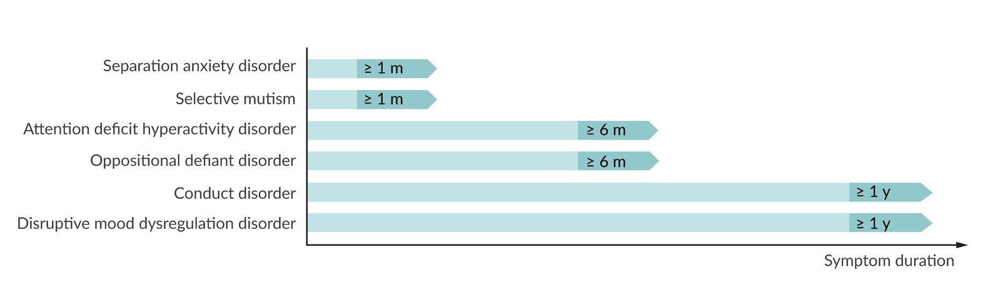

# Impulse and conduct disorders

*Categories: Clinical knowledge > Psychiatry > Childhood and neurodevelopmental disorders > Impulse and conduct disorders*

[Original Article Link](https://coursology-qbank.com/amboss/article/A50R5g)

---

## Summary

Impulse and conduct disorders (e.g., <u>oppositional defiant disorder</u>, <u>intermittent explosive disorder</u>, <u>conduct disorder</u>, <u>kleptomania</u>, <u>pyromania</u>) are a group of psychiatric conditions that affect the self-regulation of emotions and behaviors. Onset usually occurs in childhood, although some impulse and conduct disorders (e.g., <u>pyromania</u>) are unusual in children. The disturbance in behavior significantly impairs social, academic, and/or occupational functioning. Genetic, environmental (e.g., in utero exposure to toxins), psychological, and social (e.g., physical abuse, neglect) factors are thought to play a role in the development of impulse and conduct disorders. While <u>oppositional defiant disorder</u> (<u>ODD</u>) and <u>conduct disorder</u> both manifest with defiance and resistance to authority, individuals with <u>conduct disorder</u> are more likely than individuals with <u>ODD</u> to engage in criminal behavior. <u>ODD</u> often precedes <u>conduct disorder</u>. <u>Intermittent explosive disorder</u> manifests with outbursts of impulsive aggression (verbal or physical) that are unplanned and out of <u>proportion</u> to the circumstances. <u>Pyromania</u> (compulsive fire-setting) and <u>kleptomania</u> (compulsive stealing) are characterized by uncontrollable impulses and often result in property damage, harm to other individuals, and/or legal consequences. Diagnosis of impulse and conduct disorders is based on <u>DSM-5</u> criteria. Management involves treatment of comorbidities (e.g., <u>ADHD</u> and <u>depression</u>), <u>psychotherapy</u>, family and educational support (for pediatric patients), and, in severe or refractory cases, pharmacotherapy.

<u>Disruptive mood dysregulation disorder</u> (<u>DMDD</u>) also causes irritable behavior and angry outbursts in children. As <u>DMDD</u> is considered a <u>depressive disorder</u>, it is covered separately in the <u>depressive disorders</u> article.

---

## Overview

### Clinical features [[1]](https://coursology-qbank.com/amboss/article/muWV7M0)

* Onset usually occurs in childhood.   [[1]](https://coursology-qbank.com/amboss/article/muWV7M0)

* Argumentative, aggressive, or impulsive behavior; disproportionate anger

* Behaviors impact daily functioning.

* Not part of normal development (e.g., <u>temper tantrums</u>)

### Diagnostics [[2]](https://coursology-qbank.com/amboss/article/f6dk4I0)[[3]](https://coursology-qbank.com/amboss/article/T6d64I0)

* Assess for differential diagnoses.

* Consider using screening tools (e.g., Vanderbilt assessment scale) to identify impulse and conduct disorders.  [[2]](https://coursology-qbank.com/amboss/article/f6dk4I0)[[4]](https://coursology-qbank.com/amboss/article/OqdIAI0)

* Refer to a <u>psychiatrist</u>; diagnoses are based on <u>DSM-5</u> criteria.

### Differential diagnoses [[1]](https://coursology-qbank.com/amboss/article/muWV7M0)[[2]](https://coursology-qbank.com/amboss/article/f6dk4I0)

* <u>Attention deficit hyperactivity disorder</u>

* <u>Adjustment disorder</u>

* <u>Substance use disorder</u>

* <u>Posttraumatic stress disorder</u>

* <u>Neurodevelopmental disorders</u>

* <u>Depressive disorders</u>, including <u>DMDD</u> and <u>bipolar disorder</u>

* <u>Temper tantrums</u>

* Organic causes of <u>altered mental state</u>

> [!TIP]
> Some differential diagnoses (e.g., <u>ADHD</u>) may occur concurrently with impulse and conduct disorders; however, individuals with a diagnosis of <u>DMDD</u> cannot also be diagnosed with <u>ODD</u>, <u>intermittent explosive disorder</u>, or <u>bipolar disorder</u>. [[1]](https://coursology-qbank.com/amboss/article/muWV7M0)[[2]](https://coursology-qbank.com/amboss/article/f6dk4I0)

### Management of impulse and conduct disorders

Management is overseen by <u>psychiatry</u> and tailored to the specific disorder but usually includes:

* Treatment of comorbidities, e.g.:

* <u>Treatment of ADHD</u>

* <u>Treatment of depression</u>

* Psychosocial interventions, e.g.: [[5]](https://coursology-qbank.com/amboss/article/86dO5I0)

* <u>Psychotherapy</u> (e.g., <u>cognitive behavioral therapy</u>) [[3]](https://coursology-qbank.com/amboss/article/T6d64I0)

* For children: <u>family therapy</u> and/or support programs that involve the school   [[6]](https://coursology-qbank.com/amboss/article/tDdXTH0)

* Consideration of pharmacological treatment (e.g., <u>SSRIs</u>, <u>off-label</u> <u>risperidone</u>) if the condition is severe and/or refractory   [[2]](https://coursology-qbank.com/amboss/article/f6dk4I0)[[7]](https://coursology-qbank.com/amboss/article/g6dF4I0)[[8]](https://coursology-qbank.com/amboss/article/mDdVUH0)

### Overview of pediatric disorders of behavior regulation

|  Disruptive, impulse control, and conduct disorders in childhood [[1]](https://coursology-qbank.com/amboss/article/muWV7M0)  |  |  |  |
| --- | --- | --- | --- |
|  |  | Important findings | Prognosis |
| <u>Conduct disorder</u> |  |   * Severe rule violations (e.g., truancy)  * Aggression toward people, animals, and property  * Criminal behavior (e.g., theft, fire setting, <u>sexual assault</u>)  * Duration of symptoms: ≥ 12 months    |  * Increased risk of developing <u>antisocial personality disorder</u> in adulthood.   |
| <u>Oppositional defiant disorder</u> (<u>ODD</u>) |  |   * Argumentative, vindictive, and defiant behavior toward  authority figures (e.g., teachers, parents)  * Angry, irritable mood  * Duration of symptoms: ≥ 6 months    |  * Often precedes the onset of <u>conduct disorder</u>   |
| <u>Intermittent explosive disorder</u> |  |   * Sudden, aggressive outbursts (verbal or physical) grossly disproportionate to the triggering <u>stressor</u>, occurring either:  * ≥ 2 times/week for a period of 3 months without physical injury to humans or animals and no destruction of property or  * ≥ 3 times/year with physical injury to humans or animals and/or destruction of property  * Outbursts cause severe <u>distress</u> or result in financial and/or legal consequences.    |  * Increased risk of self-harm   |
| <u>Disruptive mood dysregulation disorder</u> (<u>DMDD</u>) |  |   * Severe outbursts of anger (verbal or behavioral) ≥ 3 times/week  * Severe, persistent irritability or anger in between outbursts  * Duration of symptoms: ≥ 12 months    |  * Increased risk of developing <u>major depressive disorder</u> or <u>anxiety disorders</u> in adulthood   |

> [!NOTE]
> With <u>ODD</u> they talk back, with CD they attack.” Individuals with <u>conduct disorder</u> are more likely that individuals with <u>ODD</u> to be physcially aggressive and engage in criminal behavior.

Symptom-duration criteria for diagnosis of psychiatric disorders with childhood onset

---

## Oppositional defiant disorder

<u>ODD</u> is characterized by anger, irritable mood, and defiance toward authority figures; behaviors significantly impair social and/or academic functioning.

### <u>Epidemiology</u> [[1]](https://coursology-qbank.com/amboss/article/muWV7M0)

* Onset is usually during late preschool or elementary school years.

* Before <u>puberty</u> <u>♂</u> > <u>♀</u>; after <u>puberty</u> <u>♂</u> = <u>♀</u>

* Frequent comorbidity of <u>ADHD</u> and/or <u>learning</u> disorders

### Etiology

<u>ODD</u> is associated with genetic, environmental, psychological, and social factors (e.g., abuse, <u>family history</u>, neglect, family instability).

### DSM-5 criteria for oppositional defiant disorder  [[1]](https://coursology-qbank.com/amboss/article/muWV7M0)

The following criteria must be met to diagnose <u>ODD</u>.

* ≥ 4 symptoms when interacting with ≥ 1 individual who is not a sibling

* Loses temper

* Easily annoyed

* Angry and/or resentful

* Argues with authority figures and/or adults

* Defies or refuses to follow rules

* Purposely irritates others

* Inappropriately assigns blame to others

* Spiteful (≥ 2 times within past 6 months)

* Symptoms must be present for ≥ 6 months.

* Children ≤ 5 years of age: occur on most days

* Children > 5 years of age: occur at least once a week

* Behaviors cause <u>distress</u> for the individual and/or others

* Behaviors are not attributable to an alternative diagnosis (e.g., substance use, <u>DMDD</u>).

### Management

See “<u>Management of impulse and conduct disorders</u>.”

### Prognosis [[1]](https://coursology-qbank.com/amboss/article/muWV7M0)

* <u>ODD</u> often precedes the onset of <u>conduct disorder</u>.

* Individuals are at increased risk of substance use, <u>anxiety disorders</u>, and <u>major depressive disorder</u>.

---

## Conduct disorder

<u>Conduct disorder</u> is characterized by disruptive behavior that interferes with the basic rights of others and/or age-appropriate social norms. [[1]](https://coursology-qbank.com/amboss/article/muWV7M0)

### <u>Epidemiology</u> [[1]](https://coursology-qbank.com/amboss/article/muWV7M0)

* Onset during childhood or <u>adolescence</u>

* <u>♂</u> > <u>♀</u>

> [!NOTE]
> “C and D come before E”: Conduct Disorder is usually diagnosed before eighteen years of age.

### Etiology

<u>Conduct disorder</u> is associated with genetic, environmental, psychological, and social factors (e.g., abuse, exposure to toxins, positive <u>family history</u>, neglect, family instability).

### DSM-5 criteria for conduct disorder  [[1]](https://coursology-qbank.com/amboss/article/muWV7M0)

The following criteria must be met to diagnose <u>conduct disorder</u>.

* ≥ 3 of any of the 15 criteria in the past 12 months and at least 1 of the 15 in the past 6 months

* Aggression toward people and animals

* Bullies, threatens, or intimidates

* Initiates fights

* Has used a lethal weapon (e.g., knife, bat, gun)

* Exhibits physically aggressive behavior toward individuals

* Demonstrates physically harmful behavior toward animals

* Has stolen with confrontation of a victim (e.g., mugging, armed robbery)

* Has exhibited <u>sexual violence</u>

* Destruction of property

* Set fire with destructive intentions

* Destroyed property deliberately, other than with fire

* Deceitfulness or theft

* Broke into a house, car, or building

* Lied for personal benefit

* Has stolen without confrontation of a victim (e.g., shoplifting, forgery)

* Serious rule violation

* Stayed out past curfew (before 13 years of age)

* Ran away from home twice, or once if for a prolonged period

* Has been frequently truant from school (beginning before 13 years of age)

* Impairment in functioning (e.g., at school, social settings)

* If > 18 years of age, the individual must not meet the criteria for <u>antisocial personality disorder</u>.

> [!TIP]
> Consider alternative diagnosis (e.g., <u>antisocial personality disorder</u>) in adult individuals with a new onset of aggressive and disruptive behavior. [[1]](https://coursology-qbank.com/amboss/article/muWV7M0)

### Management [[2]](https://coursology-qbank.com/amboss/article/f6dk4I0)

See “<u>Management of impulse and conduct disorders</u>.”

### Prognosis [[1]](https://coursology-qbank.com/amboss/article/muWV7M0)

* If behaviors significantly impact functioning in adulthood, evaluate for <u>antisocial personality disorder</u>.

* Individuals are at increased risk of <u>suicidal behaviors</u>.

---

## Intermittent explosive disorder

<u>Intermittent explosive disorder</u> is characterized by impulsive outbursts of aggression (verbal or physical) that are sporadic, unplanned, and disproportionate to the circumstances.

### <u>Epidemiology</u> [[1]](https://coursology-qbank.com/amboss/article/muWV7M0)

* <u>♂</u> > <u>♀</u>

* Age at onset: 14–17 years [[9]](https://coursology-qbank.com/amboss/article/-UXDfx)

* <u>Prevalence</u>: up to 7% of the general population [[10]](https://coursology-qbank.com/amboss/article/Z2XZTx)

> [!TIP]
> Onset of <u>intermittent explosive disorder</u> is rare after the age of 40 years. [[1]](https://coursology-qbank.com/amboss/article/muWV7M0)

### Etiology

<u>Intermittent explosive disorder</u> is associated with genetic, neurobiological, inflammatory, infectious (e.g., <u>Toxoplasma gondii</u>), psychological, and social factors (e.g., history of abuse).

### DSM-5 criteria for intermittent explosive disorder [[1]](https://coursology-qbank.com/amboss/article/muWV7M0)

The following criteria must be met to diagnose <u>intermittent explosive disorder</u>.

* Recurrent impulsive outbursts manifested as one of the following:

* Verbal or physical aggression, not resulting in injury or damage, on average ≥ 2 times per week for a period of > 3 months

* ≥ 3 episodes of physical violence toward other people, animals, or property over a period of 12 months

* Outburst features

* Impulsive, unplanned, and not committed for an ultimate motive

* Aggression disproportionate to the situation

* Cause significant <u>distress</u>, negatively impact the individual's interpersonal functioning, and/or result in legal or financial consequences

* Onset occurs at ≥ 6 years of age (or equivalent developmental level).

* Symptoms cannot be attributed to:

* Another mental disorder (e.g., <u>DMDD</u>, <u>adjustment disorder</u>)

* Medical condition (e.g., <u>traumatic brain injury</u>)

* Substance use

> [!TIP]
> Emotional outbursts typically last < 30 minutes, and feelings of remorse, regret, or embarrassment after an outburst may occur. [[1]](https://coursology-qbank.com/amboss/article/muWV7M0)[[11]](https://coursology-qbank.com/amboss/article/TId6Xr0)

### Management

See “<u>Management of impulse and conduct disorders</u>.”

### Prognosis [[1]](https://coursology-qbank.com/amboss/article/muWV7M0)

Self-harm may occur and aggression may continue throughout the patient's life.

---

## Other impulse and conduct disorders

### Pyromania

* Individuals cannot control the impulse to set fires, resulting in multiple episodes of intentional fire setting.

* Individuals experience internal tension before setting a fire and relief after starting or witnessing a fire.

* The fire setting is not aimed at <u>secondary gains</u> such as money, not driven by sociopolitical factors, not an expression of anger or vengeance, and not a response to a <u>delusion</u> or <u>hallucination</u>.

* Management includes treatment of comorbid disorders (e.g., <u>substance use disorder</u>) and <u>CBT</u>. [[12]](https://coursology-qbank.com/amboss/article/NDd-eH0)

> [!TIP]
> Onset of <u>pyromania</u> in children is rare; children or <u>adolescents</u> who start fires are more likely to have other psychiatric disorders (e.g., <u>conduct disorder</u>, <u>ADHD</u>). [[1]](https://coursology-qbank.com/amboss/article/muWV7M0)

### Kleptomania

* Individuals cannot control the impulse to steal objects that are not needed for personal use or for their monetary value.

* Individuals experience internal tension before stealing and relief at the time of committing theft.

* The stealing is not motivated by anger or vengeance and is not in response to a <u>delusion</u> or <u>hallucination</u>.

* Treatment usually involves therapy (e.g., <u>CBT</u>); ; <u>naltrexone</u> may be considered in some patients. [[13]](https://coursology-qbank.com/amboss/article/lDdveH0)

---