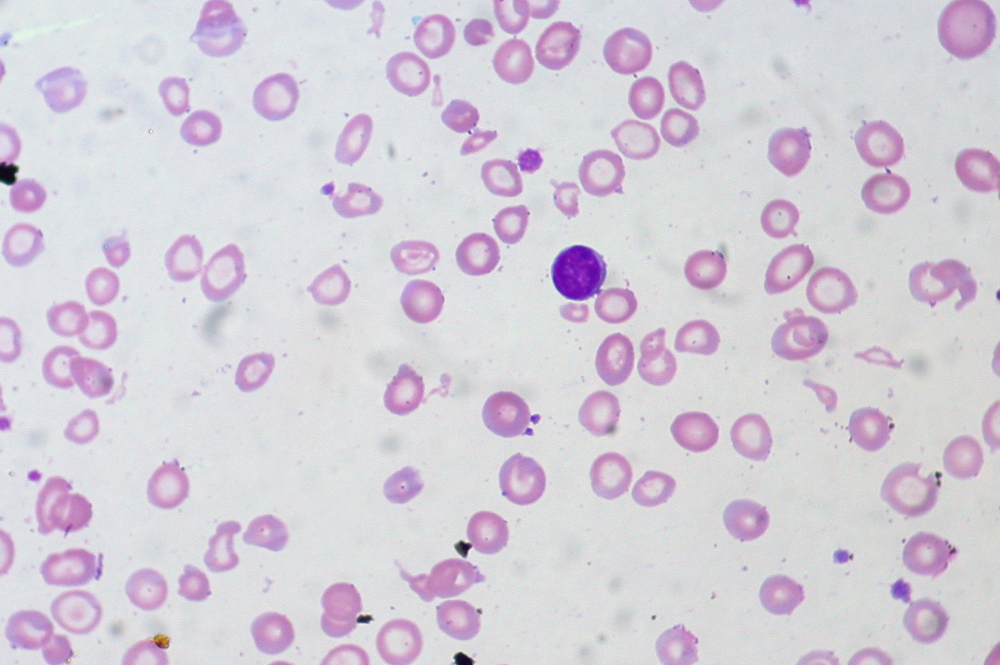
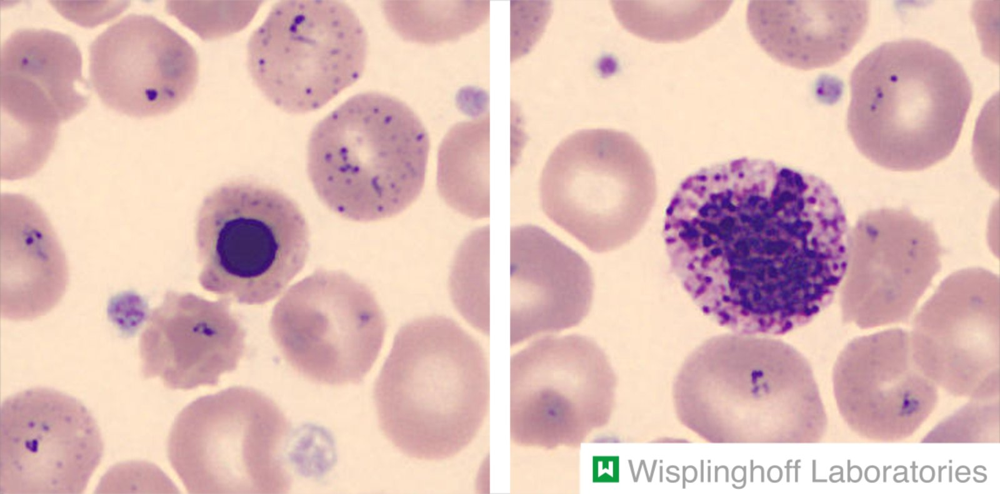
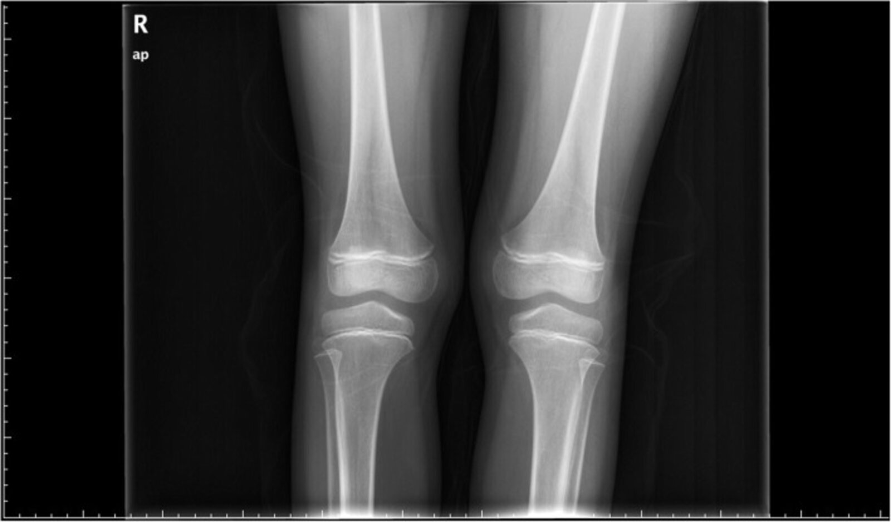

# Pica

*Categories: Clinical knowledge > Psychiatry > Eating disorders > Pica*

[Original Article Link](https://coursology-qbank.com/amboss/article/wt0hf3)

---

## Summary

Pica is an <u>eating disorder</u> characterized by the persistent ingestion of nonnutritive nonfood substances. Causes are multifactorial and include nutritional deficiencies, <u>pregnancy</u>, and developmental disorders. Diagnostic workup depends on the substance consumed but usually involves <u>evaluation for anemia</u> as an underlying cause and screening for associated complications (e.g., <u>lead toxicity</u>, GI complications, parasitic infections). Management involves addressing any underlying causes and/or nutritional deficiencies followed by behavioral interventions (e.g., <u>positive reinforcement</u>). <u>Selective serotonin reuptake inhibitors</u> (<u>SSRIs</u>) may be considered in patients with pica refractory to initial management.

---

## Epidemiology

* <u>Prevalence</u>: highest in children ≤ 6 years of age, during <u>pregnancy</u>, and in individuals with certain psychiatric comorbidities (see “<u>Etiology of pica</u>”) [[2]](https://coursology-qbank.com/amboss/article/xn1Evh0)

* Sex

* Children:  <u>♂</u> > <u>♀</u> [[2]](https://coursology-qbank.com/amboss/article/xn1Evh0)

* Adults: <u>♀</u> > <u>♂</u> [[3]](https://coursology-qbank.com/amboss/article/2_1Tnj0)

Epidemiological data refers to the US, unless otherwise specified.

---

## Etiology

The etiology is not entirely understood. Pica is associated with: [[2]](https://coursology-qbank.com/amboss/article/xn1Evh0)[[4]](https://coursology-qbank.com/amboss/article/yn1dDh0)

* Nutritional deficiencies (<u>iron deficiency</u>, <u>zinc deficiency</u>)

* <u>Pregnancy</u>  [[5]](https://coursology-qbank.com/amboss/article/n_17Kj0)

* Low <u>socioeconomic status</u>

* Psychosocial trauma (e.g., due to maternal deprivation, <u>child neglect</u>):

* Intellectual developmental disorder

* <u>Autism spectrum disorder</u>

* <u>Dementia</u>

* <u>Schizophrenia</u>

* <u>Attention-deficit hyperactivity disorder</u>

---

## Diagnosis

### Approach [[4]](https://coursology-qbank.com/amboss/article/yn1dDh0)

* Assess patients using the <u>DSM-5 diagnostic criteria for pica</u>.

* For patients who meet the criteria:

* Evaluate for <u>anemia</u>.

* Request a <u>pregnancy test</u> for patients of childbearing age.

* Workup for <u>complications of pica</u> (e.g., <u>bezoar</u>, <u>bowel obstruction</u>).

* Consider screening for <u>parasites</u> and/or heavy metals depending on the ingested substance.

* For children with pica, consider assessment for <u>neurodevelopmental disorders</u>.

### Diagnostic criteria

|  |  DSM-5 diagnostic criteria for pica [[4]](https://coursology-qbank.com/amboss/article/yn1dDh0)[[6]](https://coursology-qbank.com/amboss/article/Nta-dm)  |
| --- | --- |
| Definition |  * Persistent ingestion of nonnutritive nonfood substances (e.g., <u>hair</u>, clay, soil, ice, paint chips)   |
| Duration |  * Present for > 1 month   |
| Additional features |   * Inappropriate for developmental age  * Not part of culturally or socially normative practice  * If another medical or psychiatric condition is present, the pica behavior warrants specific clinical management.    |
| All criteria must be fulfilled. |  |

### <u>Laboratory studies</u> [[2]](https://coursology-qbank.com/amboss/article/xn1Evh0)[[4]](https://coursology-qbank.com/amboss/article/yn1dDh0)

* <u>Diagnostic studies for anemia</u>, e.g.:  [[2]](https://coursology-qbank.com/amboss/article/xn1Evh0)

* <u>CBC with differential</u>: May also reveal <u>eosinophilia</u>, suggestive of a parasitic infection (see “<u>Complications of pica</u>”)

* <u>Peripheral smear</u>

* <u>Hypochromic</u>, <u>microcytic anemia</u> may be caused by <u>iron deficiency</u> or <u>lead toxicity</u>

* <u>Basophilic stippling</u> suggests <u>lead toxicity</u>  [[2]](https://coursology-qbank.com/amboss/article/xn1Evh0)

* <u>Iron studies</u>

* <u>Pregnancy test</u> for patients of childbearing age

* Consider the following based on the ingested substance:

* Blood lead level

* <u>Toxocara</u> <u>serology</u>

* Stool <u>ova</u> and <u>parasites</u>

* <u>Blood gas</u> if acid-base abnormalities are suspected  [[2]](https://coursology-qbank.com/amboss/article/xn1Evh0)

Iron deficiency anemia

Basophilic stippling of erythrocytes

### Imaging

* Suspected <u>bezoar</u> or obstruction [[2]](https://coursology-qbank.com/amboss/article/xn1Evh0)[[4]](https://coursology-qbank.com/amboss/article/yn1dDh0)

* CT abdomen and/or abdominal <u>ultrasound</u>

* See also “<u>Diagnostics of bowel obstruction</u>.”

* Suspected lead ingestion

* <u>X-ray abdomen</u> to assess for paint chips and/or <u>retained foreign bodies</u> in the <u>GI tract</u> [[7]](https://coursology-qbank.com/amboss/article/h_1cLj0)

* <u>X-ray</u> <u>long bones</u> to assess for <u>lead lines</u>  [[2]](https://coursology-qbank.com/amboss/article/xn1Evh0)

Lead poisoning

---

## Management

### Approach [[2]](https://coursology-qbank.com/amboss/article/xn1Evh0)[[4]](https://coursology-qbank.com/amboss/article/yn1dDh0)

* Management involves a multidisciplinary team (e.g., physicians, dietitians, social workers, dentists).

* Screen for <u>red flags for eating disorders</u> and, if present, admit for inpatient management.

* Address any underlying causes, e.g.:

* <u>Micronutrient</u> or <u>electrolyte</u> abnormalities: See “<u>Iron therapy for iron deficiency anemia</u>” and “<u>Electrolyte repletion</u>.”

* Mental health disorders: See “<u>Treatment of ADHD</u>” and “<u>Treatment of schizophrenia</u>.”

* Treat associated <u>complications of pica</u> (e.g., treatment of <u>malnutrition</u>, <u>lead poisoning</u>, <u>bowel obstruction</u>).

* Educate patients and caregivers on the condition and potential complications.

* Start behavioral interventions.

* For patients with refractory symptoms, <u>SSRIs</u> may be considered.

### Behavioral interventions [[2]](https://coursology-qbank.com/amboss/article/xn1Evh0)[[4]](https://coursology-qbank.com/amboss/article/yn1dDh0)

* Suggest substitutions (e.g., replacing sand and pebbles with Grape Nuts). [[8]](https://coursology-qbank.com/amboss/article/o_106j0)

* Educate caregivers to:

* Help children to distinguish between edible and nonedible substances.

* Use behavioral strategies (e.g. <u>positive reinforcement</u>, time-out).

* Referral for <u>behavioral therapy</u> or <u>psychotherapy</u> may be necessary, especially for patients with <u>intellectual disabilities</u>.

> [!TIP]
> Pica in <u>pregnancy</u> and young children is typically <u>self-limited</u>. [[4]](https://coursology-qbank.com/amboss/article/yn1dDh0)

---

## Complications

* Poor <u>nutritional status</u> [[2]](https://coursology-qbank.com/amboss/article/xn1Evh0)

* <u>Protein-energy malnutrition</u>

* <u>Iron deficiency anemia</u>  [[2]](https://coursology-qbank.com/amboss/article/xn1Evh0)

* <u>Hyperphosphatemia</u>

* <u>Zinc deficiency</u>

* <u>Hyperkalemia</u>

* <u>Hypokalemia</u>

* <u>Heavy metal poisoning</u> [[2]](https://coursology-qbank.com/amboss/article/xn1Evh0)

* <u>Lead poisoning</u>, e.g., from paint ingestion (most common)

* <u>Mercury poisoning</u>

* <u>Arsenic poisoning</u>

* GI complications [[4]](https://coursology-qbank.com/amboss/article/yn1dDh0)

* <u>Constipation</u>

* <u>Ulceration</u> from consumption of corrosive substances

* <u>Bowel obstruction</u> from the consumption of indigestible objects (which may form a <u>bezoar</u>)

* <u>Bowel perforation</u> from the <u>ingestion of sharp objects</u>

* Bacterial or parasitic infections from the ingestion of contaminated dirt or food, e.g.: [[2]](https://coursology-qbank.com/amboss/article/xn1Evh0)

* <u>Toxocariasis</u>

* <u>Ascariasis</u>

* <u>Toxoplasmosis</u>

* <u>Cysticercosis</u>

* Dental complications: from mechanical damage to <u>teeth</u> [[4]](https://coursology-qbank.com/amboss/article/yn1dDh0)

* <u>Electrolyte</u> and/or acid-base abnormalities: for example, <u>metabolic alkalosis</u> from the ingestion of baking soda [[2]](https://coursology-qbank.com/amboss/article/xn1Evh0)

We list the most important complications. The selection is not exhaustive.

---