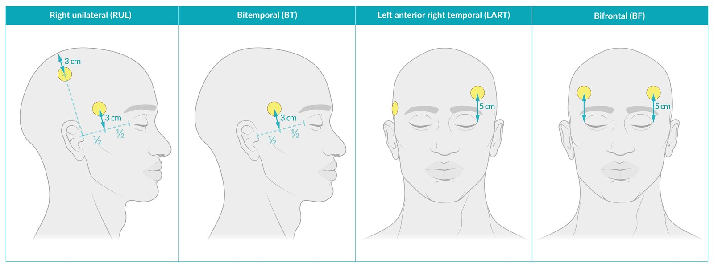

# Electroconvulsive therapy

*Categories: Clinical knowledge > Psychiatry > Mood disorders > Electroconvulsive therapy*

[Original Article Link](https://coursology-qbank.com/amboss/article/wM0hIg)

---

## Summary

Electroconvulsive therapy (ECT) involves unilateral (sometimes bilateral) electrode placement over the nondominant hemisphere to induce <u>tonic-clonic</u> <u>seizures</u> under sedation. Although not fully understood, ECT likely causes <u>anticonvulsant</u> effects, <u>brain</u> remodeling, and improves <u>brain</u> <u>perfusion</u>. ECT is indicated for refractory cases, life-threatening symptoms (e.g., <u>suicide</u> risk), or special patient groups (e.g., pregnant patients) with certain mental disorders; including <u>depression</u>, <u>schizoaffective disorder</u>, and bipolar <u>mood disorder</u>. Complications include reversible <u>memory</u> loss, <u>tension headaches</u>, and transient muscle <u>pain</u>.

---

## Indications

Usually indicated in the following conditions for refractory cases, cases in which a fast <u>antidepressant</u> effect is needed, when there are life-threatening symptoms;  (e.g., severe <u>suicidality</u>, <u>malnutrition</u> due to food refusal, severe <u>psychosis</u>), or if medication is contraindicated (e.g., <u>pregnancy</u>): [[1]](https://coursology-qbank.com/amboss/article/SwayR5)

* <u>Depression</u> (most common)

* <u>MDD with psychotic features</u>

* <u>Schizoaffective disorder</u>

* <u>Schizophrenia</u> with <u>catatonia</u>

* Bipolar <u>mood disorder</u> (e.g., <u>manic episodes</u>)

* Highly suicidal or pregnant depressed patients (not usually first-line)

* <u>Neuroleptic malignant syndrome</u>

> [!TIP]
> ECT is the most effective treatment for severe <u>major depressive disorder</u>.

---

## Contraindications

* No <u>absolute contraindications</u>.

* <u>Relative contraindications</u> include:

* <u>Elevated intracranial pressure</u> and space-occupying lesions in the <u>brain</u>

* Recent <u>myocardial infarction</u> (within the last 3 months)

* Severe <u>arterial hypertension</u>

* Narcotic intolerance

* Acute <u>glaucoma</u>

* Changes in the cerebral <u>arteries</u>, e.g., <u>aneurysm</u>, angioma

> [!TIP]
> <u>Pregnancy</u> and pacemakers are not a contraindication for ECT.

We list the most important contraindications. The selection is not exhaustive.

---

## Technique/steps

* General preparation and procedure [[2]](https://coursology-qbank.com/amboss/article/eSYxAo)

* Unilateral electrode placement over the nondominant hemisphere

* <u>EEG</u> as well as constriction of the <u>contralateral</u> arm and ankle via blood pressure cuff  for monitoring the <u>seizure</u>

* Administration of oxygen via face mask and preparation for emergency <u>intubation</u> if necessary

* <u>ECG</u> and <u>pulse oximetry</u> allow for monitoring further <u>vital signs</u>.

* Administration of premedications:
1. * <u>Anticholinergic</u> (e.g., <u>atropine</u>) to reduce <u>cardiac dysrhythmias</u> and oral/respiratory secretions [[3]](https://coursology-qbank.com/amboss/article/Rwali5)
2. * A mild sedative and hypnotic (e.g., <u>methohexital</u>) to relieve anticipatory <u>anxiety</u> [[4]](https://coursology-qbank.com/amboss/article/iwaJi5)

* Short-term general anesthesia, including a <u>muscle relaxant</u> (e.g., <u>succinylcholine</u>) to avoid risk of <u>fractures</u>

* An <u>electric current</u> is passed from one side of the <u>cerebral cortex</u> to the other.

* 6–12 sessions in total;   consisting of generalized <u>tonic-clonic</u> <u>convulsions</u> that last 25–30 seconds, usually 2–3 times per week

* Treatment sessions can be discontinued once symptoms improve.

* Maintenance may be implemented once every 1–8 weeks.

Electroconvulsive therapy (ECT) electrode placement options

---

## Side effects

* More common [[2]](https://coursology-qbank.com/amboss/article/eSYxAo)

* Reversible <u>memory</u> loss: retrograde more often than <u>anterograde amnesia</u> (typically resolves within 6 months of last treatment)

* <u>Tension-type headache</u>

* <u>Nausea</u>

* Transient muscle <u>pain</u>

* <u>Disorientation</u>

* Less common

* <u>Skin</u> <u>burns</u>

* Temporary, short-term functional disorders (such as amnesic <u>aphasia</u>)

* Prolonged <u>seizure</u>

---

## Prognosis

* ECT itself is generally considered a safe procedure in all patients (including pregnant women and elderly individuals).

* The risk of mortality (due to cardiac or pulmonary compromise) is associated with anesthesia.

* If properly conducted, ECT is one of the safest procedures involving sedation.

* To date, no <u>brain damage</u> has been reported with the current method. [[5]](https://coursology-qbank.com/amboss/article/uwapk5)

---