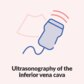
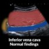
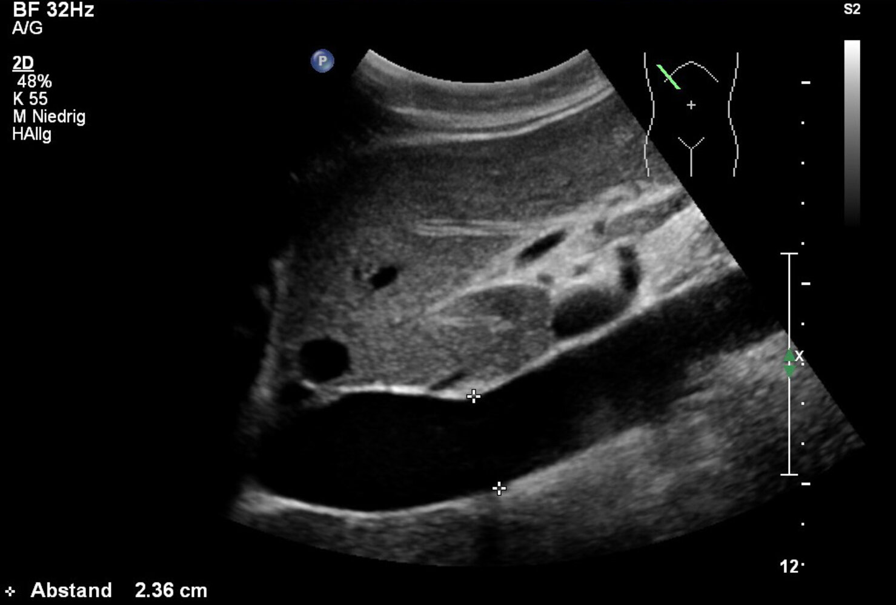

# Point-of-care ultrasound

*Categories: Clinical knowledge > Radiology > Point-of-care ultrasound*

[Original Article Link](https://coursology-qbank.com/amboss/article/S70yOh)

---

## Summary

Point-of-care <u>ultrasound</u> (POCUS) is a bedside imaging protocol performed by clinicians as an extension of the <u>physical examination</u>. It is valuable in the emergency department (ED) due to its noninvasive nature, rapid deployment, and ability to be performed at the bedside, thereby not interrupting urgent care. It helps narrow differential diagnoses and guide urgent management by providing real-time imaging that correlates with clinical features. Unlike <u>formal ultrasound</u>, POCUS is focused on limited areas and objectives based on the most likely diagnosis. Foundational knowledge of <u>ultrasound</u> transducers, image generation, and <u>acoustic windows</u> is essential for performing POCUS. Common clinical applications include <u>FAST and eFAST</u> to detect <u>intraperitoneal</u> or <u>pericardial</u> free fluid and <u>pneumothorax</u>, abdominal aortic <u>ultrasound</u> to detect <u>aneurysms</u>, <u>IVC ultrasound</u> to help assess <u>volume status</u>, <u>biliary POCUS</u> to detect <u>cholelithiasis</u> and <u>acute cholecystitis</u>, and <u>POCUS for early pregnancy</u> to detect <u>intrauterine pregnancy</u> and perform an emergency fetal assessment. Specific protocols for <u>heart</u> and <u>lung POCUS</u> include <u>focused cardiac ultrasound</u> (<u>FoCUS</u>) to rapidly assess cardiac structure and function and basic <u>lung</u> <u>ultrasound</u> in emergency (BLUE) to rapidly diagnose common <u>causes of dyspnea</u>. POCUS is also commonly used for bedside evaluation of suspected <u>deep vein thrombosis</u>. Other uses of POCUS include genitourinary, bowel, <u>soft tissue</u>, and ocular evaluation. Negative or inconclusive POCUS findings cannot definitively rule out a diagnosis as results are operator-dependent.

See “<u>Ultrasound</u>” for more information on fundamental concepts applied to broader <u>sonographic</u> modalities, e.g., <u>formal ultrasound</u>, <u>endoscopic ultrasound</u>, and <u>contrast-enhanced ultrasound</u>.

---

## Inferior vena cava

POCUS of the subcostal <u>IVC</u> is widely used as part of the assessment of <u>volume status</u> and prediction of <u>fluid responsiveness</u>, however, its <u>accuracy</u> and utility remain unclear.  [[23]](https://coursology-qbank.com/amboss/article/zjcr1c0)[[24]](https://coursology-qbank.com/amboss/article/-jcD1c0)[[25]](https://coursology-qbank.com/amboss/article/ZPcZWc0)[[26]](https://coursology-qbank.com/amboss/article/0PceWc0)

### Clinical applications [[17]](https://coursology-qbank.com/amboss/article/RtblWv)[[25]](https://coursology-qbank.com/amboss/article/ZPcZWc0)[[27]](https://coursology-qbank.com/amboss/article/ZhXZcB)

* Part of the multimodal assessment of <u>intravascular</u> <u>volume status</u> in patients with suspected <u>hypovolemia</u> (e.g., <u>shock</u>, <u>dehydration</u>), <u>hypervolemia</u> (i.e., <u>fluid overload</u>), or <u>congestive heart failure</u>  [[23]](https://coursology-qbank.com/amboss/article/zjcr1c0)

* Estimation of <u>fluid responsiveness</u> in patients requiring <u>fluid resuscitation</u> (e.g., after a <u>fluid challenge</u> or <u>passive leg raise test</u>)  [[24]](https://coursology-qbank.com/amboss/article/-jcD1c0)[[25]](https://coursology-qbank.com/amboss/article/ZPcZWc0)[[28]](https://coursology-qbank.com/amboss/article/CGXqY-)[[29]](https://coursology-qbank.com/amboss/article/ahXQcB)[[30]](https://coursology-qbank.com/amboss/article/YPcnWc0)

* Noninvasive estimation of <u>central venous pressure</u> (<u>CVP</u>) in spontaneously breathing patients (e.g., to guide fluid management in critically ill patients)  [[29]](https://coursology-qbank.com/amboss/article/ahXQcB)[[31]](https://coursology-qbank.com/amboss/article/WhcP1X0)

> [!WARNING]
> Interpret <u>IVC ultrasound</u> alongside other diagnostic and <u>clinical parameters of volume status</u>. Avoid using it in isolation to predict <u>fluid responsiveness</u>.

### Technique [[4]](https://coursology-qbank.com/amboss/article/CUcq2b0)[[17]](https://coursology-qbank.com/amboss/article/RtblWv)[[32]](https://coursology-qbank.com/amboss/article/nEY7wI)

Point of Care Ultrasound of the Inferior Vena Cava (IVC) - AMBOSS Video

#### Initial steps

* Patient position: <u>supine</u>

* Preferred transducer: curvilinear

* <u>Ultrasound</u> preset: abdomen

* <u>Acoustic window</u>: <u>liver</u>

#### Identifying the area of interest

The area of interest is the intrahepatic <u>IVC</u> as it flows into the <u>RA</u>.

* Suggested starting point

* Start in the <u>transverse plane</u> (indicator pointing toward the patient's right).

* Place the transducer in the subxiphoid region at the patient's midline.

* Press down firmly but gently until the area of interest is in view: i.e., the intraabdominal vessels can be seen <u>anterior</u> to the <u>hyperechoic</u> <u>vertebral body</u> and its <u>acoustic shadow</u>.

* Adjust depth so that the <u>hyperechoic</u> <u>vertebral bodies</u> are visible at the bottom of the monitor.

* <u>Distinguish the IVC from the aorta using POCUS</u> and center it in the image.

* While keeping the <u>IVC</u> centered, rotate the transducer 90° clockwise (with the indicator now pointing cranially) to view the <u>IVC</u> in the <u>sagittal plane</u>.

* Alternative starting point

* Start in the <u>sagittal plane</u> (indicator pointing toward the patient's head).

* Place the transducer in the subxiphoid region at the patient's midline.

* Slide and/or angle the transducer toward the patient's right side until the <u>IVC</u> is at the center of the image, taking care to <u>distinguish the IVC from the aorta using POCUS</u>.

* Common <u>endpoint</u>

* Once the <u>IVC</u> is visible in the <u>sagittal plane</u>, rock the transducer cranially until the <u>IVC</u>-<u>RA</u> junction can be seen on the indicator side of the screen.

* Slide and/or angle the transducer to capture the <u>IVC</u> in the longitudinal section where it appears widest (i.e., the midline of the vessel).

#### Measurements

* If possible, follow the <u>IVC</u> in a cephalad direction to visualize the site at which it drains into the <u>RA</u> and the <u>liver</u> <u>veins</u>.

* Measure the <u>IVC</u> diameter at peak inspiration and expiration, ideally at either of the following sites: 

* Just <u>distal</u> to the <u>IVC</u>-<u>RA</u> junction

* 2 cm <u>caudal</u> to the <u>IVC</u>-<u>hepatic vein</u> junction

#### Troubleshooting

* Consider rewinding the image after hitting “Freeze” to select images with both the widest and narrowest diameter of the <u>IVC</u> during the respiratory cycle.

* If visualization of the <u>IVC</u> is difficult, e.g., because of interposed bowel gas, consider obtaining <u>lateral</u> views.

* Turn the patient in the left <u>lateral decubitus position</u>.

* Place the transducer at the right <u>midaxillary line</u> and visualize the <u>IVC</u> through the <u>liver</u>.

* Consider switching to <u>M-mode</u>, as this may help to obtain precise measurements.

#### Findings  [[27]](https://coursology-qbank.com/amboss/article/ZhXZcB)[[29]](https://coursology-qbank.com/amboss/article/ahXQcB)[[33]](https://coursology-qbank.com/amboss/article/aibQJt)

* Normal maximal <u>IVC</u> diameter: ∼ 1.5–2.5 cm  [[17]](https://coursology-qbank.com/amboss/article/RtblWv)[[34]](https://coursology-qbank.com/amboss/article/e2cxgb0)

* <u>IVC</u> diameter variation (caval index): percentage of change in <u>IVC</u> diameter over the respiratory cycle

* For spontaneously breathing patients : IVC collapsibility index (IVCc) = ([maximal venous diameter during expiration - minimal venous diameter during inspiration]/maximal vessel diameter) × 100%  [[27]](https://coursology-qbank.com/amboss/article/ZhXZcB)[[35]](https://coursology-qbank.com/amboss/article/uOXp8y)

* For mechanically-ventilated patients : <u>IVC</u> distensibility index (IVCd) = ([maximal venous diameter during inspiration - minimal venous diameter during expiration]/minimal venous diameter during expiration) × 100% [[36]](https://coursology-qbank.com/amboss/article/AjcR1c0)

* Conditions that limit the reliability of caval indices to predict <u>fluid responsiveness</u> include: [[17]](https://coursology-qbank.com/amboss/article/RtblWv)[[37]](https://coursology-qbank.com/amboss/article/aPcQWc0)

* Reduced <u>venous return</u>

* Increased intrathoracic pressure: e.g., <u>dynamic hyperinflation</u>, <u>obstructive lung disease</u>, <u>mechanical ventilation</u> with high <u>PEEP</u>

* Cardiac dysfunction: e.g., chronic <u>right heart failure</u>, <u>cardiac tamponade</u>, right-sided <u>MI</u>, <u>tricuspid valve regurgitation</u>

* Unpredictable respiratory pattern: e.g., variation in patient respiratory effort, use of mixed <u>ventilator modes</u>

* Others: increased <u>intraabdominal pressure</u>, vascular disease involving the <u>IVC</u> (e.g., stenosis, <u>thrombosis</u>, external obstruction)

|  Interpretation of <u>IVC ultrasound</u> to estimate <u>volume status</u> [[17]](https://coursology-qbank.com/amboss/article/RtblWv)[[34]](https://coursology-qbank.com/amboss/article/e2cxgb0)  |  |  |
| --- | --- | --- |
| Parameter |  Findings suggestive of:   |  |
| <u>Volume overload</u> | <u>Volume depletion</u> |  |
| Maximal <u>IVC</u> diameter |  * > 2–2.5 cm   |  * < 1.5–2 cm   |
|  <u>IVC</u> diameter variation [[26]](https://coursology-qbank.com/amboss/article/0PceWc0)[[27]](https://coursology-qbank.com/amboss/article/ZhXZcB)[[35]](https://coursology-qbank.com/amboss/article/uOXp8y)[[36]](https://coursology-qbank.com/amboss/article/AjcR1c0)  |  * Low   |  * High   |

> [!TIP]
> The absence of <u>IVC</u> diameter variability on respiration is suggestive of elevated <u>central venous pressure</u> (e.g., due to <u>volume overload</u> or <u>right heart failure</u>), while total <u>IVC</u> collapse suggests <u>volume depletion</u>. [[6]](https://coursology-qbank.com/amboss/article/B1czQY0)[[32]](https://coursology-qbank.com/amboss/article/nEY7wI)

> [!WARNING]
> Ensure <u>IVC</u> measurements are taken in the midline of the vessel to avoid underestimating the diameter.

AMBOSS POCUS series | Inferior vena cava: normal findings

Dilated inferior vena cava

### Further management

Management of patients with <u>volume overload</u> or depletion is based on the underlying etiology.

* See “<u>Management of acute heart failure</u>.”

* See “<u>Immediate hemodynamic support</u>.”

* See “<u>Strategies for parenteral fluid therapy</u>.”

* See “<u>Initial fluids for dehydration and hypovolemia</u>.”

---