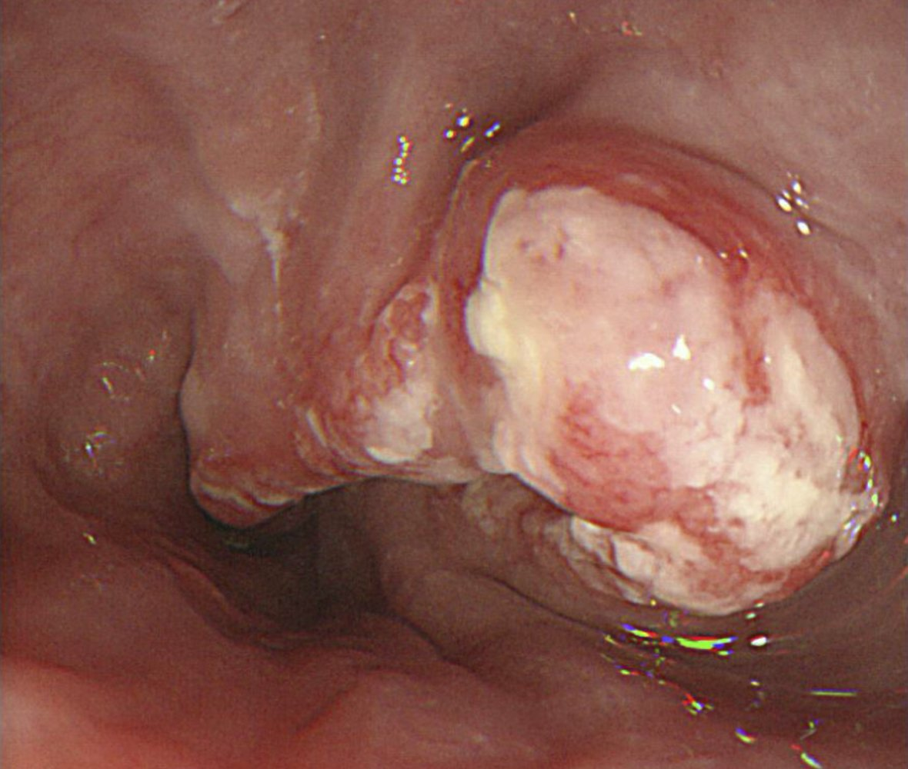
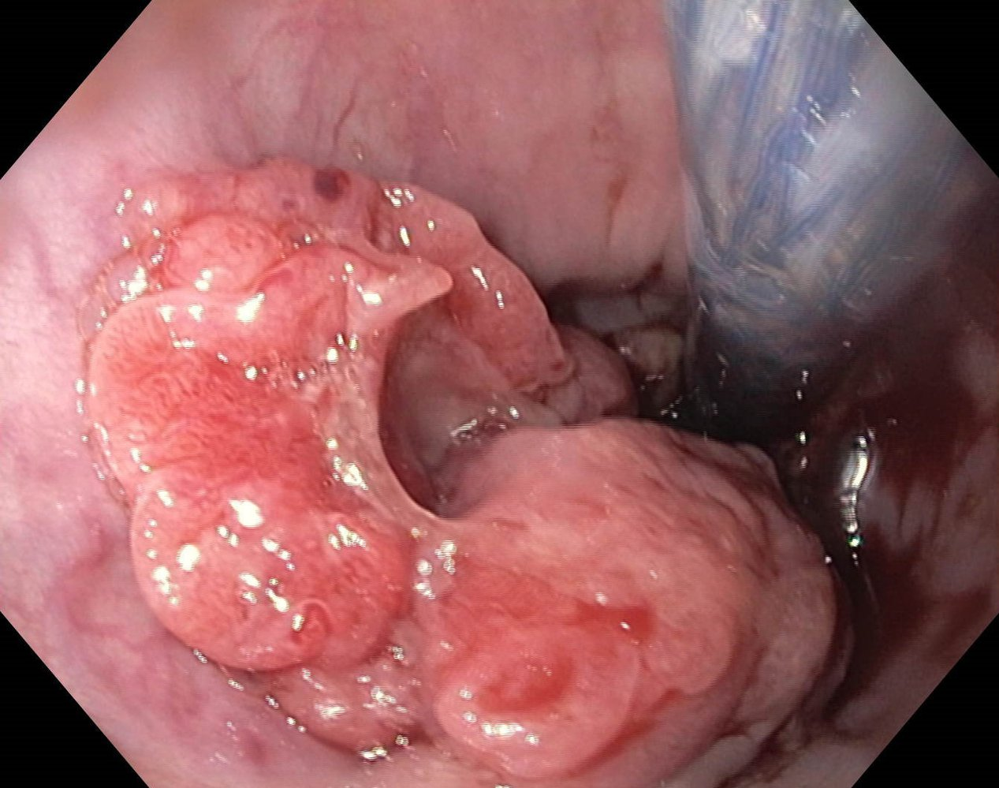
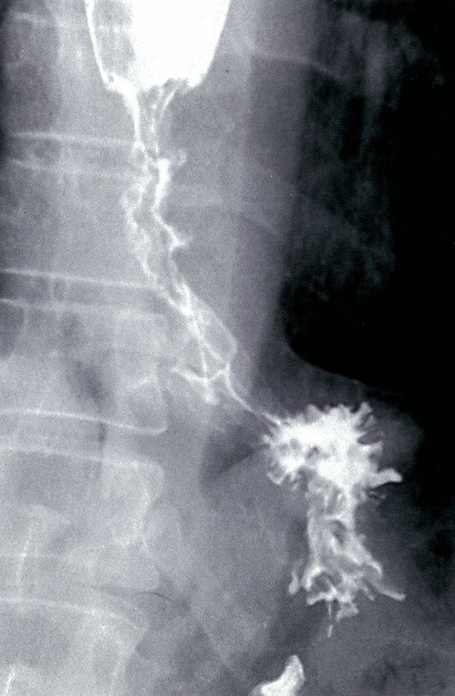
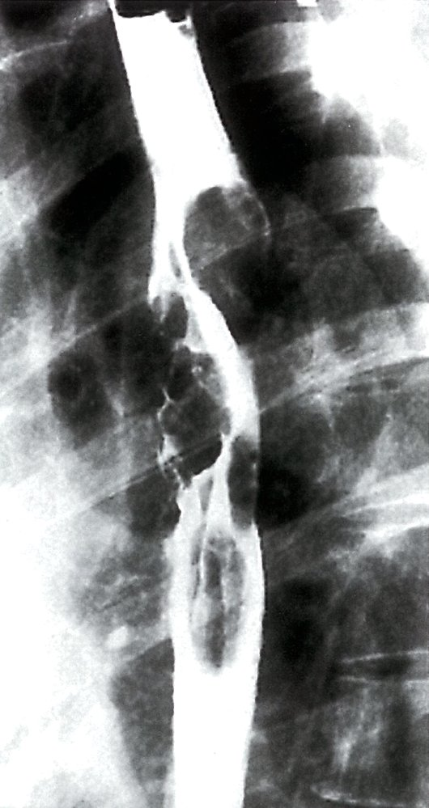
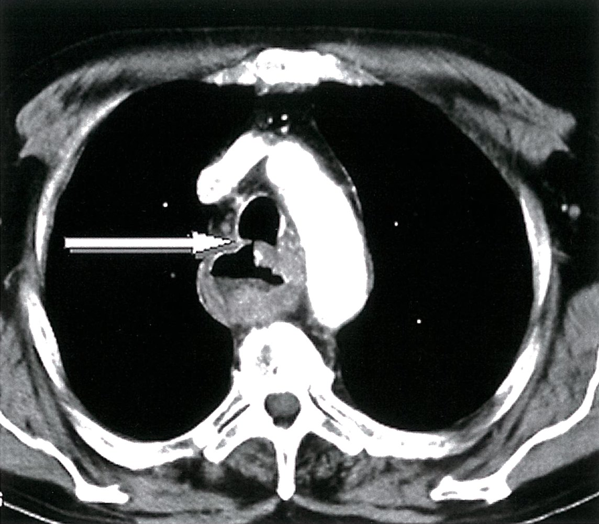
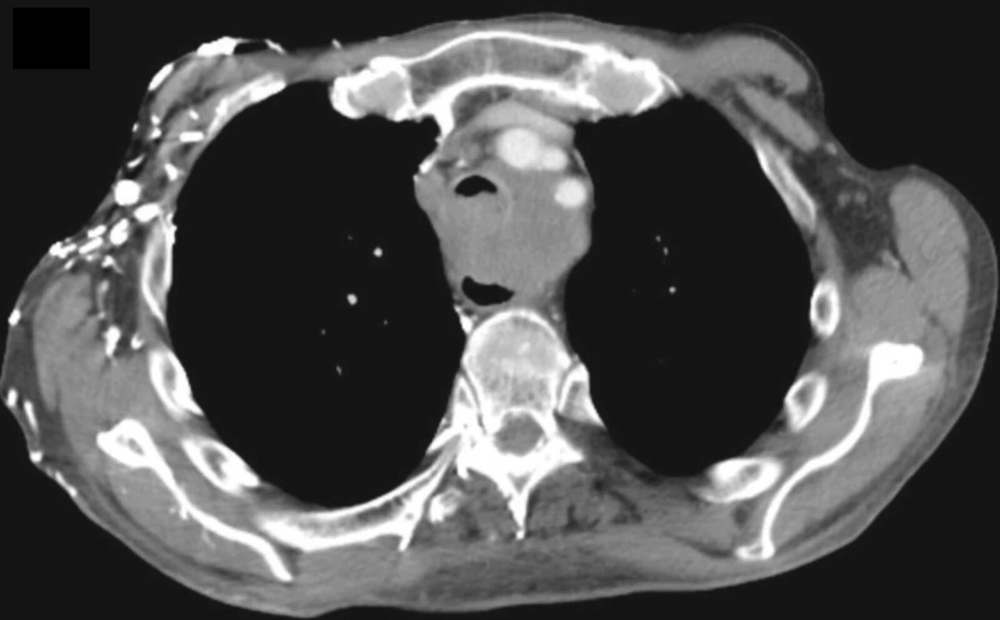
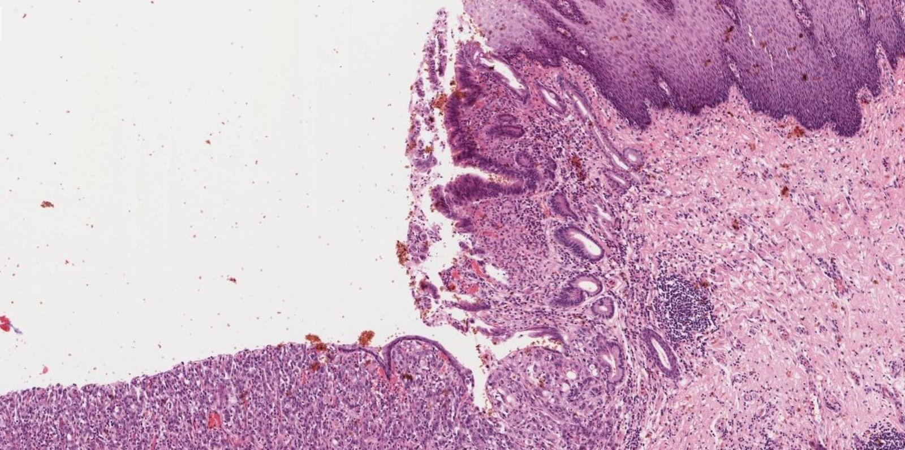
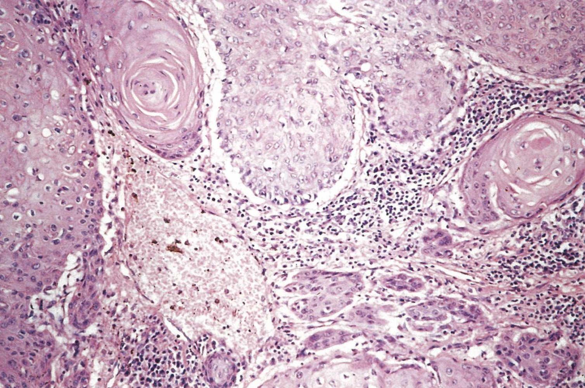
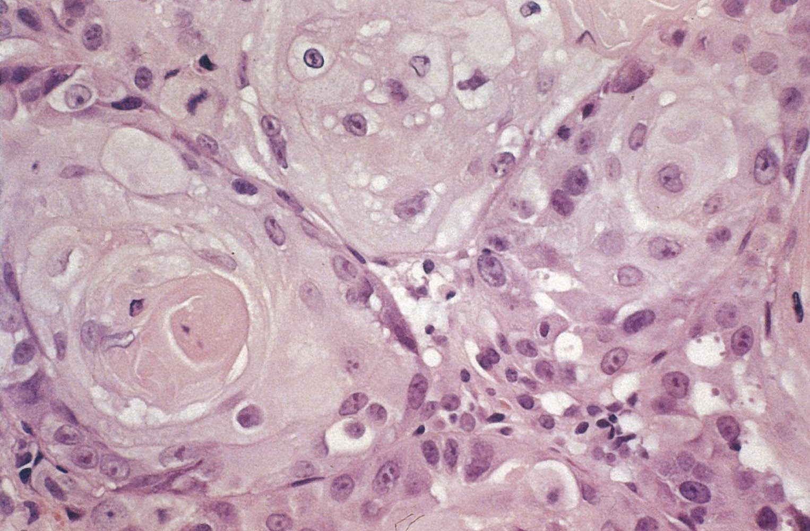
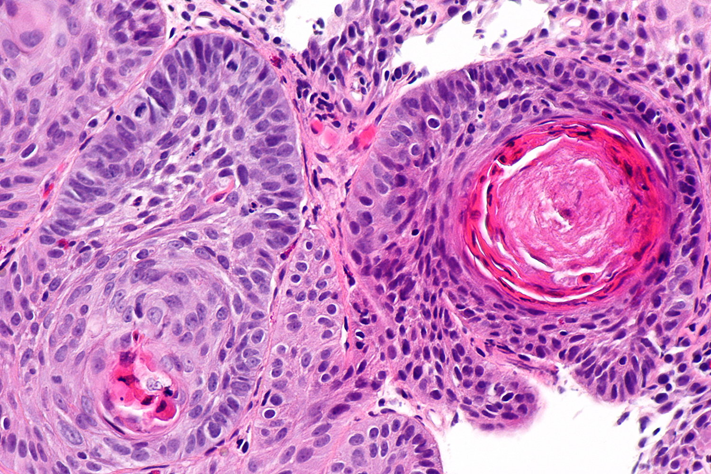

# Esophageal cancer

*Categories: Clinical knowledge > Surgery > Abdominal surgery > Esophagus > Esophageal cancer*

[Original Article Link](https://coursology-qbank.com/amboss/article/Cg0qx2)

---

## Summary

Esophageal cancer (EC) is the eighth most common type of cancer worldwide and affects men more than women (3:1 <u>ratio</u>). The two main forms are esophageal <u>adenocarcinoma</u> and <u>squamous cell carcinoma</u>. Esophageal <u>adenocarcinomas</u> are among the <u>neoplasms</u> with the fastest increasing <u>incidence</u> in northern and western Europe and North America, while <u>squamous cell carcinoma</u> is the most common form worldwide. <u>Adenocarcinoma</u>, which usually affects the lower third of the <u>esophagus</u>, may be preceded by <u>gastroesophageal reflux disease</u> and <u>Barrett esophagus</u>. Other <u>risk factors</u> include smoking and <u>obesity</u>. <u>Risk factors</u> for <u>squamous cell carcinoma</u> include <u>carcinogen</u> exposure (e.g., in the form of <u>alcohol</u> and tobacco) and a diet high in <u>nitrosamines</u> but low in fruits and vegetables. Locally advanced disease is common at the time of diagnosis because EC is typically asymptomatic early in the disease course. Symptomatic patients may experience weight loss, <u>dyspepsia</u>, progressive <u>dysphagia</u>, cervical <u>adenopathy</u>, <u>hoarseness</u> or persistent <u>cough</u>, and signs of <u>upper gastrointestinal bleeding</u>, such as <u>hematemesis</u>, <u>melena</u>, or <u>anemia</u>. <u>Esophagogastroduodenoscopy</u> (<u>EGD</u>) is used to directly visualize the lesion and obtain a <u>biopsy</u> sample for histopathological confirmation. Staging of the <u>tumor</u> involves <u>CT scan</u> of the chest and abdomen, a <u>PET scan</u>, and often transesophageal <u>endoscopic ultrasound</u> (<u>EUS</u>). Curative surgical resection may be considered for locally invasive cancers, but EC is unresectable in approximately 60% of patients at the time of diagnosis. For patients with unresectable disease, treatment options include <u>chemotherapy</u>, radiation, and palliative <u>stenting</u>. Prognosis is generally poor because of the aggressive nature of EC and oftentimes late diagnosis.

---

## Epidemiology

* Sex: <u>♂</u> > <u>♀</u> (3:1) [[1]](https://coursology-qbank.com/amboss/article/5DbiUD)

* <u>Incidence</u>: an estimated 20,640 new cases of esophageal cancer will be diagnosed in 2022 in the United States [[1]](https://coursology-qbank.com/amboss/article/5DbiUD)

* Median age of onset: : between 60 and 70 years of age

* <u>Adenocarcinoma</u>: : most common type of esophageal cancer in the US  [[2]](https://coursology-qbank.com/amboss/article/mDbVUD)

* <u>Squamous cell carcinoma</u> (<u>SCC</u>): most common type of esophageal cancer worldwide  [[3]](https://coursology-qbank.com/amboss/article/MDbMUD)

> [!NOTE]
> Adenocarcinoma is more common in the US of America.

Epidemiological data refers to the US, unless otherwise specified.

---

## Etiology

### <u>Adenocarcinoma</u> [[4]](https://coursology-qbank.com/amboss/article/sDbtfD)

* <u>Exogenous</u> <u>risk factors</u>

* Smoking (twofold risk)

* <u>Obesity</u>

* <u>Endogenous</u> <u>risk factors</u>

* Male sex

* Older age (50–60 years)

* <u>Gastroesophageal reflux</u>

* <u>Barrett esophagus</u>

* Localization: mostly in the lower third of the <u>esophagus</u>

> [!TIP]
> The most important <u>risk factors</u> for esophageal <u>adenocarcinoma</u> are <u>gastroesophageal reflux</u> and associated <u>Barrett esophagus</u>.

### <u>Squamous cell carcinoma</u> (<u>SCC</u>) [[4]](https://coursology-qbank.com/amboss/article/sDbtfD)[[5]](https://coursology-qbank.com/amboss/article/Mk0MoT)

* <u>Exogenous</u> <u>risk factors</u>

* <u>Alcohol</u> consumption

* Smoking (ninefold risk)

* Diet low in fruits and vegetables

* Hot beverages

* <u>Nitrosamines</u> exposure (e.g., cured meat, fish, bacon) [[6]](https://coursology-qbank.com/amboss/article/nk07oT)

* Caustic strictures

* <u>HPV</u> [[7]](https://coursology-qbank.com/amboss/article/W-bPww)

* <u>Radiotherapy</u>

* Betel or areca nut chewing

* <u>Esophageal candidiasis</u> [[8]](https://coursology-qbank.com/amboss/article/pDbL2D)[[9]](https://coursology-qbank.com/amboss/article/JDbs2D)

* <u>Endogenous</u> <u>risk factors</u>

* Male sex

* Older age (60–70 years)

* African American descent

* <u>Plummer-Vinson syndrome</u>

* <u>Achalasia</u>

* <u>Diverticula</u> (e.g., <u>Zenker diverticulum</u>)

* <u>Tylosis</u>

* Localization: : mostly in the upper two-thirds of the <u>esophagus</u>

> [!TIP]
> The primary <u>risk factors</u> for squamous cell esophageal cancer are <u>alcohol</u> consumption, smoking, and dietary factors (e.g., diet low in fruits and vegetables).

---

## Clinical features

### Early stages [[4]](https://coursology-qbank.com/amboss/article/sDbtfD)

* Often asymptomatic

* May manifest with <u>dysphagia</u> or retrosternal discomfort

### Advanced stages [[4]](https://coursology-qbank.com/amboss/article/sDbtfD)

* General signs

* <u>Unintentional weight loss</u>

* <u>Dyspepsia</u>

* <u>Signs of anemia</u>

* Signs of advanced disease

* Progressive <u>structural dysphagia</u> (from solids to liquids) with possible <u>odynophagia</u>

* Retrosternal chest or <u>back pain</u>

* Cervical <u>adenopathy</u>

* <u>Hoarseness</u> and/or persistent <u>cough</u>

* <u>Horner syndrome</u>

* Signs of <u>upper gastrointestinal bleeding</u> 

* <u>Hematemesis</u>

* <u>Melena</u>

> [!TIP]
> Initially, esophageal cancer is often asymptomatic. It typically becomes symptomatic at advanced stages.

---

## Diagnosis

<u>Esophagogastroduodenoscopy</u> (<u>EGD</u>) with <u>biopsy</u> is the best initial and <u>confirmatory test</u> in patients with suspected esophageal cancer. [[12]](https://coursology-qbank.com/amboss/article/pk0LKT)[[13]](https://coursology-qbank.com/amboss/article/gA1FQj0)

### <u>EGD</u> [[14]](https://coursology-qbank.com/amboss/article/s5ctl10)

* Indications

* <u>Red flags for dysphagia</u>

* Patients with both clinical features and <u>risk factors for EC</u>

* Uses

* Direct visualization of the <u>tumor</u>

* <u>Biopsy</u> of any suspicious lesions

Esophageal carcinoma

Esophageal carcinoma

### <u>Barium swallow</u> [[12]](https://coursology-qbank.com/amboss/article/pk0LKT)

* Indications

* Severe <u>esophageal strictures</u>

* Suspected <u>tracheoesophageal fistula</u>

* Tumors near the <u>Z line</u>: to differentiate between <u>gastroesophageal junction</u> and gastric tumors

* Findings 

* Characteristic stenosis and <u>proximal</u> dilatation (apple core lesion)

* Asymmetrical and irregular esophagal borders

Distal esophageal stricture from carcinoma

Malignant esophageal stricture

### Staging investigations [[12]](https://coursology-qbank.com/amboss/article/pk0LKT)

Consider the following studies in consultation with a multidisciplinary team.

* Routine studies [[15]](https://coursology-qbank.com/amboss/article/N_1-oj0)

* CT chest and abdomen with IV contrast

* <u>FDG-PET/CT</u> <u>skull base</u> to mid-thigh

* Transesophageal <u>EUS</u> with <u>fine-needle aspiration biopsy</u>

* Additional studies

* <u>Bronchoscopy</u>: for lesions at or above the <u>tracheal carina</u> to rule out <u>airway</u> involvement

* <u>Laparoscopy</u>: to increase staging <u>accuracy</u> in <u>adenocarcinoma</u> of the <u>gastroesophageal junction</u>

Esophageal cancer with tracheoesophageal fistula

Mediastinal mass with narrowed tracheal lumen

### <u>Laboratory studies</u> [[4]](https://coursology-qbank.com/amboss/article/sDbtfD)

* <u>CBC</u>: <u>iron deficiency anemia</u> may indicate <u>occult GI bleeding</u>

* <u>Liver chemistries</u>

* ↑ <u>Transaminases</u> may indicate <u>liver metastases</u>

* ↑ <u>ALP</u> may indicate <u>bone metastases</u>

* Serum <u>creatinine</u>: to determine pretreatment renal function [[13]](https://coursology-qbank.com/amboss/article/gA1FQj0)

---

## Pathology

### <u>Adenocarcinoma</u> [[17]](https://coursology-qbank.com/amboss/article/f-bk9w)

* <u>Carcinoma</u> arises in context of <u>Barrett esophagus</u> (<u>columnar epithelium</u> with <u>goblet cells</u>) and high-grade <u>dysplasia</u>

* Gland-forming tumors with different possible growth patterns (tubular, <u>papillary</u>, tubulopapillary)

* <u>Mucinous</u> differentiation possible

### <u>Squamous cell carcinoma</u> [[17]](https://coursology-qbank.com/amboss/article/f-bk9w)

* Breakdown of uniform tissue structure

* <u>Squamous cell carcinoma</u> <u>clusters</u> with circular <u>keratinization</u>

* <u>Lymphocytic</u> infiltration between the <u>carcinoma</u> <u>clusters</u>

Barrett esophagus with adenocarcinoma

Keratinizing squamous cell carcinoma of the esophagus

Keratinizing squamous cell carcinoma of the esophagus

Esophageal squamous cell carcinoma

---

## Treatment

### General principles

* <u>Multidisciplinary cancer care</u> should be utilized if available.

* The treatment approach should be guided by <u>shared decision-making</u> and the patient's <u>performance status</u>.

* Treatment goals [[4]](https://coursology-qbank.com/amboss/article/sDbtfD)

* Curative for patients with:

* High-grade <u>metaplasia</u> in <u>Barrett esophagus</u>

* Localized lesions that have not infiltrated surrounding structures

* Palliative for patients with unresectable locally advanced or <u>metastatic</u> cancer

* See “<u>Principles of cancer care</u>.”

### Surgical resection [[18]](https://coursology-qbank.com/amboss/article/hA1cjj0)

* Endoscopic <u>submucosal</u> resection for <u>mucosal</u> lesions [[19]](https://coursology-qbank.com/amboss/article/g_1Fnj0)

* Subtotal or total esophagectomy 

* Indications: localized or resectable locally advanced disease

* Options include: gastric pull-through procedure, <u>colonic</u> interposition

### <u>Chemoradiotherapy</u> [[18]](https://coursology-qbank.com/amboss/article/hA1cjj0)[[20]](https://coursology-qbank.com/amboss/article/M_1MKj0)

* <u>Neoadjuvant</u> <u>chemoradiotherapy</u>

* Indications: locally advanced disease

* Common regimen: <u>fluorouracil</u>, <u>leucovorin</u>, <u>oxaliplatin</u>, and <u>docetaxel</u> (FLOT) [[18]](https://coursology-qbank.com/amboss/article/hA1cjj0)

* <u>Chemoradiotherapy</u> with or without <u>targeted therapies</u>

* Indication: unresectable or <u>metastatic</u> disease

* Common regimens

* <u>Cisplatin</u> and <u>fluorouracil</u> [[20]](https://coursology-qbank.com/amboss/article/M_1MKj0)

* <u>Oxaliplatin</u> and <u>capecitabine</u> [[20]](https://coursology-qbank.com/amboss/article/M_1MKj0)

* <u>Adenocarcinomas</u> overexpressing <u>ERBB2</u>: <u>trastuzumab</u> [[20]](https://coursology-qbank.com/amboss/article/M_1MKj0)

* Tumors overexpressing <u>PD-L1</u>: <u>pembrolizumab</u> or <u>nivolumab</u> [[21]](https://coursology-qbank.com/amboss/article/K_1U6j0)[[22]](https://coursology-qbank.com/amboss/article/6_1j6j0)

* Recurrence after <u>chemoradiotherapy</u> and surgical resection: <u>nivolumab</u> [[23]](https://coursology-qbank.com/amboss/article/jA1_jj0)

### Other interventional therapy [[13]](https://coursology-qbank.com/amboss/article/gA1FQj0)

* Endoscopic placement of self-expanding metal <u>stents</u> for <u>palliation</u> of <u>dysphagia</u> and <u>fistulae</u>

* <u>Gastrojejunostomy</u> (GJ) tube for <u>specialized nutrition support</u>   [[24]](https://coursology-qbank.com/amboss/article/RA1ljj0)

Esophageal stent

---

## Complications

### Cancer-associated complications

* <u>Esophageal stenosis</u>

* <u>Tracheoesophageal fistula</u>  → passage of food and fluid into the respiratory tract → ↑ risk of <u>aspiration pneumonia</u>

* <u>Metastasis</u>, e.g.:  [[13]](https://coursology-qbank.com/amboss/article/gA1FQj0)

* <u>Squamous cell carcinoma</u> → <u>lungs</u> and thorax

* <u>Adenocarcinoma</u> → <u>liver</u>, <u>peritoneum</u>, bones [[13]](https://coursology-qbank.com/amboss/article/gA1FQj0)

Esophageal cancer with tracheoesophageal fistula

### Treatment-associated complications

* Surgical complications

* <u>Anastomotic leak</u> or stricture

* <u>Recurrent laryngeal nerve</u> injury

* <u>Functional gastrointestinal disorders</u>

* <u>Dysphagia</u>

* Reflux

* <u>Dumping syndrome</u>

We list the most important complications. The selection is not exhaustive.

---

## Prognosis

* Prognosis is generally poor due to an aggressive course (due to an absent serosa in the esophageal wall) and typically late diagnosis.  [[12]](https://coursology-qbank.com/amboss/article/pk0LKT)[[25]](https://coursology-qbank.com/amboss/article/mk0VoT)

* The Surveillance, <u>Epidemiology</u>, and End Results (SEER) database tracks survival rates for patients with EC in the United States.

|  Estimated survival of patients diagnosed with EC between 2012–2018 [[26]](https://coursology-qbank.com/amboss/article/P-bWxw)  |  |  |
| --- | --- | --- |
| SEER stage |  5-year relative survival rate  |  |
|  Localized  |  * 47%   |  |
|  Regional  |  * 26%   |  |
|  Distant  |  * 6%   |  |
| Combined (any stage) |  * 21%   |  |

---