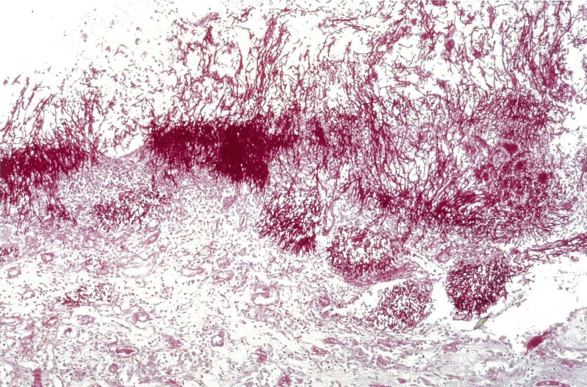

# Esophagitis

*Categories: Clinical knowledge > Surgery > Abdominal surgery > Esophagus > Esophagitis*

[Original Article Link](https://coursology-qbank.com/amboss/article/-q0Dah)

---

## Summary

Esophagitis is the inflammation of the esophageal <u>mucosa</u> secondary to direct <u>mucosal</u> injury (e.g., <u>gastroesophageal reflux</u> or <u>GERD</u>, <u>substance-induced esophagitis</u>) or to an inflammatory process (e.g., <u>eosinophilic esophagitis</u>). It can also occur secondary to local infection (e.g., <u>esophageal candidiasis</u>, <u>HSV esophagitis</u>, <u>CMV esophagitis</u>), especially in <u>immunosuppressed</u> individuals. The typical manifestation of esophagitis is retrosternal <u>pain</u> (<u>heartburn</u>). Associated features such as <u>regurgitation</u>, <u>odynophagia</u>, or <u>dysphagia</u> may provide clues to the underlying etiology. <u>Coronary artery disease</u> (<u>CAD</u>) may mimic the retrosternal symptoms of esophagitis and should be ruled out if suspected (e.g., <u>chest pain</u> on exertion, presence of <u>risk factors for CAD</u>). Empiric pharmacotherapy with a trial of <u>proton pump inhibitors</u> (<u>PPIs</u>) is recommended in patients with typical features of <u>GERD</u>. Inadequate response to empiric therapy or atypical features at presentation (e.g., significant <u>dysphagia</u>, <u>odynophagia</u>, <u>fever</u>), <u>risk factors for esophageal cancer</u>, or <u>red flags for dyspepsia</u> should prompt an <u>esophagogastroduodenoscopy</u> (<u>EGD</u>) to directly visualize the esophageal <u>mucosa</u> and obtain <u>biopsies</u> from areas of <u>mucosal</u> abnormalities. Further diagnostics (e.g., <u>esophageal pH monitoring</u>, <u>high-resolution esophageal manometry</u>) should be considered if <u>EGD</u> is inconclusive. Specific management depends on the underlying cause and includes <u>PPIs</u>, dietary restriction and <u>topical steroids</u> for <u>eosinophilic esophagitis</u>, and systemic <u>antifungal</u> or <u>antiviral therapy</u> for <u>infectious esophagitis</u>. Complications of prolonged or severe esophagitis include <u>Barrett esophagus</u>, <u>esophageal strictures</u>, <u>hematemesis</u>, and <u>aspiration</u>.

---

## Definitions

* Esophagitis: inflammation of the esophageal <u>mucosa</u> that is secondary to direct <u>mucosal</u> injury or to inflammatory infiltrates due to a systemic inflammatory disorder [[1]](https://coursology-qbank.com/amboss/article/CBYq17)

* <u>Eosinophilic esophagitis</u>: chronic immune-mediated <u>eosinophil</u>-predominant inflammation of the esophageal <u>mucosa</u> [[2]](https://coursology-qbank.com/amboss/article/VgcG8b0)

* <u>Infectious esophagitis</u>: inflammation of the esophageal <u>mucosa</u> secondary to a local infection; most common in patients with <u>immunosuppression</u>.

* <u>Substance-induced esophagitis</u>: esophageal <u>mucosal</u> injury caused by direct contact with an irritant substance

* <u>Medication-induced esophagitis</u>: a type of <u>substance-induced esophagitis</u> caused by prolonged contact with certain types of oral medications (e.g., <u>antibiotics</u>, antiinflammatory medications, <u>bisphosphonates</u>).

---

## Infectious esophagitis

### Clinical features [[3]](https://coursology-qbank.com/amboss/article/kIYm1q)

* <u>Odynophagia</u>, <u>dysphagia</u> (characteristic)

* <u>Heartburn</u>, <u>regurgitation</u>

* Lesions in the oral <u>mucosa</u> (e.g., <u>ulcers</u>, <u>thrush</u>)  [[3]](https://coursology-qbank.com/amboss/article/kIYm1q)

* Retrosternal <u>chest pain</u>

* Systemic signs of infection (e.g., <u>fever</u>)

### Etiology

* Fungal: <u>Candida</u> spp. (most common)

* Viral: <u>CMV</u>, <u>HSV</u> (<u>HSV-1</u>)

* Uncommon: bacterial esophagitis , parasitic esophagitis

> [!TIP]
> <u>Infectious esophagitis</u> is most commonly seen in patients with <u>immunosuppression</u> (resulting from, e.g., <u>HIV</u>, malignancies, <u>transplantation</u>, dialysis). A diagnosis of <u>infectious esophagitis</u> in patients with no known comorbidities should prompt studies for <u>immunosuppression</u>.

### Diagnostics and treatment

|  Diagnostics and treatment of <u>infectious esophagitis</u> [[3]](https://coursology-qbank.com/amboss/article/kIYm1q)[[9]](https://coursology-qbank.com/amboss/article/D2c1Pb0)  |  |  |  |  |
| --- | --- | --- | --- | --- |
|  |  |  Esophageal candidiasis [[10]](https://coursology-qbank.com/amboss/article/v2cAjb0)  | <u>Herpes esophagitis</u> (mainly <u>HSV-1</u>) | CMV esophagitis |
| Diagnostics | Endoscopic findings |  * White or yellowish adherent <u>plaques</u> (pseudomembranes)   |  * <u>Superficial</u>, punched-out <u>ulcers</u> (<u>distal</u> <u>esophagus</u>)   |  * <u>Mucosal</u> <u>erosions</u> and linear <u>ulcers</u> (middle or lower <u>esophagus</u>) [[11]](https://coursology-qbank.com/amboss/article/OodIXI0)   |
| Histopathologic findings |  * <u>Pseudohyphae</u> accompanied by visible spores   |   * <u>Multinucleated giant cells</u>  * Intranuclear, eosinophilic Cowdry A <u>inclusions</u>    |   * <u>Basophilic</u> <u>inclusions</u> in <u>nucleus</u> and <u>cytoplasm</u>  * Aggregates of <u>macrophages</u>    |  |
| Treatment | General measures |   * Consider inpatient treatment for patients with severe <u>odynophagia</u>.  * Optimize nutrition and hydration.  * <u>Pain management</u>  * Consult gastroenterology and infectious disease specialists as needed.  * In treatment-naive patients with <u>AIDS</u>, evaluate the need to initiate <u>antiretroviral therapy</u> in consultation with infectious disease specialists.    |  |  |
|  Specific treatment   |   * First line: <u>fluconazole</u>  * Alternative: <u>echinocandins</u>  * See “<u>Treatment of mucocutaneous candidiasis</u>” for dosages.    |   * <u>Acyclovir</u>  * See “<u>Herpes esophagitis</u>” in “<u>HSV infections</u>” for dosages.    |   * IV <u>ganciclovir</u> followed by oral <u>valganciclovir</u> once the patient can tolerate oral medications  * See “<u>Treatment of CMV infection</u>” for dosages.    |  |

> [!TIP]
> In patients with <u>AIDS</u> with <u>CD4 counts</u> below < 200/μL, coexisting fungal and viral infections are possible. Consider extended testing and double therapy for refractory cases.

Candida esophagitis

Herpes esophagitis

Herpes esophagitis endoscopy

Esophageal candidiasis

---

## Eosinophilic esophagitis

### <u>Epidemiology</u> [[2]](https://coursology-qbank.com/amboss/article/VgcG8b0)

* Overall increasing <u>incidence</u> and <u>prevalence</u>

* Most commonly affects young individuals

### Clinical features [[2]](https://coursology-qbank.com/amboss/article/VgcG8b0)[[12]](https://coursology-qbank.com/amboss/article/ffcklb0)

* <u>Dysphagia</u>, <u>food bolus impaction</u>

* Symptoms can be worsened by ingestion of food containing <u>allergens</u>.

* Associated features: <u>atopy</u> (e.g., <u>asthma</u>, <u>rhinitis</u>, <u>atopic dermatitis</u>, alimentary <u>allergies</u>)

### Diagnostics [[2]](https://coursology-qbank.com/amboss/article/VgcG8b0)[[12]](https://coursology-qbank.com/amboss/article/ffcklb0)[[13]](https://coursology-qbank.com/amboss/article/zJdr9I0)

* Diagnostic criteria (all are required) ;  [[13]](https://coursology-qbank.com/amboss/article/zJdr9I0)

* Features of esophageal dysfunction (see “Clinical features”)

* Esophageal inflammation on <u>biopsy</u> with ≥ 15 <u>eosinophils</u> per <u>high-power field</u>

* Exclusion of other causes or contributors to esophageal <u>eosinophilia</u> (see “<u>Differential diagnoses of eosinophilic esophagitis</u>”)

* Endoscopic findings 

* Circumferential <u>mucosal</u> lesions (e.g., rings, corrugations), with possible esophageal trachealization (presence of multiple rings in the <u>esophagus</u>, which results in a furrowed or corrugated appearance similar to the <u>trachea</u>)

* Longitudinal furrows

* Diffuse narrowing or isolated strictures

* Histopathologic findings  [[2]](https://coursology-qbank.com/amboss/article/VgcG8b0)

* Intraepithelial accumulation of <u>eosinophils</u>

* <u>Basal cell</u> <u>hyperplasia</u>

* Possibly eosinophilic microabscesses

Eosinophilic esophagitis

Eosinophilic esophagitis

Eosinophilic esophagitis

### Differential diagnoses of eosinophilic esophagitis [[13]](https://coursology-qbank.com/amboss/article/zJdr9I0)[[14]](https://coursology-qbank.com/amboss/article/Dqd10r0)

These conditions may also cause eosinophilic infiltration.

* <u>GERD</u>

* <u>Drug hypersensitivity reaction</u>

* <u>Hypereosinophilic syndrome</u>

* <u>Pill esophagitis</u>

* <u>Achalasia</u>

* Autoimmune conditions (e.g., <u>Crohn disease</u>)

* Infection (e.g., <u>Candida esophagitis</u>, <u>HSV esophagitis</u>)

* <u>Connective tissue disease</u> (e.g., <u>Marfan syndrome</u>)

### Treatment [[13]](https://coursology-qbank.com/amboss/article/zJdr9I0)[[15]](https://coursology-qbank.com/amboss/article/dtXoc-)

#### General principles [[13]](https://coursology-qbank.com/amboss/article/zJdr9I0)

* Choose between empiric <u>dietary elimination</u> or pharmacotherapy through <u>shared decision-making</u>.

* Esophageal dilation is indicated for severe strictures.

* Evaluate response to therapy based on symptoms and endoscopic and <u>biopsy</u> findings during follow-up testing.

#### Pharmacotherapy [[13]](https://coursology-qbank.com/amboss/article/zJdr9I0)[[16]](https://coursology-qbank.com/amboss/article/ood01I0)[[17]](https://coursology-qbank.com/amboss/article/podL1I0)

* High dose <u>PPIs</u> (see “<u>Acid suppression medications</u>” for details on agents and dosages)

* <u>Topical steroids</u> (<u>swallowed aerosolized steroids</u>)

* <u>Steroid</u> choice is based on availability and preference.

* <u>Fluticasone</u> (<u>off-label</u>) DOSAGE

* <u>Budesonide</u> (<u>off-label</u>) DOSAGE

* Use after meals or at bedtime; avoid food or drinks for 30–60 minutes after use.

* <u>Biological agents</u> (e.g., <u>dupilumab</u>): considered in severe and/or refractory disease

#### Nonpharmacological therapy

* <u>Dietary elimination</u> (to identify and avoid <u>allergens</u>)

* Empiric food <u>elimination diets</u>: recommended to reduce the inflammatory response in the <u>GI tract</u>

* Exclude certain food groups (e.g., milk, wheat, soy, egg, nuts, fish, and shellfish) from the diet.

* Begin with a less restrictive <u>elimination diet</u> (e.g., remove one or two specific food groups at a time).  [[13]](https://coursology-qbank.com/amboss/article/zJdr9I0)

* <u>Allergy testing</u> is not recommended.

* Esophageal dilation

* Consider for patients with an <u>esophageal stricture</u> and <u>dysphagia</u>.

* Use in combination with anti-inflammatory therapy (not recommended as monotherapy).

> [!TIP]
> Approx. 50% of patients with <u>eosinophilic esophagitis</u> do not respond to <u>acid suppression therapy</u>.

> [!TIP]
> Long-term <u>maintenance therapy</u> (<u>dietary elimination</u> and/or pharmacological therapy) is often required to maintain remission. [[15]](https://coursology-qbank.com/amboss/article/dtXoc-)[[18]](https://coursology-qbank.com/amboss/article/gyYFe7)

---

## Substance-induced esophagitis

### Medication-induced esophagitis [[19]](https://coursology-qbank.com/amboss/article/92cNPb0)

* Etiology: direct <u>mucosal</u> injury caused by prolonged contact with a certain drug 

* <u>Antibiotics</u> (e.g., <u>tetracycline</u>, <u>doxycycline</u>, and <u>clindamycin</u>)

* Antiinflammatory drugs, <u>NSAIDs</u>, <u>aspirin</u>

* <u>Bisphosphonates</u> (e.g., alendronate)

* Others (e.g., <u>potassium</u> <u>chloride</u>, <u>iron</u> compounds, <u>quinidine</u>)

* Diagnostics

* Endoscopy: punched-out <u>ulcers</u>, mild inflammatory changes of the surrounding <u>mucosa</u>

* <u>Histopathology</u>: <u>ulcerations</u>, inflammatory and <u>necrotic</u> changes of the <u>epithelium</u>, <u>giant cells</u> with multiple <u>nuclei</u>

* Treatment: Most cases are <u>self-limiting</u>.

* Discontinue the medication or substance causing esophagitis.

* Ensure nutrition and hydration.

* Consider <u>antacids</u>, <u>sucralfate</u>, or <u>PPIs</u> to ameliorate symptoms.

* Some patients may develop strictures that require esophageal dilations.

### Other <u>substance-induced esophagitis</u>

* <u>Caustic ingestion</u>: causes corrosive esophagitis (<u>ulceration</u> and <u>fibrosis</u> of the <u>esophagus</u>)

* <u>Alcohol</u> and tobacco [[20]](https://coursology-qbank.com/amboss/article/C2cqPb0)

* Are <u>risk factors for GERD</u> and <u>Barrett esophagus</u>

* May exacerbate other forms of esophagitis

---