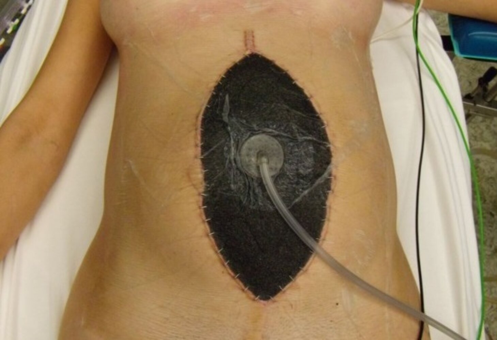

# Abdominal compartment syndrome

*Categories: Clinical knowledge > Surgery > Abdominal surgery > General abdominal surgery > Abdominal compartment syndrome*

[Original Article Link](https://coursology-qbank.com/amboss/article/VF0GS3)

---

## Summary

Abdominal compartment syndrome (<u>ACS</u>) is caused by increased pressure in the <u>abdominal cavity</u> (i.e., <u>intraabdominal hypertension</u>) and is most commonly seen in critically ill or injured patients. <u>ACS</u> can be caused by reduced abdominal wall compliance, <u>visceral</u> <u>edema</u>, increased luminal contents, or increased abdominal contents and manifests with organ dysfunction, including <u>acute kidney failure</u>, <u>respiratory failure</u>, and <u>shock</u>. Diagnosis is made with <u>urinary bladder pressure measurement</u>, which provides an indirect measure of <u>intraabdominal pressure</u>. Initial <u>conservative measures</u> are aimed at improving abdominal wall compliance, reducing <u>abdominal cavity</u> volume, and optimizing <u>fluid balance</u> and organ <u>perfusion</u>. If these measures fail to lower <u>intraabdominal pressure</u>, urgent decompressive <u>laparotomy</u> is required, typically followed by <u>temporary abdominal closure</u>.

For compartment syndromes of the extremities, see “<u>Acute compartment syndrome</u>” and “<u>Chronic compartment syndrome</u>.”

---

## Etiology

* Reduced abdominal wall compliance

* Abdominal or <u>pelvic</u> trauma

* Abdominal <u>surgery</u>

* Major <u>burns</u>

* <u>Prone positioning</u>

* <u>Mechanical ventilation</u>

* <u>Morbid obesity</u>

* <u>Visceral</u> <u>edema</u> 

* Massive volume resuscitation

* <u>Sepsis</u>

* Increased luminal contents

* <u>Gastroparesis</u>

* <u>Mechanical bowel obstruction</u>

* <u>Paralytic ileus</u>

* Increased abdominal contents

* <u>Acute pancreatitis</u>

* Intraabdominal <u>tumor</u> or <u>abscess</u>

* Massive <u>ascites</u>

* <u>Hemoperitoneum</u>

* <u>Pneumoperitoneum</u>

* <u>Peritoneal dialysis</u>

* Status post organ transplant

---

## Classification

* Primary: associated with abdominopelvic injury or disease (e.g., abdominal trauma or <u>surgery</u>, <u>acute pancreatitis</u>)

* Secondary: associated with conditions that are not due to a primary abdominopelvic pathology (e.g., <u>third spacing</u> caused by <u>sepsis</u> and/or aggressive <u>fluid resuscitation</u>)

* Recurrent: reoccurrence after treatment of primary or secondary abdominal <u>compartment syndrome</u>

---

## Clinical features

Symptoms typically manifest acutely or subacutely in critically ill patients. [[4]](https://coursology-qbank.com/amboss/article/uz0pui)

* Gastrointestinal: tight and distended abdomen, <u>nausea</u>, <u>vomiting</u>

* Renal: from <u>oliguria</u> to progressive <u>renal failure</u>

* Cardiovascular: signs of increased <u>central venous pressure</u>, <u>hypotension</u>, <u>tachycardia</u>

* Pulmonary: <u>tachypnea</u>, <u>wheezing</u>

* Cerebral: <u>signs of increased intracranial pressure</u>

---

## Diagnosis

### Urinary bladder pressure measurement [[2]](https://coursology-qbank.com/amboss/article/VeXGBC)[[3]](https://coursology-qbank.com/amboss/article/961NM30)[[5]](https://coursology-qbank.com/amboss/article/7614m30)

* <u>Gold standard test</u> that provides indirect measurement of <u>intraabdominal pressure</u> [[4]](https://coursology-qbank.com/amboss/article/uz0pui)

* Indications: <u>risk factors</u> for IAH or abdominal <u>compartment syndrome</u> in a critically ill patient

* Frequency: continuously or every 4–6 hours

* Interpretation

* ≥ 12 mm Hg: <u>Intraabdominal hypertension</u>

* > 20 mm Hg with organ dysfunction: Abdominal <u>compartment syndrome</u>

### Additional diagnostics

Additional diagnostics are used to assess severity and identify underlying causes.

* <u>Laboratory studies</u>

* <u>CBC</u>

* <u>CMP</u>

* <u>ABG</u>

* <u>Lactate</u>

* Imaging

* <u>CT scan</u>: Characteristic findings include elevated <u>diaphragm</u>, increased abdominal diameter, compression of the <u>inferior vena cava</u>, and intestinal wall thickening. [[6]](https://coursology-qbank.com/amboss/article/0J1es30)

* <u>Abdominal x-ray</u>: may show signs of an underlying abdominal condition (e.g., <u>free intraperitoneal air</u>)

> [!WARNING]
> Maintain a low threshold for monitoring <u>urinary bladder pressure</u> in at-risk patients because the <u>physical exam</u> is not reliable in detecting raised <u>intraabdominal pressure</u>. [[2]](https://coursology-qbank.com/amboss/article/VeXGBC)[[3]](https://coursology-qbank.com/amboss/article/961NM30)

---

## Treatment

### Approach [[2]](https://coursology-qbank.com/amboss/article/VeXGBC)[[5]](https://coursology-qbank.com/amboss/article/7614m30)

* All patients

* <u>ICU</u> admission for <u>IAP</u> monitoring and medical management

* Treatment of the underlying condition (e.g., <u>sepsis management</u>)

* Refractory <u>ACS</u>:  urgent surgical decompression

> [!TIP]
> Monitor <u>IAP</u> continuously or every 4–6 hours and titrate interventions to a target <u>IAP</u> of ≤ 15 mm Hg. [[2]](https://coursology-qbank.com/amboss/article/VeXGBC)

### Medical and supportive therapy  [[2]](https://coursology-qbank.com/amboss/article/VeXGBC)[[5]](https://coursology-qbank.com/amboss/article/7614m30)

* Removal of constrictive dressings

* Optimization of body position

* <u>Goal directed IV fluid therapy</u>

* Adequate sedation and <u>analgesia</u>

* Reduction of <u>enteral nutrition</u>/<u>NPO</u>

* Placement of nasogastric and/or <u>rectal tube</u>

* <u>Paracentesis</u> and/or percutaneous drainage of fluid collections

* Diuresis and/or <u>ultrafiltration</u>

### Surgical treatment [[2]](https://coursology-qbank.com/amboss/article/VeXGBC)[[3]](https://coursology-qbank.com/amboss/article/961NM30)[[5]](https://coursology-qbank.com/amboss/article/7614m30)

* Indication: <u>ACS</u> refractory to medical management

* Techniques [[7]](https://coursology-qbank.com/amboss/article/cJ1aG30)[[8]](https://coursology-qbank.com/amboss/article/1J12G30)

* <u>Laparotomy</u> for abdominal decompression

* <u>Temporary abdominal closure</u> with <u>negative pressure wound therapy</u>

* Delayed definitive closure

Negative pressure (vacuum-assisted) wound therapy

---