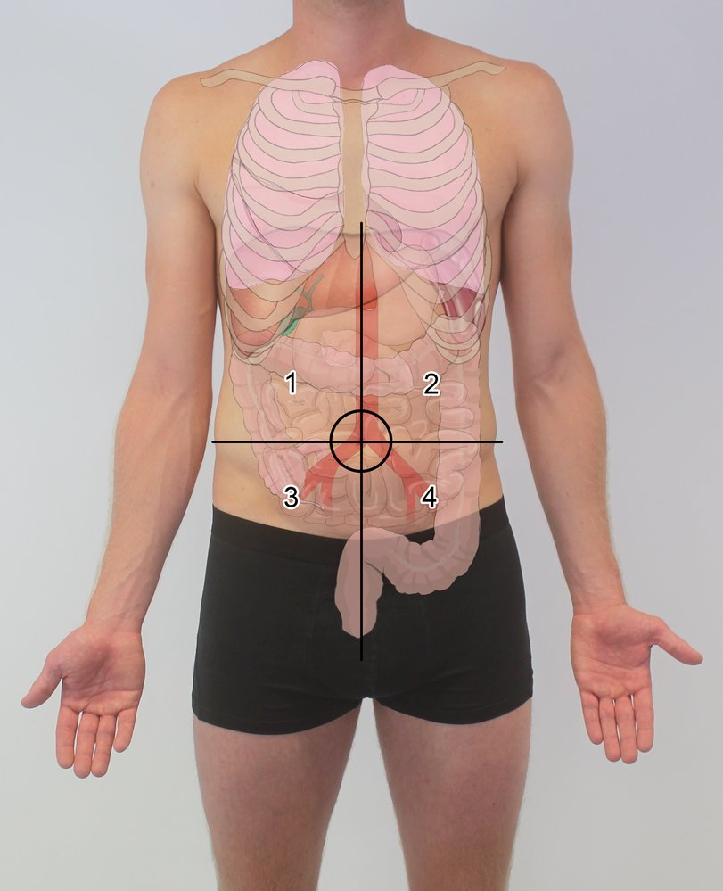
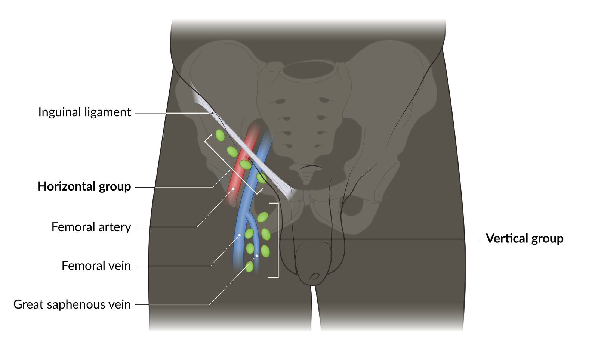
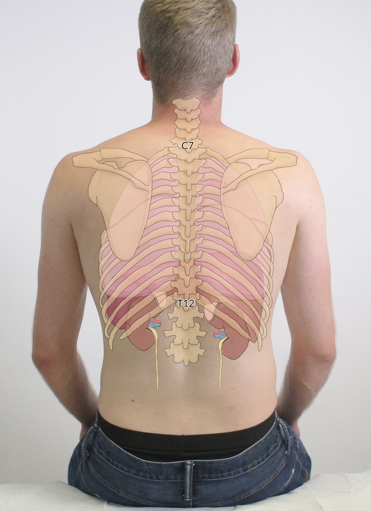
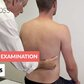
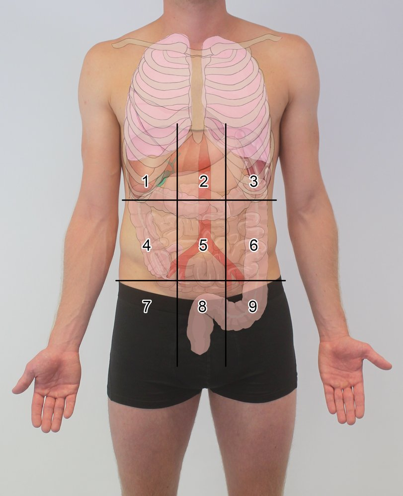

# Abdominal examination

*Categories: Clinical knowledge > Surgery > Abdominal surgery > General abdominal surgery > Abdominal examination*

[Original Article Link](https://coursology-qbank.com/amboss/article/XL09wg)

---

## Summary

A fundamental part of <u>physical examination</u> is examination of the abdomen, which consists of inspection, <u>auscultation</u>, percussion, and palpation. The examination begins with the patient in <u>supine position</u>, with the abdomen completely exposed. The <u>skin</u> and contour of the abdomen are inspected, followed by <u>auscultation</u>, percussion, and palpation of all quadrants. Depending on the findings or patient complaints, a variety of examination techniques and special maneuvers can provide additional diagnostic information.

---

## Suggested sequence

### Positioning

* Instruct the patient to lie down and expose the patient's abdomen.

* If your hands are cold, warn the patient prior to palpating the abdomen.

### Inspection of the abdomen

* Note any scars, <u>striae</u>, vascular changes (e.g., <u>caput medusae</u>), or protrusions

* Note the general contour of the abdomen

### Auscultation of the abdomen

> [!NOTE]
> <u>Auscultation of the abdomen</u> should be performed prior to percussion and palpation, as physical manipulation of the abdomen may induce a change in <u>bowel sounds</u>.

* Purpose: to assess <u>bowel sounds</u>

* <u>Auscultate</u> over all four quadrants.

* Listen for <u>bruits</u>.

* Normal findings: :  gurgling <u>bowel sounds</u> every 5–10 sec

### Percussion of the abdomen

* Purpose: to determine the size and location of intra-abdominal organs

* Percuss over all four quadrants.

* Normal findings: tympanic sound over air-filled <u>stomach</u>/intestinal sections; muffled sounds over fluid-filled or solid organs (<u>liver</u>, <u>spleen</u>)

### Palpation of the abdomen

* Purpose: to evaluate internal organs and identify any sources of <u>pain</u> (if present)

* Prior to palpation, ask the patient whether they have abdominal <u>pain</u> or tenderness. If so, begin palpation in the non-painful area.

* Observe the patient's face during <u>abdominal palpation</u>, as it is the main indicator of the intensity and location of <u>pain</u>.

* Procedure:
1. * <u>Superficial</u> palpation: to assess for <u>superficial</u> or abdominal wall processes
2. * Deep palpation in all four quadrants: to assess intraabdominal organs (potential signs of <u>peritonitis</u>)

* Rebound tenderness: abrupt increase in <u>pain</u> when an examiner suddenly releases compression of the abdominal wall. Caused by irritation of the <u>receptors</u> in <u>parietal peritoneum</u>

* Abdominal guarding: patient contraction of the abdominal wall muscles during palpation

* Involuntary guarding (also referred to as "rigidity"): involuntary tightening of the muscles due to <u>peritoneal</u> inflammation and is often localized to a specific abdominal quadrant.

* Voluntary guarding: voluntary contraction in order to avoid <u>pain</u> during the examination and is often generalized over the entire abdomen.
3. * Palpation of the liver 

* Place the pads of your fingers over the <u>right upper quadrant</u>, approx. 10 cm below the <u>costal margin</u> at the mid-clavicular line. Palpate as you move towards the <u>right upper quadrant</u> and attempt to feel for the edge of the <u>liver</u>. Continue until you feel the <u>liver</u> or reach the <u>costal margin</u>.

* Asking the patient to take a deep breath may facilitate <u>palpation of the liver</u>, as the movement of the <u>diaphragm</u> will move the <u>liver</u> toward your hand.
4. * Palpation of the spleen 

* Place the pads of your fingers <u>lateral</u> to the <u>belly button</u> and palpate as you move towards the <u>left upper quadrant</u>. Repeat 10 cm below the left <u>costal margin</u>.

* Asking the patient to lie on their right side may facilitate palpation of an enlarged <u>spleen</u>.
5. * <u>Palpation of the inguinal lymph nodes</u>:  (see examination of the <u>lymph nodes</u>)

Abdominal tenderness may be a sign of numerous conditions (see <u>differential diagnosis of acute abdomen</u> and <u>differential diagnoses of abdominal pain</u>).

Abdominal quadrants

Superficial inguinal lymph nodes

### <u>Liver</u> size

* Percussion 

* Place the middle finger of your non-dominant hand against the abdominal wall. With the tip of the middle finger of your dominant hand, strike the <u>distal interphalangeal joint</u> 2–3 times.

* Start below the <u>breast</u> at the <u>midclavicular line</u>. Percuss as you move your hand downward and note the sound change as you transition from <u>lung</u> (resonant) to <u>liver</u> (dull). Continue until the sound changes again after the inferior margin of the <u>liver</u>.

* Liver scratch test

* The stethoscope is placed below the <u>xiphoid</u> and the <u>midclavicular line</u> is scratched with a fingernail. A scratch can only be distinctly heard over the <u>liver</u>.

* The <u>liver scratch test</u> is generally more accurate than percussion.

* Normal findings: : The normal craniocaudal <u>liver</u> size is 7–11.5 cm in women and 8–12.5 cm in men. In most patients, the <u>liver</u> is fully covered by the <u>ribs</u>.

* <u>Hepatomegaly</u>

* An enlargement of the <u>liver</u>, defined by <u>ultrasonographic</u> findings of <u>liver</u> span > 16 cm in the <u>midclavicular line</u>.

* Can be caused by various conditions, including <u>malignancy</u>, infection, or venous congestion.

* Often seen in conjunction with <u>splenomegaly</u> (hepatosplenomegaly)

### Special tests

* <u>Fluid wave test</u> or <u>shifting dullness</u> for <u>ascites</u>

* <u>CVA tenderness</u> for <u>diagnostic evaluation of the kidney and urinary tract</u>

* <u>Murphy sign</u> for acute <u>cholecystitis</u>

* <u>Signs of appendicitis</u>

* Digital rectal examination: to assess for <u>rectal bleeding</u>, <u>fecal impaction</u>, <u>colorectal cancer</u>, and/or to evaluate the <u>prostate</u> 

* Positioning: The patient can stand and lean forward against the examination table or can lie down in a <u>lateral</u> position with their legs slightly bent.

* Procedure: With a lubricated, gloved finger, palpate the <u>anal canal</u> and <u>rectum</u>. Assess <u>anal sphincter tone</u> and the size and consistency of the <u>prostate</u>.

* Normal findings: There should be no palpable masses. The <u>prostate</u> should be rubbery and non-tender.

Kidneys, lungs, and liver within thoracic skeleton

Examination of the Abdomen - Clinical Examination

Ascites: Shifting Dullness - Clinical Examination

Examination of the Spleen - Clinical Examination

Examination of the Liver  - Clinical Examination

Murphy Sign - Clinical Examination

Percussion of the Kidneys - Clinical Examination

---

## Differential diagnoses of abdominal pain

### Common causes of abdominal <u>pain</u> (based on location)

| Abdominal <u>pain</u> | Right-sided | Center | Left-sided |
| --- | --- | --- | --- |
| Upper abdomen |   * <u>Gastric ulcer</u>  * <u>Cholelithiasis</u> and <u>cholecystitis</u>  * <u>Cholangitis</u>  * <u>Choledocholithiasis</u>  * <u>Duodenal ulcer</u>  * <u>Portal vein thrombosis</u>  * <u>Hepatitis</u> (e.g., <u>acute viral hepatitis</u>)    |   * <u>Myocardial infarction</u>  * <u>Pulmonary embolism</u>  * <u>Gastric ulcer</u>  * <u>Acute pancreatitis</u>  * <u>Duodenal ulcer</u>  * <u>Gastroesophageal reflux</u>, <u>esophagitis</u>, <u>Mallory-Weiss tear</u>  * <u>Hiatal hernia</u>  * <u>Aortic dissection</u>    |   * <u>Gastric ulcer</u>  * <u>Acute pancreatitis</u>  * <u>Functional dyspepsia</u>  * <u>Splenic infarction</u>  * <u>Gastritis</u>    |
| Mid abdomen |   * <u>Nephrolithiasis</u>  * <u>Pyelonephritis</u>  * <u>Inflammatory bowel disease</u>    |   * <u>Gastric ulcer</u>  * <u>Acute pancreatitis</u>  * <u>Inflammatory bowel disease</u>  * <u>Appendicitis</u> (early)  * <u>Aortic dissection</u>    |   * <u>Nephrolithiasis</u>  * <u>Pyelonephritis</u>  * <u>Inflammatory bowel disease</u>    |
| Lower abdomen |   * <u>Inflammatory bowel disease</u>  * <u>Appendicitis</u>  * <u>Diverticulitis</u>  * <u>Ovarian torsion</u>  * <u>Ruptured ovarian cyst</u>  * <u>Ectopic pregnancy</u>    |   * <u>Inflammatory bowel disease</u>  * <u>Prostatitis</u>  * <u>Testicular torsion</u>  * <u>Urinary tract infections</u>  * <u>Pregnancy</u>  * <u>Pelvic inflammatory disease</u>    |   * <u>Inflammatory bowel disease</u>  * <u>Diverticulitis</u>  * <u>Ovarian torsion</u>  * <u>Ruptured ovarian cyst</u>  * <u>Ectopic pregnancy</u>    |

### Causes of diffuse or generalized abdominal <u>pain</u>

* <u>Peritonitis</u>

* <u>Constipation</u>

* <u>Inflammatory bowel disease</u>

* <u>Bowel obstruction</u>

* <u>Mesenteric</u> <u>ischemia</u>

* <u>Gastroenteritis</u>

* Ketoacidosis

* <u>Adrenal insufficiency</u>

* <u>Irritable bowel syndrome</u>

### Causes of <u>acute abdomen</u>

* See <u>differential diagnoses of acute abdomen</u>

Abdominal quadrants

Abdominal regions

---