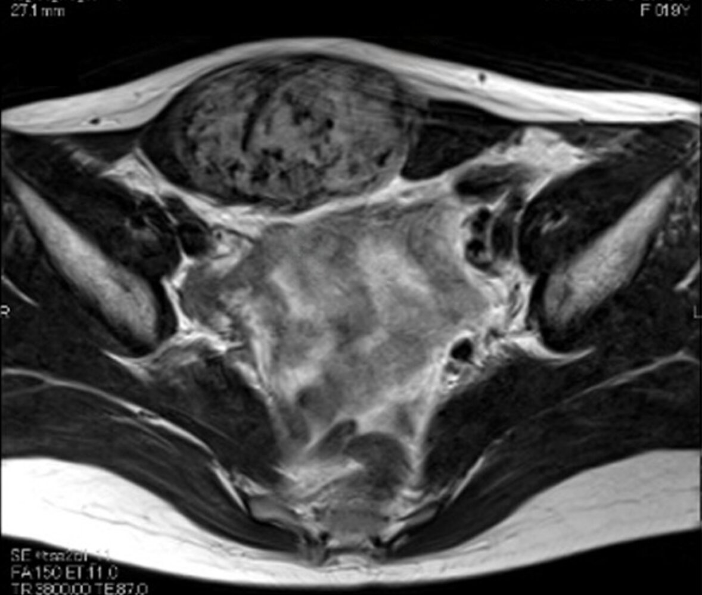
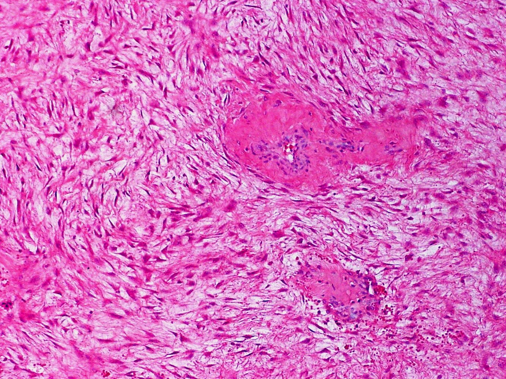
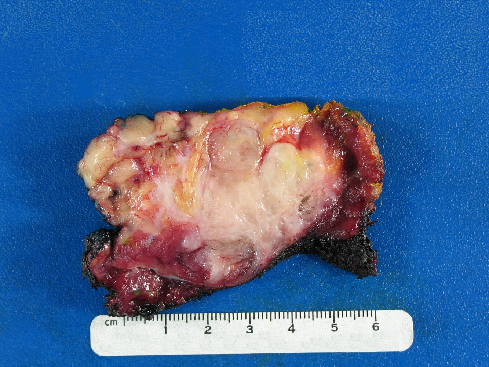

# Desmoid tumors

*Categories: Clinical knowledge > Surgery > Abdominal surgery > General abdominal surgery > Desmoid tumors*

[Original Article Link](https://coursology-qbank.com/amboss/article/ts0X9h)

---

## Summary

Desmoid tumors are slow-growing, mostly benign but locally aggressive tumors caused by the <u>proliferation</u> of <u>fibroblasts</u>. They are often associated with <u>familial adenomatous polyposis</u> and can arise from any part of the body, most commonly the extremities, abdominal wall, and the <u>abdominal cavity</u>. Individuals may be asymptomatic until the tumors grow large enough to compress adjacent structures (e.g., <u>bowel obstruction</u>). Diagnosis includes imaging and requires <u>biopsy</u> with <u>immunohistochemistry</u> for confirmation. Treatment is based on <u>active surveillance</u> with <u>MRI</u>.

---

## Etiology

* <u>Beta-catenin</u>/WNT (CTNNB1 gene) mutation: associated with sporadic development of desmoid tumors (∼ 85 %) [[2]](https://coursology-qbank.com/amboss/article/ue1p0T0)

* <u>APC</u> <u>gene</u> mutation: associated with <u>familial adenomatous polyposis</u> (<u>FAP</u>), specifically <u>Gardner syndrome</u> (∼ 15 %)

* <u>Hyperestrogenic</u> states (e.g., during or following a <u>pregnancy</u>, <u>oral contraceptives</u> use, <u>IVF</u>)

* Repeated trauma (e.g., surgical procedures)

---

## Classification

* According to etiology

* Sporadic

* Familial

* According to location

* Abdominal

* Located in the abdominal wall or <u>rectus abdominis muscle</u>

* Seen in <u>Gardner syndrome</u> and related to <u>pregnancy</u>

* Intraabdominal

* Involves the intestinal <u>mesentery</u> or intrapelvic space

* Commonly seen in <u>Gardner syndrome</u>

* Extraabdominal

* Involves the head and neck regions, thorax, <u>breasts</u>, <u>shoulder girdle</u>, and extremities

* Common in sporadic forms

---

## Clinical features

Clinical findings may vary widely according to age, <u>tumor</u> size, and location.

* Painless mass

* Nerve or muscle compression may cause localized <u>pain</u> or tenderness

* Clinical features of <u>bowel obstruction</u> (e.g., abdominal <u>pain</u>, distention, <u>nausea</u>, <u>vomiting</u>)

Desmoid tumor

---

## Diagnosis

* Imaging: shows infiltration of muscles, deep tissue, and along muscle planes [[1]](https://coursology-qbank.com/amboss/article/8e1O0T0)

* <u>Ultrasound</u>: assessment of palpable masses

* <u>MRI</u>: assessment of tumors of the thorax, abdomen, head, neck, and extremities

* <u>CT scan</u>: assessment of intraabdominal desmoid tumors

* <u>Core needle biopsy</u> (definitive diagnosis) [[1]](https://coursology-qbank.com/amboss/article/8e1O0T0)[[3]](https://coursology-qbank.com/amboss/article/Fe1g0T0)

* <u>Histology</u>: multiple <u>fibroblasts</u> with <u>spindle cell</u> morphology, numerous <u>blood vessels</u>, and poorly defined borders

* <u>Immunohistochemistry</u>: stain for <u>vimentin</u>, <u>smooth muscle</u> <u>actin</u>, and nuclear <u>beta-catenin</u>

* Molecular analysis: <u>CTNNB1</u> or <u>APC</u> mutations

* Other: <u>Colonoscopy</u> and <u>germline</u> testing should be considered if <u>FAP</u> is suspected.

Desmoid tumor

Desmoid tumor

Desmoid-type fibromatosis (desmoid tumor)

---

## Treatment

* First-line [[2]](https://coursology-qbank.com/amboss/article/ue1p0T0)

* <u>Active surveillance</u>

* <u>MRI</u> (alternatively CT, if <u>MRI</u> is not available) within the first 2 months, then in 3–6 months intervals

* Used for primary or recurrent desmoid tumors

* <u>Pain management</u> (<u>NSAIDs</u>)

* Alternatives: Active treatment should be considered only in persistent progression.

* Surgical intervention: sporadic desmoid tumors localized in the abdominal wall

* Medical therapy: sporadic desmoid tumors localized at all other sites and for progressive <u>FAP</u>-associated desmoid tumors

* Antihormonal therapy (e.g., <u>tamoxifen</u>)

* <u>Tyrosine kinase inhibitors</u> (e.g., <u>imatinib</u>, <u>nilotinib</u>, <u>sorafenib</u>)

* <u>Chemotherapy</u> (e.g., low dose <u>methotrexate</u> plus <u>vinblastine</u>)

* Local <u>ablative treatments</u> (e.g., <u>radiotherapy</u>, <u>cryotherapy</u>): determined on an individual basis

---

## Prognosis

* Desmoid tumors are locally aggressive and associated with a high local recurrence rate but lack <u>metastatic</u> potential.

* Unpredictable clinical course (from spontaneous regression to progression and stable chronic disease)

* Desmoid tumors may compress vital organs and disrupt their function with potentially fatal consequences.

---