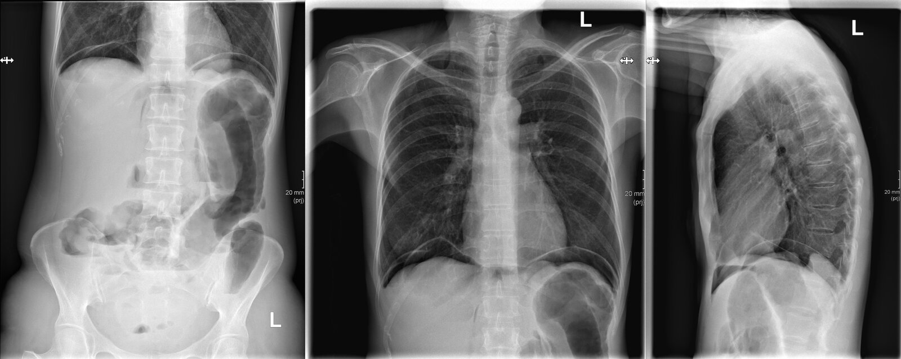
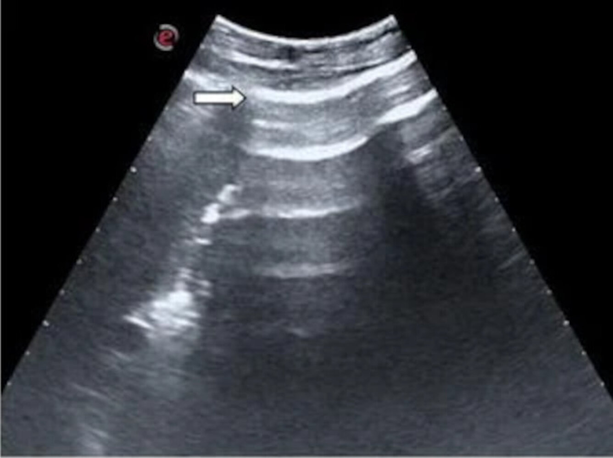
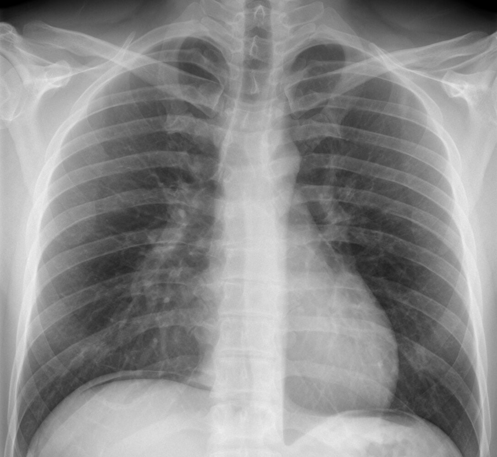
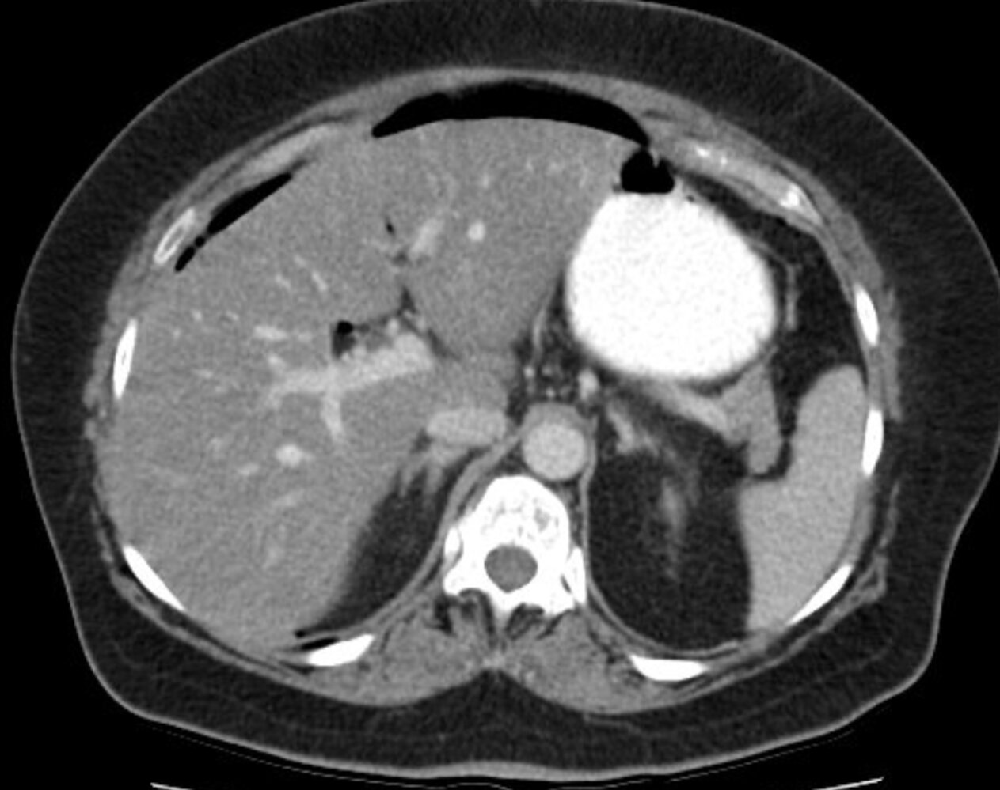
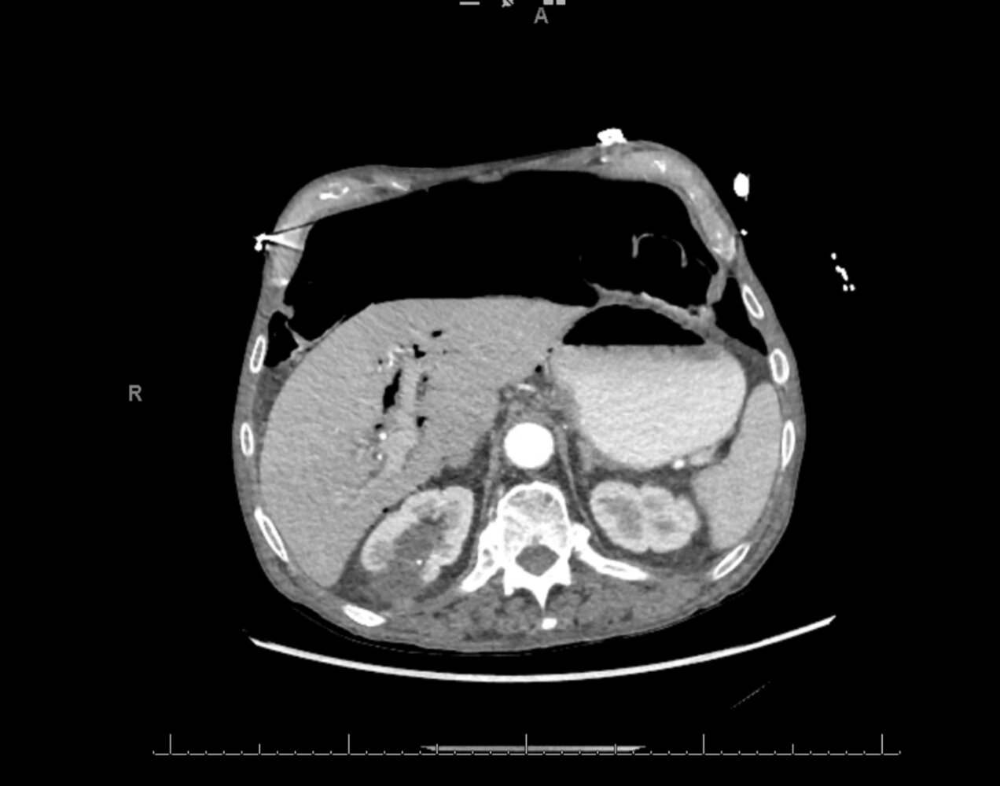
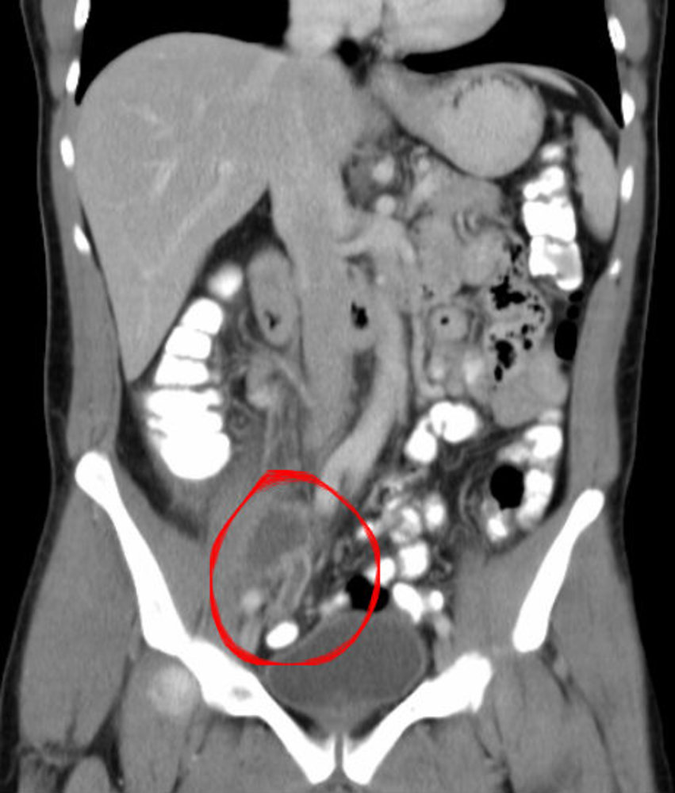

# Gastrointestinal perforation

*Categories: Clinical knowledge > Surgery > Abdominal surgery > General abdominal surgery > Gastrointestinal perforation*

[Original Article Link](https://coursology-qbank.com/amboss/article/pq0LzS)

---

## Summary

Gastrointestinal perforation is a full-thickness loss of bowel wall integrity that results in perforation <u>peritonitis</u>. <u>Perforation of a duodenal ulcer</u> is the most common cause of perforation <u>peritonitis</u>. Patients typically present with an acute onset of severe abdominal <u>pain</u> associated with <u>nausea</u>, <u>vomiting</u>, and <u>fever</u>. Signs of <u>peritoneal</u> irritation are evident on examination and include decreased <u>bowel sounds</u> and diffuse or localized <u>abdominal guarding</u> and <u>rebound tenderness</u>. CT abdomen with IV contrast is the preferred imaging modality to confirm the presence of free air within the <u>peritoneal cavity</u> (<u>pneumoperitoneum</u>) and localize the site of the perforated <u>viscus</u>. Most patients will require an <u>emergency exploratory laparotomy</u>. Patients with evidence of a well-contained perforation (e.g., a small localized appendicular or diverticular perforation) and no <u>signs of sepsis</u> may be given a trial of <u>conservative management</u> with <u>antibiotics</u>, bowel rest, close monitoring of <u>vital signs</u>, and <u>serial abdominal examination</u>. The prognosis depends on the etiology, degree of intraabdominal contamination, and other comorbidities.

See also <u>esophageal perforation</u>.

---

## Etiology

* Ulcerative/erosive disease [[2]](https://coursology-qbank.com/amboss/article/guYFqI)

* <u>Peptic ulcer disease</u>:

* Most common cause of <u>stomach</u> and <u>duodenal</u> perforation [[3]](https://coursology-qbank.com/amboss/article/BBYz17)

* <u>Duodenal ulcers</u> of the <u>anterior</u> wall are more likely to perforate.

* <u>Malignancy</u>

* <u>Inflammatory bowel disease</u>: <u>ulcerative colitis</u>, <u>Crohn disease</u>

* Infections

* <u>Diverticulitis</u> (<u>colonic diverticula</u>, <u>Meckel diverticulum</u>)

* <u>Acute appendicitis</u>

* <u>Typhoid</u>

* <u>Gastrointestinal tuberculosis</u>

* <u>Toxic megacolon</u>

* <u>Bowel ischemia</u>

* <u>Bowel obstruction</u> (i.e., adhesions, <u>volvulus</u>, <u>malignancy</u>)

* <u>Acute mesenteric ischemia</u>

* Trauma

* <u>Penetrating trauma</u> (e.g., <u>stab injury</u>, <u>iatrogenic</u> perforations): e.g., post-<u>ERCP</u> <u>duodenal</u> perforation

* <u>Blunt abdominal trauma</u>

* Miscellaneous

* <u>Foreign body ingestion</u>

* Drug-induced (e.g., <u>NSAIDs</u>, <u>glucocorticoids</u>, <u>cocaine</u>)

* <u>Radiation therapy</u> to the abdominopelvic or lower thoracic region

* Post <u>renal transplant</u>  [[4]](https://coursology-qbank.com/amboss/article/1uY2JI)

---

## Clinical features

* General signs and symptoms

* Sudden onset of abdominal <u>pain</u> and abdominal distention

* <u>Nausea</u>, <u>vomiting</u>, <u>obstipation</u>

* <u>Fever</u>, <u>tachycardia</u>, <u>tachypnea</u>, <u>hypotension</u>

* Signs of <u>peritonitis</u> or <u>shock</u>

* Decreased or absent <u>bowel sounds</u>

* Loss of <u>liver</u> dullness on <u>RUQ</u> percussion

* History suggestive of specific locations 

* Perforated <u>PUD</u>:

* Sudden onset of intense, stabbing <u>pain</u>, followed by <u>diffuse abdominal pain</u> and distention (beginning <u>peritonitis</u>)

* <u>Referred pain</u> to the shoulder due to irritation of the <u>diaphragm</u>, which is innervated by the <u>phrenic nerve</u> (C3-C5); the shoulder <u>skin</u> is innervated by supraclavicular nerves (C3-C4) (see <u>referred pain</u>)

* History of recurrent epigastric <u>pain</u>, chronic use of <u>NSAIDs</u>

* Perforation of chronic <u>ulcers</u> may only cause mild symptoms.

* Perforated <u>diverticulitis</u>: <u>constipation</u>, previous <u>LLQ</u> <u>pain</u>

* <u>Perforated appendicitis</u>: progressively worsening <u>RLQ</u> <u>pain</u>, migratory <u>pain</u>

* Perforated <u>malignancy</u> or <u>IBD</u>: <u>anorexia</u>, weight loss, <u>melena</u>, change in bowel habits

* Localization of <u>pain</u> 

* Diffuse: in patients with free <u>intraperitoneal</u> perforation

* Localized <u>RLQ</u> <u>pain</u>: contained <u>perforated appendicitis</u>

* Localized <u>LLQ</u> <u>pain</u>: contained perforated <u>diverticulitis</u>

> [!TIP]
> Bowel perforation is a surgical emergency. In some cases, clinical features alone are sufficient to warrant emergency <u>explorative laparotomy</u>.

Referred pain of important internal organs

---

## Diagnosis

### <u>Laboratory analysis</u>

* <u>CBC</u>: <u>neutrophilic leukocytosis</u>

* <u>BMP</u>: ↑ <u>BUN</u>, ↑ <u>creatinine</u>

* <u>Blood gas analysis</u>: <u>lactic acidosis</u> (in <u>ischemic</u> perforation)  [[5]](https://coursology-qbank.com/amboss/article/3uYSII)

### Imaging [[6]](https://coursology-qbank.com/amboss/article/GKYB3J)[[7]](https://coursology-qbank.com/amboss/article/huYcII)

#### Immediate studies

* Indications: Consider only for patients too unstable to safely undergo <u>CT scanning</u>.

* <u>X-ray</u> abdomen (upright or <u>lateral</u> <u>decubitus</u>) ;  [[8]](https://coursology-qbank.com/amboss/article/0VceGY0)

* Combine <u>lateral</u> <u>decubitus</u> with upright <u>CXR</u> to increase <u>sensitivity</u>.

* Findings: <u>free intraperitoneal air</u> (<u>pneumoperitoneum</u>) under the <u>diaphragm</u>  and/or between <u>liver</u> and <u>lateral</u> abdominal wall

* <u>Point of care ultrasound</u> (<u>POCUS</u>) for which characteristic findings include: [[9]](https://coursology-qbank.com/amboss/article/WVcPtY0)[[10]](https://coursology-qbank.com/amboss/article/dVcotY0)

* Enhanced <u>peritoneal</u> stripe sign: a hyperechogenic focal thickening of the <u>peritoneum</u>

* Horizontal <u>reverberation</u> artifacts: horizontal stripes resulting from the interface of free air and <u>fascia</u>

> [!WARNING]
> Before an upright <u>x-ray</u>, patients must be sitting up for at least 10 minutes in order to allow free air to move upward and collect under the <u>diaphragm</u>. [[8]](https://coursology-qbank.com/amboss/article/0VceGY0)

#### Confirmatory studies

* First line: CT abdomen and <u>pelvis</u> with IV contrast (most sensitive)

* Indications: acute nonlocalized abdominal <u>pain</u>

* Findings 

* Pneumoperitoneum: the presence of air in the <u>peritoneal cavity</u> 

* An <u>abdominal x-ray</u> showing <u>radiolucent</u> air under the <u>diaphragm</u> and/or the delineation of the bowel wall by <u>radiolucent</u> air is diagnostic.

* Can occur after perforation of a hollow abdominal <u>viscus</u> (e.g., <u>perforated peptic ulcer</u>) or after <u>surgery</u> in which air is introduced into the <u>abdominal cavity</u>.

* Signs of perforated bowel: loss of bowel wall continuity, localized <u>mesenteric</u> <u>fat stranding</u>

* Alternative: <u>formal ultrasound</u> abdomen

* Indication: preferred in patients with contraindications to radiation exposure (e.g., <u>pregnancy</u>)

* Findings: <u>pneumoperitoneum</u>, localized fluid collection, localized thickening of a bowel segment.

Pneumoperitoneum and Pneumoretroperitoneum

Free intraperitoneal air

Enhanced peritoneal stripe sign

Pneumoperitoneum

Pneumoperitoneum

Pneumoretroperitoneum and pneumoperitoneum

Colonic perforation

Pneumoperitoneum

Appendiceal abscess

> [!TIP]
> IV contrast is preferred if bowel perforation is suspected. If oral contrast must be used, a water-soluble contrast agent is preferred.

---

## Treatment

### Initial management

* Bowel rest (<u>NPO</u>)

* <u>IV access</u> with two large-bore <u>peripheral IVs</u>

* Start broad-spectrum IV <u>antibiotics</u>: See “Severe infection” in “<u>Empiric antibiotic therapy for intraabdominal infection</u>.”

* Obtain an urgent surgical consult to determine whether <u>surgery</u> or <u>conservative management</u> is appropriate.

* Patients with <u>signs of sepsis</u> and/or <u>shock</u> additionally require:

* <u>Immediate hemodynamic support</u>, e.g., aggressive <u>IV fluid resuscitation</u>

* Urgent critical care consult

* Begin <u>supportive care</u> (e.g., <u>analgesics</u>, <u>antiemetics</u>).

* Reevaluate frequently (<u>serial abdominal examination</u>, <u>vital signs</u>), as the patient's condition may rapidly deteriorate.

### <u>Supportive care</u>

* <u>NG tube</u> with continuous or intermittent suction

* Consider IV <u>PPI</u>, e.g., <u>pantoprazole</u> DOSAGE for patients with suspected <u>perforated peptic ulcer</u>. [[11]](https://coursology-qbank.com/amboss/article/VxYGvr)

* <u>Parenteral analgesics</u>

* <u>Opioid analgesics</u>  [[12]](https://coursology-qbank.com/amboss/article/iuYJII)

* <u>Morphine</u> DOSAGE

* <u>Meperidine</u> DOSAGE

* <u>Hydromorphone</u> DOSAGE

* <u>Tramadol</u> DOSAGE

* <u>NSAIDs</u>: <u>Diclofenac</u> DOSAGE

* Parenteral <u>antiemetics</u> (see “<u>Antiemetics</u>”)

* <u>Ondansetron</u> DOSAGE

* <u>Promethazine</u> DOSAGE

> [!WARNING]
> <u>Ketorolac</u> is contraindicated in patients with suspected bowel perforation.

> [!WARNING]
> <u>Opioids</u> are contraindicated in patients with suspected <u>bowel obstruction</u>.

### Surgical management [[13]](https://coursology-qbank.com/amboss/article/QxYuwr)

Most patients with <u>GI tract</u> perforation should be managed with urgent <u>explorative laparotomy</u>.

* Indications:

* Signs of generalized <u>peritonitis</u>

* <u>Signs of sepsis</u>

* Procedure: <u>Exploratory laparotomy</u> with midline <u>incision</u> is usually preferred. 

* Obtain <u>peritoneal</u> fluid for cultures.

* Thorough <u>peritoneal lavage</u> with saline  [[14]](https://coursology-qbank.com/amboss/article/ixYJwr)

* Closure of the perforation, if feasible

* <u>Primary closure</u> with/without an <u>omental</u> pedicle

* Resection of the perforated segment of bowel with <u>primary anastomosis</u> or temporary <u>stoma</u> creation

* If <u>perforated appendix</u> identified: Perform an <u>appendectomy</u>.

* If <u>malignancy</u> is identified (e.g., perforated <u>colon cancer</u>):

* Consider curative resection.

* Obtain intraoperative <u>biopsies</u> of the mass if resection is not possible.

* Place <u>peritoneal</u> drains and close the abdomen.

* Postoperative care

* Continue bowel rest, <u>IV fluids</u>, and <u>NG tube</u> with suction until normal bowel function returns (see “<u>conservative management</u>” below).

* Identify and treat the underlying condition.  [[15]](https://coursology-qbank.com/amboss/article/SBayZM)

### <u>Conservative management</u> [[11]](https://coursology-qbank.com/amboss/article/VxYGvr)[[15]](https://coursology-qbank.com/amboss/article/SBayZM)

Patients with only localized <u>peritonitis</u> and no <u>signs of sepsis</u> may be candidates for conservative (nonsurgical) management.

* <u>NPO</u>, maintenance <u>IV fluids</u>, and IV <u>PPI</u> (see “<u>Supportive care</u>” above)

* IV broad-spectrum <u>antibiotics</u>: See “Severe infection” in “<u>Empiric antibiotic therapy for intraabdominal infection</u>”

* If imaging shows evidence of an <u>abscess</u>: Consider <u>image-guided percutaneous drainage</u> of <u>abscess</u>.  [[16]](https://coursology-qbank.com/amboss/article/2xYTDr)

* <u>Serial abdominal examination</u>

* Further management:

* If there are clinical signs of improvement : Obtain an <u>abdominal x-ray</u> with water-soluble contrast to confirm that the perforation has sealed.
* No leakage of contrast: Initiate enteral feeds and switch to oral <u>antibiotics</u>.

* If there are clinical signs of deterioration : <u>exploratory laparotomy</u>

---