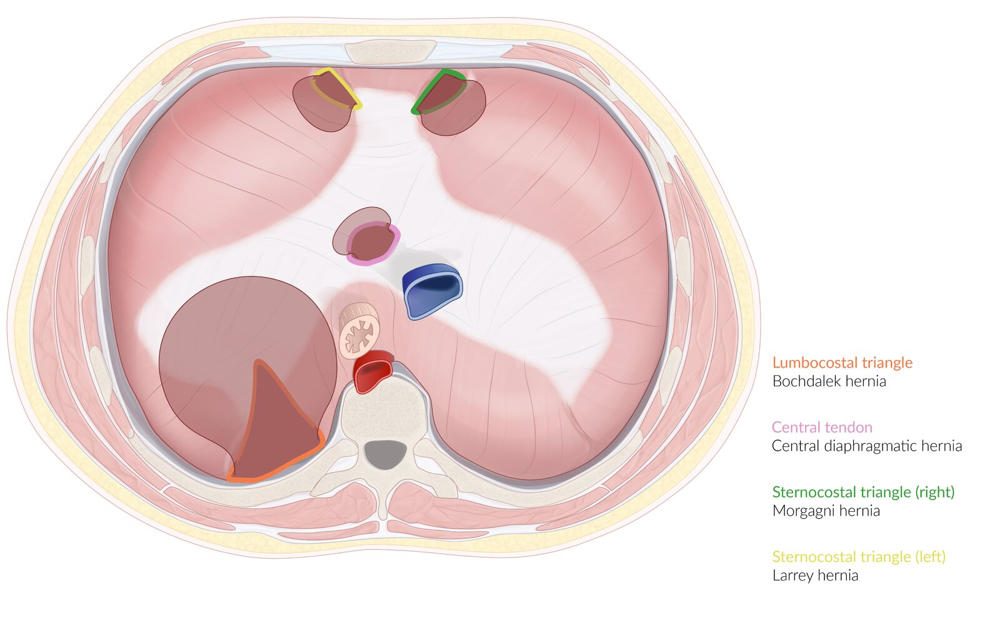
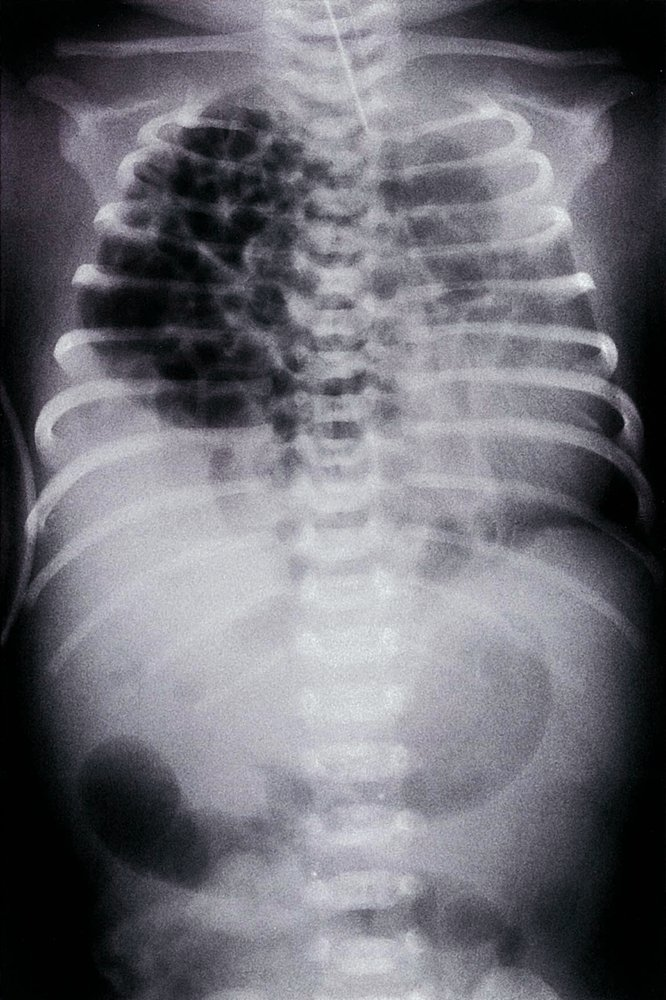
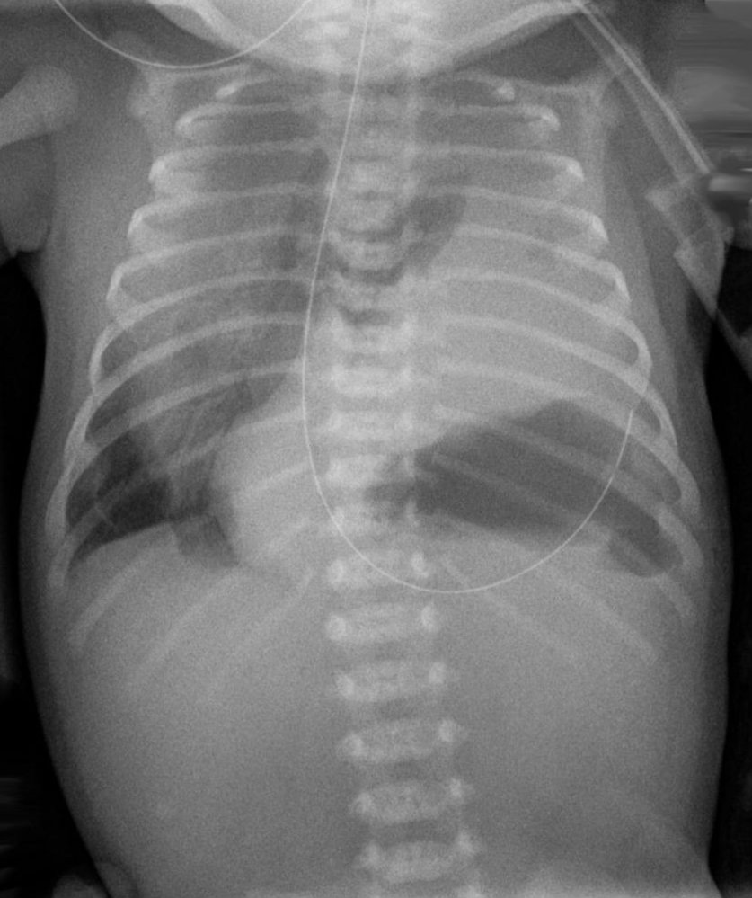
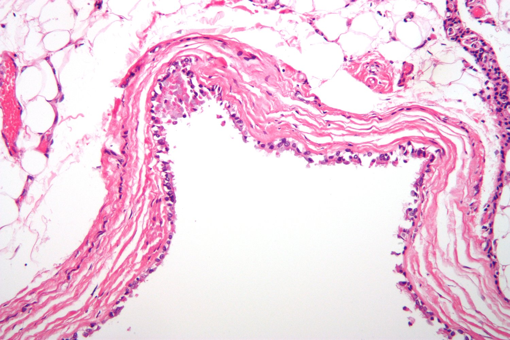

# Congenital diaphragmatic hernias

*Categories: Clinical knowledge > Surgery > Abdominal surgery > Hernias > Congenital diaphragmatic hernias*

[Original Article Link](https://coursology-qbank.com/amboss/article/Ch0qTf)

---

## Summary

A <u>diaphragmatic hernia</u> is the protrusion of intra-abdominal contents through an abnormal opening in the <u>diaphragm</u>. Congenital <u>diaphragmatic hernias</u> (CDH) are a common developmental defect, resulting from an incomplete fusion of embryonic components of the <u>diaphragm</u>. Left-sided postero-<u>lateral</u> diaphragmatic defects (Bochdalek <u>hernias</u>) are the most common, followed by <u>anterior</u> defects (Morgagni <u>hernias</u>). About 50% of babies with CDH have additional congenital <u>malformations</u>. CDH are often diagnosed prenatally on routine antenatal <u>ultrasound</u>. <u>Neonates</u> with CDH present postnatally with <u>respiratory distress</u> and a characteristic absence of breath sounds in the <u>ipsilateral</u> chest. The <u>respiratory distress</u> is due to severe <u>pulmonary hypoplasia</u>, <u>persistent pulmonary hypertension of the newborn</u> (<u>PPHN</u>), and poor <u>surfactant</u> production, all of which are typical characteristics of CDH. Postnatal diagnosis is confirmed on a chest <u>x-ray</u> which reveals abdominal contents in the thorax. <u>Neonates</u> with CDH should be medically stabilized (<u>mechanical ventilation</u>, <u>inotropic</u> support, <u>gastric decompression</u>) before surgical repair, which is then done within the first week of life. Also see our article “<u>Acquired diaphragmatic hernias</u>”.

---

## Etiology

* Impaired development and/or fusion of embryonic structures (<u>pleuroperitoneal membrane</u>) → defect in the <u>diaphragm</u> persists during <u>fetal development</u> → displacement of abdominal contents into the <u>pleural cavity</u> ;   → compression of <u>lung tissue</u>;   → <u>pulmonary hypoplasia</u>

* Types

* Failure of fusion of the <u>septum transversum</u> postero-laterally  with the <u>pleuroperitoneal membranes</u> → Bochdalek hernia. 

* Most common CDH, accounting for 90% of cases.

* Postero-<u>lateral</u> (lumbocostal) CDH (85% are left-sided)

* Failure of fusion of the <u>septum transversum</u> anteriorly with the <u>sternum</u> and <u>ribs</u> → Morgagni hernia (Morgagni-Larrey <u>hernia</u>) 

* Rare: < 5% of CDH

* <u>Anterior</u> (sternocostal/parasternal) CDH (90% are right-sided)

* <u>Infants</u> with <u>Morgagni hernia</u> often present late.

> [!NOTE]
> Because the <u>liver</u> protects the right hemidiaphragm, <u>diaphragmatic hernias</u> most commonly occur on the left side!

Congenital diaphragmatic hernias

[[3]](https://coursology-qbank.com/amboss/article/7304Pf)[[4]](https://coursology-qbank.com/amboss/article/s30tPf)

---

## Clinical features

* Presentation depends on the degree of <u>pulmonary hypoplasia</u> and <u>pulmonary hypertension</u>

* <u>Respiratory distress</u> (e.g., <u>nasal flaring</u>, <u>tachypnea</u>, <u>cyanosis</u>, intercostal <u>retractions</u>, <u>grunting</u>)

* Barrel-shaped chest, scaphoid abdomen (<u>concave</u> <u>anterior abdominal wall</u>), and <u>auscultation</u> of <u>bowel sounds</u> in the chest

* Absent breath sounds on the <u>ipsilateral</u> side

* <u>Mediastinal</u> shift: shift of <u>heart sounds</u>/apex beat to the right side

* Possible syndromic dysmorphism (e.g., craniofacial, spinal dysraphism, cardiac)

---

## Diagnosis

* Antenatal <u>ultrasound</u>[[5]](https://coursology-qbank.com/amboss/article/G30BPf): most cases are diagnosed on routine antenatal <u>ultrasound</u>[[3]](https://coursology-qbank.com/amboss/article/7304Pf)

* Fluid-filled <u>stomach</u>/bowel seen in the thorax

* <u>Peristalsis</u> may also be noted in the chest, confirming the diagnosis.

* Esophageal compression can cause <u>polyhydramnios</u>

* <u>Hydrops fetalis</u> may also be seen in severe cases

* Chest <u>x-ray</u>

* Abdominal contents, air/fluid-filled bowel, and poorly aerated <u>lung</u> in the <u>ipsilateral</u> hemithorax

* <u>Mediastinal</u> shift to the right and compression of the <u>contralateral</u> <u>lung</u>

* In doubtful cases, a naso-gastric tube is inserted and a <u>chest radiograph</u> is taken: the <u>feeding tube</u> will be seen in the thorax.

* In right-sided CDH: the <u>liver</u> appears as an intrathoracic <u>soft tissue</u> mass + absence of the normal intra-abdominal <u>liver</u> shadow

Right diaphragmatic hernia with enterothorax

Left-sided congenital diaphragmatic hernia

> [!WARNING]
> Avoid <u>pleurocentesis</u> in a suspected <u>diaphragmatic hernia</u> because of the risk of <u>bowel perforation</u>, which is suggested by <u>bile</u> in the <u>chest tube</u>!

---

## Differential diagnoses

* Prenatal CDH 

* Congenital diaphragmatic eventration: not a true <u>hernia</u>, but rather an outpouching or abnormal elevation of a portion of the hemidiaphragm; no break in diaphragmatic tissue

* Bronchogenic cysts

* Definition: a congenital <u>malformation</u> of the <u>lungs</u> that arises during <u>embryonic development</u>. The cysts may be intrapulmonary or located within the <u>mediastinum</u>.

* Pathogenesis: abnormal <u>budding</u> of the <u>ventral</u> <u>foregut</u> → dilation of the terminal or large <u>bronchi</u> → unilateral or bilateral unilocular cysts

* Clinical features

* Usually asymptomatic

* In some cases, failure to drain can cause <u>airway</u> compression with significant <u>respiratory distress</u> or recurrent respiratory tract infections.

* Diagnostics
* Chest <u>x-ray</u>: discrete, round, and sharply defined fluid-filled densities; infection indicated by air <u>inclusions</u>

* Congenital pulmonary airway malformation (<u>CPAM</u>) [[6]](https://coursology-qbank.com/amboss/article/GacBNa0)

* Previously known as <u>congenital cystic adenomatoid malformation</u> (<u>CCAM</u>)

* Features cystic and/or adenomatous pulmonary lesions

* Diagnosed via <u>prenatal ultrasound</u>

* Management involves <u>steroids</u> and drainage and/or surgical removal of cysts

* Pulmonary <u>agenesis</u>

* Tumors in the <u>anterior</u>/<u>posterior mediastinum</u> (e.g., <u>teratomas</u>, <u>neurofibroma</u>, <u>pheochromocytoma</u>, <u>neuroblastoma</u>, etc.)

* <u>Pulmonary sequestration</u> <u>lung tissue</u> that is not connected to the tracheobronchial tree

* Postnatal CDH

* Other causes of <u>pulmonary hypoplasia</u> (e.g., <u>oligohydramnios</u>, <u>renal hypoplasia</u>)

* Other <u>causes of pulmonary hypertension</u> of the <u>newborn</u> (e.g., <u>meconium</u> <u>aspiration</u>)

Bronchogenic cyst

The differential diagnoses listed here are not exhaustive.

---

## Treatment

* Prenatally diagnosed CDH: antenatal <u>glucocorticoids</u>

* Postnatal therapy

* Initial medical resuscitation

* Correction of <u>hypoxia</u>

* <u>Intubation</u> and <u>mechanical ventilation</u>: indicated in all <u>infants</u> with CDH

* <u>Extracorporeal life support</u> (<u>ECLS</u>): A <u>heart</u>-<u>lung</u> bypass pump that circulates the <u>infant</u>'s blood through an artificial <u>lung</u> and then back into the bloodstream.

* Indicated in <u>infants</u> who do not improve on <u>mechanical ventilation</u>/have persistent <u>hypoxia</u> or <u>acidosis</u>

* Contraindicated in <u>infants</u> with large/expanding <u>intracranial hemorrhages</u>, as <u>ECLS</u> requires anticoagulation

* <u>Gastric decompression</u>: <u>insertion of a nasogastric tube</u> and continuous suction

* <u>Inotropic</u> support may be required to maintain blood pressure

* <u>Surfactant</u> administration: in <u>infants</u> born < 34 weeks of <u>gestation</u> and <u>x-ray</u> findings suggesting <u>neonatal respiratory distress syndrome</u>

* Surgical repair (<u>thoracotomy</u> or <u>laparotomy</u>)

* Indicated in all cases of CDH

* Timing: after the <u>infant</u> is stabilized, often after 24–48 hours

* Procedure: reduction of the hernial contents and <u>primary closure</u> of the defect

---