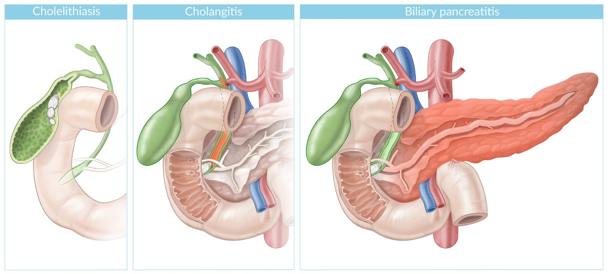
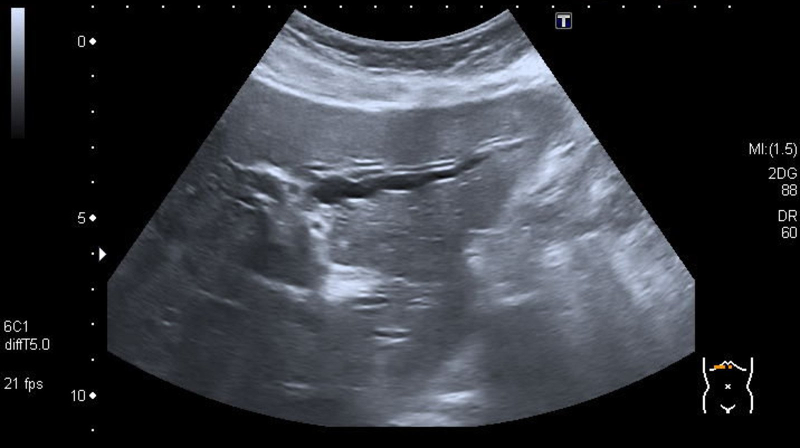
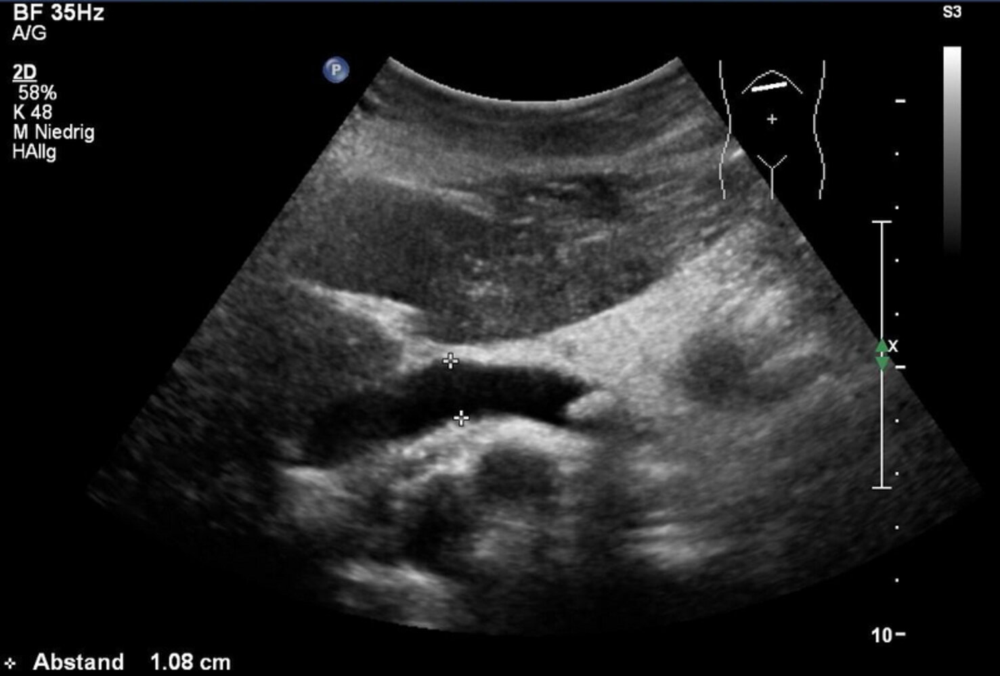
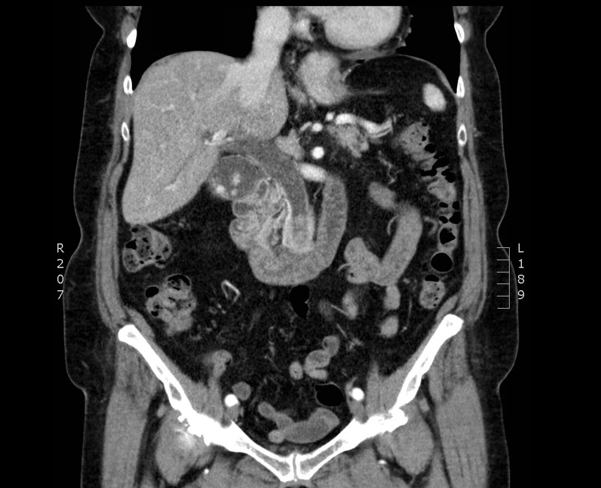
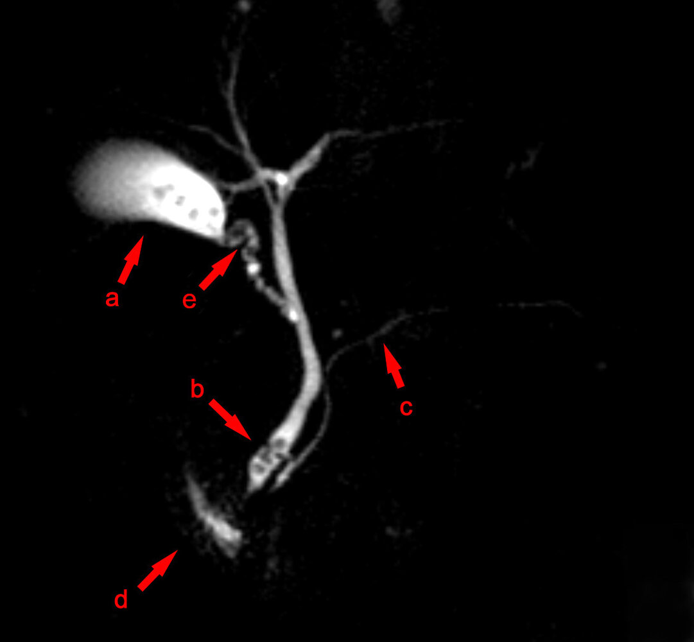

# Acute cholangitis

*Categories: Clinical knowledge > Surgery > Abdominal surgery > Pancreas, liver, and bile ducts > Acute cholangitis*

[Original Article Link](https://coursology-qbank.com/amboss/article/Qq0uyS)

---

## Summary

Acute cholangitis (ascending cholangitis) refers to a bacterial infection of the <u>biliary tract</u>, typically secondary to <u>biliary obstruction</u> and stasis (e.g., due to <u>choledocholithiasis</u>, <u>biliary stricture</u>). <u>Charcot triad</u>, which consists of <u>RUQ</u> <u>pain</u>, <u>fever</u>, and <u>jaundice</u>, is the classical clinical manifestation of acute cholangitis though not all patients manifest with the triad. The diagnosis of acute cholangitis is based on a combination of characteristic clinical features, evidence of systemic inflammation (i.e., <u>leukocytosis</u>, ↑ <u>CRP</u>), and evidence of <u>cholestasis</u> (e.g., elevated <u>direct bilirubin</u>, <u>GGT</u>, and <u>ALP</u>). Imaging is primarily used to identify the underlying cause of <u>biliary obstruction</u>. <u>Empiric antibiotic therapy</u> and urgent biliary drainage (e.g., <u>ERCP + papillotomy</u>, <u>EUS</u>-guided biliary drainage) within 48 hours of presentation are the mainstays of treatment. Treatment of the underlying cause (e.g., <u>ERCP</u>-guided stone extraction or <u>CBD</u> <u>stenting</u>) may be performed at the same time as urgent biliary drainage in stable patients with mild cholangitis or deferred until clinical improvement in patients with severe cholangitis.

See also “<u>Cholelithiasis</u>”, “<u>Choledocholithiasis</u>”, and “<u>Acute cholecystitis</u>.”

---

## Pathophysiology

* <u>Biliary tract obstruction</u> → <u>bile</u> stasis with increased intraductal pressure → bacterial translocation into the <u>bile</u> ducts  ; → bacterial infection ascends the <u>biliary tract</u> (even into the hepatic ducts) ;  [[2]](https://coursology-qbank.com/amboss/article/KjbUYF)
* Causes

* <u>Choledocholithiasis</u> (most common) [[2]](https://coursology-qbank.com/amboss/article/KjbUYF)[[3]](https://coursology-qbank.com/amboss/article/vMYAqp)

* <u>Biliary strictures</u>

* Congenital

* Infectious (e.g., <u>HIV</u>)

* Inflammatory (e.g., <u>primary sclerosing cholangitis</u>, <u>IgG4-related sclerosing cholangitis</u>)

* <u>Iatrogenic</u> (e.g., <u>ERCP</u>, <u>stent</u> placement)

* Malignant obstruction (e.g., due to <u>cholangiocarcinoma</u>, <u>pancreatic cancer</u>, etc)

* Extrinsic compression (e.g., <u>Mirizzi syndrome</u>)

* Parasitic infection (e.g., <u>liver</u> <u>fluke</u>, <u>hydatid cyst</u>, <u>Ascaris</u> spp.)

* <u>Acute pancreatitis</u>

* Periampullary <u>duodenal</u> diverticulum [[2]](https://coursology-qbank.com/amboss/article/KjbUYF)

* Contamination of <u>bile</u> with intestinal contents

* Manipulation of the <u>biliary tract</u> (e.g., <u>papillotomy</u>, <u>stent</u> placement, <u>ERCP</u>, <u>liver transplantation</u>)

* <u>Biliary-enteric fistula</u>  [[4]](https://coursology-qbank.com/amboss/article/9lYN_6)

Cholelithiasis, cholangitis, and biliary pancreatitis

---

## Clinical features

* Charcot cholangitis triad (25–70% of patients present with all three features) ;  [[1]](https://coursology-qbank.com/amboss/article/TlY6w6)[[5]](https://coursology-qbank.com/amboss/article/MQbM9t)

* Abdominal <u>pain</u> (most commonly <u>RUQ</u>)

* High <u>fever</u>

* <u>Jaundice</u> (least common feature)

* Reynolds pentad; : <u>Charcot cholangitis triad</u> PLUS <u>hypotension</u> and mental status changes

* <u>Features of sepsis</u>, <u>septic shock</u>, and <u>multiorgan dysfunction</u> may be present, depending on the severity of disease at presentation.

* Elderly patients may present with nonspecific symptoms such as confusion; <u>pain</u> and <u>jaundice</u> may be absent. [[6]](https://coursology-qbank.com/amboss/article/PgcWvb0)

> [!WARNING]
> Acute cholangitis may present atypically, particularly in older patients. A high index of suspicion is required to avoid delays in diagnosis and treatment. [[6]](https://coursology-qbank.com/amboss/article/PgcWvb0)[[7]](https://coursology-qbank.com/amboss/article/jgc_Eb0)

---

## Diagnosis

Acute cholangitis is diagnosed based on systemic signs of inflammation (<u>fever</u>, <u>leukocytosis</u>, ↑ <u>CRP</u>) in combination with signs of <u>cholestasis</u> (<u>jaundice</u>, ↑ <u>GGT</u>, ↑ <u>ALP</u>) and/or characteristic imaging findings (e.g., dilated <u>CBD</u>, periductal inflammation). Once the diagnosis is confirmed, disease severity should be assessed to determine the best approach to management (see “<u>Severity grading of acute cholangitis</u>”).

### Diagnostic criteria  [[8]](https://coursology-qbank.com/amboss/article/DMY1Ip)[[9]](https://coursology-qbank.com/amboss/article/NrY-hq)

<u>Charcot triad</u> is not included in the diagnostic criteria because, although specific, it is not a sensitive criterion and may even be absent in patients with acute cholangitis. [[8]](https://coursology-qbank.com/amboss/article/DMY1Ip)

|  Diagnostic criteria for acute cholangitis  [[10]](https://coursology-qbank.com/amboss/article/tMYXqp)  |  |  |
| --- | --- | --- |
| Systemic signs of inflammation |   * <u>Fever</u> and/or chills with <u>rigors</u>  * Laboratory findings: ↑ <u>WBC</u>, <u>CRP</u>    |  |
| Signs of <u>cholestasis</u> |   * <u>Jaundice</u>  * <u>LFTs</u>: signs of <u>cholestasis</u> (↑ <u>bilirubin</u>, ↑ <u>GGT</u>, ↑ <u>ALP</u>, ↑ <u>ALT</u>)    |  |
| Imaging findings |   * Biliary dilatation  * Evidence of underlying etiology (e.g., <u>choledocholithiasis</u>, <u>biliary stricture</u>, biliary <u>stent</u>, etc.)    |  |
|  Interpretation   * Suspected diagnosis: ≥ 1 sign of inflammation PLUS either ≥ 1 sign of <u>cholestasis</u> OR ≥ 1 characteristic imaging findings  * Definite diagnosis: ≥ 1 sign of inflammation PLUS ≥ 1 sign of <u>cholestasis</u> PLUS ≥ 1 characteristic imaging findings     |  |  |

### <u>Laboratory studies</u> [[1]](https://coursology-qbank.com/amboss/article/TlY6w6)[[4]](https://coursology-qbank.com/amboss/article/9lYN_6)[[8]](https://coursology-qbank.com/amboss/article/DMY1Ip)[[9]](https://coursology-qbank.com/amboss/article/NrY-hq)

* Tests to support the <u>clinical diagnosis</u>

* <u>CBC</u>: <u>leukocytosis</u> with <u>left shift</u>

* <u>CRP</u>: elevated

* <u>LFTs</u>: signs of <u>cholestasis</u> (↑ <u>bilirubin</u>, ↑ <u>GGT</u>, ↑ <u>ALP</u>, ↑<u>ALT</u>)

* <u>Blood cultures</u> (2 sets): obtain before administering <u>antibiotics</u> (especially in <u>febrile</u> patients).  [[1]](https://coursology-qbank.com/amboss/article/TlY6w6)

* <u>Bile</u> cultures: obtain during biliary drainage procedure [[9]](https://coursology-qbank.com/amboss/article/NrY-hq)

* Tests to assess severity of disease (see “<u>Severity grading of acute cholangitis</u>”)

* <u>Blood gas analysis</u>: <u>PaO2/FiO2</u> <u>ratio</u> < 300 in severely ill patients

* <u>BMP</u>: <u>AKI</u>, <u>electrolyte</u> derangements in patients with severe disease

* <u>PT</u>/<u>INR</u>: <u>coagulopathy</u> in patients with severe disease

* Tests to evaluate differential diagnoses

* Consider serum <u>lipase</u> levels to assess for concurrent <u>biliary pancreatitis</u> in patients with suspected <u>common bile duct</u> obstruction.

* See also “<u>Diagnostic workup of acute abdominal pain</u>.”

> [!WARNING]
> Atypical presentations are common in elderly patients. Consider obtaining <u>liver chemistries</u> to evaluate for acute cholangitis in acutely ill elderly patients with nonspecific symptoms. [[6]](https://coursology-qbank.com/amboss/article/PgcWvb0)

### Imaging [[8]](https://coursology-qbank.com/amboss/article/DMY1Ip)[[9]](https://coursology-qbank.com/amboss/article/NrY-hq)[[11]](https://coursology-qbank.com/amboss/article/9IYNUq)[[12]](https://coursology-qbank.com/amboss/article/03beSt)

Acute cholangitis cannot be diagnosed with imaging alone. The goal of imaging is to evaluate for <u>biliary obstruction</u> that may have precipitated cholangitis. [[8]](https://coursology-qbank.com/amboss/article/DMY1Ip)

#### <u>RUQ</u> <u>ultrasound</u>

* Indication: : preferred first-line imaging modality in patients presenting with suspected cholangitis [[8]](https://coursology-qbank.com/amboss/article/DMY1Ip)[[11]](https://coursology-qbank.com/amboss/article/9IYNUq)[[12]](https://coursology-qbank.com/amboss/article/03beSt)

* Supportive findings

* Dilated <u>common bile duct</u>: See ''<u>Diagnosis of choledocholithiasis</u>” for details.

* Dilated intrahepatic <u>bile</u> ducts: indicates obstructive <u>cholestasis</u>

* Thickened <u>bile</u> duct walls  [[13]](https://coursology-qbank.com/amboss/article/oQb0Ct)

* Evidence of underlying etiology, such as:

* <u>Choledocholithiasis</u>: occluding <u>CBD stone</u> with/without <u>cholelithiasis</u> may be visualized  [[14]](https://coursology-qbank.com/amboss/article/wlYh_6)

* <u>Biliary stricture</u>: focal narrowing of the <u>bile</u> duct(s), with dilation of the <u>proximal</u> biliary tree

* Biliary <u>tumor</u>: intraluminal mass within the <u>bile</u> duct

> [!WARNING]
> <u>RUQ</u> <u>ultrasound</u> is not sufficiently sensitive to definitively rule out <u>biliary obstruction</u>. Obtain <u>cross-sectional imaging</u> (i.e., CT abdomen or <u>MRCP</u>) in patients with a high <u>pretest probability</u> of acute cholangitis and a negative <u>RUQ</u> <u>ultrasound</u>. [[8]](https://coursology-qbank.com/amboss/article/DMY1Ip)

Dilated intrahepatic bile ducts (double-barrel shotgun sign)

Dilated intrahepatic bile duct (double-barrel shotgun sign)

Choledocholithiasis

#### <u>CT scan</u> with IV contrast [[11]](https://coursology-qbank.com/amboss/article/9IYNUq)[[12]](https://coursology-qbank.com/amboss/article/03beSt)[[13]](https://coursology-qbank.com/amboss/article/oQb0Ct)

* Indications [[8]](https://coursology-qbank.com/amboss/article/DMY1Ip)

* Confirmatory imaging modality if <u>ultrasound</u> is inconclusive

* To rule out differential diagnoses if the <u>clinical diagnosis</u> is unclear

* Supportive findings [[13]](https://coursology-qbank.com/amboss/article/oQb0Ct)

* Concentric thickening and heterogeneous <u>enhancement</u> of the walls of the biliary tree  [[15]](https://coursology-qbank.com/amboss/article/pQbLCt)

* <u>Bile</u> duct dilation

* Periductal <u>edema</u>

* Evidence of underlying cause: <u>choledocholithiasis</u>, biliary <u>tumor</u> , <u>biliary-enteric fistula</u>, <u>hydatid cyst</u>, etc.

* Evidence of complications: pericholecystic or <u>liver abscess</u>, <u>portal vein thrombosis</u>.

Choledocholithiasis with biliary obstruction

#### <u>MRI</u> abdomen without and with IV contrast with <u>MRCP</u>

* Indication: an alternative confirmatory imaging modality if <u>ultrasound</u> is inconclusive  [[8]](https://coursology-qbank.com/amboss/article/DMY1Ip)[[11]](https://coursology-qbank.com/amboss/article/9IYNUq)[[12]](https://coursology-qbank.com/amboss/article/03beSt)[[16]](https://coursology-qbank.com/amboss/article/6QbjCt)

* Supportive findings: similar to CT findings

Cholelithiasis and choledocholithiasis (MRCP)

---

## Treatment

<u>Empiric antibiotic therapy</u> and urgent biliary drainage are the mainstays of <u>treatment of acute cholangitis</u>. The choice and timing of both biliary drainage and any procedure to treat the underlying cause are dictated by the severity of the disease at presentation (see “<u>Severity grading of acute cholangitis</u>”).

### Initial management [[2]](https://coursology-qbank.com/amboss/article/KjbUYF)[[9]](https://coursology-qbank.com/amboss/article/NrY-hq)[[17]](https://coursology-qbank.com/amboss/article/5mYiTp)[[18]](https://coursology-qbank.com/amboss/article/6DYj2r)

* Stabilize the patient as needed.

* Identify and <u>treat sepsis</u>.

* Provide <u>immediate hemodynamic support</u> (e.g., <u>IV fluid resuscitation</u>) and <u>respiratory support</u> (e.g., <u>mechanical ventilation</u>) if necessary.

* Administer <u>empiric antibiotic therapy for acute biliary infection</u> to all patients.

* <u>Grade III acute cholangitis</u>: within one hour of presentation [[17]](https://coursology-qbank.com/amboss/article/5mYiTp)

* Grade I–II acute cholangitis: within 4–6 hours of presentation [[2]](https://coursology-qbank.com/amboss/article/KjbUYF)[[17]](https://coursology-qbank.com/amboss/article/5mYiTp)

* Determine the need and timing for urgent biliary drainage and treatment of the underlying cause, based on <u>severity grading for acute cholangitis</u> (see “Definitive management”).

* Identify and treat concurrent <u>choledocholithiasis</u> (see “<u>Diagnosis of choledocholithiasis</u>”).

* Provide initial supportive therapy for acute biliary disease: e.g., <u>analgesics</u> (preferably <u>NSAIDs</u>), <u>antiemetics</u>, <u>nasogastric tube insertion</u> as needed, <u>electrolyte repletion</u>

* Keep patients <u>NPO</u>.

* Consult gastroenterology, interventional radiology, and/or <u>surgery</u> for urgent biliary drainage and decompression.

> [!TIP]
> Initiate supportive therapy and <u>broad-spectrum antibiotics</u> as early as possible!

### Definitive management [[8]](https://coursology-qbank.com/amboss/article/DMY1Ip)[[9]](https://coursology-qbank.com/amboss/article/NrY-hq)[[18]](https://coursology-qbank.com/amboss/article/6DYj2r)[[19]](https://coursology-qbank.com/amboss/article/xQbEyt)

#### Approach

* <u>Grade I acute cholangitis</u>

* <u>Antibiotic therapy</u> alone may be sufficient.

* Consider urgent biliary drainage within 24–48 hours of presentation in patients with either of the following:

* No response to <u>antibiotic therapy</u> within 24 hours

* <u>Choledocholithiasis</u>

* Underlying cause

* If <u>antibiotics</u> are given alone: Treat electively, after acute symptoms resolve.

* If biliary drainage is performed: Treat concurrently (i.e., a single-stage procedure).

* <u>Grade II acute cholangitis</u>

* Urgent biliary drainage within 24–48 hours of presentation

* Underlying cause 

* Treat concurrently with biliary drainage (i.e., a single-stage procedure)

* OR treat electively, after the patient improves with biliary drainage (i.e., a two-stage procedure)

* <u>Grade III acute cholangitis</u>

* Urgent biliary drainage within 24 hours of presentation  [[9]](https://coursology-qbank.com/amboss/article/NrY-hq)[[20]](https://coursology-qbank.com/amboss/article/AzYRv7)

* Treat the underlying cause once the patient's condition improves after urgent biliary drainage (i.e., a two-stage procedure)

> [!WARNING]
> Urgent drainage of infected <u>bile</u> is imperative in order to achieve rapid source control in patients with grade II–III acute cholangitis.

#### Procedures for biliary drainage  [[18]](https://coursology-qbank.com/amboss/article/6DYj2r)[[21]](https://coursology-qbank.com/amboss/article/yQbdAt)

* Therapeutic <u>ERCP</u>-guided transpapillary biliary drainage

* Indication: preferred biliary drainage procedure in acute cholangitis [[1]](https://coursology-qbank.com/amboss/article/TlY6w6)[[9]](https://coursology-qbank.com/amboss/article/NrY-hq)[[21]](https://coursology-qbank.com/amboss/article/yQbdAt)

* Procedures

* <u>ERCP</u> with <u>papillotomy</u> (sphincterotomy): Consider in patients with grade I–II acute cholangitis with no evidence of <u>coagulopathy</u>.  ][[18]](https://coursology-qbank.com/amboss/article/6DYj2r)[[22]](https://coursology-qbank.com/amboss/article/ZjbZ_t)

* <u>ERCP</u> with temporary biliary <u>stenting</u>: Consider in patients with grade III acute cholangitis, uncorrected <u>coagulopathy</u>, <u>biliary stricture</u>, or <u>cholangiocarcinoma</u>.  [[1]](https://coursology-qbank.com/amboss/article/TlY6w6)[[2]](https://coursology-qbank.com/amboss/article/KjbUYF)[[18]](https://coursology-qbank.com/amboss/article/6DYj2r)

* <u>EUS</u>-guided biliary drainage [[18]](https://coursology-qbank.com/amboss/article/6DYj2r)[[22]](https://coursology-qbank.com/amboss/article/ZjbZ_t)[[23]](https://coursology-qbank.com/amboss/article/-QbDAt)

* Indications

* Second-line procedure if <u>ERCP</u>-guided drainage is unsuccessful

* Second-line procedure if balloon-<u>enteroscopy</u>-assisted <u>ERCP</u> is not feasible in patients with altered upper gastrointestinal anatomy

* Procedure: Under <u>EUS</u> guidance, a <u>fistula</u> is created and a <u>stent</u> placed between the <u>stomach</u>/<u>duodenum</u> and the <u>CBD</u>/(dilated) hepatic duct to allow for internal biliary drainage.

* Others

* <u>Double balloon enteroscopy</u>-assisted <u>ERCP</u> [[18]](https://coursology-qbank.com/amboss/article/6DYj2r)[[24]](https://coursology-qbank.com/amboss/article/Xjb9_t)

* Indication: preferred procedure for biliary drainage in patients with altered upper gastrointestinal anatomy, if endoscopy expertise is available

* Procedure: An enteroscope is used to maneuver through the gastroenteric/enteroenteric <u>anastomosis</u> until the <u>duodenal</u> <u>papilla</u> is identified; after which <u>ERCP</u>-guided <u>papillotomy</u> or <u>stenting</u> may be performed.

* Percutaneous transhepatic biliary drainage (<u>PTBD</u>)  [[18]](https://coursology-qbank.com/amboss/article/6DYj2r)

* Indication: <u>EUS</u>-guided drainage unsuccessful or not feasible

* Procedure: A catheter is passed through the <u>liver</u> using of the <u>Seldinger technique</u> under <u>ultrasound</u> guidance and placed into an intrahepatic <u>bile</u> duct to allow for external biliary drainage.

* Surgical choledochotomy with <u>T-tube</u> biliary drainage [[18]](https://coursology-qbank.com/amboss/article/6DYj2r)[[25]](https://coursology-qbank.com/amboss/article/lSbv-G)

* Indication: Consider if minimally invasive endoscopic and percutaneous biliary drainage procedures are unsuccessful or not feasible

* Procedure: The <u>CBD</u> is opened laparoscopically or via open <u>surgery</u> (choledochotomy), a <u>T-tube</u> placed within the <u>CBD</u>, and the choledochotomy closed around the <u>T-tube</u>. The long limb of the <u>T-tube</u> is brought out through the abdominal wall to allow for external biliary drainage.  [[26]](https://coursology-qbank.com/amboss/article/cjbazt)

> [!TIP]
> <u>Bile</u> obtained during the biliary drainage procedure should be sent for <u>culture and sensitivity</u>, and <u>antibiotic therapy</u> tailored accordingly.

#### Procedures for treatment of the underlying cause [[9]](https://coursology-qbank.com/amboss/article/NrY-hq)

* For <u>choledocholithiasis</u> [[2]](https://coursology-qbank.com/amboss/article/KjbUYF)

* <u>ERCP</u>-guided stone extraction (see ''Treatment'' in “<u>Choledocholithiasis</u>” for details)

* Elective <u>interval cholecystectomy</u>: ∼ 6 weeks after the resolution of acute symptoms to minimize the risk of recurrence [[27]](https://coursology-qbank.com/amboss/article/FlagAk)

* For <u>biliary stricture</u>: <u>ERCP</u> and <u>CBD</u> <u>stenting</u>

* For parasitic infections (rare): <u>ERCP</u>-guided <u>parasite</u> extraction and anthelmintics [[28]](https://coursology-qbank.com/amboss/article/Njb-0F)[[29]](https://coursology-qbank.com/amboss/article/mjbVaF)

* See also “<u>Mirizzi syndrome</u>”, “<u>Biliary-enteric fistula</u>”, and “<u>Cholangiocarcinoma</u>.”

### Disposition [[9]](https://coursology-qbank.com/amboss/article/NrY-hq)

All patients require inpatient management.

* <u>Grade I acute cholangitis</u>: <u>healthcare facility</u> with access to biliary drainage

* <u>Grade II acute cholangitis</u>: advanced <u>healthcare facility</u> with access to urgent biliary drainage

* <u>Grade III acute cholangitis</u>: same as for grade II and access to intensive care

---

## Complications

* <u>Sepsis</u>, <u>septic shock</u>, <u>MODS</u>

* <u>Pyogenic liver abscess</u>

* Pericholecystic <u>abscess</u>

* <u>Biliary stricture</u>

We list the most important complications. The selection is not exhaustive.

---